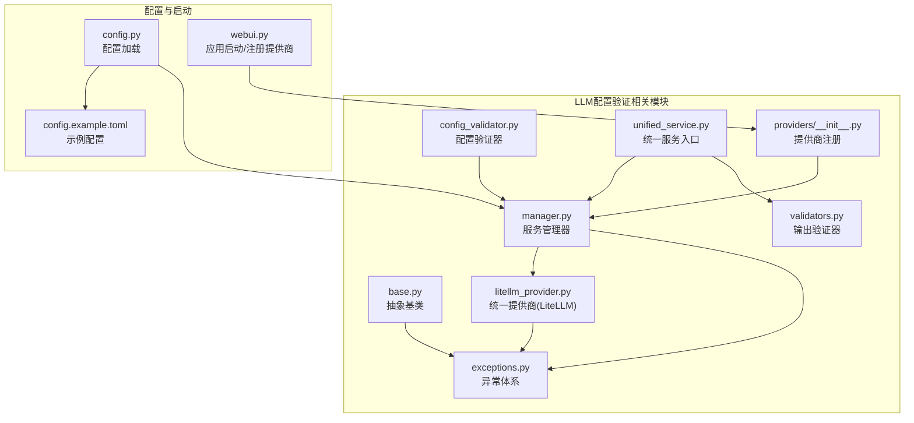
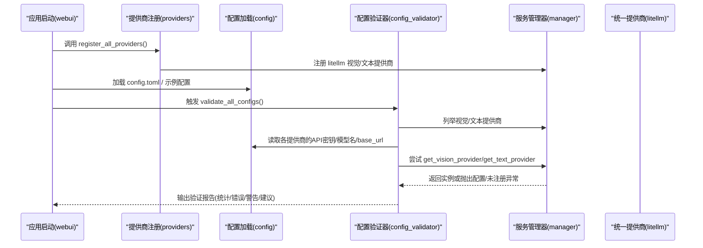
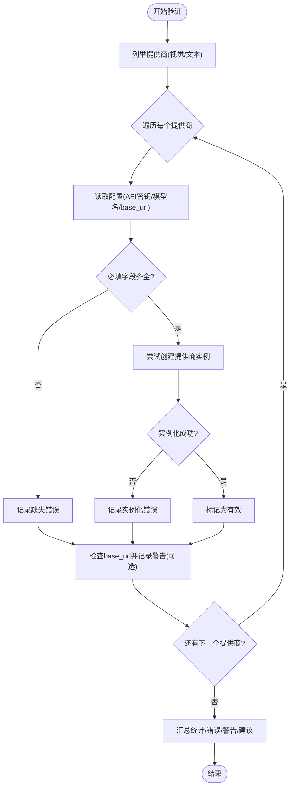
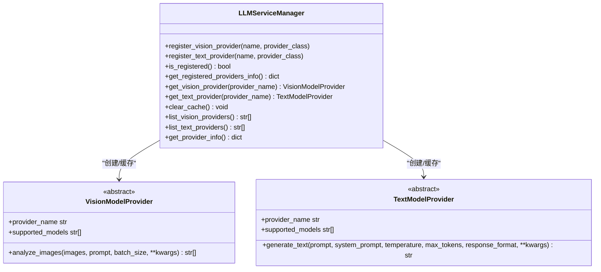
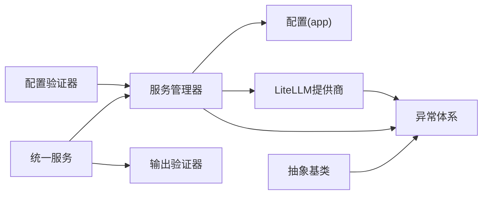

# 配置验证系统

<cite>
**本文引用的文件**
- [config_validator.py](file://app/services/llm/config_validator.py)
- [validators.py](file://app/services/llm/validators.py)
- [base.py](file://app/services/llm/base.py)
- [manager.py](file://app/services/llm/manager.py)
- [unified_service.py](file://app/services/llm/unified_service.py)
- [exceptions.py](file://app/services/llm/exceptions.py)
- [config.py](file://app/config/config.py)
- [config.example.toml](file://config.example.toml)
- [litellm_provider.py](file://app/services/llm/litellm_provider.py)
- [providers/__init__.py](file://app/services/llm/providers/__init__.py)
- [webui.py](file://webui.py)
</cite>

## 目录
1. [简介](#简介)
2. [项目结构](#项目结构)
3. [核心组件](#核心组件)
4. [架构总览](#架构总览)
5. [详细组件分析](#详细组件分析)
6. [依赖分析](#依赖分析)
7. [性能考虑](#性能考虑)
8. [故障排查指南](#故障排查指南)
9. [结论](#结论)
10. [附录](#附录)

## 简介
本文件面向NarratoAI的LLM配置验证系统，系统性阐述配置验证器的设计原理与实现机制，覆盖API密钥验证、模型名称验证、基础URL验证等核心能力；解释验证规则的定义与执行流程（必填字段检查、格式验证、实例化连通性测试等）；说明验证器如何适配不同提供商（OpenAI、Gemini、Qwen等）的配置差异；提供最佳实践与常见问题解决方案；并说明配置验证在系统启动阶段的作用及如何通过验证确保LLM服务稳定运行。

## 项目结构
围绕LLM配置验证的相关模块主要位于app/services/llm目录，配合配置加载与WebUI启动流程共同构成完整的验证闭环。

图表来源
- [config_validator.py:1-309](file://app/services/llm/config_validator.py#L1-L309)
- [manager.py:1-246](file://app/services/llm/manager.py#L1-L246)
- [litellm_provider.py:1-491](file://app/services/llm/litellm_provider.py#L1-L491)
- [validators.py:1-201](file://app/services/llm/validators.py#L1-L201)
- [exceptions.py:1-119](file://app/services/llm/exceptions.py#L1-L119)
- [unified_service.py:1-263](file://app/services/llm/unified_service.py#L1-L263)
- [providers/__init__.py:1-44](file://app/services/llm/providers/__init__.py#L1-L44)
- [config.py:1-95](file://app/config/config.py#L1-L95)
- [config.example.toml:1-177](file://config.example.toml#L1-L177)
- [webui.py:227-294](file://webui.py#L227-L294)

章节来源
- [config_validator.py:1-309](file://app/services/llm/config_validator.py#L1-L309)
- [manager.py:1-246](file://app/services/llm/manager.py#L1-L246)
- [litellm_provider.py:1-491](file://app/services/llm/litellm_provider.py#L1-L491)
- [validators.py:1-201](file://app/services/llm/validators.py#L1-L201)
- [exceptions.py:1-119](file://app/services/llm/exceptions.py#L1-L119)
- [unified_service.py:1-263](file://app/services/llm/unified_service.py#L1-L263)
- [providers/__init__.py:1-44](file://app/services/llm/providers/__init__.py#L1-L44)
- [config.py:1-95](file://app/config/config.py#L1-L95)
- [config.example.toml:1-177](file://config.example.toml#L1-L177)
- [webui.py:227-294](file://webui.py#L227-L294)

## 核心组件
- 配置验证器：负责扫描并验证所有LLM提供商的配置，产出汇总统计、错误与警告信息，并提供配置建议。
- 服务管理器：集中注册与获取提供商实例，负责从配置中读取API密钥、模型名与基础URL，并进行实例化。
- 抽象基类：定义统一的提供商接口与通用校验逻辑（如API密钥与模型名必填），并提供错误映射。
- 统一服务入口：对外暴露统一的图片分析、文本生成、输出验证等接口，串联管理器与验证器。
- 输出验证器：对LLM输出进行JSON格式与业务Schema校验，保障下游处理的可靠性。
- LiteLLM统一提供商：封装第三方SDK调用，屏蔽多提供商差异，自动处理重试、超时与错误映射。
- 异常体系：统一错误类型，便于定位配置与调用问题。
- 配置加载与示例：提供标准的配置文件结构与示例，支撑验证器与管理器读取。

章节来源
- [config_validator.py:15-309](file://app/services/llm/config_validator.py#L15-L309)
- [manager.py:15-246](file://app/services/llm/manager.py#L15-L246)
- [base.py:16-190](file://app/services/llm/base.py#L16-L190)
- [unified_service.py:20-263](file://app/services/llm/unified_service.py#L20-L263)
- [validators.py:15-201](file://app/services/llm/validators.py#L15-L201)
- [litellm_provider.py:59-491](file://app/services/llm/litellm_provider.py#L59-L491)
- [exceptions.py:11-119](file://app/services/llm/exceptions.py#L11-L119)
- [config.py:24-95](file://app/config/config.py#L24-L95)
- [config.example.toml:1-177](file://config.example.toml#L1-L177)

## 架构总览
配置验证系统贯穿“配置读取—规则校验—实例化测试—报告输出”的闭环，同时与统一服务入口协同工作，确保在启动阶段即发现并纠正配置问题。

图表来源
- [webui.py:232-246](file://webui.py#L232-L246)
- [providers/__init__.py:12-34](file://app/services/llm/providers/__init__.py#L12-L34)
- [config.py:24-44](file://app/config/config.py#L24-L44)
- [config_validator.py:19-85](file://app/services/llm/config_validator.py#L19-L85)
- [manager.py:69-208](file://app/services/llm/manager.py#L69-L208)
- [litellm_provider.py:39-56](file://app/services/llm/litellm_provider.py#L39-L56)

## 详细组件分析

### 配置验证器（LLMConfigValidator）
职责与流程
- 验证所有视觉与文本提供商配置，分别统计总数、有效数，并收集错误与警告。
- 对每个提供商：
  - 读取配置前缀（如vision_{provider}、text_{provider}）下的API密钥、模型名、基础URL。
  - 必填字段检查：若缺失API密钥或模型名，直接记录错误。
  - 实例化测试：尝试通过管理器创建提供商实例，失败则记录错误。
  - 基础URL可选：未配置时记录警告，提示将使用默认值。
- 生成配置建议：为每个提供商列出所需/可选配置键与示例模型名，便于快速修正。

关键规则
- 必填字段：API密钥与模型名。
- 可选字段：基础URL，用于自定义API端点。
- 实例化连通性：通过管理器创建实例，间接验证配置完整性与SDK可用性。

图表来源
- [config_validator.py:19-85](file://app/services/llm/config_validator.py#L19-L85)
- [config_validator.py:88-199](file://app/services/llm/config_validator.py#L88-L199)

章节来源
- [config_validator.py:15-309](file://app/services/llm/config_validator.py#L15-L309)

### 服务管理器（LLMServiceManager）
职责与流程
- 注册机制：显式注册视觉与文本提供商（当前仅注册统一的LiteLLM实现）。
- 实例获取：根据配置前缀读取API密钥、模型名与基础URL，构造提供商实例并缓存。
- 错误处理：未注册、配置缺失、实例化失败均抛出标准化异常。
- 提供商清单：列出已注册的提供商，辅助验证器与上层展示。

图表来源
- [manager.py:15-246](file://app/services/llm/manager.py#L15-L246)
- [base.py:16-190](file://app/services/llm/base.py#L16-L190)

章节来源
- [manager.py:15-246](file://app/services/llm/manager.py#L15-L246)

### 抽象基类与异常体系
- 抽象基类：统一定义提供商接口、配置校验（API密钥与模型名必填）、错误映射（HTTP状态码到业务异常）。
- 异常体系：提供统一的错误类型（配置错误、API调用错误、速率限制、认证失败、内容过滤、模型不支持等），便于上层捕获与提示。

章节来源
- [base.py:16-190](file://app/services/llm/base.py#L16-L190)
- [exceptions.py:11-119](file://app/services/llm/exceptions.py#L11-L119)

### LiteLLM统一提供商
- 统一接口：通过单一SDK封装多家提供商（OpenAI、Gemini、Qwen、DeepSeek、SiliconFlow等），屏蔽差异。
- 配置注入：根据模型名推断提供商，设置对应环境变量API Key；支持自定义base_url。
- 错误映射：将第三方SDK异常映射为统一业务异常，便于上层处理。
- JSON输出：在不支持response_format的模型上，自动清理输出中的markdown标记，保证JSON解析成功率。

章节来源
- [litellm_provider.py:39-56](file://app/services/llm/litellm_provider.py#L39-L56)
- [litellm_provider.py:107-128](file://app/services/llm/litellm_provider.py#L107-L128)
- [litellm_provider.py:325-347](file://app/services/llm/litellm_provider.py#L325-L347)
- [litellm_provider.py:474-486](file://app/services/llm/litellm_provider.py#L474-L486)

### 输出验证器（OutputValidator）
- JSON输出验证：清理markdown标记，解析并可选Schema校验。
- 解说文案验证：基于JSON Schema与业务规则（时间戳格式、字段非空、ID正数等）进行严格校验。
- 字幕分析验证：基础长度与关键词检查，给出合理性提示。

章节来源
- [validators.py:15-201](file://app/services/llm/validators.py#L15-L201)

### 统一服务入口（UnifiedLLMService）
- 对外提供统一接口：图片分析、文本生成、解说文案生成、字幕分析。
- 自动调用管理器获取提供商实例，必要时触发输出验证。
- 提供提供商信息查询与缓存清理，便于运维与调试。

章节来源
- [unified_service.py:20-263](file://app/services/llm/unified_service.py#L20-L263)

### 配置加载与示例
- 配置加载：优先加载config.toml，不存在时复制示例文件；支持UTF-8-SIG容错。
- 示例配置：包含LiteLLM统一接口的视觉/文本模型配置示例，涵盖常用提供商与模型名，便于快速上手。

章节来源
- [config.py:24-95](file://app/config/config.py#L24-L95)
- [config.example.toml:1-177](file://config.example.toml#L1-L177)

### 启动阶段的配置验证
- 启动时机：应用启动时显式注册提供商，随后可触发配置验证，提前暴露配置问题。
- 验证范围：覆盖所有已注册提供商，输出统计、错误与警告，辅助用户快速修复。
- 与统一服务联动：验证通过后，统一服务可稳定获取提供商实例，降低运行期失败概率。

章节来源
- [webui.py:232-246](file://webui.py#L232-L246)
- [providers/__init__.py:12-34](file://app/services/llm/providers/__init__.py#L12-L34)
- [config_validator.py:19-85](file://app/services/llm/config_validator.py#L19-L85)

## 依赖分析
- 验证器依赖管理器：通过列举与获取实例完成“配置+实例化”双重验证。
- 管理器依赖配置：从配置中读取API密钥、模型名与基础URL。
- 统一服务依赖管理器与输出验证器：在生成文本时可选启用输出验证。
- LiteLLM提供商依赖第三方SDK：自动处理重试、超时与错误映射。
- 异常体系贯穿：为配置与调用阶段提供一致的错误语义。

图表来源
- [config_validator.py:10-12](file://app/services/llm/config_validator.py#L10-L12)
- [manager.py:10-12](file://app/services/llm/manager.py#L10-L12)
- [unified_service.py:12-14](file://app/services/llm/unified_service.py#L12-L14)
- [litellm_provider.py:16-35](file://app/services/llm/litellm_provider.py#L16-L35)
- [base.py:13](file://app/services/llm/base.py#L13)
- [exceptions.py:8](file://app/services/llm/exceptions.py#L8)

章节来源
- [config_validator.py:10-12](file://app/services/llm/config_validator.py#L10-L12)
- [manager.py:10-12](file://app/services/llm/manager.py#L10-L12)
- [unified_service.py:12-14](file://app/services/llm/unified_service.py#L12-L14)
- [litellm_provider.py:16-35](file://app/services/llm/litellm_provider.py#L16-L35)
- [base.py:13](file://app/services/llm/base.py#L13)
- [exceptions.py:8](file://app/services/llm/exceptions.py#L8)

## 性能考虑
- 实例化测试：验证器对每个提供商尝试创建实例，建议在启动阶段一次性完成，避免频繁重复验证。
- 批量处理：LiteLLM提供商支持批量图片处理，有助于提升视觉模型吞吐。
- 超时与重试：统一通过LiteLLM配置超时与重试次数，平衡稳定性与响应速度。
- 缓存策略：管理器对提供商实例进行缓存，减少重复初始化开销。

## 故障排查指南
常见问题与修复建议
- 缺少API密钥或模型名
  - 现象：验证器记录缺失错误；实例化阶段抛出配置错误。
  - 修复：在配置文件中补齐对应键值（如vision_{provider}_api_key、vision_{provider}_model_name）。
- 基础URL未配置
  - 现象：验证器记录警告，提示将使用默认值。
  - 修复：按需配置base_url以提升稳定性与可控性。
- 提供商未注册
  - 现象：获取实例时抛出“提供商未注册”错误。
  - 修复：确认应用启动时已调用提供商注册函数。
- 第三方SDK异常
  - 现象：认证失败、速率限制、内容过滤、API错误等。
  - 修复：检查API Key有效性、配额与频率限制、内容合规性；必要时调整base_url或更换提供商。
- 输出格式不符合预期
  - 现象：JSON解析失败或业务Schema校验失败。
  - 修复：启用统一服务的输出验证，或在提示词中明确要求JSON格式；对不支持response_format的模型，确保输出被清理与解析。

章节来源
- [config_validator.py:118-140](file://app/services/llm/config_validator.py#L118-L140)
- [manager.py:111-134](file://app/services/llm/manager.py#L111-L134)
- [litellm_provider.py:235-252](file://app/services/llm/litellm_provider.py#L235-L252)
- [validators.py:46-52](file://app/services/llm/validators.py#L46-L52)

## 结论
配置验证系统通过“配置读取—规则校验—实例化测试—报告输出”的闭环，结合统一的提供商接口与异常体系，显著提升了LLM服务的可配置性与可维护性。推荐在应用启动阶段执行验证，尽早暴露配置问题；同时采用LiteLLM统一接口，降低多提供商接入成本与维护复杂度。

## 附录

### 配置验证规则清单
- 必填字段
  - 视觉提供商：vision_{provider}_api_key、vision_{provider}_model_name
  - 文本提供商：text_{provider}_api_key、text_{provider}_model_name
- 可选字段
  - 视觉提供商：vision_{provider}_base_url
  - 文本提供商：text_{provider}_base_url
- 实例化测试
  - 通过管理器创建提供商实例，验证配置与SDK可用性

章节来源
- [config_validator.py:107-142](file://app/services/llm/config_validator.py#L107-L142)
- [config_validator.py:164-199](file://app/services/llm/config_validator.py#L164-L199)

### 不同提供商的配置差异
- LiteLLM统一接口
  - 通过“provider/model”格式指定模型，自动映射API Key环境变量与base_url。
  - 支持OpenAI、Gemini、Qwen、DeepSeek、SiliconFlow、Moonshot等多家提供商。
- 传统独立实现（已迁移）
  - 曾存在gemini、openai、qwen、deepseek、siliconflow等独立实现，现已统一至LiteLLM。

章节来源
- [litellm_provider.py:107-128](file://app/services/llm/litellm_provider.py#L107-L128)
- [litellm_provider.py:325-347](file://app/services/llm/litellm_provider.py#L325-L347)
- [providers/__init__.py:12-34](file://app/services/llm/providers/__init__.py#L12-L34)

### 配置示例与验证结果说明
- 示例配置要点
  - 视觉/文本提供商均使用统一的“litellm”实现，配置键遵循“vision/text_{provider}_api_key/model_name/base_url”。
  - 常用模型示例已在示例配置中给出，便于快速替换。
- 验证结果说明
  - 统计：有效/总数、错误与警告数量。
  - 错误：配置缺失、实例化失败等。
  - 警告：未配置base_url等可选建议。
  - 建议：列出所需/可选配置键与示例模型名，指导修正。

章节来源
- [config.example.toml:23-51](file://config.example.toml#L23-L51)
- [config_validator.py:202-249](file://app/services/llm/config_validator.py#L202-L249)
- [config_validator.py:280-309](file://app/services/llm/config_validator.py#L280-L309)