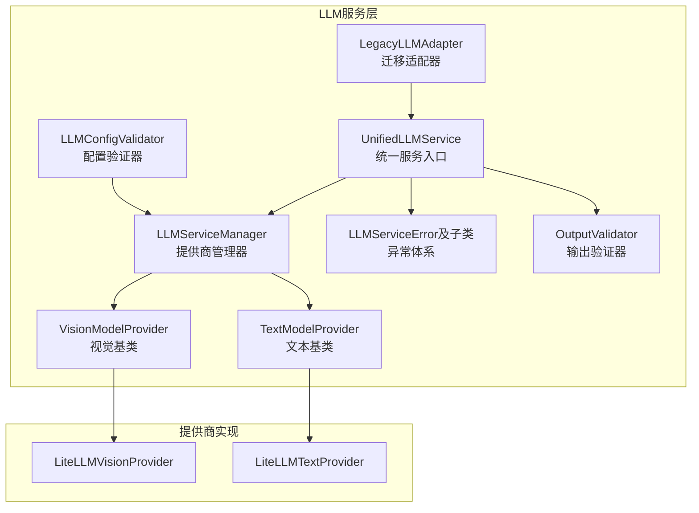
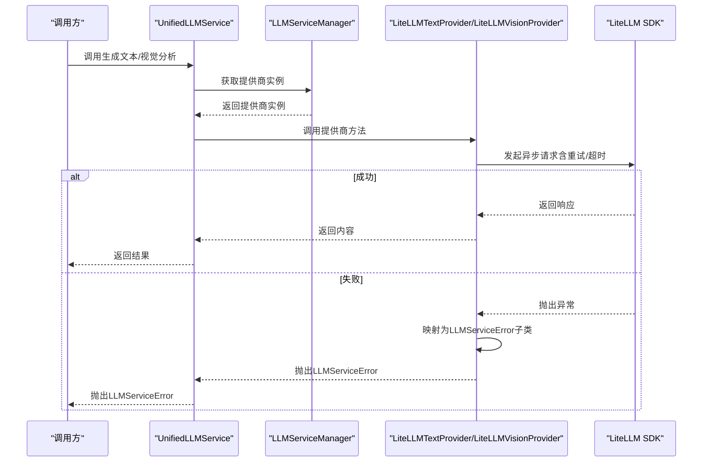
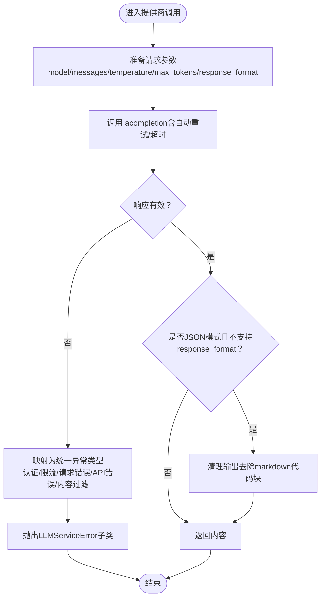
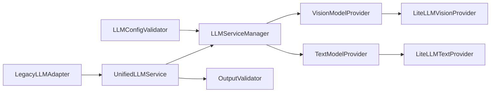

# 错误处理与重试机制

<cite>
**本文引用的文件**
- [exceptions.py](file://app/services/llm/exceptions.py)
- [base.py](file://app/services/llm/base.py)
- [manager.py](file://app/services/llm/manager.py)
- [unified_service.py](file://app/services/llm/unified_service.py)
- [litellm_provider.py](file://app/services/llm/litellm_provider.py)
- [validators.py](file://app/services/llm/validators.py)
- [migration_adapter.py](file://app/services/llm/migration_adapter.py)
- [config_validator.py](file://app/services/llm/config_validator.py)
- [test_llm_service.py](file://app/services/llm/test_llm_service.py)
- [test_litellm_integration.py](file://app/services/llm/test_litellm_integration.py)
- [exception.py](file://app/models/exception.py)
</cite>

## 目录
1. [简介](#简介)
2. [项目结构](#项目结构)
3. [核心组件](#核心组件)
4. [架构总览](#架构总览)
5. [详细组件分析](#详细组件分析)
6. [依赖分析](#依赖分析)
7. [性能考虑](#性能考虑)
8. [故障排查指南](#故障排查指南)
9. [结论](#结论)
10. [附录](#附录)

## 简介
本文件面向NarratoAI的LLM服务，系统化梳理错误处理与重试机制的设计与实现，覆盖异常类型定义、错误分类与恢复策略、重试机制（指数退避、最大重试次数、超时控制）、迁移适配器的API版本兼容处理，以及最佳实践与调试技巧。目标是帮助开发者在面对网络异常、API限制、模型不可用等常见场景时，快速定位问题、选择合适的恢复策略，并通过合理的错误处理提升系统稳定性与用户体验。

## 项目结构
围绕LLM错误处理与重试机制的相关模块主要位于 app/services/llm 目录，包含异常定义、基类抽象、提供商管理、统一服务入口、LiteLLM提供商实现、输出验证器、迁移适配器、配置验证器以及配套测试脚本。整体采用“统一服务入口 + 提供商管理 + 抽象基类 + 异常体系”的分层设计，便于扩展与维护。

图表来源
- [unified_service.py:20-263](file://app/services/llm/unified_service.py#L20-L263)
- [manager.py:15-246](file://app/services/llm/manager.py#L15-L246)
- [base.py:16-190](file://app/services/llm/base.py#L16-L190)
- [litellm_provider.py:59-491](file://app/services/llm/litellm_provider.py#L59-L491)
- [validators.py:15-201](file://app/services/llm/validators.py#L15-L201)
- [migration_adapter.py:62-342](file://app/services/llm/migration_adapter.py#L62-L342)
- [config_validator.py:15-309](file://app/services/llm/config_validator.py#L15-L309)

章节来源
- [unified_service.py:20-263](file://app/services/llm/unified_service.py#L20-L263)
- [manager.py:15-246](file://app/services/llm/manager.py#L15-L246)
- [base.py:16-190](file://app/services/llm/base.py#L16-L190)
- [litellm_provider.py:59-491](file://app/services/llm/litellm_provider.py#L59-L491)
- [validators.py:15-201](file://app/services/llm/validators.py#L15-L201)
- [migration_adapter.py:62-342](file://app/services/llm/migration_adapter.py#L62-L342)
- [config_validator.py:15-309](file://app/services/llm/config_validator.py#L15-L309)

## 核心组件
- 异常体系：定义统一的LLMServiceError基类及ProviderNotFoundError、ConfigurationError、APICallError、ValidationError、ModelNotSupportedError、RateLimitError、AuthenticationError、ContentFilterError等，便于上层统一捕获与分类处理。
- 抽象基类：BaseLLMProvider及其子类VisionModelProvider、TextModelProvider，提供统一接口与错误映射能力。
- 提供商管理：LLMServiceManager负责提供商注册、实例缓存、配置校验与获取，确保调用链路的健壮性。
- 统一服务：UnifiedLLMService对外暴露简洁API，内部委派至具体提供商，统一日志与异常包装。
- LiteLLM提供商：LiteLLMVisionProvider/LiteLLMTextProvider基于LiteLLM实现，内置自动重试、超时、环境变量注入、特殊平台适配（如SiliconFlow）。
- 输出验证器：OutputValidator提供JSON与业务结构化输出的严格验证，保障下游消费稳定。
- 迁移适配器：LegacyLLMAdapter兼容旧接口，屏蔽新旧架构差异，便于平滑迁移。
- 配置验证器：LLMConfigValidator提供配置检查与建议，降低因配置错误导致的失败率。
- 测试脚本：test_llm_service.py与test_litellm_integration.py覆盖功能与集成测试，辅助验证错误处理与重试行为。

章节来源
- [exceptions.py:11-119](file://app/services/llm/exceptions.py#L11-L119)
- [base.py:16-190](file://app/services/llm/base.py#L16-L190)
- [manager.py:15-246](file://app/services/llm/manager.py#L15-L246)
- [unified_service.py:20-263](file://app/services/llm/unified_service.py#L20-L263)
- [litellm_provider.py:59-491](file://app/services/llm/litellm_provider.py#L59-L491)
- [validators.py:15-201](file://app/services/llm/validators.py#L15-L201)
- [migration_adapter.py:62-342](file://app/services/llm/migration_adapter.py#L62-L342)
- [config_validator.py:15-309](file://app/services/llm/config_validator.py#L15-L309)
- [test_llm_service.py:1-264](file://app/services/llm/test_llm_service.py#L1-L264)
- [test_litellm_integration.py:1-229](file://app/services/llm/test_litellm_integration.py#L1-L229)

## 架构总览
下图展示错误处理与重试在系统中的流转路径：调用统一服务 → 获取提供商实例 → 执行提供商实现（含自动重试与超时） → 返回结果或抛出异常；异常在各层被规范化为统一异常类型，便于上层统一处理。

图表来源
- [unified_service.py:64-110](file://app/services/llm/unified_service.py#L64-L110)
- [manager.py:68-135](file://app/services/llm/manager.py#L68-L135)
- [litellm_provider.py:422-472](file://app/services/llm/litellm_provider.py#L422-L472)

章节来源
- [unified_service.py:64-110](file://app/services/llm/unified_service.py#L64-L110)
- [manager.py:68-135](file://app/services/llm/manager.py#L68-L135)
- [litellm_provider.py:422-472](file://app/services/llm/litellm_provider.py#L422-L472)

## 详细组件分析

### 异常类型与错误分类
- 基础异常：LLMServiceError携带message、error_code与details，便于统一序列化与前端展示。
- 供应商相关：ProviderNotFoundError（供应商未注册/未找到）、ConfigurationError（配置缺失/非法）。
- API调用相关：APICallError（通用API错误，包含状态码与响应文本）、RateLimitError（频率限制，可携带retry_after）、AuthenticationError（认证失败）、ContentFilterError（内容被过滤）。
- 输出相关：ValidationError（输出格式/结构验证失败）。
- 模型相关：ModelNotSupportedError（供应商不支持该模型）。

这些异常在提供商实现中被创建或映射，随后在统一服务与迁移适配器中被规范化与传播，保证上层一致的错误语义。

章节来源
- [exceptions.py:11-119](file://app/services/llm/exceptions.py#L11-L119)

### 抽象基类与错误映射
- BaseLLMProvider提供统一的配置校验、模型支持检查、错误映射与抽象接口，确保子类实现的一致性。
- _handle_api_error根据HTTP状态码映射到具体异常类型，覆盖401（认证）、429（限流）、5xx（服务器错误）、524（超时）等常见场景。

章节来源
- [base.py:56-101](file://app/services/llm/base.py#L56-L101)

### 提供商管理器与实例缓存
- LLMServiceManager负责提供商注册、缓存与获取，避免重复创建实例，提升性能。
- 获取提供商时进行配置校验与缓存命中判断，若未注册或配置缺失则抛出相应异常，便于早期发现配置问题。

章节来源
- [manager.py:68-208](file://app/services/llm/manager.py#L68-L208)

### 统一服务入口与日志规范
- UnifiedLLMService封装对提供商的调用，统一记录日志、捕获异常并抛出LLMServiceError，向上提供一致的错误语义。
- 对文本生成与JSON输出，结合OutputValidator进行严格校验，确保下游消费稳定。

章节来源
- [unified_service.py:20-263](file://app/services/llm/unified_service.py#L20-L263)
- [validators.py:15-201](file://app/services/llm/validators.py#L15-L201)

### LiteLLM提供商与自动重试
- LiteLLM全局配置：num_retries（最大重试次数）、request_timeout（请求超时），在模块初始化时完成配置。
- 文本/视觉提供商均通过acompeltion发起异步请求，自动处理重试与超时。
- 错误映射：LiteLLM的认证、限流、请求错误、API错误分别映射为统一异常类型，便于上层统一处理。
- 特殊平台适配：SiliconFlow通过替换provider与注入OPENAI_API_KEY、设置默认api_base，保证兼容性。
- JSON模式回退：当模型不支持response_format时，自动在提示词中添加JSON约束并清理输出。

图表来源
- [litellm_provider.py:39-56](file://app/services/llm/litellm_provider.py#L39-L56)
- [litellm_provider.py:422-472](file://app/services/llm/litellm_provider.py#L422-L472)
- [litellm_provider.py:446-466](file://app/services/llm/litellm_provider.py#L446-L466)

章节来源
- [litellm_provider.py:39-56](file://app/services/llm/litellm_provider.py#L39-L56)
- [litellm_provider.py:422-472](file://app/services/llm/litellm_provider.py#L422-L472)
- [litellm_provider.py:446-466](file://app/services/llm/litellm_provider.py#L446-L466)

### 输出验证器与降级策略
- JSON输出清理：移除markdown代码块标记，确保下游解析稳定。
- 结构化验证：对解说文案与字幕分析输出进行Schema与字段校验，发现格式问题立即抛出ValidationError。
- 降级建议：当输出验证失败时，可在上层进行重试或回退到备用提供商；对于非结构化输出，可记录原始内容以便人工审核。

章节来源
- [validators.py:18-53](file://app/services/llm/validators.py#L18-L53)
- [validators.py:90-144](file://app/services/llm/validators.py#L90-L144)
- [validators.py:166-201](file://app/services/llm/validators.py#L166-L201)

### 迁移适配器与API版本兼容
- LegacyLLMAdapter：提供create_vision_analyzer、generate_narration等旧接口的适配，内部委托到UnifiedLLMService，同时对JSON输出进行增强解析与降级返回。
- VisionAnalyzerAdapter/SubtitleAnalyzerAdapter：兼容旧版返回格式，将新实现的List[str]转换为旧版List[Dict]，并保留批次索引、处理数量等元信息。
- _run_async_safely：在不同事件循环环境下安全运行异步协程，避免主线程阻塞与事件循环冲突。
- JSON清理：SubtitleAnalyzerAdapter提供_clean_json_output，移除markdown标记，提升兼容性。

章节来源
- [migration_adapter.py:62-342](file://app/services/llm/migration_adapter.py#L62-L342)

### 配置验证与最佳实践
- LLMConfigValidator：验证视觉/文本提供商的配置完整性，尝试创建实例以确认可用性，并给出错误与警告清单。
- 建议：为每个提供商配置base_url以提高稳定性；定期更新模型名称；为关键流程配置多个提供商作为备用；使用LiteLLM统一接口以减少代码量与提升兼容性。

章节来源
- [config_validator.py:18-85](file://app/services/llm/config_validator.py#L18-L85)
- [config_validator.py:201-249](file://app/services/llm/config_validator.py#L201-L249)

### 测试与回归验证
- test_llm_service.py：覆盖文本生成、JSON生成、字幕分析、解说文案生成等核心流程，验证统一服务与验证器协作。
- test_litellm_integration.py：验证LiteLLM提供商注册、库导入、接口可用性与向后兼容性，指导迁移与使用。

章节来源
- [test_llm_service.py:25-264](file://app/services/llm/test_llm_service.py#L25-L264)
- [test_litellm_integration.py:20-229](file://app/services/llm/test_litellm_integration.py#L20-L229)

## 依赖分析
- 统一服务依赖提供商管理器获取实例，再委派至具体提供商实现。
- 提供商实现依赖LiteLLM SDK，内部完成自动重试与超时控制。
- 输出验证器独立于提供商，统一在统一服务中调用，保证输出质量。
- 迁移适配器依赖统一服务与提示词管理器，向下兼容旧接口。
- 配置验证器依赖配置模块与提供商管理器，提供配置检查与建议。

图表来源
- [unified_service.py:20-263](file://app/services/llm/unified_service.py#L20-L263)
- [manager.py:15-246](file://app/services/llm/manager.py#L15-L246)
- [litellm_provider.py:59-491](file://app/services/llm/litellm_provider.py#L59-L491)
- [validators.py:15-201](file://app/services/llm/validators.py#L15-L201)
- [migration_adapter.py:62-342](file://app/services/llm/migration_adapter.py#L62-L342)
- [config_validator.py:15-309](file://app/services/llm/config_validator.py#L15-L309)

章节来源
- [unified_service.py:20-263](file://app/services/llm/unified_service.py#L20-L263)
- [manager.py:15-246](file://app/services/llm/manager.py#L15-L246)
- [litellm_provider.py:59-491](file://app/services/llm/litellm_provider.py#L59-L491)
- [validators.py:15-201](file://app/services/llm/validators.py#L15-L201)
- [migration_adapter.py:62-342](file://app/services/llm/migration_adapter.py#L62-L342)
- [config_validator.py:15-309](file://app/services/llm/config_validator.py#L15-L309)

## 性能考虑
- 实例缓存：LLMServiceManager对提供商实例进行缓存，避免重复初始化开销。
- 批处理与图片预处理：视觉提供商对图片进行缩放与批处理，兼顾性能与质量。
- 超时与重试：LiteLLM全局配置request_timeout与num_retries，平衡成功率与等待时间。
- 日志粒度：在关键节点记录耗时与token用量，便于性能分析与成本控制。

章节来源
- [manager.py:24-26](file://app/services/llm/manager.py#L24-L26)
- [base.py:126-150](file://app/services/llm/base.py#L126-L150)
- [litellm_provider.py:39-56](file://app/services/llm/litellm_provider.py#L39-L56)

## 故障排查指南
- 常见错误与恢复策略
  - 认证失败（401/认证异常）：检查API密钥配置与提供商环境变量映射，必要时更换密钥或升级权限。
  - 速率限制（429/限流异常）：遵循retry_after指示等待后重试，或切换到备用提供商/模型。
  - 服务器错误（5xx/524）：触发自动重试，若持续失败，记录状态码与响应文本，定位上游问题。
  - 内容过滤（内容过滤异常）：调整提示词或启用安全模式，必要时更换模型或提供商。
  - 配置错误（配置缺失/非法）：使用LLMConfigValidator检查并修正配置，确保API密钥、模型名、base_url齐全。
  - 输出验证失败（JSON/结构化验证异常）：检查提示词约束与response_format设置，必要时回退到非JSON模式并清理输出。
- 调试技巧
  - 启用LiteLLM详细日志（开发环境可开启set_verbose）以观察底层调用细节。
  - 在统一服务与提供商实现中增加关键步骤的日志记录，便于定位瓶颈与异常点。
  - 使用测试脚本进行端到端验证，覆盖文本生成、JSON生成、字幕分析、解说文案生成等场景。
  - 对迁移适配器的返回格式进行单元测试，确保与旧接口兼容。
- 监控与追踪
  - 记录异常类型、错误码、详情与上下文信息，便于问题复现与统计分析。
  - 关注重试次数与超时阈值，避免过度重试导致资源浪费。

章节来源
- [exceptions.py:11-119](file://app/services/llm/exceptions.py#L11-L119)
- [base.py:87-101](file://app/services/llm/base.py#L87-L101)
- [litellm_provider.py:438-472](file://app/services/llm/litellm_provider.py#L438-L472)
- [config_validator.py:18-85](file://app/services/llm/config_validator.py#L18-L85)
- [test_llm_service.py:25-264](file://app/services/llm/test_llm_service.py#L25-L264)
- [test_litellm_integration.py:20-229](file://app/services/llm/test_litellm_integration.py#L20-L229)

## 结论
NarratoAI的LLM错误处理与重试机制通过“统一异常体系 + 抽象基类 + 提供商管理 + LiteLLM自动重试 + 输出验证器 + 迁移适配器 + 配置验证”的组合，实现了高可用、可扩展、易维护的错误处理闭环。在面对网络异常、API限制、模型不可用等挑战时，系统能够自动重试、优雅降级、统一错误语义与日志追踪，显著提升稳定性与用户体验。建议在生产环境中结合配置验证与测试脚本，持续优化重试参数与超时阈值，并通过迁移适配器平滑过渡到新的统一架构。

## 附录
- 关键参数参考
  - 最大重试次数：由配置项决定，默认在LiteLLM全局配置中设置。
  - 请求超时：由配置项决定，默认在LiteLLM全局配置中设置。
  - JSON模式：当模型不支持response_format时，自动在提示词中添加约束并清理输出。
- 迁移建议
  - 新项目：直接使用LiteLLM统一接口，减少代码量与维护成本。
  - 旧项目：通过迁移适配器逐步替换旧接口，确保向后兼容。
  - 生产切换：先在测试环境充分验证，再逐步切换到统一服务与LiteLLM提供商。