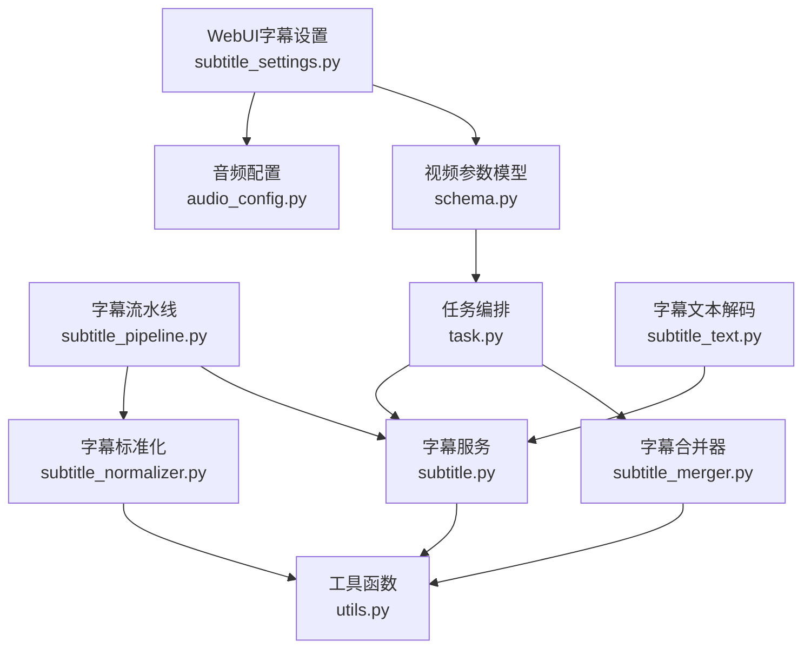
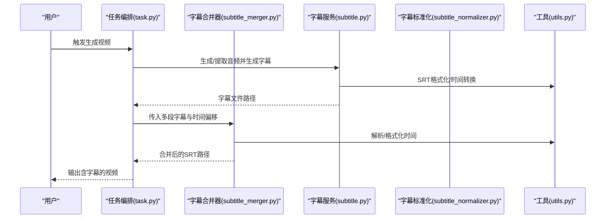
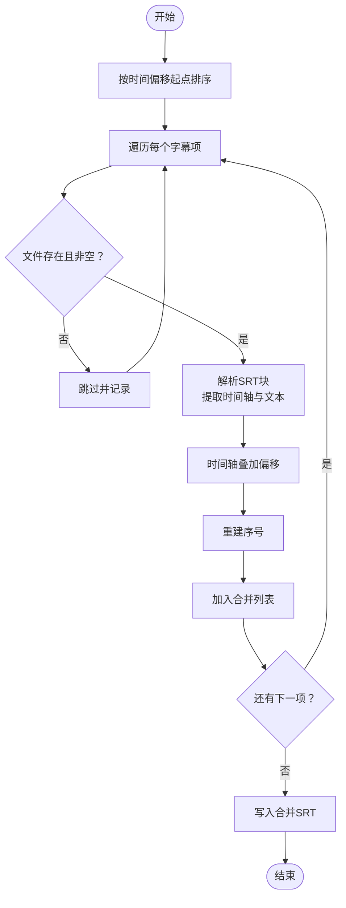
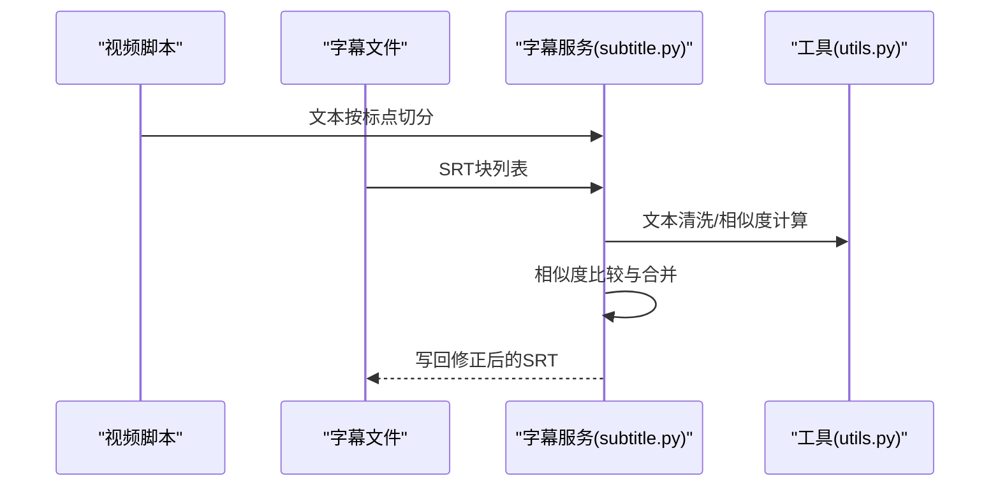
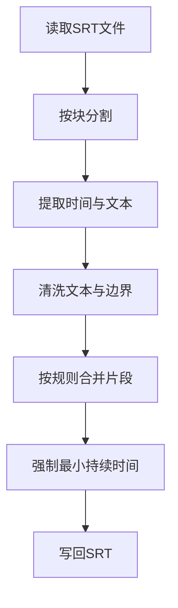
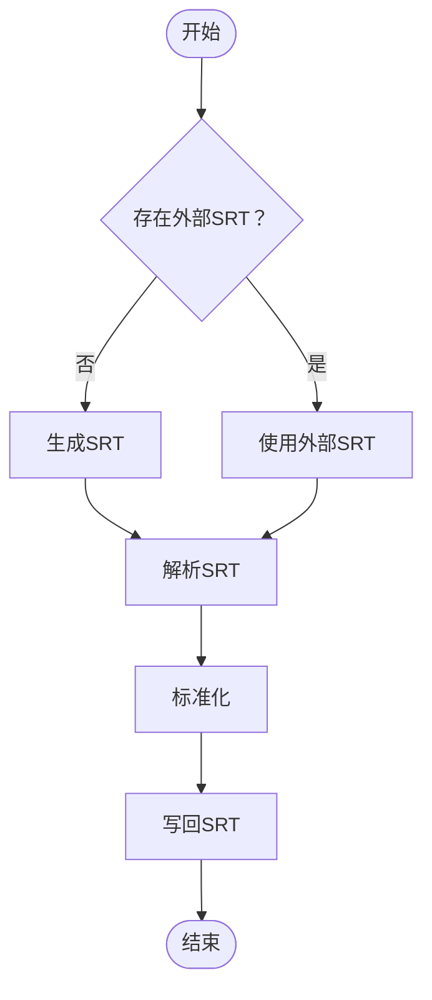
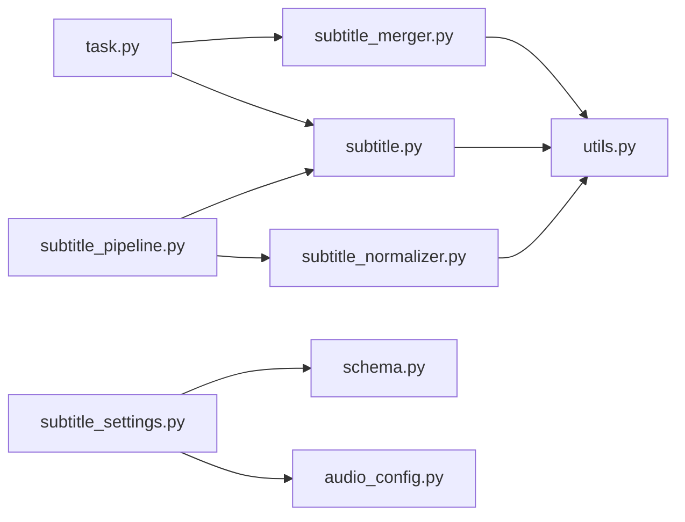

# 字幕合并器

<cite>
**本文引用的文件**
- [subtitle_merger.py](file://app/services/subtitle_merger.py)
- [subtitle.py](file://app/services/subtitle.py)
- [subtitle_normalizer.py](file://app/services/subtitle_normalizer.py)
- [subtitle_pipeline.py](file://app/services/subtitle_pipeline.py)
- [utils.py](file://app/utils/utils.py)
- [task.py](file://app/services/task.py)
- [subtitle_settings.py](file://webui/components/subtitle_settings.py)
- [audio_config.py](file://app/config/audio_config.py)
- [schema.py](file://app/models/schema.py)
- [subtitle_text.py](file://app/services/subtitle_text.py)
</cite>

## 目录
1. [简介](#简介)
2. [项目结构](#项目结构)
3. [核心组件](#核心组件)
4. [架构总览](#架构总览)
5. [详细组件分析](#详细组件分析)
6. [依赖分析](#依赖分析)
7. [性能考虑](#性能考虑)
8. [故障排查指南](#故障排查指南)
9. [结论](#结论)
10. [附录](#附录)

## 简介
本文件面向NarratoAI的“字幕合并器”子系统，系统性梳理多语言字幕文件的合并技术与质量控制机制，覆盖以下主题：
- 多语言字幕合并：时间轴对齐、偏移叠加、内容去重与顺序合并
- 字幕格式转换与编码处理：SRT解析、时间戳格式化、跨平台编码统一
- 质量控制：相似度计算、错误检测与异常处理
- 批量处理：多文件合并、顺序与去重策略
- 配置选项：合并策略、格式规范、输出设置
- 实际应用场景与最佳实践

## 项目结构
围绕字幕合并的关键模块分布如下：
- 字幕合并主流程：app/services/subtitle_merger.py
- 字幕生成与校正：app/services/subtitle.py
- 字幕标准化与SRT导出：app/services/subtitle_normalizer.py
- 字幕流水线入口：app/services/subtitle_pipeline.py
- 工具与通用函数：app/utils/utils.py
- 任务编排与合并调用：app/services/task.py
- WebUI字幕设置：webui/components/subtitle_settings.py
- 音频配置与音量策略：app/config/audio_config.py
- 视频参数与字幕位置枚举：app/models/schema.py
- 跨平台字幕文本解码与规范化：app/services/subtitle_text.py

**图表来源**
- [subtitle_merger.py:62-185](file://app/services/subtitle_merger.py#L62-L185)
- [subtitle.py:26-197](file://app/services/subtitle.py#L26-L197)
- [subtitle_normalizer.py:34-153](file://app/services/subtitle_normalizer.py#L34-L153)
- [subtitle_pipeline.py:33-63](file://app/services/subtitle_pipeline.py#L33-L63)
- [utils.py:222-234](file://app/utils/utils.py#L222-L234)
- [task.py:120-133](file://app/services/task.py#L120-L133)
- [subtitle_settings.py:152-164](file://webui/components/subtitle_settings.py#L152-L164)
- [audio_config.py:168-205](file://app/config/audio_config.py#L168-L205)
- [schema.py:204-209](file://app/models/schema.py#L204-L209)
- [subtitle_text.py:69-97](file://app/services/subtitle_text.py#L69-L97)

**章节来源**
- [subtitle_merger.py:1-239](file://app/services/subtitle_merger.py#L1-L239)
- [subtitle.py:1-467](file://app/services/subtitle.py#L1-L467)
- [subtitle_normalizer.py:1-154](file://app/services/subtitle_normalizer.py#L1-L154)
- [subtitle_pipeline.py:1-64](file://app/services/subtitle_pipeline.py#L1-L64)
- [utils.py:1-675](file://app/utils/utils.py#L1-L675)
- [task.py:1-272](file://app/services/task.py#L1-L272)
- [subtitle_settings.py:1-165](file://webui/components/subtitle_settings.py#L1-L165)
- [audio_config.py:1-221](file://app/config/audio_config.py#L1-L221)
- [schema.py:1-209](file://app/models/schema.py#L1-L209)
- [subtitle_text.py:1-97](file://app/services/subtitle_text.py#L1-L97)

## 核心组件
- 字幕合并器（合并多段SRT，按时间偏移叠加，重建索引）
- 字幕生成与校正（Whisper转写、脚本相似度对齐、时间戳修正）
- 字幕标准化（解析SRT、清洗文本、分段合并、导出SRT）
- 字幕流水线（外挂字幕优先、自动生成、标准化、落盘）
- 工具函数（SRT格式化、时间转换、文本清洗、临时目录）
- 任务编排（音频与字幕合并、最终合成）
- WebUI字幕设置（字体、字号、颜色、描边、位置）
- 音频配置（音量策略、淡入淡出、响度目标）
- 视频参数模型（字幕位置枚举）
- 跨平台字幕文本解码（编码探测、时间戳规范化）

**章节来源**
- [subtitle_merger.py:62-185](file://app/services/subtitle_merger.py#L62-L185)
- [subtitle.py:26-197](file://app/services/subtitle.py#L26-L197)
- [subtitle_normalizer.py:82-141](file://app/services/subtitle_normalizer.py#L82-L141)
- [subtitle_pipeline.py:33-63](file://app/services/subtitle_pipeline.py#L33-L63)
- [utils.py:222-234](file://app/utils/utils.py#L222-L234)
- [task.py:120-133](file://app/services/task.py#L120-L133)
- [subtitle_settings.py:152-164](file://webui/components/subtitle_settings.py#L152-L164)
- [audio_config.py:168-205](file://app/config/audio_config.py#L168-L205)
- [schema.py:204-209](file://app/models/schema.py#L204-L209)
- [subtitle_text.py:69-97](file://app/services/subtitle_text.py#L69-L97)

## 架构总览
字幕合并器贯穿“生成/解析 → 标准化 → 合并 → 导出”的流水线，同时与任务编排、WebUI设置、音频配置协同工作。

**图表来源**
- [task.py:120-133](file://app/services/task.py#L120-L133)
- [subtitle_merger.py:62-185](file://app/services/subtitle_merger.py#L62-L185)
- [subtitle.py:383-431](file://app/services/subtitle.py#L383-L431)
- [utils.py:222-234](file://app/utils/utils.py#L222-L234)

## 详细组件分析

### 字幕合并器（多语言SRT合并）
- 输入：字幕文件路径列表与对应的时间偏移区间（HH:MM:SS），按偏移起点排序
- 处理：
  - 解析每个SRT块，提取时间轴与文本
  - 将时间轴按偏移叠加，重建时间行
  - 重新编号，拼接为单一SRT
- 输出：合并后的SRT文件路径，若无有效内容返回空
- 关键点：
  - 时间解析/格式化函数确保跨平台一致
  - 对空文件、缺失文件、非法时间行进行跳过与告警
  - 自动生成输出文件名（包含首尾时间戳）

**图表来源**
- [subtitle_merger.py:73-185](file://app/services/subtitle_merger.py#L73-L185)

**章节来源**
- [subtitle_merger.py:62-185](file://app/services/subtitle_merger.py#L62-L185)

### 字幕生成与校正
- 生成：Whisper模型转写，按词粒度断句，输出SRT
- 校正：将脚本按标点切分，与字幕逐行比对，使用编辑距离相似度合并相邻字幕，阈值高于0.8即认为匹配
- 编码与格式：支持多种编码探测与SRT时间戳规范化

**图表来源**
- [subtitle.py:257-348](file://app/services/subtitle.py#L257-L348)
- [utils.py:244-275](file://app/utils/utils.py#L244-L275)

**章节来源**
- [subtitle.py:26-197](file://app/services/subtitle.py#L26-L197)
- [subtitle.py:257-348](file://app/services/subtitle.py#L257-L348)
- [utils.py:237-275](file://app/utils/utils.py#L237-L275)

### 字幕标准化与SRT导出
- 解析：按SRT块分割，提取时间与文本，统一为内部段结构
- 清洗：去除多余空白、头尾标点，保证最小持续时间
- 合并：基于时间间隙、字符数与标点规则合并相邻片段
- 导出：写回标准SRT格式

**图表来源**
- [subtitle_normalizer.py:34-153](file://app/services/subtitle_normalizer.py#L34-L153)

**章节来源**
- [subtitle_normalizer.py:82-141](file://app/services/subtitle_normalizer.py#L82-L141)

### 字幕流水线
- 优先级：显式提供的外部SRT > 自动生成的SRT
- 生成：从视频提取音频并转写为SRT
- 标准化：解析、清洗、合并、导出
- 结果：返回字幕路径、段列表与来源

**图表来源**
- [subtitle_pipeline.py:33-63](file://app/services/subtitle_pipeline.py#L33-L63)

**章节来源**
- [subtitle_pipeline.py:19-63](file://app/services/subtitle_pipeline.py#L19-L63)

### 工具函数与格式化
- SRT格式化：将序号、时间轴、文本组装为标准SRT
- 时间转换：秒↔时间字符串互转，支持多种格式
- 文本清洗：去除多余空白、标点处理
- 临时目录：统一管理中间文件

**章节来源**
- [utils.py:222-234](file://app/utils/utils.py#L222-L234)
- [utils.py:385-429](file://app/utils/utils.py#L385-L429)
- [utils.py:237-275](file://app/utils/utils.py#L237-L275)
- [utils.py:557-570](file://app/utils/utils.py#L557-L570)

### 任务编排中的字幕合并
- 任务阶段：统一裁剪后，合并音频与字幕
- 调用：通过合并器传入脚本列表（含字幕路径与时间偏移）
- 输出：返回合并后的字幕路径，供最终视频合成使用

**章节来源**
- [task.py:120-133](file://app/services/task.py#L120-L133)

### WebUI字幕设置与参数
- 字体、字号、颜色、描边、位置（顶部/居中/底部/自定义百分比）
- 与视频参数模型联动，支持字幕位置枚举

**章节来源**
- [subtitle_settings.py:152-164](file://webui/components/subtitle_settings.py#L152-L164)
- [schema.py:204-209](file://app/models/schema.py#L204-L209)

### 音频配置与音量策略
- 推荐音量：根据内容类型自动推荐TTS/原声/BGM音量
- 音量验证：限制范围，避免异常值
- 与字幕合并无直接耦合，但影响最终视频的音画平衡

**章节来源**
- [audio_config.py:168-205](file://app/config/audio_config.py#L168-L205)
- [audio_config.py:99-121](file://app/config/audio_config.py#L99-L121)

### 跨平台字幕文本解码
- 编码探测：UTF-8/UTF-16/GBK等常见编码
- 时间戳规范化：统一毫秒分隔符
- 防止NUL与BOM干扰

**章节来源**
- [subtitle_text.py:69-97](file://app/services/subtitle_text.py#L69-L97)

## 依赖分析
- 字幕合并器依赖工具函数进行时间解析/格式化
- 字幕服务依赖工具函数进行文本清洗与SRT格式化
- 字幕流水线依赖字幕服务与标准化模块
- 任务编排依赖字幕合并器与字幕服务
- WebUI字幕设置依赖视频参数模型与音频配置

**图表来源**
- [subtitle_merger.py:16-38](file://app/services/subtitle_merger.py#L16-L38)
- [subtitle.py:26-197](file://app/services/subtitle.py#L26-L197)
- [subtitle_normalizer.py:34-153](file://app/services/subtitle_normalizer.py#L34-L153)
- [subtitle_pipeline.py:6-8](file://app/services/subtitle_pipeline.py#L6-L8)
- [task.py:10-18](file://app/services/task.py#L10-L18)
- [subtitle_settings.py:152-164](file://webui/components/subtitle_settings.py#L152-L164)
- [schema.py:204-209](file://app/models/schema.py#L204-L209)
- [audio_config.py:168-205](file://app/config/audio_config.py#L168-L205)

**章节来源**
- [subtitle_merger.py:16-38](file://app/services/subtitle_merger.py#L16-L38)
- [subtitle.py:26-197](file://app/services/subtitle.py#L26-L197)
- [subtitle_normalizer.py:34-153](file://app/services/subtitle_normalizer.py#L34-L153)
- [subtitle_pipeline.py:6-8](file://app/services/subtitle_pipeline.py#L6-L8)
- [task.py:10-18](file://app/services/task.py#L10-L18)
- [subtitle_settings.py:152-164](file://webui/components/subtitle_settings.py#L152-L164)
- [schema.py:204-209](file://app/models/schema.py#L204-L209)
- [audio_config.py:168-205](file://app/config/audio_config.py#L168-L205)

## 性能考虑
- 合并复杂度：按块线性扫描与重组，整体O(N)
- I/O优化：批量读取与一次性写入，减少磁盘往返
- 并行策略：当前合并器为顺序处理；可在任务层面对音频/字幕生成阶段引入并行（需结合具体TTS/转写实现）
- 内存占用：按块处理，避免一次性加载超大文件
- 时间精度：统一毫秒分隔符与时间格式，减少解析误差

[本节为通用性能讨论，无需列出具体文件来源]

## 故障排查指南
- 合并后字幕错位
  - 检查每段的editedTimeRange是否正确
  - 确认时间解析函数对齐（HH:MM:SS,mmm）
- 合并结果为空
  - 查看是否存在有效字幕文件与非空内容
  - 检查时间偏移是否为合法格式
- 字幕重复或断裂
  - 使用字幕校正逻辑（相似度阈值）进行修复
  - 标准化模块会强制最小持续时间，避免极短片段
- 编码问题
  - 使用跨平台解码模块进行编码探测与规范化
- 权限与路径
  - 确认输出目录存在且可写

**章节来源**
- [subtitle_merger.py:82-100](file://app/services/subtitle_merger.py#L82-L100)
- [subtitle_merger.py:141-144](file://app/services/subtitle_merger.py#L141-L144)
- [subtitle.py:257-348](file://app/services/subtitle.py#L257-L348)
- [subtitle_normalizer.py:132-141](file://app/services/subtitle_normalizer.py#L132-L141)
- [subtitle_text.py:69-97](file://app/services/subtitle_text.py#L69-L97)

## 结论
NarratoAI的字幕合并器通过“时间偏移叠加 + 顺序合并 + 标准化导出”的稳健流程，实现了多语言SRT的可靠合并。配合字幕生成与校正、跨平台编码处理、以及WebUI参数配置，形成从生成到输出的一体化能力。未来可在任务层面对生成阶段引入并行策略以进一步提升吞吐。

[本节为总结性内容，无需列出具体文件来源]

## 附录

### 字幕合并配置选项
- 合并策略
  - 时间偏移：按每段的editedTimeRange进行叠加
  - 顺序合并：按偏移起点升序排列
- 格式规范
  - 时间格式：HH:MM:SS,mmm
  - 输出文件名：包含首尾时间戳
- 输出设置
  - 字体、字号、颜色、描边、位置（顶部/居中/底部/自定义）
  - 与音量策略协同，确保音画平衡

**章节来源**
- [subtitle_merger.py:73-172](file://app/services/subtitle_merger.py#L73-L172)
- [subtitle_settings.py:152-164](file://webui/components/subtitle_settings.py#L152-L164)
- [audio_config.py:168-205](file://app/config/audio_config.py#L168-L205)

### 实际应用场景与最佳实践
- 多段视频拼接：为每段分配独立时间偏移，确保无缝衔接
- 多语言字幕：分别生成各语言SRT，按同一时间轴对齐后合并
- 质量控制：先校正后合并，使用相似度阈值过滤不匹配片段
- 批量处理：在任务层面对生成阶段并行化，合并阶段保持顺序一致性

[本节为实践建议，无需列出具体文件来源]