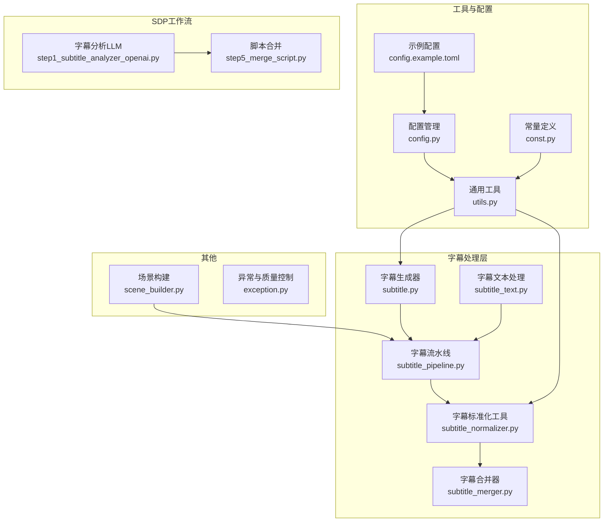
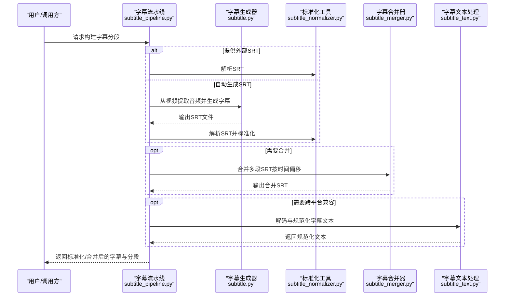
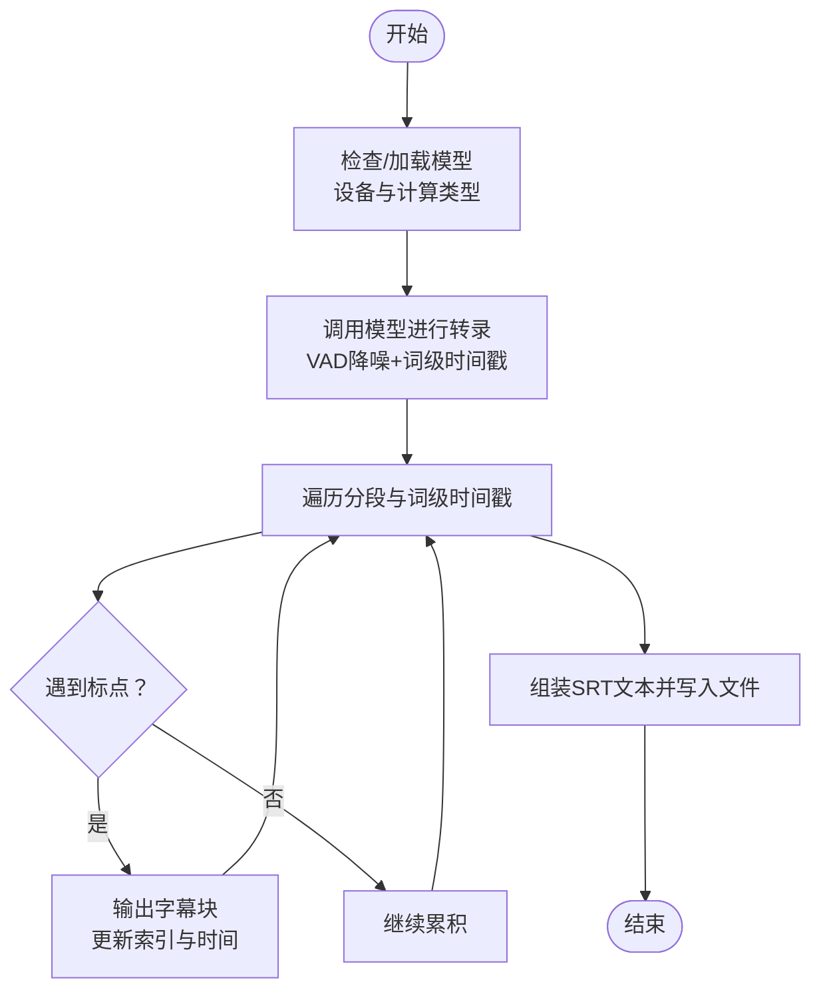
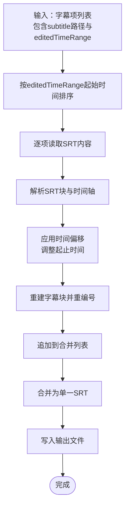
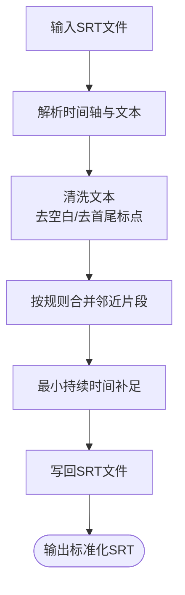
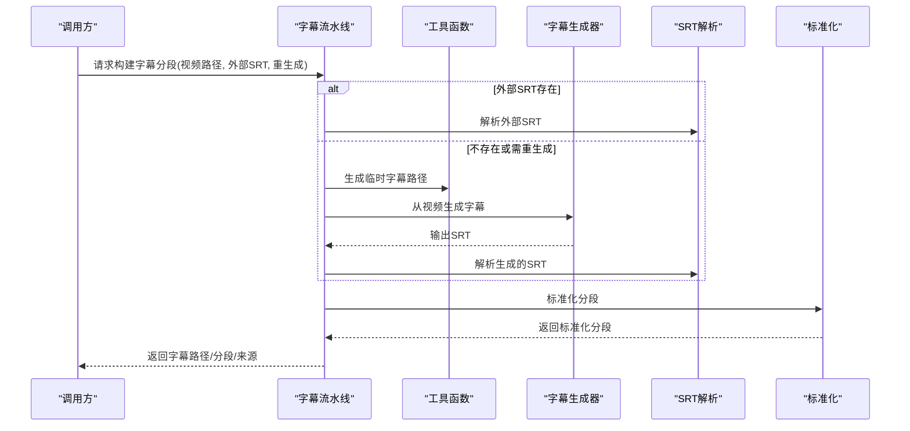
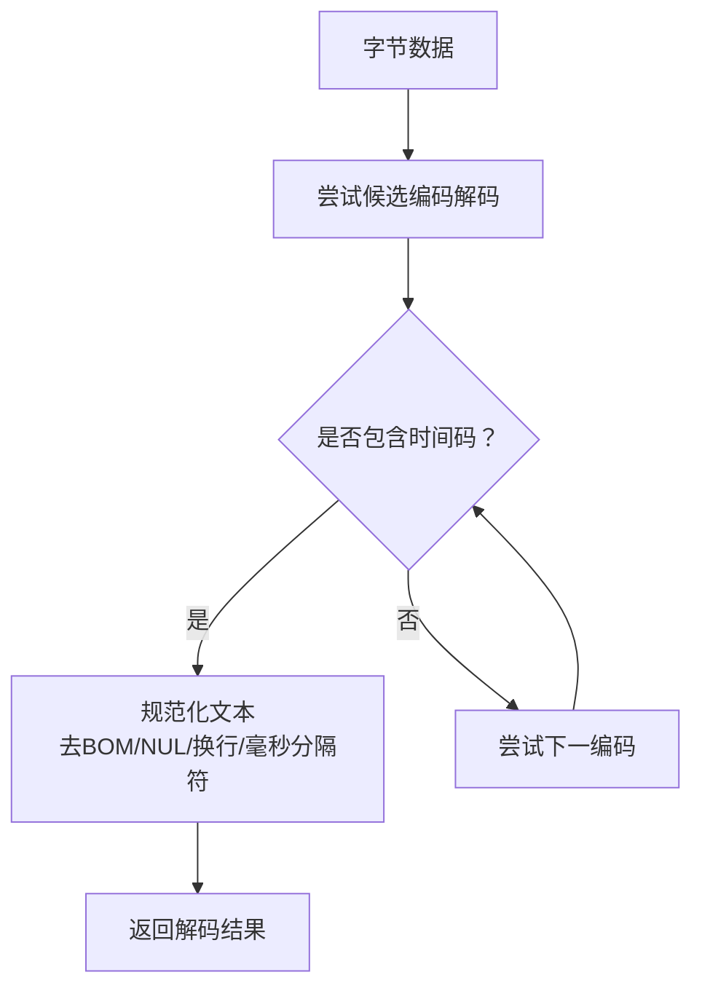
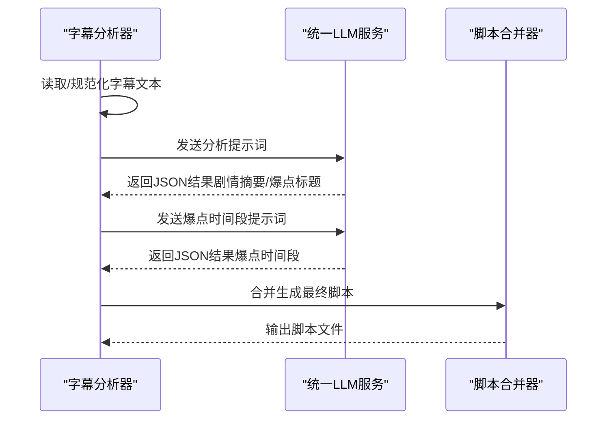
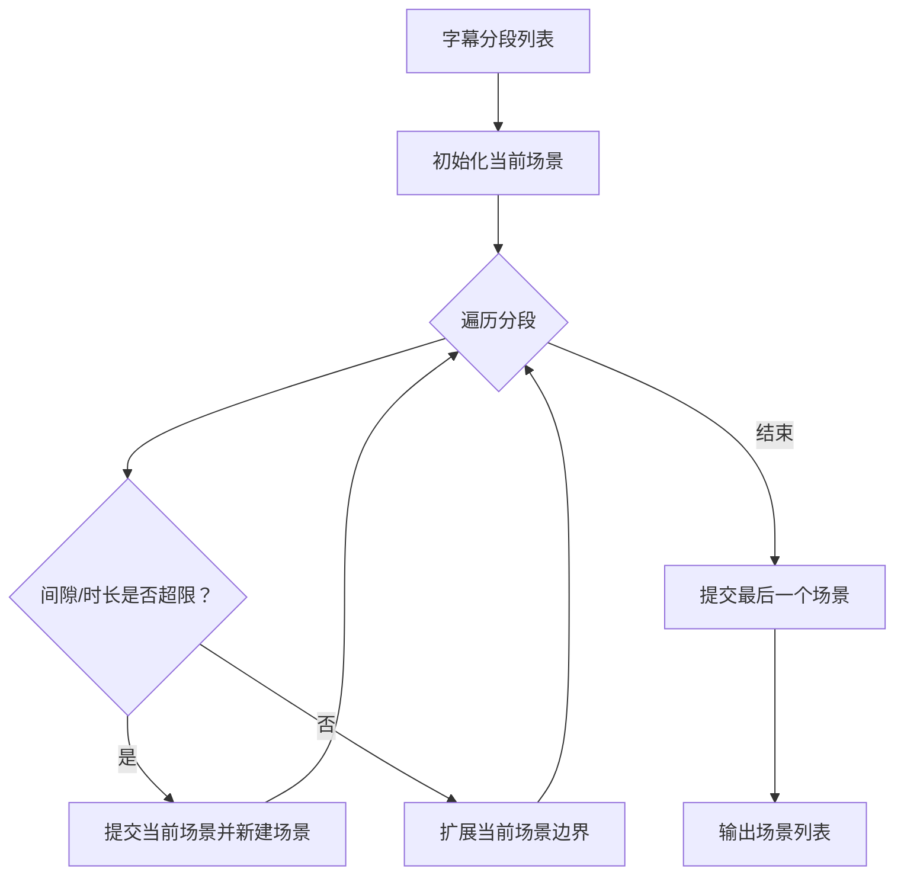
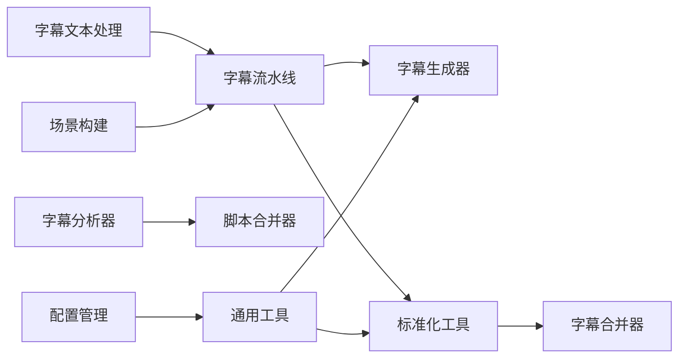

# 字幕处理系统

<cite>
**本文引用的文件**
- [subtitle.py](file://app/services/subtitle.py)
- [subtitle_merger.py](file://app/services/subtitle_merger.py)
- [subtitle_normalizer.py](file://app/services/subtitle_normalizer.py)
- [subtitle_pipeline.py](file://app/services/subtitle_pipeline.py)
- [subtitle_text.py](file://app/services/subtitle_text.py)
- [utils.py](file://app/utils/utils.py)
- [config.py](file://app/config/config.py)
- [const.py](file://app/models/const.py)
- [config.example.toml](file://config.example.toml)
- [step1_subtitle_analyzer_openai.py](file://app/services/SDP/utils/step1_subtitle_analyzer_openai.py)
- [step5_merge_script.py](file://app/services/SDP/utils/step5_merge_script.py)
- [scene_builder.py](file://app/services/scene_builder.py)
- [exception.py](file://app/models/exception.py)
</cite>

## 目录
1. [简介](#简介)
2. [项目结构](#项目结构)
3. [核心组件](#核心组件)
4. [架构总览](#架构总览)
5. [详细组件分析](#详细组件分析)
6. [依赖分析](#依赖分析)
7. [性能考虑](#性能考虑)
8. [故障排查指南](#故障排查指南)
9. [结论](#结论)
10. [附录](#附录)

## 简介
本文件面向NarratoAI的字幕处理系统，系统围绕"自动字幕识别、时间戳提取、文本转录"三大能力构建，提供"字幕合并器"、"字幕标准化工具"、"字幕流水线"以及"字幕文本处理"的完整链路。系统同时具备多语言字幕对齐、时间轴同步、格式转换、批处理、并行处理、错误恢复、内容清洗、格式验证、时间戳计算、质量保证（准确性校验、完整性检查、兼容性测试）等能力，并通过统一的配置管理与日志记录保障稳定性与可观测性。

## 项目结构
字幕处理相关模块主要分布在以下位置：
- 字幕生成与识别：app/services/subtitle.py
- 字幕合并：app/services/subtitle_merger.py
- 字幕标准化：app/services/subtitle_normalizer.py
- 字幕流水线：app/services/subtitle_pipeline.py
- 字幕文本处理（跨平台解码与规范化）：app/services/subtitle_text.py
- 工具与通用函数：app/utils/utils.py
- 配置与常量：app/config/config.py、app/models/const.py、config.example.toml
- SDP工作流中的字幕分析与脚本合并：app/services/SDP/utils/step1_subtitle_analyzer_openai.py、app/services/SDP/utils/step5_merge_script.py
- 场景构建（基于字幕分段）：app/services/scene_builder.py
- 异常与质量控制：app/models/exception.py

**图表来源**
- [subtitle.py:1-467](file://app/services/subtitle.py#L1-L467)
- [subtitle_merger.py:1-239](file://app/services/subtitle_merger.py#L1-L239)
- [subtitle_normalizer.py:1-154](file://app/services/subtitle_normalizer.py#L1-L154)
- [subtitle_pipeline.py:1-64](file://app/services/subtitle_pipeline.py#L1-L64)
- [subtitle_text.py:1-125](file://app/services/subtitle_text.py#L1-L125)
- [utils.py:1-675](file://app/utils/utils.py#L1-L675)
- [config.py:1-95](file://app/config/config.py#L1-L95)
- [const.py:1-26](file://app/models/const.py#L1-L26)
- [config.example.toml:1-177](file://config.example.toml#L1-L177)
- [step1_subtitle_analyzer_openai.py:1-173](file://app/services/SDP/utils/step1_subtitle_analyzer_openai.py#L1-L173)
- [step5_merge_script.py:1-49](file://app/services/SDP/utils/step5_merge_script.py#L1-L49)
- [scene_builder.py:1-71](file://app/services/scene_builder.py#L1-L71)
- [exception.py:1-29](file://app/models/exception.py#L1-L29)

**章节来源**
- [subtitle.py:1-467](file://app/services/subtitle.py#L1-L467)
- [subtitle_merger.py:1-239](file://app/services/subtitle_merger.py#L1-L239)
- [subtitle_normalizer.py:1-154](file://app/services/subtitle_normalizer.py#L1-L154)
- [subtitle_pipeline.py:1-64](file://app/services/subtitle_pipeline.py#L1-L64)
- [subtitle_text.py:1-125](file://app/services/subtitle_text.py#L1-L125)
- [utils.py:1-675](file://app/utils/utils.py#L1-L675)
- [config.py:1-95](file://app/config/config.py#L1-L95)
- [const.py:1-26](file://app/models/const.py#L1-L26)
- [config.example.toml:1-177](file://config.example.toml#L1-L177)
- [step1_subtitle_analyzer_openai.py:1-173](file://app/services/SDP/utils/step1_subtitle_analyzer_openai.py#L1-L173)
- [step5_merge_script.py:1-49](file://app/services/SDP/utils/step5_merge_script.py#L1-L49)
- [scene_builder.py:1-71](file://app/services/scene_builder.py#L1-L71)
- [exception.py:1-29](file://app/models/exception.py#L1-L29)

## 核心组件
- 自动字幕识别与生成：基于faster-whisper与可选的Gemini模型，支持从视频提取音频并生成SRT字幕，具备VAD降噪、词级时间戳、语言检测与回退策略。
- 字幕合并器：按时间偏移合并多段SRT字幕，支持时间范围解析、块级重组与输出文件命名。
- 字幕标准化工具：解析SRT、清洗文本、限制每段字符数与时长、合并邻近片段、统一时间格式。
- 字幕流水线：统一入口，支持外部SRT与自动生成SRT，串联解析、标准化与持久化。
- 字幕文本处理：跨平台解码与规范化，处理BOM、NUL、换行、毫秒分隔符等兼容性问题。
- SDP工作流：利用LLM对字幕进行剧情分析与爆点提取，并生成最终脚本。
- 场景构建：基于字幕分段与时间间隙，构建视频场景集合。

**章节来源**
- [subtitle.py:26-198](file://app/services/subtitle.py#L26-L198)
- [subtitle_merger.py:62-185](file://app/services/subtitle_merger.py#L62-L185)
- [subtitle_normalizer.py:34-154](file://app/services/subtitle_normalizer.py#L34-L154)
- [subtitle_pipeline.py:33-63](file://app/services/subtitle_pipeline.py#L33-L63)
- [subtitle_text.py:40-125](file://app/services/subtitle_text.py#L40-L125)
- [step1_subtitle_analyzer_openai.py:17-173](file://app/services/SDP/utils/step1_subtitle_analyzer_openai.py#L17-L173)
- [step5_merge_script.py:9-49](file://app/services/SDP/utils/step5_merge_script.py#L9-L49)
- [scene_builder.py:7-71](file://app/services/scene_builder.py#L7-L71)

## 架构总览
系统采用"模块化+流水线"的设计，核心链路如下：
- 输入：视频文件或外部SRT
- 处理：自动字幕生成 → SRT解析 → 标准化 → 合并（可选） → LLM分析（可选） → 场景构建（可选）
- 输出：标准化SRT、合并SRT、分析结果、脚本文件

**图表来源**
- [subtitle_pipeline.py:33-63](file://app/services/subtitle_pipeline.py#L33-L63)
- [subtitle.py:383-431](file://app/services/subtitle.py#L383-L431)
- [subtitle_normalizer.py:34-154](file://app/services/subtitle_normalizer.py#L34-L154)
- [subtitle_merger.py:62-185](file://app/services/subtitle_merger.py#L62-L185)
- [subtitle_text.py:69-125](file://app/services/subtitle_text.py#L69-L125)

## 详细组件分析

### 字幕生成器（自动识别与转录）
- 自动模型加载与设备选择：优先尝试CUDA，失败则回退CPU；支持本地模型路径与计算类型配置。
- 语音转文字：启用VAD降噪、词级时间戳、初始提示词，输出带时间戳的字幕块。
- 文本后处理：按标点断句、去除空段、生成SRT行。
- 视频到字幕：封装视频解码、音频提取、字幕生成与临时文件清理。
- Gemini备选：支持通过Gemini API生成SRT文本。

**图表来源**
- [subtitle.py:38-102](file://app/services/subtitle.py#L38-L102)
- [subtitle.py:108-198](file://app/services/subtitle.py#L108-L198)

**章节来源**
- [subtitle.py:26-198](file://app/services/subtitle.py#L26-L198)

### 字幕合并器（多语言/多片段对齐与同步）
- 时间解析与格式化：支持HH:MM:SS,mmm与毫秒偏移，统一时间格式。
- 时间偏移应用：按editedTimeRange为各片段设置起始偏移，实现多片段拼接。
- 块级重组：解析SRT块、重建时间轴、重编号，合并为单一SRT。
- 错误处理：跳过无效文件、空内容、解析失败项，统计有效项数。

**图表来源**
- [subtitle_merger.py:62-185](file://app/services/subtitle_merger.py#L62-L185)

**章节来源**
- [subtitle_merger.py:16-185](file://app/services/subtitle_merger.py#L16-L185)

### 字幕标准化工具（格式统一与样式修复）
- 解析SRT：正则匹配时间轴，提取起止时间与文本，统一为秒级表示。
- 文本清洗：去除多余空白、首尾标点、空段过滤。
- 分段合并：基于时间间隙、字符数与时长阈值合并相邻片段。
- 时长修正：最小持续时间补足，避免过短片段。
- 输出SRT：统一格式写回文件。

**图表来源**
- [subtitle_normalizer.py:34-154](file://app/services/subtitle_normalizer.py#L34-L154)

**章节来源**
- [subtitle_normalizer.py:34-154](file://app/services/subtitle_normalizer.py#L34-L154)

### 字幕流水线（自动化处理机制）
- 外部SRT优先：若存在外部SRT则直接解析。
- 自动生成：若不存在或强制再生，基于视频生成SRT并缓存。
- 标准化：解析SRT并进行标准化处理，必要时回写文件。
- 结果返回：包含字幕路径、分段列表与来源标识。

**图表来源**
- [subtitle_pipeline.py:33-63](file://app/services/subtitle_pipeline.py#L33-L63)
- [subtitle.py:383-431](file://app/services/subtitle.py#L383-L431)
- [utils.py:557-570](file://app/utils/utils.py#L557-L570)

**章节来源**
- [subtitle_pipeline.py:19-63](file://app/services/subtitle_pipeline.py#L19-L63)

### 字幕文本处理（跨平台解码与规范化）
- 编码解码：尝试常见编码（UTF-8/UTF-16/GBK/GB2312等），优先能识别时间码的解码。
- 文本规范化：去除BOM、NUL、统一换行、将毫秒分隔符从"."规范化为","。
- 读取接口：提供字节读取与解码结果返回，便于后续处理。

**图表来源**
- [subtitle_text.py:69-125](file://app/services/subtitle_text.py#L69-L125)

**章节来源**
- [subtitle_text.py:40-125](file://app/services/subtitle_text.py#L40-L125)

### SDP工作流中的字幕分析与脚本合并
- 字幕分析：读取并规范化字幕文本，调用统一LLM服务进行剧情分析与爆点提取，支持多种提供商与模型。
- 脚本合并：将分析结果合并为最终脚本，包含时间戳、画面描述、原声音轨标识等字段。

**图表来源**
- [step1_subtitle_analyzer_openai.py:17-173](file://app/services/SDP/utils/step1_subtitle_analyzer_openai.py#L17-L173)
- [step5_merge_script.py:9-49](file://app/services/SDP/utils/step5_merge_script.py#L9-L49)

**章节来源**
- [step1_subtitle_analyzer_openai.py:17-173](file://app/services/SDP/utils/step1_subtitle_analyzer_openai.py#L17-L173)
- [step5_merge_script.py:9-49](file://app/services/SDP/utils/step5_merge_script.py#L9-L49)

### 场景构建（基于字幕分段）
- 输入：字幕分段（含起止时间、文本、ID）。
- 策略：按最大场景时长与最大间隙判断是否拆分，聚合相邻片段。
- 输出：场景列表，包含场景ID、起止时间、字幕ID与文本集合。

**图表来源**
- [scene_builder.py:7-71](file://app/services/scene_builder.py#L7-L71)

**章节来源**
- [scene_builder.py:7-71](file://app/services/scene_builder.py#L7-L71)

## 依赖分析
- 组件内聚与耦合
  - 字幕生成器与流水线：强耦合（流水线依赖生成器），但通过接口清晰分离。
  - 标准化工具与合并器：弱耦合，通过SRT文件与分段数据交互。
  - 文本处理模块：独立工具，被流水线与分析器复用。
- 外部依赖
  - faster-whisper：本地模型加载与转录。
  - Google Generative AI：Gemini备选方案。
  - MoviePy：视频解码与音频提取。
  - 配置系统：TOML配置文件与环境变量。
- 潜在循环依赖
  - 当前模块间无循环导入迹象，结构清晰。

**图表来源**
- [subtitle_pipeline.py:33-63](file://app/services/subtitle_pipeline.py#L33-L63)
- [subtitle.py:383-431](file://app/services/subtitle.py#L383-L431)
- [subtitle_normalizer.py:34-154](file://app/services/subtitle_normalizer.py#L34-L154)
- [subtitle_merger.py:62-185](file://app/services/subtitle_merger.py#L62-L185)
- [subtitle_text.py:69-125](file://app/services/subtitle_text.py#L69-L125)
- [step1_subtitle_analyzer_openai.py:17-173](file://app/services/SDP/utils/step1_subtitle_analyzer_openai.py#L17-L173)
- [step5_merge_script.py:9-49](file://app/services/SDP/utils/step5_merge_script.py#L9-L49)
- [scene_builder.py:7-71](file://app/services/scene_builder.py#L7-L71)
- [utils.py:557-570](file://app/utils/utils.py#L557-L570)
- [config.py:24-44](file://app/config/config.py#L24-L44)

**章节来源**
- [subtitle_pipeline.py:33-63](file://app/services/subtitle_pipeline.py#L33-L63)
- [subtitle.py:383-431](file://app/services/subtitle.py#L383-L431)
- [subtitle_normalizer.py:34-154](file://app/services/subtitle_normalizer.py#L34-L154)
- [subtitle_merger.py:62-185](file://app/services/subtitle_merger.py#L62-L185)
- [subtitle_text.py:69-125](file://app/services/subtitle_text.py#L69-L125)
- [step1_subtitle_analyzer_openai.py:17-173](file://app/services/SDP/utils/step1_subtitle_analyzer_openai.py#L17-L173)
- [step5_merge_script.py:9-49](file://app/services/SDP/utils/step5_merge_script.py#L9-L49)
- [scene_builder.py:7-71](file://app/services/scene_builder.py#L7-L71)
- [utils.py:557-570](file://app/utils/utils.py#L557-L570)
- [config.py:24-44](file://app/config/config.py#L24-L44)

## 性能考虑
- 设备选择与回退：优先CUDA，失败回退CPU，兼顾速度与稳定性。
- VAD降噪与词级时间戳：提升转录质量，减少后处理负担。
- 批处理与缓存：流水线中基于视频哈希生成SRT缓存路径，避免重复生成。
- 合并与合并策略：通过时间偏移与块级重组，减少二次解析成本。
- 编码与兼容：跨平台解码与规范化，降低I/O与解析失败率。
- 并行与后台：工具层提供后台执行函数，便于异步任务调度。

## 故障排查指南
- 模型加载失败
  - 现象：CUDA加载失败或模型缺失。
  - 处理：检查模型路径与文件完整性，确认回退到CPU模式的日志。
  - 参考
    - [subtitle.py:38-102](file://app/services/subtitle.py#L38-L102)
- 视频无音频
  - 现象：视频文件不含音频轨道。
  - 处理：检查视频源，或改用外部SRT。
  - 参考
    - [subtitle.py:383-431](file://app/services/subtitle.py#L383-L431)
- 字幕内容为空或格式不规范
  - 现象：SRT解析失败或内容为空。
  - 处理：使用字幕文本处理模块进行解码与规范化，检查时间码格式。
  - 参考
    - [subtitle_text.py:69-125](file://app/services/subtitle_text.py#L69-L125)
    - [subtitle_normalizer.py:34-68](file://app/services/subtitle_normalizer.py#L34-L68)
- 合并失败或输出为空
  - 现象：合并后无有效字幕。
  - 处理：检查editedTimeRange格式、文件存在性与内容有效性。
  - 参考
    - [subtitle_merger.py:62-185](file://app/services/subtitle_merger.py#L62-L185)
- LLM分析失败
  - 现象：分析结果为空或格式不合规。
  - 处理：检查API Key、Provider配置与提示词参数。
  - 参考
    - [step1_subtitle_analyzer_openai.py:17-173](file://app/services/SDP/utils/step1_subtitle_analyzer_openai.py#L17-L173)
- 异常与日志
  - 使用统一异常类记录错误堆栈，便于定位问题。
  - 参考
    - [exception.py:7-29](file://app/models/exception.py#L7-L29)

**章节来源**
- [subtitle.py:38-102](file://app/services/subtitle.py#L38-L102)
- [subtitle.py:383-431](file://app/services/subtitle.py#L383-L431)
- [subtitle_text.py:69-125](file://app/services/subtitle_text.py#L69-L125)
- [subtitle_normalizer.py:34-68](file://app/services/subtitle_normalizer.py#L34-L68)
- [subtitle_merger.py:62-185](file://app/services/subtitle_merger.py#L62-L185)
- [step1_subtitle_analyzer_openai.py:17-173](file://app/services/SDP/utils/step1_subtitle_analyzer_openai.py#L17-L173)
- [exception.py:7-29](file://app/models/exception.py#L7-L29)

## 结论
NarratoAI的字幕处理系统以模块化设计为核心，覆盖从自动识别、解析、标准化、合并到LLM分析与脚本生成的全链路。系统通过设备自适应、跨平台兼容、严格的质量控制与可观测性，实现了高可靠与易维护的字幕处理能力。建议在生产环境中结合缓存策略、并发控制与监控告警，进一步提升吞吐与稳定性。

## 附录
- 配置要点
  - Whisper模型路径与设备选择：通过配置文件与环境变量控制。
  - 示例配置：包含LLM、TTS、代理与视频处理等关键项。
  - 参考
    - [config.py:24-95](file://app/config/config.py#L24-L95)
    - [config.example.toml:1-177](file://config.example.toml#L1-L177)
- 常量与工具
  - 标点符号集合、任务状态、文件类型等常量。
  - 通用工具：路径管理、时间转换、编码解码、临时目录等。
  - 参考
    - [const.py:1-26](file://app/models/const.py#L1-L26)
    - [utils.py:72-675](file://app/utils/utils.py#L72-L675)

**章节来源**
- [config.py:24-95](file://app/config/config.py#L24-L95)
- [config.example.toml:1-177](file://config.example.toml#L1-L177)
- [const.py:1-26](file://app/models/const.py#L1-L26)
- [utils.py:72-675](file://app/utils/utils.py#L72-L675)