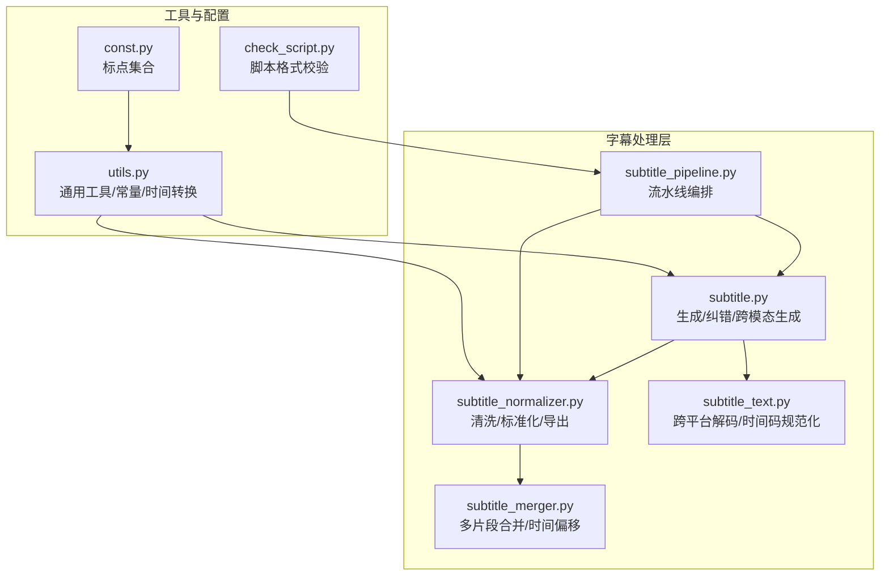
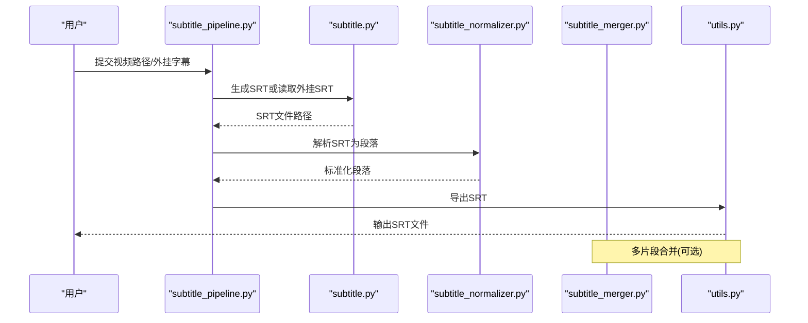
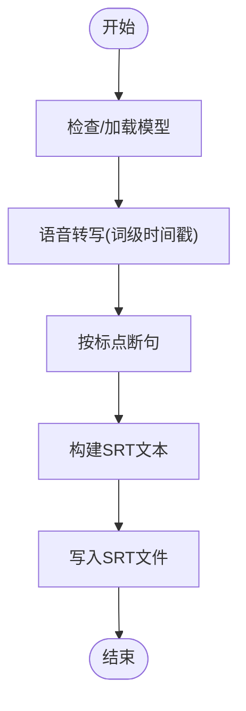
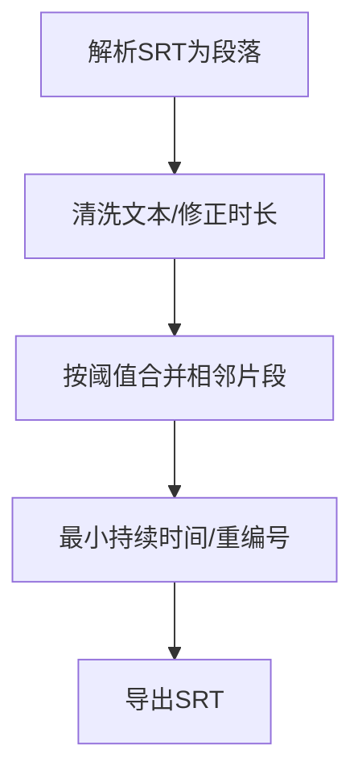
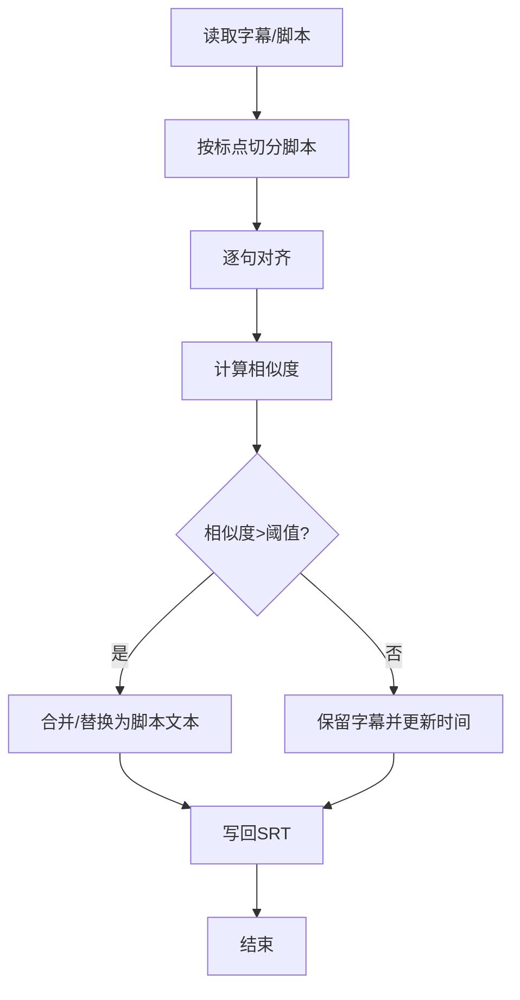
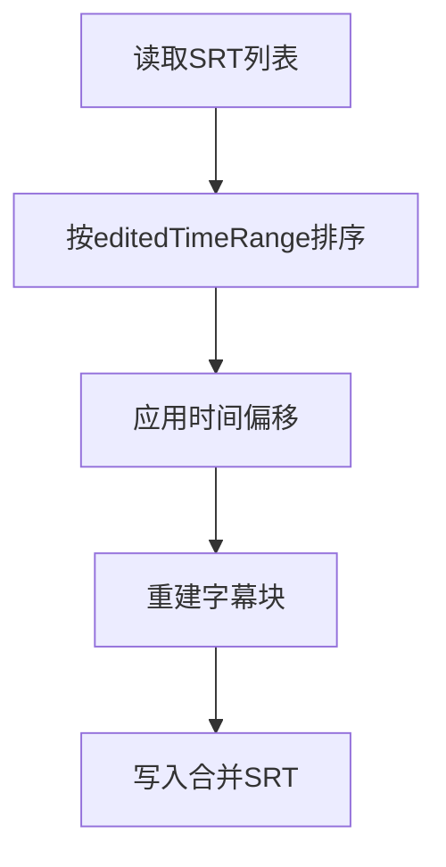
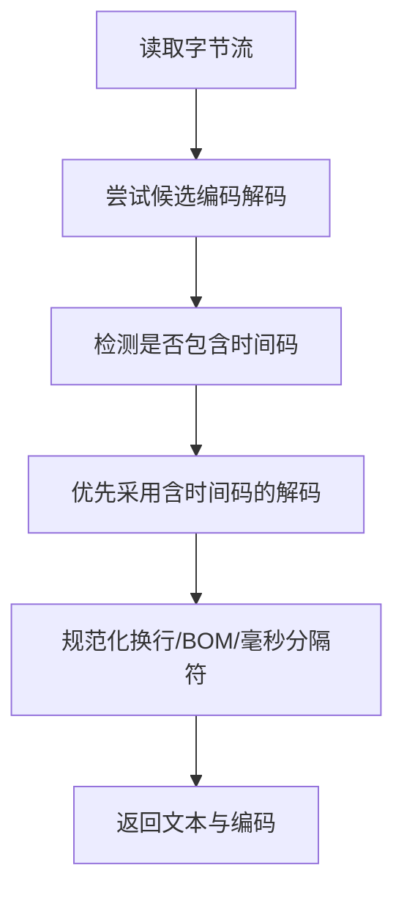
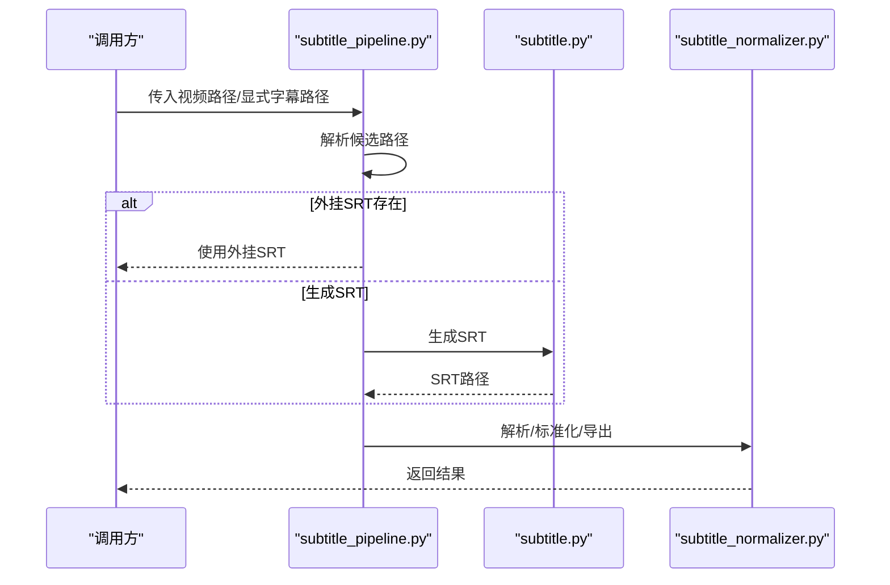
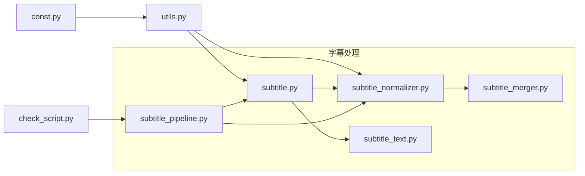

# 字幕文本处理

<cite>
**本文引用的文件**
- [app/services/subtitle.py](file://app/services/subtitle.py)
- [app/services/subtitle_merger.py](file://app/services/subtitle_merger.py)
- [app/services/subtitle_normalizer.py](file://app/services/subtitle_normalizer.py)
- [app/services/subtitle_pipeline.py](file://app/services/subtitle_pipeline.py)
- [app/services/subtitle_text.py](file://app/services/subtitle_text.py)
- [app/utils/utils.py](file://app/utils/utils.py)
- [app/models/const.py](file://app/models/const.py)
- [app/utils/check_script.py](file://app/utils/check_script.py)
</cite>

## 目录
1. [简介](#简介)
2. [项目结构](#项目结构)
3. [核心组件](#核心组件)
4. [架构总览](#架构总览)
5. [详细组件分析](#详细组件分析)
6. [依赖分析](#依赖分析)
7. [性能考量](#性能考量)
8. [故障排查指南](#故障排查指南)
9. [结论](#结论)
10. [附录](#附录)

## 简介
本文件面向NarratoAI的字幕文本处理模块，系统性梳理从语音识别、字幕清洗与标准化、相似度校正、跨片段合并，到最终输出SRT的完整流程。重点覆盖以下能力：
- 内容清洗与格式验证：去除冗余空白、标点规范化、时间戳格式统一
- 智能纠错与相似度计算：基于编辑距离与阈值的片段对齐与合并
- 智能合并：多片段时间偏移合并、连续片段拼接
- 质量控制：脚本格式校验、标点与格式规范检查
- 文本优化：长度适配、节奏调整、上下文连贯性

## 项目结构
围绕字幕处理的关键文件组织如下：
- 字幕生成与纠错：app/services/subtitle.py
- 字幕标准化与清洗：app/services/subtitle_normalizer.py
- 字幕跨片段合并：app/services/subtitle_merger.py
- 字幕读取与跨平台解码：app/services/subtitle_text.py
- 字幕流水线编排：app/services/subtitle_pipeline.py
- 工具与常量：app/utils/utils.py、app/models/const.py
- 脚本格式校验：app/utils/check_script.py

图表来源
- [app/services/subtitle.py:1-467](file://app/services/subtitle.py#L1-L467)
- [app/services/subtitle_normalizer.py:1-154](file://app/services/subtitle_normalizer.py#L1-L154)
- [app/services/subtitle_merger.py:1-239](file://app/services/subtitle_merger.py#L1-L239)
- [app/services/subtitle_text.py:1-125](file://app/services/subtitle_text.py#L1-L125)
- [app/services/subtitle_pipeline.py:1-64](file://app/services/subtitle_pipeline.py#L1-L64)
- [app/utils/utils.py:1-675](file://app/utils/utils.py#L1-L675)
- [app/models/const.py:1-26](file://app/models/const.py#L1-L26)
- [app/utils/check_script.py:1-111](file://app/utils/check_script.py#L1-L111)

章节来源
- [app/services/subtitle.py:1-467](file://app/services/subtitle.py#L1-L467)
- [app/services/subtitle_normalizer.py:1-154](file://app/services/subtitle_normalizer.py#L1-L154)
- [app/services/subtitle_merger.py:1-239](file://app/services/subtitle_merger.py#L1-L239)
- [app/services/subtitle_text.py:1-125](file://app/services/subtitle_text.py#L1-L125)
- [app/services/subtitle_pipeline.py:1-64](file://app/services/subtitle_pipeline.py#L1-L64)
- [app/utils/utils.py:1-675](file://app/utils/utils.py#L1-L675)
- [app/models/const.py:1-26](file://app/models/const.py#L1-L26)
- [app/utils/check_script.py:1-111](file://app/utils/check_script.py#L1-L111)

## 核心组件
- 语音识别与字幕生成：支持本地Whisper模型与Gemini跨模态生成，输出SRT
- 字幕清洗与标准化：去除多余空白、首尾标点、统一时间戳格式，限制每段字符数与时长
- 相似度校正与智能合并：基于编辑距离相似度阈值进行片段对齐、合并与纠错
- 跨片段合并：按时间偏移合并多个SRT文件，统一输出
- 跨平台解码：自动检测编码、规范化时间码分隔符
- 流水线编排：根据外部字幕或视频自动生成字幕，串联清洗与导出

章节来源
- [app/services/subtitle.py:26-198](file://app/services/subtitle.py#L26-L198)
- [app/services/subtitle_normalizer.py:82-141](file://app/services/subtitle_normalizer.py#L82-L141)
- [app/services/subtitle_merger.py:62-185](file://app/services/subtitle_merger.py#L62-L185)
- [app/services/subtitle_text.py:40-125](file://app/services/subtitle_text.py#L40-L125)
- [app/services/subtitle_pipeline.py:33-63](file://app/services/subtitle_pipeline.py#L33-L63)

## 架构总览
下图展示从视频到最终SRT的端到端流程，以及各模块间的依赖关系。

图表来源
- [app/services/subtitle_pipeline.py:33-63](file://app/services/subtitle_pipeline.py#L33-L63)
- [app/services/subtitle.py:351-466](file://app/services/subtitle.py#L351-L466)
- [app/services/subtitle_normalizer.py:144-154](file://app/services/subtitle_normalizer.py#L144-L154)
- [app/utils/utils.py:222-234](file://app/utils/utils.py#L222-L234)

## 详细组件分析

### 组件A：语音识别与字幕生成（subtitle.py）
- 功能要点
  - 加载本地Whisper模型，自动选择CUDA/CPU，支持VAD降噪与词级时间戳
  - 将识别结果按标点断句，生成SRT
  - 支持从视频提取音频并生成字幕
  - 支持Gemini跨模态生成SRT
- 关键算法
  - 词级断句：遇到标点即断句，避免长句导致的节奏问题
  - 语言检测：记录语言与概率
- 错误处理
  - 模型缺失提示、CUDA回退、异常捕获与清理临时音频

图表来源
- [app/services/subtitle.py:26-198](file://app/services/subtitle.py#L26-L198)

章节来源
- [app/services/subtitle.py:26-198](file://app/services/subtitle.py#L26-L198)

### 组件B：字幕清洗与标准化（subtitle_normalizer.py）
- 功能要点
  - 解析SRT为结构化段落，统一时间戳格式
  - 清洗文本：去多余空白、去除首尾标点
  - 合并策略：基于时间间隙、字符数、标点与时长阈值合并相邻片段
  - 最终导出：保证最小持续时间、重编号并写回SRT
- 参数与阈值
  - 最大字符数、最大持续时间、最小持续时间、合并间隙
- 复杂度
  - 解析O(n)，合并O(n)，整体线性

图表来源
- [app/services/subtitle_normalizer.py:34-154](file://app/services/subtitle_normalizer.py#L34-L154)

章节来源
- [app/services/subtitle_normalizer.py:34-154](file://app/services/subtitle_normalizer.py#L34-L154)

### 组件C：相似度计算与智能纠错（subtitle.py）
- 功能要点
  - 基于脚本按标点切分的句子，与字幕逐句对比
  - 使用编辑距离相似度阈值判断是否合并或纠错
  - 对齐失败时保留脚本文本并更新时间轴
- 算法细节
  - Levenshtein距离：动态规划实现
  - 相似度：1 - (距离/较长串长度)
  - 合并策略：贪心扩展，若拼接后相似度提升则合并

图表来源
- [app/services/subtitle.py:231-348](file://app/services/subtitle.py#L231-L348)
- [app/utils/utils.py:244-275](file://app/utils/utils.py#L244-L275)

章节来源
- [app/services/subtitle.py:231-348](file://app/services/subtitle.py#L231-L348)
- [app/utils/utils.py:244-275](file://app/utils/utils.py#L244-L275)

### 组件D：跨片段合并（subtitle_merger.py）
- 功能要点
  - 读取多个SRT文件，按editedTimeRange应用时间偏移
  - 重建时间轴并合并为单一SRT
  - 自动命名输出文件
- 输入结构
  - 每个条目包含subtitle路径与editedTimeRange（起止时间）
- 边界处理
  - 忽略不存在或空内容的文件
  - 无法解析时间范围时跳过

图表来源
- [app/services/subtitle_merger.py:62-185](file://app/services/subtitle_merger.py#L62-L185)

章节来源
- [app/services/subtitle_merger.py:62-185](file://app/services/subtitle_merger.py#L62-L185)

### 组件E：跨平台字幕解码与时间码规范化（subtitle_text.py）
- 功能要点
  - 自动尝试常见编码（UTF-8/UTF-16/GBK等），优先选择包含时间码的解码
  - 规范化换行与BOM，统一毫秒分隔符（. → ,）
  - 提供时间码存在性检测
- 适用场景
  - 不同平台/软件生成的SRT存在编码差异或时间码格式不一致

图表来源
- [app/services/subtitle_text.py:69-125](file://app/services/subtitle_text.py#L69-L125)

章节来源
- [app/services/subtitle_text.py:40-125](file://app/services/subtitle_text.py#L40-L125)

### 组件F：字幕流水线编排（subtitle_pipeline.py）
- 功能要点
  - 解析参数与会话状态，定位外挂SRT或生成SRT
  - 调用解析、标准化、导出流程
  - 缓存与复用：基于视频哈希与修改时间生成稳定SRT路径
- 输出
  - 字幕路径、标准化段落、来源标识

图表来源
- [app/services/subtitle_pipeline.py:19-63](file://app/services/subtitle_pipeline.py#L19-L63)

章节来源
- [app/services/subtitle_pipeline.py:19-63](file://app/services/subtitle_pipeline.py#L19-L63)

## 依赖分析
- 模块内聚与耦合
  - subtitle.py与utils.py耦合用于时间转换、标点处理与SRT构造
  - subtitle_normalizer.py依赖utils.py的SRT时间转换与导出
  - subtitle_merger.py独立处理SRT解析与时间偏移
  - subtitle_text.py提供跨平台解码，被其他模块间接使用
- 外部依赖
  - Whisper模型（faster-whisper）、Google Generative AI（Gemini）
  - MoviePy用于视频音频提取
- 循环依赖
  - 无循环依赖，流水线按“读取→清洗→合并→导出”顺序串联

图表来源
- [app/services/subtitle.py:1-467](file://app/services/subtitle.py#L1-L467)
- [app/services/subtitle_normalizer.py:1-154](file://app/services/subtitle_normalizer.py#L1-L154)
- [app/services/subtitle_merger.py:1-239](file://app/services/subtitle_merger.py#L1-L239)
- [app/services/subtitle_text.py:1-125](file://app/services/subtitle_text.py#L1-L125)
- [app/services/subtitle_pipeline.py:1-64](file://app/services/subtitle_pipeline.py#L1-L64)
- [app/utils/utils.py:1-675](file://app/utils/utils.py#L1-L675)
- [app/models/const.py:1-26](file://app/models/const.py#L1-L26)
- [app/utils/check_script.py:1-111](file://app/utils/check_script.py#L1-L111)

章节来源
- [app/services/subtitle.py:1-467](file://app/services/subtitle.py#L1-L467)
- [app/services/subtitle_normalizer.py:1-154](file://app/services/subtitle_normalizer.py#L1-L154)
- [app/services/subtitle_merger.py:1-239](file://app/services/subtitle_merger.py#L1-L239)
- [app/services/subtitle_text.py:1-125](file://app/services/subtitle_text.py#L1-L125)
- [app/services/subtitle_pipeline.py:1-64](file://app/services/subtitle_pipeline.py#L1-L64)
- [app/utils/utils.py:1-675](file://app/utils/utils.py#L1-L675)
- [app/models/const.py:1-26](file://app/models/const.py#L1-L26)
- [app/utils/check_script.py:1-111](file://app/utils/check_script.py#L1-L111)

## 性能考量
- 语音识别
  - CUDA优先，失败回退CPU；词级时间戳与VAD有助于减少无效片段
- 相似度计算
  - Levenshtein距离复杂度O(nm)，建议控制单次拼接长度，避免超长字符串
- 合并与导出
  - 标准化与合并为线性扫描，I/O瓶颈为主；建议批量处理时复用解析结果
- 编码解码
  - 多编码尝试与正则替换成本较低，注意避免重复解码

## 故障排查指南
- 模型未就绪
  - 现象：提示下载模型
  - 排查：确认模型文件存在且路径正确
- CUDA加载失败
  - 现象：回退CPU
  - 排查：检查GPU驱动与CUDA环境
- 字幕与脚本不匹配
  - 现象：日志显示Mismatch并以脚本为准
  - 排查：确认脚本按标点切分合理，相似度阈值可调
- 合并后时间错乱
  - 现象：时间偏移导致重叠
  - 排查：核对editedTimeRange格式与时区一致性
- 跨平台SRT乱码
  - 现象：编码不一致或时间码分隔符错误
  - 排查：使用跨平台解码模块自动修复

章节来源
- [app/services/subtitle.py:35-102](file://app/services/subtitle.py#L35-L102)
- [app/services/subtitle.py:257-348](file://app/services/subtitle.py#L257-L348)
- [app/services/subtitle_merger.py:41-59](file://app/services/subtitle_merger.py#L41-L59)
- [app/services/subtitle_text.py:69-125](file://app/services/subtitle_text.py#L69-L125)

## 结论
NarratoAI的字幕文本处理模块以“生成—清洗—对齐—合并—导出”为主线，结合本地Whisper与跨模态能力，提供稳健的字幕质量保障。通过相似度阈值与阈值化的合并策略，显著提升字幕与脚本的一致性；标准化与跨平台解码进一步增强兼容性与稳定性。建议在大规模处理时启用缓存与批量导出，以获得更优吞吐。

## 附录
- 实际应用场景
  - 短剧/纪录片字幕生成与校正：自动对齐脚本与识别字幕
  - 多片段视频合并：按时间偏移统一输出
  - 国际化内容：跨平台SRT解码与时间码规范化
- 处理效果建议
  - 控制每段字符数与持续时间，提升TTS与观看体验
  - 使用相似度阈值动态调整合并粒度
  - 对脚本进行格式校验，确保时间戳与字段完整性