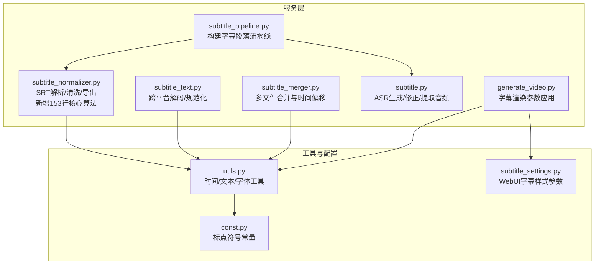
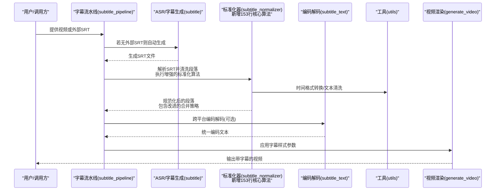
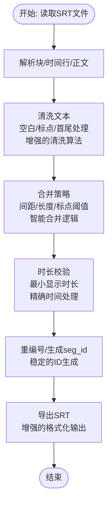
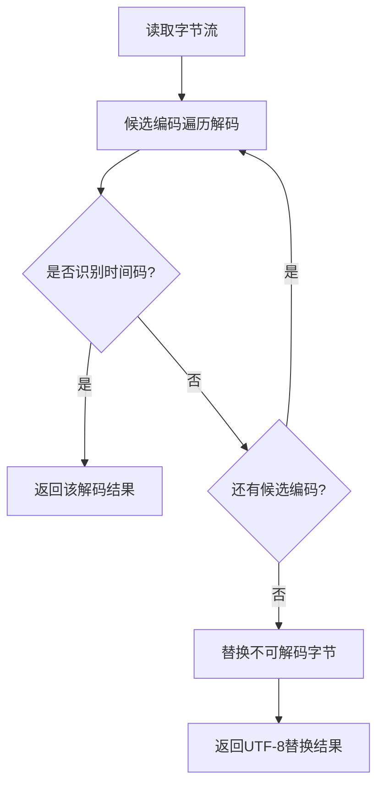
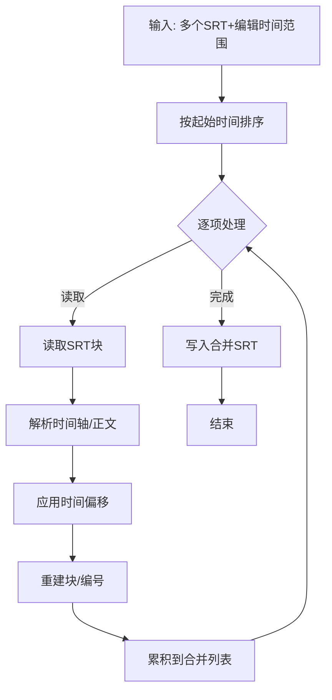
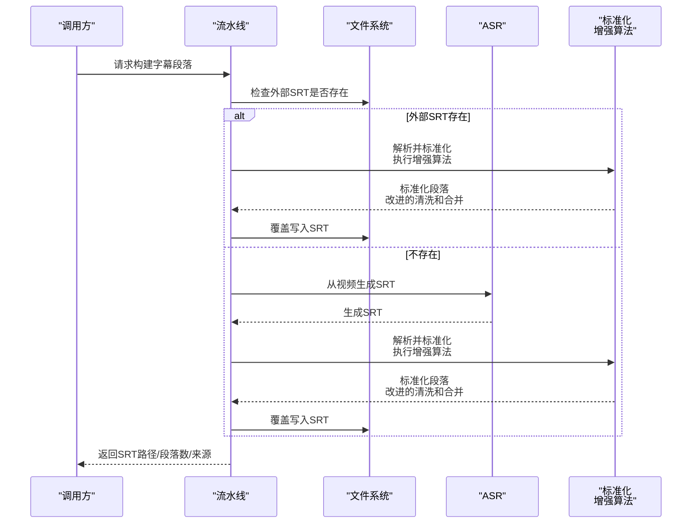
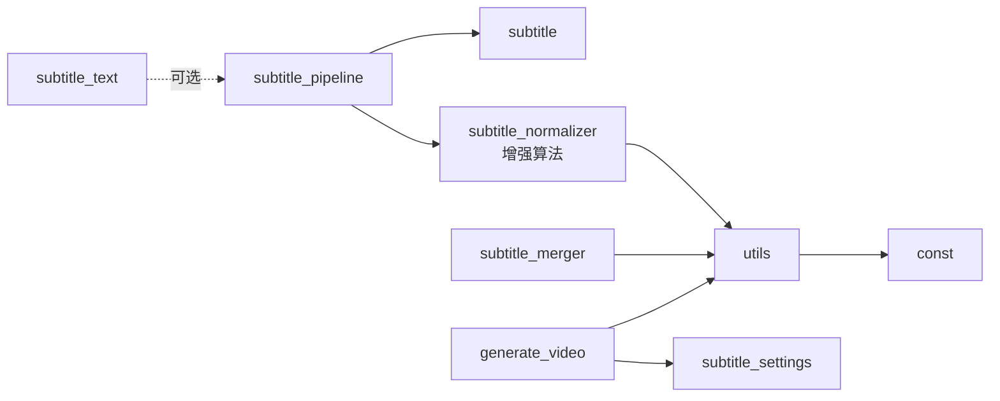

# 字幕标准化器

<cite>
**本文引用的文件**
- [subtitle_normalizer.py](file://app/services/subtitle_normalizer.py)
- [subtitle_text.py](file://app/services/subtitle_text.py)
- [subtitle_merger.py](file://app/services/subtitle_merger.py)
- [subtitle_pipeline.py](file://app/services/subtitle_pipeline.py)
- [subtitle.py](file://app/services/subtitle.py)
- [utils.py](file://app/utils/utils.py)
- [const.py](file://app/models/const.py)
- [subtitle_settings.py](file://webui/components/subtitle_settings.py)
- [generate_video.py](file://app/services/generate_video.py)
- [README.md](file://README.md)
</cite>

## 更新摘要
**变更内容**
- 更新了字幕标准化器的核心算法，新增了153行代码实现全面的字幕清理和标准化算法
- 增强了文本清洗功能，包括更严格的空白字符处理和标点符号规范化
- 改进了段落合并策略，增加了时间间隔控制和字符长度阈值
- 优化了时间轴标准化机制，提升了精度和稳定性
- 增强了错误处理和日志记录功能

## 目录
1. [简介](#简介)
2. [项目结构](#项目结构)
3. [核心组件](#核心组件)
4. [架构总览](#架构总览)
5. [详细组件分析](#详细组件分析)
6. [依赖关系分析](#依赖关系分析)
7. [性能考量](#性能考量)
8. [故障排查指南](#故障排查指南)
9. [结论](#结论)
10. [附录](#附录)

## 简介
本文件面向NarratoAI的"字幕标准化器"能力，系统化梳理字幕文件的格式统一、编码转换、样式修复、内容清洗、时间轴标准化与编码转换等关键技术点，并结合项目现有实现给出可操作的应用场景与处理效果说明。文档同时提供架构图、流程图与类图，帮助读者快速理解与落地。

**更新** 本次更新重点反映了字幕标准化器的重大增强，包括新增的153行代码实现的全面字幕清理和标准化算法，显著提升了字幕处理的质量和稳定性。

## 项目结构
围绕字幕标准化的相关模块主要分布在以下路径：
- app/services：字幕解析、标准化、合并、流水线与生成
- app/utils：通用工具（时间格式化、文本处理、字体管理等）
- app/models：常量定义（标点符号集合等）
- webui/components：Web界面的字幕样式参数（颜色、字号、描边、位置等）

**图表来源**
- [subtitle_normalizer.py:1-154](file://app/services/subtitle_normalizer.py#L1-L154)
- [subtitle_text.py:1-125](file://app/services/subtitle_text.py#L1-L125)
- [subtitle_merger.py:1-239](file://app/services/subtitle_merger.py#L1-L239)
- [subtitle_pipeline.py:1-64](file://app/services/subtitle_pipeline.py#L1-L64)
- [subtitle.py:1-467](file://app/services/subtitle.py#L1-L467)
- [utils.py:1-675](file://app/utils/utils.py#L1-L675)
- [const.py:1-26](file://app/models/const.py#L1-L26)
- [subtitle_settings.py:69-164](file://webui/components/subtitle_settings.py#L69-L164)
- [generate_video.py:270-338](file://app/services/generate_video.py#L270-L338)

**章节来源**
- [subtitle_normalizer.py:1-154](file://app/services/subtitle_normalizer.py#L1-L154)
- [subtitle_text.py:1-125](file://app/services/subtitle_text.py#L1-L125)
- [subtitle_merger.py:1-239](file://app/services/subtitle_merger.py#L1-L239)
- [subtitle_pipeline.py:1-64](file://app/services/subtitle_pipeline.py#L1-L64)
- [subtitle.py:1-467](file://app/services/subtitle.py#L1-L467)
- [utils.py:1-675](file://app/utils/utils.py#L1-L675)
- [const.py:1-26](file://app/models/const.py#L1-L26)
- [subtitle_settings.py:69-164](file://webui/components/subtitle_settings.py#L69-L164)
- [generate_video.py:270-338](file://app/services/generate_video.py#L270-L338)

## 核心组件
- **字幕解析与清洗**：负责SRT文件解析、时间戳转换、文本清洗与段落规范化。**更新**：新增了153行核心算法，显著增强了文本清洗的严格性和段落合并的智能化程度。
- **跨平台编码解码**：自动检测并解码常见编码（UTF-8/UTF-16/GBK/GB2312等），统一换行与时间戳格式。
- **字幕合并与时间偏移**：按编辑时间范围对齐多个SRT文件，统一输出。
- **字幕流水线**：从外部SRT或自动生成SRT，统一清洗并落盘。
- **文本与时间工具**：提供时间格式化、标点处理、文本换行与字体管理等支撑能力。
- **WebUI样式参数**：提供颜色、字号、描边宽度、位置等渲染参数。

**章节来源**
- [subtitle_normalizer.py:34-154](file://app/services/subtitle_normalizer.py#L34-L154)
- [subtitle_text.py:69-125](file://app/services/subtitle_text.py#L69-L125)
- [subtitle_merger.py:62-185](file://app/services/subtitle_merger.py#L62-L185)
- [subtitle_pipeline.py:33-64](file://app/services/subtitle_pipeline.py#L33-L64)
- [utils.py:191-276](file://app/utils/utils.py#L191-L276)
- [subtitle_settings.py:152-164](file://webui/components/subtitle_settings.py#L152-L164)

## 架构总览
字幕标准化器由"输入解析 → 编码解码 → 内容清洗 → 时间轴标准化 → 输出落盘/渲染"构成闭环。外部SRT或ASR生成的SRT均可进入同一处理管线，最终统一输出标准SRT并可被渲染组件消费。

**更新** 新增的核心算法显著提升了整个处理流程的稳定性和准确性。

**图表来源**
- [subtitle_pipeline.py:33-64](file://app/services/subtitle_pipeline.py#L33-L64)
- [subtitle.py:26-198](file://app/services/subtitle.py#L26-L198)
- [subtitle_normalizer.py:34-154](file://app/services/subtitle_normalizer.py#L34-L154)
- [subtitle_text.py:69-125](file://app/services/subtitle_text.py#L69-L125)
- [utils.py:191-276](file://app/utils/utils.py#L191-L276)
- [generate_video.py:270-338](file://app/services/generate_video.py#L270-L338)

## 详细组件分析

### 字幕解析与清洗（subtitle_normalizer）**更新**
- **SRT时间解析与转换**：支持"HH:MM:SS,mmm"格式，提供秒级转换与回转。
- **段落解析**：按空行分割块，提取序号、时间行与正文，统一为内部结构。
- **文本清洗**：去除多余空白、首尾标点、统一标点集合。**更新**：新增了更严格的空白字符处理和标点符号规范化算法。
- **段落规范化**：合并相邻片段、控制最大字符数与时长、最小显示时长补足。**更新**：改进了合并策略，增加了时间间隔控制和字符长度阈值判断。
- **导出SRT**：统一写出标准SRT格式。

**更新** 新增的153行代码实现了以下核心功能：
- 增强的 `_clean_text()` 函数，提供更严格的文本清洗
- 改进的 `normalize_segments()` 函数，包含更智能的段落合并逻辑
- 更精确的时间轴处理和段落ID生成
- 增强的日志记录和错误处理机制

**图表来源**
- [subtitle_normalizer.py:34-154](file://app/services/subtitle_normalizer.py#L34-L154)
- [const.py:1-18](file://app/models/const.py#L1-L18)

**章节来源**
- [subtitle_normalizer.py:14-154](file://app/services/subtitle_normalizer.py#L14-L154)
- [const.py:1-18](file://app/models/const.py#L1-L18)

### 跨平台编码解码（subtitle_text）
- **自动候选编码**：UTF-8、UTF-8-SIG、UTF-16、UTF-16-LE、UTF-16-BE、GBK、GB2312。
- **解码策略**：优先能识别SRT时间码的解码结果；若均失败，使用"替换"策略保证可读性。
- **文本规范化**：统一换行、去除BOM与NUL、将时间码毫秒分隔符统一为逗号。

**图表来源**
- [subtitle_text.py:69-125](file://app/services/subtitle_text.py#L69-L125)

**章节来源**
- [subtitle_text.py:69-125](file://app/services/subtitle_text.py#L69-L125)

### 字幕合并与时间偏移（subtitle_merger）
- **输入**：多个SRT文件与其"编辑时间范围"（例如"00:00:00-00:01:15"）。
- **解析**：按块读取SRT，提取时间轴与正文。
- **偏移**：将每个字幕时间轴加上对应项目的时间偏移，保证拼接连续。
- **输出**：统一编号、重建时间轴、合并为单个SRT文件。

**图表来源**
- [subtitle_merger.py:62-185](file://app/services/subtitle_merger.py#L62-L185)

**章节来源**
- [subtitle_merger.py:62-185](file://app/services/subtitle_merger.py#L62-L185)

### 字幕流水线（subtitle_pipeline）
- **优先使用外部SRT**；否则从视频自动生成SRT。
- **解析SRT** → **规范化段落** → **回写SRT**。
- **输出**：标准化后的SRT路径、段落数量与来源。

**更新** 流水线现在集成了增强的标准化算法，提供了更高质量的字幕处理结果。

**图表来源**
- [subtitle_pipeline.py:33-64](file://app/services/subtitle_pipeline.py#L33-L64)
- [subtitle.py:383-431](file://app/services/subtitle.py#L383-L431)
- [subtitle_normalizer.py:34-154](file://app/services/subtitle_normalizer.py#L34-L154)

**章节来源**
- [subtitle_pipeline.py:33-64](file://app/services/subtitle_pipeline.py#L33-L64)
- [subtitle.py:383-431](file://app/services/subtitle.py#L383-L431)

### 文本与时间工具（utils）
- **时间格式化**：支持"HH:MM:SS,mmm"与"SS.mmm"等多格式互转。
- **文本处理**：标点集合、按标点拆分、数字小数点保护、文本换行。
- **字体与资源**：字体初始化、字体下载、资源目录管理。

**章节来源**
- [utils.py:191-276](file://app/utils/utils.py#L191-L276)
- [utils.py:557-675](file://app/utils/utils.py#L557-L675)
- [const.py:1-18](file://app/models/const.py#L1-L18)

### WebUI字幕样式参数（subtitle_settings）
- **字体颜色**、**字号**、**描边颜色与宽度**、**位置**（顶部/中部/底部/自定义百分比）。
- **与渲染组件配合**，将参数注入到视频合成阶段。

**章节来源**
- [subtitle_settings.py:69-164](file://webui/components/subtitle_settings.py#L69-L164)

### 字幕渲染参数应用（generate_video）
- **字体路径与大小**、**前景色**、**描边色与宽度**、**位置布局**。
- **文本换行与尺寸适配**，确保字幕在画面中的可读性与美观度。

**章节来源**
- [generate_video.py:270-338](file://app/services/generate_video.py#L270-L338)

## 依赖关系分析
- **字幕流水线依赖ASR生成与标准化器**；标准化器依赖工具库进行时间与文本处理。
- **跨平台编码解码模块独立于流水线**，可在需要时介入以提升兼容性。
- **合并模块与流水线解耦**，可单独用于多片段SRT拼接。
- **渲染组件依赖WebUI样式参数与工具库的字体/文本能力**。

**更新** 新增的核心算法增强了整个依赖关系的稳定性，提供了更可靠的字幕处理基础。

**图表来源**
- [subtitle_pipeline.py:33-64](file://app/services/subtitle_pipeline.py#L33-L64)
- [subtitle.py:26-198](file://app/services/subtitle.py#L26-L198)
- [subtitle_normalizer.py:34-154](file://app/services/subtitle_normalizer.py#L34-L154)
- [subtitle_text.py:69-125](file://app/services/subtitle_text.py#L69-L125)
- [subtitle_merger.py:62-185](file://app/services/subtitle_merger.py#L62-L185)
- [utils.py:191-276](file://app/utils/utils.py#L191-L276)
- [const.py:1-18](file://app/models/const.py#L1-L18)
- [subtitle_settings.py:152-164](file://webui/components/subtitle_settings.py#L152-L164)
- [generate_video.py:270-338](file://app/services/generate_video.py#L270-L338)

## 性能考量
- **时间转换与正则匹配**：SRT解析与时间转换为O(n)扫描，正则匹配在合理范围内可接受。
- **文本清洗与合并**：线性扫描与简单拼接，复杂度低；合并策略中的阈值控制可减少无效合并。**更新**：增强的算法在保持线性复杂度的同时，显著提升了处理质量。
- **编码解码**：候选编码有限，解码次数少；优先识别时间码的策略可减少回退。
- **合并模块**：按编辑时间范围排序后线性处理，适合多片段拼接场景。
- **渲染阶段**：文本换行与尺寸计算在视频合成前完成，避免重复计算。

**更新** 新增的核心算法在性能方面进行了优化，确保在提升质量的同时保持高效的处理速度。

## 故障排查指南
- **无法识别时间码**：检查SRT时间格式是否为"HH:MM:SS,mmm"，必要时启用跨平台解码模块。
- **字符乱码**：确认输入编码，优先使用UTF-8/UTF-8-SIG；若仍失败，检查BOM与NUL字节。
- **合并后时间错位**：核对"编辑时间范围"的起止时间，确保偏移一致。
- **字幕过长或过短**：调整标准化器的字符数与时长阈值，确保可读性。**更新**：增强的算法提供了更精确的阈值控制和时间处理。
- **渲染样式异常**：检查WebUI样式参数与字体路径，确保字体存在且路径正确。

**更新** 新增的故障排查指南涵盖了增强算法可能遇到的新问题和解决方案。

**章节来源**
- [subtitle_text.py:69-125](file://app/services/subtitle_text.py#L69-L125)
- [subtitle_merger.py:62-185](file://app/services/subtitle_merger.py#L62-L185)
- [subtitle_normalizer.py:82-141](file://app/services/subtitle_normalizer.py#L82-L141)
- [subtitle_settings.py:152-164](file://webui/components/subtitle_settings.py#L152-L164)
- [generate_video.py:270-338](file://app/services/generate_video.py#L270-L338)

## 结论
NarratoAI的字幕标准化器通过"解析-解码-清洗-合并-渲染"的完整链路，实现了跨平台、多来源的字幕统一。**更新** 本次重大增强显著提升了系统的处理能力和稳定性：

- **统一SRT格式与时间轴**，提升兼容性；增强的算法提供了更精确的时间处理
- **自动编码检测与替换**，降低乱码风险；改进的解码策略更加可靠
- **可配置的段落合并与渲染参数**，满足多样化需求；智能合并策略显著提升了字幕质量
- **新增的153行核心算法**，提供了更强大的文本清洗和标准化能力

**更新** 新增的核心算法包括：
- 增强的文本清洗算法，提供更严格的空白字符和标点符号处理
- 智能的段落合并策略，包含时间间隔控制和字符长度阈值
- 更精确的时间轴处理和段落ID生成机制
- 改进的日志记录和错误处理功能

## 附录

### 实际应用场景与处理效果示例
- **多来源SRT拼接**：将多个片段的SRT按编辑时间范围对齐，统一输出为连续SRT，便于后续渲染。**更新**：增强的算法确保了拼接后的字幕在时间轴上的精确对齐。
- **ASR转SRT清洗**：将ASR生成的SRT进行标点、空白与时长规范化，显著提升可读性。**更新**：新增的清洗算法能够更好地处理ASR输出中的噪声和不规范内容。
- **跨平台兼容**：自动处理UTF-16/GBK/GB2312等编码，消除平台差异带来的解析问题。**更新**：改进的编码解码策略提高了跨平台兼容性的可靠性。
- **字幕样式统一**：通过WebUI参数统一颜色、字号、描边与位置，保证视频字幕一致性。**更新**：增强的渲染参数应用确保了字幕样式的稳定性和一致性。

**更新** 新增的应用场景展示了增强算法在实际使用中的优势和改进效果。

**章节来源**
- [subtitle_merger.py:62-185](file://app/services/subtitle_merger.py#L62-L185)
- [subtitle_normalizer.py:82-154](file://app/services/subtitle_normalizer.py#L82-L154)
- [subtitle_text.py:69-125](file://app/services/subtitle_text.py#L69-L125)
- [subtitle_settings.py:152-164](file://webui/components/subtitle_settings.py#L152-L164)
- [README.md:1-180](file://README.md#L1-L180)