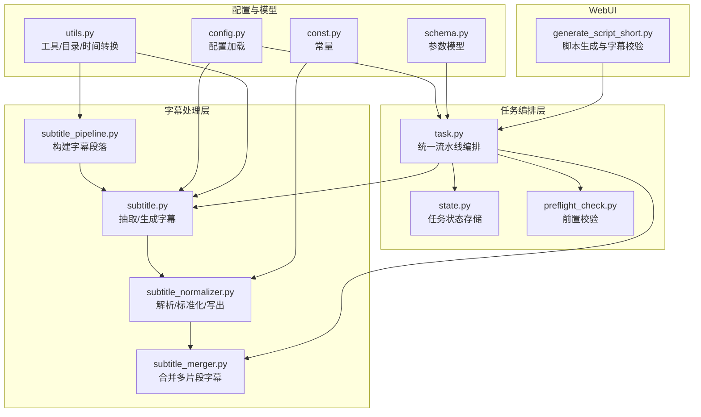
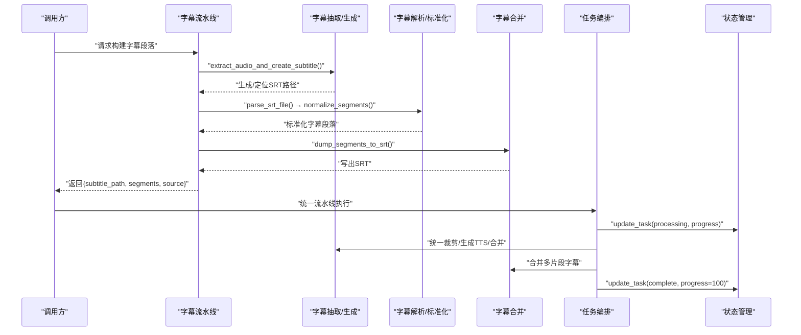
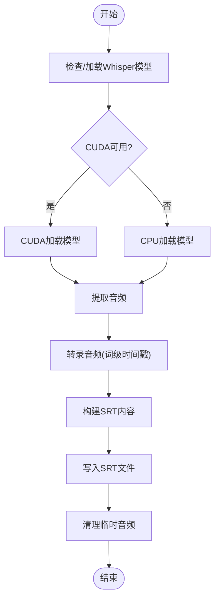
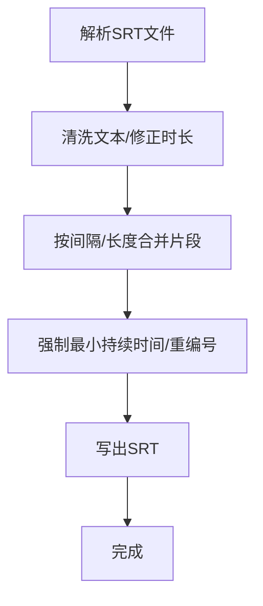
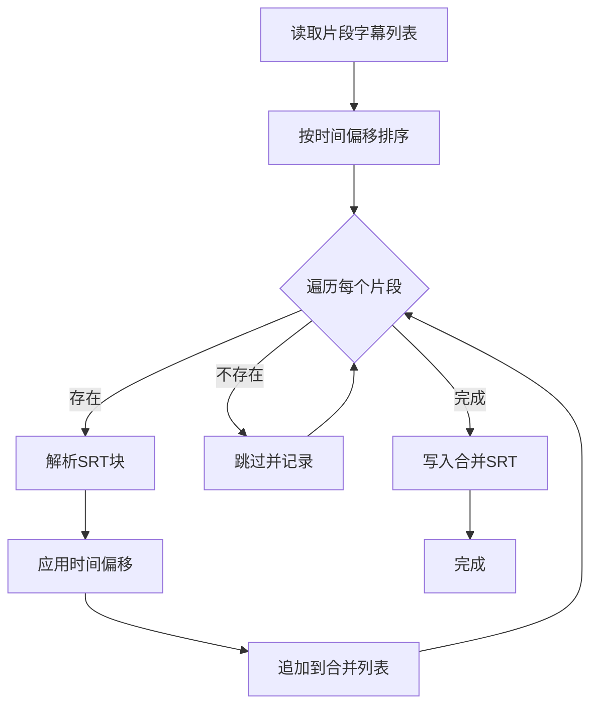
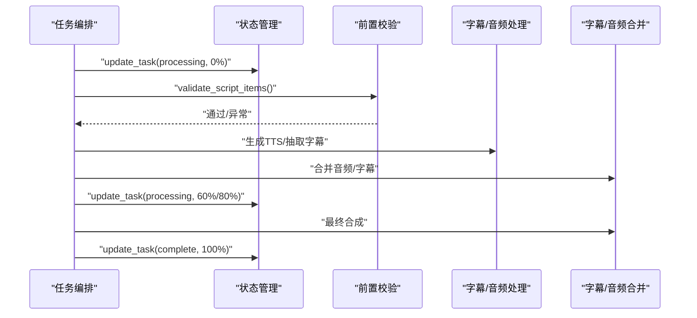
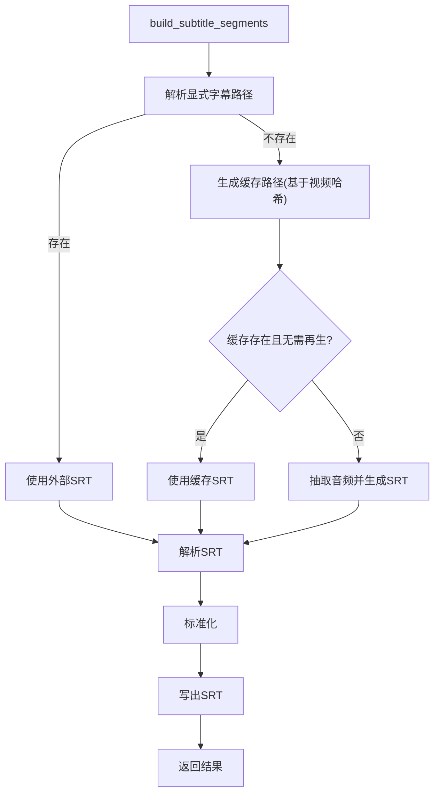
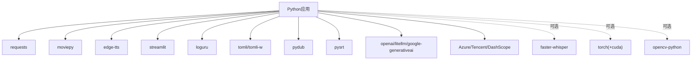

# 字幕流水线

<cite>
**本文引用的文件**
- [app/services/subtitle_pipeline.py](file://app/services/subtitle_pipeline.py)
- [app/services/subtitle.py](file://app/services/subtitle.py)
- [app/services/subtitle_normalizer.py](file://app/services/subtitle_normalizer.py)
- [app/services/subtitle_merger.py](file://app/services/subtitle_merger.py)
- [app/services/task.py](file://app/services/task.py)
- [app/services/state.py](file://app/services/state.py)
- [app/models/schema.py](file://app/models/schema.py)
- [app/utils/utils.py](file://app/utils/utils.py)
- [app/config/config.py](file://app/config/config.py)
- [app/models/const.py](file://app/models/const.py)
- [app/services/preflight_check.py](file://app/services/preflight_check.py)
- [webui/tools/generate_script_short.py](file://webui/tools/generate_script_short.py)
- [Dockerfile](file://Dockerfile)
- [requirements.txt](file://requirements.txt)
- [README.md](file://README.md)
</cite>

## 目录
1. [简介](#简介)
2. [项目结构](#项目结构)
3. [核心组件](#核心组件)
4. [架构总览](#架构总览)
5. [详细组件分析](#详细组件分析)
6. [依赖分析](#依赖分析)
7. [性能考虑](#性能考虑)
8. [故障排查指南](#故障排查指南)
9. [结论](#结论)
10. [附录](#附录)

## 简介
本文件面向NarratoAI的字幕流水线系统，围绕“任务调度、状态管理、错误恢复、并行化设计、监控与日志、扩展性与配置、容错机制、部署与使用”等方面，提供系统化的技术文档。字幕流水线负责从视频中提取音频并生成SRT字幕，对字幕进行解析与标准化，以及在最终视频合成阶段合并字幕与音视频素材。

## 项目结构
- 字幕处理核心模块集中在 app/services 下，包括字幕抽取、解析、标准化、合并等。
- 任务编排与状态管理位于 app/services/task.py 与 app/services/state.py。
- 配置与模型定义位于 app/config 与 app/models。
- WebUI侧的脚本生成工具位于 webui/tools，用于短剧脚本生成与字幕校验。
- Dockerfile、requirements.txt、README.md 提供容器化部署与运行指引。

**图表来源**
- [app/services/subtitle_pipeline.py:1-64](file://app/services/subtitle_pipeline.py#L1-L64)
- [app/services/subtitle.py:1-467](file://app/services/subtitle.py#L1-L467)
- [app/services/subtitle_normalizer.py:1-154](file://app/services/subtitle_normalizer.py#L1-L154)
- [app/services/subtitle_merger.py:1-239](file://app/services/subtitle_merger.py#L1-L239)
- [app/services/task.py:1-272](file://app/services/task.py#L1-L272)
- [app/services/state.py:1-123](file://app/services/state.py#L1-L123)
- [app/services/preflight_check.py:1-31](file://app/services/preflight_check.py#L1-L31)
- [app/config/config.py:1-95](file://app/config/config.py#L1-L95)
- [app/models/schema.py:1-209](file://app/models/schema.py#L1-L209)
- [app/models/const.py:1-26](file://app/models/const.py#L1-L26)
- [app/utils/utils.py:1-675](file://app/utils/utils.py#L1-L675)
- [webui/tools/generate_script_short.py:1-128](file://webui/tools/generate_script_short.py#L1-L128)

**章节来源**
- [app/services/subtitle_pipeline.py:1-64](file://app/services/subtitle_pipeline.py#L1-L64)
- [app/services/subtitle.py:1-467](file://app/services/subtitle.py#L1-L467)
- [app/services/subtitle_normalizer.py:1-154](file://app/services/subtitle_normalizer.py#L1-L154)
- [app/services/subtitle_merger.py:1-239](file://app/services/subtitle_merger.py#L1-L239)
- [app/services/task.py:1-272](file://app/services/task.py#L1-L272)
- [app/services/state.py:1-123](file://app/services/state.py#L1-L123)
- [app/config/config.py:1-95](file://app/config/config.py#L1-L95)
- [app/models/schema.py:1-209](file://app/models/schema.py#L1-L209)
- [app/models/const.py:1-26](file://app/models/const.py#L1-L26)
- [app/utils/utils.py:1-675](file://app/utils/utils.py#L1-L675)
- [webui/tools/generate_script_short.py:1-128](file://webui/tools/generate_script_short.py#L1-L128)

## 核心组件
- 字幕抽取与生成：封装Whisper与Gemini两种方案，支持从视频提取音频并生成SRT。
- 字幕解析与标准化：解析SRT文件，清洗与合并片段，保证时序与长度约束。
- 字幕合并：按编辑时间偏移合并多片段字幕，生成最终SRT。
- 任务编排：统一视频处理流水线，包含脚本加载、TTS生成、视频裁剪、音频/字幕合并、最终合成。
- 状态管理：内存态与Redis态双实现，支持分布式部署下的任务状态共享。
- 配置与模型：集中式配置加载，参数模型定义与默认值。
- WebUI集成：短剧脚本生成与字幕校验，确保输入合法性。

**章节来源**
- [app/services/subtitle.py:26-198](file://app/services/subtitle.py#L26-L198)
- [app/services/subtitle_normalizer.py:34-141](file://app/services/subtitle_normalizer.py#L34-L141)
- [app/services/subtitle_merger.py:62-185](file://app/services/subtitle_merger.py#L62-L185)
- [app/services/task.py:195-247](file://app/services/task.py#L195-L247)
- [app/services/state.py:18-122](file://app/services/state.py#L18-L122)
- [app/config/config.py:24-95](file://app/config/config.py#L24-L95)
- [app/models/schema.py:108-209](file://app/models/schema.py#L108-L209)
- [webui/tools/generate_script_short.py:13-128](file://webui/tools/generate_script_short.py#L13-L128)

## 架构总览
字幕流水线采用“模块化+编排”的架构：
- 输入：视频文件或外部SRT。
- 处理：抽取/生成 → 解析/标准化 → 合并。
- 输出：标准化SRT与最终视频。
- 状态：统一更新任务状态与进度，支持内存或Redis持久化。

**图表来源**
- [app/services/subtitle_pipeline.py:33-63](file://app/services/subtitle_pipeline.py#L33-L63)
- [app/services/subtitle.py:383-431](file://app/services/subtitle.py#L383-L431)
- [app/services/subtitle_normalizer.py:34-153](file://app/services/subtitle_normalizer.py#L34-L153)
- [app/services/subtitle_merger.py:62-185](file://app/services/subtitle_merger.py#L62-L185)
- [app/services/task.py:195-247](file://app/services/task.py#L195-L247)
- [app/services/state.py:23-41](file://app/services/state.py#L23-L41)

## 详细组件分析

### 字幕抽取与生成（Whisper/Gemini）
- Whisper方案：延迟加载模型，自动探测CUDA/CPU，支持VAD降噪与词级时间戳，输出SRT。
- Gemini方案：通过API生成SRT文本并写出。
- 视频到字幕：提取音频到临时目录，调用抽取函数，完成后清理临时音频文件。

**图表来源**
- [app/services/subtitle.py:26-198](file://app/services/subtitle.py#L26-L198)
- [app/services/subtitle.py:383-431](file://app/services/subtitle.py#L383-L431)

**章节来源**
- [app/services/subtitle.py:26-198](file://app/services/subtitle.py#L26-L198)
- [app/services/subtitle.py:383-431](file://app/services/subtitle.py#L383-L431)

### 字幕解析与标准化
- 解析：正则匹配SRT时间轴，提取每条字幕的起止与文本。
- 标准化：清洗空白与标点、合并相邻片段、强制最小持续时间、重编号。
- 写出：将标准化结果写回SRT文件。

**图表来源**
- [app/services/subtitle_normalizer.py:34-153](file://app/services/subtitle_normalizer.py#L34-L153)

**章节来源**
- [app/services/subtitle_normalizer.py:34-153](file://app/services/subtitle_normalizer.py#L34-L153)

### 字幕合并（多片段）
- 按editedTimeRange排序，逐条读取SRT块，应用时间偏移，重建索引并合并输出。
- 支持空文件/无效时间范围的容错处理。

**图表来源**
- [app/services/subtitle_merger.py:62-185](file://app/services/subtitle_merger.py#L62-L185)

**章节来源**
- [app/services/subtitle_merger.py:62-185](file://app/services/subtitle_merger.py#L62-L185)

### 任务编排与状态管理
- 统一流水线：加载脚本、生成/合并TTS与字幕、统一裁剪、合并视频、最终合成。
- 状态管理：MemoryState与RedisState双实现，支持分布式部署。
- 前置校验：脚本完整性与TTS结果校验，缺失时抛出PreflightError。

**图表来源**
- [app/services/task.py:195-247](file://app/services/task.py#L195-L247)
- [app/services/state.py:18-122](file://app/services/state.py#L18-L122)
- [app/services/preflight_check.py:11-30](file://app/services/preflight_check.py#L11-L30)

**章节来源**
- [app/services/task.py:195-247](file://app/services/task.py#L195-L247)
- [app/services/state.py:18-122](file://app/services/state.py#L18-L122)
- [app/services/preflight_check.py:11-30](file://app/services/preflight_check.py#L11-L30)

### 字幕流水线入口与候选路径解析
- 支持显式传入外部SRT路径或从会话状态解析候选路径。
- 若无外部SRT且未生成过，则自动生成并缓存到临时目录。

**图表来源**
- [app/services/subtitle_pipeline.py:19-63](file://app/services/subtitle_pipeline.py#L19-L63)

**章节来源**
- [app/services/subtitle_pipeline.py:19-63](file://app/services/subtitle_pipeline.py#L19-L63)

### WebUI脚本生成与字幕校验
- 严格校验视频与字幕上传，支持Gemini等LLM提供商配置。
- 生成脚本后写入session_state，供后续统一流水线使用。

**章节来源**
- [webui/tools/generate_script_short.py:13-128](file://webui/tools/generate_script_short.py#L13-L128)

## 依赖分析
- 外部依赖：requests、moviepy、edge-tts、streamlit、watchdog、loguru、tomli/tomli-w、pydub、pysrt、openai、litellm、google-generativeai、Azure/Tencent DashScope等。
- 可选依赖：faster-whisper、torch系列（CUDA加速）、opencv-python。
- Docker镜像包含ImageMagick、FFmpeg、Git LFS等系统工具。

**图表来源**
- [requirements.txt:1-39](file://requirements.txt#L1-L39)

**章节来源**
- [requirements.txt:1-39](file://requirements.txt#L1-L39)
- [Dockerfile:51-62](file://Dockerfile#L51-L62)

## 性能考虑
- 并行化与线程数：参数模型提供n_threads字段，可在视频处理阶段提升吞吐。
- 临时文件与缓存：使用临时目录与基于视频哈希的缓存避免重复计算。
- 设备选择：Whisper自动探测CUDA/CPU，优先使用GPU以加速转录。
- I/O与磁盘：字幕解析/合并与SRT写出为顺序I/O，建议使用SSD与合理目录布局。
- 日志与可观测性：统一使用loguru记录关键节点耗时与状态变更，便于性能分析。

**章节来源**
- [app/models/schema.py:194-194](file://app/models/schema.py#L194-L194)
- [app/utils/utils.py:557-570](file://app/utils/utils.py#L557-L570)
- [app/services/subtitle.py:64-102](file://app/services/subtitle.py#L64-L102)

## 故障排查指南
- 模型未就绪：Whisper模型目录缺失时会记录错误提示，需按指引下载模型。
- CUDA加载失败：自动回退CPU，若仍失败，检查CUDA/torch安装与驱动。
- 音频轨道缺失：视频无音频时无法生成字幕，需提供带音频的视频。
- 字幕文件异常：解析失败或内容为空时会跳过并记录警告，检查SRT格式。
- 任务状态异常：Redis不可用时自动切换内存态，确认Redis连接配置。
- 前置校验失败：脚本字段缺失或TTS结果不全会抛出PreflightError，检查脚本完整性与TTS引擎配置。

**章节来源**
- [app/services/subtitle.py:38-49](file://app/services/subtitle.py#L38-L49)
- [app/services/subtitle.py:400-403](file://app/services/subtitle.py#L400-L403)
- [app/services/subtitle_merger.py:137-139](file://app/services/subtitle_merger.py#L137-L139)
- [app/services/state.py:116-122](file://app/services/state.py#L116-L122)
- [app/services/preflight_check.py:11-30](file://app/services/preflight_check.py#L11-L30)

## 结论
NarratoAI的字幕流水线以模块化设计为核心，结合任务编排、状态管理与标准化处理，实现了从视频到SRT再到最终视频的自动化闭环。通过可选的CUDA加速、临时缓存与多态状态存储，系统在易用性与可扩展性之间取得良好平衡。建议在生产环境中启用Redis状态存储、配置合适的线程数与模型路径，并结合日志与监控持续优化性能与稳定性。

## 附录

### 部署与使用
- Docker部署：使用docker-compose快速启动，容器内预装FFmpeg与ImageMagick。
- 本地运行：安装依赖、复制配置文件、配置API密钥后启动Streamlit。
- WebUI访问：浏览器打开 http://localhost:8501。

**章节来源**
- [README.md:105-141](file://README.md#L105-L141)
- [Dockerfile:1-89](file://Dockerfile#L1-L89)

### 配置要点
- 配置文件：config.toml由config.py加载，支持多供应商配置与日志级别。
- 路径与环境：通过环境变量注入FFmpeg与ImageMagick路径，确保工具可用。
- 版本与主机：从project_version文件读取版本号，支持监听地址与端口配置。

**章节来源**
- [app/config/config.py:24-95](file://app/config/config.py#L24-L95)