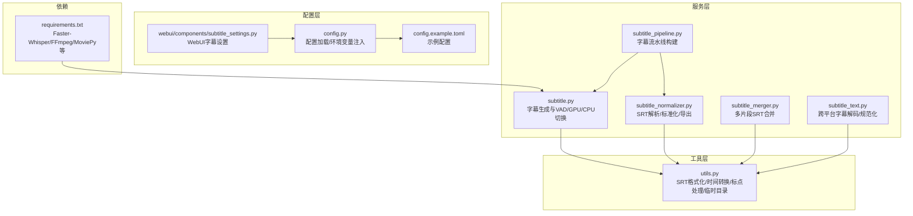
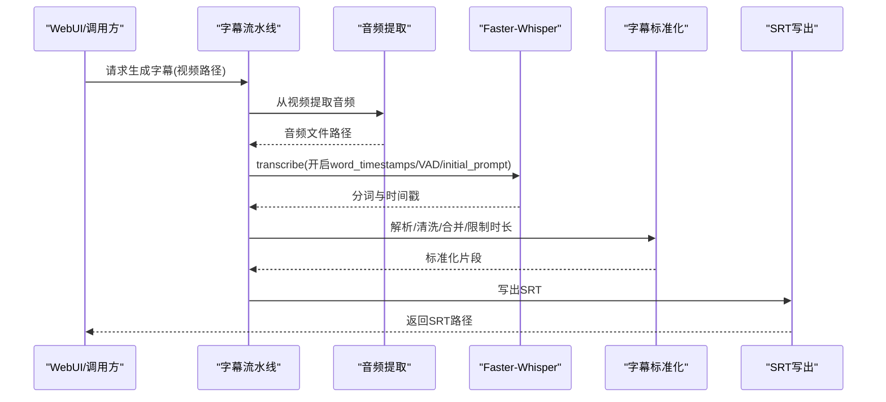
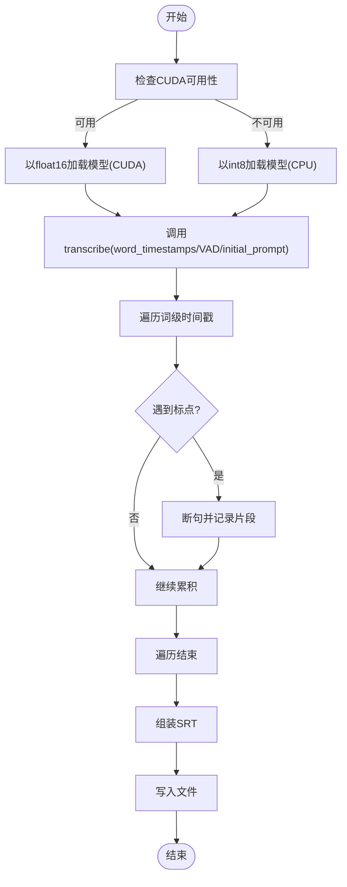
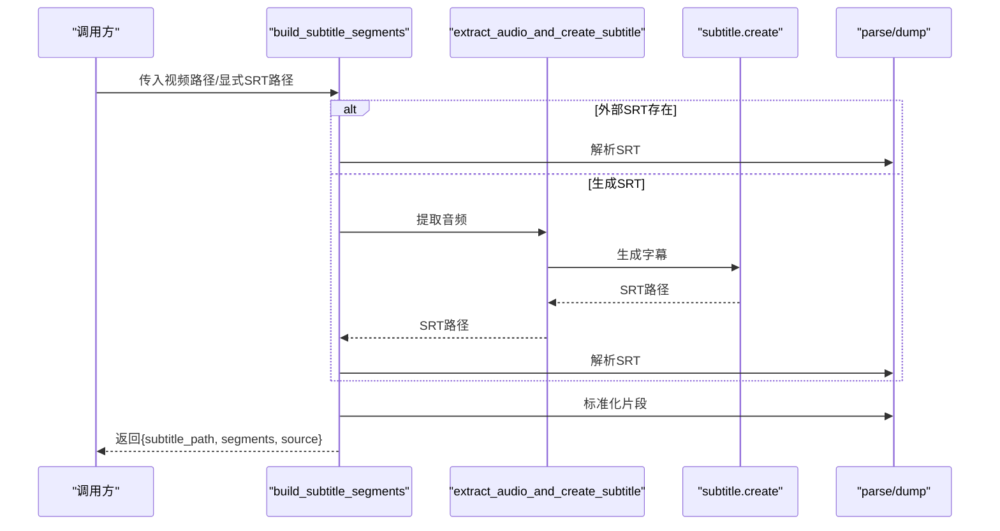
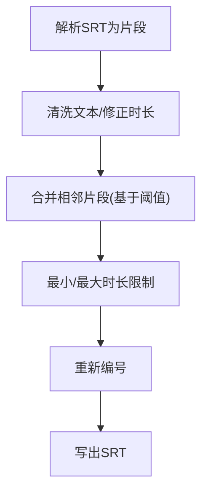
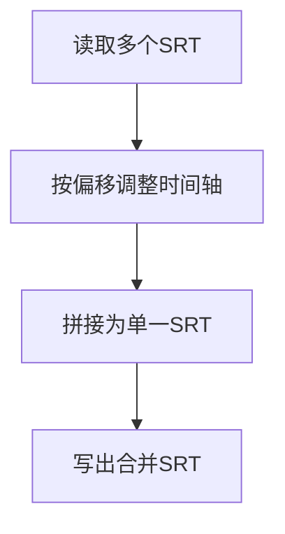
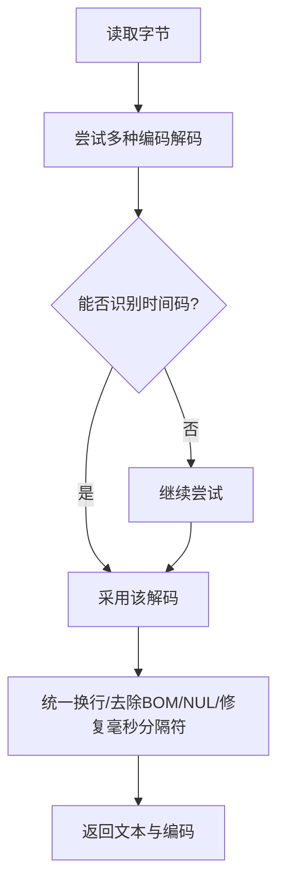
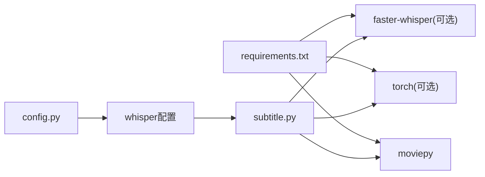

# 字幕生成器

<cite>
**本文引用的文件**
- [app/services/subtitle.py](file://app/services/subtitle.py)
- [app/services/subtitle_pipeline.py](file://app/services/subtitle_pipeline.py)
- [app/services/subtitle_normalizer.py](file://app/services/subtitle_normalizer.py)
- [app/services/subtitle_merger.py](file://app/services/subtitle_merger.py)
- [app/services/subtitle_text.py](file://app/services/subtitle_text.py)
- [app/utils/utils.py](file://app/utils/utils.py)
- [app/config/config.py](file://app/config/config.py)
- [app/models/const.py](file://app/models/const.py)
- [config.example.toml](file://config.example.toml)
- [requirements.txt](file://requirements.txt)
- [webui/components/subtitle_settings.py](file://webui/components/subtitle_settings.py)
</cite>

## 目录
1. [简介](#简介)
2. [项目结构](#项目结构)
3. [核心组件](#核心组件)
4. [架构总览](#架构总览)
5. [详细组件分析](#详细组件分析)
6. [依赖分析](#依赖分析)
7. [性能考虑](#性能考虑)
8. [故障排查指南](#故障排查指南)
9. [结论](#结论)
10. [附录](#附录)

## 简介
本文件面向NarratoAI的字幕生成能力，围绕基于Faster-Whisper的自动字幕生成进行系统化说明。重点覆盖以下方面：
- 模型加载机制与GPU/CPU自动切换
- VAD语音活动检测（VAD Filter）与初始提示（Initial Prompt）
- 语音转文字处理流程：音频预处理、分词识别、时间戳提取、标点断句
- 字幕格式转换：SRT生成、时间轴格式化、文本编码处理
- 多语言支持：语言检测、初始提示设置、跨语言兼容
- 性能优化：批处理、内存管理、计算类型选择
- 实际使用案例与配置建议

## 项目结构
与字幕生成相关的核心模块分布如下：
- 服务层：字幕生成、字幕流水线、字幕标准化、字幕合并、字幕文本处理
- 工具层：通用工具（SRT格式化、时间转换、标点处理、临时目录等）
- 配置层：应用配置、Whisper配置、WebUI字幕设置
- 依赖声明：requirements.txt中对Faster-Whisper与相关工具的依赖

**图表来源**
- [app/services/subtitle.py:1-467](file://app/services/subtitle.py#L1-L467)
- [app/services/subtitle_pipeline.py:1-64](file://app/services/subtitle_pipeline.py#L1-L64)
- [app/services/subtitle_normalizer.py:1-154](file://app/services/subtitle_normalizer.py#L1-L154)
- [app/services/subtitle_merger.py:1-239](file://app/services/subtitle_merger.py#L1-L239)
- [app/services/subtitle_text.py:1-125](file://app/services/subtitle_text.py#L1-L125)
- [app/utils/utils.py:1-675](file://app/utils/utils.py#L1-L675)
- [app/config/config.py:1-95](file://app/config/config.py#L1-L95)
- [config.example.toml:1-177](file://config.example.toml#L1-L177)
- [requirements.txt:1-39](file://requirements.txt#L1-L39)
- [webui/components/subtitle_settings.py:1-165](file://webui/components/subtitle_settings.py#L1-L165)

**章节来源**
- [app/services/subtitle.py:1-467](file://app/services/subtitle.py#L1-L467)
- [app/services/subtitle_pipeline.py:1-64](file://app/services/subtitle_pipeline.py#L1-L64)
- [app/services/subtitle_normalizer.py:1-154](file://app/services/subtitle_normalizer.py#L1-L154)
- [app/services/subtitle_merger.py:1-239](file://app/services/subtitle_merger.py#L1-L239)
- [app/services/subtitle_text.py:1-125](file://app/services/subtitle_text.py#L1-L125)
- [app/utils/utils.py:1-675](file://app/utils/utils.py#L1-L675)
- [app/config/config.py:1-95](file://app/config/config.py#L1-L95)
- [config.example.toml:1-177](file://config.example.toml#L1-L177)
- [requirements.txt:1-39](file://requirements.txt#L1-L39)
- [webui/components/subtitle_settings.py:1-165](file://webui/components/subtitle_settings.py#L1-L165)

## 核心组件
- 基于Faster-Whisper的字幕生成器：负责模型加载、GPU/CPU自动切换、VAD过滤、初始提示、逐词时间戳提取与断句
- 字幕流水线：从视频提取音频并生成字幕，或复用外部SRT，再进行标准化与持久化
- 字幕标准化：解析SRT、清洗文本、合并相邻片段、限制每行字符数与时长
- 字幕合并：按时间偏移合并多个SRT片段，生成最终SRT
- 字幕文本处理：跨平台解码与规范化，处理编码差异与时间码格式
- 通用工具：SRT格式化、时间转换、标点处理、临时目录管理

**章节来源**
- [app/services/subtitle.py:26-198](file://app/services/subtitle.py#L26-L198)
- [app/services/subtitle_pipeline.py:33-63](file://app/services/subtitle_pipeline.py#L33-L63)
- [app/services/subtitle_normalizer.py:34-154](file://app/services/subtitle_normalizer.py#L34-L154)
- [app/services/subtitle_merger.py:62-185](file://app/services/subtitle_merger.py#L62-L185)
- [app/services/subtitle_text.py:40-125](file://app/services/subtitle_text.py#L40-L125)
- [app/utils/utils.py:222-275](file://app/utils/utils.py#L222-L275)

## 架构总览
下图展示从视频到字幕的端到端流程，以及各模块之间的协作关系。

**图表来源**
- [app/services/subtitle_pipeline.py:33-63](file://app/services/subtitle_pipeline.py#L33-L63)
- [app/services/subtitle.py:383-431](file://app/services/subtitle.py#L383-L431)
- [app/services/subtitle_normalizer.py:34-154](file://app/services/subtitle_normalizer.py#L34-L154)

## 详细组件分析

### 基于Faster-Whisper的字幕生成器
- 模型加载与设备选择
  - 首先检查CUDA可用性，若可用则以float16加载模型；否则回退到CPU并使用int8
  - 模型路径来自本地目录，需确保模型文件存在
- VAD与初始提示
  - 开启VAD过滤与最小静音时长参数
  - 设置中文初始提示，有助于提升中文识别质量
- 逐词时间戳与断句
  - 通过word_timestamps获取词级时间戳
  - 遇到标点即断句，形成自然语义片段
  - 对首尾静音进行微调，保证片段边界合理
- SRT生成与落盘
  - 将片段转为SRT格式并写入文件

**图表来源**
- [app/services/subtitle.py:51-134](file://app/services/subtitle.py#L51-L134)
- [app/services/subtitle.py:136-198](file://app/services/subtitle.py#L136-L198)

**章节来源**
- [app/services/subtitle.py:26-198](file://app/services/subtitle.py#L26-L198)

### 字幕流水线
- 输入：视频路径或外部SRT
- 行为：若无外部SRT，则从视频提取音频并生成；随后解析SRT、标准化、写回
- 输出：标准化后的SRT路径与片段列表

**图表来源**
- [app/services/subtitle_pipeline.py:33-63](file://app/services/subtitle_pipeline.py#L33-L63)
- [app/services/subtitle.py:383-431](file://app/services/subtitle.py#L383-L431)
- [app/services/subtitle_normalizer.py:34-154](file://app/services/subtitle_normalizer.py#L34-L154)

**章节来源**
- [app/services/subtitle_pipeline.py:19-63](file://app/services/subtitle_pipeline.py#L19-L63)

### 字幕标准化
- 解析：正则匹配SRT时间轴，提取起止时间与文本
- 清洗：去除多余空白、首尾标点、空片段
- 合并：基于时间间隙、字符数、时长阈值合并相邻片段
- 限制：最小/最大时长约束，避免过短或过长片段
- 导出：重新编号并写出SRT

**图表来源**
- [app/services/subtitle_normalizer.py:34-154](file://app/services/subtitle_normalizer.py#L34-L154)

**章节来源**
- [app/services/subtitle_normalizer.py:82-141](file://app/services/subtitle_normalizer.py#L82-L141)

### 字幕合并
- 输入：多个SRT文件及其时间偏移
- 行为：按偏移调整时间轴，拼接为单一SRT
- 输出：合并后的SRT路径

**图表来源**
- [app/services/subtitle_merger.py:62-185](file://app/services/subtitle_merger.py#L62-L185)

**章节来源**
- [app/services/subtitle_merger.py:62-185](file://app/services/subtitle_merger.py#L62-L185)

### 字幕文本处理（跨平台）
- 功能：检测并规范化SRT文本，统一换行、去除BOM与NUL、修复毫秒分隔符
- 编码：尝试常见编码（UTF-8/UTF-16/GBK/GB2312），优先能识别时间码的解码结果

**图表来源**
- [app/services/subtitle_text.py:69-125](file://app/services/subtitle_text.py#L69-L125)

**章节来源**
- [app/services/subtitle_text.py:40-125](file://app/services/subtitle_text.py#L40-L125)

### 通用工具（SRT/时间/标点）
- SRT格式化：将索引、起止时间、文本组合为SRT块
- 时间转换：秒与“HH:MM:SS,mmm”互转
- 标点处理：判断标点、按标点切分字符串，保留数字小数点

**章节来源**
- [app/utils/utils.py:222-275](file://app/utils/utils.py#L222-L275)

## 依赖分析
- Faster-Whisper与GPU/CPU
  - requirements中未默认安装Faster-Whisper与torch，需按需启用
  - 字幕模块内部动态导入并进行CUDA可用性检查，失败时回退CPU
- FFmpeg与MoviePy
  - 用于从视频提取音频
- 配置注入
  - Whisper配置通过config.toml读取，支持设备与计算类型等参数

**图表来源**
- [requirements.txt:29-39](file://requirements.txt#L29-L39)
- [app/config/config.py:60-71](file://app/config/config.py#L60-L71)
- [app/services/subtitle.py:7-10](file://app/services/subtitle.py#L7-L10)

**章节来源**
- [requirements.txt:1-39](file://requirements.txt#L1-L39)
- [app/config/config.py:24-71](file://app/config/config.py#L24-L71)
- [app/services/subtitle.py:7-10](file://app/services/subtitle.py#L7-L10)

## 性能考虑
- 设备选择与计算类型
  - GPU优先：float16加速推理；失败回退CPU：int8降低内存占用
- VAD与静音过滤
  - 通过VAD减少无效静音区域，提高识别效率与准确性
- 初始提示
  - 中文初始提示有助于提升中文识别稳定性
- 时间戳粒度
  - word_timestamps带来更细粒度的时间边界，便于后续断句与对齐
- 标准化合并
  - 合理的合并阈值可减少片段数量，降低渲染与播放压力
- I/O与临时文件
  - 视频转音频采用临时目录，完成后清理，避免磁盘膨胀

**章节来源**
- [app/services/subtitle.py:51-102](file://app/services/subtitle.py#L51-L102)
- [app/services/subtitle.py:108-115](file://app/services/subtitle.py#L108-L115)
- [app/services/subtitle_normalizer.py:82-141](file://app/services/subtitle_normalizer.py#L82-L141)
- [app/utils/utils.py:557-570](file://app/utils/utils.py#L557-L570)

## 故障排查指南
- 模型未找到
  - 现象：提示需先下载模型
  - 处理：将模型放置到指定目录，确保model.bin存在
- CUDA不可用或加载失败
  - 现象：回退CPU，或加载失败日志
  - 处理：确认CUDA驱动与显卡可用；必要时仅使用CPU模式
- 视频无音频轨
  - 现象：无法自动生成字幕
  - 处理：为视频添加音频轨或提供外部SRT
- 字幕内容为空或格式异常
  - 现象：解析失败或内容过短
  - 处理：检查编码（UTF-8/UTF-16/GBK/GB2312）、时间码格式（逗号毫秒）

**章节来源**
- [app/services/subtitle.py:39-49](file://app/services/subtitle.py#L39-L49)
- [app/services/subtitle.py:83-88](file://app/services/subtitle.py#L83-L88)
- [app/services/subtitle.py:400-403](file://app/services/subtitle.py#L400-L403)
- [app/services/SDP/utils/step1_subtitle_analyzer_openai.py:40-63](file://app/services/SDP/utils/step1_subtitle_analyzer_openai.py#L40-L63)

## 结论
NarratoAI的字幕生成体系以Faster-Whisper为核心，结合VAD过滤、初始提示与逐词时间戳，实现了高质量的中文语音转文字与SRT生成。通过字幕流水线、标准化与合并模块，系统在跨平台兼容性、时间轴一致性与性能优化方面具备良好表现。建议在生产环境中优先使用GPU推理，并配合合理的VAD与初始提示策略，以获得更优的识别效果与运行效率。

## 附录

### 实际使用案例与配置建议
- 使用场景
  - 直接输入视频：系统自动提取音频并生成字幕
  - 外部SRT：直接复用并进行标准化与合并
- 配置建议
  - Whisper设备与计算类型：优先GPU（float16），失败回退CPU（int8）
  - VAD参数：根据音频质量调整最小静音时长
  - 初始提示：针对目标语言设置合适提示词
  - WebUI字幕设置：字体、颜色、位置与描边可根据视频画面对比度调整
- 依赖准备
  - 若启用本地Whisper，需在requirements中启用相关依赖并在系统中安装CUDA与驱动

**章节来源**
- [config.example.toml:140-177](file://config.example.toml#L140-L177)
- [webui/components/subtitle_settings.py:9-165](file://webui/components/subtitle_settings.py#L9-L165)
- [requirements.txt:29-39](file://requirements.txt#L29-L39)