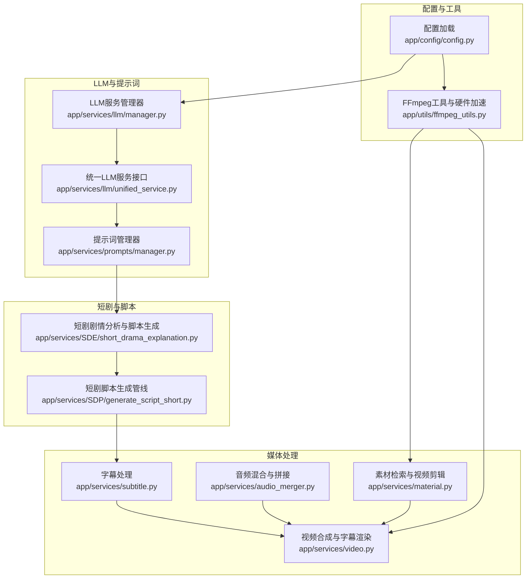
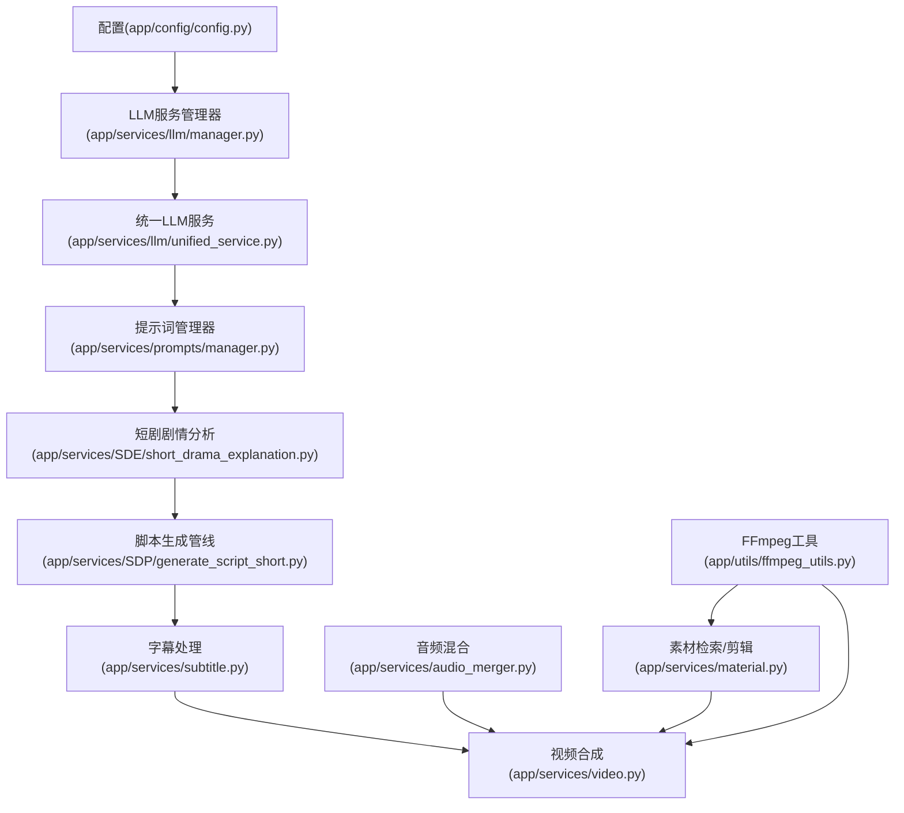
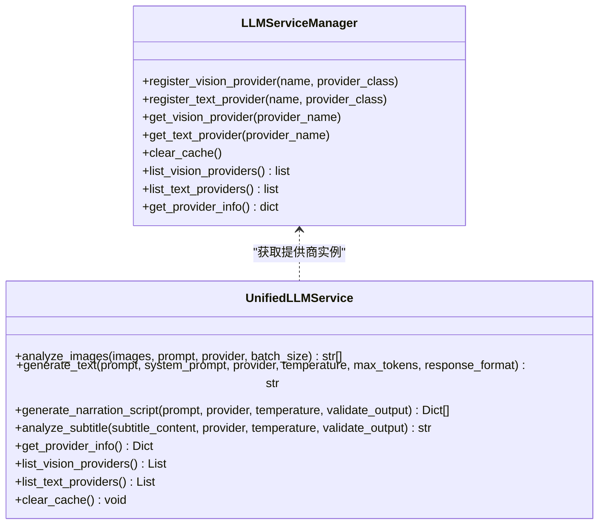
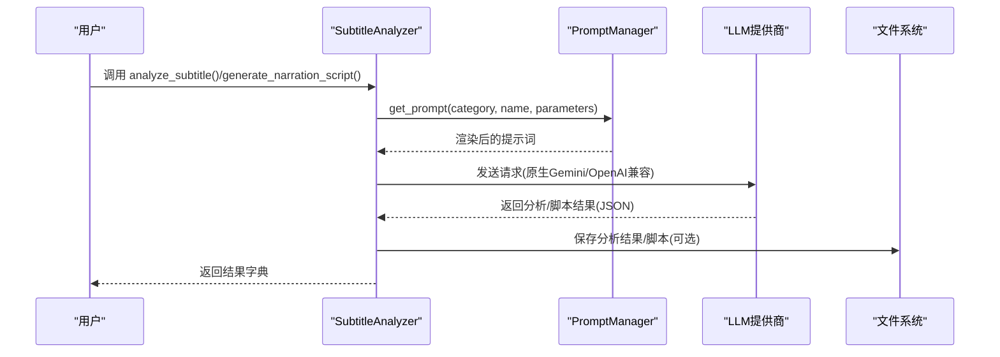
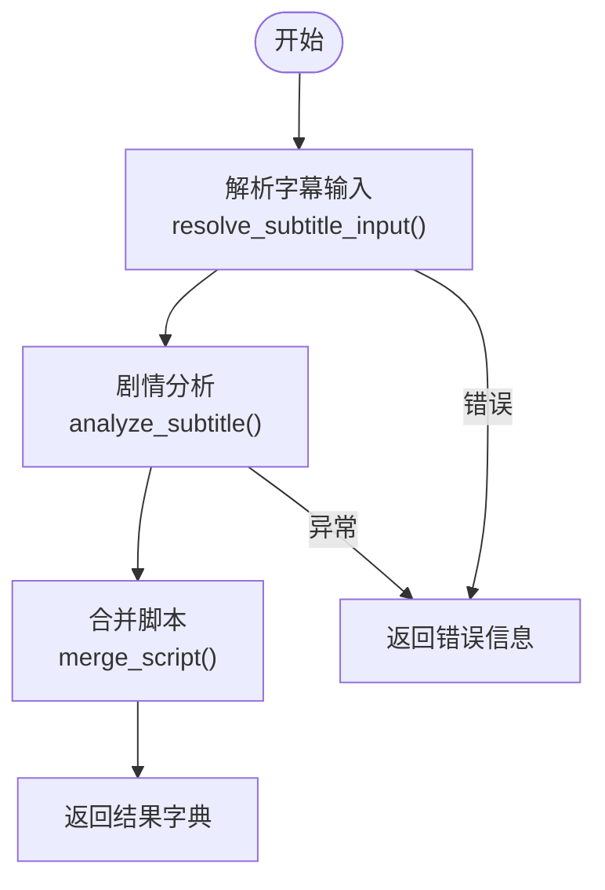
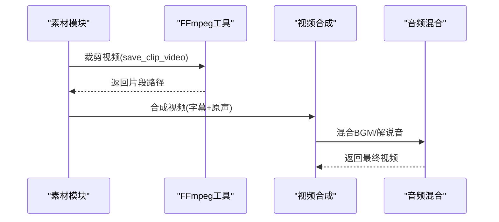

# 核心功能

<cite>
**本文引用的文件**
- [README.md](file://README.md)
- [app/services/llm/manager.py](file://app/services/llm/manager.py)
- [app/services/llm/unified_service.py](file://app/services/llm/unified_service.py)
- [app/services/prompts/manager.py](file://app/services/prompts/manager.py)
- [app/services/SDE/short_drama_explanation.py](file://app/services/SDE/short_drama_explanation.py)
- [app/services/SDP/generate_script_short.py](file://app/services/SDP/generate_script_short.py)
- [app/services/subtitle.py](file://app/services/subtitle.py)
- [app/services/video.py](file://app/services/video.py)
- [app/services/audio_merger.py](file://app/services/audio_merger.py)
- [app/services/material.py](file://app/services/material.py)
- [app/utils/ffmpeg_utils.py](file://app/utils/ffmpeg_utils.py)
- [app/config/config.py](file://app/config/config.py)
- [requirements.txt](file://requirements.txt)
</cite>

## 目录
1. [简介](#简介)
2. [项目结构](#项目结构)
3. [核心组件](#核心组件)
4. [架构总览](#架构总览)
5. [详细组件分析](#详细组件分析)
6. [依赖关系分析](#依赖关系分析)
7. [性能考量](#性能考量)
8. [故障排查指南](#故障排查指南)
9. [结论](#结论)
10. [附录](#附录)

## 简介
NarratoAI 是一个面向影视解说与自动化剪辑的一站式 AI 工具，覆盖“脚本生成—剧情分析—短剧编辑—视频合成—音频混合—字幕处理”的完整工作流。系统通过统一的 LLM 服务管理器对接多家模型供应商，采用提示词模板与校验体系保障输出质量；在视频处理方面，提供智能剪辑、片段拼接与时序匹配；在音频处理方面，集成 TTS 引擎并支持音频混合与音量调节；在字幕处理方面，支持自动转写、对齐与格式转换。

## 项目结构
项目采用按功能域划分的模块化组织方式，核心模块包括：
- LLM 服务管理与统一接口：app/services/llm/*
- 提示词管理与校验：app/services/prompts/*
- 短剧解说与脚本管线：app/services/SDE/*、app/services/SDP/*
- 字幕处理：app/services/subtitle.py
- 视频处理与合成：app/services/video.py、app/services/material.py
- 音频处理与混合：app/services/audio_merger.py
- FFmpeg 工具与硬件加速：app/utils/ffmpeg_utils.py
- 配置与环境：app/config/config.py
- 依赖声明：requirements.txt

图表来源
- [app/config/config.py:1-95](file://app/config/config.py#L1-L95)
- [app/utils/ffmpeg_utils.py:1-800](file://app/utils/ffmpeg_utils.py#L1-L800)
- [app/services/llm/manager.py:1-246](file://app/services/llm/manager.py#L1-L246)
- [app/services/llm/unified_service.py:1-263](file://app/services/llm/unified_service.py#L1-L263)
- [app/services/prompts/manager.py:1-288](file://app/services/prompts/manager.py#L1-L288)
- [app/services/SDE/short_drama_explanation.py:1-778](file://app/services/SDE/short_drama_explanation.py#L1-L778)
- [app/services/SDP/generate_script_short.py:1-126](file://app/services/SDP/generate_script_short.py#L1-L126)
- [app/services/subtitle.py:1-467](file://app/services/subtitle.py#L1-L467)
- [app/services/video.py:1-418](file://app/services/video.py#L1-L418)
- [app/services/audio_merger.py:1-172](file://app/services/audio_merger.py#L1-L172)
- [app/services/material.py:1-580](file://app/services/material.py#L1-L580)

章节来源
- [README.md:1-180](file://README.md#L1-L180)
- [app/config/config.py:1-95](file://app/config/config.py#L1-L95)

## 核心组件
- LLM 服务管理器：统一注册与获取文本/视觉模型提供商，支持缓存与配置校验，提供清晰的错误信息与可用提供商列表。
- 统一 LLM 服务接口：封装图片分析、文本生成、剧情分析、脚本生成等常用能力，提供统一的异步调用入口与输出校验。
- 提示词管理器：集中管理提示词模板、版本与渲染，支持输出格式校验与搜索导出。
- 短剧剧情分析与脚本生成：基于字幕内容进行剧情分析与脚本生成，支持原生 Gemini 与 OpenAI 兼容 API。
- 短剧脚本生成管线：串联字幕解析、剧情分析、脚本合并，提供安全的结果返回与错误处理。
- 字幕处理：支持 Whisper 本地转写、Gemini 在线转写、字幕对齐与格式转换。
- 视频合成与字幕渲染：支持字幕样式、位置、字体、音量配置，自动选择最优编码器并进行硬件加速。
- 音频混合：基于脚本时序叠加 TTS 音频，支持静音片段占位与时序对齐。
- 素材检索与视频剪辑：支持 Pexels/Pixabay 视频素材检索、随机/顺序拼接、FFmpeg 剪辑与硬件加速。
- FFmpeg 工具与硬件加速：跨平台检测硬件加速类型与编码器，提供渐进式降级与参数优化。

章节来源
- [app/services/llm/manager.py:15-246](file://app/services/llm/manager.py#L15-L246)
- [app/services/llm/unified_service.py:20-263](file://app/services/llm/unified_service.py#L20-L263)
- [app/services/prompts/manager.py:26-288](file://app/services/prompts/manager.py#L26-L288)
- [app/services/SDE/short_drama_explanation.py:23-778](file://app/services/SDE/short_drama_explanation.py#L23-L778)
- [app/services/SDP/generate_script_short.py:12-126](file://app/services/SDP/generate_script_short.py#L12-L126)
- [app/services/subtitle.py:26-467](file://app/services/subtitle.py#L26-L467)
- [app/services/video.py:200-418](file://app/services/video.py#L200-L418)
- [app/services/audio_merger.py:21-172](file://app/services/audio_merger.py#L21-L172)
- [app/services/material.py:190-580](file://app/services/material.py#L190-L580)
- [app/utils/ffmpeg_utils.py:118-800](file://app/utils/ffmpeg_utils.py#L118-L800)

## 架构总览
系统采用“配置驱动 + 统一服务 + 模块化处理”的架构：
- 配置层：集中管理 API Key、模型参数、代理与路径等。
- 服务层：LLM 管理器与统一接口提供跨提供商的统一访问；提示词管理器提供模板与校验。
- 处理层：按领域拆分，分别处理脚本、字幕、视频、音频与素材。
- 工具层：FFmpeg 工具与硬件加速检测贯穿视频/音频处理，提升性能与兼容性。

图表来源
- [app/config/config.py:24-95](file://app/config/config.py#L24-L95)
- [app/services/llm/manager.py:15-246](file://app/services/llm/manager.py#L15-L246)
- [app/services/llm/unified_service.py:20-263](file://app/services/llm/unified_service.py#L20-L263)
- [app/services/prompts/manager.py:26-288](file://app/services/prompts/manager.py#L26-L288)
- [app/services/SDE/short_drama_explanation.py:23-778](file://app/services/SDE/short_drama_explanation.py#L23-L778)
- [app/services/SDP/generate_script_short.py:12-126](file://app/services/SDP/generate_script_short.py#L12-L126)
- [app/services/subtitle.py:26-467](file://app/services/subtitle.py#L26-L467)
- [app/services/video.py:200-418](file://app/services/video.py#L200-L418)
- [app/services/audio_merger.py:21-172](file://app/services/audio_merger.py#L21-L172)
- [app/services/material.py:190-580](file://app/services/material.py#L190-L580)
- [app/utils/ffmpeg_utils.py:118-800](file://app/utils/ffmpeg_utils.py#L118-L800)

## 详细组件分析

### LLM 服务管理与统一接口
- 管理器职责
  - 注册文本/视觉提供商，维护缓存实例，按配置获取实例并进行参数校验。
  - 提供查询可用提供商、列出提供商信息等辅助能力。
- 统一接口职责
  - 封装图片分析、文本生成、剧情分析、脚本生成等常用操作。
  - 对输出进行格式校验，必要时解析 JSON 并抽取字段。
- 使用方法
  - 通过配置文件设置提供商名称、模型名、API Key、Base URL。
  - 通过统一接口发起调用，或直接使用管理器获取提供商实例。
- 配置选项
  - 文本/视觉提供商名称、模型名、API Key、Base URL。
  - 日志级别、监听地址与端口等全局配置。
- 最佳实践
  - 启动时显式注册提供商，避免运行期找不到提供商。
  - 使用统一接口进行业务调用，减少对具体提供商的耦合。
  - 对输出进行严格校验，确保后续流程稳定性。

图表来源
- [app/services/llm/manager.py:15-246](file://app/services/llm/manager.py#L15-L246)
- [app/services/llm/unified_service.py:20-263](file://app/services/llm/unified_service.py#L20-L263)

章节来源
- [app/services/llm/manager.py:15-246](file://app/services/llm/manager.py#L15-L246)
- [app/services/llm/unified_service.py:20-263](file://app/services/llm/unified_service.py#L20-L263)
- [app/config/config.py:24-95](file://app/config/config.py#L24-L95)

### 提示词管理与校验
- 管理器能力
  - 按分类/名称/版本获取模板并渲染，支持搜索与统计。
  - 对输出进行格式校验，针对不同提示词类别提供专用校验逻辑。
- 使用方法
  - 通过 PromptManager.get_prompt(category, name, parameters) 获取渲染后的提示词。
  - 通过 validate_output 对生成结果进行格式校验。
- 配置选项
  - 模板参数、输出格式、模型类型等元数据。
- 最佳实践
  - 为关键流程定义稳定版本的提示词模板。
  - 对输出进行严格校验，避免下游处理失败。

章节来源
- [app/services/prompts/manager.py:26-288](file://app/services/prompts/manager.py#L26-L288)

### 短剧剧情分析与脚本生成
- 功能概述
  - 基于字幕内容进行剧情分析，生成 JSON 格式的脚本片段。
  - 支持原生 Gemini 与 OpenAI 兼容 API，自动选择请求格式与参数。
- 处理流程
  - 读取字幕内容 → 构建提示词 → 调用提供商 → 解析响应 → 保存结果。
- 使用方法
  - 通过 SubtitleAnalyzer.analyze_subtitle 或 generate_narration_script 快捷函数。
- 配置选项
  - provider、model、base_url、temperature、自定义提示词等。
- 最佳实践
  - 使用提示词管理器统一模板，确保输出格式一致性。
  - 对分析结果进行保存与复用，便于调试与审计。

图表来源
- [app/services/SDE/short_drama_explanation.py:625-730](file://app/services/SDE/short_drama_explanation.py#L625-L730)
- [app/services/prompts/manager.py:34-61](file://app/services/prompts/manager.py#L34-L61)

章节来源
- [app/services/SDE/short_drama_explanation.py:23-778](file://app/services/SDE/short_drama_explanation.py#L23-L778)
- [app/services/prompts/manager.py:26-288](file://app/services/prompts/manager.py#L26-L288)

### 短剧脚本生成管线
- 功能概述
  - 串联字幕解析、剧情分析、脚本合并，提供安全返回与错误处理。
- 处理流程
  - 解析字幕输入 → 调用剧情分析 → 合并脚本 → 返回结果。
- 使用方法
  - 调用 generate_script_result 或 generate_script，后者向后兼容。
- 配置选项
  - custom_clips、provider、模型参数等。
- 最佳实践
  - 优先使用安全版本 generate_script_result，便于统一处理错误。
  - 对输入进行校验，确保字幕文件或内容有效。

图表来源
- [app/services/SDP/generate_script_short.py:12-126](file://app/services/SDP/generate_script_short.py#L12-L126)

章节来源
- [app/services/SDP/generate_script_short.py:12-126](file://app/services/SDP/generate_script_short.py#L12-L126)

### 字幕处理系统
- 自动字幕生成
  - Whisper 本地转写：支持 CUDA/CPU 自动降级，生成带时间戳的 SRT。
  - Gemini 在线转写：上传音频，生成 SRT。
- 同步对齐算法
  - 基于编辑距离与相似度阈值，合并/修正字幕与脚本内容。
- 格式转换支持
  - 读取/写出 SRT 等常见格式，支持从视频提取音频并生成字幕。
- 使用方法
  - create(audio_file, subtitle_file)：Whisper 转写。
  - create_with_gemini(audio_file, subtitle_file, api_key)：Gemini 转写。
  - correct(subtitle_file, script)：对齐字幕与脚本。
  - extract_audio_and_create_subtitle(video_file, subtitle_file)：从视频提取音频并生成字幕。
- 配置选项
  - Whisper 模型大小、设备、计算类型等。
- 最佳实践
  - 优先使用 Whisper 本地转写，减少网络依赖。
  - 对齐前先进行相似度评估，避免误合并。

章节来源
- [app/services/subtitle.py:26-467](file://app/services/subtitle.py#L26-L467)

### 视频处理与合成
- 自动化剪辑算法
  - 基于时间戳与时长，对视频进行裁剪与拼接，支持硬件加速。
- 片段拼接逻辑
  - 通过 FFmpeg 的 concat 流程拼接多个视频片段。
- 时序匹配技术
  - 依据脚本时长与片段时长进行精确对齐，避免越界与重复。
- 字幕渲染与样式
  - 支持字体、字号、描边、背景色、位置等样式配置。
- 音频混合与音量调节
  - 支持原声、BGM、解说音的音量独立调节与混合。
- 使用方法
  - clip_videos：批量裁剪视频片段。
  - merge_videos：拼接视频片段。
  - generate_video_v3：合成视频、字幕与音频。
- 配置选项
  - subtitle_style、volume_config、字体路径等。
- 最佳实践
  - 优先使用硬件加速编码器，必要时降级为软件编码。
  - 对字幕位置进行动态计算，适配不同分辨率。

图表来源
- [app/services/material.py:323-522](file://app/services/material.py#L323-L522)
- [app/services/video.py:200-418](file://app/services/video.py#L200-L418)
- [app/utils/ffmpeg_utils.py:118-800](file://app/utils/ffmpeg_utils.py#L118-L800)

章节来源
- [app/services/material.py:190-580](file://app/services/material.py#L190-L580)
- [app/services/video.py:200-418](file://app/services/video.py#L200-L418)
- [app/utils/ffmpeg_utils.py:118-800](file://app/utils/ffmpeg_utils.py#L118-L800)

### 音频处理系统
- TTS 引擎集成
  - 支持多种 TTS 引擎与语音资源，生成带边界的时间戳字幕。
- 音频混合技术
  - 基于脚本时序 overlay 叠加音频，支持静音片段占位。
- 音量调节算法
  - 通过 volumex 对各音频轨道进行独立音量控制。
- 使用方法
  - merge_audio_files：按脚本时序合并音频。
  - 结合视频合成模块，将 TTS 音频与原声/BGM 混合。
- 配置选项
  - 任务 ID、总时长、脚本片段（含 duration 与 audio 路径）。
- 最佳实践
  - 确保 FFmpeg 可用，避免音频合并失败。
  - 对空音频片段进行占位，保证时序连续。

章节来源
- [app/services/audio_merger.py:21-172](file://app/services/audio_merger.py#L21-L172)
- [app/services/video.py:320-368](file://app/services/video.py#L320-L368)

## 依赖关系分析
- 核心依赖
  - requests、moviepy、edge-tts、streamlit、loguru、tomli/tomli-w、pydub、pysrt、openai、litellm、google-generativeai、azure-cognitiveservices-speech、tencentcloud-sdk-python、dashscope、Pillow、tqdm、tenacity。
- 可选依赖
  - faster-whisper、opencv-python、torch 系列（按需启用）。
- 依赖关系图

```mermaid
graph TB
REQ["requirements.txt"]
REQ --> REQ1["requests>=2.32.0"]
REQ --> REQ2["moviepy==2.1.1"]
REQ --> REQ3["edge-tts==7.2.7"]
REQ --> REQ4["streamlit>=1.45.0"]
REQ --> REQ5["watchdog==6.0.0"]
REQ --> REQ6["loguru>=0.7.3"]
REQ --> REQ7["tomli>=2.2.1 / tomli-w>=1.0.0"]
REQ --> REQ8["pydub==0.25.1"]
REQ --> REQ9["pysrt==1.1.2"]
REQ --> REQ10["openai>=1.77.0"]
REQ --> REQ11["litellm>=1.70.0"]
REQ --> REQ12["google-generativeai>=0.8.5"]
REQ --> REQ13["azure-cognitiveservices-speech>=1.37.0"]
REQ --> REQ14["tencentcloud-sdk-python>=3.0.1200"]
REQ --> REQ15["dashscope>=1.24.6"]
REQ --> REQ16["Pillow>=10.3.0"]
REQ --> REQ17["tqdm>=4.66.6"]
REQ --> REQ18["tenacity>=9.0.0"]
```

图表来源
- [requirements.txt:1-39](file://requirements.txt#L1-L39)

章节来源
- [requirements.txt:1-39](file://requirements.txt#L1-L39)

## 性能考量
- 硬件加速
  - FFmpeg 工具自动检测平台与 GPU 类型，优先选择 NVENC、VAAPI、QSV、AMF 等硬件加速编码器，失败时自动降级为 libx264。
- 编码器参数
  - 根据检测到的编码器类型设置预设、CRF、profile 等参数，平衡质量与速度。
- 资源管理
  - 视频/音频片段在使用后及时关闭与清理，避免内存泄漏。
- I/O 与并发
  - 使用异步接口封装 LLM 调用，减少阻塞；对文件操作进行缓存与去重。

章节来源
- [app/utils/ffmpeg_utils.py:118-800](file://app/utils/ffmpeg_utils.py#L118-L800)
- [app/services/video.py:91-106](file://app/services/video.py#L91-L106)

## 故障排查指南
- LLM 服务
  - 提供商未注册：检查启动时是否显式注册提供商；查看可用提供商列表。
  - 配置缺失：确认 API Key、模型名、Base URL 等配置项齐全。
  - 输出格式异常：使用统一接口的输出校验功能，定位格式问题。
- 字幕处理
  - Whisper 模型缺失：确保模型文件存在；若 CUDA 加载失败，自动回退 CPU。
  - 字幕对齐偏差：调整相似度阈值与断句策略，避免误合并。
- 视频/音频处理
  - FFmpeg 未安装：安装并配置 PATH；确认编码器可用。
  - 硬件加速失败：自动降级为软件编码；检查 GPU 驱动与权限。
- 素材检索
  - API Key 未设置：检查配置文件中的 API Key；支持轮询使用多个 Key。
  - 剪辑越界：检查时间戳格式与视频总时长，避免超出范围。

章节来源
- [app/services/llm/manager.py:83-135](file://app/services/llm/manager.py#L83-L135)
- [app/services/llm/unified_service.py:133-160](file://app/services/llm/unified_service.py#L133-L160)
- [app/services/subtitle.py:37-102](file://app/services/subtitle.py#L37-L102)
- [app/services/material.py:22-37](file://app/services/material.py#L22-L37)
- [app/utils/ffmpeg_utils.py:118-136](file://app/utils/ffmpeg_utils.py#L118-L136)

## 结论
NarratoAI 通过统一的 LLM 服务管理与提示词体系，实现了跨提供商的稳定扩展；结合 FFmpeg 硬件加速与模块化处理，构建了从脚本生成到视频合成的高效流水线。建议在生产环境中：
- 显式注册提供商并进行缓存管理；
- 使用统一接口与提示词校验，确保输出质量；
- 合理配置硬件加速与编码参数，兼顾性能与兼容性；
- 对关键流程增加日志与监控，便于问题定位与优化。

## 附录
- 快速启动与配置参考
  - 参考项目根目录 README 中的快速启动与配置要求。
- 依赖安装
  - 使用 requirements.txt 安装所需依赖，按需启用可选依赖。

章节来源
- [README.md:105-141](file://README.md#L105-L141)
- [requirements.txt:1-39](file://requirements.txt#L1-39)