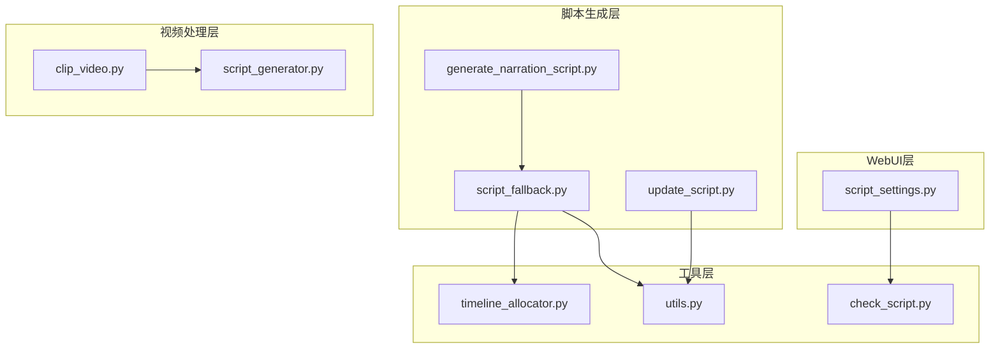
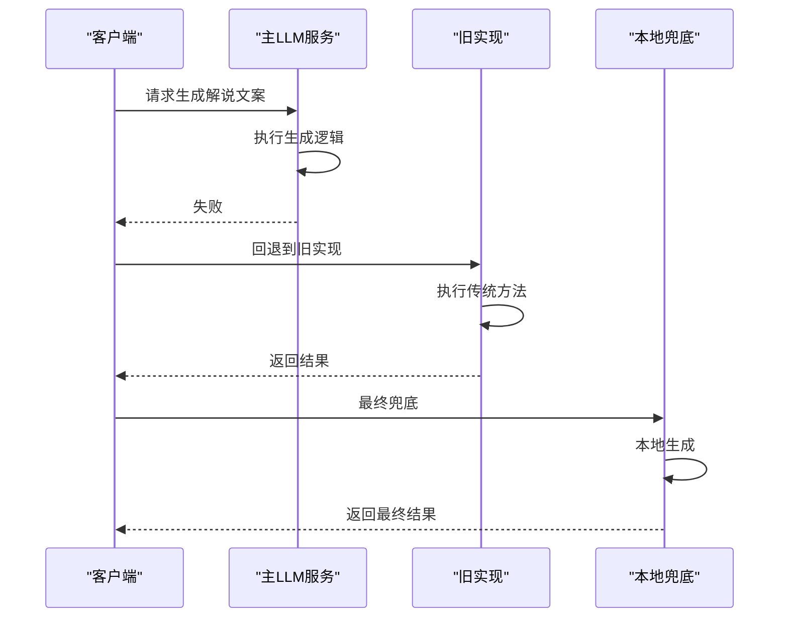
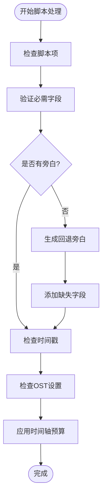
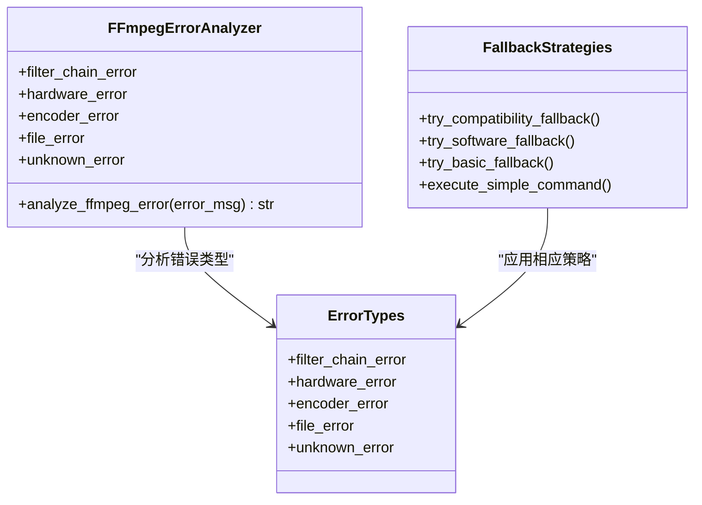
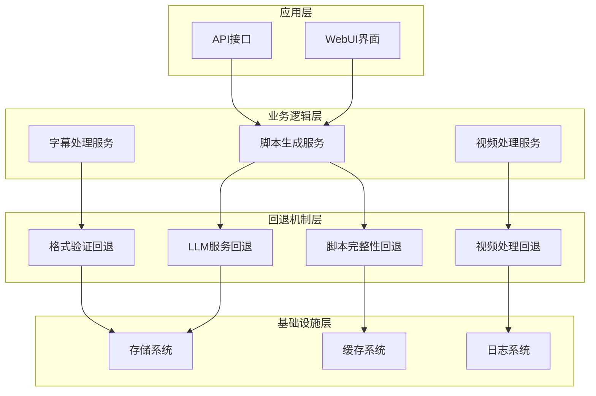
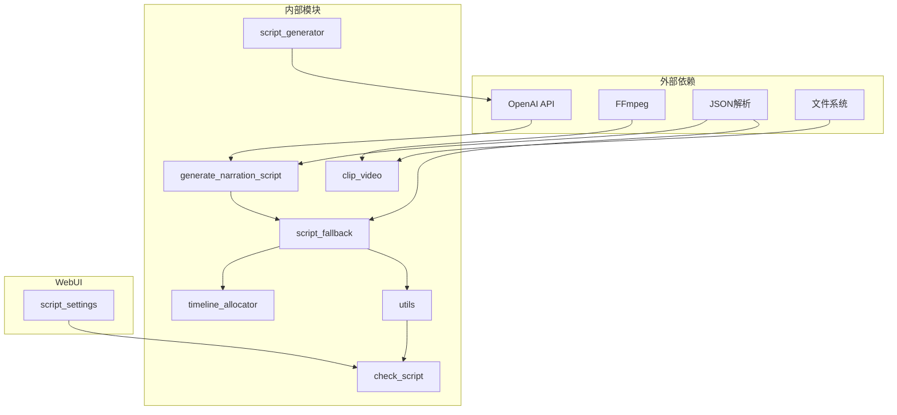

# 脚本回退机制

<cite>
**本文档引用的文件**
- [script_fallback.py](file://app/services/script_fallback.py)
- [update_script.py](file://app/services/update_script.py)
- [generate_narration_script.py](file://app/services/generate_narration_script.py)
- [timeline_allocator.py](file://app/services/timeline_allocator.py)
- [utils.py](file://app/utils/utils.py)
- [check_script.py](file://app/utils/check_script.py)
- [clip_video.py](file://app/services/clip_video.py)
- [script_generator.py](file://app/utils/script_generator.py)
- [generate_script_short.py](file://app/services/SDP/generate_script_short.py)
- [script_settings.py](file://webui/components/script_settings.py)
</cite>

## 目录
1. [简介](#简介)
2. [项目结构](#项目结构)
3. [核心组件](#核心组件)
4. [架构概览](#架构概览)
5. [详细组件分析](#详细组件分析)
6. [依赖关系分析](#依赖关系分析)
7. [性能考虑](#性能考虑)
8. [故障排除指南](#故障排除指南)
9. [结论](#结论)

## 简介

脚本回退机制是NarratoAI项目中的一个重要特性，旨在确保在各种异常情况下仍能生成可用的视频脚本。该机制通过多层次的错误处理和备用方案，保证系统的稳定性和可靠性。

本文档深入分析了脚本回退机制的设计原理、实现方式和最佳实践，涵盖了从LLM服务回退到视频处理回退的完整流程。

## 项目结构

NarratoAI项目采用模块化的架构设计，脚本回退机制分布在多个关键模块中：



**图表来源**
- [generate_narration_script.py:1-252](file://app/services/generate_narration_script.py#L1-L252)
- [script_fallback.py:1-58](file://app/services/script_fallback.py#L1-L58)
- [update_script.py:1-267](file://app/services/update_script.py#L1-L267)

**章节来源**
- [generate_narration_script.py:1-252](file://app/services/generate_narration_script.py#L1-L252)
- [script_fallback.py:1-58](file://app/services/script_fallback.py#L1-L58)
- [update_script.py:1-267](file://app/services/update_script.py#L1-L267)

## 核心组件

### 1. LLM服务回退机制

LLM服务回退机制提供了多层保护，确保在主要服务失败时能够自动切换到备用方案：



**图表来源**
- [generate_narration_script.py:113-154](file://app/services/generate_narration_script.py#L113-L154)

### 2. 脚本完整性保障

脚本完整性保障机制确保生成的脚本具有完整的结构和必要的字段：



**图表来源**
- [script_fallback.py:33-57](file://app/services/script_fallback.py#L33-L57)

### 3. 视频处理回退策略

视频处理回退策略针对不同的FFmpeg错误类型提供专门的解决方案：



**图表来源**
- [clip_video.py:304-342](file://app/services/clip_video.py#L304-L342)
- [clip_video.py:345-461](file://app/services/clip_video.py#L345-L461)

**章节来源**
- [generate_narration_script.py:113-154](file://app/services/generate_narration_script.py#L113-L154)
- [script_fallback.py:33-57](file://app/services/script_fallback.py#L33-L57)
- [clip_video.py:304-461](file://app/services/clip_video.py#L304-L461)

## 架构概览

脚本回退机制的整体架构采用分层设计，每层都有明确的职责和回退策略：



**图表来源**
- [generate_script_short.py:1-126](file://app/services/SDP/generate_script_short.py#L1-L126)
- [script_settings.py:464-478](file://webui/components/script_settings.py#L464-L478)

## 详细组件分析

### LLM服务回退组件

LLM服务回退组件实现了多层次的容错机制：

#### 主要功能
- **新旧服务切换**：自动在新旧LLM服务之间切换
- **异常捕获**：捕获并处理各种异常情况
- **降级处理**：提供本地回退方案

#### 实现细节
```python
def generate_narration(markdown_content, api_key, base_url, model):
    try:
        # 尝试使用新LLM服务
        result = generate_narration_new(markdown_content, api_key, base_url, model)
        return result
    except Exception as e:
        # 回退到旧实现
        logger.warning(f"使用新LLM服务失败，回退到旧实现: {str(e)}")
        return _generate_narration_legacy(markdown_content, api_key, base_url, model)
```

**章节来源**
- [generate_narration_script.py:113-121](file://app/services/generate_narration_script.py#L113-L121)

### 脚本完整性保障组件

脚本完整性保障组件确保生成的脚本符合预期格式和要求：

#### 关键特性
- **字段完整性检查**：验证必需字段的存在
- **格式标准化**：统一脚本格式
- **时间轴预算应用**：根据时长限制旁白长度

#### 核心算法
```python
def ensure_script_shape(script_items):
    result = []
    for idx, item in enumerate(script_items, start=1):
        new_item = dict(item)
        # 设置默认值
        new_item.setdefault("_id", idx)
        new_item.setdefault("picture", "")
        new_item.setdefault("OST", 2)
        # 生成时间戳
        if "timestamp" not in new_item:
            start = float(new_item.get("start", 0))
            end = float(new_item.get("end", start + 1))
            new_item["timestamp"] = f"{utils.format_time(start)}-{utils.format_time(end)}"
        result.append(new_item)
    return apply_timeline_budget(fill_missing_narrations(result))
```

**章节来源**
- [script_fallback.py:45-57](file://app/services/script_fallback.py#L45-L57)

### 视频处理回退组件

视频处理回退组件针对FFmpeg操作提供多种回退策略：

#### 错误分类
- **滤镜链错误**：硬件加速相关问题
- **硬件加速错误**：GPU设备问题
- **编码器错误**：编解码器配置问题
- **文件访问错误**：文件权限问题

#### 回退策略
```python
def analyze_ffmpeg_error(error_msg):
    error_msg_lower = error_msg.lower()
    
    # 滤镜链错误
    if any(keyword in error_msg_lower for keyword in [
        "impossible to convert", "filter", "format", "scale"
    ]):
        return "filter_chain_error"
    
    # 硬件加速错误
    if any(keyword in error_msg_lower for keyword in [
        "cuda", "nvenc", "amf", "qsv"
    ]):
        return "hardware_error"
    
    # 编码器错误
    if any(keyword in error_msg_lower for keyword in [
        "encoder", "codec", "h264"
    ]):
        return "encoder_error"
    
    return "unknown_error"
```

**章节来源**
- [clip_video.py:304-342](file://app/services/clip_video.py#L304-L342)

### 格式验证组件

格式验证组件确保脚本符合严格的格式要求：

#### 验证规则
- **JSON格式验证**：确保脚本为有效的JSON数组
- **必需字段检查**：验证`_id`、`timestamp`、`picture`、`narration`、`OST`等字段
- **数据类型验证**：检查各字段的数据类型和格式
- **业务规则验证**：验证时间戳格式和数值范围

#### 错误处理
```python
def check_format(script_content):
    try:
        data = json.loads(script_content)
        
        # 检查是否为列表
        if not isinstance(data, list):
            return {
                'success': False,
                'message': '脚本必须是JSON数组格式',
                'details': '正确格式应该是: [{"_id": 1, "timestamp": "...", ...}, ...]'
            }
        
        # 检查每个片段
        for i, clip in enumerate(data):
            # 验证必需字段
            required_fields = ['_id', 'timestamp', 'picture', 'narration', 'OST']
            for field in required_fields:
                if field not in clip:
                    return {
                        'success': False,
                        'message': f'第{i+1}个片段缺少必需字段: {field}',
                        'details': f'必需字段: {", ".join(required_fields)}'
                    }
        }
        
        return {
            'success': True,
            'message': '脚本格式检查通过',
            'details': f'共验证 {len(data)} 个脚本片段，格式正确'
        }
    except json.JSONDecodeError as e:
        return {
            'success': False,
            'message': f'JSON格式错误: {str(e)}',
            'details': '请检查JSON语法，确保所有括号、引号、逗号正确'
        }
```

**章节来源**
- [check_script.py:5-111](file://app/utils/check_script.py#L5-L111)

## 依赖关系分析

脚本回退机制的依赖关系呈现层次化结构：



**图表来源**
- [generate_narration_script.py:1-252](file://app/services/generate_narration_script.py#L1-L252)
- [script_fallback.py:1-58](file://app/services/script_fallback.py#L1-L58)
- [clip_video.py:1-1108](file://app/services/clip_video.py#L1-L1108)

**章节来源**
- [generate_narration_script.py:1-252](file://app/services/generate_narration_script.py#L1-L252)
- [script_fallback.py:1-58](file://app/services/script_fallback.py#L1-L58)
- [clip_video.py:1-1108](file://app/services/clip_video.py#L1-L1108)

## 性能考虑

脚本回退机制在设计时充分考虑了性能影响：

### 内存管理
- **渐进式处理**：采用生成器模式减少内存占用
- **批量处理**：对大量数据进行分批处理
- **缓存策略**：合理使用缓存避免重复计算

### 网络优化
- **超时控制**：为外部API调用设置合理的超时时间
- **重试机制**：实现指数退避的重试策略
- **连接池**：复用网络连接减少建立成本

### 错误恢复
- **快速失败**：及时识别并处理错误情况
- **优雅降级**：在部分功能失效时保持系统运行
- **监控告警**：实时监控回退机制的使用情况

## 故障排除指南

### 常见问题及解决方案

#### LLM服务回退问题
**症状**：脚本生成失败但系统未自动回退
**排查步骤**：
1. 检查主LLM服务的可用性
2. 查看回退日志记录
3. 验证旧实现的配置
4. 测试网络连接

#### 脚本格式验证失败
**症状**：保存脚本时报格式错误
**排查步骤**：
1. 使用在线JSON验证工具检查格式
2. 检查必需字段是否完整
3. 验证时间戳格式
4. 确认数据类型正确

#### 视频处理回退失败
**症状**：视频裁剪失败且无回退方案
**排查步骤**：
1. 检查FFmpeg安装和配置
2. 验证输入文件格式
3. 查看错误日志中的具体错误类型
4. 测试基本的FFmpeg命令

### 调试技巧

#### 日志分析
- **启用详细日志**：在开发环境中启用DEBUG级别日志
- **错误追踪**：使用异常追踪信息定位问题根因
- **性能监控**：监控各回退阶段的执行时间

#### 单元测试
```python
def test_script_fallback():
    # 测试回退机制的核心功能
    pass

def test_llm_fallback():
    # 测试LLM服务回退逻辑
    pass

def test_video_fallback():
    # 测试视频处理回退策略
    pass
```

**章节来源**
- [check_script.py:1-111](file://app/utils/check_script.py#L1-L111)
- [clip_video.py:290-489](file://app/services/clip_video.py#L290-L489)

## 结论

脚本回退机制是NarratoAI项目中确保系统稳定性的关键组成部分。通过多层次的回退策略、完善的错误处理和严格的格式验证，该机制能够在各种异常情况下保持系统的正常运行。

### 主要优势
- **多层次保护**：从服务层到数据层的全方位保护
- **自动化处理**：减少人工干预，提高系统自治能力
- **可扩展性**：模块化设计便于添加新的回退策略
- **可观测性**：完善的日志和监控机制

### 未来改进方向
- **智能回退决策**：基于历史数据和上下文信息选择最优回退策略
- **性能优化**：进一步减少回退过程的性能开销
- **用户体验**：提供更清晰的回退状态反馈
- **监控增强**：增加更细粒度的监控指标和告警机制

脚本回退机制的成功实施为NarratoAI项目提供了强大的容错能力和稳定性保障，是构建可靠AI应用的重要基石。