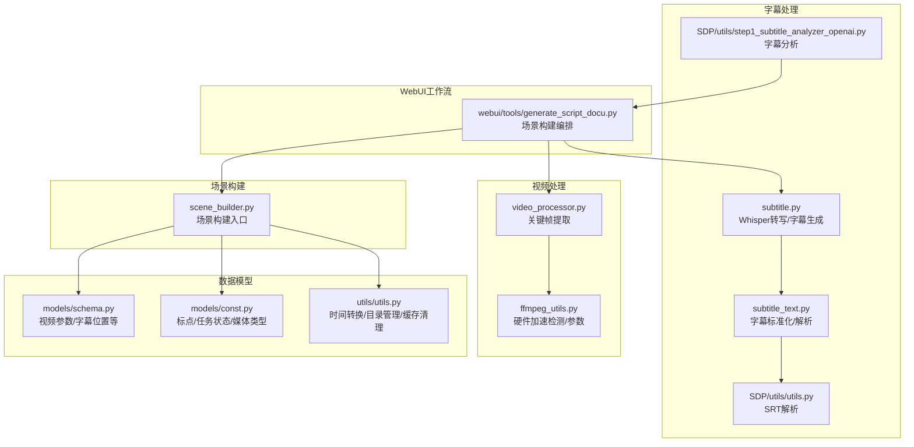
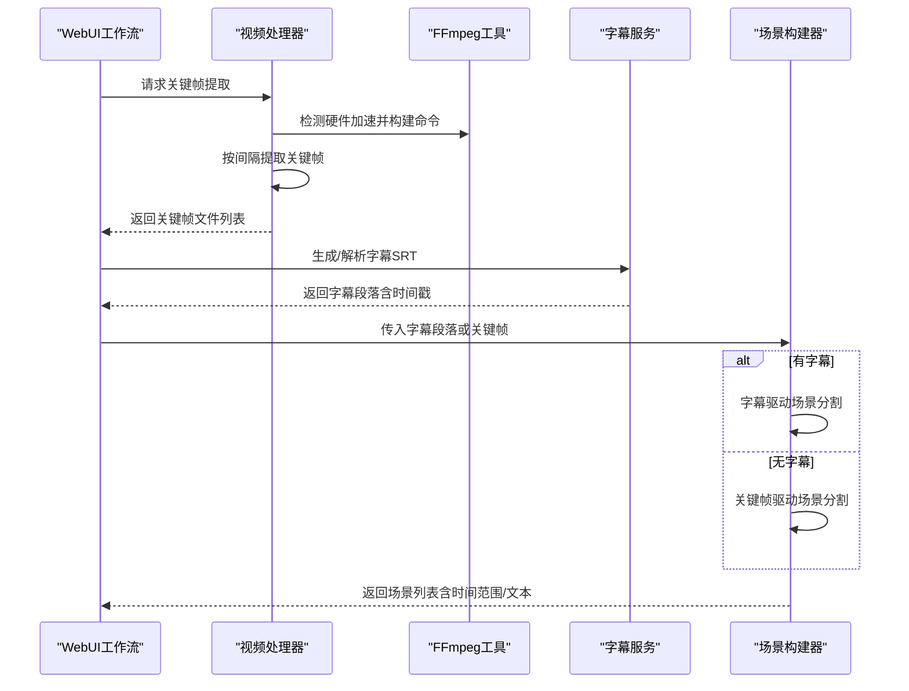
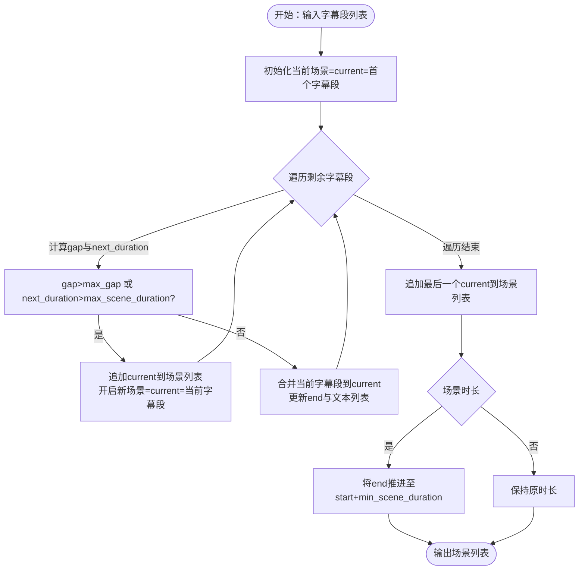
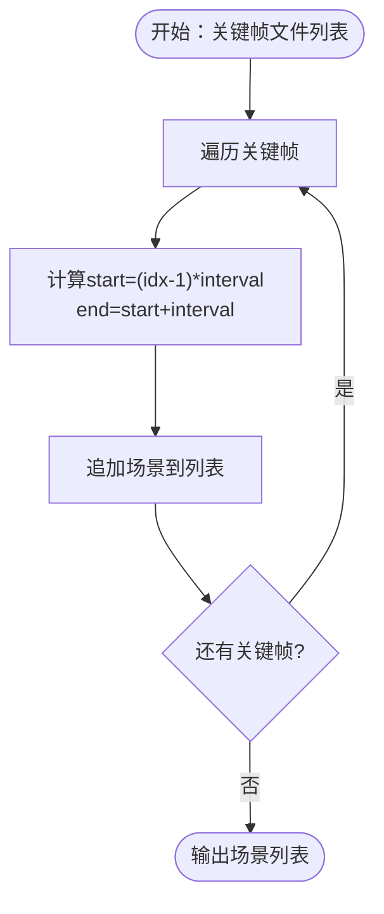
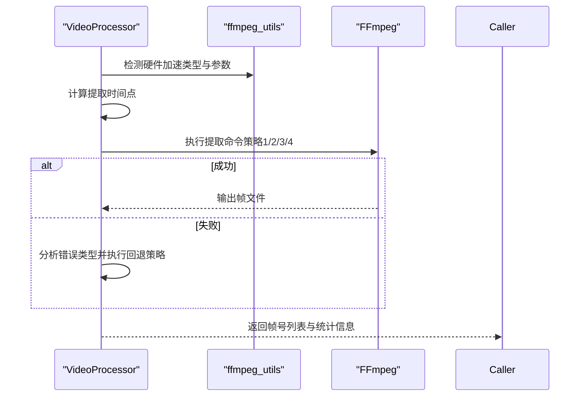
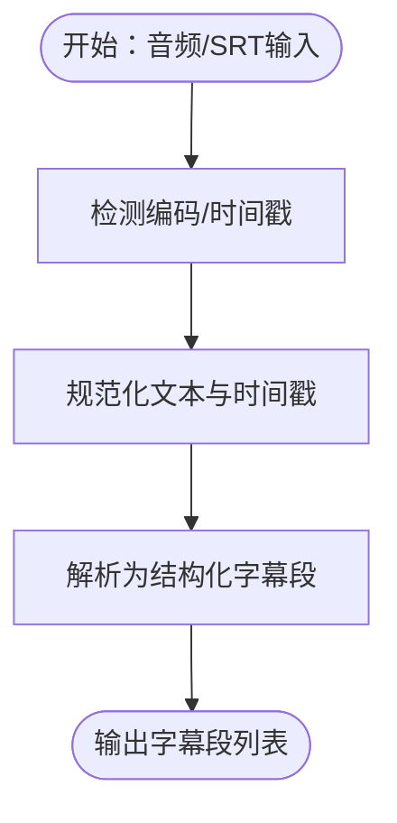
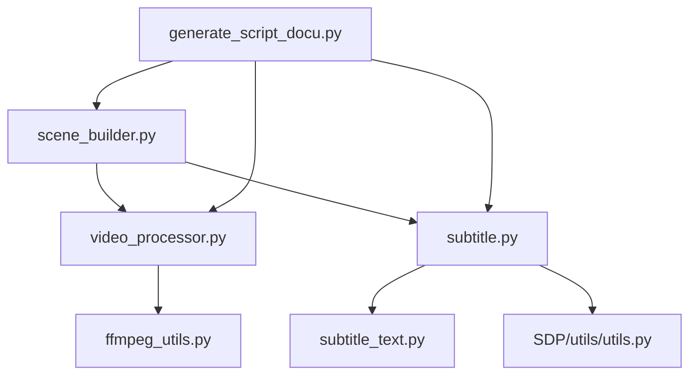

# 场景构建器

<cite>
**本文档引用的文件**
- [app/services/scene_builder.py](file://app/services/scene_builder.py)
- [app/utils/video_processor.py](file://app/utils/video_processor.py)
- [app/utils/ffmpeg_utils.py](file://app/utils/ffmpeg_utils.py)
- [app/services/subtitle.py](file://app/services/subtitle.py)
- [app/services/subtitle_text.py](file://app/services/subtitle_text.py)
- [app/services/SDP/utils/utils.py](file://app/services/SDP/utils/utils.py)
- [app/services/SDP/utils/step1_subtitle_analyzer_openai.py](file://app/services/SDP/utils/step1_subtitle_analyzer_openai.py)
- [app/utils/utils.py](file://app/utils/utils.py)
- [webui/tools/generate_script_docu.py](file://webui/tools/generate_script_docu.py)
- [app/models/schema.py](file://app/models/schema.py)
- [app/models/const.py](file://app/models/const.py)
</cite>

## 目录
1. [简介](#简介)
2. [项目结构](#项目结构)
3. [核心组件](#核心组件)
4. [架构总览](#架构总览)
5. [详细组件分析](#详细组件分析)
6. [依赖关系分析](#依赖关系分析)
7. [性能考量](#性能考量)
8. [故障排查指南](#故障排查指南)
9. [结论](#结论)
10. [附录](#附录)

## 简介
本文件面向“场景构建器”的使用者与维护者，系统化阐述智能分镜技术的实现原理与工程实践，覆盖场景检测算法、镜头切换识别、内容分析等核心技术；详解场景分割的判断标准（静止画面检测、运动检测、音频变化分析等多维特征）；梳理场景构建的数据结构设计（场景对象属性、时间范围定义、内容描述等信息组织方式）；说明与视频处理流水线的集成机制（输入数据格式、处理流程、输出结果等接口规范），并提供实际应用场景与优化建议。

## 项目结构
场景构建器位于应用层的服务模块中，围绕“字幕驱动的场景分割”与“关键帧驱动的回退场景分割”两条主线展开，并与视频处理工具、字幕生成与解析、提示词管理、WebUI工作流等模块协同。

**图表来源**
- [app/services/scene_builder.py:1-71](file://app/services/scene_builder.py#L1-L71)
- [app/utils/video_processor.py:1-670](file://app/utils/video_processor.py#L1-L670)
- [app/utils/ffmpeg_utils.py:1-800](file://app/utils/ffmpeg_utils.py#L1-L800)
- [app/services/subtitle.py:1-467](file://app/services/subtitle.py#L1-L467)
- [app/services/subtitle_text.py:1-125](file://app/services/subtitle_text.py#L1-L125)
- [app/services/SDP/utils/utils.py:1-124](file://app/services/SDP/utils/utils.py#L1-L124)
- [app/services/SDP/utils/step1_subtitle_analyzer_openai.py:1-173](file://app/services/SDP/utils/step1_subtitle_analyzer_openai.py#L1-L173)
- [webui/tools/generate_script_docu.py:38-59](file://webui/tools/generate_script_docu.py#L38-L59)
- [app/models/schema.py:1-209](file://app/models/schema.py#L1-L209)
- [app/models/const.py:1-26](file://app/models/const.py#L1-L26)
- [app/utils/utils.py:1-675](file://app/utils/utils.py#L1-L675)

**章节来源**
- [app/services/scene_builder.py:1-71](file://app/services/scene_builder.py#L1-L71)
- [app/utils/video_processor.py:1-670](file://app/utils/video_processor.py#L1-L670)
- [app/utils/ffmpeg_utils.py:1-800](file://app/utils/ffmpeg_utils.py#L1-L800)
- [app/services/subtitle.py:1-467](file://app/services/subtitle.py#L1-L467)
- [app/services/subtitle_text.py:1-125](file://app/services/subtitle_text.py#L1-L125)
- [app/services/SDP/utils/utils.py:1-124](file://app/services/SDP/utils/utils.py#L1-L124)
- [app/services/SDP/utils/step1_subtitle_analyzer_openai.py:1-173](file://app/services/SDP/utils/step1_subtitle_analyzer_openai.py#L1-L173)
- [webui/tools/generate_script_docu.py:38-59](file://webui/tools/generate_script_docu.py#L38-L59)
- [app/models/schema.py:1-209](file://app/models/schema.py#L1-L209)
- [app/models/const.py:1-26](file://app/models/const.py#L1-L26)
- [app/utils/utils.py:1-675](file://app/utils/utils.py#L1-L675)

## 核心组件
- 场景构建器（字幕驱动）
  - 功能：基于字幕时间轴进行场景拼接与分割，支持最大场景时长、最大间隙、最小场景时长等阈值控制，最终输出包含时间范围、字幕文本聚合等字段的场景列表。
  - 关键参数：max_scene_duration、max_gap、min_scene_duration。
  - 输出：场景对象列表，包含scene_id、start、end、duration、subtitle_ids、subtitle_texts、subtitle_text等。
- 场景构建器（关键帧回退）
  - 功能：在无字幕或字幕不可用时，按固定间隔将关键帧切分为场景，形成“视觉主导”的场景骨架。
  - 关键参数：fallback_interval（秒）。
  - 输出：场景对象列表，包含scene_id、start、end、duration、fallback_frame等。
- 视频关键帧提取
  - 功能：按固定时间间隔从视频中抽取关键帧，支持硬件加速与多平台兼容性策略，输出帧文件列表与帧号。
  - 关键能力：硬件加速检测、多策略提取（软件/硬件/兼容性）、进度可视化与错误统计。
- 字幕生成与解析
  - 功能：提供Whisper转写生成SRT字幕、Gemini转写、SRT解析与标准化、时间戳规范化等。
  - 关键能力：跨平台编码解码、时间戳毫秒分隔符统一、SRT格式兼容性处理。
- WebUI工作流编排
  - 功能：在WebUI中协调关键帧提取、字幕生成/解析、场景构建、代表性帧选择与视觉分析等步骤，形成完整的场景证据融合管线。

**章节来源**
- [app/services/scene_builder.py:7-71](file://app/services/scene_builder.py#L7-L71)
- [app/utils/video_processor.py:26-670](file://app/utils/video_processor.py#L26-L670)
- [app/services/subtitle.py:26-467](file://app/services/subtitle.py#L26-L467)
- [app/services/subtitle_text.py:27-125](file://app/services/subtitle_text.py#L27-L125)
- [webui/tools/generate_script_docu.py:38-59](file://webui/tools/generate_script_docu.py#L38-L59)

## 架构总览
场景构建器贯穿“输入-处理-输出”三阶段，结合字幕与关键帧两条路径，形成鲁棒的场景分割能力。

**图表来源**
- [webui/tools/generate_script_docu.py:38-59](file://webui/tools/generate_script_docu.py#L38-L59)
- [app/utils/video_processor.py:464-494](file://app/utils/video_processor.py#L464-L494)
- [app/utils/ffmpeg_utils.py:252-356](file://app/utils/ffmpeg_utils.py#L252-L356)
- [app/services/subtitle.py:108-197](file://app/services/subtitle.py#L108-L197)
- [app/services/scene_builder.py:7-71](file://app/services/scene_builder.py#L7-L71)

## 详细组件分析

### 场景构建器（字幕驱动）
- 算法思路
  - 以字幕段为基本单元，遍历字幕段，计算相邻段之间的“间隙gap”与“当前候选场景的累计时长next_duration”，当任一条件超过阈值时即进行场景分割。
  - 分割后更新当前场景的结束时间与字幕文本集合；遍历结束后对最终场景进行最小时长补足与duration计算。
- 关键判断标准
  - 间隙阈值max_gap：相邻字幕段起始时间差过大，表示可能的镜头切换或内容切换。
  - 场景累计时长阈值max_scene_duration：避免单场景过长导致节奏拖沓。
  - 最小场景时长min_scene_duration：保证场景具备基本表达力。
- 数据结构
  - 场景对象包含：scene_id、start、end、duration、subtitle_ids（字幕段ID列表）、subtitle_texts（字幕文本列表）、subtitle_text（聚合文本）。
- 复杂度
  - 时间复杂度O(N)，N为字幕段数量；空间复杂度O(N)用于存储场景列表与中间状态。

**图表来源**
- [app/services/scene_builder.py:7-52](file://app/services/scene_builder.py#L7-L52)

**章节来源**
- [app/services/scene_builder.py:7-52](file://app/services/scene_builder.py#L7-L52)

### 场景构建器（关键帧回退）
- 算法思路
  - 以固定间隔将关键帧切分为连续场景，形成“视觉主导”的场景骨架，便于后续视觉分析与证据融合。
- 关键参数
  - fallback_interval：场景时长（秒），决定关键帧切分粒度。
- 数据结构
  - 场景对象包含：scene_id、start、end、duration、fallback_frame（关键帧路径）等。

**图表来源**
- [app/services/scene_builder.py:55-70](file://app/services/scene_builder.py#L55-L70)

**章节来源**
- [app/services/scene_builder.py:55-70](file://app/services/scene_builder.py#L55-L70)

### 视频关键帧提取与硬件加速
- 能力概述
  - 支持按固定时间间隔提取关键帧，内置多策略提取（软件/硬件/兼容性），并提供进度条与成功率统计。
  - 通过集中式硬件加速检测模块，自动选择最优编码器与参数，规避滤镜链错误与兼容性问题。
- 关键流程
  - 视频信息探测（ffprobe）→ 硬件加速检测 → 多策略提取（优先纯NVENC编码器，避免CUDA硬件解码滤镜链问题）→ 输出帧文件与帧号列表。
- 错误处理
  - 提供滤镜链错误、硬件错误、编码器错误等分类与智能回退策略，确保在不同平台与GPU环境下稳定运行。

**图表来源**
- [app/utils/video_processor.py:464-494](file://app/utils/video_processor.py#L464-L494)
- [app/utils/ffmpeg_utils.py:252-356](file://app/utils/ffmpeg_utils.py#L252-L356)

**章节来源**
- [app/utils/video_processor.py:26-670](file://app/utils/video_processor.py#L26-L670)
- [app/utils/ffmpeg_utils.py:1-800](file://app/utils/ffmpeg_utils.py#L1-L800)

### 字幕生成与解析
- 字幕生成
  - Whisper转写：支持CPU/CUDA自动切换，VAD过滤、beam搜索、word级时间戳输出，生成SRT。
  - Gemini转写：通过API生成SRT文本。
- 字幕解析与标准化
  - SRT解析：支持多种编码（UTF-8/UTF-16/GBK/GB2312），自动检测BOM与NUL字节，统一换行与时间戳毫秒分隔符。
  - 字幕文本规范化：统一换行、去除BOM与NUL、规范化时间戳格式，确保跨平台可靠性。

**图表来源**
- [app/services/subtitle.py:108-197](file://app/services/subtitle.py#L108-L197)
- [app/services/subtitle_text.py:40-125](file://app/services/subtitle_text.py#L40-L125)
- [app/services/SDP/utils/utils.py:9-124](file://app/services/SDP/utils/utils.py#L9-L124)

**章节来源**
- [app/services/subtitle.py:1-467](file://app/services/subtitle.py#L1-L467)
- [app/services/subtitle_text.py:1-125](file://app/services/subtitle_text.py#L1-L125)
- [app/services/SDP/utils/utils.py:1-124](file://app/services/SDP/utils/utils.py#L1-L124)

### WebUI工作流编排
- 工作流要点
  - 关键帧提取 → 字幕生成/解析 → 场景构建（字幕优先，无字幕回退关键帧）→ 代表性帧选择与视觉分析 → 场景证据融合 → 结果保存。
- 关键接口
  - 输入：视频源路径、字幕路径（可选）、关键帧间隔、帧选择数量等。
  - 输出：场景证据JSON（包含场景、帧、视觉观察等）。

**章节来源**
- [webui/tools/generate_script_docu.py:38-59](file://webui/tools/generate_script_docu.py#L38-L59)
- [webui/tools/generate_script_docu.py:140-178](file://webui/tools/generate_script_docu.py#L140-L178)

## 依赖关系分析
- 模块耦合
  - 场景构建器与视频处理工具、字幕服务之间为弱耦合，通过清晰的输入输出接口（字幕段列表、关键帧文件列表）交互。
  - WebUI工作流对场景构建器、关键帧提取、字幕生成形成编排依赖，内部通过状态与回调推进流程。
- 外部依赖
  - FFmpeg/ffprobe：视频信息探测与关键帧提取。
  - Whisper/Gemini：字幕生成。
  - OpenCV/PIL：关键帧图像处理（在兼容性方案中使用）。
- 潜在风险
  - 硬件加速兼容性差异可能导致提取失败，需依赖多策略回退。
  - 字幕编码与时间戳格式不规范会影响场景分割精度，需依赖标准化模块。

**图表来源**
- [app/services/scene_builder.py:1-71](file://app/services/scene_builder.py#L1-L71)
- [app/utils/video_processor.py:1-670](file://app/utils/video_processor.py#L1-L670)
- [app/utils/ffmpeg_utils.py:1-800](file://app/utils/ffmpeg_utils.py#L1-L800)
- [app/services/subtitle.py:1-467](file://app/services/subtitle.py#L1-L467)
- [app/services/subtitle_text.py:1-125](file://app/services/subtitle_text.py#L1-L125)
- [app/services/SDP/utils/utils.py:1-124](file://app/services/SDP/utils/utils.py#L1-L124)
- [webui/tools/generate_script_docu.py:38-59](file://webui/tools/generate_script_docu.py#L38-L59)

**章节来源**
- [app/services/scene_builder.py:1-71](file://app/services/scene_builder.py#L1-L71)
- [app/utils/video_processor.py:1-670](file://app/utils/video_processor.py#L1-L670)
- [app/utils/ffmpeg_utils.py:1-800](file://app/utils/ffmpeg_utils.py#L1-L800)
- [app/services/subtitle.py:1-467](file://app/services/subtitle.py#L1-L467)
- [app/services/subtitle_text.py:1-125](file://app/services/subtitle_text.py#L1-L125)
- [app/services/SDP/utils/utils.py:1-124](file://app/services/SDP/utils/utils.py#L1-L124)
- [webui/tools/generate_script_docu.py:38-59](file://webui/tools/generate_script_docu.py#L38-L59)

## 性能考量
- 关键帧提取
  - 优先采用纯NVENC编码器策略，避免CUDA硬件解码导致的滤镜链错误，同时兼顾兼容性与性能。
  - 通过进度条与统计信息反馈提取成功率，便于用户评估硬件环境与参数设置。
- 字幕生成
  - Whisper支持CUDA加速，自动回退CPU；VAD与beam搜索提升转写稳定性与精度。
- 场景构建
  - 字幕驱动场景分割为O(N)线性扫描，开销极低；关键帧回退场景分割同样为O(N)。
- I/O与缓存
  - 提供关键帧缓存清理接口，避免重复提取造成磁盘与I/O压力。

[本节为通用性能讨论，不直接分析具体文件]

## 故障排查指南
- 关键帧提取失败
  - 现象：未生成任何关键帧文件或成功率极低。
  - 排查：检查FFmpeg安装与权限、关闭硬件加速、启用超级兼容性方案、确认视频可读性。
  - 参考：关键帧提取与多策略回退逻辑。
- 硬件加速错误
  - 现象：滤镜链错误、CUDA解码失败。
  - 排查：切换到纯NVENC编码器策略、禁用硬件解码参数、检查GPU驱动与编码器可用性。
- 字幕解析异常
  - 现象：时间戳缺失、编码错误、SRT格式不规范。
  - 排查：使用字幕标准化模块统一编码与时间戳格式，确保输入符合SRT标准。
- 场景时长过短/过长
  - 现象：场景不符合预期长度。
  - 排查：调整max_scene_duration、max_gap、min_scene_duration参数，或检查字幕段粒度。

**章节来源**
- [app/utils/video_processor.py:464-494](file://app/utils/video_processor.py#L464-L494)
- [app/utils/ffmpeg_utils.py:252-356](file://app/utils/ffmpeg_utils.py#L252-L356)
- [app/services/subtitle_text.py:40-125](file://app/services/subtitle_text.py#L40-L125)
- [app/services/scene_builder.py:7-52](file://app/services/scene_builder.py#L7-L52)

## 结论
场景构建器通过“字幕驱动场景分割 + 关键帧回退场景分割”的双轨策略，在保证鲁棒性的同时兼顾效率与可解释性。配合完善的视频处理工具链与字幕解析模块，能够稳定地将原始视频转化为结构化的场景骨架，为进一步的视觉分析与内容融合奠定基础。建议在生产环境中结合硬件加速检测与多策略回退，合理设置场景分割阈值，并在WebUI工作流中进行端到端的监控与优化。

[本节为总结性内容，不直接分析具体文件]

## 附录

### 场景对象属性与时间范围定义
- 属性清单
  - scene_id：场景唯一标识。
  - start/end：场景起止时间（秒）。
  - duration：场景时长（秒）。
  - subtitle_ids：字幕段ID列表（字幕驱动时存在）。
  - subtitle_texts：字幕文本列表（字幕驱动时存在）。
  - subtitle_text：聚合后的字幕文本（字幕驱动时存在）。
  - fallback_frame：关键帧路径（关键帧回退时存在）。
- 时间范围定义
  - start/end来源于字幕段时间戳或关键帧间隔计算，duration由end-start得到。

**章节来源**
- [app/services/scene_builder.py:7-71](file://app/services/scene_builder.py#L7-L71)

### 输入数据格式与处理流程接口规范
- 字幕输入
  - 支持SRT文件与SRT文本内容，自动检测编码与时间戳格式，输出结构化字幕段列表。
- 关键帧输入
  - 关键帧文件列表（路径数组），按固定间隔切分为场景。
- 处理流程
  - 关键帧提取 → 字幕生成/解析 → 场景构建（字幕优先，无字幕回退）→ 代表性帧选择与视觉分析 → 场景证据融合 → 结果保存。

**章节来源**
- [app/services/subtitle.py:108-197](file://app/services/subtitle.py#L108-L197)
- [app/services/subtitle_text.py:40-125](file://app/services/subtitle_text.py#L40-L125)
- [app/services/SDP/utils/utils.py:9-124](file://app/services/SDP/utils/utils.py#L9-L124)
- [webui/tools/generate_script_docu.py:38-59](file://webui/tools/generate_script_docu.py#L38-L59)

### 实际应用场景与优化建议
- 应用场景
  - 短剧/短视频分镜：基于字幕驱动的场景分割，确保镜头切换与内容节奏匹配。
  - 纪录片/长视频：关键帧回退作为主干场景骨架，结合视觉分析与字幕证据进行深度融合。
- 优化建议
  - 合理设置max_scene_duration与max_gap，避免过短或过长的场景影响观看体验。
  - 在字幕质量不佳时启用关键帧回退，并结合代表性帧的视觉分析提升场景描述质量。
  - 在WebUI中启用缓存清理与进度监控，提升大规模视频处理的稳定性与可观测性。

[本节为概念性内容，不直接分析具体文件]