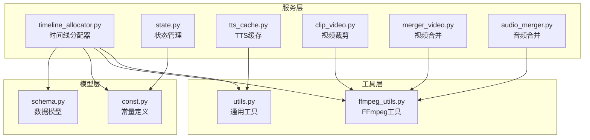
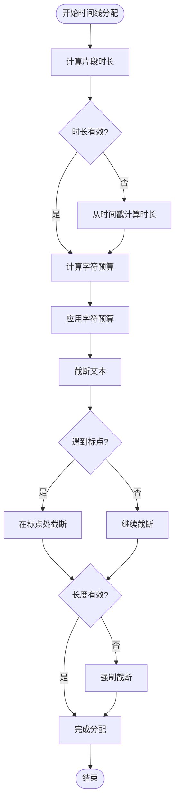
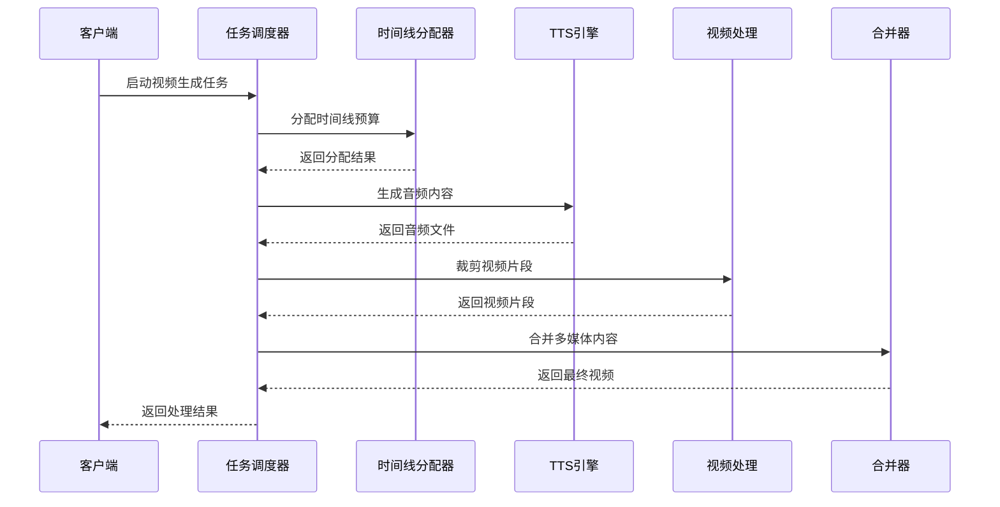
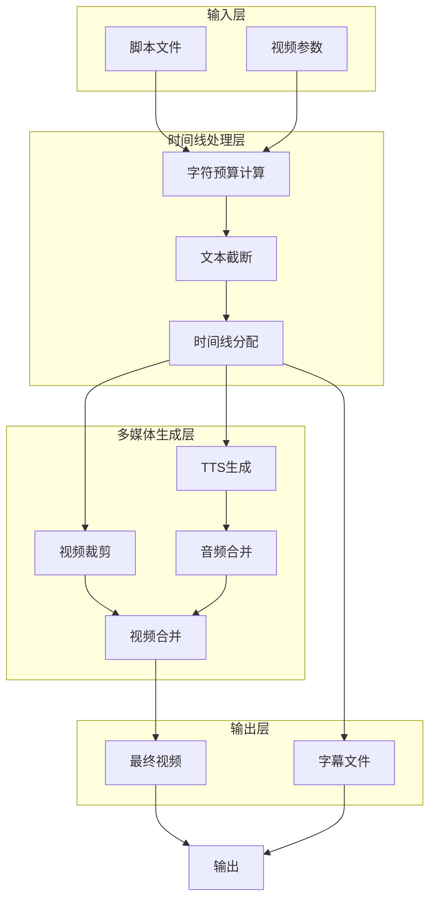
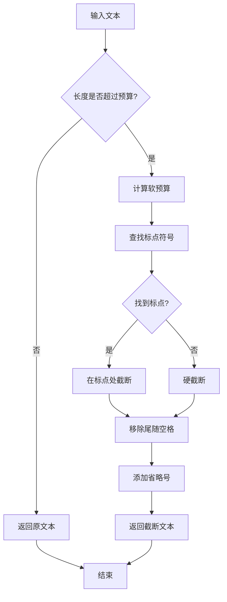
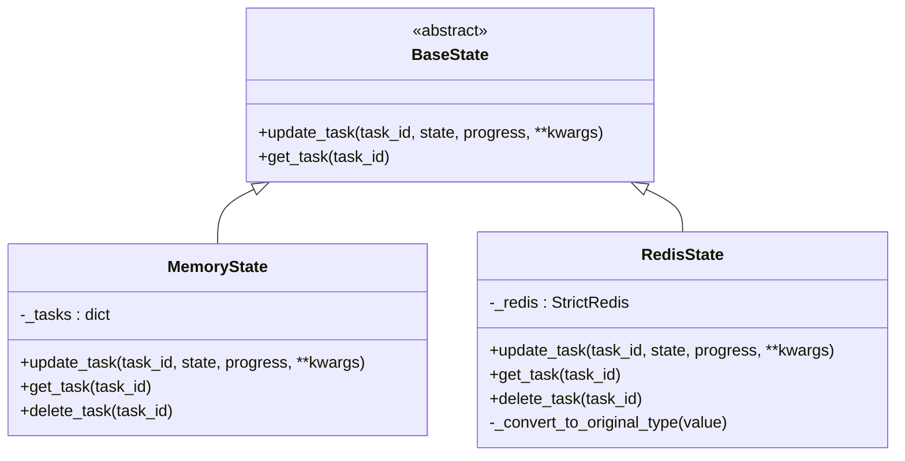
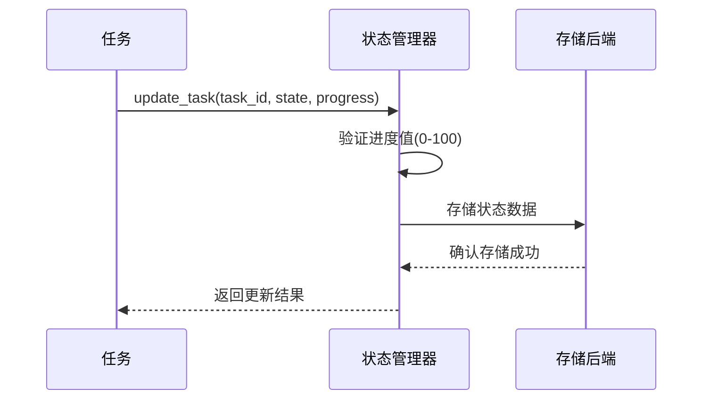
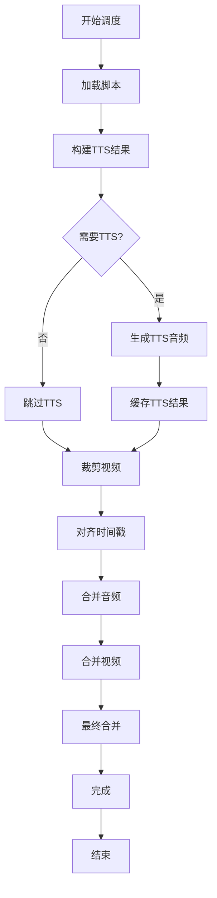
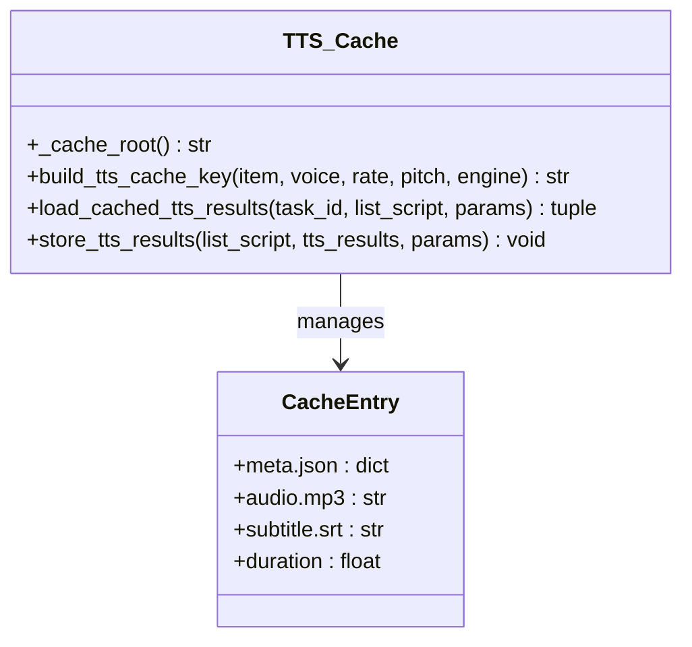
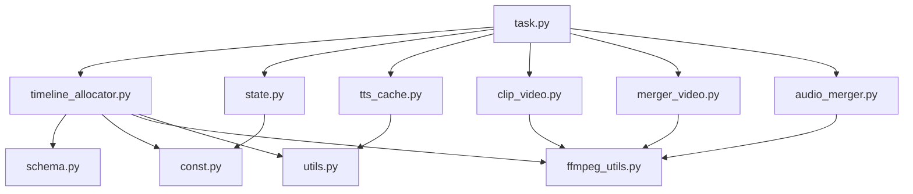

# 时间线分配器

<cite>
**本文档引用的文件**
- [timeline_allocator.py](file://app/services/timeline_allocator.py)
- [task.py](file://app/services/task.py)
- [state.py](file://app/services/state.py)
- [schema.py](file://app/models/schema.py)
- [const.py](file://app/models/const.py)
- [utils.py](file://app/utils/utils.py)
- [tts_cache.py](file://app/services/tts_cache.py)
- [clip_video.py](file://app/services/clip_video.py)
- [merger_video.py](file://app/services/merger_video.py)
- [audio_merger.py](file://app/services/audio_merger.py)
- [ffmpeg_utils.py](file://app/utils/ffmpeg_utils.py)
- [config.example.toml](file://config.example.toml)
</cite>

## 目录
1. [简介](#简介)
2. [项目结构](#项目结构)
3. [核心组件](#核心组件)
4. [架构概览](#架构概览)
5. [详细组件分析](#详细组件分析)
6. [依赖关系分析](#依赖关系分析)
7. [性能考虑](#性能考虑)
8. [故障排除指南](#故障排除指南)
9. [结论](#结论)

## 简介

时间线分配器是NarratoAI视频生成系统中的核心调度组件，负责将脚本内容分配到精确的时间轴上，确保音频、视频、字幕的同步和协调。该系统采用先进的并发处理策略，结合智能资源分配算法和优先级管理机制，实现了高效的多媒体内容生成。

系统的主要功能包括：
- 时间片精确分配和重叠检测
- 字幕文本预算管理和截断算法
- 多媒体资源的智能调度和分配
- 任务状态监控和进度跟踪
- 负载均衡和异常处理机制

## 项目结构

时间线分配器位于应用的服务层，与视频处理管道紧密集成：



**图表来源**
- [timeline_allocator.py:1-36](file://app/services/timeline_allocator.py#L1-L36)
- [task.py:1-272](file://app/services/task.py#L1-L272)
- [state.py:1-123](file://app/services/state.py#L1-L123)

**章节来源**
- [timeline_allocator.py:1-36](file://app/services/timeline_allocator.py#L1-L36)
- [task.py:195-247](file://app/services/task.py#L195-L247)
- [state.py:116-122](file://app/services/state.py#L116-L122)

## 核心组件

### 时间线分配器核心算法

时间线分配器采用智能的字符预算分配策略，确保字幕内容与视频时长精确匹配：



**图表来源**
- [timeline_allocator.py:4-35](file://app/services/timeline_allocator.py#L4-L35)

### 任务调度机制

系统采用分阶段的任务调度策略，每个阶段都有明确的状态管理和进度跟踪：



**图表来源**
- [task.py:195-247](file://app/services/task.py#L195-L247)
- [timeline_allocator.py:24-35](file://app/services/timeline_allocator.py#L24-L35)

**章节来源**
- [timeline_allocator.py:1-36](file://app/services/timeline_allocator.py#L1-L36)
- [task.py:195-247](file://app/services/task.py#L195-L247)

## 架构概览

时间线分配器在整个视频生成流水线中扮演着关键角色，连接着脚本解析、多媒体生成和最终合成的各个环节：



**图表来源**
- [task.py:31-247](file://app/services/task.py#L31-L247)
- [timeline_allocator.py:24-35](file://app/services/timeline_allocator.py#L24-L35)

## 详细组件分析

### 时间线预算分配算法

时间线分配器的核心是字符预算分配算法，该算法确保字幕内容与视频时长的精确匹配：

#### 核心算法实现

算法采用动态预算分配策略，考虑以下因素：
- 视频片段的实际时长
- 字符密度估算（默认4.0字符/秒）
- 预留比例（默认0.85）
- 标点符号的智能截断

#### 预算计算公式

```
字符预算 = max(8, duration × 字符密度 × 预留比例)
```

其中：
- 最小预算：8个字符
- 字符密度：4.0 字符/秒（可配置）
- 预留比例：0.85（考虑标点符号和停顿）

#### 文本截断策略

算法采用智能截断策略，优先在标点符号处截断：



**图表来源**
- [timeline_allocator.py:8-21](file://app/services/timeline_allocator.py#L8-L21)

**章节来源**
- [timeline_allocator.py:4-35](file://app/services/timeline_allocator.py#L4-L35)

### 任务状态管理系统

系统采用灵活的状态管理模式，支持内存和Redis两种存储方式：

#### 状态管理架构



**图表来源**
- [state.py:8-122](file://app/services/state.py#L8-L122)

#### 状态更新流程



**图表来源**
- [state.py:23-87](file://app/services/state.py#L23-L87)

**章节来源**
- [state.py:1-123](file://app/services/state.py#L1-L123)

### 多媒体资源调度

系统采用分阶段的资源调度策略，确保各个处理环节的协调运行：

#### 调度策略



**图表来源**
- [task.py:195-247](file://app/services/task.py#L195-L247)

**章节来源**
- [task.py:53-247](file://app/services/task.py#L53-L247)

### TTS缓存机制

系统实现了智能的TTS缓存机制，避免重复生成相同的音频内容：

#### 缓存架构



**图表来源**
- [tts_cache.py:18-125](file://app/services/tts_cache.py#L18-L125)

**章节来源**
- [tts_cache.py:1-125](file://app/services/tts_cache.py#L1-L125)

## 依赖关系分析

时间线分配器与其他组件的依赖关系如下：



**图表来源**
- [task.py:10-24](file://app/services/task.py#L10-L24)
- [timeline_allocator.py:1](file://app/services/timeline_allocator.py#L1)

**章节来源**
- [task.py:1-25](file://app/services/task.py#L1-L25)
- [timeline_allocator.py:1](file://app/services/timeline_allocator.py#L1)

## 性能考虑

### 并发处理策略

系统采用多线程并发处理策略，通过以下机制优化性能：

1. **线程池管理**：使用配置化的线程数（默认16），根据系统资源动态调整
2. **异步I/O操作**：视频处理和音频合并采用异步方式，避免阻塞
3. **缓存机制**：TTS结果和中间文件的智能缓存，减少重复计算
4. **硬件加速**：自动检测和利用GPU硬件加速，提升编码性能

### 资源分配算法

系统采用智能的资源分配算法，确保资源的最优利用：

- **动态预算分配**：根据视频时长动态计算字符预算
- **优先级调度**：重要任务优先处理，次要任务延后执行
- **负载均衡**：监控系统资源使用情况，自动调整处理策略
- **异常恢复**：任务失败时自动重试和资源回收

### 性能优化建议

1. **并发度调优**：根据CPU核心数和内存容量调整线程数
2. **缓存策略**：合理设置缓存大小和过期时间
3. **硬件加速**：启用GPU硬件加速以提升处理速度
4. **内存管理**：及时清理临时文件和中间结果

## 故障排除指南

### 常见问题及解决方案

#### 时间线分配错误

**问题描述**：字幕文本截断不符合预期
**解决方案**：
1. 检查字符预算计算是否正确
2. 验证标点符号识别逻辑
3. 调整字符密度和预留比例参数

#### TTS生成失败

**问题描述**：TTS引擎无法生成音频
**解决方案**：
1. 检查TTS引擎配置和API密钥
2. 验证网络连接和代理设置
3. 查看TTS缓存目录权限

#### 视频处理异常

**问题描述**：FFmpeg命令执行失败
**解决方案**：
1. 检查FFmpeg安装和版本
2. 验证硬件加速配置
3. 查看错误日志获取详细信息

#### 状态管理问题

**问题描述**：任务状态无法正确更新
**解决方案**：
1. 检查Redis连接配置
2. 验证内存状态存储
3. 查看状态转换逻辑

**章节来源**
- [state.py:48-107](file://app/services/state.py#L48-L107)
- [tts_cache.py:45-94](file://app/services/tts_cache.py#L45-L94)

## 结论

时间线分配器作为NarratoAI系统的核心组件，通过智能化的算法设计和完善的架构实现，为视频生成提供了高效、可靠的时间线管理解决方案。系统的主要优势包括：

1. **精确的时间线分配**：通过字符预算算法确保字幕内容与视频时长的完美匹配
2. **智能的资源调度**：采用多阶段调度策略，优化资源利用效率
3. **灵活的状态管理**：支持多种存储后端，适应不同的部署需求
4. **强大的容错能力**：完善的异常处理和恢复机制
5. **优秀的性能表现**：通过硬件加速和缓存机制提升处理速度

未来的发展方向包括进一步优化算法性能、增强系统的可扩展性和提供更多的配置选项，以满足不同用户的需求。