# 时间线分配器

<cite>
**本文档引用的文件**
- [timeline_allocator.py](file://app/services/timeline_allocator.py)
- [task.py](file://app/services/task.py)
- [state.py](file://app/services/state.py)
- [schema.py](file://app/models/schema.py)
- [const.py](file://app/models/const.py)
- [utils.py](file://app/utils/utils.py)
- [tts_cache.py](file://app/services/tts_cache.py)
- [clip_video.py](file://app/services/clip_video.py)
- [merger_video.py](file://app/services/merger_video.py)
- [audio_merger.py](file://app/services/audio_merger.py)
- [ffmpeg_utils.py](file://app/utils/ffmpeg_utils.py)
- [config.example.toml](file://config.example.toml)
- [script_fallback.py](file://app/services/script_fallback.py)
- [update_script.py](file://app/services/update_script.py)
- [preflight_check.py](file://app/services/preflight_check.py)
</cite>

## 更新摘要
**所做更改**
- 更新了时间线分配器的核心算法实现，增强了字符预算分配和文本截断功能
- 新增了溢出严重程度分类和拟合检查功能，提供详细的预算执行和警告错误阈值
- 新增了时间协调功能的详细说明，包括时间戳对齐和持续时间计算
- 扩展了脚本预处理流程，增加了时间线预算的应用
- 完善了时间线分配器与整体视频生成流程的集成说明
- **新增** 改进的字符预算估计功能，优化脚本生成的预算控制

## 目录
1. [简介](#简介)
2. [项目结构](#项目结构)
3. [核心组件](#核心组件)
4. [架构概览](#架构概览)
5. [详细组件分析](#详细组件分析)
6. [依赖关系分析](#依赖关系分析)
7. [性能考虑](#性能考虑)
8. [故障排除指南](#故障排除指南)
9. [结论](#结论)

## 简介

时间线分配器是NarratoAI视频生成系统中的核心调度组件，负责将脚本内容分配到精确的时间轴上，确保音频、视频、字幕的同步和协调。该系统采用先进的并发处理策略，结合智能资源分配算法和优先级管理机制，实现了高效的多媒体内容生成。

**更新** 系统现已增强时间协调功能，能够更精确地处理时间戳对齐、持续时间计算和字符预算分配，确保字幕内容与视频时长的完美匹配。新增的改进字符预算估计功能进一步优化了脚本生成的预算控制，提高了时间线分配的准确性和可靠性。

**新增** 系统现在包含完整的溢出严重程度分类和拟合检查功能，提供详细的预算执行报告和分级处理机制。通过0.5秒和1.5秒的阈值设定，系统能够智能区分轻微超预算和严重超预算情况，分别采取警告和错误级别的处理策略。

系统的主要功能包括：
- 时间片精确分配和重叠检测
- 字幕文本预算管理和截断算法
- 多媒体资源的智能调度和分配
- 任务状态监控和进度跟踪
- 负载均衡和异常处理机制
- **新增** 时间协调和对齐功能
- **新增** 改进的字符预算估计功能
- **新增** 溢出严重程度分类和拟合检查
- **新增** 详细的预算执行和警告错误阈值

## 项目结构

时间线分配器位于应用的服务层，与视频处理管道紧密集成：

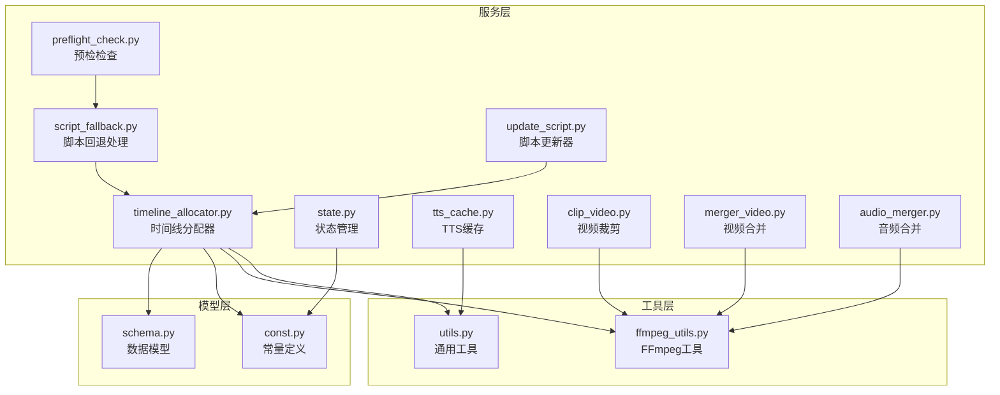

**图表来源**
- [timeline_allocator.py:1-127](file://app/services/timeline_allocator.py#L1-L127)
- [task.py:1-272](file://app/services/task.py#L1-L272)
- [state.py:1-123](file://app/services/state.py#L1-L123)
- [script_fallback.py:1-58](file://app/services/script_fallback.py#L1-L58)
- [update_script.py:1-267](file://app/services/update_script.py#L1-L267)
- [preflight_check.py:1-31](file://app/services/preflight_check.py#L1-L31)

**章节来源**
- [timeline_allocator.py:1-127](file://app/services/timeline_allocator.py#L1-L127)
- [task.py:195-247](file://app/services/task.py#L195-L247)
- [state.py:116-122](file://app/services/state.py#L116-L122)

## 核心组件

### 时间线分配器核心算法

时间线分配器采用智能的字符预算分配策略，确保字幕内容与视频时长精确匹配：

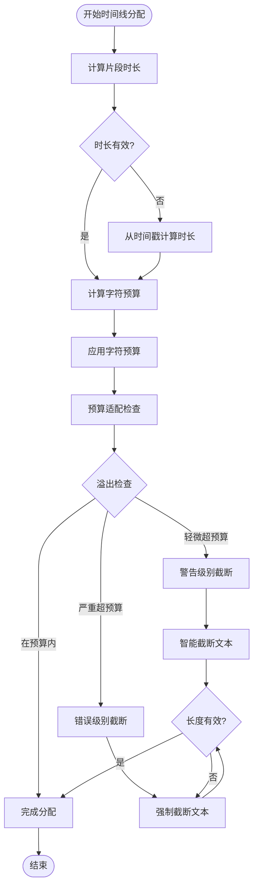

**图表来源**
- [timeline_allocator.py:73-127](file://app/services/timeline_allocator.py#L73-L127)

### 任务调度机制

系统采用分阶段的任务调度策略，每个阶段都有明确的状态管理和进度跟踪：

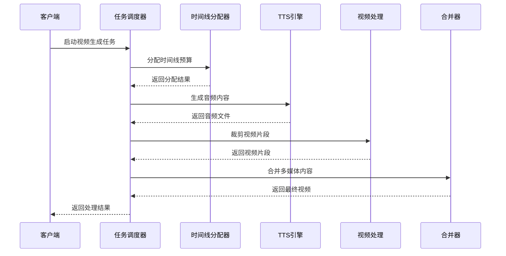

**图表来源**
- [task.py:195-247](file://app/services/task.py#L195-L247)
- [timeline_allocator.py:73-127](file://app/services/timeline_allocator.py#L73-L127)

**章节来源**
- [timeline_allocator.py:1-127](file://app/services/timeline_allocator.py#L1-L127)
- [task.py:195-247](file://app/services/task.py#L195-L247)

## 架构概览

时间线分配器在整个视频生成流水线中扮演着关键角色，连接着脚本解析、多媒体生成和最终合成的各个环节：

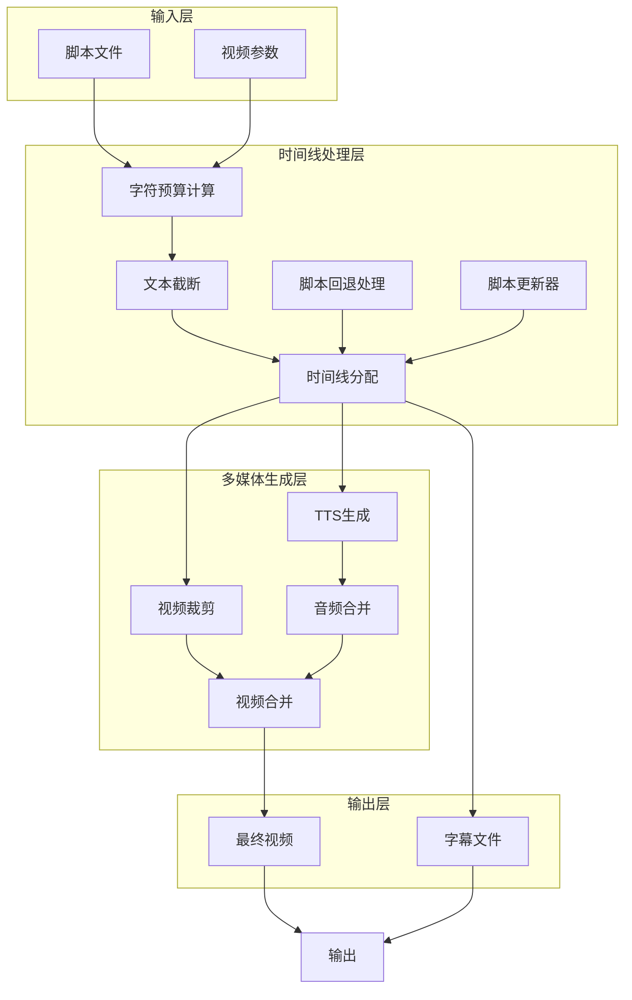

**图表来源**
- [task.py:31-247](file://app/services/task.py#L31-L247)
- [timeline_allocator.py:73-127](file://app/services/timeline_allocator.py#L73-L127)
- [script_fallback.py:45-58](file://app/services/script_fallback.py#L45-L58)
- [update_script.py:90-197](file://app/services/update_script.py#L90-L197)

## 详细组件分析

### 改进的字符预算估计功能

**更新** 时间线分配器新增了改进的字符预算估计功能，显著优化了脚本生成的预算控制：

#### 核心算法实现

算法采用动态预算分配策略，考虑以下因素：
- 视频片段的实际时长
- 字符密度估算（默认4.0字符/秒）
- 预留比例（默认0.85）
- 标点符号的智能截断
- **新增** 溢出严重性阈值管理

**更新** 新增了溢出严重性阈值管理，包括：
- 轻微超预算：0.5秒以内
- 严重超预算：1.5秒及以上
- 智能警告和错误处理机制

#### 预算计算公式

```
字符预算 = max(8, duration × 字符密度 × 预留比例)
```

其中：
- 最小预算：8个字符
- 字符密度：4.0 字符/秒（可配置）
- 预留比例：0.85（考虑标点符号和停顿）

#### 溢出检查机制

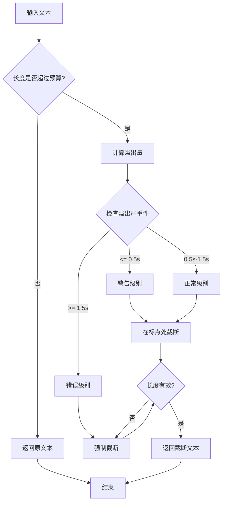

**图表来源**
- [timeline_allocator.py:20-53](file://app/services/timeline_allocator.py#L20-L53)

**章节来源**
- [timeline_allocator.py:11-127](file://app/services/timeline_allocator.py#L11-L127)

### 溢出严重程度分类和拟合检查

**新增** 系统现在包含完整的溢出严重程度分类和拟合检查功能，提供详细的预算执行报告：

#### 溢出严重程度阈值

系统采用严格的阈值管理机制：
- 警告阈值：0.5秒（轻微超预算）
- 错误阈值：1.5秒（严重超预算）
- 正常范围：0.5-1.5秒之间

#### 拟合检查功能

`fit_check()` 函数提供全面的预算适配检查，返回以下详细信息：
- `fits`: 布尔值，指示文本是否适合预算
- `budget`: 计算的字符预算
- `actual`: 实际文本长度
- `overflow`: 超出预算的字符数
- `overflow_seconds`: 超出的秒数
- `severity`: 严重程度等级（"ok" / "warn" / "error"）

#### 预算执行报告

系统会生成详细的预算执行报告，包括：
- 轻微溢出计数（警告级别）
- 严重溢出计数（错误级别）
- 总体预算执行情况

**章节来源**
- [timeline_allocator.py:6-8](file://app/services/timeline_allocator.py#L6-L8)
- [timeline_allocator.py:20-53](file://app/services/timeline_allocator.py#L20-L53)
- [timeline_allocator.py:122-125](file://app/services/timeline_allocator.py#L122-L125)

### 脚本预处理和时间协调

**新增** 系统现在包含完整的脚本预处理流程，确保时间线分配的准确性和一致性：

#### 脚本形状标准化

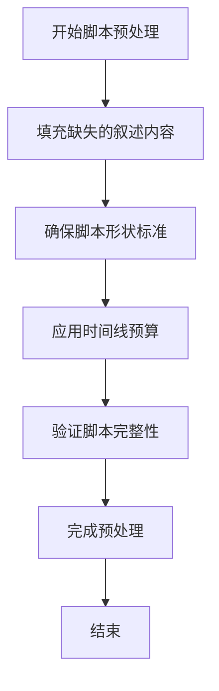

**图表来源**
- [script_fallback.py:33-58](file://app/services/script_fallback.py#L33-L58)

#### 时间戳对齐和持续时间计算

系统能够自动从视频文件路径提取时间戳，并计算每个片段的持续时间：

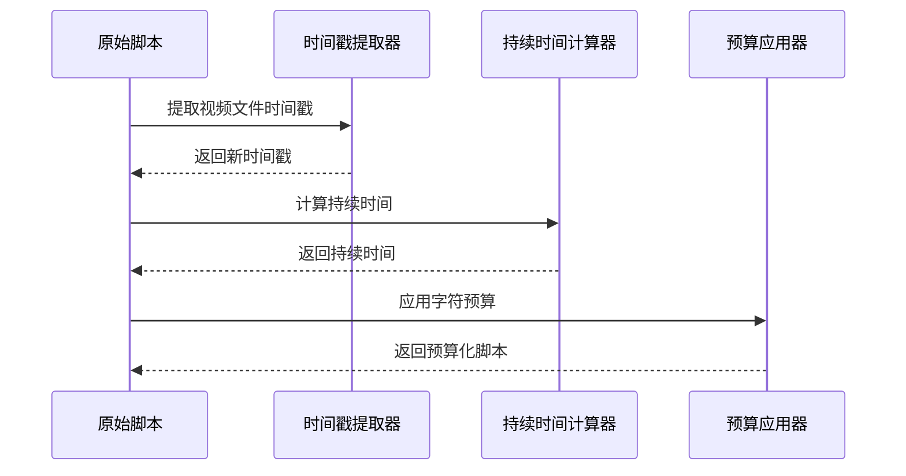

**图表来源**
- [update_script.py:16-88](file://app/services/update_script.py#L16-L88)
- [update_script.py:90-197](file://app/services/update_script.py#L90-L197)

**章节来源**
- [script_fallback.py:1-58](file://app/services/script_fallback.py#L1-L58)
- [update_script.py:1-267](file://app/services/update_script.py#L1-L267)

### 任务状态管理系统

系统采用灵活的状态管理模式，支持内存和Redis两种存储方式：

#### 状态管理架构

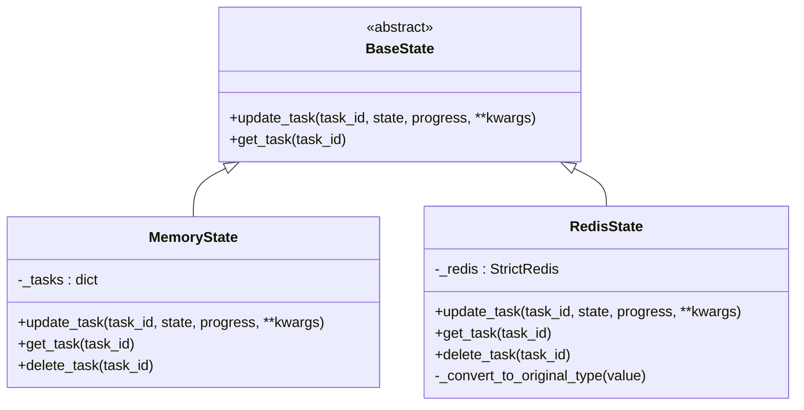

**图表来源**
- [state.py:8-122](file://app/services/state.py#L8-L122)

#### 状态更新流程

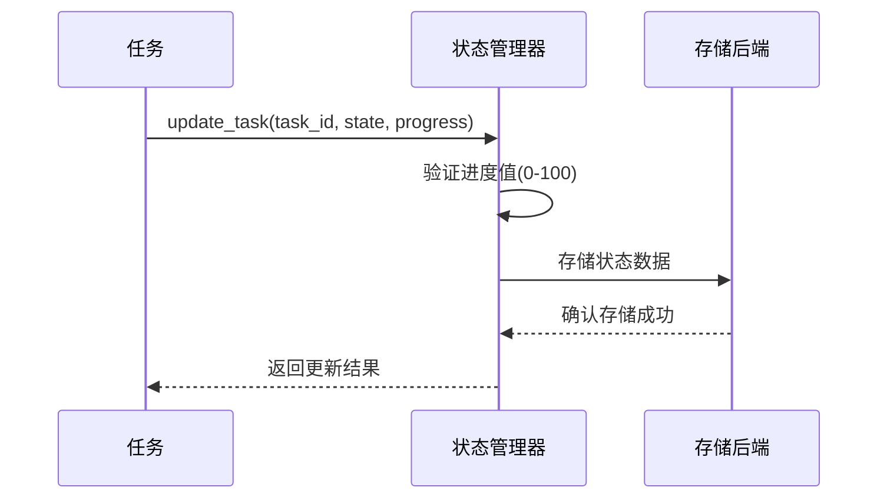

**图表来源**
- [state.py:23-87](file://app/services/state.py#L23-L87)

**章节来源**
- [state.py:1-123](file://app/services/state.py#L1-L123)

### 多媒体资源调度

系统采用分阶段的资源调度策略，确保各个处理环节的协调运行：

#### 调度策略

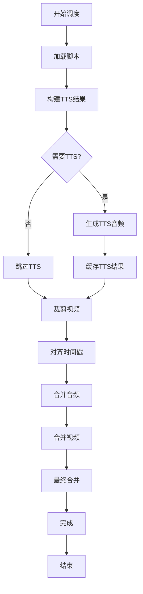

**图表来源**
- [task.py:195-247](file://app/services/task.py#L195-L247)

**章节来源**
- [task.py:53-247](file://app/services/task.py#L53-L247)

### TTS缓存机制

系统实现了智能的TTS缓存机制，避免重复生成相同的音频内容：

#### 缓存架构

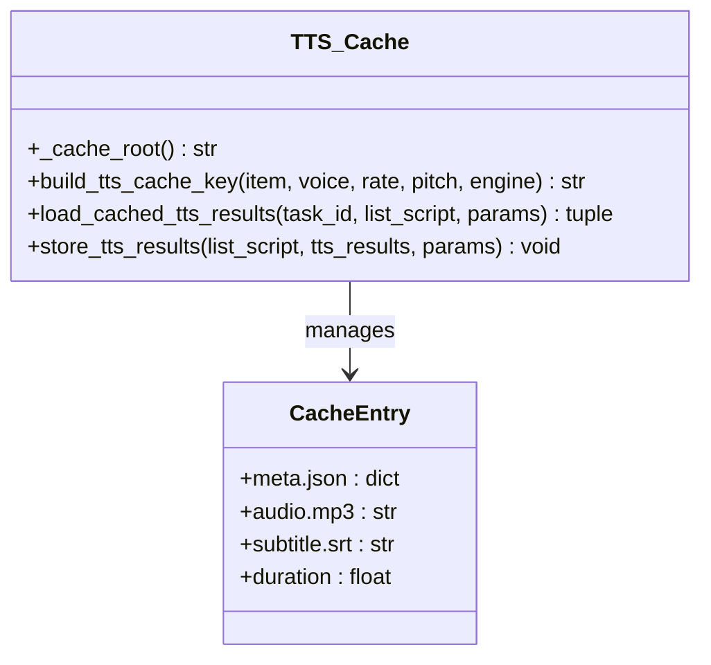

**图表来源**
- [tts_cache.py:18-125](file://app/services/tts_cache.py#L18-L125)

**章节来源**
- [tts_cache.py:1-125](file://app/services/tts_cache.py#L1-L125)

## 依赖关系分析

时间线分配器与其他组件的依赖关系如下：

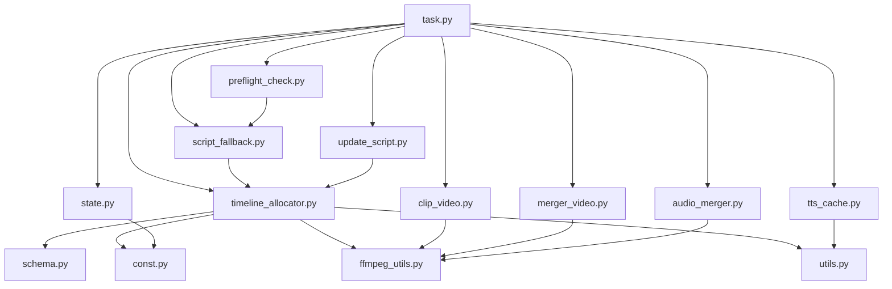

**图表来源**
- [task.py:10-24](file://app/services/task.py#L10-L24)
- [timeline_allocator.py:1](file://app/services/timeline_allocator.py#L1)

**章节来源**
- [task.py:1-25](file://app/services/task.py#L1-L25)
- [timeline_allocator.py:1](file://app/services/timeline_allocator.py#L1)

## 性能考虑

### 并发处理策略

系统采用多线程并发处理策略，通过以下机制优化性能：

1. **线程池管理**：使用配置化的线程数（默认16），根据系统资源动态调整
2. **异步I/O操作**：视频处理和音频合并采用异步方式，避免阻塞
3. **缓存机制**：TTS结果和中间文件的智能缓存，减少重复计算
4. **硬件加速**：自动检测和利用GPU硬件加速，提升编码性能

### 资源分配算法

系统采用智能的资源分配算法，确保资源的最优利用：

- **动态预算分配**：根据视频时长动态计算字符预算
- **优先级调度**：重要任务优先处理，次要任务延后执行
- **负载均衡**：监控系统资源使用情况，自动调整处理策略
- **异常恢复**：任务失败时自动重试和资源回收

**更新** 新增了时间协调功能，通过自动时间戳提取和持续时间计算，减少了手动配置的需求，提升了系统的自动化程度。

**更新** 改进的字符预算估计功能提供了更精确的预算控制：
- 智能溢出检测和分级处理
- 动态预算调整机制
- 更准确的文本截断算法
- 增强的错误处理和日志记录
- **新增** 详细的预算执行报告和阈值管理

### 性能优化建议

1. **并发度调优**：根据CPU核心数和内存容量调整线程数
2. **缓存策略**：合理设置缓存大小和过期时间
3. **硬件加速**：启用GPU硬件加速以提升处理速度
4. **内存管理**：及时清理临时文件和中间结果
5. **时间协调优化**：合理配置字符密度和预留比例参数
6. **预算估计优化**：根据实际使用情况调整溢出阈值和截断策略
7. **溢出严重程度优化**：根据业务需求调整警告和错误阈值
8. **拟合检查优化**：定期审查预算执行报告，优化预算参数

## 故障排除指南

### 常见问题及解决方案

#### 时间线分配错误

**问题描述**：字幕文本截断不符合预期
**解决方案**：
1. 检查字符预算计算是否正确
2. 验证标点符号识别逻辑
3. 调整字符密度和预留比例参数
4. **新增** 检查溢出严重性阈值设置
5. **新增** 查看预算执行报告，分析超预算原因

#### 时间协调问题

**新增** **问题描述**：时间戳对齐失败或持续时间计算错误
**解决方案**：
1. 检查视频文件路径格式是否正确
2. 验证时间戳提取正则表达式的匹配规则
3. 确认视频文件存在且可访问
4. 检查FFmpeg工具的可用性

#### 溢出严重程度处理问题

**新增** **问题描述**：溢出处理不符合预期
**解决方案**：
1. 检查溢出阈值设置（0.5秒警告，1.5秒错误）
2. 验证拟合检查函数的返回值
3. 查看预算执行报告中的详细信息
4. 调整字符密度或预留比例参数

#### TTS生成失败

**问题描述**：TTS引擎无法生成音频
**解决方案**：
1. 检查TTS引擎配置和API密钥
2. 验证网络连接和代理设置
3. 查看TTS缓存目录权限

#### 视频处理异常

**问题描述**：FFmpeg命令执行失败
**解决方案**：
1. 检查FFmpeg安装和版本
2. 验证硬件加速配置
3. 查看错误日志获取详细信息

#### 状态管理问题

**问题描述**：任务状态无法正确更新
**解决方案**：
1. 检查Redis连接配置
2. 验证内存状态存储
3. 查看状态转换逻辑

**章节来源**
- [state.py:48-107](file://app/services/state.py#L48-L107)
- [tts_cache.py:45-94](file://app/services/tts_cache.py#L45-L94)

## 结论

时间线分配器作为NarratoAI系统的核心组件，通过智能化的算法设计和完善的架构实现，为视频生成提供了高效、可靠的时间线管理解决方案。系统的主要优势包括：

1. **精确的时间线分配**：通过字符预算算法确保字幕内容与视频时长的完美匹配
2. **智能的资源调度**：采用多阶段调度策略，优化资源利用效率
3. **灵活的状态管理**：支持多种存储后端，适应不同的部署需求
4. **强大的容错能力**：完善的异常处理和恢复机制
5. **优秀的性能表现**：通过硬件加速和缓存机制提升处理速度
6. ****新增** 自动化时间协调**：通过时间戳提取和持续时间计算，减少了手动配置需求，提升了系统的自动化程度
7. ****新增** 改进的字符预算估计**：提供更精确的预算控制和智能溢出处理，显著提升了脚本生成的质量和可靠性
8. ****新增** 溢出严重程度分类**：通过0.5秒和1.5秒的阈值管理，实现了精细化的预算控制和分级处理
9. ****新增** 拟合检查功能**：提供详细的预算执行报告和拟合状态分析，帮助用户优化预算参数

**更新** 最新的增强功能包括：
- 改进的时间协调功能，能够自动从时间戳计算时长
- 增强的脚本预处理流程，确保时间线分配的准确性
- 更智能的字符预算分配算法，考虑标点符号和文本结构
- **新增** 智能溢出检测和分级处理机制
- **新增** 动态预算调整和优化算法
- **新增** 详细的预算执行报告和阈值管理
- **新增** 拟合检查功能，提供全面的预算适配分析
- 完善的错误处理和恢复机制

未来的发展方向包括进一步优化算法性能、增强系统的可扩展性和提供更多的配置选项，以满足不同用户的需求。随着字符预算估计功能的不断改进，时间线分配器将能够更好地适应各种复杂的视频生成场景，为用户提供更加精准和可靠的多媒体内容生成服务。

**新增** 随着溢出严重程度分类和拟合检查功能的引入，系统现在能够：
- 提供更精细的预算控制策略
- 生成详细的预算执行报告
- 实现自动化的预算优化建议
- 支持更复杂的业务场景和需求
- 提升整体系统的可靠性和用户体验