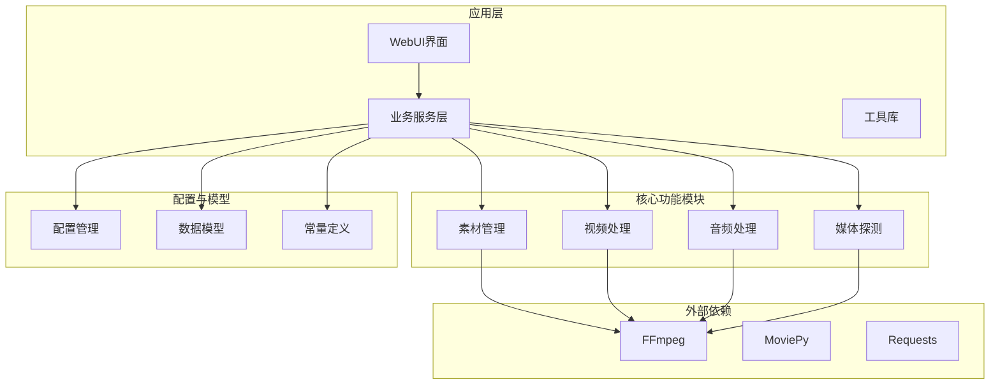
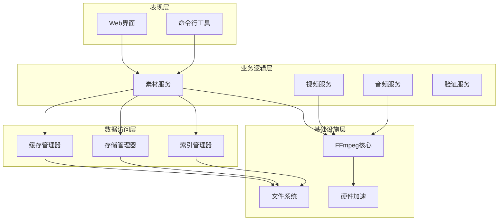
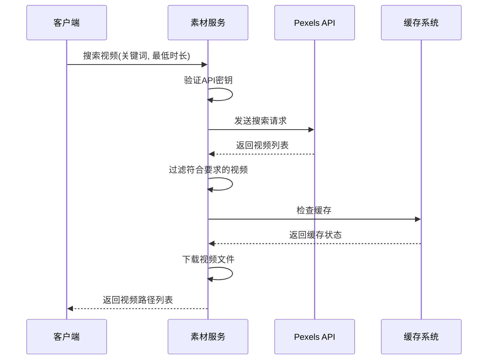
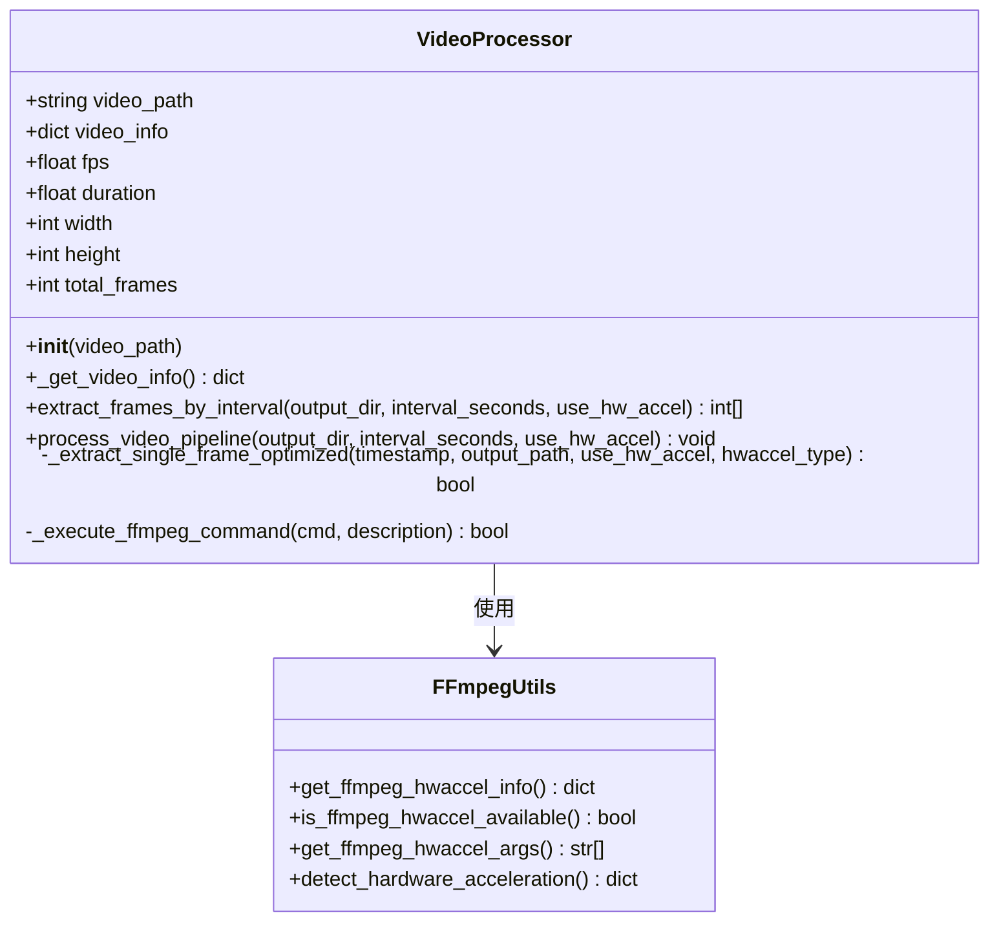
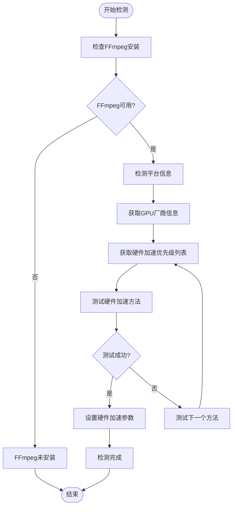
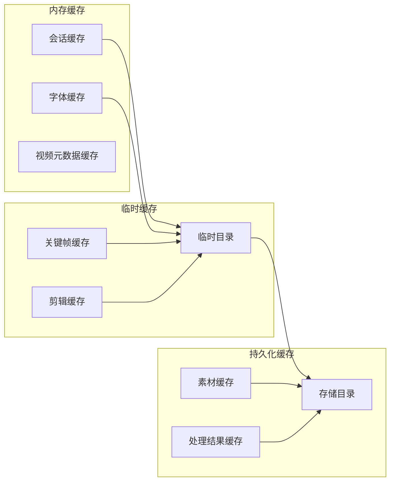
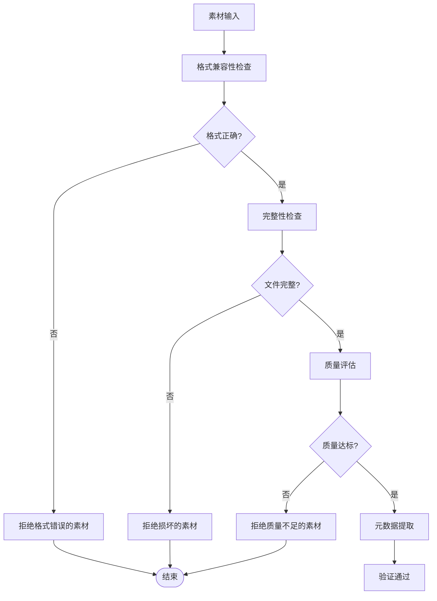
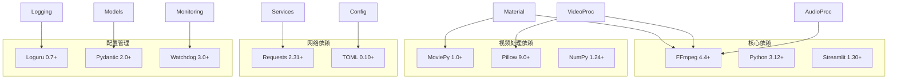
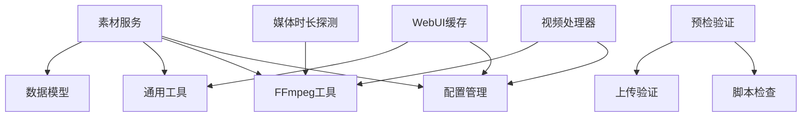

# 素材管理系统

<cite>
**本文档引用的文件**
- [app/services/material.py](file://app/services/material.py)
- [app/utils/video_processor.py](file://app/utils/video_processor.py)
- [app/utils/ffmpeg_utils.py](file://app/utils/ffmpeg_utils.py)
- [app/models/schema.py](file://app/models/schema.py)
- [app/services/media_duration.py](file://app/services/media_duration.py)
- [app/utils/utils.py](file://app/utils/utils.py)
- [app/config/config.py](file://app/config/config.py)
- [app/services/preflight_check.py](file://app/services/preflight_check.py)
- [app/services/upload_validation.py](file://app/services/upload_validation.py)
- [webui/utils/cache.py](file://webui/utils/cache.py)
- [app/utils/check_script.py](file://app/utils/check_script.py)
- [app/models/const.py](file://app/models/const.py)
- [README.md](file://README.md)
</cite>

## 目录
1. [简介](#简介)
2. [项目结构](#项目结构)
3. [核心组件](#核心组件)
4. [架构概览](#架构概览)
5. [详细组件分析](#详细组件分析)
6. [依赖关系分析](#依赖关系分析)
7. [性能考虑](#性能考虑)
8. [故障排除指南](#故障排除指南)
9. [结论](#结论)
10. [附录](#附录)

## 简介
NarratoAI是一个基于人工智能的影视解说和自动化剪辑工具，专注于提供一站式的视频内容创作解决方案。该系统集成了大语言模型、语音合成、视频处理和素材管理等功能，能够实现从文案撰写到最终视频输出的完整自动化流程。

本系统的核心优势在于其强大的素材管理系统，包括：
- 智能视频文件解析和格式检测
- 多维度元数据提取和时长计算
- 高效的素材缓存策略
- 完善的素材验证流程
- 快速检索的索引系统
- 专业的质量控制机制

## 项目结构
项目采用模块化设计，主要分为以下几个核心模块：

**图表来源**
- [app/services/material.py:1-580](file://app/services/material.py#L1-L580)
- [app/utils/video_processor.py:1-670](file://app/utils/video_processor.py#L1-L670)
- [app/utils/ffmpeg_utils.py:1-800](file://app/utils/ffmpeg_utils.py#L1-L800)

**章节来源**
- [README.md:1-180](file://README.md#L1-L180)

## 核心组件
系统的核心组件围绕素材管理展开，主要包括以下功能模块：

### 素材搜索与下载
系统支持从多个外部API（Pexels、Pixabay）搜索和下载视频素材，具备智能筛选和缓存机制。

### 视频解析与处理
提供完整的视频文件解析能力，包括格式检测、元数据提取、时长计算和帧提取功能。

### 硬件加速优化
智能检测和利用系统硬件加速能力，包括NVIDIA CUDA、AMD AMF、Intel QSV等多种加速方案。

### 缓存管理
实现多层次的缓存策略，包括临时文件管理、内存缓存和磁盘空间优化。

**章节来源**
- [app/services/material.py:39-146](file://app/services/material.py#L39-L146)
- [app/utils/video_processor.py:26-88](file://app/utils/video_processor.py#L26-L88)
- [app/utils/ffmpeg_utils.py:252-355](file://app/utils/ffmpeg_utils.py#L252-L355)

## 架构概览
系统采用分层架构设计，确保各组件间的松耦合和高内聚：

**图表来源**
- [app/services/material.py:149-254](file://app/services/material.py#L149-L254)
- [app/utils/video_processor.py:464-493](file://app/utils/video_processor.py#L464-L493)
- [app/utils/ffmpeg_utils.py:778-800](file://app/utils/ffmpeg_utils.py#L778-L800)

## 详细组件分析

### 素材搜索与下载组件

#### Pexels视频搜索
系统实现了完整的Pexels API集成，支持按关键词、最低时长和视频比例进行精准搜索。

**图表来源**
- [app/services/material.py:39-90](file://app/services/material.py#L39-L90)

#### Pixabay视频搜索
提供类似的功能，但针对不同的API接口和数据结构。

**章节来源**
- [app/services/material.py:93-146](file://app/services/material.py#L93-L146)

### 视频解析与处理组件

#### 视频信息提取
VideoProcessor类提供了完整的视频信息提取功能，包括分辨率、帧率、时长等关键信息。

**图表来源**
- [app/utils/video_processor.py:26-88](file://app/utils/video_processor.py#L26-L88)
- [app/utils/ffmpeg_utils.py:778-800](file://app/utils/ffmpeg_utils.py#L778-L800)

#### 帧提取算法
系统实现了多种帧提取策略，包括硬件加速、软件解码和超级兼容性方案。

**章节来源**
- [app/utils/video_processor.py:89-186](file://app/utils/video_processor.py#L89-L186)
- [app/utils/video_processor.py:188-407](file://app/utils/video_processor.py#L188-L407)

### 硬件加速检测组件

#### 多平台兼容性
系统针对不同操作系统和GPU厂商实现了智能检测和降级策略：

**图表来源**
- [app/utils/ffmpeg_utils.py:252-355](file://app/utils/ffmpeg_utils.py#L252-L355)

**章节来源**
- [app/utils/ffmpeg_utils.py:118-136](file://app/utils/ffmpeg_utils.py#L118-L136)
- [app/utils/ffmpeg_utils.py:138-180](file://app/utils/ffmpeg_utils.py#L138-L180)

### 缓存管理组件

#### 多层次缓存策略
系统实现了从内存到磁盘的多层次缓存机制：

**图表来源**
- [app/utils/utils.py:557-570](file://app/utils/utils.py#L557-L570)
- [webui/utils/cache.py:6-34](file://webui/utils/cache.py#L6-L34)

**章节来源**
- [app/utils/utils.py:573-600](file://app/utils/utils.py#L573-L600)
- [webui/utils/cache.py:18-24](file://webui/utils/cache.py#L18-L24)

### 素材验证组件

#### 质量控制机制
系统实现了多层次的素材验证流程：

**图表来源**
- [app/services/upload_validation.py:21-60](file://app/services/upload_validation.py#L21-L60)
- [app/services/preflight_check.py:11-30](file://app/services/preflight_check.py#L11-L30)

**章节来源**
- [app/services/upload_validation.py:16-107](file://app/services/upload_validation.py#L16-L107)
- [app/services/preflight_check.py:4-30](file://app/services/preflight_check.py#L4-L30)

## 依赖关系分析

### 外部依赖
系统主要依赖以下外部组件：

**图表来源**
- [requirements.txt](file://requirements.txt)

### 内部模块依赖
系统内部模块间存在清晰的依赖关系：

**图表来源**
- [app/services/material.py:14-17](file://app/services/material.py#L14-L17)
- [app/utils/video_processor.py:22-23](file://app/utils/video_processor.py#L22-L23)

**章节来源**
- [app/config/config.py:60-95](file://app/config/config.py#L60-L95)

## 性能考虑

### 硬件加速优化
系统实现了智能的硬件加速策略，根据不同平台和GPU类型选择最优的加速方案：

- **NVIDIA GPU**: 优先使用NVENC编码器，避免CUDA硬件解码导致的滤镜链问题
- **AMD GPU**: 使用AMF编码器，提供最佳的性能和兼容性
- **Intel GPU**: 支持QSV和VAAPI加速，适配不同代际的集成显卡
- **Apple Silicon**: 利用Videotoolbox硬件加速，充分利用Metal GPU性能

### 内存管理
系统采用了高效的内存管理策略：
- 使用生成器模式处理大量视频帧，避免内存溢出
- 实现智能缓存淘汰机制，定期清理过期的临时文件
- 支持流式处理，减少内存峰值占用

### 并发处理
系统支持多线程并发处理：
- 视频帧提取采用进度条显示，提升用户体验
- 多个视频处理任务可以并行执行
- 智能线程池管理，避免过度消耗系统资源

## 故障排除指南

### 常见问题及解决方案

#### FFmpeg相关问题
**问题**: FFmpeg未安装或路径配置错误
**解决方案**: 
1. 确认FFmpeg已正确安装并添加到系统PATH
2. 在配置文件中指定FFmpeg的完整路径
3. 验证FFmpeg版本兼容性（4.4及以上）

**章节来源**
- [app/utils/ffmpeg_utils.py:118-136](file://app/utils/ffmpeg_utils.py#L118-L136)

#### 硬件加速问题
**问题**: 硬件加速检测失败或性能不佳
**解决方案**:
1. 检查GPU驱动程序是否最新
2. 确认FFmpeg编译时包含了相应的硬件加速支持
3. 尝试禁用硬件加速，使用纯软件方案

#### 素材下载问题
**问题**: 从外部API下载视频失败
**解决方案**:
1. 检查API密钥配置是否正确
2. 验证网络连接和代理设置
3. 确认目标视频仍可访问

#### 内存不足问题
**问题**: 处理大型视频时出现内存不足
**解决方案**:
1. 增加系统虚拟内存
2. 降低视频分辨率或帧率
3. 分批处理视频文件

**章节来源**
- [app/services/material.py:149-187](file://app/services/material.py#L149-L187)

## 结论
NarratoAI的素材管理系统展现了现代视频处理系统的最佳实践，通过模块化设计、智能硬件加速、多层次缓存策略和完善的质量控制机制，实现了高效、稳定和可扩展的素材管理能力。

系统的主要优势包括：
- **智能化的硬件加速检测**：自动适配不同平台和GPU类型
- **多层次的缓存策略**：从内存到磁盘的完整缓存体系
- **严格的质量控制**：多维度的素材验证和质量评估
- **高性能的处理能力**：并发处理和流式处理技术
- **良好的可维护性**：清晰的模块划分和依赖关系

未来的发展方向包括：
- 支持更多视频格式和编码器
- 优化云端部署和分布式处理能力
- 增强AI驱动的素材智能分类和检索
- 提供更丰富的API接口和SDK支持

## 附录

### 最佳实践建议

#### 命名规范
- 视频文件命名应包含描述性信息和时间戳
- 使用统一的文件夹结构组织素材
- 建立标准化的元数据标签体系

#### 存储策略
- 建议使用SSD存储高频访问的素材
- 实施分级存储策略，区分热数据、温数据和冷数据
- 定期备份重要素材，建立灾难恢复机制

#### 清理机制
- 建立自动清理规则，定期删除过期的临时文件
- 监控磁盘空间使用情况，设置告警阈值
- 实施增量备份，减少存储空间占用

#### 性能监控
- 监控系统资源使用情况（CPU、内存、磁盘、网络）
- 建立性能基准测试，定期评估系统性能
- 收集用户反馈，持续优化系统配置

**章节来源**
- [app/models/const.py:20-26](file://app/models/const.py#L20-L26)
- [app/utils/utils.py:573-600](file://app/utils/utils.py#L573-L600)