# 视频合并服务

<cite>
**本文档引用的文件**
- [merger_video.py](file://app/services/merger_video.py)
- [video_processor.py](file://app/utils/video_processor.py)
- [ffmpeg_utils.py](file://app/utils/ffmpeg_utils.py)
- [schema.py](file://app/models/schema.py)
- [material.py](file://app/services/material.py)
- [generate_video.py](file://app/services/generate_video.py)
- [clip_video.py](file://app/services/clip_video.py)
- [ffmpeg_config.py](file://app/config/ffmpeg_config.py)
- [config.py](file://app/config/config.py)
- [utils.py](file://app/utils/utils.py)
- [const.py](file://app/models/const.py)
</cite>

## 目录
1. [简介](#简介)
2. [项目结构](#项目结构)
3. [核心组件](#核心组件)
4. [架构概览](#架构概览)
5. [详细组件分析](#详细组件分析)
6. [依赖分析](#依赖分析)
7. [性能考虑](#性能考虑)
8. [故障排除指南](#故障排除指南)
9. [结论](#结论)
10. [附录](#附录)

## 简介

视频合并服务是NarratoAI项目中的核心功能模块，负责将多个视频片段按照指定规则进行合并，实现高质量的视频合成。该服务具备以下核心特性：

- **多片段排序与时间轴对齐**：智能处理视频片段的顺序和时间轴同步
- **格式兼容性处理**：统一视频格式、分辨率和帧率
- **质量保证机制**：编码参数统一、分辨率匹配、帧率协调
- **并发处理能力**：支持多线程并行处理
- **内存优化策略**：采用临时文件管理和渐进式清理
- **进度跟踪机制**：完整的处理进度监控
- **硬件加速支持**：自动检测和利用GPU硬件加速

## 项目结构

视频合并服务位于`app/services/`目录下，主要包含以下关键文件：

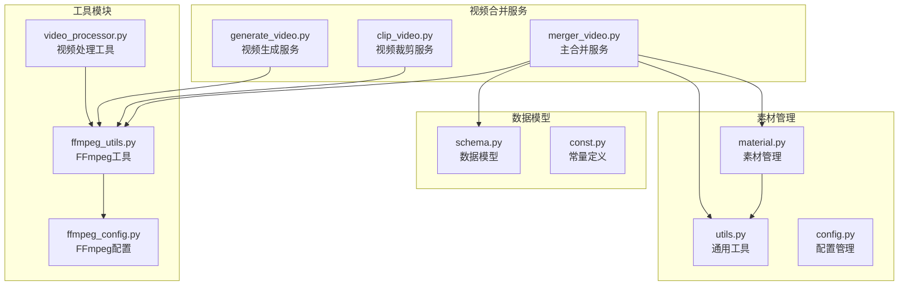

**图表来源**
- [merger_video.py:1-678](file://app/services/merger_video.py#L1-L678)
- [ffmpeg_utils.py:1-800](file://app/utils/ffmpeg_utils.py#L1-L800)
- [schema.py:1-209](file://app/models/schema.py#L1-L209)

**章节来源**
- [merger_video.py:1-678](file://app/services/merger_video.py#L1-L678)
- [ffmpeg_utils.py:1-800](file://app/utils/ffmpeg_utils.py#L1-L800)
- [schema.py:1-209](file://app/models/schema.py#L1-L209)

## 核心组件

### 视频合并主服务

视频合并服务的核心是`merger_video.py`文件，提供了完整的视频合并功能：

- **多片段排序逻辑**：支持随机和顺序两种合并模式
- **时间轴对齐**：精确的时间戳处理和音频同步
- **格式统一**：自动调整分辨率、帧率和像素格式
- **质量控制**：统一的编码参数和比特率设置

### 硬件加速检测

`ffmpeg_utils.py`提供了智能的硬件加速检测机制：

- **多平台支持**：Windows、macOS、Linux的硬件加速检测
- **GPU厂商识别**：NVIDIA、AMD、Intel显卡的自动识别
- **编码器映射**：不同硬件的最优编码器选择
- **渐进式降级**：从高性能到兼容性的智能切换

### 素材管理系统

`material.py`负责视频素材的获取和管理：

- **素材搜索**：支持Pexels和Pixabay等素材源
- **视频下载**：自动下载和缓存视频素材
- **时间戳处理**：精确的视频片段裁剪
- **质量保证**：确保下载视频的完整性和可用性

**章节来源**
- [merger_video.py:21-678](file://app/services/merger_video.py#L21-L678)
- [ffmpeg_utils.py:252-355](file://app/utils/ffmpeg_utils.py#L252-L355)
- [material.py:39-254](file://app/services/material.py#L39-L254)

## 架构概览

视频合并服务采用分层架构设计，确保模块间的松耦合和高内聚：

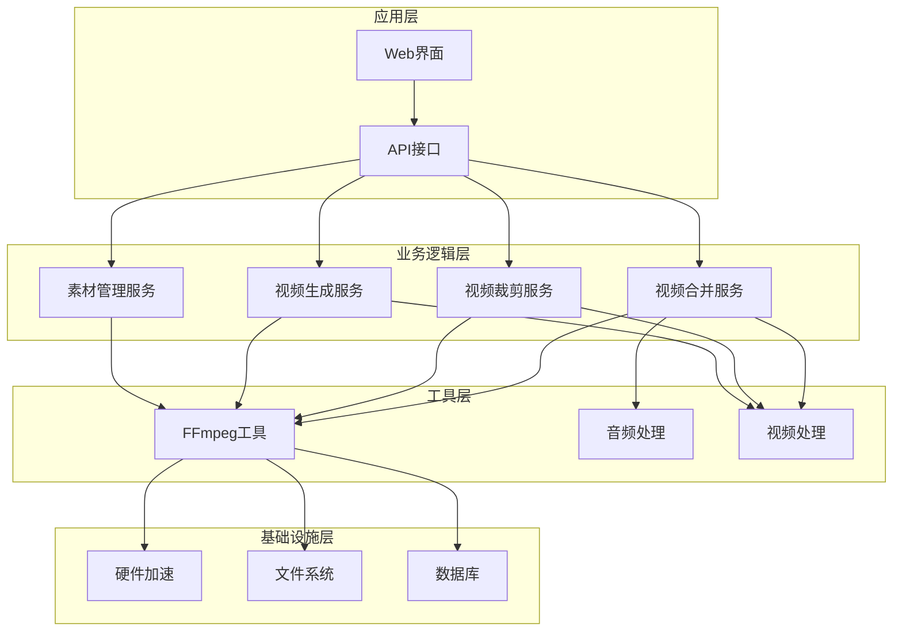

**图表来源**
- [merger_video.py:328-678](file://app/services/merger_video.py#L328-L678)
- [clip_video.py:780-800](file://app/services/clip_video.py#L780-L800)
- [generate_video.py:66-510](file://app/services/generate_video.py#L66-L510)

## 详细组件分析

### 视频合并算法实现

#### 多片段排序逻辑

视频合并服务支持两种排序模式：

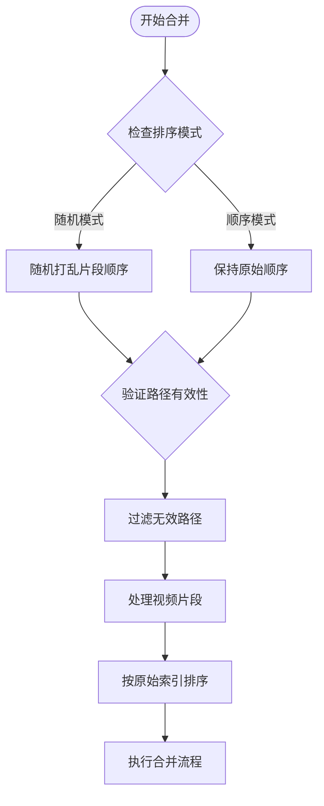

**图表来源**
- [merger_video.py:375-466](file://app/services/merger_video.py#L375-L466)

#### 时间轴对齐机制

时间轴对齐通过精确的时间戳处理实现：

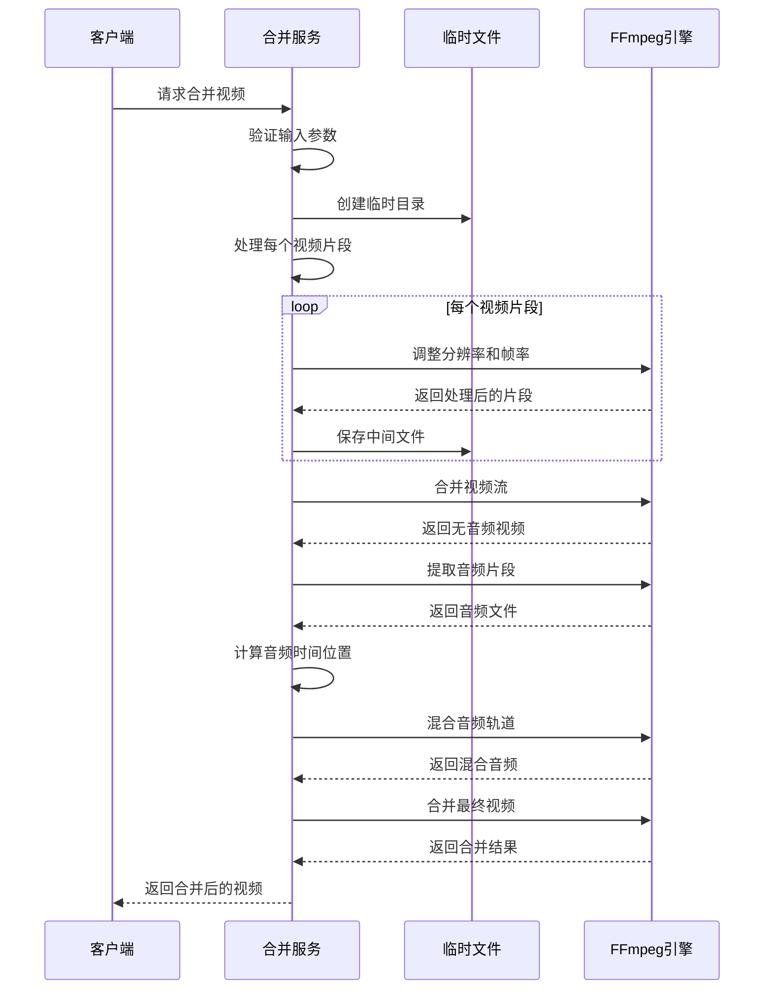

**图表来源**
- [merger_video.py:410-620](file://app/services/merger_video.py#L410-L620)

#### 格式兼容性处理

格式兼容性通过统一的编码参数实现：

| 参数 | 值 | 说明 |
|------|-----|------|
| 编码器 | h264_nvenc/libx264 | GPU硬件加速或软件编码 |
| 像素格式 | yuv420p | 最佳兼容性 |
| 帧率 | 30fps | 标准帧率 |
| 分辨率 | 1080x1920/1920x1080 | 根据宽高比自动选择 |
| 比特率 | 5Mbps | 高质量视频 |

**章节来源**
- [merger_video.py:130-326](file://app/services/merger_video.py#L130-L326)
- [merger_video.py:467-648](file://app/services/merger_video.py#L467-L648)

### 质量保证机制

#### 编码参数统一

视频合并服务确保所有输出视频具有统一的编码参数：

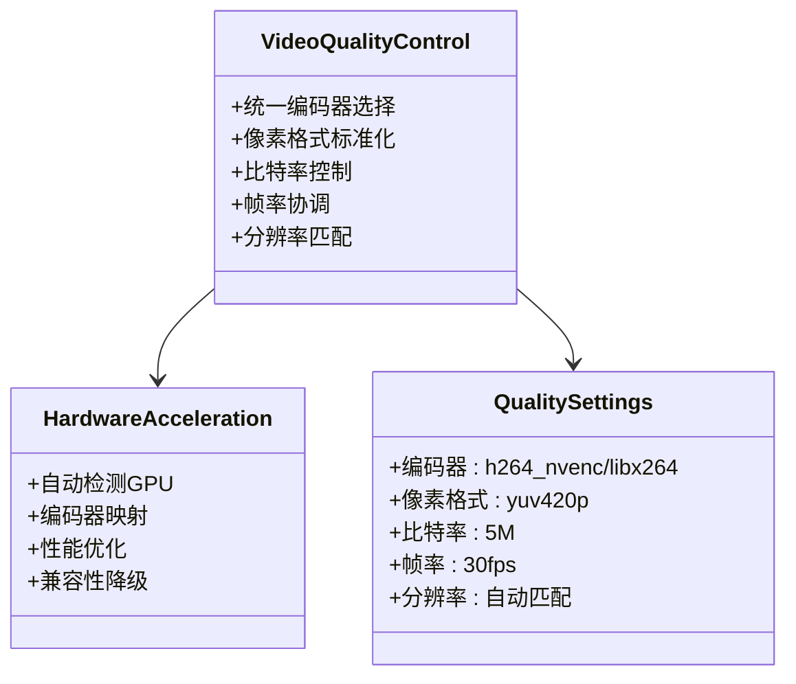

**图表来源**
- [merger_video.py:210-250](file://app/services/merger_video.py#L210-L250)
- [ffmpeg_utils.py:50-61](file://app/utils/ffmpeg_utils.py#L50-L61)

#### 分辨率匹配策略

分辨率匹配通过智能缩放和填充实现：

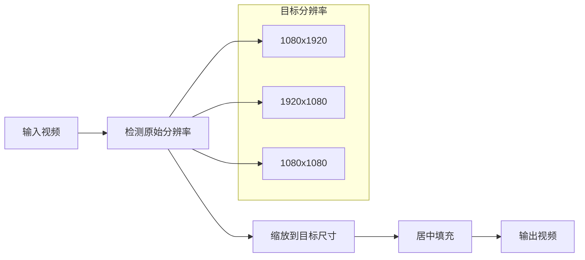

**图表来源**
- [merger_video.py:203-209](file://app/services/merger_video.py#L203-L209)
- [schema.py:42-56](file://app/models/schema.py#L42-L56)

#### 帧率协调机制

帧率协调通过统一的帧率设置实现：

| 场景 | 帧率设置 | 说明 |
|------|----------|------|
| 视频合并 | 30fps | 标准播放帧率 |
| 关键帧提取 | 25fps | 视频原始帧率 |
| 视频生成 | 30fps | 最佳观看体验 |

**章节来源**
- [merger_video.py:208](file://app/services/merger_video.py#L208)
- [video_processor.py:39-43](file://app/utils/video_processor.py#L39-L43)

### 并发处理能力

#### 多线程视频处理

视频合并服务支持多线程并行处理：

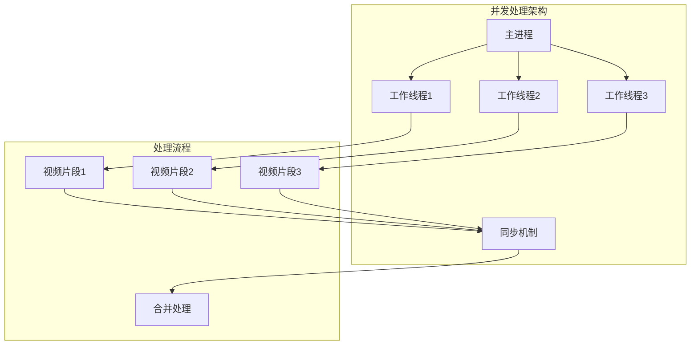

**图表来源**
- [merger_video.py:334](file://app/services/merger_video.py#L334)
- [generate_video.py:194-268](file://app/services/generate_video.py#L194-L268)

#### 内存优化策略

内存优化通过临时文件管理和渐进式清理实现：

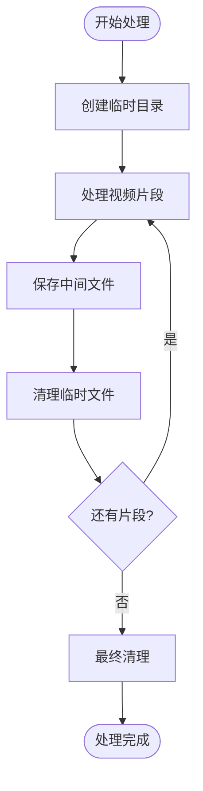

**图表来源**
- [merger_video.py:652-660](file://app/services/merger_video.py#L652-L660)

### 进度跟踪机制

#### 实时进度监控

视频合并服务提供完整的进度跟踪：

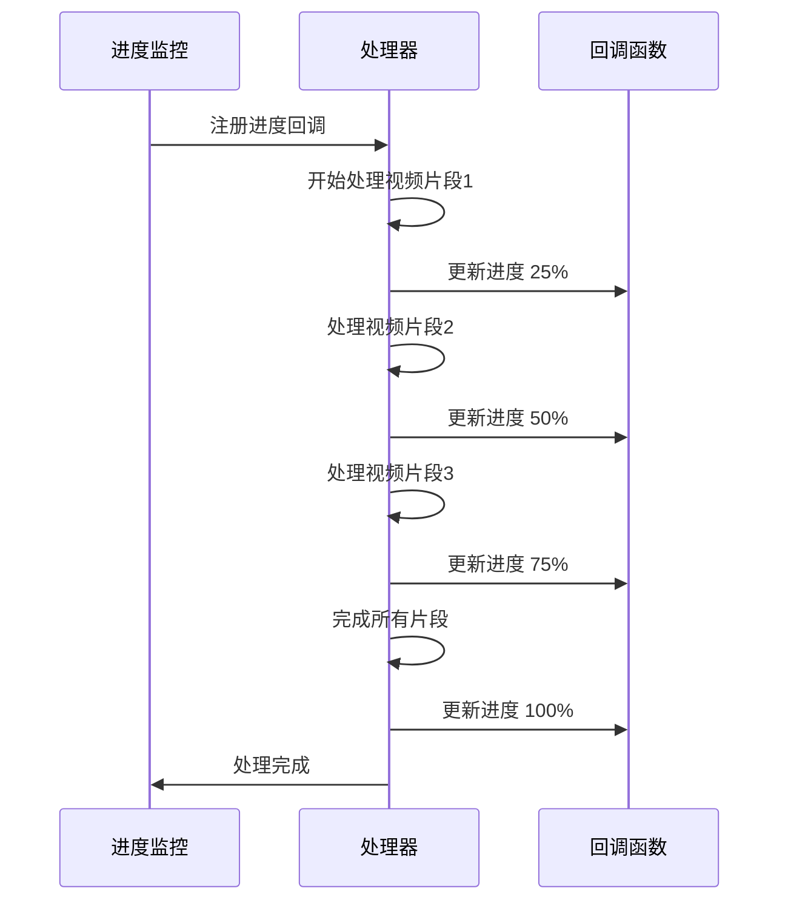

**图表来源**
- [material.py:492-522](file://app/services/material.py#L492-L522)

**章节来源**
- [merger_video.py:434](file://app/services/merger_video.py#L434)
- [material.py:513-516](file://app/services/material.py#L513-L516)

### 实际使用案例

#### 基本视频合并

```python
# 示例：合并5个视频片段
video_paths = [
    '/path/to/video1.mp4',
    '/path/to/video2.mp4',
    '/path/to/video3.mp4',
    '/path/to/video4.mp4',
    '/path/to/video5.mp4'
]

ost_list = [1, 1, 1, 1, 1]  # 保留原声

result = combine_clip_videos(
    output_video_path='/path/to/merged_output.mp4',
    video_paths=video_paths,
    video_ost_list=ost_list,
    video_aspect=VideoAspect.portrait,
    threads=4,
    force_software_encoding=False
)
```

#### 高级合并配置

```python
# 示例：自定义合并参数
result = combine_clip_videos(
    output_video_path='/path/to/advanced_output.mp4',
    video_paths=video_paths,
    video_ost_list=[2, 0, 1, 2, 0],  # 混合模式
    video_aspect=VideoAspect.landscape,
    threads=8,
    force_software_encoding=True  # 强制软件编码
)
```

**章节来源**
- [merger_video.py:662-678](file://app/services/merger_video.py#L662-L678)

## 依赖分析

### 外部依赖关系

视频合并服务依赖以下外部组件：

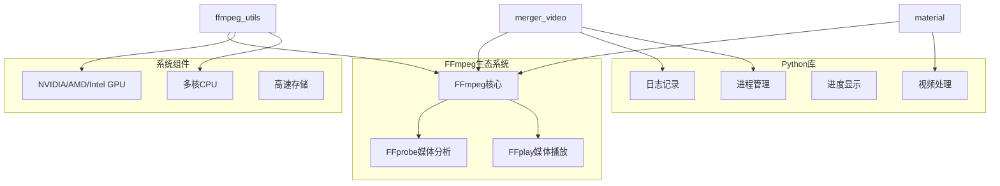

**图表来源**
- [merger_video.py:11-18](file://app/services/merger_video.py#L11-L18)
- [ffmpeg_utils.py:104-116](file://app/utils/ffmpeg_utils.py#L104-L116)

### 内部模块依赖

内部模块间的关系通过清晰的接口定义：

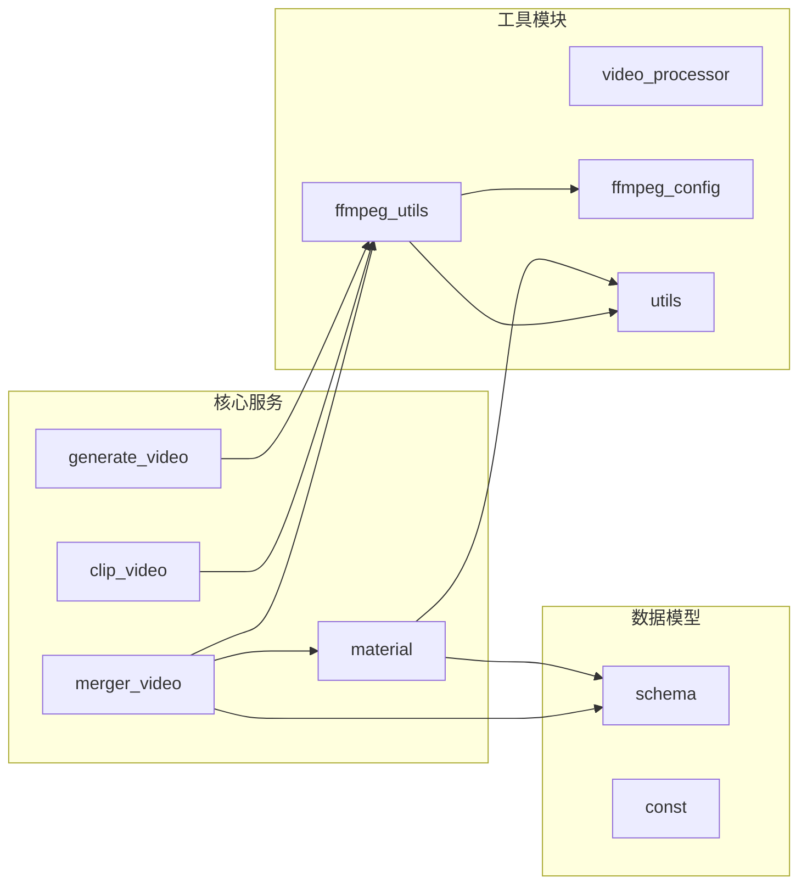

**图表来源**
- [merger_video.py:18](file://app/services/merger_video.py#L18)
- [material.py:14-17](file://app/services/material.py#L14-L17)

**章节来源**
- [merger_video.py:1-678](file://app/services/merger_video.py#L1-L678)
- [ffmpeg_utils.py:1-800](file://app/utils/ffmpeg_utils.py#L1-L800)

## 性能考虑

### 硬件加速优化

视频合并服务充分利用硬件加速提升性能：

| 硬件类型 | 编码器 | 性能优势 | 兼容性 |
|----------|--------|----------|--------|
| NVIDIA GPU | h264_nvenc | 最高性能 | 高 |
| AMD GPU | h264_amf | 良好性能 | 中高 |
| Intel GPU | h264_qsv | 能效比高 | 中 |
| CPU | libx264 | 最佳兼容性 | 最高 |

### 内存管理策略

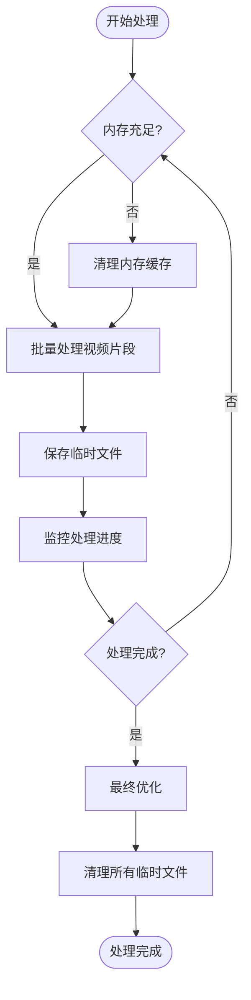

### 并发处理优化

并发处理通过智能的任务调度实现：

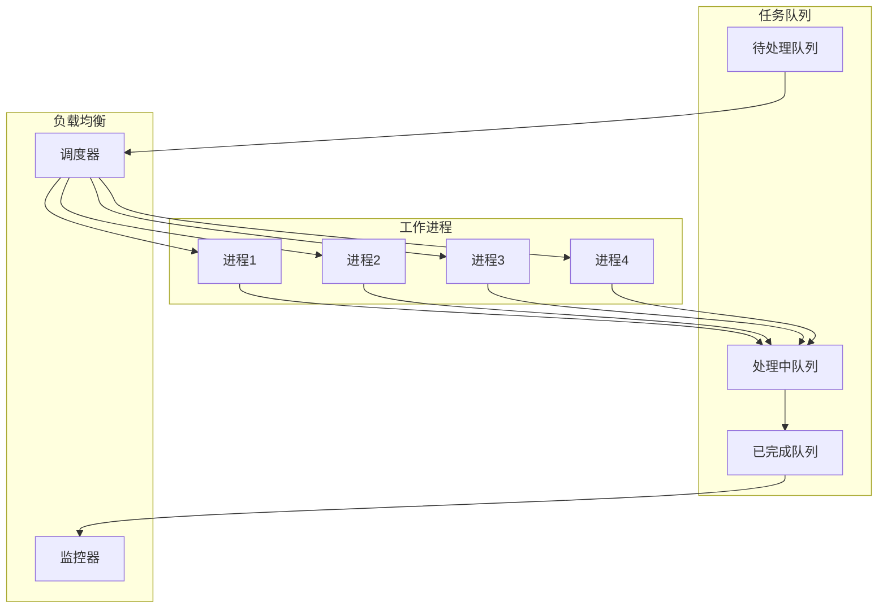

## 故障排除指南

### 常见问题及解决方案

#### FFmpeg安装问题

**问题症状**：
- "未找到ffmpeg，请先安装"
- FFmpeg命令执行失败

**解决方案**：
1. 确认FFmpeg已正确安装
2. 检查系统PATH环境变量
3. 验证FFmpeg版本兼容性

#### 硬件加速失败

**问题症状**：
- 硬件编码器检测失败
- CUDA解码错误
- NVENC编码器不可用

**解决方案**：
1. 检查GPU驱动程序
2. 验证硬件编码器支持
3. 启用软件编码降级

#### 内存不足问题

**问题症状**：
- 处理过程中内存溢出
- 进程被系统终止

**解决方案**：
1. 减少并发处理线程数
2. 优化视频分辨率
3. 增加系统内存

#### 音频同步问题

**问题症状**：
- 合并后音频与视频不同步
- 音频延迟或提前

**解决方案**：
1. 检查音频采样率一致性
2. 验证时间戳精度
3. 调整音频混合参数

**章节来源**
- [merger_video.py:45-57](file://app/services/merger_video.py#L45-L57)
- [ffmpeg_utils.py:118-136](file://app/utils/ffmpeg_utils.py#L118-L136)

### 调试和诊断

#### 日志记录策略

视频合并服务采用多层次的日志记录：

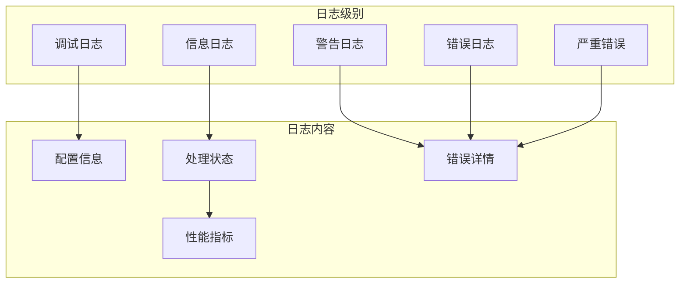

#### 性能监控

性能监控通过以下指标实现：

| 监控指标 | 目标值 | 告警阈值 |
|----------|--------|----------|
| 处理速度 | >10MB/s | <5MB/s |
| 内存使用 | <80% | >90% |
| CPU利用率 | <80% | >95% |
| 磁盘I/O | >50MB/s | <20MB/s |

**章节来源**
- [merger_video.py:524-325](file://app/services/merger_video.py#L524-L325)
- [ffmpeg_utils.py:252-355](file://app/utils/ffmpeg_utils.py#L252-L355)

## 结论

视频合并服务作为NarratoAI项目的核心功能，展现了以下技术优势：

### 技术亮点

1. **智能化硬件加速**：自动检测和优化硬件加速配置
2. **高质量输出保证**：统一的编码参数和质量控制
3. **强大的兼容性**：支持多平台和多格式的视频处理
4. **高效的并发处理**：多线程并行处理提升性能
5. **完善的错误处理**：渐进式降级和智能错误恢复

### 应用价值

- **内容创作者**：提供专业级的视频合并工具
- **企业用户**：支持批量视频处理和自动化流程
- **开发者**：提供可扩展的视频处理API

### 未来发展

视频合并服务将继续优化的方向包括：
- 更智能的硬件加速检测
- 更高效的内存管理策略
- 更丰富的视频格式支持
- 更完善的错误诊断机制

## 附录

### API参考

#### 视频合并接口

| 参数 | 类型 | 必需 | 描述 |
|------|------|------|------|
| output_video_path | str | 是 | 输出视频路径 |
| video_paths | List[str] | 是 | 视频片段路径列表 |
| video_ost_list | List[int] | 是 | 原声保留策略列表 |
| video_aspect | VideoAspect | 否 | 视频宽高比 |
| threads | int | 否 | 并发处理线程数 |
| force_software_encoding | bool | 否 | 是否强制软件编码 |

#### 返回值

| 类型 | 描述 |
|------|------|
| str | 合并后的视频文件路径 |
| None | 处理失败时返回None |

### 配置选项

#### FFmpeg配置文件

| 配置项 | 类型 | 默认值 | 描述 |
|--------|------|--------|------|
| hwaccel_enabled | bool | True | 是否启用硬件加速 |
| encoder | str | auto | 编码器类型 |
| quality_preset | str | fast | 质量预设 |
| pixel_format | str | yuv420p | 像素格式 |
| compatibility_level | int | 2 | 兼容性等级 |

### 最佳实践

1. **硬件配置建议**：至少8GB内存，推荐16GB以上
2. **视频格式建议**：使用H.264编码的MP4格式
3. **分辨率建议**：1080p或1920p分辨率
4. **帧率建议**：24fps、30fps或60fps
5. **音频建议**：44.1kHz采样率，立体声