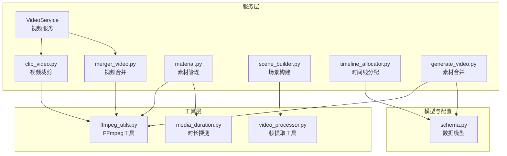
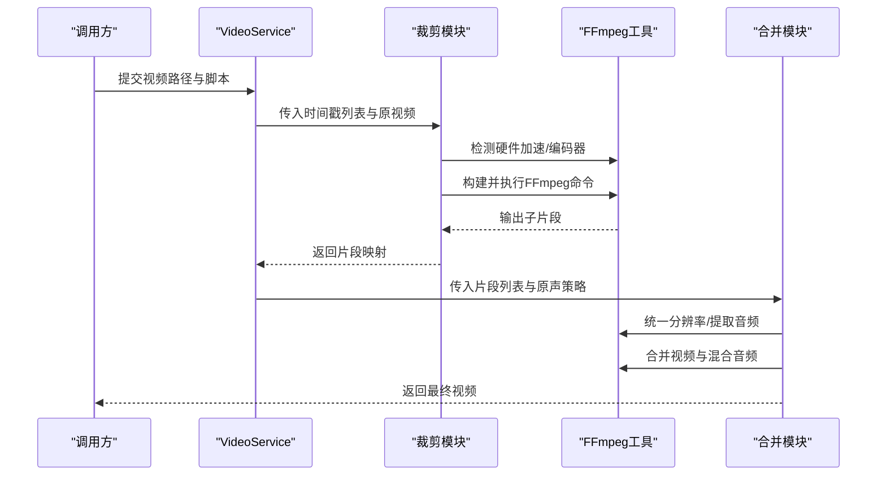
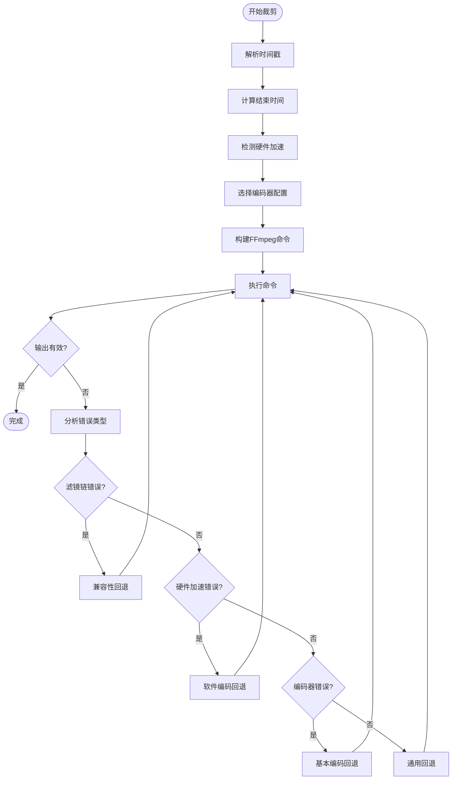
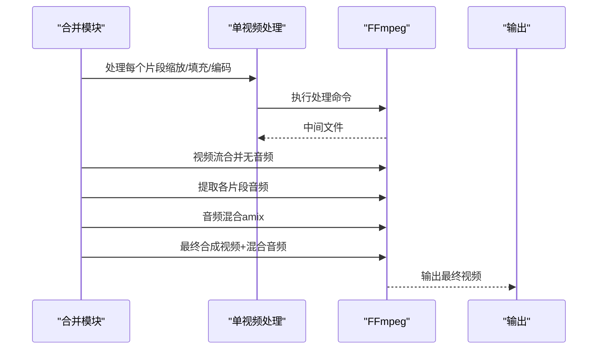
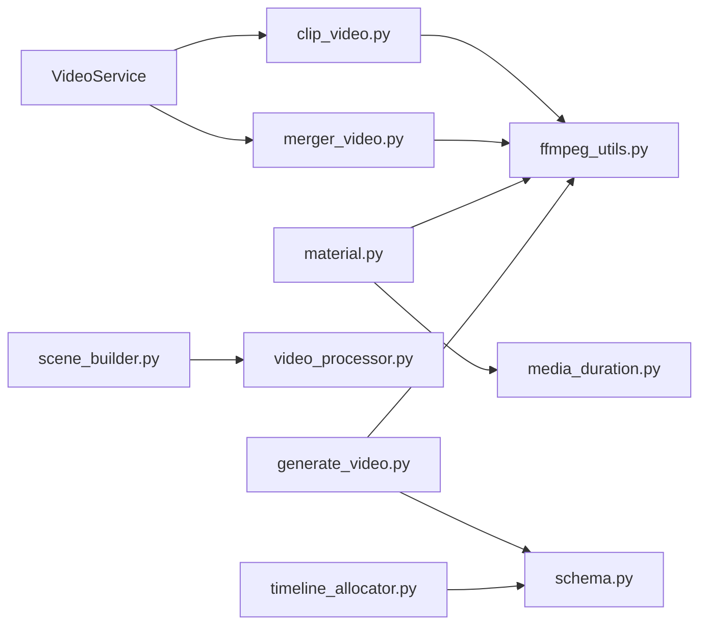

# 视频处理服务

<cite>
**本文引用的文件**
- [video_service.py](file://app/services/video_service.py)
- [clip_video.py](file://app/services/clip_video.py)
- [merger_video.py](file://app/services/merger_video.py)
- [material.py](file://app/services/material.py)
- [scene_builder.py](file://app/services/scene_builder.py)
- [timeline_allocator.py](file://app/services/timeline_allocator.py)
- [ffmpeg_utils.py](file://app/utils/ffmpeg_utils.py)
- [schema.py](file://app/models/schema.py)
- [generate_video.py](file://app/services/generate_video.py)
- [frame_selector.py](file://app/services/frame_selector.py)
- [media_duration.py](file://app/services/media_duration.py)
- [video_processor.py](file://app/utils/video_processor.py)
- [README.md](file://README.md)
</cite>

## 目录
1. [简介](#简介)
2. [项目结构](#项目结构)
3. [核心组件](#核心组件)
4. [架构总览](#架构总览)
5. [详细组件分析](#详细组件分析)
6. [依赖关系分析](#依赖关系分析)
7. [性能考量](#性能考量)
8. [故障排查指南](#故障排查指南)
9. [结论](#结论)
10. [附录](#附录)

## 简介
本文件面向NarratoAI的视频处理服务，系统性梳理自动剪辑、片段拼接、时序匹配、素材管理、场景构建、时间线分配等能力。重点覆盖：
- 视频裁剪：时间轴定位、精确切割、质量保持与硬件加速兼容性
- 视频合并：多片段排序、原声/解说混合、格式统一与音频对齐
- 素材管理：视频检索、下载、解析与缓存策略
- 场景构建：基于字幕/关键帧的智能分镜
- 时间线分配：预算估算、文本截断与节奏控制
- 实际使用案例与性能优化建议

## 项目结构
视频处理相关代码集中在app/services与app/utils两大目录，围绕FFmpeg工具链与MoviePy进行编排，形成“脚本驱动→裁剪→合并→字幕/音轨合成”的完整流水线。

图表来源
- [video_service.py:1-56](file://app/services/video_service.py#L1-L56)
- [clip_video.py:1-1108](file://app/services/clip_video.py#L1-L1108)
- [merger_video.py:1-678](file://app/services/merger_video.py#L1-L678)
- [material.py:1-580](file://app/services/material.py#L1-L580)
- [scene_builder.py:1-71](file://app/services/scene_builder.py#L1-L71)
- [timeline_allocator.py:1-36](file://app/services/timeline_allocator.py#L1-L36)
- [ffmpeg_utils.py:1-1121](file://app/utils/ffmpeg_utils.py#L1-L1121)
- [video_processor.py:1-670](file://app/utils/video_processor.py#L1-L670)
- [media_duration.py:1-30](file://app/services/media_duration.py#L1-L30)
- [schema.py:1-209](file://app/models/schema.py#L1-L209)
- [generate_video.py:1-510](file://app/services/generate_video.py#L1-L510)

章节来源
- [README.md:1-180](file://README.md#L1-L180)

## 核心组件
- 视频服务VideoService：对外暴露裁剪入口，协调脚本与裁剪模块，维护任务ID与输出映射
- 视频裁剪clip_video.py：时间戳解析、时长计算、编码器选择、硬件加速、错误降级与回退策略
- 视频合并merger_video.py：多片段处理、分辨率统一、音频提取与混合、最终合成
- 素材管理material.py：视频检索、下载、保存、时间戳转换、裁剪执行
- 场景构建scene_builder.py：基于字幕的场景分割与关键帧回退策略
- 时间线分配timeline_allocator.py：按时间预算估算字符配额并截断文本
- FFmpeg工具ffmpeg_utils.py：跨平台硬件加速检测、编码器映射、参数生成
- 帧提取video_processor.py：关键帧提取、兼容性策略、多格式输出
- 时长探测media_duration.py：ffprobe探测媒体时长
- 素材合并generate_video.py：MoviePy合成视频、字幕、音轨与智能音量调整

章节来源
- [video_service.py:9-56](file://app/services/video_service.py#L9-L56)
- [clip_video.py:1-1108](file://app/services/clip_video.py#L1-L1108)
- [merger_video.py:1-678](file://app/services/merger_video.py#L1-L678)
- [material.py:1-580](file://app/services/material.py#L1-L580)
- [scene_builder.py:1-71](file://app/services/scene_builder.py#L1-L71)
- [timeline_allocator.py:1-36](file://app/services/timeline_allocator.py#L1-L36)
- [ffmpeg_utils.py:1-1121](file://app/utils/ffmpeg_utils.py#L1-L1121)
- [video_processor.py:1-670](file://app/utils/video_processor.py#L1-L670)
- [media_duration.py:1-30](file://app/services/media_duration.py#L1-L30)
- [generate_video.py:1-510](file://app/services/generate_video.py#L1-L510)

## 架构总览
整体流程从“脚本→裁剪→合并→字幕/音轨”展开，关键在于：
- 脚本驱动：VideoService接收脚本，提取时间戳，交由裁剪模块生成子片段
- 裁剪模块：解析时间戳、选择编码器、执行FFmpeg、错误回退
- 合并模块：统一分辨率、分离/混合音频、最终合成
- 素材管理：检索/下载/保存，提供稳定输入
- 场景构建：字幕/关键帧驱动的智能分镜
- 时间线分配：预算约束下的文本截断与节奏控制

图表来源
- [video_service.py:11-52](file://app/services/video_service.py#L11-L52)
- [clip_video.py:780-1108](file://app/services/clip_video.py#L780-L1108)
- [merger_video.py:328-678](file://app/services/merger_video.py#L328-L678)
- [ffmpeg_utils.py:778-800](file://app/utils/ffmpeg_utils.py#L778-L800)

## 详细组件分析

### 视频裁剪模块（clip_video.py）
- 时间戳解析与动态结束时间计算，支持毫秒与时长叠加
- 编码器配置与硬件加速选择，针对不同平台与GPU类型提供最优参数
- 智能错误分析与多级回退策略：滤镜链错误、硬件加速错误、编码器错误、通用回退
- 针对OST（Original Sound Track）三种模式的差异化处理：纯解说、纯原声、混合
- FFmpeg命令构建与执行，包含像素格式、音频参数、优化标志等

图表来源
- [clip_video.py:21-342](file://app/services/clip_video.py#L21-L342)
- [clip_video.py:345-546](file://app/services/clip_video.py#L345-L546)
- [clip_video.py:548-777](file://app/services/clip_video.py#L548-L777)

章节来源
- [clip_video.py:1-1108](file://app/services/clip_video.py#L1-L1108)

### 视频合并模块（merger_video.py）
- 宽高比与分辨率枚举，统一输出尺寸
- 单视频处理：缩放、填充、帧率、编码器选择与硬件加速
- 多片段合并：视频流合并（无音频）、音频提取与混合、最终合成
- 音频混合策略：静音轨道+各片段音轨，按时间位置对齐，amix混合
- 备用合并路径：无音频合并作为兜底

图表来源
- [merger_video.py:130-326](file://app/services/merger_video.py#L130-L326)
- [merger_video.py:328-678](file://app/services/merger_video.py#L328-L678)

章节来源
- [merger_video.py:1-678](file://app/services/merger_video.py#L1-L678)

### 素材管理模块（material.py）
- 视频检索：Pexels/Pixabay API封装，按宽高比与时长筛选
- 下载与缓存：去重、哈希命名、校验有效性
- 时间戳工具：时分秒与秒互转、格式化
- 裁剪执行：保存子片段、路径生成、时长边界校验、FFmpeg命令构建与执行
- 合并工具：基于原声保留策略的简单合并

章节来源
- [material.py:1-580](file://app/services/material.py#L1-L580)

### 场景构建模块（scene_builder.py）
- 基于字幕：最大场景时长、最大间隙、最小场景时长控制
- 关键帧回退：按固定间隔生成场景占位，保障无字幕时的可用性

章节来源
- [scene_builder.py:1-71](file://app/services/scene_builder.py#L1-L71)

### 时间线分配模块（timeline_allocator.py）
- 预算估算：按秒字符密度与保留比例计算字符预算
- 文本截断：按标点软截断，确保语义完整与视觉舒适

章节来源
- [timeline_allocator.py:1-36](file://app/services/timeline_allocator.py#L1-L36)

### FFmpeg工具（ffmpeg_utils.py）
- 跨平台硬件加速检测：GPU厂商识别、优先级、编码器映射
- 参数生成：硬件加速类型、编码器、参数列表
- 检测与降级：渐进式检测、失败回退、消息提示

章节来源
- [ffmpeg_utils.py:1-1121](file://app/utils/ffmpeg_utils.py#L1-L1121)

### 帧提取工具（video_processor.py）
- 视频信息探测：ffprobe获取分辨率、帧率、时长
- 关键帧提取：按时间间隔提取，多策略兼容（软件解码/NVENC、硬件加速、超级兼容）
- 多格式输出：PNG/JPG/BMP兼容方案

章节来源
- [video_processor.py:1-670](file://app/utils/video_processor.py#L1-L670)

### 时长探测（media_duration.py）
- ffprobe探测媒体时长，异常时返回0

章节来源
- [media_duration.py:1-30](file://app/services/media_duration.py#L1-L30)

### 素材合并（generate_video.py）
- 字幕校验与加载：SRT格式识别
- 音轨合成：智能音量分析与调整、原声/配音/背景音乐混合
- 字幕渲染：文本换行、描边、位置控制
- 导出：MoviePy写入视频文件

章节来源
- [generate_video.py:1-510](file://app/services/generate_video.py#L1-L510)

## 依赖关系分析
- VideoService依赖裁剪模块与脚本数据结构
- 裁剪与合并均依赖FFmpeg工具进行硬件加速与编码器选择
- 素材管理依赖FFmpeg工具与媒体探测
- 场景构建依赖帧提取工具与关键帧文件
- 素材合并依赖MoviePy与音量配置

图表来源
- [video_service.py:1-56](file://app/services/video_service.py#L1-L56)
- [clip_video.py:1-1108](file://app/services/clip_video.py#L1-L1108)
- [merger_video.py:1-678](file://app/services/merger_video.py#L1-L678)
- [material.py:1-580](file://app/services/material.py#L1-L580)
- [scene_builder.py:1-71](file://app/services/scene_builder.py#L1-L71)
- [timeline_allocator.py:1-36](file://app/services/timeline_allocator.py#L1-L36)
- [ffmpeg_utils.py:1-1121](file://app/utils/ffmpeg_utils.py#L1-L1121)
- [video_processor.py:1-670](file://app/utils/video_processor.py#L1-L670)
- [media_duration.py:1-30](file://app/services/media_duration.py#L1-L30)
- [generate_video.py:1-510](file://app/services/generate_video.py#L1-L510)
- [schema.py:1-209](file://app/models/schema.py#L1-L209)

## 性能考量
- 硬件加速优先：根据GPU厂商与平台自动选择最优编码器，显著提升裁剪与合并性能
- 多级回退：滤镜链错误、硬件加速失败、编码器异常时自动切换至兼容方案
- 统一分辨率与帧率：合并前统一处理，减少后续编码压力
- 音频混合策略：amix按时间位置混合，避免重采样与延迟
- 字幕换行与描边：减少渲染开销，提升合成效率
- 关键帧提取：多策略兼容，避免MJPEG/BMP等格式问题

## 故障排查指南
- 裁剪失败
  - 检查时间戳格式与边界（起止时间、总时长）
  - 查看错误类型：滤镜链、硬件加速、编码器
  - 优先尝试兼容性回退与软件编码回退
- 合并失败
  - 确认视频片段存在且可读
  - 检查音频提取与混合命令
  - 使用无音频合并作为兜底
- 字幕/音轨异常
  - 校验SRT格式与编码
  - 调整字幕位置与描边参数
  - 智能音量分析失败时回退到默认音量
- 关键帧提取失败
  - 尝试超级兼容性方案（PNG→JPG）
  - 禁用硬件加速或更换编码器

章节来源
- [clip_video.py:304-546](file://app/services/clip_video.py#L304-L546)
- [merger_video.py:467-678](file://app/services/merger_video.py#L467-L678)
- [generate_video.py:32-64](file://app/services/generate_video.py#L32-L64)

## 结论
NarratoAI的视频处理服务以FFmpeg为核心，结合多级回退与跨平台硬件加速，实现了高兼容性的自动剪辑与合并流程。配合场景构建与时间线分配，能够支撑从脚本到成品的完整生产链路。建议在实际部署中：
- 配置合适的硬件加速与编码器
- 使用多级回退策略应对不同环境
- 控制场景时长与间隙，确保节奏自然
- 采用智能音量与字幕策略提升观感

## 附录
- 实际使用案例
  - 脚本→裁剪→合并→字幕/音轨合成的端到端工作流
  - 场景构建：基于字幕与关键帧的智能分镜
  - 时间线分配：按预算截断文本，控制节奏
- 性能优化建议
  - 优先使用硬件加速编码器
  - 合并前统一分辨率与帧率
  - 使用超级兼容性方案处理极端情况
  - 合理设置场景时长与间隙，避免频繁切换