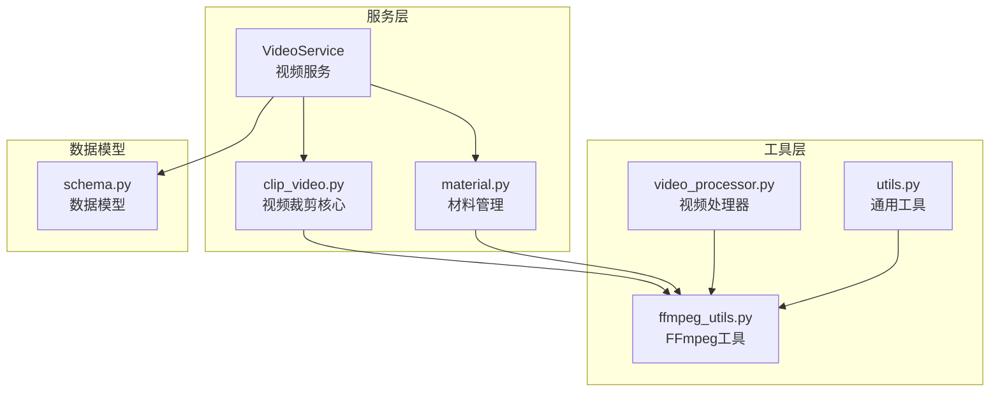
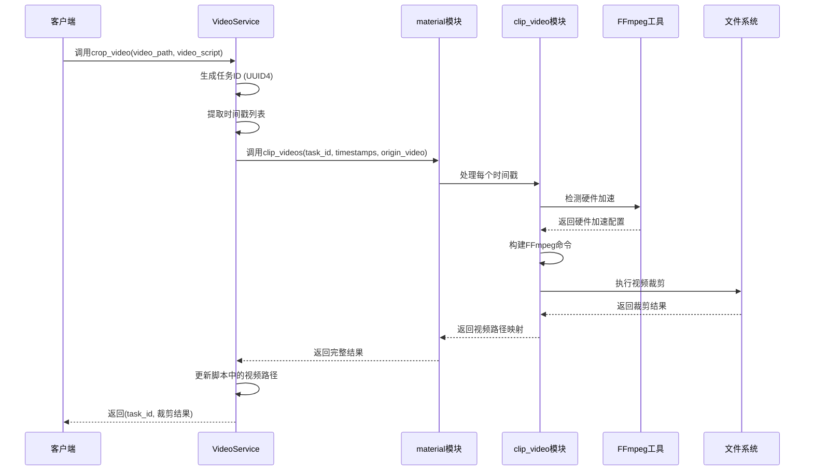
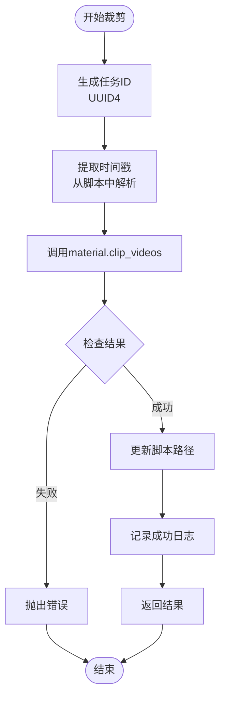
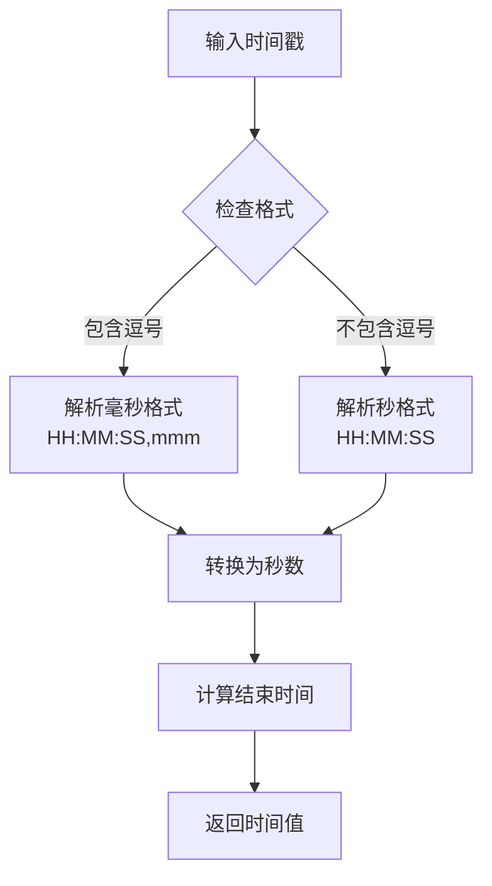
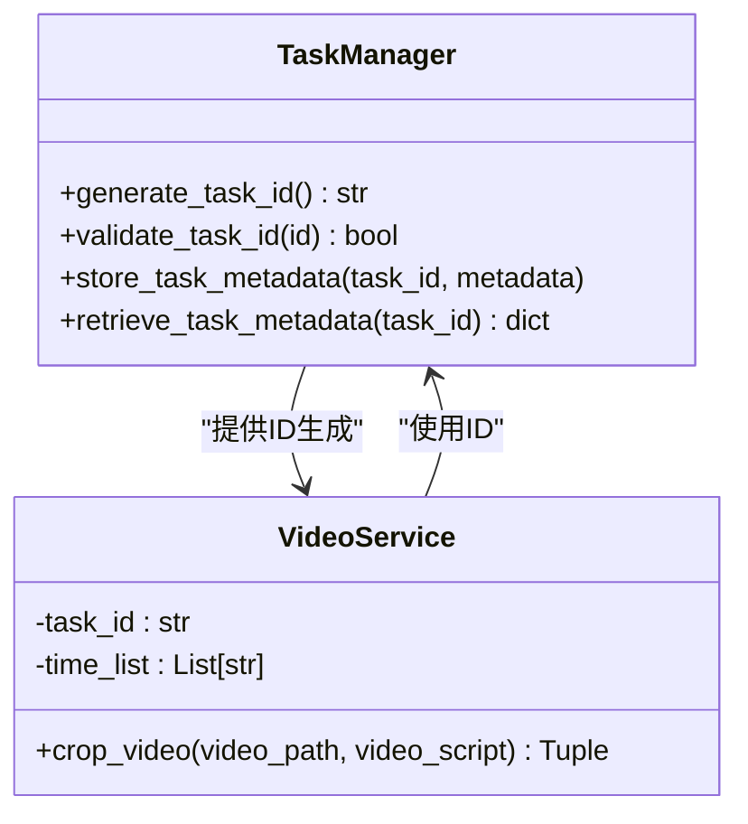
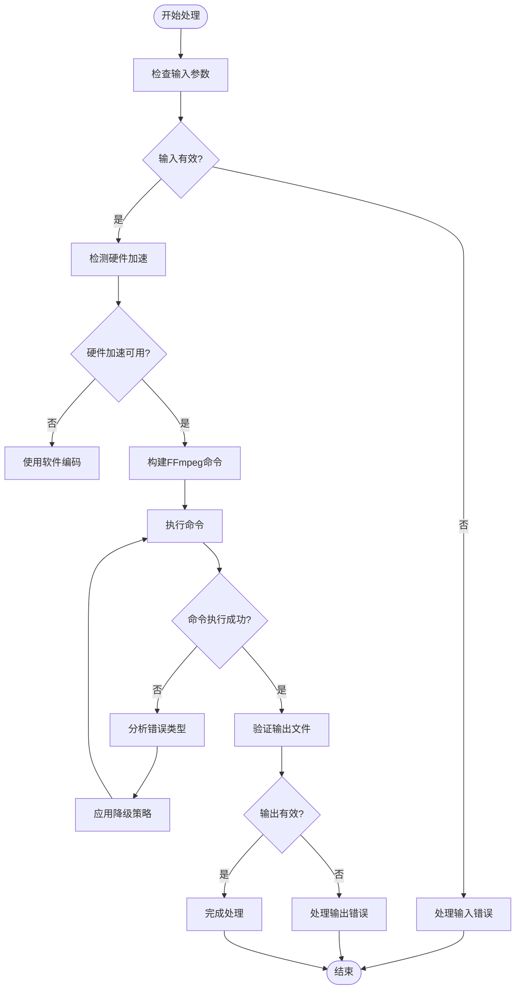
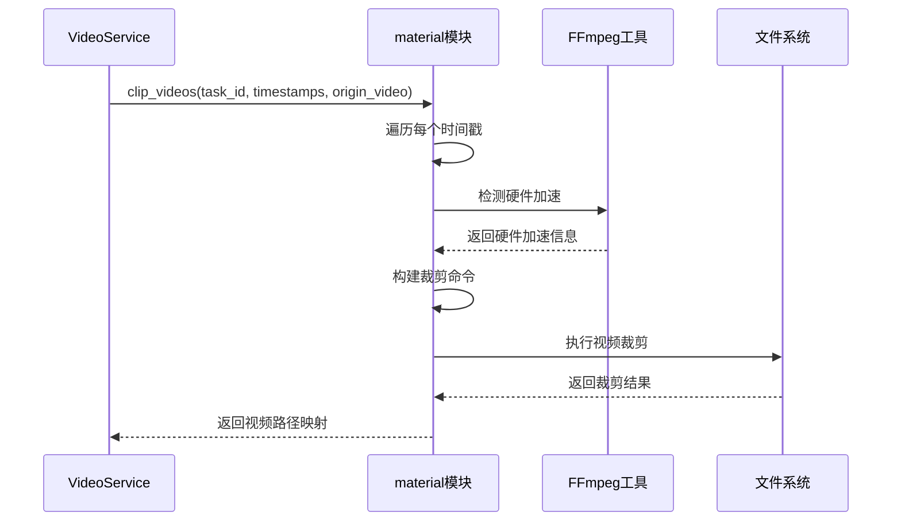
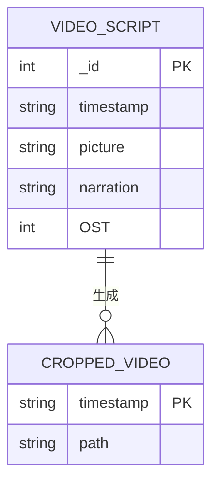
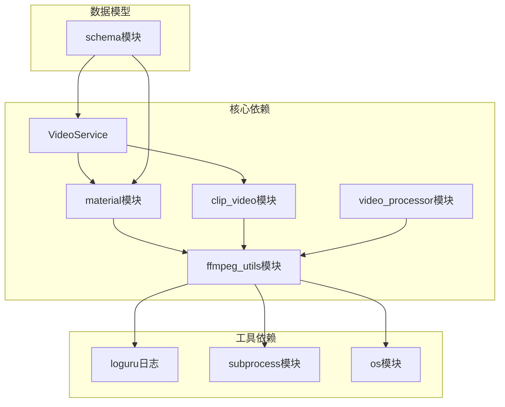
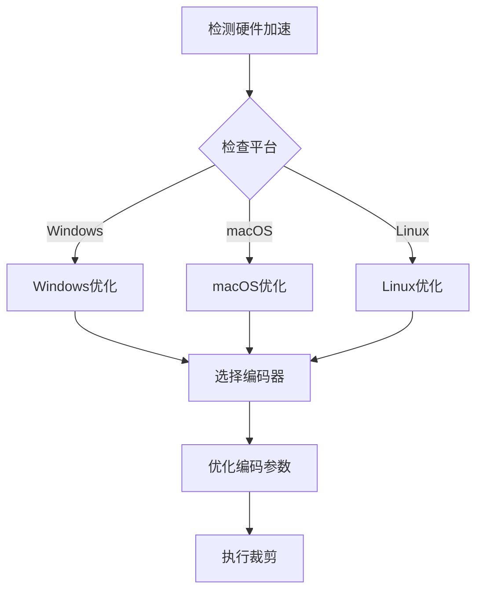

# 视频裁剪服务

<cite>
**本文档引用的文件**
- [video_service.py](file://app/services/video_service.py)
- [clip_video.py](file://app/services/clip_video.py)
- [material.py](file://app/services/material.py)
- [ffmpeg_utils.py](file://app/utils/ffmpeg_utils.py)
- [video_processor.py](file://app/utils/video_processor.py)
- [utils.py](file://app/utils/utils.py)
- [schema.py](file://app/models/schema.py)
</cite>

## 目录
1. [简介](#简介)
2. [项目结构](#项目结构)
3. [核心组件](#核心组件)
4. [架构概览](#架构概览)
5. [详细组件分析](#详细组件分析)
6. [依赖关系分析](#依赖关系分析)
7. [性能考虑](#性能考虑)
8. [故障排除指南](#故障排除指南)
9. [结论](#结论)
10. [附录](#附录)

## 简介

视频裁剪服务是NarratoAI项目中的核心功能模块，负责将输入的视频按照脚本中的时间戳进行精确裁剪。该服务实现了高质量的视频分割功能，支持多种硬件加速方案，并具备完善的错误处理和日志记录机制。

本服务的主要目标是：
- 提供精确的时间定位和视频裁剪功能
- 支持高质量的视频切割和格式转换
- 实现智能的硬件加速检测和降级策略
- 提供完整的任务管理和进度跟踪
- 确保跨平台的兼容性和稳定性

## 项目结构

视频裁剪服务涉及以下关键文件和模块：



**图表来源**
- [video_service.py:1-56](file://app/services/video_service.py#L1-L56)
- [clip_video.py:1-1108](file://app/services/clip_video.py#L1-L1108)
- [material.py:1-580](file://app/services/material.py#L1-L580)

**章节来源**
- [video_service.py:1-56](file://app/services/video_service.py#L1-L56)
- [clip_video.py:1-1108](file://app/services/clip_video.py#L1-L1108)
- [material.py:1-580](file://app/services/material.py#L1-L580)

## 核心组件

### VideoService类
VideoService是视频裁剪服务的入口点，提供统一的API接口：

- **crop_video方法**：主入口，处理视频裁剪请求
- **任务ID生成**：使用UUID4生成唯一任务标识
- **脚本解析**：从视频脚本中提取时间戳信息
- **结果整合**：将裁剪后的视频路径更新到脚本中

### clip_video模块
这是视频裁剪的核心实现，包含以下关键功能：

- **时间戳解析**：支持HH:MM:SS和HH:MM:SS,sss格式
- **FFmpeg命令构建**：智能构建优化的FFmpeg命令
- **硬件加速检测**：自动检测和配置硬件加速
- **错误处理机制**：多层错误处理和降级策略

### material模块
提供视频材料管理和处理功能：

- **视频裁剪**：基于时间戳的精确视频裁剪
- **进度回调**：支持进度监控和用户反馈
- **文件管理**：自动创建和管理输出目录

**章节来源**
- [video_service.py:9-56](file://app/services/video_service.py#L9-L56)
- [clip_video.py:21-74](file://app/services/clip_video.py#L21-L74)
- [material.py:492-522](file://app/services/material.py#L492-L522)

## 架构概览

视频裁剪服务采用分层架构设计，确保了模块间的清晰分离和高内聚低耦合：



**图表来源**
- [video_service.py:11-52](file://app/services/video_service.py#L11-L52)
- [material.py:492-522](file://app/services/material.py#L492-L522)
- [clip_video.py:143-227](file://app/services/clip_video.py#L143-L227)

## 详细组件分析

### crop_video方法实现原理

#### 视频路径处理
VideoService的crop_video方法负责处理视频路径和脚本数据：



**图表来源**
- [video_service.py:26-52](file://app/services/video_service.py#L26-L52)

#### 脚本解析机制
视频脚本采用JSON格式，包含以下关键字段：
- `_id`: 片段唯一标识符
- `timestamp`: 时间戳范围，格式为"HH:MM:SS,mmm-HH:MM:SS,mmm"
- `picture`: 场景描述
- `narration`: 旁白内容
- `OST`: 原声类型（0=纯旁白，1=纯原声，2=混合）

#### 时间戳提取流程
clip_video模块提供了专门的时间戳解析功能：

**章节来源**
- [video_service.py:11-52](file://app/services/video_service.py#L11-L52)
- [clip_video.py:21-32](file://app/services/clip_video.py#L21-L32)

### 视频裁剪技术实现

#### 精确时间定位
视频裁剪服务支持两种时间精度：

1. **毫秒级精度**：HH:MM:SS,mmm格式
2. **秒级精度**：HH:MM:SS格式

时间戳解析算法能够自动识别和处理这两种格式：



**图表来源**
- [clip_video.py:21-74](file://app/services/clip_video.py#L21-L74)

#### 高质量切割实现
视频裁剪采用FFmpeg进行高质量处理，支持多种编码器：

| 编码器类型 | 平台支持 | 性能特点 | 适用场景 |
|------------|----------|----------|----------|
| libx264 | 所有平台 | 软件编码，兼容性好 | 跨平台通用 |
| h264_nvenc | NVIDIA GPU | CUDA硬件加速，性能优异 | NVIDIA显卡 |
| h264_amf | AMD GPU | AMF硬件加速 | AMD显卡 |
| h264_qsv | Intel GPU | Quick Sync硬件加速 | Intel显卡 |
| h264_videotoolbox | macOS | Metal硬件加速 | Apple Silicon |

#### 内存管理策略
视频裁剪服务采用了多项内存管理优化：

1. **流式处理**：使用FFmpeg管道进行流式处理，避免大文件加载到内存
2. **临时文件管理**：自动创建和清理临时文件
3. **进度回调**：提供实时进度反馈，避免长时间无响应
4. **错误恢复**：遇到错误时自动清理临时文件

**章节来源**
- [clip_video.py:143-227](file://app/services/clip_video.py#L143-L227)
- [material.py:323-490](file://app/services/material.py#L323-L490)

### 任务ID生成机制

#### UUID4生成策略
VideoService使用Python的uuid4模块生成唯一任务ID：



**图表来源**
- [video_service.py:27](file://app/services/video_service.py#L27)

#### 任务状态管理
虽然当前实现主要使用UUID4，但系统设计支持未来扩展：

- **任务元数据存储**：可扩展的任务状态持久化
- **进度跟踪**：支持实时进度监控
- **错误恢复**：断点续传和错误恢复机制

**章节来源**
- [video_service.py:27](file://app/services/video_service.py#L27)

### 错误处理策略

#### 多层错误处理机制
视频裁剪服务实现了七层错误处理策略：



**图表来源**
- [clip_video.py:230-301](file://app/services/clip_video.py#L230-L301)

#### 错误类型分类
系统能够识别和处理以下错误类型：

1. **滤镜链错误**：格式转换问题，自动切换到兼容模式
2. **硬件加速错误**：GPU驱动问题，自动降级到软件编码
3. **编码器错误**：编码头文件问题，使用基础编码方案
4. **文件访问错误**：权限或路径问题，提供详细错误信息

#### 日志记录规范
视频裁剪服务遵循统一的日志记录规范：

- **INFO级别**：操作成功、进度更新
- **WARNING级别**：潜在问题、降级操作
- **ERROR级别**：严重错误、异常情况
- **DEBUG级别**：详细调试信息

**章节来源**
- [clip_video.py:304-342](file://app/services/clip_video.py#L304-L342)
- [material.py:485-489](file://app/services/material.py#L485-L489)

### 与material模块的协作

#### 材料管理集成
VideoService通过material模块实现视频裁剪功能：



**图表来源**
- [material.py:492-522](file://app/services/material.py#L492-L522)

#### 数据交换格式
裁剪服务与material模块之间的数据交换采用以下格式：

**返回结果格式**：
```json
{
    "timestamp": "00:00:00,000-00:00:20,100",
    "path": "/path/to/cropped/video.mp4"
}
```

**章节来源**
- [material.py:492-522](file://app/services/material.py#L492-L522)

### 与脚本系统的数据交换

#### 脚本数据格式
视频裁剪服务与脚本系统的数据交换基于标准化的JSON格式：



**图表来源**
- [schema.py:160-200](file://app/models/schema.py#L160-L200)

#### 数据转换流程
脚本数据在处理过程中的转换：

1. **输入阶段**：接收JSON格式的视频脚本
2. **解析阶段**：提取时间戳列表和片段信息
3. **处理阶段**：执行视频裁剪操作
4. **输出阶段**：更新脚本中的视频路径

**章节来源**
- [schema.py:160-200](file://app/models/schema.py#L160-L200)

## 依赖关系分析

### 组件耦合度分析



**图表来源**
- [video_service.py:1-6](file://app/services/video_service.py#L1-L6)
- [clip_video.py:15](file://app/services/clip_video.py#L15)

### 外部依赖管理

视频裁剪服务对外部依赖的管理策略：

1. **FFmpeg依赖**：通过ffmpeg_utils模块统一管理
2. **硬件加速**：自动检测和配置，支持多种GPU厂商
3. **文件系统**：统一的临时文件和输出目录管理

**章节来源**
- [ffmpeg_utils.py:252-355](file://app/utils/ffmpeg_utils.py#L252-L355)
- [utils.py:557-570](file://app/utils/utils.py#L557-L570)

## 性能考虑

### 硬件加速优化
视频裁剪服务实现了多层次的硬件加速优化：

#### 平台特定优化
- **Windows NVIDIA**：优先使用纯NVENC编码器，避免CUDA解码问题
- **macOS**：使用VideoToolbox硬件加速
- **Linux**：支持CUDA、VAAPI、QSV等多种加速方案

#### 编码器选择策略
系统根据硬件条件自动选择最优编码器：



**图表来源**
- [ffmpeg_utils.py:470-637](file://app/utils/ffmpeg_utils.py#L470-L637)

### 内存和CPU优化
- **流式处理**：避免大文件一次性加载
- **并发处理**：支持多片段并行裁剪
- **资源回收**：及时释放临时文件和内存

## 故障排除指南

### 常见问题及解决方案

#### FFmpeg安装问题
**症状**：无法找到FFmpeg命令
**解决方案**：
1. 确认FFmpeg已正确安装
2. 检查系统PATH环境变量
3. 验证FFmpeg版本兼容性

#### 硬件加速失败
**症状**：硬件加速导致裁剪失败
**解决方案**：
1. 自动降级到软件编码
2. 检查GPU驱动程序
3. 验证硬件兼容性

#### 时间戳格式错误
**症状**：时间戳解析失败
**解决方案**：
1. 确认时间戳格式为"HH:MM:SS,mmm-HH:MM:SS,mmm"
2. 检查毫秒部分的逗号分隔符
3. 验证时间范围的有效性

#### 文件权限问题
**症状**：无法创建输出文件
**解决方案**：
1. 检查输出目录的写入权限
2. 确保磁盘空间充足
3. 避免使用特殊字符的文件名

**章节来源**
- [ffmpeg_utils.py:118-136](file://app/utils/ffmpeg_utils.py#L118-L136)
- [clip_video.py:286-297](file://app/services/clip_video.py#L286-L297)

## 结论

视频裁剪服务是一个功能完整、架构清晰的视频处理模块。它通过以下关键特性实现了高质量的视频裁剪：

1. **精确的时间定位**：支持毫秒级精度的时间戳处理
2. **智能硬件加速**：自动检测和配置最优的硬件加速方案
3. **完善的错误处理**：多层降级策略确保处理的可靠性
4. **跨平台兼容性**：支持Windows、macOS、Linux三大平台
5. **高质量输出**：采用FFmpeg进行专业的视频处理

该服务为NarratoAI项目提供了强大的视频处理能力，能够满足各种视频编辑和内容创作需求。通过模块化的架构设计和丰富的优化策略，确保了系统的稳定性和可维护性。

## 附录

### 使用示例

#### 基本使用方法
```python
# 示例1：基本视频裁剪
task_id, results = await VideoService.crop_video(
    video_path="/path/to/video.mp4",
    video_script=[
        {
            "_id": 1,
            "timestamp": "00:00:00,600-00:00:07,559",
            "picture": "场景描述",
            "narration": "旁白内容",
            "OST": 0
        }
    ]
)
```

#### 高级配置示例
```python
# 示例2：批量视频裁剪
video_scripts = [
    {
        "_id": 1,
        "timestamp": "00:00:00,000-00:00:20,100",
        "picture": "场景1",
        "narration": "旁白1",
        "OST": 2
    },
    {
        "_id": 2,
        "timestamp": "00:00:20,100-00:00:43,039",
        "picture": "场景2",
        "narration": "旁白2",
        "OST": 1
    }
]

task_id, results = await VideoService.crop_video(
    video_path="/path/to/video.mp4",
    video_script=video_scripts
)
```

#### 返回结果格式
```json
{
    "task_id": "generated-uuid-string",
    "results": {
        "00:00:00,600-00:00:07,559": "/path/to/cropped/video1.mp4",
        "00:00:20,100-00:00:43,039": "/path/to/cropped/video2.mp4"
    }
}
```

### API参考

#### crop_video方法参数
| 参数名 | 类型 | 必需 | 描述 |
|--------|------|------|------|
| video_path | str | 是 | 输入视频文件的完整路径 |
| video_script | List[dict] | 是 | 视频脚本列表，包含时间戳和片段信息 |

#### 返回值
| 返回值 | 类型 | 描述 |
|--------|------|------|
| task_id | str | 生成的唯一任务ID |
| results | Dict[str, str] | 时间戳到裁剪后视频路径的映射 |

**章节来源**
- [video_service.py:11-25](file://app/services/video_service.py#L11-L25)