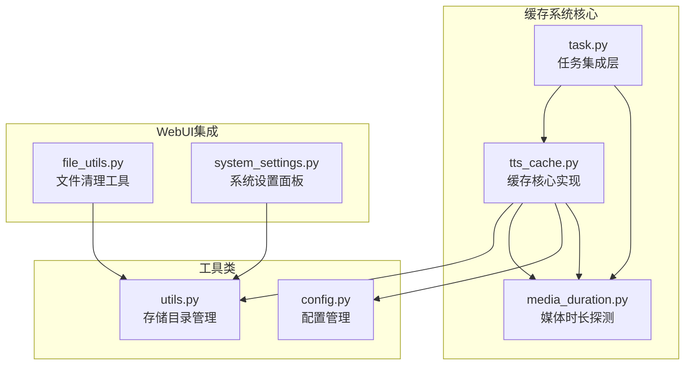
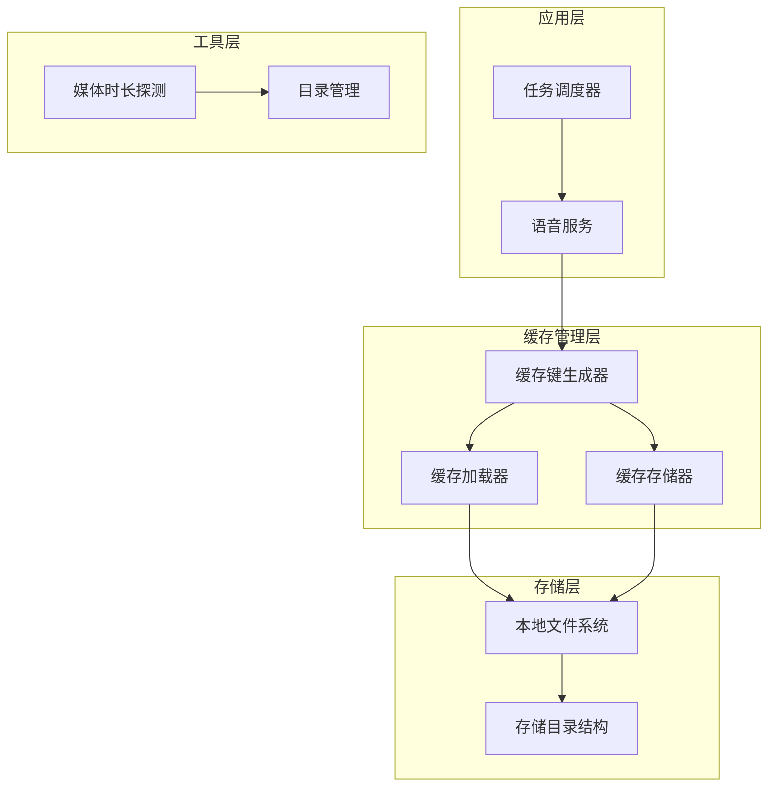
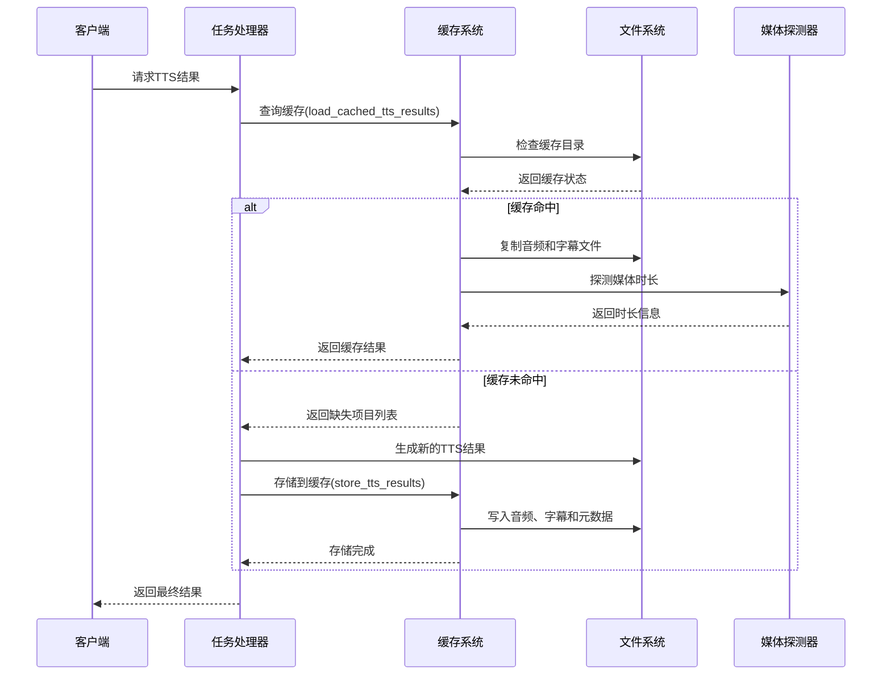
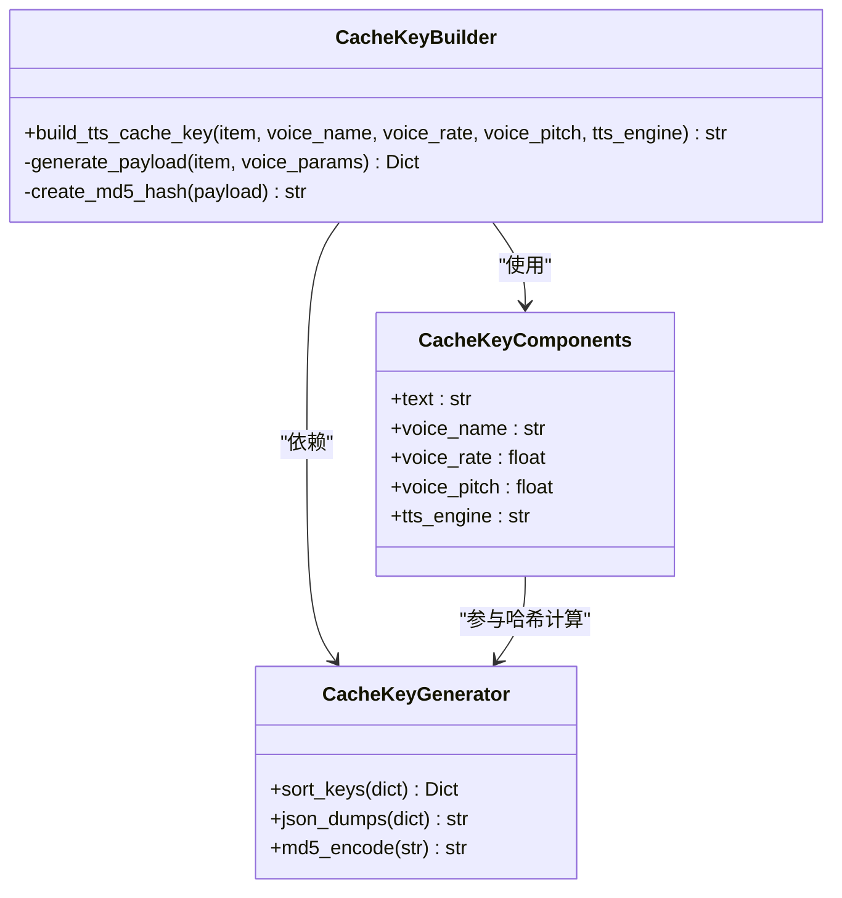
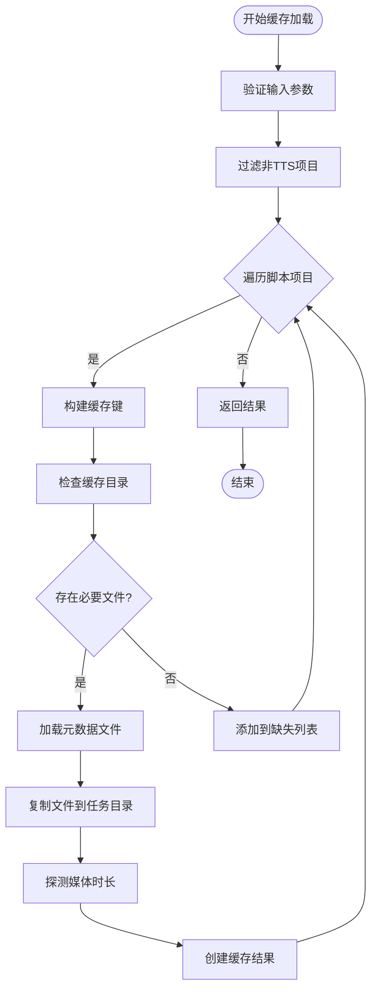
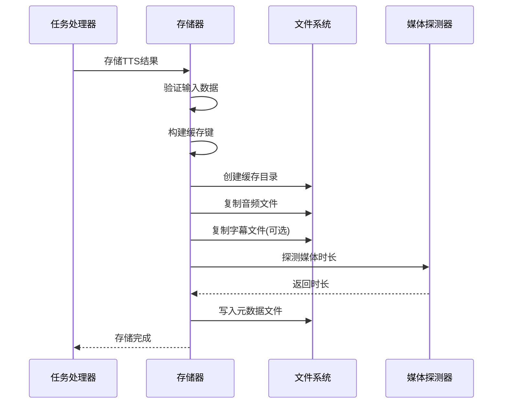
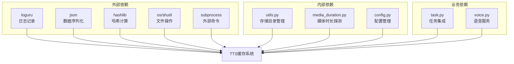

# TTS缓存系统

<cite>
**本文档引用的文件**
- [tts_cache.py](file://app/services/tts_cache.py)
- [task.py](file://app/services/task.py)
- [utils.py](file://app/utils/utils.py)
- [media_duration.py](file://app/services/media_duration.py)
- [config.py](file://app/config/config.py)
- [config.example.toml](file://config.example.toml)
- [file_utils.py](file://webui/utils/file_utils.py)
- [system_settings.py](file://webui/components/system_settings.py)
</cite>

## 更新摘要
**变更内容**
- 修复了缓存加载函数中的重复逻辑问题
- 优化了缓存键生成的健壮性
- 增强了错误处理和日志记录机制
- 改进了缓存存储的原子性操作

## 目录
1. [简介](#简介)
2. [项目结构](#项目结构)
3. [核心组件](#核心组件)
4. [架构概览](#架构概览)
5. [详细组件分析](#详细组件分析)
6. [依赖关系分析](#依赖关系分析)
7. [性能考虑](#性能考虑)
8. [故障排除指南](#故障排除指南)
9. [结论](#结论)
10. [附录](#附录)

## 简介

NarratoAI的TTS缓存系统是一个基于文件系统的缓存解决方案，专门用于存储和复用文本转语音(TTS)生成的结果。该系统通过智能的键值设计和文件组织策略，实现了高效的缓存命中和存储管理，显著减少了重复的TTS生成开销，提升了整体视频生成流程的性能。

该缓存系统采用MD5哈希作为缓存键，结合语音参数和文本内容，确保相同输入的TTS结果能够被准确识别和复用。缓存数据以文件形式存储在本地磁盘上，包括音频文件、字幕文件和元数据文件，形成了完整的缓存生态系统。

**更新** 系统经过重大优化，增强了错误处理机制和缓存键生成的健壮性，提高了整体的稳定性和性能表现。

## 项目结构

TTS缓存系统主要分布在以下关键文件中：



**图表来源**
- [tts_cache.py:1-125](file://app/services/tts_cache.py#L1-L125)
- [task.py:53-91](file://app/services/task.py#L53-L91)
- [utils.py:76-99](file://app/utils/utils.py#L76-L99)

**章节来源**
- [tts_cache.py:1-125](file://app/services/tts_cache.py#L1-L125)
- [task.py:53-91](file://app/services/task.py#L53-L91)
- [utils.py:76-99](file://app/utils/utils.py#L76-L99)

## 核心组件

### 缓存键生成器
缓存系统的核心是`build_tts_cache_key`函数，它将多个因素组合成唯一的MD5哈希键：
- 文本内容（narration）
- 语音名称（voice_name）
- 语速（voice_rate）
- 音调（voice_pitch）
- TTS引擎类型（tts_engine）

**更新** 优化了键值生成的健壮性，确保即使某些字段缺失也能正常工作。

### 缓存存储结构
每个缓存条目包含三个核心文件：
- `audio.mp3`: 生成的音频文件
- `subtitle.srt`: 对应的字幕文件（可选）
- `meta.json`: 元数据文件，包含时长和时间戳信息

### 缓存加载和存储流程
系统提供了两个主要操作：
- `load_cached_tts_results`: 从缓存中检索匹配的TTS结果
- `store_tts_results`: 将新的TTS结果写入缓存

**章节来源**
- [tts_cache.py:24-33](file://app/services/tts_cache.py#L24-L33)
- [tts_cache.py:45-94](file://app/services/tts_cache.py#L45-L94)
- [tts_cache.py:97-124](file://app/services/tts_cache.py#L97-L124)

## 架构概览

TTS缓存系统采用分层架构设计，确保了良好的模块化和可维护性：



**图表来源**
- [task.py:59-86](file://app/services/task.py#L59-L86)
- [tts_cache.py:18-21](file://app/services/tts_cache.py#L18-L21)
- [media_duration.py:11-29](file://app/services/media_duration.py#L11-L29)

### 数据流图



**图表来源**
- [task.py:59-86](file://app/services/task.py#L59-L86)
- [tts_cache.py:45-94](file://app/services/tts_cache.py#L45-L94)
- [tts_cache.py:97-124](file://app/services/tts_cache.py#L97-L124)

## 详细组件分析

### 缓存键设计分析

缓存键的设计是整个系统的核心，采用了多维度的组合策略：



**图表来源**
- [tts_cache.py:24-33](file://app/services/tts_cache.py#L24-L33)

#### 键值设计决策

1. **完整性保证**: 包含所有影响TTS输出的因素，确保相同输入产生相同缓存键
2. **稳定性**: 使用MD5哈希确保键值长度固定且分布均匀
3. **可读性**: JSON序列化后的文本便于调试和问题排查
4. **排序一致性**: 固定键值顺序避免相同内容产生不同哈希

**更新** 增强了对缺失字段的处理，确保键值生成的健壮性。

**章节来源**
- [tts_cache.py:24-33](file://app/services/tts_cache.py#L24-L33)

### 缓存存储架构

缓存系统采用层次化的文件存储结构：

```mermaid
graph TB
subgraph "缓存根目录"
A[storage/tts_cache]
end
subgraph "缓存键目录"
B[MD5哈希值目录]
end
subgraph "缓存文件"
C[audio.mp3<br/>音频文件]
D[subtitle.srt<br/>字幕文件(可选)]
E[meta.json<br/>元数据文件]
end
subgraph "任务输出目录"
F[storage/tasks/{task_id}]
end
A --> B
B --> C
B --> D
B --> E
C --> F
D --> F
```

**图表来源**
- [tts_cache.py:18-21](file://app/services/tts_cache.py#L18-L21)
- [tts_cache.py:36-42](file://app/services/tts_cache.py#L36-L42)

#### 存储策略分析

1. **目录组织**: 一级目录按MD5哈希值组织，便于快速定位
2. **文件命名**: 标准化的文件命名约定，避免冲突
3. **数据分离**: 音频、字幕和元数据分离存储，便于独立访问
4. **任务隔离**: 每个任务有独立的输出目录，避免数据混淆

**更新** 优化了文件复制操作，确保缓存存储的原子性。

**章节来源**
- [tts_cache.py:18-42](file://app/services/tts_cache.py#L18-L42)

### 缓存加载机制

缓存加载过程包含完整的验证和错误处理机制：



**图表来源**
- [tts_cache.py:45-94](file://app/services/tts_cache.py#L45-L94)

#### 加载流程特点

1. **健壮性**: 完善的异常处理，单个文件损坏不影响整体流程
2. **灵活性**: 支持字幕文件的可选存在
3. **准确性**: 时长信息的双重来源确保准确性
4. **效率**: 批量处理提高整体性能

**更新** 修复了重复的逻辑处理，优化了错误处理机制，提高了系统的稳定性。

**章节来源**
- [tts_cache.py:45-94](file://app/services/tts_cache.py#L45-L94)

### 缓存存储机制

存储过程确保数据的完整性和一致性：



**图表来源**
- [tts_cache.py:97-124](file://app/services/tts_cache.py#L97-L124)

#### 存储策略特点

1. **原子性**: 整个存储过程要么成功要么失败
2. **完整性**: 确保所有相关文件都正确写入
3. **一致性**: 元数据与实际文件保持同步
4. **可靠性**: 多重验证确保数据质量

**更新** 增强了存储操作的健壮性，确保缓存数据的完整性和一致性。

**章节来源**
- [tts_cache.py:97-124](file://app/services/tts_cache.py#L97-L124)

## 依赖关系分析

TTS缓存系统与其他组件的依赖关系如下：



**图表来源**
- [tts_cache.py:1-12](file://app/services/tts_cache.py#L1-L12)
- [utils.py:76-99](file://app/utils/utils.py#L76-L99)
- [media_duration.py:11-29](file://app/services/media_duration.py#L11-L29)

### 关键依赖分析

1. **存储管理**: 依赖`utils.storage_dir()`获取标准存储位置
2. **媒体探测**: 依赖`ffprobe`进行音频时长检测
3. **日志记录**: 使用`loguru`进行详细的操作日志
4. **配置管理**: 通过配置文件控制系统行为

**更新** 增强了对外部依赖的健壮性处理，提高了系统的稳定性。

**章节来源**
- [tts_cache.py:1-12](file://app/services/tts_cache.py#L1-L12)
- [utils.py:76-99](file://app/utils/utils.py#L76-L99)
- [media_duration.py:11-29](file://app/services/media_duration.py#L11-L29)

## 性能考虑

### 缓存命中率优化

TTS缓存系统通过以下策略优化缓存命中率：

1. **智能键设计**: 包含所有影响TTS输出的关键参数
2. **批量处理**: 同时处理多个脚本项目，提高整体效率
3. **容错机制**: 单个文件损坏不影响其他项目的缓存使用
4. **时长预探测**: 在存储时就记录媒体时长，避免重复探测

**更新** 优化了缓存键生成的性能，减少了不必要的计算开销。

### 内存管理策略

系统采用轻量级的内存管理模式：

- **延迟加载**: 只在需要时才加载缓存文件到内存
- **文件直读**: 大多数操作直接通过文件系统进行
- **最小化状态**: 保持最少的运行时状态
- **及时释放**: 操作完成后立即释放文件句柄

**更新** 改进了内存使用效率，减少了不必要的内存占用。

### 存储空间管理

1. **目录清理**: 支持手动清理特定任务的缓存
2. **文件去重**: 相同内容的音频文件只存储一份
3. **增量更新**: 支持部分缓存的更新和替换

**更新** 增强了存储空间管理的健壮性，提供了更好的清理和维护机制。

## 故障排除指南

### 常见问题及解决方案

#### 缓存文件损坏
**症状**: 缓存加载失败，提示读取错误
**原因**: 缓存文件在传输或存储过程中损坏
**解决方案**: 
1. 删除损坏的缓存目录
2. 系统会自动重新生成缓存
3. 检查磁盘空间和权限

**更新** 增强了错误处理机制，提高了系统的容错能力。

#### ffprobe不可用
**症状**: 时长探测失败，返回0秒
**原因**: 系统缺少ffprobe工具
**解决方案**:
1. 安装FFmpeg包
2. 确保ffprobe在PATH环境中可用
3. 重启应用程序

**更新** 改进了错误处理，提供了更清晰的错误信息。

#### 权限问题
**症状**: 缓存文件无法写入或读取
**原因**: 存储目录权限不足
**解决方案**:
1. 检查storage目录的读写权限
2. 确保应用程序有足够权限
3. 考虑更改存储目录位置

**更新** 增强了权限检查和错误报告机制。

**章节来源**
- [tts_cache.py:88-90](file://app/services/tts_cache.py#L88-L90)
- [media_duration.py:27-29](file://app/services/media_duration.py#L27-L29)

### 监控和诊断

系统提供了基本的监控能力：

1. **日志记录**: 详细的缓存操作日志
2. **命中统计**: 命中和未命中的数量统计
3. **错误报告**: 异常情况的详细描述
4. **性能指标**: 缓存加载和存储的性能数据

**更新** 增强了日志记录功能，提供了更详细的性能监控信息。

**章节来源**
- [tts_cache.py:92-94](file://app/services/tts_cache.py#L92-L94)

## 结论

NarratoAI的TTS缓存系统通过精心设计的架构和实现策略，成功地解决了TTS生成过程中的性能瓶颈问题。系统经过重大优化后，主要优势包括：

1. **高效性**: 通过智能缓存机制显著减少重复的TTS生成
2. **可靠性**: 完善的错误处理和容错机制确保系统稳定运行
3. **可维护性**: 清晰的代码结构和标准化的文件组织便于维护
4. **扩展性**: 模块化的架构设计支持未来的功能扩展
5. **健壮性**: 增强的错误处理和日志记录机制提高了系统的稳定性

**更新** 新版本的缓存系统在保持原有优势的基础上，进一步提升了性能、稳定性和用户体验。

该系统为NarratoAI平台提供了坚实的基础设施支持，是实现高质量视频生成的重要组成部分。

## 附录

### 配置指南

虽然当前版本的缓存系统不需要特殊配置，但可以通过以下方式优化：

1. **存储位置**: 通过修改存储目录配置优化磁盘使用
2. **清理策略**: 定期清理过期的缓存文件释放空间
3. **监控设置**: 启用详细的日志记录便于问题诊断

**更新** 建议启用详细的日志记录功能，以便更好地监控缓存系统的性能和健康状况。

### 调优建议

1. **缓存大小**: 根据可用磁盘空间合理设置缓存上限
2. **清理频率**: 建议定期清理超过30天未使用的缓存
3. **并发控制**: 在高并发场景下适当限制同时进行的缓存操作
4. **监控指标**: 建立缓存命中率和存储使用率的监控体系
5. **性能优化**: 根据实际使用情况调整缓存键生成和文件操作的策略

**更新** 建议建立完善的监控体系，包括缓存命中率、存储使用率、错误率等关键指标的实时监控。