# TTS语音服务

<cite>
**本文档引用的文件**
- [voice.py](file://app/services/voice.py)
- [audio_config.py](file://app/config/audio_config.py)
- [audio_settings.py](file://webui/components/audio_settings.py)
- [tts_cache.py](file://app/services/tts_cache.py)
- [audio_normalizer.py](file://app/services/audio_normalizer.py)
- [ffmpeg_utils.py](file://app/utils/ffmpeg_utils.py)
- [ffmpeg_config.py](file://app/config/ffmpeg_config.py)
- [clip_video.py](file://app/services/clip_video.py)
</cite>

## 目录
1. [简介](#简介)
2. [项目结构](#项目结构)
3. [核心组件](#核心组件)
4. [架构概览](#架构概览)
5. [详细组件分析](#详细组件分析)
6. [依赖关系分析](#依赖关系分析)
7. [性能考虑](#性能考虑)
8. [故障排除指南](#故障排除指南)
9. [结论](#结论)
10. [附录](#附录)

## 简介

NarratoAI的TTS语音服务是一个统一的文本转语音解决方案，集成了多家TTS提供商的服务，包括Azure Speech Services、腾讯云TTS、通义千问Qwen3 TTS、Edge TTS以及IndexTTS2语音克隆。该系统提供了灵活的语音参数配置、实时处理机制和高质量的音频输出。

该服务的核心目标是为用户提供统一的API接口，支持多种TTS引擎的选择和切换，同时提供个性化的语音参数调整功能，包括语速、音调、音量等配置选项。

## 项目结构

TTS语音服务主要分布在以下目录结构中：

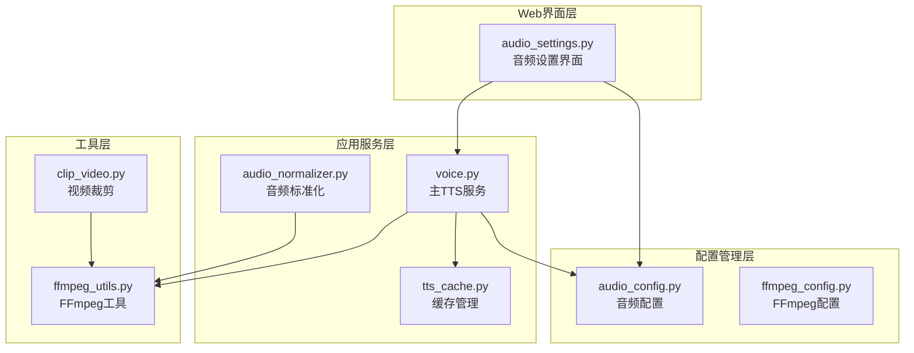

**图表来源**
- [voice.py:1-50](file://app/services/voice.py#L1-L50)
- [audio_config.py:1-50](file://app/config/audio_config.py#L1-L50)
- [audio_settings.py:1-50](file://webui/components/audio_settings.py#L1-L50)

**章节来源**
- [voice.py:1-100](file://app/services/voice.py#L1-L100)
- [audio_config.py:1-100](file://app/config/audio_config.py#L1-L100)
- [audio_settings.py:1-100](file://webui/components/audio_settings.py#L1-L100)

## 核心组件

### 统一TTS接口设计

系统采用统一的TTS接口设计，所有TTS引擎都遵循相同的调用模式：

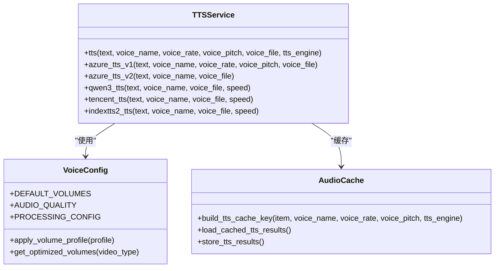

**图表来源**
- [voice.py:1119-1154](file://app/services/voice.py#L1119-L1154)
- [audio_config.py:16-47](file://app/config/audio_config.py#L16-L47)
- [tts_cache.py:24-94](file://app/services/tts_cache.py#L24-L94)

### 语音参数配置系统

系统提供了完整的语音参数配置体系，支持以下参数：

| 参数类型 | 范围 | 默认值 | 描述 |
|---------|------|--------|------|
| 语速 (Rate) | 0.5 - 2.0 | 1.0 | 控制语音播放速度 |
| 音调 (Pitch) | -50% - +50% | 0% | 调整语音音高 |
| 音量 (Volume) | 0 - 100 | 80 | 控制语音音量级别 |
| 采样率 | 44100 Hz | 44100 Hz | 音频采样频率 |
| 声道数 | 2 | 2 | 立体声配置 |

**章节来源**
- [audio_config.py:19-47](file://app/config/audio_config.py#L19-L47)
- [audio_settings.py:219-255](file://webui/components/audio_settings.py#L219-L255)

## 架构概览

TTS语音服务采用分层架构设计，确保了良好的可扩展性和维护性：

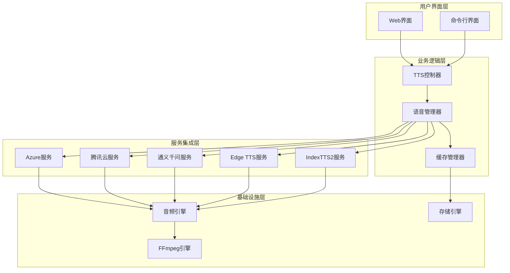

**图表来源**
- [voice.py:1119-1154](file://app/services/voice.py#L1119-L1154)
- [audio_settings.py:22-66](file://webui/components/audio_settings.py#L22-L66)

## 详细组件分析

### Azure Speech Services集成

Azure Speech Services提供了两种不同的API版本支持：

#### Azure V1 (Edge TTS) 实现

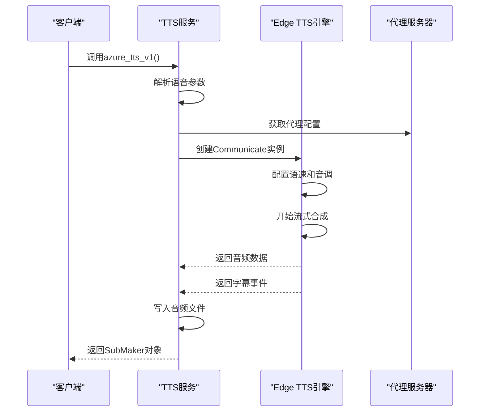

**图表来源**
- [voice.py:1186-1245](file://app/services/voice.py#L1186-L1245)

#### Azure V2 (官方SDK) 实现

Azure V2版本使用官方Microsoft Cognitive Services SDK：

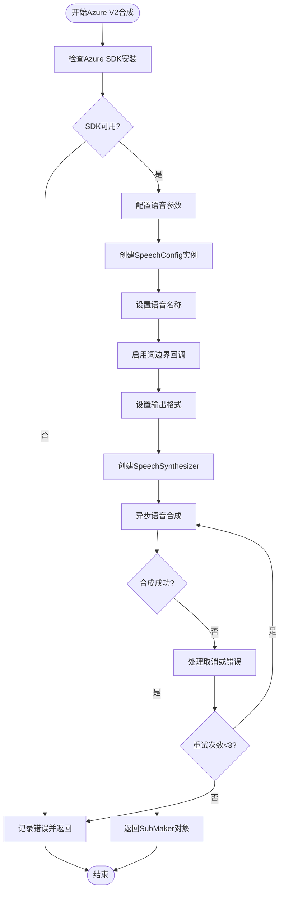

**图表来源**
- [voice.py:1248-1339](file://app/services/voice.py#L1248-L1339)

**章节来源**
- [voice.py:1186-1339](file://app/services/voice.py#L1186-L1339)

### 腾讯云TTS集成

腾讯云TTS提供了中文语音合成的高质量服务：

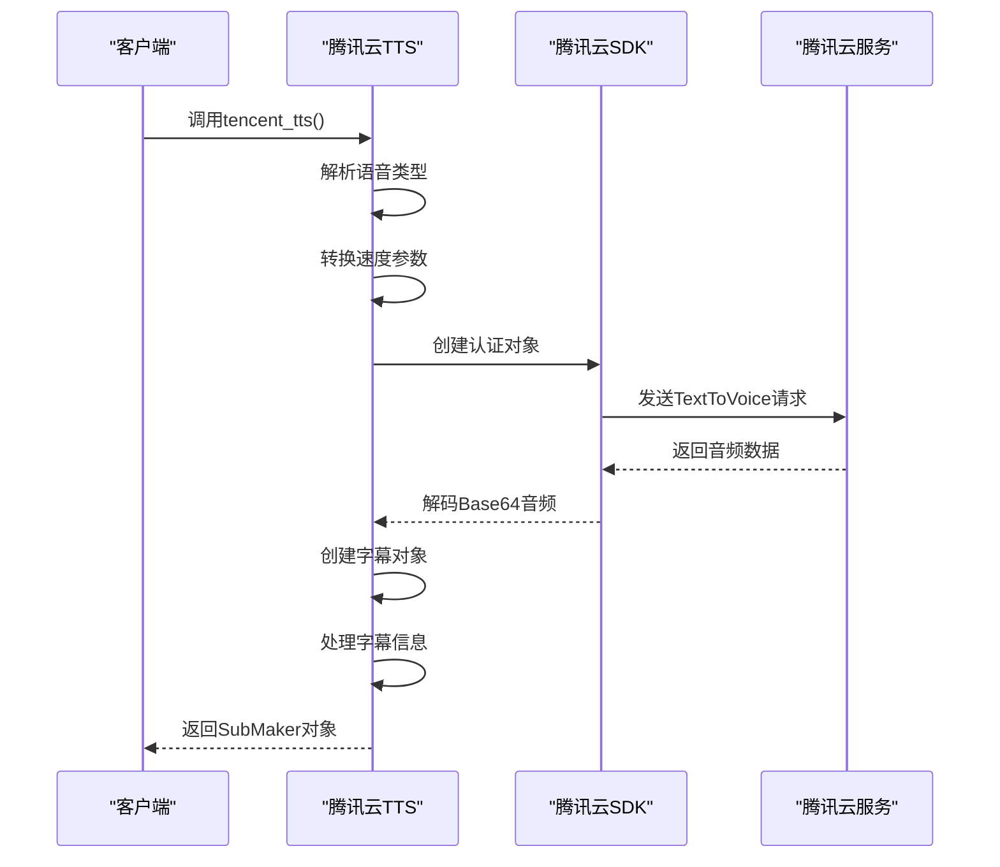

**图表来源**
- [voice.py:1796-1896](file://app/services/voice.py#L1796-L1896)

**章节来源**
- [voice.py:1796-1896](file://app/services/voice.py#L1796-L1896)

### 通义千问Qwen3 TTS集成

Qwen3 TTS提供了高质量的中文语音合成能力：

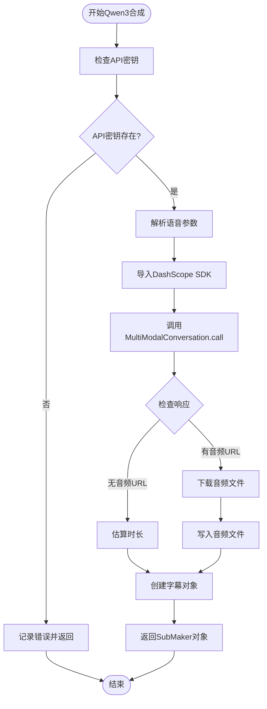

**图表来源**
- [voice.py:1700-1793](file://app/services/voice.py#L1700-L1793)

**章节来源**
- [voice.py:1700-1793](file://app/services/voice.py#L1700-L1793)

### IndexTTS2语音克隆

IndexTTS2提供了零样本语音克隆功能：

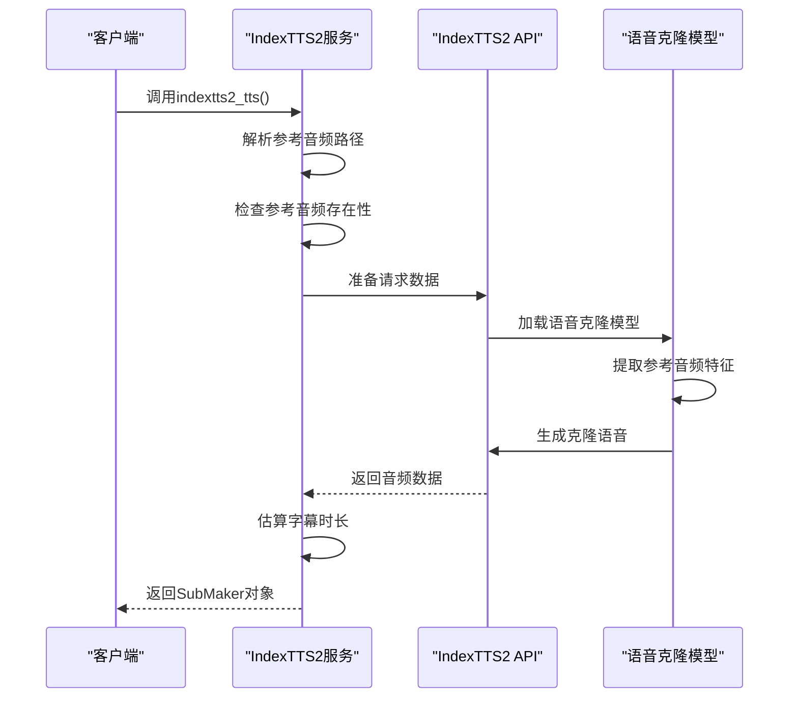

**图表来源**
- [voice.py:2022-2131](file://app/services/voice.py#L2022-L2131)

**章节来源**
- [voice.py:2022-2131](file://app/services/voice.py#L2022-L2131)

### 语音缓存系统

系统实现了智能的TTS缓存机制，避免重复生成相同的语音：

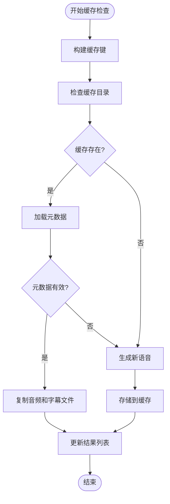

**图表来源**
- [tts_cache.py:45-94](file://app/services/tts_cache.py#L45-L94)

**章节来源**
- [tts_cache.py:18-125](file://app/services/tts_cache.py#L18-L125)

## 依赖关系分析

TTS语音服务的依赖关系呈现清晰的分层结构：

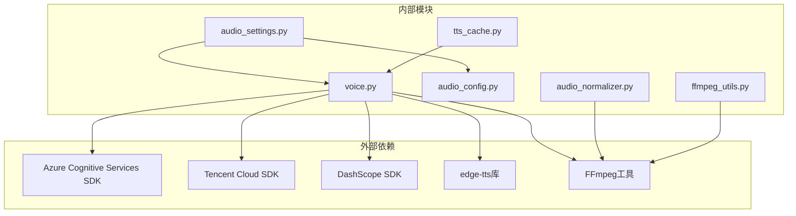

**图表来源**
- [voice.py:1-50](file://app/services/voice.py#L1-L50)
- [audio_settings.py:1-10](file://webui/components/audio_settings.py#L1-L10)

**章节来源**
- [voice.py:1-30](file://app/services/voice.py#L1-L30)
- [audio_settings.py:1-15](file://webui/components/audio_settings.py#L1-L15)

## 性能考虑

### 实时处理机制

系统采用了多种技术来确保实时语音合成的性能：

1. **流式合成**: Azure V1版本使用async/await模式进行流式音频合成
2. **并发控制**: 每个TTS引擎都有内置的重试机制和超时控制
3. **内存管理**: 使用生成器模式处理大型音频数据流
4. **缓存优化**: 智能缓存系统避免重复计算

### 缓冲区管理

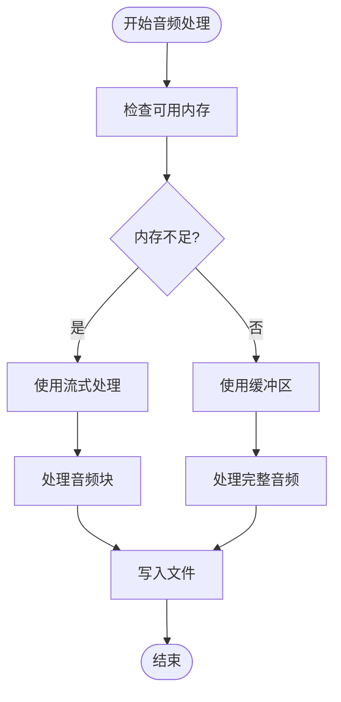

### 性能优化策略

1. **硬件加速检测**: 自动检测并使用GPU硬件加速
2. **智能降级**: 当硬件加速不可用时自动切换到软件编码
3. **参数优化**: 根据内容类型自动调整音频参数
4. **并发处理**: 支持多任务并发处理

**章节来源**
- [voice.py:1193-1245](file://app/services/voice.py#L1193-L1245)
- [ffmpeg_utils.py:252-355](file://app/utils/ffmpeg_utils.py#L252-L355)

## 故障排除指南

### 常见问题及解决方案

| 问题类型 | 症状 | 解决方案 |
|---------|------|----------|
| API密钥错误 | 认证失败 | 检查并重新配置API密钥 |
| 网络连接问题 | 超时或连接失败 | 检查网络连接和代理设置 |
| 语音参数无效 | 生成失败 | 验证语音参数范围和格式 |
| 缓存问题 | 缓存失效 | 清理缓存目录并重启服务 |
| 音频质量差 | 合成音频质量不佳 | 调整音频参数或更换TTS引擎 |

### 错误处理策略

系统实现了多层次的错误处理机制：

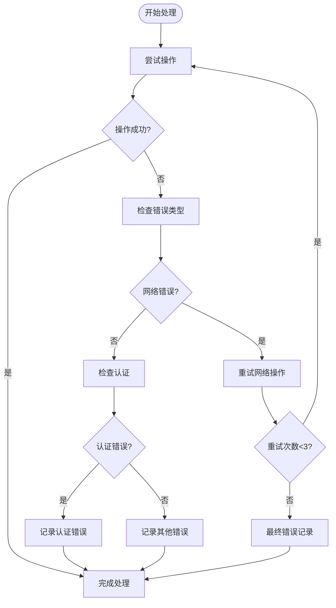

**图表来源**
- [voice.py:1281-1339](file://app/services/voice.py#L1281-L1339)

**章节来源**
- [voice.py:1281-1339](file://app/services/voice.py#L1281-L1339)

## 结论

NarratoAI的TTS语音服务提供了一个功能完整、性能优异的统一文本转语音解决方案。通过集成多家TTS提供商，系统不仅提供了丰富的语音选择，还通过智能缓存、硬件加速和参数优化等技术手段确保了高效的性能表现。

该系统的主要优势包括：

1. **统一接口**: 所有TTS引擎都遵循相同的调用模式
2. **灵活配置**: 支持详细的语音参数调整
3. **高性能**: 采用流式处理和硬件加速技术
4. **智能缓存**: 避免重复计算，提升整体性能
5. **错误处理**: 完善的错误处理和重试机制

未来可以考虑的功能增强包括：
- 支持更多TTS引擎
- 实现更精细的音频质量控制
- 增加批量处理功能
- 优化移动端性能

## 附录

### API使用示例

以下是一些基本的API使用示例：

**基础TTS调用**
```python
# 基础语音合成
result = tts(
    text="你好世界",
    voice_name="zh-CN-XiaoxiaoNeural",
    voice_rate=1.0,
    voice_pitch=1.0,
    voice_file="output.mp3",
    tts_engine="azure_speech"
)
```

**配置自定义参数**
```python
# 设置语音参数
config.ui["azure_rate"] = 1.2
config.ui["azure_pitch"] = 10
config.ui["azure_volume"] = 85
```

**缓存使用**
```python
# 使用缓存系统
cached_results, missing_items = load_cached_tts_results(
    task_id="task_123",
    list_script=script_segments,
    voice_name="zh-CN-XiaoxiaoNeural",
    voice_rate=1.0,
    voice_pitch=1.0,
    tts_engine="azure_speech"
)
```

### 最佳实践

1. **参数验证**: 始终验证语音参数的有效性
2. **错误处理**: 实现完善的错误处理和重试机制
3. **资源管理**: 及时清理临时文件和释放资源
4. **性能监控**: 监控TTS合成的性能指标
5. **缓存策略**: 合理使用缓存系统提升性能