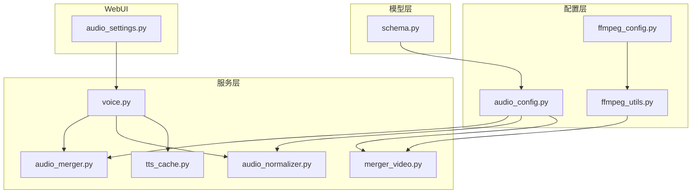
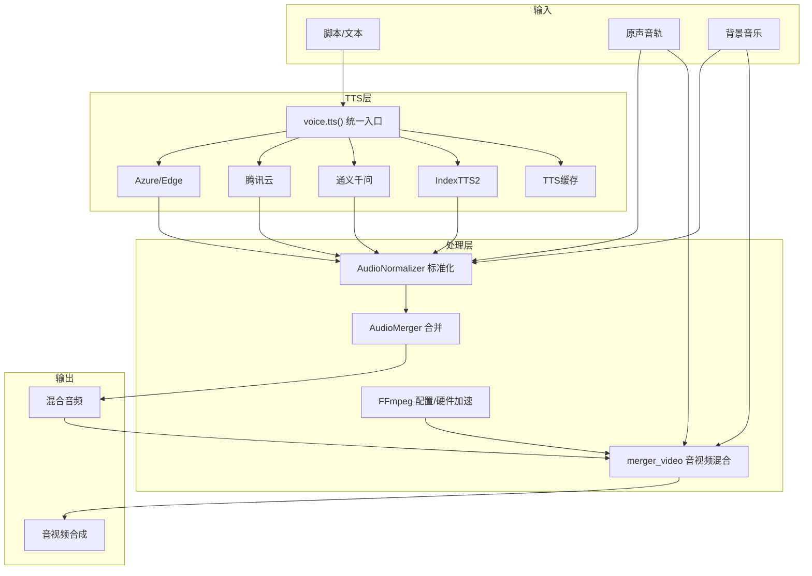
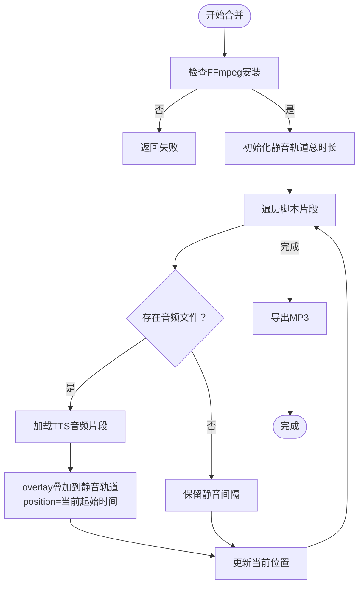
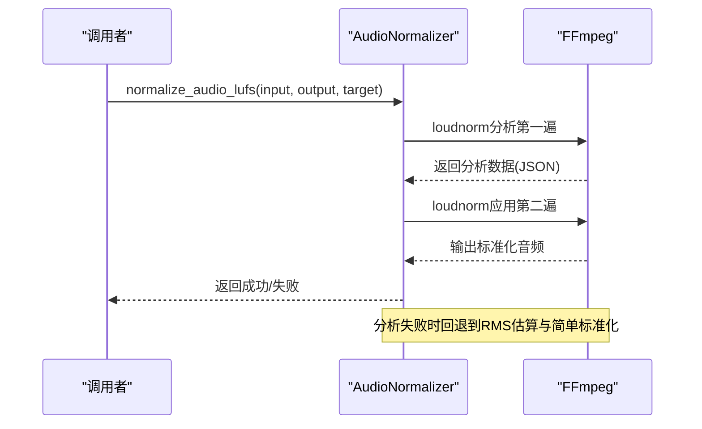
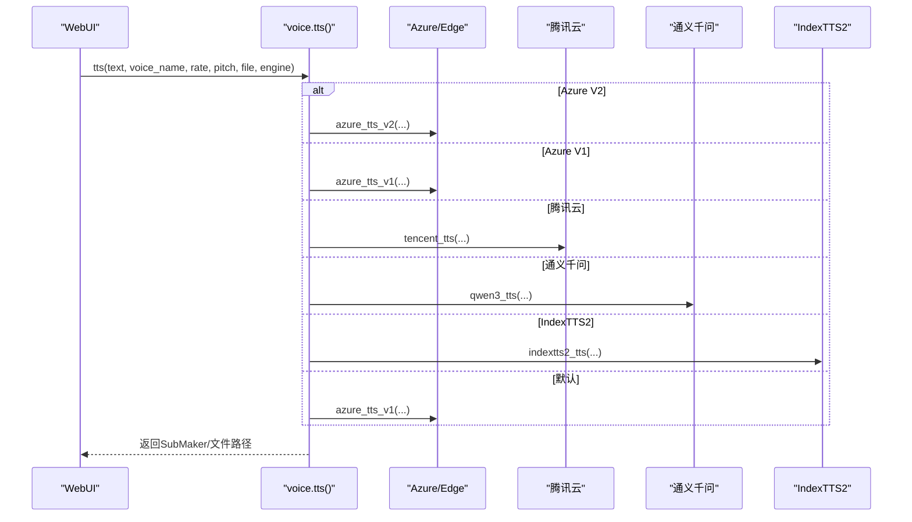
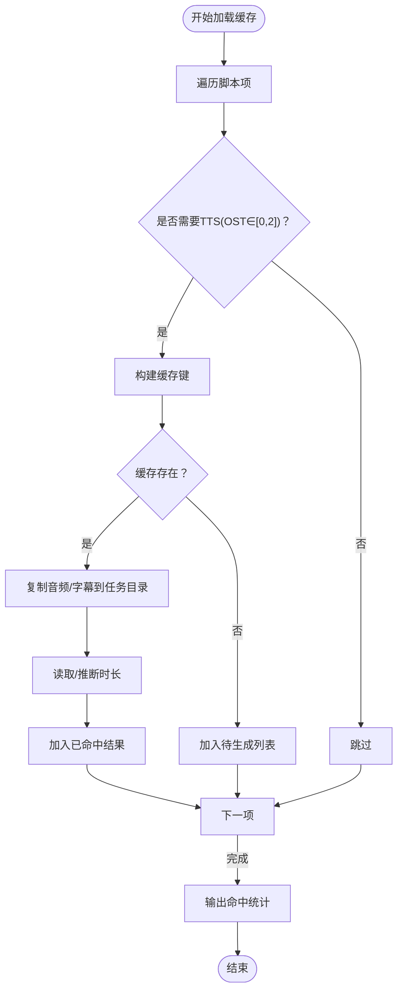
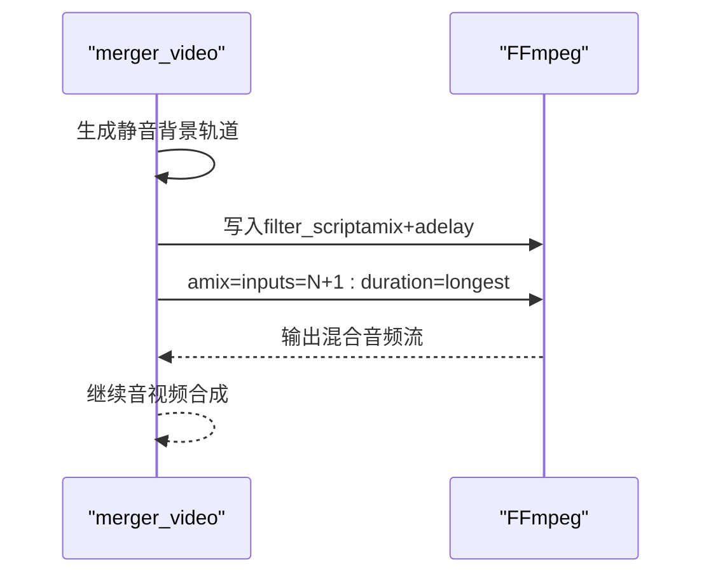
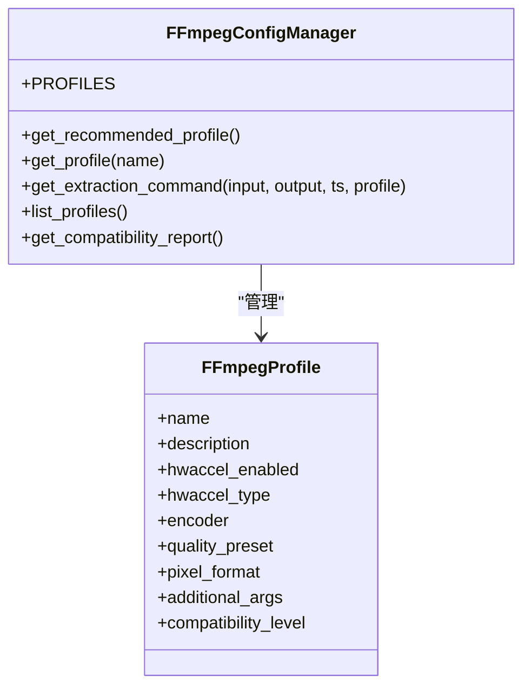
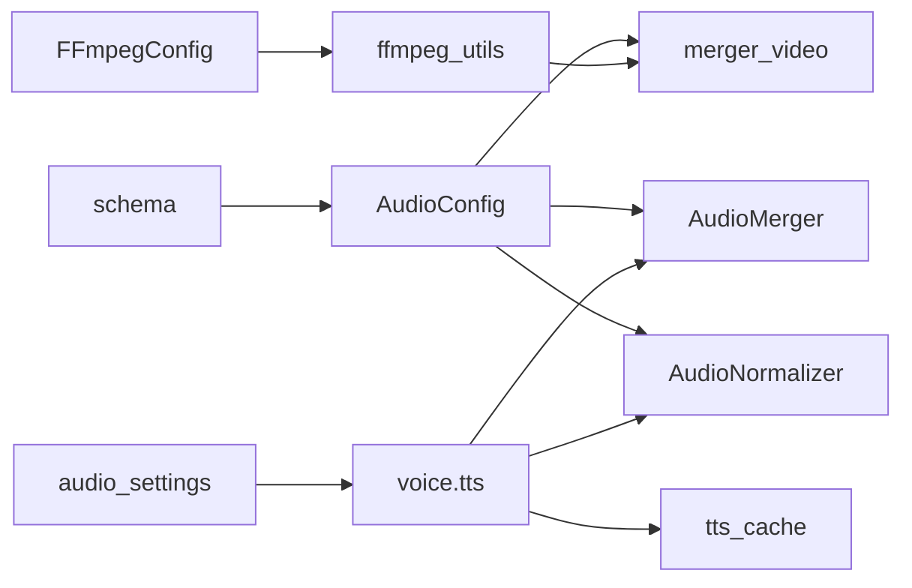

# 音频处理系统

<cite>
**本文引用的文件**
- [audio_merger.py](file://app/services/audio_merger.py)
- [audio_normalizer.py](file://app/services/audio_normalizer.py)
- [tts_cache.py](file://app/services/tts_cache.py)
- [audio_config.py](file://app/config/audio_config.py)
- [ffmpeg_config.py](file://app/config/ffmpeg_config.py)
- [ffmpeg_utils.py](file://app/utils/ffmpeg_utils.py)
- [voice.py](file://app/services/voice.py)
- [audio_settings.py](file://webui/components/audio_settings.py)
- [merger_video.py](file://app/services/merger_video.py)
- [schema.py](file://app/models/schema.py)
</cite>

## 目录
1. [简介](#简介)
2. [项目结构](#项目结构)
3. [核心组件](#核心组件)
4. [架构总览](#架构总览)
5. [详细组件分析](#详细组件分析)
6. [依赖关系分析](#依赖关系分析)
7. [性能考虑](#性能考虑)
8. [故障排查指南](#故障排查指南)
9. [结论](#结论)
10. [附录](#附录)

## 简介
本文件面向NarratoAI的音频处理系统，围绕以下目标展开：  
- 音频混合器工作原理：多音轨合成、音量平衡、音频格式转换  
- 音频标准化机制：响度归一化、动态范围压缩、噪声抑制  
- TTS引擎集成：统一接口支持Azure、腾讯云、通义千问等多家提供商  
- TTS缓存系统：缓存策略、存储管理、命中率优化  
- 实时性与质量保障：延迟控制、音质保持、错误恢复  
- 最佳实践：文件格式选择、质量参数调优、性能优化建议  

## 项目结构
音频处理相关模块主要分布在以下位置：
- 服务层：音频混合、标准化、TTS缓存、语音合成、视频混合
- 配置层：音频配置、FFmpeg配置
- 工具层：FFmpeg硬件加速检测与参数推导
- WebUI：TTS引擎与参数配置界面
- 模型层：音量默认值与参数模型

**图表来源**
- [audio_merger.py](file://app/services/audio_merger.py)
- [audio_normalizer.py](file://app/services/audio_normalizer.py)
- [tts_cache.py](file://app/services/tts_cache.py)
- [audio_config.py](file://app/config/audio_config.py)
- [ffmpeg_config.py](file://app/config/ffmpeg_config.py)
- [ffmpeg_utils.py](file://app/utils/ffmpeg_utils.py)
- [voice.py](file://app/services/voice.py)
- [merger_video.py](file://app/services/merger_video.py)
- [audio_settings.py](file://webui/components/audio_settings.py)
- [schema.py](file://app/models/schema.py)

**章节来源**
- [audio_merger.py:1-172](file://app/services/audio_merger.py#L1-L172)
- [audio_normalizer.py:1-315](file://app/services/audio_normalizer.py#L1-L315)
- [tts_cache.py:1-125](file://app/services/tts_cache.py#L1-L125)
- [audio_config.py:1-221](file://app/config/audio_config.py#L1-L221)
- [ffmpeg_config.py:1-285](file://app/config/ffmpeg_config.py#L1-L285)
- [ffmpeg_utils.py:1-800](file://app/utils/ffmpeg_utils.py#L1-L800)
- [voice.py:1-800](file://app/services/voice.py#L1-L800)
- [merger_video.py:561-586](file://app/services/merger_video.py#L561-L586)
- [audio_settings.py:1-800](file://webui/components/audio_settings.py#L1-L800)
- [schema.py:1-209](file://app/models/schema.py#L1-L209)

## 核心组件
- 音频混合器：基于多音轨叠加与时间对齐，支持静音轨道与交叉淡化
- 音频标准化：基于FFmpeg loudnorm滤镜的响度归一化，辅以RMS估算与简单标准化
- TTS引擎统一接口：支持Edge TTS、Azure Speech、腾讯云、通义千问、IndexTTS2等
- TTS缓存：以文本+语音参数为键，持久化音频与字幕，提升命中率
- FFmpeg配置与硬件加速：按平台与GPU自动选择最优编码器与参数
- WebUI音频设置：可视化配置TTS引擎、音色、语速、音调等

**章节来源**
- [audio_merger.py:21-76](file://app/services/audio_merger.py#L21-L76)
- [audio_normalizer.py:22-302](file://app/services/audio_normalizer.py#L22-L302)
- [tts_cache.py:45-125](file://app/services/tts_cache.py#L45-L125)
- [voice.py:1119-1154](file://app/services/voice.py#L1119-L1154)
- [ffmpeg_config.py:27-158](file://app/config/ffmpeg_config.py#L27-L158)
- [ffmpeg_utils.py:252-356](file://app/utils/ffmpeg_utils.py#L252-L356)
- [audio_settings.py:22-150](file://webui/components/audio_settings.py#L22-L150)

## 架构总览
系统采用“配置驱动 + 统一接口 + 缓存 + 标准化”的架构，结合FFmpeg实现高质量、跨平台的音频处理。

**图表来源**
- [voice.py:1119-1154](file://app/services/voice.py#L1119-L1154)
- [tts_cache.py:45-125](file://app/services/tts_cache.py#L45-L125)
- [audio_normalizer.py:22-302](file://app/services/audio_normalizer.py#L22-L302)
- [audio_merger.py:21-76](file://app/services/audio_merger.py#L21-L76)
- [merger_video.py:561-586](file://app/services/merger_video.py#L561-L586)
- [ffmpeg_config.py:27-158](file://app/config/ffmpeg_config.py#L27-L158)

## 详细组件分析

### 音频混合器（多音轨合成、音量平衡、格式转换）
- 多音轨合成：以总时长为基准，按脚本中每段的duration进行时间对齐叠加；若某段无音频则保留静音间隔
- 音量平衡：通过统一采样率与声道数（44100Hz、立体声），配合音量系数（来自配置或智能分析）进行平衡
- 格式转换：导出为MP3，便于跨平台播放与压缩

**图表来源**
- [audio_merger.py:21-76](file://app/services/audio_merger.py#L21-L76)

**章节来源**
- [audio_merger.py:21-76](file://app/services/audio_merger.py#L21-L76)

### 音频标准化（响度归一化、动态范围压缩、噪声抑制）
- 响度分析：优先使用FFmpeg loudnorm滤镜分析LUFS；失败时回退到RMS估算
- 响度归一化：两遍处理（分析+应用），输出统一采样率与声道数
- 动态范围压缩：配置项预留，当前默认关闭
- 噪声抑制：未在代码中直接实现，可通过外部滤镜链扩展

**图表来源**
- [audio_normalizer.py:122-205](file://app/services/audio_normalizer.py#L122-L205)

**章节来源**
- [audio_normalizer.py:22-302](file://app/services/audio_normalizer.py#L22-L302)

### TTS引擎统一接口（Azure、腾讯云、通义千问等）
- 统一入口：根据引擎类型分发至对应实现（Edge TTS、Azure V1/V2、腾讯云、通义千问、IndexTTS2）
- 语音参数：支持语速、音调（部分引擎不支持）、音色名称
- 音色识别：Azure V2通过名称后缀与格式判断；Edge TTS使用官方音色列表

**图表来源**
- [voice.py:1119-1154](file://app/services/voice.py#L1119-L1154)

**章节来源**
- [voice.py:1119-1154](file://app/services/voice.py#L1119-L1154)
- [audio_settings.py:22-150](file://webui/components/audio_settings.py#L22-L150)

### TTS缓存系统（策略、存储、命中率）
- 键生成：以文本、音色、语速、音调、引擎为维度生成MD5键
- 存储结构：每个键对应目录，包含音频、字幕与元信息（时长、时间戳）
- 命中流程：遍历脚本，命中则复制到任务目标路径；缺失项交由TTS生成
- 写入流程：将生成结果写入缓存目录，补充元信息

**图表来源**
- [tts_cache.py:45-94](file://app/services/tts_cache.py#L45-L94)
- [tts_cache.py:97-125](file://app/services/tts_cache.py#L97-L125)

**章节来源**
- [tts_cache.py:1-125](file://app/services/tts_cache.py#L1-L125)

### 音视频混合（延迟控制、音质保持、错误恢复）
- 音轨混合：使用amix滤镜混合多音频，补偿因amix导致的音量稀释
- 延迟控制：通过amix与adelay精确对齐各音轨起始时间
- 音质保持：统一采样率与声道数，避免混音失真
- 错误恢复：逐段处理，单段失败不影响其他片段

**图表来源**
- [merger_video.py:561-586](file://app/services/merger_video.py#L561-L586)

**章节来源**
- [merger_video.py:561-586](file://app/services/merger_video.py#L561-L586)

### FFmpeg配置与硬件加速（跨平台兼容）
- 配置文件：按平台与GPU厂商提供多套配置，自动选择最优编码器
- 硬件加速：检测GPU厂商与编码器可用性，构建硬件加速参数
- 兼容性：提供降级策略（软件编码），并给出优化建议

**图表来源**
- [ffmpeg_config.py:13-158](file://app/config/ffmpeg_config.py#L13-L158)

**章节来源**
- [ffmpeg_config.py:27-158](file://app/config/ffmpeg_config.py#L27-L158)
- [ffmpeg_utils.py:252-356](file://app/utils/ffmpeg_utils.py#L252-L356)

### WebUI音频设置（TTS引擎与参数）
- 引擎选择：Edge TTS、Azure Speech、腾讯云、通义千问、IndexTTS2
- 参数配置：音量、语速、音调（部分引擎不支持）
- 试听功能：一键合成试听音频并播放

**章节来源**
- [audio_settings.py:22-150](file://webui/components/audio_settings.py#L22-L150)
- [audio_settings.py:706-782](file://webui/components/audio_settings.py#L706-L782)

## 依赖关系分析
- 配置依赖：AudioConfig为音频处理提供默认音量、采样率、声道数、响度目标等参数
- 工具依赖：ffmpeg_utils提供硬件加速检测与参数推导，供merger_video与ffmpeg_config使用
- 服务依赖：voice.py依赖各TTS提供商SDK；audio_merger与audio_normalizer依赖FFmpeg；tts_cache依赖媒体时长探测

**图表来源**
- [audio_config.py:16-166](file://app/config/audio_config.py#L16-L166)
- [ffmpeg_utils.py:252-356](file://app/utils/ffmpeg_utils.py#L252-L356)
- [ffmpeg_config.py:27-158](file://app/config/ffmpeg_config.py#L27-L158)
- [voice.py:1119-1154](file://app/services/voice.py#L1119-L1154)
- [audio_merger.py:21-76](file://app/services/audio_merger.py#L21-L76)
- [audio_normalizer.py:22-302](file://app/services/audio_normalizer.py#L22-L302)
- [tts_cache.py:45-125](file://app/services/tts_cache.py#L45-L125)
- [audio_settings.py:22-150](file://webui/components/audio_settings.py#L22-L150)
- [schema.py:16-35](file://app/models/schema.py#L16-L35)

**章节来源**
- [audio_config.py:16-166](file://app/config/audio_config.py#L16-L166)
- [ffmpeg_utils.py:252-356](file://app/utils/ffmpeg_utils.py#L252-L356)
- [ffmpeg_config.py:27-158](file://app/config/ffmpeg_config.py#L27-L158)
- [voice.py:1119-1154](file://app/services/voice.py#L1119-L1154)
- [audio_merger.py:21-76](file://app/services/audio_merger.py#L21-L76)
- [audio_normalizer.py:22-302](file://app/services/audio_normalizer.py#L22-L302)
- [tts_cache.py:45-125](file://app/services/tts_cache.py#L45-L125)
- [audio_settings.py:22-150](file://webui/components/audio_settings.py#L22-L150)
- [schema.py:16-35](file://app/models/schema.py#L16-L35)

## 性能考虑
- FFmpeg硬件加速：按平台与GPU自动选择编码器，显著降低CPU占用与延迟
- 缓存命中：通过文本+语音参数组合键，减少重复TTS调用
- 混音优化：amix补偿与adelay对齐，避免多次重采样带来的性能损耗
- 音频标准化：统一采样率与声道数，减少下游处理成本
- 失败隔离：逐段处理，单段异常不影响整体流程

[本节为通用指导，无需具体文件引用]

## 故障排查指南
- FFmpeg未安装：检查系统PATH，确保ffmpeg命令可用
- 硬件加速不可用：查看兼容性报告，必要时切换到软件编码配置
- TTS合成失败：确认引擎配置（API Key、Region、音色名称）正确；检查网络连通性
- 缓存读取失败：清理损坏缓存目录，重新生成；检查元信息与媒体时长探测
- 混音失真：检查采样率与声道数是否统一；确认amix补偿系数

**章节来源**
- [audio_merger.py:12-18](file://app/services/audio_merger.py#L12-L18)
- [ffmpeg_utils.py:252-356](file://app/utils/ffmpeg_utils.py#L252-L356)
- [voice.py:1817-1820](file://app/services/voice.py#L1817-L1820)
- [tts_cache.py:88-94](file://app/services/tts_cache.py#L88-L94)
- [merger_video.py:561-586](file://app/services/merger_video.py#L561-L586)

## 结论
NarratoAI的音频处理系统通过统一的配置、接口与缓存机制，实现了跨平台、可扩展且高性能的音频处理能力。标准化与混合技术确保了音质与一致性，TTS缓存与硬件加速显著提升了效率与实时性。建议在生产环境中结合硬件加速与缓存策略，持续监控响度与延迟指标，以获得最佳用户体验。

[本节为总结性内容，无需具体文件引用]

## 附录

### 最佳实践
- 文件格式：优先使用MP3进行混合与导出，兼顾体积与兼容性
- 质量参数：统一采样率与声道数，避免重采样；响度目标建议在广播标准附近
- 性能优化：启用硬件加速；开启TTS缓存；合理设置语速与音调，减少TTS调用次数
- 实时性：使用amix补偿与adelay对齐，缩短混合时延；分段处理，失败隔离

[本节为通用指导，无需具体文件引用]