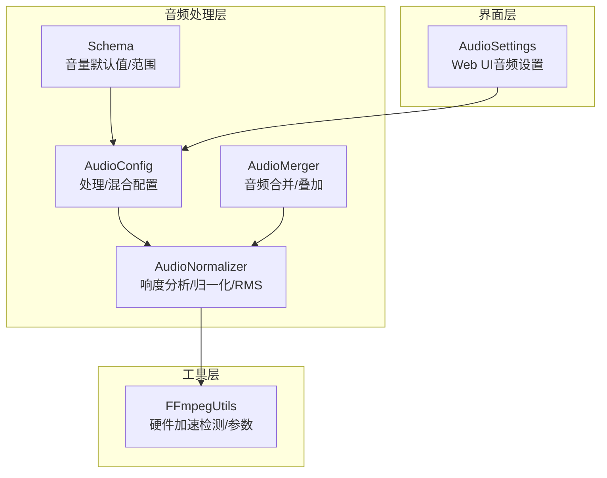
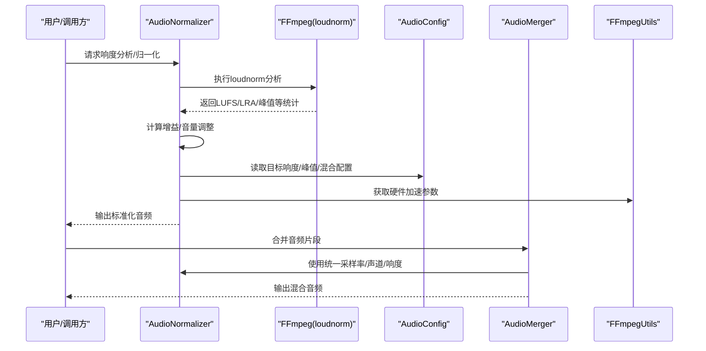
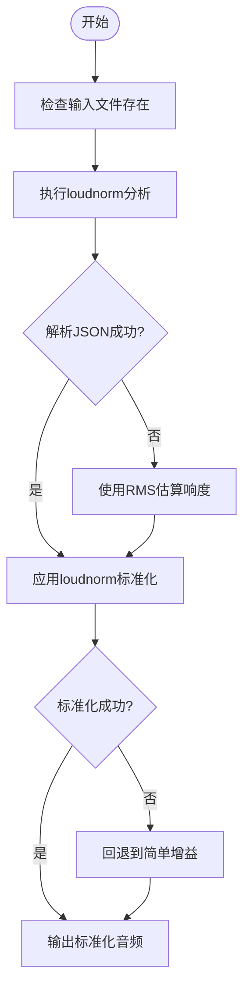
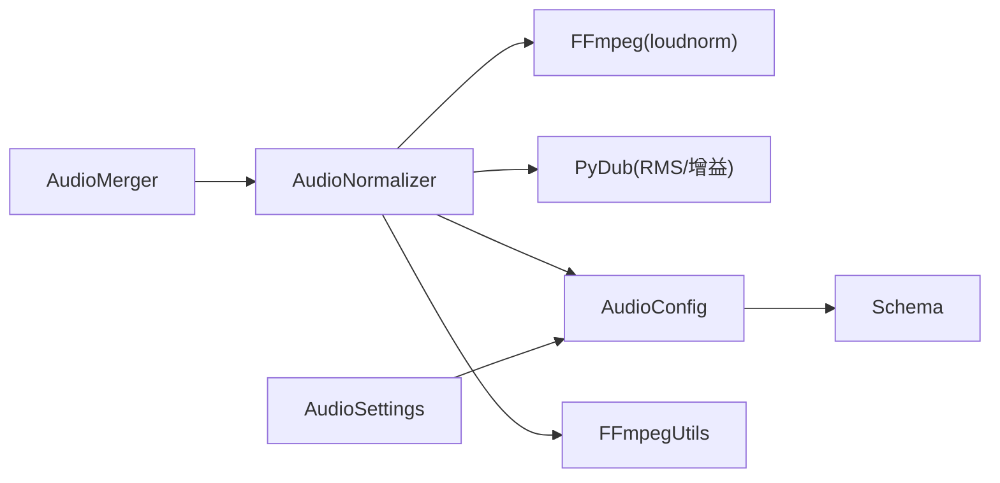

# 音频标准化

<cite>
**本文引用的文件**
- [audio_normalizer.py](file://app/services/audio_normalizer.py)
- [audio_config.py](file://app/config/audio_config.py)
- [ffmpeg_utils.py](file://app/utils/ffmpeg_utils.py)
- [audio_merger.py](file://app/services/audio_merger.py)
- [schema.py](file://app/models/schema.py)
- [audio_settings.py](file://webui/components/audio_settings.py)
</cite>

## 目录
1. [简介](#简介)
2. [项目结构](#项目结构)
3. [核心组件](#核心组件)
4. [架构总览](#架构总览)
5. [详细组件分析](#详细组件分析)
6. [依赖关系分析](#依赖关系分析)
7. [性能考量](#性能考量)
8. [故障排查指南](#故障排查指南)
9. [结论](#结论)
10. [附录](#附录)

## 简介
本文件面向NarratoAI的音频标准化能力，系统性梳理响度归一化、动态范围控制、音量协调与混合策略、以及质量评估与最佳实践。文档聚焦以下目标：
- 阐述响度归一化（LUFS）与RMS估算的实现原理与流程
- 说明动态范围压缩参数（压缩比、阈值、攻击/释放时间）在项目中的现状与建议
- 解析噪声抑制与音频净化的现有实现与可扩展点
- 提供质量评估方法与指标（响度一致性、动态范围、失真度）
- 给出参数调优、处理流程优化与质量保障的最佳实践

## 项目结构
围绕音频标准化的关键文件与职责如下：
- app/services/audio_normalizer.py：音频响度分析与LUFS归一化、RMS估算、音量协调
- app/config/audio_config.py：音频处理与混合配置（目标响度、峰值、交叉淡化、动态范围压缩开关等）
- app/utils/ffmpeg_utils.py：FFmpeg硬件加速检测与参数封装，支撑标准化与混合阶段的性能优化
- app/services/audio_merger.py：音频片段合并与叠加，配合响度归一化进行混合
- app/models/schema.py：音量默认值与范围约束，确保全局一致性
- webui/components/audio_settings.py：Web UI中的音频参数展示与交互入口

图表来源
- [audio_normalizer.py:22-274](file://app/services/audio_normalizer.py#L22-L274)
- [audio_config.py:16-96](file://app/config/audio_config.py#L16-L96)
- [ffmpeg_utils.py:252-355](file://app/utils/ffmpeg_utils.py#L252-L355)
- [audio_merger.py:21-76](file://app/services/audio_merger.py#L21-L76)
- [schema.py:16-35](file://app/models/schema.py#L16-L35)
- [audio_settings.py:83-93](file://webui/components/audio_settings.py#L83-L93)

章节来源
- [audio_normalizer.py:22-274](file://app/services/audio_normalizer.py#L22-L274)
- [audio_config.py:16-96](file://app/config/audio_config.py#L16-L96)
- [ffmpeg_utils.py:252-355](file://app/utils/ffmpeg_utils.py#L252-L355)
- [audio_merger.py:21-76](file://app/services/audio_merger.py#L21-L76)
- [schema.py:16-35](file://app/models/schema.py#L16-L35)
- [audio_settings.py:83-93](file://webui/components/audio_settings.py#L83-L93)

## 核心组件
- AudioNormalizer：提供响度分析（LUFS）、RMS估算、响度归一化（loudnorm滤镜）、音量协调（TTS与原声）等能力
- AudioConfig：集中管理音频处理与混合配置，包括目标响度、峰值、交叉淡化、动态范围压缩开关等
- FFmpegUtils：检测并提供硬件加速参数，为标准化与混合阶段提供性能优化基础
- AudioMerger：在脚本驱动的音频拼接中，将多个片段按时间轴叠加，结合响度归一化实现平滑混合
- Schema：定义音量默认值与范围，确保全局一致性与安全边界
- Web UI音频设置：提供音量参数的可视化配置入口

章节来源
- [audio_normalizer.py:22-274](file://app/services/audio_normalizer.py#L22-L274)
- [audio_config.py:16-96](file://app/config/audio_config.py#L16-L96)
- [ffmpeg_utils.py:252-355](file://app/utils/ffmpeg_utils.py#L252-L355)
- [audio_merger.py:21-76](file://app/services/audio_merger.py#L21-L76)
- [schema.py:16-35](file://app/models/schema.py#L16-L35)
- [audio_settings.py:83-93](file://webui/components/audio_settings.py#L83-L93)

## 架构总览
音频标准化在系统中的关键流程：
- 输入音频经响度分析（LUFS/RMS）与峰值检测
- 使用loudnorm滤镜进行响度归一化，必要时回退到简单增益
- 根据内容类型与音量配置，计算TTS与原声的音量调整系数
- 在混合阶段（音频合并/叠加）应用统一采样率与声道数
- 通过FFmpeg硬件加速提升处理性能

图表来源
- [audio_normalizer.py:29-188](file://app/services/audio_normalizer.py#L29-L188)
- [audio_config.py:34-47](file://app/config/audio_config.py#L34-L47)
- [ffmpeg_utils.py:778-789](file://app/utils/ffmpeg_utils.py#L778-L789)
- [audio_merger.py:21-76](file://app/services/audio_merger.py#L21-L76)

## 详细组件分析

### AudioNormalizer：响度分析与归一化
- 响度分析（LUFS）
  - 使用FFmpeg loudnorm滤镜进行第一遍分析，提取I（响度）、LRA（动态范围）、TP（峰值）等统计
  - 从stderr中解析JSON，若解析失败则回退到RMS估算
- RMS估算
  - 读取音频样本，计算RMS并转换为dB，作为响度的简单估计
- 响度归一化（loudnorm）
  - 两遍处理：先分析，再应用测量得到的统计参数进行标准化
  - 统一采样率与声道，确保输出一致性
- 简单标准化回退
  - 当FFmpeg执行失败或分析结果缺失时，使用pydub的apply_gain进行简单增益
- 音量协调
  - 计算TTS与原声的音量调整系数，目标响度可配置，限制调整范围避免过度放大

图表来源
- [audio_normalizer.py:29-188](file://app/services/audio_normalizer.py#L29-L188)
- [audio_normalizer.py:207-234](file://app/services/audio_normalizer.py#L207-L234)

章节来源
- [audio_normalizer.py:29-188](file://app/services/audio_normalizer.py#L29-L188)
- [audio_normalizer.py:207-273](file://app/services/audio_normalizer.py#L207-L273)

### AudioConfig：处理与混合配置
- 处理配置
  - enable_smart_volume、enable_audio_normalization、target_lufs、max_peak、volume_analysis_method
- 混合配置
  - crossfade_duration、bgm_fade_out、dynamic_range_compression（当前为False）
- 音量配置文件与类型化推荐
  - 支持按视频类型与内容类型推荐音量配置，提供平衡、专注等预设

章节来源
- [audio_config.py:34-96](file://app/config/audio_config.py#L34-L96)
- [audio_config.py:163-205](file://app/config/audio_config.py#L163-L205)

### FFmpegUtils：硬件加速检测与参数
- 检测FFmpeg安装与可用硬件加速器（CUDA/NVENC/VAAPI/QSV/VideoToolbox/AMF/D3D11VA/DXVA2）
- 根据平台与GPU厂商构建硬件加速参数，提供降级策略与消息提示
- 为标准化与混合阶段提供性能优化基础

章节来源
- [ffmpeg_utils.py:252-355](file://app/utils/ffmpeg_utils.py#L252-L355)
- [ffmpeg_utils.py:778-789](file://app/utils/ffmpeg_utils.py#L778-L789)

### AudioMerger：音频合并与叠加
- 合并多个音频片段，按脚本中的时间戳进行叠加
- 与响度归一化配合，确保混合后整体响度一致、过渡自然

章节来源
- [audio_merger.py:21-76](file://app/services/audio_merger.py#L21-L76)

### Schema：音量默认值与范围
- 定义语音、TTS、原声、BGM的默认音量与最小/最大范围
- 保证全局一致性与安全边界（原声音量允许超过1.0）

章节来源
- [schema.py:16-35](file://app/models/schema.py#L16-L35)

### Web UI音频设置：参数入口
- 提供音频处理参数的可视化配置入口，便于用户调整音量与处理策略

章节来源
- [audio_settings.py:83-93](file://webui/components/audio_settings.py#L83-L93)

## 依赖关系分析
- AudioNormalizer依赖FFmpeg（loudnorm分析与标准化），依赖pydub（RMS估算与简单增益）
- AudioConfig为AudioNormalizer与AudioMerger提供统一的处理与混合配置
- FFmpegUtils为AudioNormalizer与混合阶段提供硬件加速参数
- Schema为音量配置提供默认值与范围约束
- Web UI音频设置为用户提供参数入口

图表来源
- [audio_normalizer.py:12-19](file://app/services/audio_normalizer.py#L12-L19)
- [audio_config.py:16-96](file://app/config/audio_config.py#L16-L96)
- [ffmpeg_utils.py:252-355](file://app/utils/ffmpeg_utils.py#L252-L355)
- [audio_merger.py:21-76](file://app/services/audio_merger.py#L21-L76)
- [schema.py:16-35](file://app/models/schema.py#L16-L35)
- [audio_settings.py:83-93](file://webui/components/audio_settings.py#L83-L93)

## 性能考量
- 硬件加速优先级与降级策略
  - Windows：优先NVENC编码器（纯编码器方案，避免滤镜链问题），其次CUDA解码+NVENC，再考虑AMF/QSV
  - Linux：CUDA（NVIDIA）、VAAPI（AMD/Intel）、QSV（Intel）
  - macOS：VideoToolbox
  - 若无硬件加速，使用软件编码（libx264），兼容性最佳
- 处理流程优化
  - 标准化阶段统一采样率与声道，减少后续处理成本
  - 合并阶段按时间戳叠加，避免重复转码
- 资源占用与并发
  - 合理设置线程数与预设，平衡速度与质量

章节来源
- [ffmpeg_utils.py:252-355](file://app/utils/ffmpeg_utils.py#L252-L355)
- [audio_normalizer.py:185-187](file://app/services/audio_normalizer.py#L185-L187)
- [audio_merger.py:38-76](file://app/services/audio_merger.py#L38-L76)

## 故障排查指南
- FFmpeg未安装或不可用
  - 现象：响度分析/归一化失败，触发回退
  - 处理：安装FFmpeg并确保在PATH中
- loudnorm分析失败
  - 现象：无法解析JSON，回退到RMS估算
  - 处理：检查输入音频完整性与格式；确认FFmpeg版本支持loudnorm
- 归一化失败
  - 现象：FFmpeg执行异常，回退到简单增益
  - 处理：检查音频路径与权限；确认FFmpeg参数正确
- 硬件加速不可用
  - 现象：检测不到可用硬件加速，使用软件编码
  - 处理：检查GPU驱动与FFmpeg编译选项；必要时强制软件编码

章节来源
- [audio_normalizer.py:43-84](file://app/services/audio_normalizer.py#L43-L84)
- [audio_normalizer.py:138-205](file://app/services/audio_normalizer.py#L138-L205)
- [ffmpeg_utils.py:118-136](file://app/utils/ffmpeg_utils.py#L118-L136)
- [ffmpeg_utils.py:252-355](file://app/utils/ffmpeg_utils.py#L252-L355)

## 结论
NarratoAI的音频标准化以FFmpeg loudnorm为核心，结合RMS估算与音量协调，实现了广播级响度一致性与跨媒体的音量平衡。通过AudioConfig与Schema统一配置与范围约束，配合FFmpegUtils的硬件加速检测，系统在保证质量的同时兼顾性能。动态范围压缩参数目前处于可配置状态（默认关闭），未来可按场景启用以进一步优化动态范围。建议在生产环境中结合响度一致性测试与动态范围分析，持续优化参数与流程。

## 附录

### 音频响度归一化实现要点
- LUFS响度分析：使用loudnorm滤镜进行第一遍分析，提取I、LRA、TP等统计
- RMS估算：作为LUFS的后备方案，适用于格式不支持或分析失败场景
- 增益计算：根据目标响度与实测响度计算增益系数，限制调整范围避免过度放大
- 归一化输出：统一采样率与声道，确保后续处理一致性

章节来源
- [audio_normalizer.py:29-188](file://app/services/audio_normalizer.py#L29-L188)
- [audio_normalizer.py:236-273](file://app/services/audio_normalizer.py#L236-L273)

### 动态范围压缩与参数配置
- 当前配置项：dynamic_range_compression（布尔开关）
- 实践建议：
  - 压缩比：根据内容类型选择2:1~6:1区间
  - 阈值：与目标响度联动，避免过度压缩导致听感干瘪
  - 攻击/释放时间：短攻击（5–15ms）快速抑制峰值，长释放（50–200ms）平滑恢复
  - 限制：避免增益降低幅度过大，保持自然动态

章节来源
- [audio_config.py:46-46](file://app/config/audio_config.py#L46-L46)

### 噪声抑制与音频净化
- 现状：项目未内置专用噪声抑制或频谱掩蔽滤波模块
- 建议扩展方向：
  - 频谱分析：使用短时傅里叶变换（STFT）提取频谱特征
  - 掩蔽曲线：基于心理声学模型建立静态/动态掩蔽阈值
  - 自适应滤波：基于谱减法或维纳滤波的自适应噪声抑制
  - 与响度归一化协同：在净化后重新进行响度校正，避免引入响度漂移

[本节为概念性建议，不直接对应具体源码文件]

### 音频标准化质量评估方法
- 响度一致性测试
  - 使用loudnorm分析多段音频的I值，计算标准差与偏差范围
- 动态范围分析
  - LRA分布与TP峰值统计，评估动态范围一致性
- 失真度测量
  - THD+N、信噪比（SNR）与谐波失真（THD）评估
- 混合质量
  - 叠加后响度一致性、交叉淡化自然度、BGM淡出平滑度

[本节为通用评估方法，不直接对应具体源码文件]

### 最佳实践指南
- 参数调优
  - 目标响度：广播标准-23 LUFS，短视频可适度提升至-20 LUFS
  - 峰值限制：-1 dBFS以内，避免削波
  - 动态范围：LRA控制在2–5 LU区间，避免过度压缩
- 处理流程优化
  - 先响度归一化，再进行混合与交叉淡化
  - 合并阶段统一采样率与声道，减少转码次数
- 质量保证
  - 建立响度一致性与动态范围的自动化测试
  - 对关键场景（新闻、教育、娱乐）分别验证音量配置与混合策略

[本节为通用实践建议，不直接对应具体源码文件]