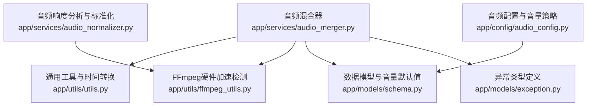
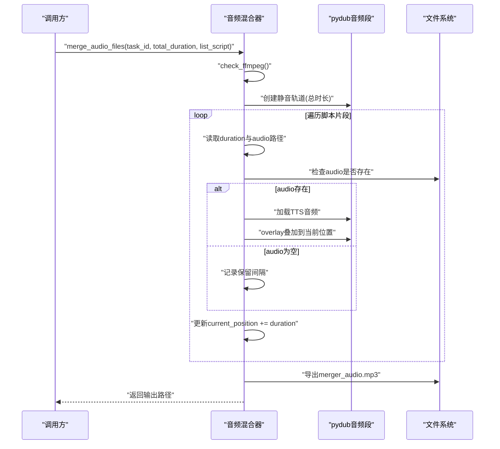
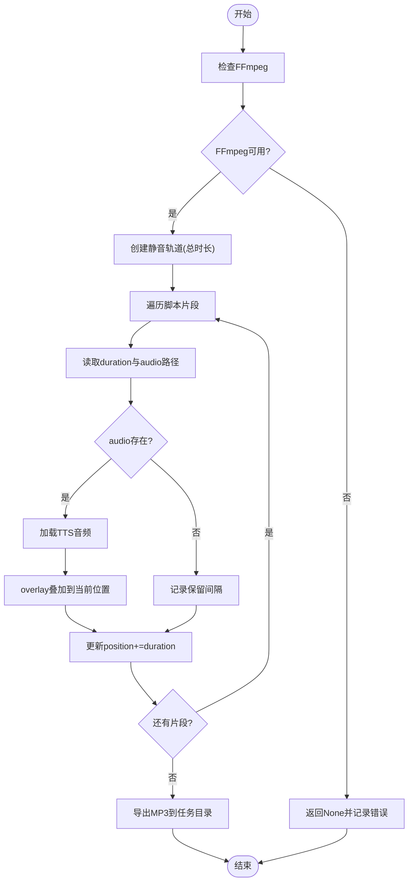
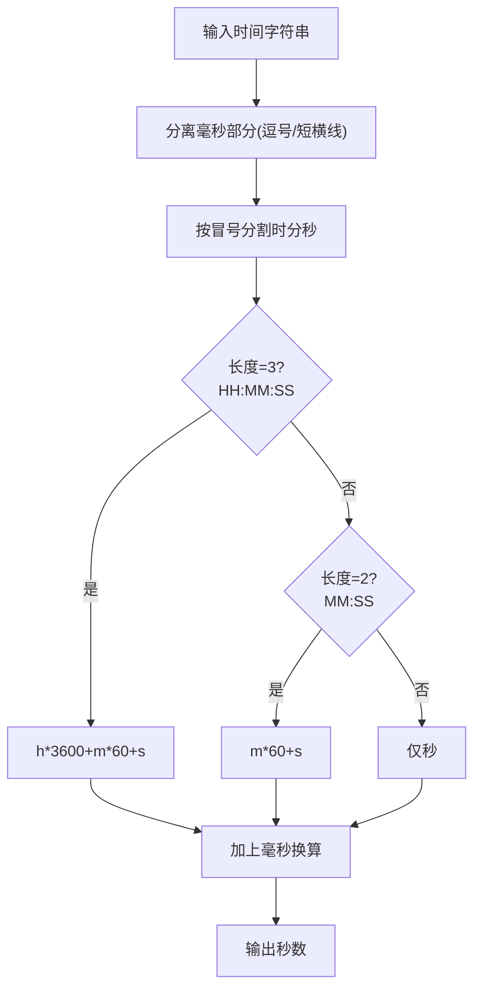
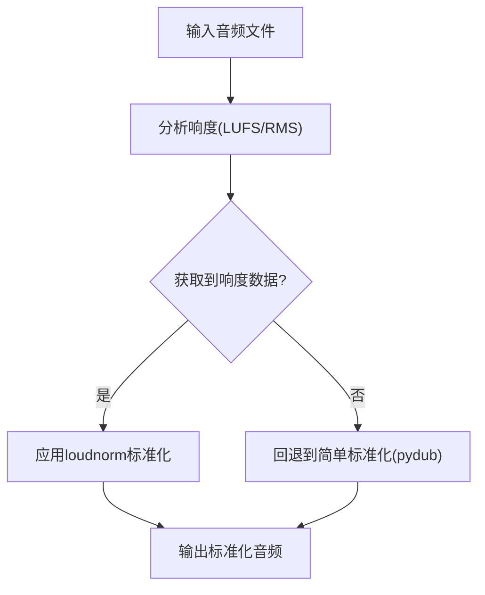
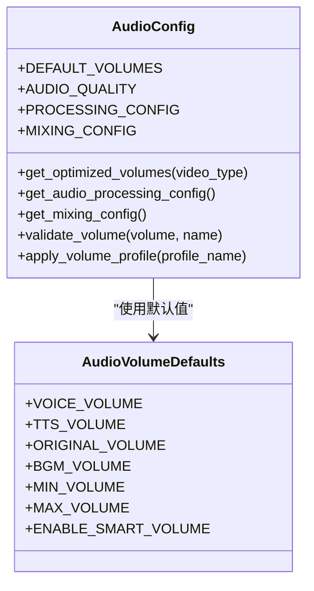
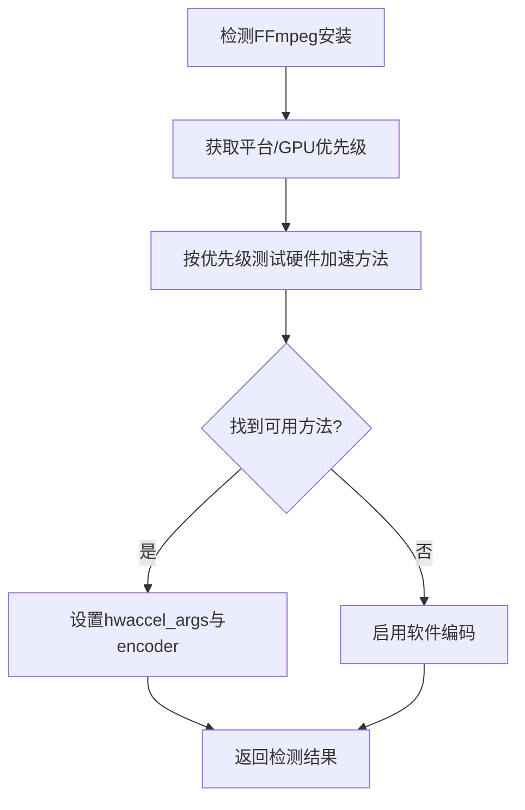
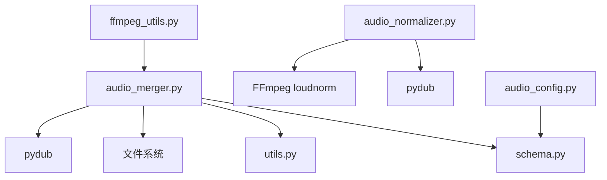
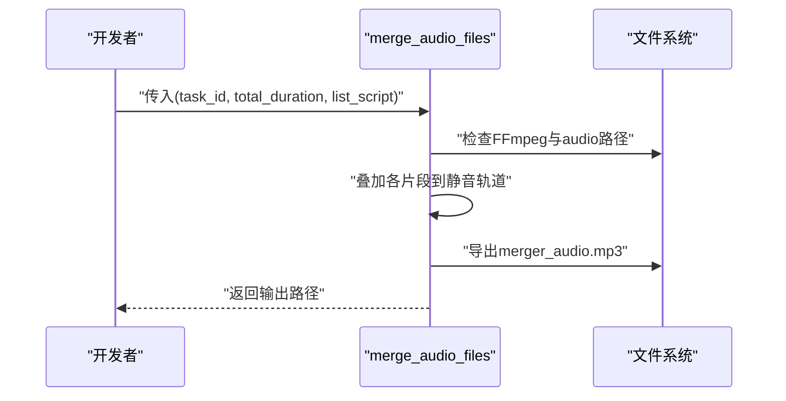

# 音频混合器

<cite>
**本文引用的文件**
- [app/services/audio_merger.py](file://app/services/audio_merger.py)
- [app/utils/ffmpeg_utils.py](file://app/utils/ffmpeg_utils.py)
- [app/utils/utils.py](file://app/utils/utils.py)
- [app/models/schema.py](file://app/models/schema.py)
- [app/config/audio_config.py](file://app/config/audio_config.py)
- [app/services/audio_normalizer.py](file://app/services/audio_normalizer.py)
- [app/models/exception.py](file://app/models/exception.py)
</cite>

## 目录
1. [简介](#简介)
2. [项目结构](#项目结构)
3. [核心组件](#核心组件)
4. [架构总览](#架构总览)
5. [详细组件分析](#详细组件分析)
6. [依赖关系分析](#依赖关系分析)
7. [性能考量](#性能考量)
8. [故障排查指南](#故障排查指南)
9. [结论](#结论)
10. [附录](#附录)

## 简介
本文件面向NarratoAI的音频混合器功能，系统性阐述音频文件合并的核心算法与实现细节，包括多音轨叠加、时间轴对齐、音频片段拼接策略、时间戳解析与定位、错误处理与容错机制，以及对常见音频格式（如MP3、WAV、AAC等）的兼容性处理思路。同时提供可操作的使用示例与调用方式，帮助开发者快速集成与扩展。

## 项目结构
音频混合器相关能力主要分布在以下模块：
- 音频混合主流程：app/services/audio_merger.py
- 时间戳解析与通用时间工具：app/utils/utils.py
- 音频响度分析与标准化：app/services/audio_normalizer.py
- 音频配置与音量策略：app/config/audio_config.py
- FFmpeg硬件加速检测与参数：app/utils/ffmpeg_utils.py
- 数据模型与音量默认值：app/models/schema.py
- 异常类型定义：app/models/exception.py

**图表来源**
- [app/services/audio_merger.py:1-172](file://app/services/audio_merger.py#L1-L172)
- [app/utils/utils.py:385-429](file://app/utils/utils.py#L385-L429)
- [app/services/audio_normalizer.py:22-315](file://app/services/audio_normalizer.py#L22-L315)
- [app/config/audio_config.py:16-221](file://app/config/audio_config.py#L16-L221)
- [app/utils/ffmpeg_utils.py:118-136](file://app/utils/ffmpeg_utils.py#L118-L136)
- [app/models/schema.py:16-35](file://app/models/schema.py#L16-L35)
- [app/models/exception.py:7-29](file://app/models/exception.py#L7-L29)

**章节来源**
- [app/services/audio_merger.py:1-172](file://app/services/audio_merger.py#L1-L172)
- [app/utils/utils.py:385-429](file://app/utils/utils.py#L385-L429)
- [app/services/audio_normalizer.py:22-315](file://app/services/audio_normalizer.py#L22-L315)
- [app/config/audio_config.py:16-221](file://app/config/audio_config.py#L16-L221)
- [app/utils/ffmpeg_utils.py:118-136](file://app/utils/ffmpeg_utils.py#L118-L136)
- [app/models/schema.py:16-35](file://app/models/schema.py#L16-L35)
- [app/models/exception.py:7-29](file://app/models/exception.py#L7-L29)

## 核心组件
- 音频混合主流程：负责检查FFmpeg、创建静音基础轨道、按脚本片段叠加TTS音频、处理空音频片段、导出合并结果。
- 时间戳解析与定位：支持多种时间格式（HH:MM:SS,mmm、MM:SS,mmm、SS,mmm等），并提供从文件名提取时间戳的能力。
- 音频响度分析与标准化：提供基于FFmpeg loudnorm的响度分析与标准化，以及RMS作为后备方案。
- 音频配置与音量策略：提供默认音量、质量参数、混合配置（交叉淡化、BGM淡出等）及音量验证与配置文件应用。
- FFmpeg硬件加速检测：提供跨平台的硬件加速检测与参数生成，保障混合过程的性能与稳定性。
- 数据模型与异常：提供音量默认值常量类与通用异常类型，便于统一管理和错误记录。

**章节来源**
- [app/services/audio_merger.py:21-76](file://app/services/audio_merger.py#L21-L76)
- [app/utils/utils.py:385-429](file://app/utils/utils.py#L385-L429)
- [app/services/audio_normalizer.py:29-274](file://app/services/audio_normalizer.py#L29-L274)
- [app/config/audio_config.py:19-96](file://app/config/audio_config.py#L19-L96)
- [app/utils/ffmpeg_utils.py:252-355](file://app/utils/ffmpeg_utils.py#L252-L355)
- [app/models/schema.py:16-35](file://app/models/schema.py#L16-L35)
- [app/models/exception.py:7-29](file://app/models/exception.py#L7-L29)

## 架构总览
音频混合器采用“脚本驱动 + 时间轴对齐 + 多轨叠加”的架构模式。核心流程如下：
- 输入：任务ID、总时长、脚本列表（每条包含duration与audio路径）
- 处理：检查FFmpeg → 初始化静音轨道 → 遍历脚本片段 → 加载TTS音频 → overlay叠加 → 更新位置 → 导出MP3
- 输出：合并后的音频文件路径

**图表来源**
- [app/services/audio_merger.py:21-76](file://app/services/audio_merger.py#L21-L76)

## 详细组件分析

### 音频混合主流程（多轨叠加与时间轴对齐）
- FFmpeg检查：在执行任何音频处理前，先检查系统是否安装FFmpeg，未安装则直接返回None并记录错误。
- 静音轨道初始化：根据总时长创建静音基础轨道，确保最终输出长度一致。
- 片段叠加策略：遍历脚本，按duration累加current_position，将TTS音频以overlay方式叠加到对应位置；若audio为空，则仅保留静默间隔。
- 错误处理：对单个片段异常进行捕获与记录，并继续推进后续片段的位置计算，保证整体时间轴连续性。
- 输出：将最终音频导出为MP3，保存至任务目录下的merger_audio.mp3。

**图表来源**
- [app/services/audio_merger.py:21-76](file://app/services/audio_merger.py#L21-L76)

**章节来源**
- [app/services/audio_merger.py:21-76](file://app/services/audio_merger.py#L21-L76)

### 时间戳解析与定位（支持多种格式）
- 支持格式：HH:MM:SS,mmm、MM:SS,mmm、SS,mmm、SS-mmm等。
- 解析逻辑：先分离毫秒部分（逗号或短横线），再按冒号分割时分秒，分别计算总秒数并加上毫秒换算。
- 文件名提取：从文件名中提取“起始-结束”时间戳，将下划线替换为冒号后转换为秒。
- 通用工具：提供time_to_seconds与seconds_to_time等通用转换函数，便于跨模块复用。

**图表来源**
- [app/utils/utils.py:385-429](file://app/utils/utils.py#L385-L429)
- [app/services/audio_merger.py:79-111](file://app/services/audio_merger.py#L79-L111)
- [app/services/audio_merger.py:113-135](file://app/services/audio_merger.py#L113-L135)

**章节来源**
- [app/utils/utils.py:385-429](file://app/utils/utils.py#L385-L429)
- [app/services/audio_merger.py:79-111](file://app/services/audio_merger.py#L79-L111)
- [app/services/audio_merger.py:113-135](file://app/services/audio_merger.py#L113-L135)

### 音频响度分析与标准化（为混合做前置处理）
- 响度分析：使用FFmpeg loudnorm滤镜分析LUFS，失败时回退到RMS估算。
- 标准化：两阶段处理（分析→应用），统一采样率与声道，失败时回退到pydub简单标准化。
- 混合前准备：提供normalize_audio_for_mixing工具，生成标准化后的音频文件路径。

**图表来源**
- [app/services/audio_normalizer.py:29-206](file://app/services/audio_normalizer.py#L29-L206)
- [app/services/audio_normalizer.py:276-303](file://app/services/audio_normalizer.py#L276-L303)

**章节来源**
- [app/services/audio_normalizer.py:29-206](file://app/services/audio_normalizer.py#L29-L206)
- [app/services/audio_normalizer.py:276-303](file://app/services/audio_normalizer.py#L276-L303)

### 音频配置与音量策略
- 默认音量：提供TTS、原声、BGM的默认音量与范围限制。
- 视频类型优化：根据不同视频类型（教育、娱乐、新闻）动态调整音量配置。
- 预设配置文件：支持“均衡”“以语音为主”“以原声为主”“轻背景”等预设。
- 混合配置：交叉淡化、BGM淡出、动态范围压缩等参数化控制。

**图表来源**
- [app/config/audio_config.py:19-96](file://app/config/audio_config.py#L19-L96)
- [app/models/schema.py:16-35](file://app/models/schema.py#L16-L35)

**章节来源**
- [app/config/audio_config.py:19-96](file://app/config/audio_config.py#L19-L96)
- [app/models/schema.py:16-35](file://app/models/schema.py#L16-L35)

### FFmpeg硬件加速检测与参数
- 跨平台检测：根据平台与GPU厂商优先级测试硬件加速方法（CUDA、NVENC、VideoToolbox、QSV、VAAPI、AMF等）。
- 渐进式降级：若某方法失败，自动尝试备选方案，最终回退到软件编码。
- 参数生成：提供硬件加速参数列表与类型，便于在其他流程中复用。

**图表来源**
- [app/utils/ffmpeg_utils.py:252-355](file://app/utils/ffmpeg_utils.py#L252-L355)

**章节来源**
- [app/utils/ffmpeg_utils.py:252-355](file://app/utils/ffmpeg_utils.py#L252-L355)

### 错误处理与容错机制
- FFmpeg缺失：直接返回None并记录错误，避免后续处理中断。
- 单片段异常：捕获异常并记录，继续推进current_position，保证时间轴连续。
- 文件缺失：当audio路径不存在时，记录保留间隔，不打断整体流程。
- 时间格式异常：解析失败时返回0.0并记录错误，避免崩溃。
- 异常类型：提供FileNotFoundException等异常类型，便于上层统一处理。

**章节来源**
- [app/services/audio_merger.py:33-36](file://app/services/audio_merger.py#L33-L36)
- [app/services/audio_merger.py:64-69](file://app/services/audio_merger.py#L64-L69)
- [app/services/audio_merger.py:108-110](file://app/services/audio_merger.py#L108-L110)
- [app/models/exception.py:27-29](file://app/models/exception.py#L27-L29)

## 依赖关系分析
- 音频混合器依赖：
  - pydub：加载与叠加音频片段
  - 文件系统：检查audio路径是否存在
  - 通用工具：时间转换与任务目录管理
  - FFmpeg：环境检查（当前仅检查安装状态）
- 音频标准化依赖：
  - FFmpeg loudnorm滤镜：响度分析与标准化
  - pydub：后备标准化方案
- 配置与模型：
  - 音量默认值与范围限制
  - 视频参数模型（音量字段）

**图表来源**
- [app/services/audio_merger.py:1-10](file://app/services/audio_merger.py#L1-L10)
- [app/services/audio_normalizer.py:13-20](file://app/services/audio_normalizer.py#L13-L20)
- [app/config/audio_config.py:19-96](file://app/config/audio_config.py#L19-L96)
- [app/utils/ffmpeg_utils.py:118-136](file://app/utils/ffmpeg_utils.py#L118-L136)
- [app/models/schema.py:16-35](file://app/models/schema.py#L16-L35)

**章节来源**
- [app/services/audio_merger.py:1-10](file://app/services/audio_merger.py#L1-L10)
- [app/services/audio_normalizer.py:13-20](file://app/services/audio_normalizer.py#L13-L20)
- [app/config/audio_config.py:19-96](file://app/config/audio_config.py#L19-L96)
- [app/utils/ffmpeg_utils.py:118-136](file://app/utils/ffmpeg_utils.py#L118-L136)
- [app/models/schema.py:16-35](file://app/models/schema.py#L16-L35)

## 性能考量
- 硬件加速：优先使用平台与GPU适配的硬件加速方法，显著提升处理效率；若不可用则自动回退软件编码。
- 时间复杂度：音频叠加为O(n)（n为片段数），时间戳解析为O(1)；总体线性增长。
- I/O优化：尽量减少重复导出与中间文件生成，合并完成后一次性导出最终MP3。
- 响度标准化：在混合前进行标准化，可减少混合时的音量波动，提升听感一致性。

[本节为通用性能讨论，无需列出章节来源]

## 故障排查指南
- FFmpeg未安装：检查系统PATH或安装包，确认版本可用。
- 片段音频缺失：确认audio路径有效且可读；若为空则按静默间隔处理。
- 时间格式不匹配：确保时间字符串符合支持格式；必要时使用工具函数进行转换。
- 混合后音量不均衡：结合音量配置与响度标准化流程，调整默认音量与目标LUFS。
- 异常定位：利用日志记录的错误信息与异常类型，快速定位问题片段或配置项。

**章节来源**
- [app/services/audio_merger.py:33-36](file://app/services/audio_merger.py#L33-L36)
- [app/services/audio_merger.py:64-69](file://app/services/audio_merger.py#L64-L69)
- [app/services/audio_merger.py:108-110](file://app/services/audio_merger.py#L108-L110)
- [app/models/exception.py:7-29](file://app/models/exception.py#L7-L29)

## 结论
NarratoAI的音频混合器以脚本驱动为核心，通过静音轨道初始化与overlay叠加实现多音轨拼接，配合灵活的时间戳解析与容错机制，确保在不同音频格式与时间格式下稳定工作。结合响度分析与音量策略，可进一步提升混合音频的一致性与听感体验。建议在生产环境中启用FFmpeg硬件加速与混合前的响度标准化流程，以获得最佳性能与质量。

[本节为总结性内容，无需列出章节来源]

## 附录

### 实际使用示例（脚本数据结构与调用方式）
- 输入参数
  - task_id：任务ID（字符串）
  - total_duration：总时长（秒，浮点）
  - list_script：脚本列表，每条包含duration（秒）、audio（音频文件路径，可为空）、timestamp等字段
- 调用方式
  - 直接调用合并函数，传入上述参数
- 输出结果
  - 合并后的音频文件路径（MP3），保存在任务目录下

**图表来源**
- [app/services/audio_merger.py:21-76](file://app/services/audio_merger.py#L21-L76)

**章节来源**
- [app/services/audio_merger.py:21-76](file://app/services/audio_merger.py#L21-L76)

### 关键API与数据结构摘要
- merge_audio_files(task_id, total_duration, list_script)：主入口，返回合并后的音频路径
- time_to_seconds(time_str)：时间字符串转秒
- extract_timestamp(filename)：从文件名提取起止时间戳
- AudioNormalizer.analyze_audio_lufs / normalize_audio_lufs：响度分析与标准化
- AudioConfig.get_optimized_volumes / apply_volume_profile：音量配置与预设
- FFmpeg硬件加速检测：detect_hardware_acceleration / get_ffmpeg_hwaccel_args

**章节来源**
- [app/services/audio_merger.py:21-135](file://app/services/audio_merger.py#L21-L135)
- [app/services/audio_normalizer.py:29-206](file://app/services/audio_normalizer.py#L29-L206)
- [app/config/audio_config.py:49-161](file://app/config/audio_config.py#L49-L161)
- [app/utils/ffmpeg_utils.py:252-355](file://app/utils/ffmpeg_utils.py#L252-L355)