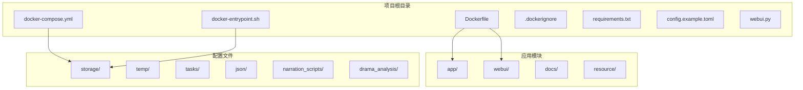
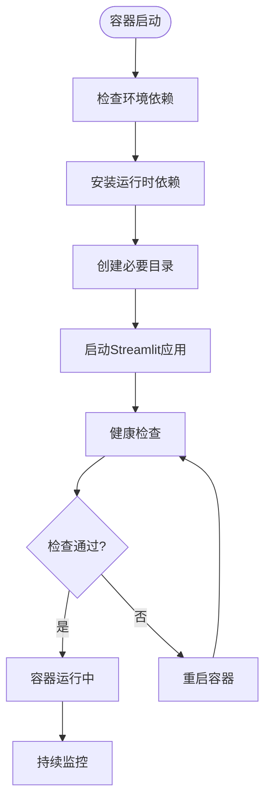
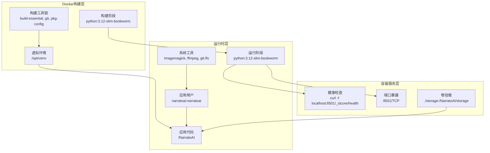
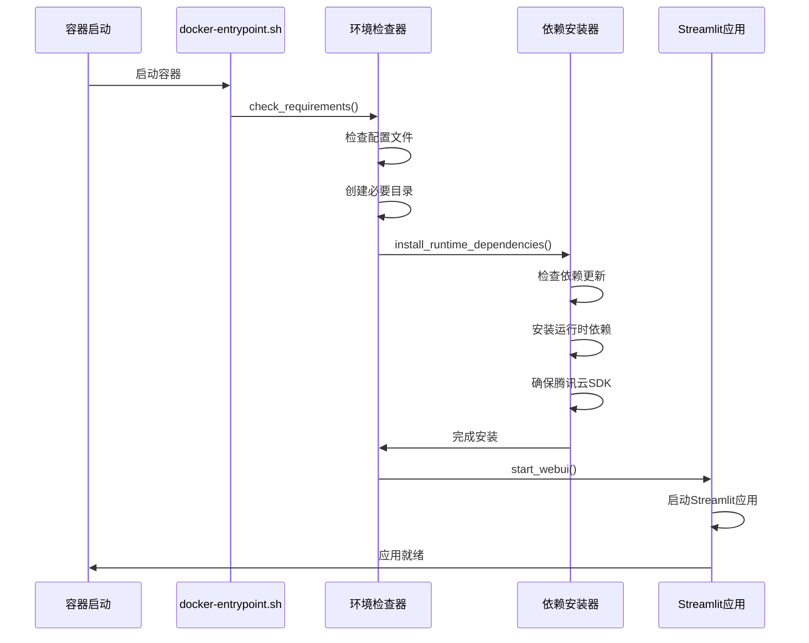

# Docker容器化部署

<cite>
**本文档引用的文件**
- [Dockerfile](file://Dockerfile)
- [docker-compose.yml](file://docker-compose.yml)
- [docker-entrypoint.sh](file://docker-entrypoint.sh)
- [.dockerignore](file://.dockerignore)
- [requirements.txt](file://requirements.txt)
- [config.example.toml](file://config.example.toml)
- [webui.py](file://webui.py)
- [deploy-linux.sh](file://deploy-linux.sh)
- [deploy-windows-docker.bat](file://deploy-windows-docker.bat)
- [docker-deploy.sh](file://docker-deploy.sh)
- [README.md](file://README.md)
</cite>

## 目录
1. [简介](#简介)
2. [项目结构](#项目结构)
3. [核心组件](#核心组件)
4. [架构概览](#架构概览)
5. [详细组件分析](#详细组件分析)
6. [依赖关系分析](#依赖关系分析)
7. [性能考虑](#性能考虑)
8. [故障排除指南](#故障排除指南)
9. [结论](#结论)
10. [附录](#附录)

## 简介

NarratoAI是一个基于人工智能的影视解说自动化工具，支持文案生成、视频剪辑、配音和字幕生成的一站式流程。本文档提供了完整的Docker容器化部署指南，包括多阶段构建过程、容器配置、健康检查机制和最佳实践。

## 项目结构

NarratoAI项目采用模块化架构设计，主要包含以下关键目录和文件：



**图表来源**
- [Dockerfile:1-89](file://Dockerfile#L1-L89)
- [docker-compose.yml:1-30](file://docker-compose.yml#L1-L30)

**章节来源**
- [Dockerfile:1-89](file://Dockerfile#L1-L89)
- [docker-compose.yml:1-30](file://docker-compose.yml#L1-L30)

## 核心组件

### 多阶段Docker构建

NarratoAI采用了高效的多阶段构建策略，将构建环境与运行环境分离：

#### 构建阶段 (Builder Stage)
- **基础镜像**: python:3.12-slim-bookworm
- **构建工具**: build-essential, git, git-lfs, pkg-config
- **Python环境**: 虚拟环境 /opt/venv
- **依赖安装**: 使用清华镜像源加速pip安装

#### 运行阶段 (Runtime Stage)
- **基础镜像**: python:3.12-slim-bookworm
- **系统工具**: imagemagick, ffmpeg, wget, curl, git-lfs
- **安全配置**: 创建专门的narratoai用户组和用户
- **权限管理**: 非root用户运行，最小权限原则

**章节来源**
- [Dockerfile:1-89](file://Dockerfile#L1-L89)

### 健康检查机制

容器具备完善的健康检查机制：



**图表来源**
- [docker-entrypoint.sh:130-145](file://docker-entrypoint.sh#L130-L145)
- [Dockerfile:83-85](file://Dockerfile#L83-L85)

**章节来源**
- [docker-entrypoint.sh:130-145](file://docker-entrypoint.sh#L130-L145)
- [Dockerfile:83-85](file://Dockerfile#L83-L85)

## 架构概览

NarratoAI的Docker部署架构采用单容器多阶段构建模式：



**图表来源**
- [Dockerfile:29-89](file://Dockerfile#L29-L89)
- [docker-compose.yml:9-15](file://docker-compose.yml#L9-L15)

**章节来源**
- [Dockerfile:29-89](file://Dockerfile#L29-L89)
- [docker-compose.yml:9-15](file://docker-compose.yml#L9-L15)

## 详细组件分析

### Dockerfile多阶段构建详解

#### 构建阶段配置
- **镜像选择**: python:3.12-slim-bookworm，轻量级基础镜像
- **环境变量**: DEBIAN_FRONTEND=noninteractive，非交互式安装
- **工作目录**: /build，构建工作空间
- **构建工具**: 安装编译工具链和Git LFS支持

#### 虚拟环境管理
- **虚拟环境创建**: 使用venv在/opt/venv创建隔离环境
- **路径配置**: 将/opt/venv/bin添加到PATH
- **依赖安装**: 使用清华镜像源加速pip安装，避免缓存

#### 运行阶段优化
- **精简镜像**: 仅包含运行所需的最小依赖
- **系统工具**: 安装ImageMagick、FFmpeg等多媒体处理工具
- **安全配置**: 创建专用用户和组，设置适当的文件权限
- **环境变量**: 配置Python相关环境变量，优化运行时性能

**章节来源**
- [Dockerfile:1-89](file://Dockerfile#L1-L89)

### docker-compose.yml配置详解

#### 服务定义
- **服务名称**: narratoai-webui，清晰的服务标识
- **镜像构建**: 使用当前目录的Dockerfile构建镜像
- **容器命名**: narratoai-webui，便于管理和识别

#### 端口映射
- **主机端口**: 8501，映射到容器的8501端口
- **应用端口**: Streamlit默认端口，Web界面访问端口

#### 卷挂载配置
- **存储卷**: ./storage:/NarratoAI/storage，持久化存储
- **配置卷**: ./config.toml:/NarratoAI/config.toml，配置文件挂载
- **资源卷**: ./resource:/NarratoAI/resource:rw，资源文件共享

#### 环境变量设置
- **Python缓冲**: PYTHONUNBUFFERED=1，实时输出日志
- **时区配置**: TZ=Asia/Shanghai，中国标准时间

#### 健康检查配置
- **检查间隔**: 30秒
- **超时时间**: 10秒
- **启动等待**: 60秒
- **重试次数**: 3次

**章节来源**
- [docker-compose.yml:1-30](file://docker-compose.yml#L1-L30)

### docker-entrypoint.sh脚本分析

#### 环境检查功能
脚本提供完整的环境检查和准备功能：



**图表来源**
- [docker-entrypoint.sh:64-90](file://docker-entrypoint.sh#L64-L90)
- [docker-entrypoint.sh:92-113](file://docker-entrypoint.sh#L92-L113)

#### 运行时依赖管理
- **依赖检测**: 比较requirements.txt修改时间和已安装包列表
- **安装策略**: 优先使用sudo安装，失败时回退到用户级安装
- **路径配置**: 确保用户级安装的包在PATH中
- **特殊依赖**: 确保腾讯云SDK始终可用

#### WebUI启动配置
- **端口检查**: 检查8501端口是否被占用
- **Streamlit参数**: 配置服务器地址、端口、CORS等
- **上传限制**: 最大上传大小2048MB
- **日志级别**: INFO级别，过滤调试信息

**章节来源**
- [docker-entrypoint.sh:1-145](file://docker-entrypoint.sh#L1-L145)

### 配置文件管理

#### 配置文件结构
- **主配置**: config.toml，应用的主要配置文件
- **示例配置**: config.example.toml，完整的配置模板
- **配置项分类**: LLM配置、TTS配置、代理配置、视频处理配置

#### LLM配置详解
- **LiteLLM集成**: 统一的LLM接口，支持100+提供商
- **视觉模型**: 支持Gemini、OpenAI、Qwen等模型
- **文本模型**: 支持DeepSeek、Gemini、OpenAI等模型
- **API密钥管理**: 支持多个提供商的API密钥配置

#### TTS配置选项
- **Azure TTS**: 支持Azure语音服务
- **腾讯云TTS**: 支持腾讯云语音合成
- **SoulVoice**: 第三方TTS服务
- **Edge TTS**: 微软Edge浏览器内置TTS

**章节来源**
- [config.example.toml:1-177](file://config.example.toml#L1-L177)

## 依赖关系分析

### Python依赖管理

```mermaid
graph TB
subgraph "核心依赖"
Requests[requests>=2.32.0]
MoviePy[moviepy==2.1.1]
Streamlit[streamlit>=1.45.0]
Loguru[loguru>=0.7.3]
end
subgraph "AI服务依赖"
OpenAI[openai>=1.77.0]
LiteLLM[litellm>=1.70.0]
Google[google-generativeai>=0.8.5]
AzureSpeech[azure-cognitiveservices-speech>=1.37.0]
TencentCloud[tencentcloud-sdk-python>=3.0.1200]
DashScope[dashscope>=1.24.6]
end
subgraph "图像处理依赖"
Pillow[Pillow>=10.3.0]
end
subgraph "工具类依赖"
Watchdog[watchdog==6.0.0]
PyDub[pydub==0.25.1]
PySRT[pysrt==1.1.2]
TQDM[tqdm>=4.66.6]
Tenacity[tenacity>=9.0.0]
end
Requirements --> Requests
Requirements --> MoviePy
Requirements --> Streamlit
Requirements --> Loguru
Requirements --> OpenAI
Requirements --> LiteLLM
Requirements --> Google
Requirements --> AzureSpeech
Requirements --> TencentCloud
Requirements --> DashScope
Requirements --> Pillow
Requirements --> Watchdog
Requirements --> PyDub
Requirements --> PySRT
Requirements --> TQDM
Requirements --> Tenacity
```



**图表来源**
- [requirements.txt:1-39](file://requirements.txt#L1-L39)

### 系统依赖配置

#### Docker环境依赖
- **ImageMagick**: 图像处理和转换
- **FFmpeg**: 视频音频处理
- **Git LFS**: 大文件版本控制
- **CA证书**: HTTPS连接验证

#### 运行时系统要求
- **Python 3.12+**: 应用运行时环境
- **至少4核CPU**: 推荐配置
- **8GB内存**: 最低内存要求
- **显卡非必需**: 支持纯CPU运行

**章节来源**
- [requirements.txt:1-39](file://requirements.txt#L1-L39)
- [Dockerfile:51-62](file://Dockerfile#L51-L62)

## 性能考虑

### 镜像构建优化

#### 多阶段构建优势
- **减小镜像体积**: 构建工具仅存在于构建阶段
- **提高安全性**: 运行时环境最小化
- **加速构建**: 分离构建和运行依赖

#### 缓存策略
- **依赖层缓存**: requirements.txt变更才重新安装依赖
- **系统包缓存**: apt包缓存利用
- **构建上下文优化**: .dockerignore排除不必要的文件

### 运行时性能优化

#### 环境变量优化
- **PYTHONUNBUFFERED=1**: 实时日志输出
- **PYTHONDONTWRITEBYTECODE=1**: 禁用.pyc文件生成
- **PYTHONIOENCODING=utf-8**: UTF-8编码支持

#### 资源管理
- **非root用户**: 减少权限检查开销
- **最小权限原则**: 仅安装必要系统工具
- **内存优化**: Streamlit配置优化

**章节来源**
- [Dockerfile:41-48](file://Dockerfile#L41-L48)
- [docker-entrypoint.sh:104-112](file://docker-entrypoint.sh#L104-L112)

## 故障排除指南

### 常见部署问题

#### Docker环境问题
- **Docker守护进程未运行**: 检查Docker服务状态
- **权限不足**: 将用户添加到docker组
- **磁盘空间不足**: 清理Docker镜像和容器

#### 端口冲突问题
- **端口8501被占用**: 修改docker-compose.yml中的端口映射
- **防火墙阻拦**: 检查系统防火墙设置

#### 配置文件问题
- **config.toml缺失**: 复制config.example.toml并配置API密钥
- **路径权限问题**: 确保storage目录有正确的读写权限

### 日志查看和诊断

#### 容器日志查看
```bash
# 查看实时日志
docker compose logs -f

# 查看最近的日志
docker compose logs --tail=100

# 查看特定时间段的日志
docker compose logs --since="2024-01-01" --until="2024-01-02"
```

#### 健康检查诊断
```bash
# 检查容器健康状态
docker inspect --format="{{.State.Health.Status}}" narratoai-webui

# 查看健康检查历史
docker inspect --format="{{json .State.Health }}" narratoai-webui
```

#### 系统资源监控
```bash
# 查看容器资源使用
docker stats narratoai-webui

# 查看容器详细信息
docker inspect narratoai-webui
```

**章节来源**
- [deploy-windows-docker.bat:280-297](file://deploy-windows-docker.bat#L280-L297)
- [docker-deploy.sh:101-120](file://docker-deploy.sh#L101-L120)

### 性能调优建议

#### 内存和CPU限制
```yaml
# 在docker-compose.yml中添加资源限制
services:
  narratoai-webui:
    # ... 其他配置
    deploy:
      resources:
        limits:
          cpus: '2.0'
          memory: 4G
        reservations:
          cpus: '1.0'
          memory: 2G
```

#### 网络配置优化
- **代理设置**: 在config.toml中配置HTTP/HTTPS代理
- **DNS配置**: 使用稳定的DNS服务器
- **网络模式**: 使用host网络模式可提高性能

**章节来源**
- [config.example.toml:160-166](file://config.example.toml#L160-L166)

## 结论

NarratoAI的Docker容器化部署方案提供了完整、安全、高性能的容器化解决方案。通过多阶段构建、严格的权限管理和完善的健康检查机制，确保了应用的稳定运行和易于维护。

关键优势包括：
- **安全性**: 非root用户运行，最小权限原则
- **可维护性**: 清晰的多阶段构建，便于调试和优化
- **可靠性**: 完善的健康检查和自动重启机制
- **易用性**: 简化的部署流程和丰富的配置选项

## 附录

### 完整部署命令

#### 基础部署
```bash
# 构建镜像
docker compose build

# 启动服务
docker compose up -d

# 查看服务状态
docker compose ps

# 查看日志
docker compose logs -f
```

#### 高级部署选项
```bash
# 强制重新构建
docker compose build --no-cache

# 指定配置文件
docker compose -f docker-compose.yml up -d

# 扩展服务实例
docker compose up -d --scale narratoai-webui=3
```

#### 停止和清理
```bash
# 停止服务
docker compose down

# 清理停止的容器
docker compose down --remove-orphans

# 清理所有数据
docker compose down -v
```

### 容器监控和管理

#### 健康检查配置
```yaml
healthcheck:
  test: ["CMD", "curl", "-f", "http://localhost:8501/_stcore/health"]
  interval: 30s
  timeout: 10s
  retries: 3
  start_period: 60s
```

#### 环境变量配置
```yaml
environment:
  - PYTHONUNBUFFERED=1
  - TZ=Asia/Shanghai
  - PYTHONPATH=/NarratoAI
  - PYTHONIOENCODING=utf-8
```

#### 卷挂载配置
```yaml
volumes:
  - ./storage:/NarratoAI/storage:rw
  - ./config.toml:/NarratoAI/config.toml:ro
  - ./resource:/NarratoAI/resource:rw
```

### 安全配置最佳实践

#### 权限管理
- **用户隔离**: 使用非root用户运行容器
- **最小权限**: 仅授予必要的系统权限
- **文件权限**: 正确设置存储目录权限

#### 网络安全
- **端口限制**: 仅暴露必要的端口
- **防火墙规则**: 配置适当的防火墙规则
- **TLS支持**: 生产环境中启用HTTPS

#### 数据保护
- **敏感数据**: 使用环境变量或密钥管理服务
- **数据备份**: 定期备份storage目录
- **日志脱敏**: 过滤敏感信息的日志输出

**章节来源**
- [docker-compose.yml:17-29](file://docker-compose.yml#L17-L29)
- [Dockerfile:61-75](file://Dockerfile#L61-L75)