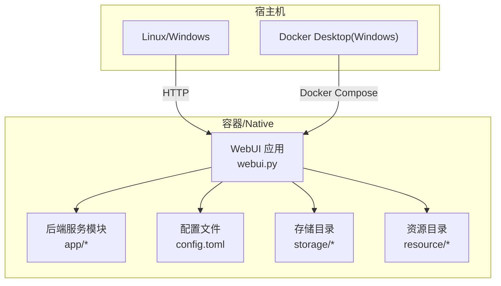
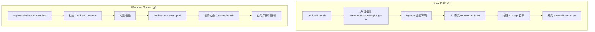
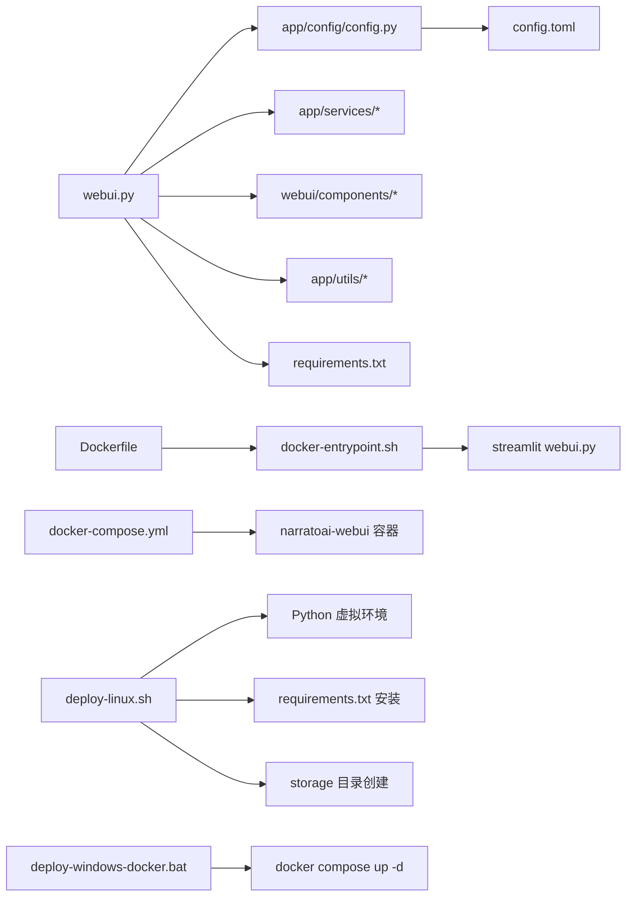

# 本地环境部署

<cite>
**本文引用的文件**
- [README.md](file://README.md)
- [deploy-linux.sh](file://deploy-linux.sh)
- [deploy-windows-docker.bat](file://deploy-windows-docker.bat)
- [requirements.txt](file://requirements.txt)
- [config.example.toml](file://config.example.toml)
- [Dockerfile](file://Dockerfile)
- [docker-compose.yml](file://docker-compose.yml)
- [docker-entrypoint.sh](file://docker-entrypoint.sh)
- [webui.py](file://webui.py)
- [Makefile](file://Makefile)
- [docker-deploy.sh](file://docker-deploy.sh)
- [app/config/config.py](file://app/config/config.py)
</cite>

## 目录
1. [简介](#简介)
2. [项目结构](#项目结构)
3. [核心组件](#核心组件)
4. [架构总览](#架构总览)
5. [详细组件分析](#详细组件分析)
6. [依赖关系分析](#依赖关系分析)
7. [性能与资源建议](#性能与资源建议)
8. [故障排查指南](#故障排查指南)
9. [结论](#结论)
10. [附录](#附录)

## 简介
本指南面向希望在本地部署 NarratoAI 的用户，覆盖 Linux 与 Windows 平台两种主要方式：
- Linux 平台：提供一键部署脚本，自动安装系统依赖、Python 环境、虚拟环境、Python 依赖，并可选择生成 systemd 服务以便开机自启与后台运行。
- Windows 平台：提供 Docker 一键部署脚本，自动检查 Docker 环境、构建镜像、启动容器、等待服务就绪并自动打开浏览器。

同时，文档还详细说明 requirements.txt 中各依赖的作用与版本兼容性、config.example.toml 的各项参数配置方法、环境变量与路径设置、权限配置、本地开发与调试方法，以及常见部署问题的排查与解决思路。

## 项目结构
项目采用“前端 WebUI + 后端服务模块”的分层组织，核心入口为 WebUI 应用，后端服务位于 app/ 目录，配置与资源分别位于 config/ 与 resource/，并提供多种部署脚本与容器编排文件。

图表来源
- [webui.py:1-294](file://webui.py#L1-L294)
- [docker-compose.yml:1-30](file://docker-compose.yml#L1-L30)

章节来源
- [README.md:105-141](file://README.md#L105-L141)
- [webui.py:1-294](file://webui.py#L1-L294)
- [docker-compose.yml:1-30](file://docker-compose.yml#L1-L30)

## 核心组件
- WebUI 应用入口：负责页面渲染、参数收集、任务调度与进度反馈。
- 配置系统：读取 TOML 配置，支持多 Provider 的 LLM/TTS 配置与代理设置。
- Docker 编排：通过 Dockerfile 与 docker-compose.yml 实现镜像构建、服务暴露、卷挂载与健康检查。
- 一键部署脚本：
  - Linux：deploy-linux.sh，支持完整安装、仅启动、停止、状态查看、systemd 服务生成与端口/镜像源等环境变量控制。
  - Windows：deploy-windows-docker.bat，支持完整部署、停止、状态、日志、重启、重建镜像等模式。
- Makefile：提供常用 Docker 管理命令的封装。
- 依赖清单：requirements.txt，定义核心依赖、AI 服务依赖、图像处理、进度条与重试机制、可选依赖等。

章节来源
- [webui.py:1-294](file://webui.py#L1-L294)
- [app/config/config.py:1-95](file://app/config/config.py#L1-L95)
- [Dockerfile:1-89](file://Dockerfile#L1-L89)
- [docker-compose.yml:1-30](file://docker-compose.yml#L1-L30)
- [deploy-linux.sh:1-529](file://deploy-linux.sh#L1-L529)
- [deploy-windows-docker.bat:1-372](file://deploy-windows-docker.bat#L1-L372)
- [Makefile:1-64](file://Makefile#L1-L64)
- [requirements.txt:1-39](file://requirements.txt#L1-L39)

## 架构总览
下图展示本地部署的两种路径：Linux 本地运行与 Windows Docker 运行，二者最终都通过 WebUI 提供图形界面与任务执行能力。

图表来源
- [deploy-linux.sh:459-529](file://deploy-linux.sh#L459-L529)
- [deploy-windows-docker.bat:341-372](file://deploy-windows-docker.bat#L341-L372)
- [docker-compose.yml:1-30](file://docker-compose.yml#L1-L30)

## 详细组件分析

### Linux 本地部署脚本：deploy-linux.sh
- 支持模式
  - full：完整安装（默认），包含系统依赖、Python 环境、虚拟环境、Python 依赖、目录创建、配置初始化、systemd 服务生成与可选启动。
  - run：仅启动，跳过安装步骤。
  - stop：停止服务（支持 systemd 与 PID 文件）。
  - status：查看运行状态（支持 systemd 与进程名匹配）。
- 环境变量
  - APP_PORT：应用端口，默认 8501。
  - APP_HOST：监听地址，默认 0.0.0.0。
  - PIP_MIRROR：pip 镜像源，默认官方源。
- 关键流程
  - 操作系统检测与包管理器识别（Ubuntu/Debian/CentOS/RHEL/Fedora/macOS）。
  - Python 版本检测（3.10+，优先 3.12），必要时自动安装。
  - 安装系统依赖（FFmpeg、ImageMagick、git、git-lfs、curl、编译工具、libsndfile 等），并修复 ImageMagick 策略。
  - 创建并激活虚拟环境，升级 pip/setuptools/wheel，安装 requirements.txt。
  - 创建 storage 目录结构。
  - 初始化 config.toml（若不存在则复制模板）。
  - 生成 systemd 服务文件（可选），并提示如何启用开机自启。
  - 启动 WebUI（streamlit run webui.py），支持本地与局域网访问提示。
- 注意事项
  - 首次运行需编辑 config.toml 填写 API 密钥。
  - 若系统包安装失败，脚本会给出提示，可按需手动安装。
  - 如需后台运行，可使用生成的 systemd 服务文件并启用。

章节来源
- [deploy-linux.sh:1-529](file://deploy-linux.sh#L1-L529)

### Windows Docker 一键部署脚本：deploy-windows-docker.bat
- 支持模式
  - full：完整部署（默认），检查 Docker/Compose、检查/创建配置、创建目录、构建镜像、启动服务、等待就绪、自动打开浏览器。
  - stop/status/logs/restart/rebuild：停止、查看状态、查看日志、重启、强制重建。
- 关键流程
  - 检查 Docker 与 Docker Compose，尝试启动 Docker Desktop 并等待就绪。
  - 检查/创建 config.toml，创建 storage 与 resource 目录。
  - 构建镜像（docker compose build），启动容器（docker compose up -d）。
  - 等待服务就绪（轮询 /_stcore/health），支持 curl 或 PowerShell。
  - 输出常用命令与 Docker 命令，自动打开浏览器。
- 注意事项
  - 需要安装并启用 Docker Desktop，建议使用 WSL2 后端。
  - 首次使用需在 Web 界面配置 API 密钥。
  - 如启动超时，可使用 status/logs 检查容器状态与日志。

章节来源
- [deploy-windows-docker.bat:1-372](file://deploy-windows-docker.bat#L1-L372)

### Docker 编排与入口脚本
- Dockerfile
  - 多阶段构建：构建阶段安装 Python 依赖，运行阶段仅保留精简运行时。
  - 安装 FFmpeg、ImageMagick、git-lfs、CA 证书等系统依赖。
  - 创建非 root 用户 narratoai，设置环境变量（PYTHONPATH、LANG、TZ 等）。
  - 健康检查：对 /_stcore/health 进行探测。
  - 入口脚本：docker-entrypoint.sh，负责检查/创建目录、安装运行时依赖、启动 WebUI。
- docker-compose.yml
  - 暴露 8501 端口，挂载 storage、config.toml、resource。
  - 健康检查与重启策略。
- docker-entrypoint.sh
  - 检查 requirements.txt 是否更新，必要时安装依赖（优先 sudo，失败则用户级安装）。
  - 检查/创建 config.toml 与 storage 目录。
  - 启动 streamlit webui.py，设置服务器参数与日志级别。

章节来源
- [Dockerfile:1-89](file://Dockerfile#L1-L89)
- [docker-compose.yml:1-30](file://docker-compose.yml#L1-L30)
- [docker-entrypoint.sh:1-145](file://docker-entrypoint.sh#L1-L145)

### WebUI 应用入口：webui.py
- 页面配置与国际化：设置页面标题、布局、菜单项、国际化资源加载。
- 日志初始化：使用 loguru，过滤无关噪音日志，启动后动态设置高级过滤器。
- 全局状态初始化：维护视频剪辑 JSON、剧情文本、用户设置与 UI 语言。
- 生成按钮与任务调度：收集脚本、视频、音频、字幕参数，创建任务并轮询状态，实时更新进度条与结果展示。
- LLM 提供商注册：应用启动时注册提供商，失败时记录错误并提示检查配置。
- FFmpeg 硬件加速检测：仅记录一次检测结果，不可用时提示使用 CPU 软件编码。

章节来源
- [webui.py:1-294](file://webui.py#L1-L294)

### 配置文件：config.example.toml
- 应用与 LLM 配置
  - app：项目版本、LLM 超时与重试、LiteLLM 统一接口配置（视觉/文本模型提供商、模型名称、API Key、Base URL）。
  - 传统 Provider 配置示例（可选）：保留历史配置参考。
- TTS 配置
  - azure、tencent、soulvoice、tts_qwen、indextts2：各 TTS 引擎的密钥、地域、API 地址、模型与推理参数。
- UI 配置
  - ui：TTS 引擎选择与具体引擎的语音、音量、语速、音高等参数。
- 代理与网络
  - proxy：HTTP/HTTPS 代理开关与地址。
- 视频处理
  - frames：关键帧提取间隔与视觉批处理大小。

章节来源
- [config.example.toml:1-177](file://config.example.toml#L1-L177)

### 依赖清单：requirements.txt
- 核心依赖
  - requests、moviepy、edge-tts、streamlit、watchdog、loguru、tomli/tomli-w、pydub、pysrt。
- AI 服务依赖
  - openai、litellm、google-generativeai、azure-cognitiveservices-speech、tencentcloud-sdk-python、dashscope。
- 图像处理
  - Pillow。
- 进度条与重试
  - tqdm、tenacity。
- 可选依赖（按需启用）
  - faster-whisper、opencv-python、torch/torchvision/torchaudio（CUDA 支持）。

章节来源
- [requirements.txt:1-39](file://requirements.txt#L1-L39)

### Makefile 与 docker-deploy.sh
- Makefile：提供 deploy/build/up/down/restart/logs/shell/ps/clean/config 等常用命令封装。
- docker-deploy.sh：检查 Docker/Compose/服务状态，检查/复制配置，构建镜像，启动服务，等待健康检查，输出常用命令。

章节来源
- [Makefile:1-64](file://Makefile#L1-L64)
- [docker-deploy.sh:1-185](file://docker-deploy.sh#L1-L185)

## 依赖关系分析

图表来源
- [webui.py:1-294](file://webui.py#L1-L294)
- [app/config/config.py:1-95](file://app/config/config.py#L1-L95)
- [Dockerfile:1-89](file://Dockerfile#L1-L89)
- [docker-compose.yml:1-30](file://docker-compose.yml#L1-L30)
- [docker-entrypoint.sh:1-145](file://docker-entrypoint.sh#L1-L145)
- [deploy-linux.sh:1-529](file://deploy-linux.sh#L1-L529)
- [deploy-windows-docker.bat:1-372](file://deploy-windows-docker.bat#L1-L372)

## 性能与资源建议
- 硬件建议
  - 至少 4 核 CPU、8GB 内存，显卡非必需。
- 软件建议
  - Python 3.12+，Streamlit 1.45+，FFmpeg 与 ImageMagick 已就绪。
  - 若使用 LiteLLM，建议合理设置超时与重试次数，避免长耗时任务阻塞。
- Docker 环境
  - Windows 建议启用 WSL2 后端，确保 Docker Desktop 正常运行。
  - 首次构建镜像可能较慢，后续可利用缓存加速。

[本节为通用建议，无需特定文件来源]

## 故障排查指南

### Linux 一键部署常见问题
- Python 未找到或版本过低
  - 现象：脚本提示未找到 Python 3.10+。
  - 处理：脚本会尝试自动安装 Python 3.12；若失败，请手动安装 Python 3.12 并确保在 PATH 中。
- 系统依赖安装失败
  - 现象：FFmpeg、ImageMagick、git-lfs 等安装失败。
  - 处理：根据提示手动安装；注意不同发行版的包管理器差异。
- 虚拟环境创建失败
  - 现象：venv 创建失败。
  - 处理：尝试安装对应发行版的 python3-venv 包后再创建。
- requirements.txt 安装失败
  - 现象：部分包通过镜像源安装失败。
  - 处理：脚本会回退到默认源；若仍失败，可手动 pip 安装或检查网络。
- ImageMagick 策略限制
  - 现象：图片读写受限。
  - 处理：脚本会尝试修复 policy.xml；若失败，手动调整策略。
- 启动后无法访问
  - 现象：浏览器无法访问 8501 端口。
  - 处理：确认防火墙放行端口，检查 APP_HOST 与 APP_PORT；使用 status 查看运行状态。

章节来源
- [deploy-linux.sh:83-215](file://deploy-linux.sh#L83-L215)
- [deploy-linux.sh:246-266](file://deploy-linux.sh#L246-L266)
- [deploy-linux.sh:422-457](file://deploy-linux.sh#L422-L457)

### Windows Docker 部署常见问题
- Docker 未安装或未运行
  - 现象：提示未检测到 Docker 或 Docker Desktop 未运行。
  - 处理：安装 Docker Desktop，启用 WSL2 后端，启动服务并等待其完全启动。
- Docker Compose 不可用
  - 现象：提示 Docker Compose 不可用。
  - 处理：确保安装最新版 Docker Desktop（内置 Compose）。
- 镜像构建失败
  - 现象：构建阶段失败。
  - 处理：检查网络与 Dockerfile 配置，重试或使用 --no-cache 重建。
- 服务启动超时
  - 现象：等待 /_stcore/health 超时。
  - 处理：使用 status/logs 查看容器状态与日志，定位问题。
- 端口冲突
  - 现象：端口 8501 被占用。
  - 处理：修改 APP_PORT 或释放端口占用。

章节来源
- [deploy-windows-docker.bat:77-142](file://deploy-windows-docker.bat#L77-L142)
- [deploy-windows-docker.bat:178-207](file://deploy-windows-docker.bat#L178-L207)
- [deploy-windows-docker.bat:209-237](file://deploy-windows-docker.bat#L209-L237)

### 配置文件与 API 密钥
- 未找到 config.toml
  - 现象：首次运行提示未找到配置文件。
  - 处理：脚本会复制模板；手动编辑 config.toml 填写 API Key。
- API 密钥无效或缺失
  - 现象：LLM/TTS 功能不可用或报错。
  - 处理：根据注释中的链接获取各 Provider 的 API Key，并填入对应字段。
- 代理设置
  - 现象：网络受限导致请求失败。
  - 处理：在 proxy 段启用代理并填写 http/https 地址。

章节来源
- [config.example.toml:1-177](file://config.example.toml#L1-L177)
- [app/config/config.py:24-44](file://app/config/config.py#L24-L44)

### Docker 健康检查与日志
- 健康检查失败
  - 现象：Health Status 异常。
  - 处理：查看容器日志，检查 WebUI 启动是否成功。
- 日志定位
  - 命令：docker compose logs -f --tail=100。
  - 处理：结合日志中的错误堆栈定位问题。

章节来源
- [docker-compose.yml:23-29](file://docker-compose.yml#L23-L29)
- [docker-entrypoint.sh:130-140](file://docker-entrypoint.sh#L130-L140)

## 结论
通过本指南，您可以在 Linux 与 Windows 平台上完成 NarratoAI 的本地部署：
- Linux：使用 deploy-linux.sh 完成系统依赖、Python 环境与依赖安装，并可生成 systemd 服务实现后台运行。
- Windows：使用 deploy-windows-docker.bat 完成 Docker 环境检查、镜像构建与容器启动，并自动打开浏览器。
同时，建议在部署完成后编辑 config.toml 填写 API 密钥与代理设置，确保 LLM 与 TTS 功能正常。遇到问题时，可借助 status/logs 与 Makefile 常用命令进行排查。

[本节为总结，无需特定文件来源]

## 附录

### 环境变量与路径设置
- Linux
  - APP_PORT：WebUI 端口（默认 8501）。
  - APP_HOST：监听地址（默认 0.0.0.0）。
  - PIP_MIRROR：pip 镜像源（默认官方源）。
- Windows Docker
  - 通过 docker-compose.yml 暴露 8501 端口，可通过宿主机映射调整。
- 路径
  - storage：用于临时文件、任务、JSON、旁白脚本、剧情分析等。
  - resource：公共资源目录。
  - config.toml：应用配置文件。

章节来源
- [deploy-linux.sh:24-60](file://deploy-linux.sh#L24-L60)
- [docker-compose.yml:12-15](file://docker-compose.yml#L12-L15)

### 权限配置
- Linux
  - 脚本会创建 storage 目录并设置权限；建议确保当前用户对项目目录有读写权限。
- Windows Docker
  - 容器内使用非 root 用户 narratoai，卷挂载 storage 与 resource；确保宿主机对这些目录有读写权限。

章节来源
- [Dockerfile:61-75](file://Dockerfile#L61-L75)
- [docker-compose.yml:12-15](file://docker-compose.yml#L12-L15)

### 本地开发与调试
- 本地运行
  - 安装依赖后，使用 streamlit 运行 webui.py，并设置最大上传大小与日志级别。
- Docker 调试
  - 进入容器：docker-compose exec narratoai-webui bash。
  - 查看日志：docker-compose logs -f。
  - 重启服务：docker-compose restart。
- Makefile 常用命令
  - make deploy/build/up/down/restart/logs/shell/ps/clean/config。

章节来源
- [webui.py:422-457](file://webui.py#L422-L457)
- [Makefile:17-63](file://Makefile#L17-L63)