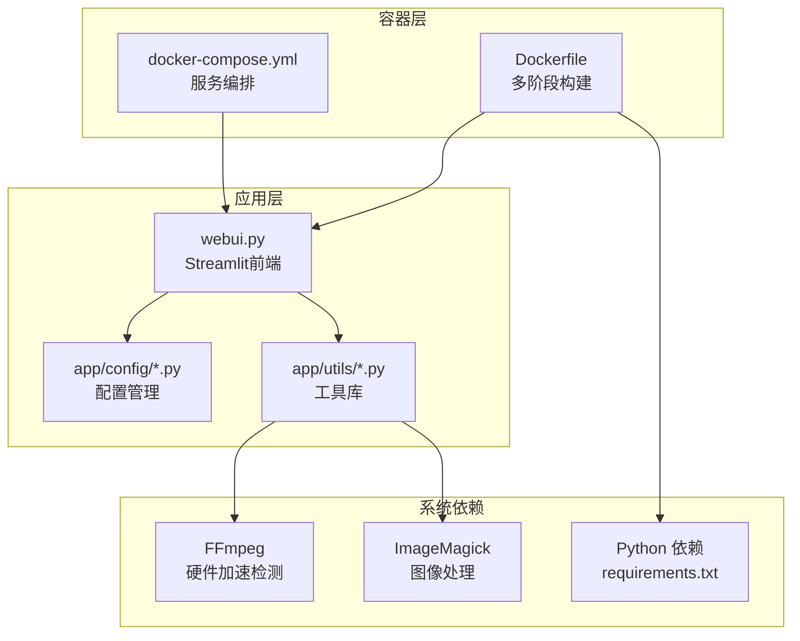
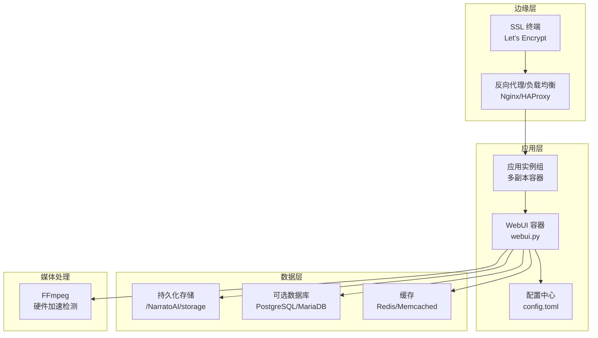
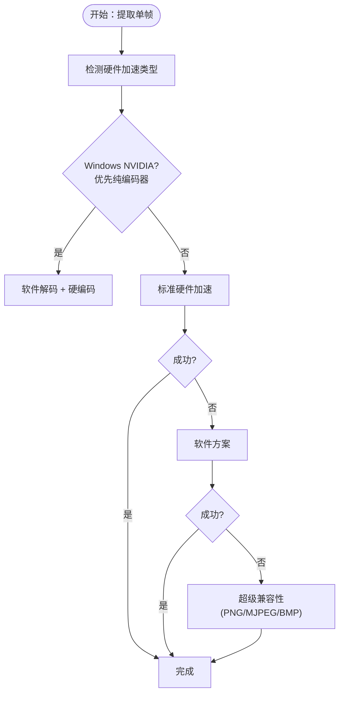
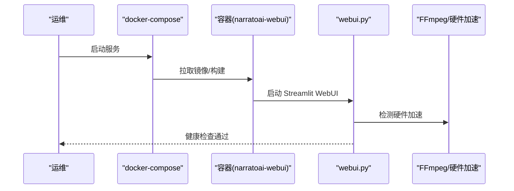
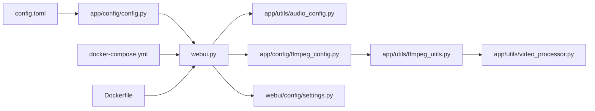

# 生产环境配置

<cite>
**本文引用的文件**
- [config.example.toml](file://config.example.toml)
- [Dockerfile](file://Dockerfile)
- [docker-compose.yml](file://docker-compose.yml)
- [deploy-linux.sh](file://deploy-linux.sh)
- [requirements.txt](file://requirements.txt)
- [app/config/config.py](file://app/config/config.py)
- [app/config/audio_config.py](file://app/config/audio_config.py)
- [app/config/ffmpeg_config.py](file://app/config/ffmpeg_config.py)
- [webui/config/settings.py](file://webui/config/settings.py)
- [webui.py](file://webui.py)
- [app/utils/ffmpeg_utils.py](file://app/utils/ffmpeg_utils.py)
- [app/utils/video_processor.py](file://app/utils/video_processor.py)
- [README.md](file://README.md)
</cite>

## 目录
1. [简介](#简介)
2. [项目结构](#项目结构)
3. [核心组件](#核心组件)
4. [架构总览](#架构总览)
5. [详细组件分析](#详细组件分析)
6. [依赖关系分析](#依赖关系分析)
7. [性能考虑](#性能考虑)
8. [故障排查指南](#故障排查指南)
9. [结论](#结论)
10. [附录](#附录)

## 简介
本指南面向生产环境部署与运维，围绕 NarratoAI 的系统要求、硬件配置建议、配置优化、音频/视频处理性能调优、高可用与负载均衡、SSL/反向代理与网络安全、数据库与缓存、监控与日志、备份与灾难恢复、滚动更新等维度，提供可操作的实施建议与最佳实践。

## 项目结构
- 应用采用 Streamlit WebUI 作为前端界面，后端服务通过 Python 服务模块提供能力。
- 配置由 config.toml 驱动，支持 LLM、TTS、代理、视频处理等模块化配置。
- Dockerfile 与 docker-compose.yml 提供容器化部署入口。
- deploy-linux.sh 提供 Linux 一键安装与 systemd 管理脚本。
- FFmpeg 为核心媒体处理依赖，提供硬件加速检测与多平台兼容性策略。

**图表来源**
- [Dockerfile:1-89](file://Dockerfile#L1-L89)
- [docker-compose.yml:1-30](file://docker-compose.yml#L1-L30)
- [webui.py:1-294](file://webui.py#L1-L294)
- [app/config/config.py:1-95](file://app/config/config.py#L1-L95)
- [app/utils/ffmpeg_utils.py:1-800](file://app/utils/ffmpeg_utils.py#L1-L800)
- [requirements.txt:1-39](file://requirements.txt#L1-L39)

**章节来源**
- [README.md:105-141](file://README.md#L105-L141)
- [Dockerfile:1-89](file://Dockerfile#L1-L89)
- [docker-compose.yml:1-30](file://docker-compose.yml#L1-L30)

## 核心组件
- 配置系统：集中于 config.toml，支持 LLM、TTS、代理、视频处理等模块化配置；同时提供 WebUI 配置读取与保存。
- 媒体处理：基于 FFmpeg，内置硬件加速检测与多配置文件策略，覆盖 Windows/NVIDIA、macOS/VideoToolbox、Linux/VAAPI 等平台。
- 音频处理：提供音量、响度、峰值、交叉淡化、动态压缩等参数化配置，支持按内容类型与场景的音量优化。
- 部署与运行：Dockerfile 提供多阶段构建与健康检查；docker-compose 提供服务编排；deploy-linux.sh 提供系统依赖安装、虚拟环境、systemd 服务生成与启动。

**章节来源**
- [config.example.toml:1-177](file://config.example.toml#L1-L177)
- [app/config/config.py:1-95](file://app/config/config.py#L1-L95)
- [app/config/ffmpeg_config.py:1-285](file://app/config/ffmpeg_config.py#L1-L285)
- [app/config/audio_config.py:1-221](file://app/config/audio_config.py#L1-L221)
- [app/utils/ffmpeg_utils.py:1-800](file://app/utils/ffmpeg_utils.py#L1-L800)
- [webui/config/settings.py:1-175](file://webui/config/settings.py#L1-L175)
- [Dockerfile:1-89](file://Dockerfile#L1-L89)
- [docker-compose.yml:1-30](file://docker-compose.yml#L1-L30)
- [deploy-linux.sh:1-529](file://deploy-linux.sh#L1-L529)

## 架构总览
生产环境建议采用“容器化 + 反向代理 + 负载均衡 + 数据持久化”的架构，结合 SSL/TLS 与 WAF/防火墙实现安全加固。

[本图为概念性架构示意，不直接映射具体源文件，故无“图表来源”]

## 详细组件分析

### 系统要求与硬件配置建议
- CPU：建议至少 4 核，高并发场景建议 8 核以上。
- 内存：建议 8GB，高并发与大视频处理建议 16GB+。
- 存储：建议 SSD，预留足够空间用于临时文件与输出视频；根据并发与视频分辨率估算容量。
- GPU：非必需；若使用 NVIDIA/AMD/Intel 集成显卡，可启用硬件加速以提升 FFmpeg 性能与稳定性。

**章节来源**
- [README.md:143-148](file://README.md#L143-L148)

### config.toml 生产优化要点
- LLM 超时与重试：合理设置文本/视觉模型超时与重试次数，避免请求堆积导致延迟放大。
- API Key 管理：将敏感信息置于环境变量或密钥管理服务，避免明文写入配置文件。
- TTS 引擎：根据目标地区与音色选择合适引擎，控制并发与队列长度。
- 代理与网络：在内网/受限网络环境下配置 HTTP/HTTPS 代理，确保对外 API 可达性。
- 视频处理：通过 frames 模块控制关键帧提取间隔与批处理大小，平衡质量与性能。

**章节来源**
- [config.example.toml:1-177](file://config.example.toml#L1-L177)
- [app/config/config.py:1-95](file://app/config/config.py#L1-L95)

### FFmpeg 参数调优与硬件加速
- 自动检测：启动时检测 FFmpeg 硬件加速可用性，按平台与 GPU 类型选择最优方案。
- 配置文件策略：提供高性能、兼容性、Windows NVIDIA、macOS VideoToolbox、通用软件等配置文件，按环境自动选择。
- 多策略回退：优先纯编码器方案（Windows NVIDIA 避免滤镜链问题），其次标准硬件加速，最后软件方案。
- 超级兼容性：针对 Windows MJPEG 编码问题，提供 PNG->JPG 转换与备选格式策略。

**图表来源**
- [app/utils/video_processor.py:188-407](file://app/utils/video_processor.py#L188-L407)
- [app/utils/ffmpeg_utils.py:252-355](file://app/utils/ffmpeg_utils.py#L252-L355)
- [app/config/ffmpeg_config.py:98-141](file://app/config/ffmpeg_config.py#L98-L141)

**章节来源**
- [app/utils/ffmpeg_utils.py:1-800](file://app/utils/ffmpeg_utils.py#L1-L800)
- [app/config/ffmpeg_config.py:1-285](file://app/config/ffmpeg_config.py#L1-L285)
- [app/utils/video_processor.py:1-670](file://app/utils/video_processor.py#L1-L670)

### 音频处理与混合优化
- 音量与响度：提供 LUFS 目标与峰值限制，支持按内容类型（教育、娱乐、新闻）与音量配置文件（均衡、语音聚焦、原声聚焦、静背景）自动优化。
- 混合参数：交叉淡化、BGM 淡出、动态范围压缩等参数可调，兼顾自然度与清晰度。
- 校验与限制：对音量上下限进行验证与限制，防止异常值影响最终效果。

**章节来源**
- [app/config/audio_config.py:1-221](file://app/config/audio_config.py#L1-L221)

### 部署与运行（Docker 与 systemd）
- Dockerfile：多阶段构建，安装 FFmpeg、ImageMagick、CA 证书与系统工具，设置健康检查与非 root 用户运行。
- docker-compose：挂载 storage、config.toml、resource，暴露 8501 端口，配置健康检查。
- deploy-linux.sh：安装系统依赖（FFmpeg、ImageMagick、Git LFS 等），创建 Python 虚拟环境，安装 Python 依赖，生成 systemd 服务文件，支持前台/后台启动与状态查询。

**图表来源**
- [docker-compose.yml:1-30](file://docker-compose.yml#L1-L30)
- [Dockerfile:1-89](file://Dockerfile#L1-L89)
- [webui.py:247-257](file://webui.py#L247-L257)

**章节来源**
- [Dockerfile:1-89](file://Dockerfile#L1-L89)
- [docker-compose.yml:1-30](file://docker-compose.yml#L1-L30)
- [deploy-linux.sh:1-529](file://deploy-linux.sh#L1-L529)

### 负载均衡与高可用
- 多实例：通过 docker-compose 或容器编排工具（Kubernetes/Docker Swarm）部署多个应用实例。
- 反向代理：Nginx/HAProxy 前置，配置健康检查与会话亲和（如需）。
- 存储共享：使用共享存储（NFS/S3）存放 config.toml 与输出文件，确保多实例一致性。
- 自动扩缩容：基于 CPU/内存/请求量触发扩缩容，结合队列与限流控制突发流量。

[本节为通用架构建议，不直接分析具体源文件，故无“章节来源”]

### SSL 证书、反向代理与网络安全
- SSL 终端：使用 Let’s Encrypt 自动签发与续期，前置 Nginx/HAProxy。
- 反向代理：配置静态资源缓存、Gzip 压缩、超时与限速；开启 HTTPS 强制跳转。
- 网络安全：限制来源 IP、启用 WAF、关闭不必要的端口；对敏感 API Key 使用密钥管理服务。

[本节为通用安全建议，不直接分析具体源文件，故无“章节来源”]

### 数据库、缓存与会话管理
- 数据库：可选 PostgreSQL/MariaDB 存放任务状态、用户设置与审计日志；使用连接池与只读副本提升读扩展。
- 缓存：Redis/Memcached 缓存热点配置与中间结果；注意键空间淘汰策略与过期时间。
- 会话：使用安全的 HttpOnly SameSite Cookie，配合反向代理的 TLS 终端与 HSTS。

[本节为通用架构建议，不直接分析具体源文件，故无“章节来源”]

### 监控指标、日志轮转与告警
- 指标：CPU/内存/磁盘/网络、容器健康状态、请求延迟与错误率、队列长度、FFmpeg 处理耗时。
- 日志：STDOUT/STDERR 结合 loguru，按级别输出；使用 journald/rsyslog 收集并轮转；关键错误与异常告警。
- 告警：阈值告警（CPU/内存/队列长度）与事件告警（容器重启、健康检查失败）。

**章节来源**
- [webui.py:35-110](file://webui.py#L35-L110)

### 备份策略、灾难恢复与滚动更新
- 备份：定期备份 config.toml、storage 目录、数据库与缓存快照；异地容灾。
- 灾难恢复：演练 RTO/RPO，验证备份可恢复性；准备回滚版本与配置回退。
- 滚动更新：蓝绿/金丝雀发布，逐步切换流量；更新前健康检查与灰度验证。

[本节为通用运维建议，不直接分析具体源文件，故无“章节来源”]

## 依赖关系分析

**图表来源**
- [app/config/config.py:1-95](file://app/config/config.py#L1-L95)
- [webui.py:1-294](file://webui.py#L1-L294)
- [app/config/audio_config.py:1-221](file://app/config/audio_config.py#L1-L221)
- [app/config/ffmpeg_config.py:1-285](file://app/config/ffmpeg_config.py#L1-L285)
- [app/utils/ffmpeg_utils.py:1-800](file://app/utils/ffmpeg_utils.py#L1-L800)
- [app/utils/video_processor.py:1-670](file://app/utils/video_processor.py#L1-L670)
- [webui/config/settings.py:1-175](file://webui/config/settings.py#L1-L175)
- [docker-compose.yml:1-30](file://docker-compose.yml#L1-L30)
- [Dockerfile:1-89](file://Dockerfile#L1-L89)

**章节来源**
- [app/config/config.py:1-95](file://app/config/config.py#L1-L95)
- [webui.py:1-294](file://webui.py#L1-L294)
- [app/utils/ffmpeg_utils.py:1-800](file://app/utils/ffmpeg_utils.py#L1-L800)

## 性能考虑
- 并发与队列：限制同时处理任务数量，避免 CPU/内存/磁盘争用；对 LLM/TTS 请求进行限速与重试退避。
- 硬件加速：优先启用硬件加速，Windows NVIDIA 使用纯编码器方案；Linux/macOS 根据平台选择 CUDA/VAAPI/VideoToolbox。
- 存储 I/O：使用 SSD；关键帧与中间产物及时清理；对大文件传输启用断点续传与压缩。
- 缓存策略：对重复的视觉分析与 TTS 请求进行缓存，缩短响应时间。

[本节提供通用性能建议，不直接分析具体源文件，故无“章节来源”]

## 故障排查指南
- FFmpeg 未安装：确认系统已安装 FFmpeg 与 ImageMagick；必要时修复 policy.xml。
- 硬件加速不可用：查看日志中的检测结果与建议；尝试兼容性配置文件或软件方案。
- 端口占用：确认 8501 端口未被占用；docker-compose 暴露端口与宿主机映射正确。
- 配置加载失败：检查 config.toml 格式与编码；必要时使用 config.example.toml 作为模板。
- 日志过滤：应用启动后设置更严格的日志过滤器，避免噪音干扰。

**章节来源**
- [deploy-linux.sh:154-215](file://deploy-linux.sh#L154-L215)
- [webui.py:35-110](file://webui.py#L35-L110)
- [app/utils/ffmpeg_utils.py:118-136](file://app/utils/ffmpeg_utils.py#L118-L136)

## 结论
通过合理的系统与硬件配置、生产化的 config.toml 优化、FFmpeg 硬件加速与多策略回退、完善的监控与日志体系，以及容器化与负载均衡的部署架构，NarratoAI 可在生产环境中稳定、高效地提供影视解说与自动化剪辑服务。建议结合业务规模与合规要求，持续迭代安全与高可用策略。

## 附录
- 快速启动（Docker Compose）
  - docker compose up -d
  - 访问 http://localhost:8501
- 一键部署（Linux）
  - ./deploy-linux.sh run
  - systemd 管理：sudo systemctl enable --now narratoai

**章节来源**
- [README.md:107-141](file://README.md#L107-L141)
- [deploy-linux.sh:422-457](file://deploy-linux.sh#L422-L457)