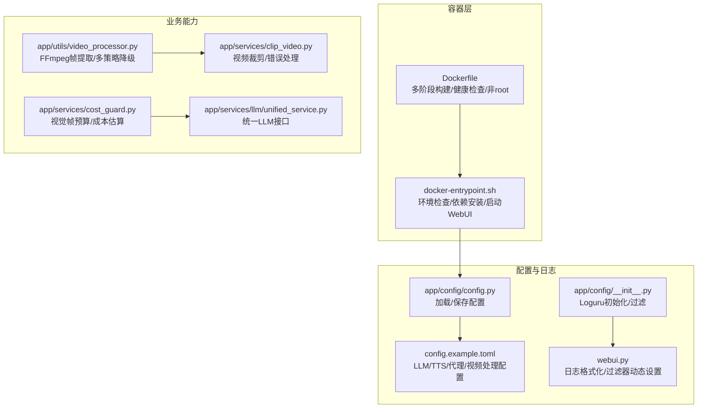
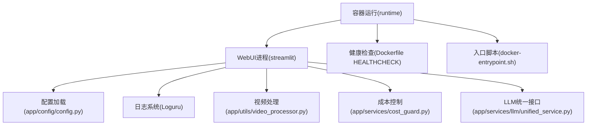
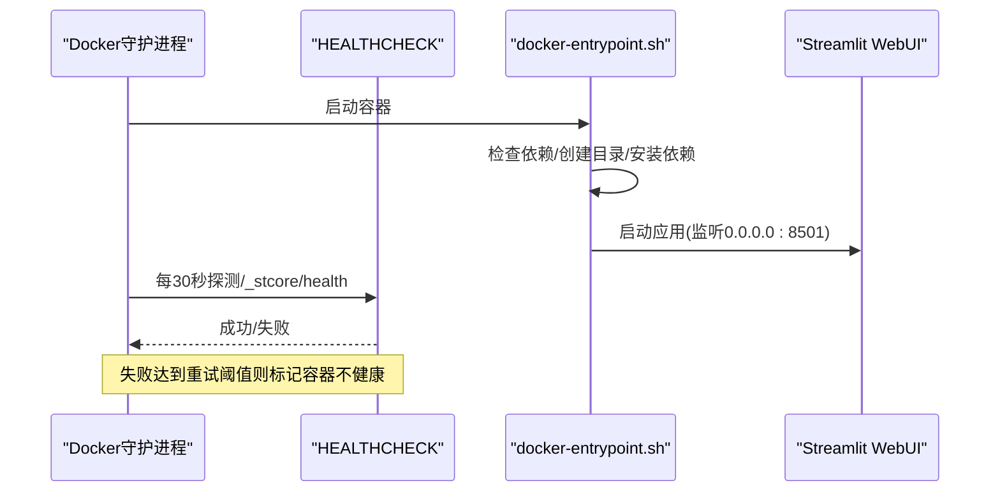
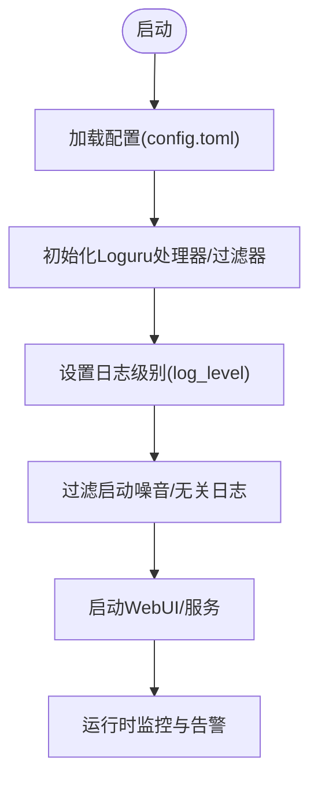
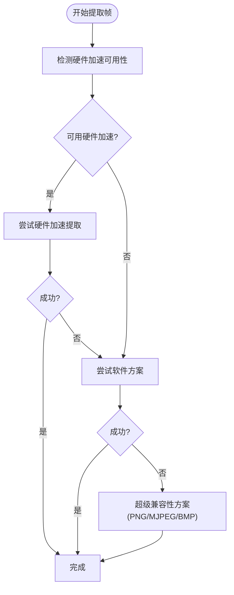
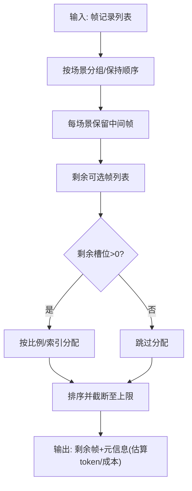
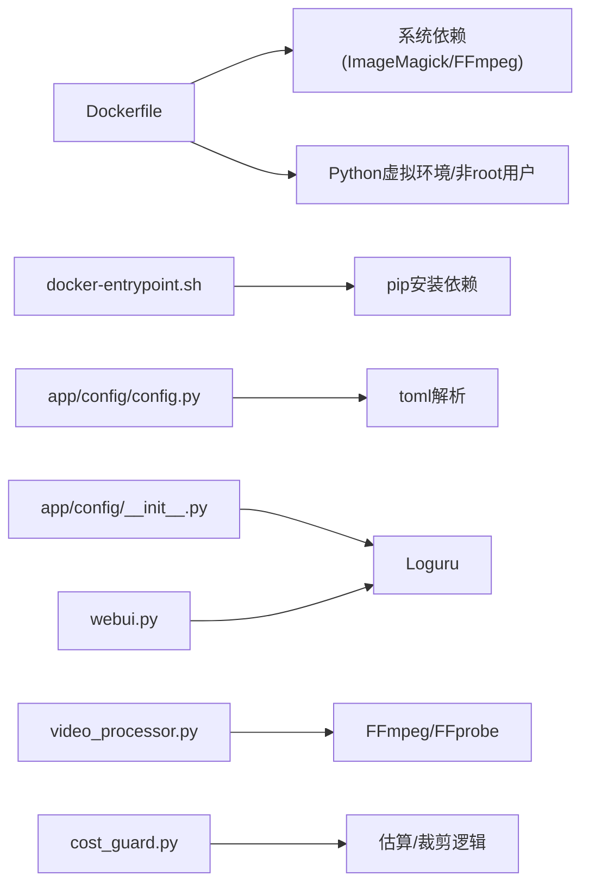

# 监控与维护

<cite>
**本文引用的文件**   
- [Dockerfile](file://Dockerfile)
- [docker-entrypoint.sh](file://docker-entrypoint.sh)
- [config.example.toml](file://config.example.toml)
- [app/config/config.py](file://app/config/config.py)
- [app/config/__init__.py](file://app/config/__init__.py)
- [webui.py](file://webui.py)
- [app/utils/utils.py](file://app/utils/utils.py)
- [app/utils/video_processor.py](file://app/utils/video_processor.py)
- [app/services/cost_guard.py](file://app/services/cost_guard.py)
- [app/services/llm/unified_service.py](file://app/services/llm/unified_service.py)
- [app/services/clip_video.py](file://app/services/clip_video.py)
- [.gitignore](file://.gitignore)
- [webui/components/system_settings.py](file://webui/components/system_settings.py)
</cite>

## 目录
1. [简介](#简介)
2. [项目结构](#项目结构)
3. [核心组件](#核心组件)
4. [架构总览](#架构总览)
5. [详细组件分析](#详细组件分析)
6. [依赖关系分析](#依赖关系分析)
7. [性能考量](#性能考量)
8. [故障排查指南](#故障排查指南)
9. [结论](#结论)
10. [附录](#附录)

## 简介
本指南面向运维与开发团队，围绕 NarratoAI 的监控与维护提供系统化方法论与实操建议。内容覆盖应用性能监控、日志管理策略、成本控制与限额、健康检查与自动化维护、故障诊断与问题排查、备份与恢复、升级与补丁管理，以及用户行为与使用统计的采集思路。

## 项目结构
- 应用容器化运行，基于多阶段构建，内置健康检查与非 root 用户执行。
- 日志系统采用 Loguru，支持标准输出与可选文件落盘；WebUI 启动参数可控制日志级别。
- 配置通过 TOML 文件集中管理，包含 LLM、TTS、代理、视频处理等关键参数。
- 视频处理模块封装 FFmpeg 调用，具备多策略降级与兼容性处理。
- 成本控制模块提供视觉帧预算估算与上限裁剪策略，辅助控制 LLM 输入 token 与成本。

**图表来源**
- [Dockerfile:1-89](file://Dockerfile#L1-L89)
- [docker-entrypoint.sh:1-145](file://docker-entrypoint.sh#L1-L145)
- [config.example.toml:1-177](file://config.example.toml#L1-L177)
- [app/config/config.py:24-95](file://app/config/config.py#L24-L95)
- [app/config/__init__.py:10-77](file://app/config/__init__.py#L10-L77)
- [webui.py:41-109](file://webui.py#L41-L109)
- [app/utils/video_processor.py:26-670](file://app/utils/video_processor.py#L26-L670)
- [app/services/cost_guard.py:13-98](file://app/services/cost_guard.py#L13-L98)
- [app/services/llm/unified_service.py:20-263](file://app/services/llm/unified_service.py#L20-L263)
- [app/services/clip_video.py:473-519](file://app/services/clip_video.py#L473-L519)

**章节来源**
- [Dockerfile:1-89](file://Dockerfile#L1-L89)
- [docker-entrypoint.sh:64-90](file://docker-entrypoint.sh#L64-L90)
- [config.example.toml:1-177](file://config.example.toml#L1-L177)
- [app/config/config.py:24-95](file://app/config/config.py#L24-L95)
- [app/config/__init__.py:10-77](file://app/config/__init__.py#L10-L77)
- [webui.py:41-109](file://webui.py#L41-L109)

## 核心组件
- 容器与健康检查：Dockerfile 定义 HEALTHCHECK，entrypoint 负责依赖安装与 WebUI 启动。
- 配置与日志：config.py 负责配置加载/保存；Loguru 初始化与过滤器在 app/config/__init__.py 与 webui.py 中实现。
- 视频处理：video_processor.py 封装 FFmpeg 帧提取，提供多策略降级与兼容性处理。
- 成本控制：cost_guard.py 提供视觉帧预算估算与上限裁剪，辅助控制 LLM 输入 token 与成本。
- LLM 统一接口：unified_service.py 提供统一的图片分析、文本生成、字幕分析等接口。
- 系统维护：system_settings.py 提供清理关键帧、剪辑视频、任务目录的 UI 操作。

**章节来源**
- [Dockerfile:83-85](file://Dockerfile#L83-L85)
- [docker-entrypoint.sh:92-113](file://docker-entrypoint.sh#L92-L113)
- [app/config/config.py:24-95](file://app/config/config.py#L24-L95)
- [app/config/__init__.py:10-77](file://app/config/__init__.py#L10-L77)
- [webui.py:41-109](file://webui.py#L41-L109)
- [app/utils/video_processor.py:26-670](file://app/utils/video_processor.py#L26-L670)
- [app/services/cost_guard.py:13-98](file://app/services/cost_guard.py#L13-L98)
- [app/services/llm/unified_service.py:20-263](file://app/services/llm/unified_service.py#L20-L263)
- [webui/components/system_settings.py:30-46](file://webui/components/system_settings.py#L30-L46)

## 架构总览
下图展示容器、配置、日志、视频处理与成本控制之间的交互关系，帮助理解监控与维护的关键触点。

**图表来源**
- [Dockerfile:83-85](file://Dockerfile#L83-L85)
- [docker-entrypoint.sh:92-113](file://docker-entrypoint.sh#L92-L113)
- [app/config/config.py:24-95](file://app/config/config.py#L24-L95)
- [app/config/__init__.py:10-77](file://app/config/__init__.py#L10-L77)
- [app/utils/video_processor.py:26-670](file://app/utils/video_processor.py#L26-L670)
- [app/services/cost_guard.py:13-98](file://app/services/cost_guard.py#L13-L98)
- [app/services/llm/unified_service.py:20-263](file://app/services/llm/unified_service.py#L20-L263)

## 详细组件分析

### 容器与健康检查
- 健康检查：容器层面通过 HEALTHCHECK 每 30 秒探测 WebUI 的健康端点，失败重试 3 次，启动期 60 秒后生效。
- 启动流程：entrypoint 负责检查依赖、创建必要目录、安装运行时依赖、启动 Streamlit 应用并设置日志级别。
- 非 root 用户：容器以 narratoai 用户运行，提升安全性。

**图表来源**
- [Dockerfile:83-85](file://Dockerfile#L83-L85)
- [docker-entrypoint.sh:92-113](file://docker-entrypoint.sh#L92-L113)

**章节来源**
- [Dockerfile:83-85](file://Dockerfile#L83-L85)
- [docker-entrypoint.sh:64-90](file://docker-entrypoint.sh#L64-L90)
- [docker-entrypoint.sh:92-113](file://docker-entrypoint.sh#L92-L113)

### 配置与日志管理
- 配置加载：config.py 从 config.toml 加载配置，若缺失则复制示例文件；支持 UTF-8-SIG 回退解析。
- 日志初始化：app/config/__init__.py 与 webui.py 共同负责日志格式化、过滤与动态调整，减少启动噪音。
- 日志级别：可通过配置项 log_level 控制，默认 DEBUG；WebUI 启动参数可设置 logger.level=info。

**图表来源**
- [app/config/config.py:24-44](file://app/config/config.py#L24-L44)
- [app/config/__init__.py:10-77](file://app/config/__init__.py#L10-L77)
- [webui.py:41-109](file://webui.py#L41-L109)

**章节来源**
- [app/config/config.py:24-44](file://app/config/config.py#L24-L44)
- [app/config/__init__.py:10-77](file://app/config/__init__.py#L10-L77)
- [webui.py:41-109](file://webui.py#L41-L109)

### 视频处理与性能监控
- 视频帧提取：video_processor.py 通过 FFmpeg 提取关键帧，提供多策略降级（硬件加速、软件解码、PNG->JPG 转换、MJPEG/BMP 兼容）。
- 性能指标：可结合 FFmpeg 进度条与日志统计成功率、失败率与耗时；在容器侧可配合系统监控工具观察 CPU/内存/磁盘 IO。
- 兼容性：Windows 环境下针对 NVIDIA 显卡提供专用滤镜链优化，避免硬件解码兼容性问题。

**图表来源**
- [app/utils/video_processor.py:188-407](file://app/utils/video_processor.py#L188-L407)
- [app/utils/video_processor.py:495-650](file://app/utils/video_processor.py#L495-L650)

**章节来源**
- [app/utils/video_processor.py:26-670](file://app/utils/video_processor.py#L26-L670)

### 成本控制与限额
- 视觉帧预算：cost_guard.py 提供视觉帧估算与上限裁剪，保证 token 数量与成本在可控范围内。
- 限额策略：通过 max_total_frames 限制代表帧数量，保留场景连续性的同时进行比例分配与回填。
- 成本估算：提供预估 token 与人民币成本，便于运营侧设定预算与告警阈值。

**图表来源**
- [app/services/cost_guard.py:26-98](file://app/services/cost_guard.py#L26-L98)

**章节来源**
- [app/services/cost_guard.py:13-98](file://app/services/cost_guard.py#L13-L98)

### LLM 统一接口与可观测性
- 统一接口：unified_service.py 提供图片分析、文本生成、字幕分析等统一方法，便于集中观测与埋点。
- 错误处理：捕获异常并记录详细日志，便于定位 Provider 与参数问题。
- 建议：在统一接口层增加调用耗时、token 统计与错误码上报，结合配置中的超时与重试参数进行成本与稳定性平衡。

**章节来源**
- [app/services/llm/unified_service.py:20-263](file://app/services/llm/unified_service.py#L20-L263)

### 系统维护与自动化
- 目录清理：system_settings.py 提供一键清理关键帧、剪辑视频与任务目录的 UI 操作，便于释放存储空间。
- 临时文件清理：file_utils 提供按时间清理临时文件的工具函数，适合集成到定时任务。
- 配置备份：.gitignore 中排除 config.toml 与 storage/，建议在 CI/CD 中纳入配置与关键数据的备份策略。

**章节来源**
- [webui/components/system_settings.py:30-46](file://webui/components/system_settings.py#L30-L46)
- [app/utils/utils.py:573-600](file://app/utils/utils.py#L573-L600)
- [.gitignore:1-47](file://.gitignore#L1-L47)

## 依赖关系分析
- 容器层依赖：Dockerfile 安装 ImageMagick、FFmpeg、curl 等系统依赖；entrypoint 负责 Python 依赖安装与权限设置。
- 配置层依赖：config.py 依赖 toml 解析；Loguru 作为日志核心；WebUI 启动参数影响日志输出。
- 视频处理依赖：FFmpeg/FFprobe 为核心外部依赖；Windows 下提供多套降级方案。
- 成本控制依赖：基于帧数量与单价估算，与 LLM Provider 的 token 计费联动。

**图表来源**
- [Dockerfile:51-62](file://Dockerfile#L51-L62)
- [docker-entrypoint.sh:10-62](file://docker-entrypoint.sh#L10-L62)
- [app/config/config.py:37-44](file://app/config/config.py#L37-L44)
- [app/config/__init__.py:10-77](file://app/config/__init__.py#L10-L77)
- [webui.py:41-109](file://webui.py#L41-L109)
- [app/utils/video_processor.py:26-670](file://app/utils/video_processor.py#L26-L670)
- [app/services/cost_guard.py:13-98](file://app/services/cost_guard.py#L13-L98)

**章节来源**
- [Dockerfile:51-62](file://Dockerfile#L51-L62)
- [docker-entrypoint.sh:10-62](file://docker-entrypoint.sh#L10-L62)
- [app/config/config.py:37-44](file://app/config/config.py#L37-L44)
- [app/config/__init__.py:10-77](file://app/config/__init__.py#L10-L77)
- [webui.py:41-109](file://webui.py#L41-L109)
- [app/utils/video_processor.py:26-670](file://app/utils/video_processor.py#L26-L670)
- [app/services/cost_guard.py:13-98](file://app/services/cost_guard.py#L13-L98)

## 性能考量
- 视频处理性能
  - 硬件加速优先：优先启用硬件加速，失败时自动降级至软件方案。
  - Windows 兼容：针对 NVIDIA 显卡提供专用滤镜链，避免解码/编码兼容性问题。
  - 输出质量：在兼容性与质量间权衡，必要时降低质量参数以提升成功率。
- 日志性能
  - 启动阶段过滤噪音日志，减少 stdout 压力；生产环境可考虑文件落盘与轮转。
  - WebUI 启动参数可设置 logger.level=info，降低 DEBUG 级别日志量。
- 成本与资源
  - 通过 cost_guard 的帧上限与成本估算，控制 LLM 输入规模。
  - 结合配置中的超时与重试参数，平衡吞吐与稳定性。

[本节为通用指导，无需具体文件分析]

## 故障排查指南
- 健康检查失败
  - 检查容器内 WebUI 是否正常监听 8501 端口；查看 HEALTHCHECK 命令返回。
  - 使用 health 子命令手动执行健康检查，确认返回状态。
- 视频处理失败
  - 查看 FFmpeg 命令执行日志与输出文件大小；优先尝试软件解码方案。
  - 在 Windows 环境下，尝试 PNG->JPG 转换或 MJPEG/BMP 兼容方案。
- LLM 调用异常
  - 统一接口层记录详细异常堆栈；核对 Provider 配置、API Key 与网络代理。
  - 结合成本控制模块的日志，确认是否因帧数量过多导致 token 超限。
- 日志分析
  - 启动阶段过滤器会屏蔽部分噪音；应用启动后可动态调整过滤规则。
  - 若需深入分析，可临时提升日志级别或启用文件落盘（当前注释掉）。

**章节来源**
- [Dockerfile:83-85](file://Dockerfile#L83-L85)
- [docker-entrypoint.sh:130-140](file://docker-entrypoint.sh#L130-L140)
- [app/utils/video_processor.py:409-451](file://app/utils/video_processor.py#L409-L451)
- [app/services/clip_video.py:473-519](file://app/services/clip_video.py#L473-L519)
- [app/services/llm/unified_service.py:60-62](file://app/services/llm/unified_service.py#L60-L62)
- [app/config/__init__.py:35-53](file://app/config/__init__.py#L35-L53)
- [webui.py:74-105](file://webui.py#L74-L105)

## 结论
通过容器健康检查、配置与日志体系、视频处理多策略降级、成本控制与 LLM 统一接口，NarratoAI 形成了可运维、可监控、可扩展的运行基座。建议在现有基础上补充文件落盘与轮转、关键指标采集与告警、自动化巡检与备份策略，以进一步提升系统的稳定性与可维护性。

[本节为总结，无需具体文件分析]

## 附录

### A. 应用性能监控配置要点
- CPU/内存/磁盘/网络
  - 容器层面：结合 Docker stats 与宿主机监控工具观察资源使用。
  - 进程层面：WebUI 启动参数可设置浏览器统计关闭与上传大小限制，降低资源压力。
- 视频处理
  - 通过 FFmpeg 进度条与日志统计成功率与耗时，识别瓶颈环节。
- LLM
  - 在统一接口层增加耗时与 token 统计，结合配置超时与重试参数进行成本与稳定性平衡。

**章节来源**
- [docker-entrypoint.sh:104-112](file://docker-entrypoint.sh#L104-L112)
- [app/utils/video_processor.py:132-186](file://app/utils/video_processor.py#L132-L186)
- [app/services/llm/unified_service.py:20-263](file://app/services/llm/unified_service.py#L20-L263)

### B. 日志管理策略
- 级别设置：通过配置项 log_level 控制；WebUI 启动参数可设置 logger.level=info。
- 过滤策略：启动阶段过滤噪音日志；应用启动后可动态调整过滤规则。
- 轮转与落盘：当前实现注释掉文件落盘；建议在生产环境启用并配置轮转与保留策略。

**章节来源**
- [app/config/config.py:74](file://app/config/config.py#L74)
- [webui.py:41-109](file://webui.py#L41-L109)
- [app/config/__init__.py:65-74](file://app/config/__init__.py#L65-L74)

### C. 成本监控与限额
- 视觉帧预算：通过 cost_guard 的 cap_frame_records 限制帧数量，保留场景连续性。
- 成本估算：基于帧数量与单价估算人民币成本，便于运营侧设定预算与告警阈值。
- LLM 超时与重试：配置文件提供超时与重试参数，避免长尾请求导致成本飙升。

**章节来源**
- [app/services/cost_guard.py:26-98](file://app/services/cost_guard.py#L26-L98)
- [config.example.toml:4-7](file://config.example.toml#L4-L7)

### D. 健康检查与自动化维护
- 健康检查：容器 HEALTHCHECK 每 30 秒探测 WebUI 健康端点。
- 自动化：entrypoint 支持 health 子命令；系统设置 UI 提供一键清理关键帧/剪辑视频/任务目录。
- 定时任务：可将临时文件清理与系统维护操作纳入定时任务。

**章节来源**
- [Dockerfile:83-85](file://Dockerfile#L83-L85)
- [docker-entrypoint.sh:130-140](file://docker-entrypoint.sh#L130-L140)
- [webui/components/system_settings.py:30-46](file://webui/components/system_settings.py#L30-L46)
- [app/utils/utils.py:573-600](file://app/utils/utils.py#L573-L600)

### E. 故障诊断与问题排查
- 视频处理
  - 失败原因：FFmpeg 命令执行失败或输出文件为空；优先尝试软件解码与 PNG->JPG 转换。
- LLM
  - 异常堆栈：统一接口层记录详细异常；核对 Provider 配置与网络代理。
- 日志
  - 启动噪音过滤：动态调整过滤器；必要时临时提升日志级别。

**章节来源**
- [app/utils/video_processor.py:409-451](file://app/utils/video_processor.py#L409-L451)
- [app/services/clip_video.py:473-519](file://app/services/clip_video.py#L473-L519)
- [app/services/llm/unified_service.py:60-62](file://app/services/llm/unified_service.py#L60-L62)
- [app/config/__init__.py:35-53](file://app/config/__init__.py#L35-L53)
- [webui.py:74-105](file://webui.py#L74-L105)

### F. 备份与恢复策略
- 数据备份
  - storage/ 目录包含任务、临时文件与输出，建议纳入备份计划；.gitignore 中已排除 storage/。
- 配置备份
  - config.toml 为敏感配置，建议纳入版本管理或安全备份；.gitignore 中已排除 config.toml。
- 灾难恢复
  - 基于 Dockerfile 的多阶段构建与依赖安装流程，可在新环境快速恢复运行。

**章节来源**
- [.gitignore:1-47](file://.gitignore#L1-L47)
- [Dockerfile:72-75](file://Dockerfile#L72-L75)

### G. 升级与补丁管理最佳实践
- 依赖更新
  - entrypoint 会根据 requirements.txt 是否更新而重新安装依赖；建议在 CI/CD 中统一管理依赖版本。
- 配置演进
  - config.example.toml 提供配置参考；升级时对比差异并迁移关键参数。
- 容器镜像
  - 多阶段构建减少镜像体积与层数；健康检查保障上线质量。

**章节来源**
- [docker-entrypoint.sh:10-62](file://docker-entrypoint.sh#L10-L62)
- [config.example.toml:1-177](file://config.example.toml#L1-L177)
- [Dockerfile:1-89](file://Dockerfile#L1-L89)

### H. 用户行为监控与使用统计
- 当前仓库未提供专门的用户行为采集模块。
- 建议思路
  - 在统一接口层增加调用统计与错误码上报，结合前端埋点与后端日志聚合，形成使用统计与异常趋势分析。
  - 通过配置项与环境变量控制采样率与隐私合规策略。

[本节为概念性建议，无需具体文件分析]