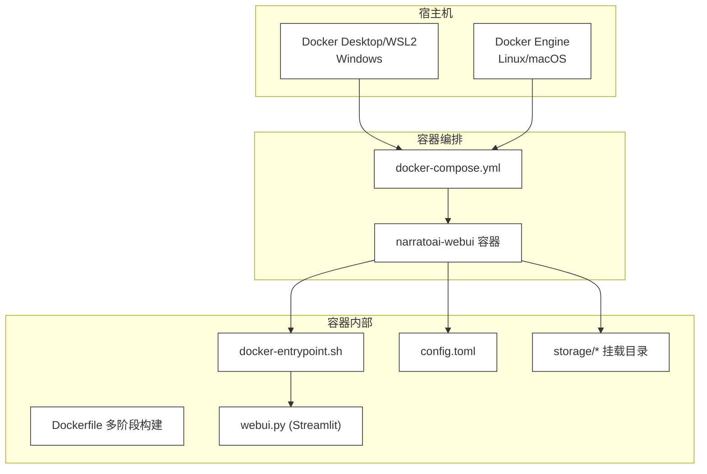
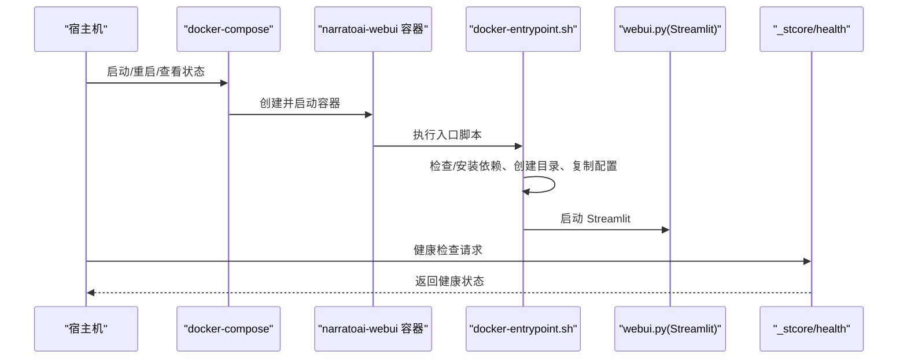
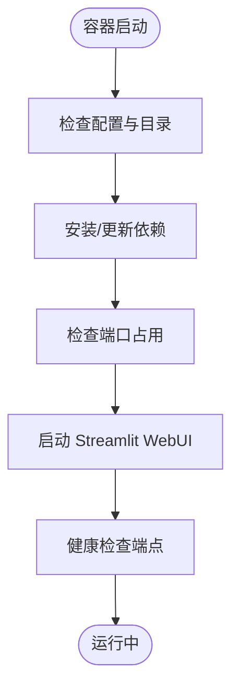
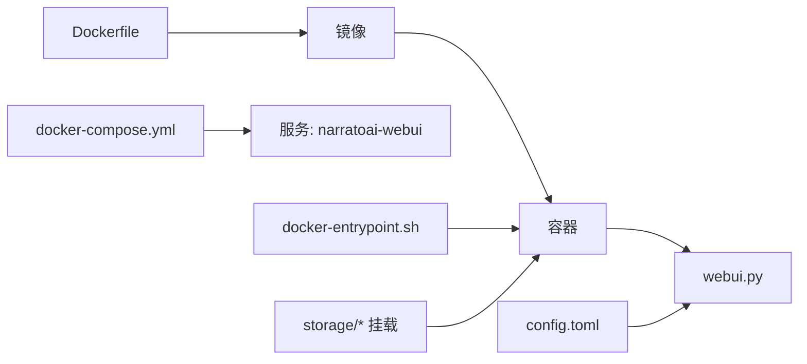

# 部署与运维

<cite>
**本文引用的文件**
- [Dockerfile](file://Dockerfile)
- [docker-compose.yml](file://docker-compose.yml)
- [docker-entrypoint.sh](file://docker-entrypoint.sh)
- [deploy-linux.sh](file://deploy-linux.sh)
- [deploy-windows-docker.bat](file://deploy-windows-docker.bat)
- [docker-deploy.sh](file://docker-deploy.sh)
- [Makefile](file://Makefile)
- [requirements.txt](file://requirements.txt)
- [config.example.toml](file://config.example.toml)
- [README.md](file://README.md)
- [webui.py](file://webui.py)
- [.github/release-drafter.yml](file://.github/release-drafter.yml)
</cite>

## 目录
1. [简介](#简介)
2. [项目结构](#项目结构)
3. [核心组件](#核心组件)
4. [架构总览](#架构总览)
5. [详细组件分析](#详细组件分析)
6. [依赖关系分析](#依赖关系分析)
7. [性能考虑](#性能考虑)
8. [故障排查指南](#故障排查指南)
9. [结论](#结论)
10. [附录](#附录)

## 简介
本指南面向运维与开发团队，提供 NarratoAI 的完整部署与运维方案，覆盖 Docker 容器化部署、docker-compose.yml 配置详解、Linux 与 Windows 平台本地部署、生产环境最佳实践、日志与监控、备份与升级策略、常见问题诊断以及 CI/CD 集成思路。文档严格基于仓库现有文件进行分析与总结，避免臆造信息。

## 项目结构
NarratoAI 采用多阶段 Docker 构建，结合 docker-compose 进行编排，提供 Linux 与 Windows 的一键部署脚本，并通过 Makefile 提供常用管理命令。WebUI 基于 Streamlit，容器内通过入口脚本完成依赖安装、配置检查与服务启动。

图表来源
- [docker-compose.yml:1-30](file://docker-compose.yml#L1-L30)
- [Dockerfile:1-89](file://Dockerfile#L1-L89)
- [docker-entrypoint.sh:1-145](file://docker-entrypoint.sh#L1-L145)
- [webui.py:1-200](file://webui.py#L1-L200)

章节来源
- [docker-compose.yml:1-30](file://docker-compose.yml#L1-L30)
- [Dockerfile:1-89](file://Dockerfile#L1-L89)
- [README.md:105-141](file://README.md#L105-L141)

## 核心组件
- Dockerfile：多阶段构建，安装运行时依赖（FFmpeg、ImageMagick、Git LFS 等），创建非 root 用户，暴露端口并配置健康检查。
- docker-compose.yml：定义服务、端口映射、卷挂载、环境变量与健康检查策略。
- docker-entrypoint.sh：容器启动时的初始化流程，包括依赖安装、配置检查、目录创建与 Streamlit 启动。
- requirements.txt：Python 依赖清单，含 LLM、TTS、图像处理、进度条与重试等模块。
- config.example.toml：应用配置模板，涵盖 LLM、TTS、代理、视频处理等关键参数。
- Linux/Windows 一键部署脚本：封装系统依赖、虚拟环境、容器编排与服务状态管理。
- Makefile：提供常用管理命令（构建、启动、停止、重启、查看日志、进入容器等）。
- webui.py：Streamlit 入口，负责页面配置、日志初始化与生成流程。

章节来源
- [Dockerfile:1-89](file://Dockerfile#L1-L89)
- [docker-compose.yml:1-30](file://docker-compose.yml#L1-L30)
- [docker-entrypoint.sh:1-145](file://docker-entrypoint.sh#L1-L145)
- [requirements.txt:1-39](file://requirements.txt#L1-L39)
- [config.example.toml:1-177](file://config.example.toml#L1-L177)
- [Makefile:1-64](file://Makefile#L1-L64)
- [webui.py:1-200](file://webui.py#L1-L200)

## 架构总览
容器化部署采用“单服务”模式，WebUI 作为单一容器对外提供服务。容器内通过入口脚本完成依赖与配置检查，随后以非 root 用户运行 Streamlit 应用。docker-compose 将宿主机的 storage 与配置文件挂载至容器，便于持久化与配置管理。

图表来源
- [docker-compose.yml:23-29](file://docker-compose.yml#L23-L29)
- [docker-entrypoint.sh:92-113](file://docker-entrypoint.sh#L92-L113)
- [webui.py:15-26](file://webui.py#L15-L26)

## 详细组件分析

### Dockerfile 分析
- 多阶段构建：第一阶段安装构建依赖并创建虚拟环境；第二阶段仅保留运行时依赖，减小镜像体积。
- 运行时依赖：安装 FFmpeg、ImageMagick、Git LFS、CA 证书与常用工具，并修复 ImageMagick 策略以允许读写。
- 用户与权限：创建非 root 用户 narratoai，设置工作目录与环境变量（PYTHONPATH、编码、缓冲等）。
- 健康检查：通过 curl 访问容器内 Streamlit 健康端点，失败将被重启策略触发。
- 入口点：指向 docker-entrypoint.sh，默认 CMD 启动 webui。

章节来源
- [Dockerfile:1-89](file://Dockerfile#L1-L89)

### docker-compose.yml 分析
- 服务定义：narratoai-webui，使用当前目录构建镜像，容器名为 narratoai-webui。
- 端口映射：将容器 8501 映射到宿主机 8501。
- 卷挂载：storage、config.toml、resource 挂载到容器对应路径，支持持久化与配置热更新。
- 环境变量：设置时区与 Python 缓冲行为。
- 重启策略：unless-stopped。
- 健康检查：与容器内健康检查一致，轮询健康端点。

章节来源
- [docker-compose.yml:1-30](file://docker-compose.yml#L1-L30)

### docker-entrypoint.sh 分析
- 依赖安装：检测 requirements.txt 变更，优先尝试 sudo 安装，失败回退到用户级安装并注入 PATH。
- 配置与目录：若缺少 config.toml，复制示例模板；创建 storage 子目录。
- 端口检查：检测 8501 是否被占用并告警。
- 启动 WebUI：以 Streamlit 运行 webui.py，绑定 0.0.0.0，启用 CORS，限制上传大小，关闭 XSRF 保护，禁用统计收集，设置日志级别。
- 健康检查命令：curl 访问容器内健康端点，返回 0/1 控制容器健康状态。

图表来源
- [docker-entrypoint.sh:64-90](file://docker-entrypoint.sh#L64-L90)
- [docker-entrypoint.sh:92-113](file://docker-entrypoint.sh#L92-L113)
- [docker-entrypoint.sh:130-140](file://docker-entrypoint.sh#L130-L140)

章节来源
- [docker-entrypoint.sh:1-145](file://docker-entrypoint.sh#L1-L145)

### requirements.txt 分析
- 核心依赖：requests、moviepy、edge-tts、streamlit、watchdog、loguru、tomli/tomli-w、pydub、pysrt。
- AI 服务依赖：openai、litellm、google-generativeai、azure-cognitiveservices-speech、tencentcloud-sdk-python、dashscope。
- 图像处理：Pillow。
- 进度与重试：tqdm、tenacity。
- 可选依赖：注释行展示了可选的本地语音识别、图像处理与 CUDA 支持。

章节来源
- [requirements.txt:1-39](file://requirements.txt#L1-L39)

### config.example.toml 分析
- 应用配置：项目版本、LLM 超时与重试、WebUI 隐藏配置项。
- LLM 配置：统一通过 LiteLLM 接口，支持多种 Provider（OpenAI、Gemini、Qwen、DeepSeek、SiliconFlow、Moonshot 等），包含视觉与文本模型的 provider/model_name、API Key 与可选 base_url。
- TTS 配置：Azure、腾讯云、SoulVoice、Qwen3 TTS、IndexTTS2（本地部署）。
- UI 配置：默认 TTS 引擎与各引擎的语音、音量、语速、音高等参数。
- 代理与网络：HTTP/HTTPS 代理开关与地址。
- 视频处理：关键帧提取间隔与批处理大小。

章节来源
- [config.example.toml:1-177](file://config.example.toml#L1-L177)

### Linux 一键部署脚本（deploy-linux.sh）
- 支持模式：full（完整安装）、run（仅启动）、stop（停止）、status（状态）。
- 自动检测与安装：Python 版本、系统依赖（FFmpeg、ImageMagick、Git LFS 等）、创建虚拟环境、安装 Python 依赖。
- 目录与配置：创建 storage 子目录，复制 config.toml。
- systemd 服务：生成服务文件，支持开机自启与后台运行。
- 启动方式：Streamlit 运行 webui.py，支持监听地址与端口配置。

章节来源
- [deploy-linux.sh:1-529](file://deploy-linux.sh#L1-L529)

### Windows Docker 一键部署脚本（deploy-windows-docker.bat）
- 模式：full、stop、status、logs、restart、rebuild。
- Docker 环境检查：检测 docker、docker info、docker compose。
- 配置与目录：检查/创建 config.toml 与 storage 目录。
- 构建与启动：docker compose build/up，等待健康检查。
- 状态与日志：查看容器状态、实时日志、健康状态。

章节来源
- [deploy-windows-docker.bat:1-372](file://deploy-windows-docker.bat#L1-L372)

### docker-deploy.sh（Linux 通用一键部署）
- 参数：-h/--help、-b/--build、--no-cache。
- 流程：检查 Docker/Docker Compose、检查/复制配置、构建镜像、启动服务、等待健康、输出常用命令。

章节来源
- [docker-deploy.sh:1-185](file://docker-deploy.sh#L1-L185)

### Makefile（常用管理命令）
- 目标：help、deploy、build、up、down、restart、logs、shell、ps、clean、config。
- 便捷性：通过 make 命令快速完成部署与运维操作。

章节来源
- [Makefile:1-64](file://Makefile#L1-L64)

### webui.py（Streamlit 入口）
- 页面配置：标题、图标、布局、菜单项。
- 日志初始化：使用 loguru，简化输出并过滤无关噪声。
- 全局状态：初始化剪辑参数、剧情文本、用户设置与 UI 语言。
- 生成流程：按钮触发、参数合并、任务创建与进度轮询。

章节来源
- [webui.py:1-200](file://webui.py#L1-L200)

## 依赖关系分析
- 容器镜像层叠：Dockerfile 定义构建与运行两阶段，运行阶段最小化依赖并设置非 root 用户。
- 编排层：docker-compose.yml 将镜像与容器生命周期、卷与网络策略绑定。
- 入口脚本层：docker-entrypoint.sh 在容器启动时完成依赖与配置检查，确保应用可运行。
- 应用层：webui.py 作为 Streamlit 应用入口，承载前端交互与业务流程。

图表来源
- [Dockerfile:1-89](file://Dockerfile#L1-L89)
- [docker-compose.yml:1-30](file://docker-compose.yml#L1-L30)
- [docker-entrypoint.sh:1-145](file://docker-entrypoint.sh#L1-L145)
- [webui.py:1-200](file://webui.py#L1-L200)

章节来源
- [Dockerfile:1-89](file://Dockerfile#L1-L89)
- [docker-compose.yml:1-30](file://docker-compose.yml#L1-L30)
- [docker-entrypoint.sh:1-145](file://docker-entrypoint.sh#L1-L145)
- [webui.py:1-200](file://webui.py#L1-L200)

## 性能考虑
- 容器镜像体积与启动速度：多阶段构建与精简运行时依赖有助于缩短构建与拉起时间。
- 依赖安装策略：入口脚本检测 requirements.txt 变更，避免重复安装，提升迭代效率。
- Streamlit 参数：合理设置上传大小、关闭统计收集与 XSRF 保护，降低前端开销。
- 存储与 I/O：将 storage 挂载到高性能磁盘，避免频繁跨卷拷贝。
- LLM/TTS 成本控制：通过 LiteLLM 的统一接口与重试策略，结合配置中的超时与重试次数，平衡稳定性与成本。

## 故障排查指南
- 容器无法启动
  - 检查 Docker 与 Compose 是否可用，确认镜像构建成功。
  - 查看健康检查状态与容器日志。
- 端口冲突
  - 入口脚本会检测 8501 占用并告警；可在 docker-compose.yml 中调整映射端口。
- 配置缺失
  - 若缺少 config.toml，入口脚本会复制示例模板；也可通过 Makefile 的 config 目标复制。
- 依赖安装失败
  - 入口脚本优先尝试 sudo 安装，失败回退到用户级安装；必要时使用 --no-cache 重建镜像。
- Windows 环境
  - 确保 Docker Desktop 启动并启用 WSL2 后端；脚本会自动等待 Docker 就绪。
- 日志定位
  - 使用 docker compose logs -f 实时查看；或通过 Makefile 的 logs 目标。
- 停止与重启
  - 使用 docker compose down/stop/restart 或 Makefile 的对应目标。

章节来源
- [docker-entrypoint.sh:96-101](file://docker-entrypoint.sh#L96-L101)
- [docker-compose.yml:9-11](file://docker-compose.yml#L9-L11)
- [docker-deploy.sh:47-65](file://docker-deploy.sh#L47-L65)
- [deploy-windows-docker.bat:77-142](file://deploy-windows-docker.bat#L77-L142)
- [Makefile:36-48](file://Makefile#L36-L48)

## 结论
本指南基于仓库现有文件，提供了从容器构建、编排配置到平台化部署与运维的全链路方案。通过统一的入口脚本与配置模板，结合 docker-compose 的卷与环境管理，可快速在 Linux 与 Windows 上完成部署。生产环境建议结合健康检查、日志与监控策略，配合备份与升级流程，确保稳定性与可维护性。

## 附录

### docker-compose.yml 配置选项说明
- services.narratoai-webui.build.context/dockerfile：指定构建上下文与 Dockerfile 路径。
- image/container_name：镜像名称与容器名。
- ports：端口映射（宿主机:容器）。
- volumes：卷挂载（storage、config.toml、resource）。
- environment：环境变量（如时区、Python 缓冲）。
- restart：重启策略。
- healthcheck：健康检查测试命令、间隔、超时、重试与启动期。

章节来源
- [docker-compose.yml:1-30](file://docker-compose.yml#L1-L30)

### Linux 本地部署要点
- Python 版本与虚拟环境：脚本自动检测/安装 Python 3.12，并创建 venv。
- 系统依赖：FFmpeg、ImageMagick、Git LFS、构建工具等。
- systemd 服务：生成服务文件，支持开机自启与日志写入 journal。
- 启动与状态：支持前台运行、后台运行与状态查询。

章节来源
- [deploy-linux.sh:83-151](file://deploy-linux.sh#L83-L151)
- [deploy-linux.sh:153-215](file://deploy-linux.sh#L153-L215)
- [deploy-linux.sh:306-347](file://deploy-linux.sh#L306-L347)
- [deploy-linux.sh:422-457](file://deploy-linux.sh#L422-L457)

### Windows 本地部署要点
- Docker Desktop 与 WSL2：前置要求与自动等待机制。
- 配置与目录：自动创建 config.toml 与 storage 子目录。
- 镜像构建与服务启动：支持强制重建与健康检查等待。
- 常用命令：查看状态、日志、重启、停止与重建。

章节来源
- [deploy-windows-docker.bat:77-142](file://deploy-windows-docker.bat#L77-L142)
- [deploy-windows-docker.bat:144-176](file://deploy-windows-docker.bat#L144-L176)
- [deploy-windows-docker.bat:178-207](file://deploy-windows-docker.bat#L178-L207)
- [deploy-windows-docker.bat:209-237](file://deploy-windows-docker.bat#L209-L237)
- [deploy-windows-docker.bat:268-297](file://deploy-windows-docker.bat#L268-L297)
- [deploy-windows-docker.bat:299-305](file://deploy-windows-docker.bat#L299-L305)
- [deploy-windows-docker.bat:307-318](file://deploy-windows-docker.bat#L307-L318)
- [deploy-windows-docker.bat:320-339](file://deploy-windows-docker.bat#L320-L339)

### 生产环境最佳实践
- 安全配置
  - 限制容器能力与权限，使用非 root 用户运行。
  - 通过环境变量与只读卷管理敏感配置，避免硬编码。
  - 使用代理与网络策略控制出站访问。
- 性能优化
  - 选择高性能存储与网络，合理设置上传大小与并发。
  - 使用 LiteLLM 的重试与成本追踪，优化模型选择。
- 监控与日志
  - 结合容器日志与应用日志，设置日志轮转与集中化采集。
  - 健康检查与告警联动，及时发现异常。
- 备份与升级
  - 对 storage 与 config.toml 做定期备份。
  - 通过版本标签与镜像管理，执行灰度升级与回滚。

### 备份与升级策略
- 备份
  - 备份 storage 目录（临时素材、任务、JSON、脚本、分析结果）。
  - 备份 config.toml 与 resource 目录。
- 升级
  - 使用 docker compose pull/build 与 up 升级镜像。
  - 通过标签管理版本，升级前先备份。
  - 回滚：切换到上一个稳定标签并重启服务。

章节来源
- [docker-compose.yml:12-15](file://docker-compose.yml#L12-L15)
- [config.example.toml:1-177](file://config.example.toml#L1-L177)

### CI/CD 集成与自动化部署
- 自动化构建
  - 在 CI 中执行 docker compose build，推送镜像到私有仓库。
- 自动化部署
  - 在目标环境执行 docker compose down && up -d，等待健康检查。
- 发布管理
  - 使用 release-drafter.yml 自动汇总变更与贡献者，生成发布说明。

章节来源
- [.github/release-drafter.yml:1-47](file://.github/release-drafter.yml#L1-L47)
- [docker-deploy.sh:81-99](file://docker-deploy.sh#L81-L99)