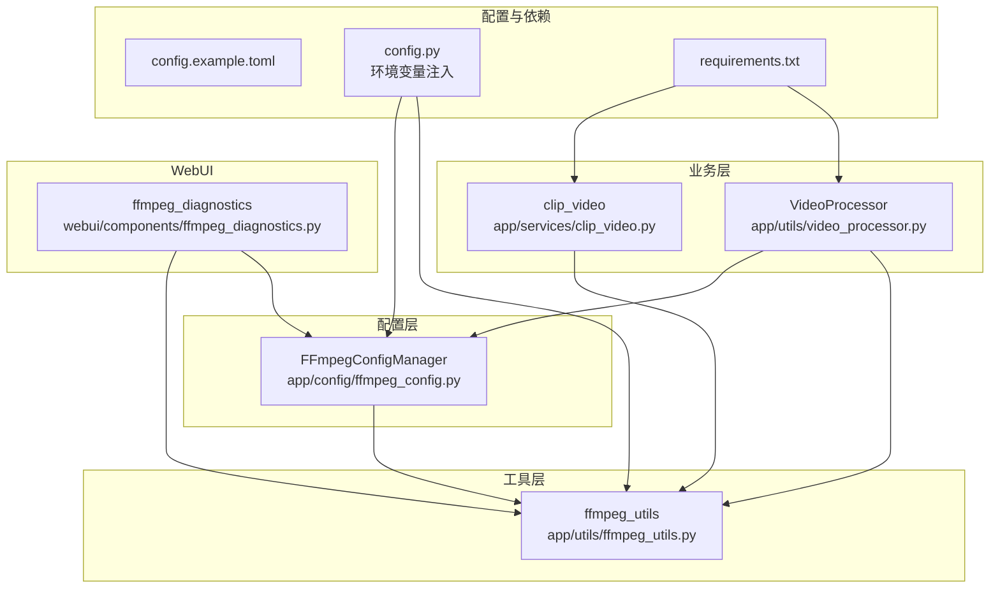
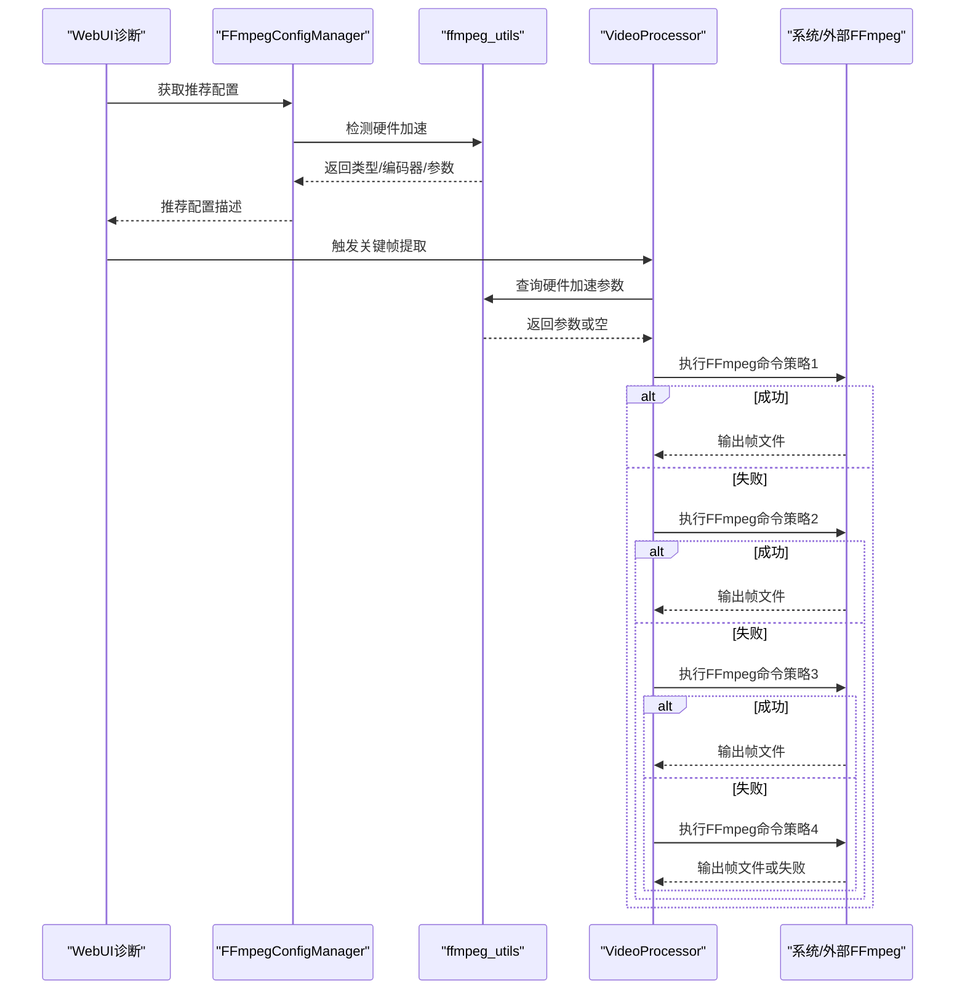
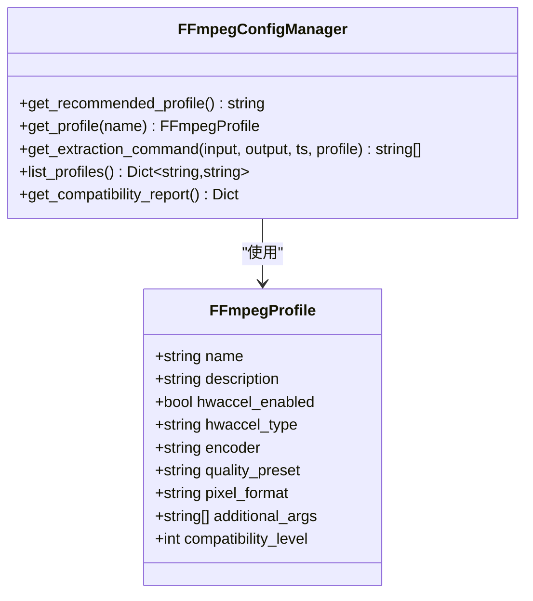
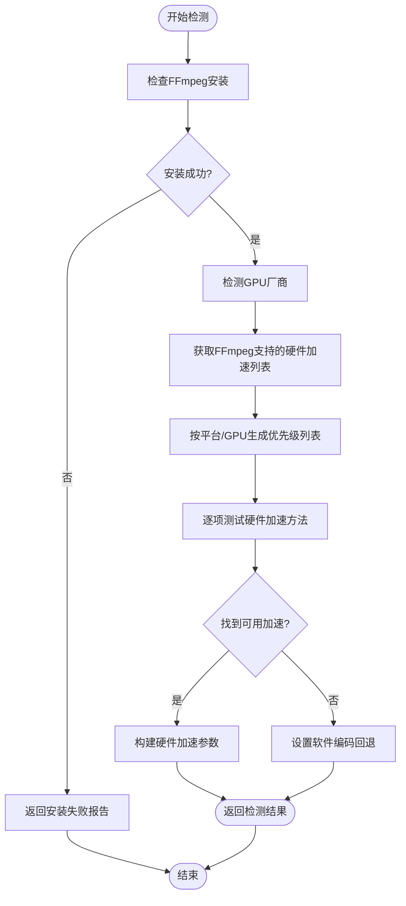
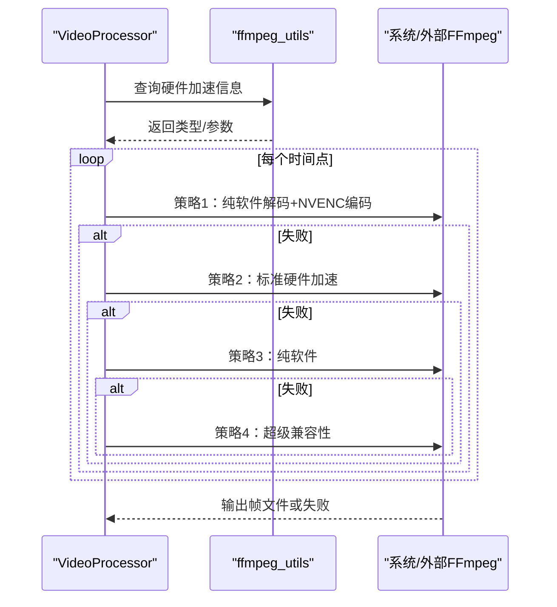
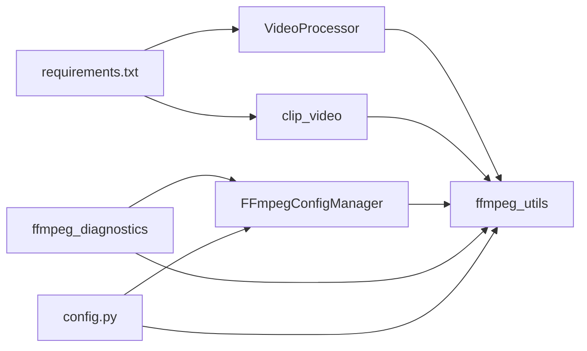

# FFmpeg配置

<cite>
**本文引用的文件**
- [ffmpeg_config.py](file://app/config/ffmpeg_config.py)
- [ffmpeg_utils.py](file://app/utils/ffmpeg_utils.py)
- [ffmpeg_diagnostics.py](file://webui/components/ffmpeg_diagnostics.py)
- [config.py](file://app/config/config.py)
- [video_processor.py](file://app/utils/video_processor.py)
- [clip_video.py](file://app/services/clip_video.py)
- [config.example.toml](file://config.example.toml)
- [requirements.txt](file://requirements.txt)
- [README.md](file://README.md)
</cite>

## 目录
1. [简介](#简介)
2. [项目结构](#项目结构)
3. [核心组件](#核心组件)
4. [架构总览](#架构总览)
5. [详细组件分析](#详细组件分析)
6. [依赖关系分析](#依赖关系分析)
7. [性能考虑](#性能考虑)
8. [故障排除指南](#故障排除指南)
9. [结论](#结论)
10. [附录](#附录)

## 简介
本文件面向NarratoAI中的FFmpeg配置系统，系统性阐述FFmpeg在项目中的作用、配置方法、硬件加速策略、跨平台适配、兼容性报告与诊断界面、以及常见问题与优化建议。文档同时覆盖配置文件路径、编码参数、版本兼容性与性能优化，并给出与系统其他组件的集成方式与最佳实践。

## 项目结构
FFmpeg相关能力分布在以下模块：
- 配置层：app/config/ffmpeg_config.py（配置文件与推荐策略）
- 工具层：app/utils/ffmpeg_utils.py（硬件加速检测、参数构建、兼容性测试）
- 业务层：app/utils/video_processor.py（关键帧提取、多策略回退）
- 服务层：app/services/clip_video.py（视频裁剪与错误分类、兼容性回退）
- WebUI诊断：webui/components/ffmpeg_diagnostics.py（诊断界面、配置选择、故障排除）
- 配置文件：config.example.toml（示例配置）、app/config/config.py（读取与环境变量注入）
- 依赖声明：requirements.txt（FFmpeg外部依赖）

图表来源
- [ffmpeg_config.py:27-141](file://app/config/ffmpeg_config.py#L27-L141)
- [ffmpeg_utils.py:252-355](file://app/utils/ffmpeg_utils.py#L252-L355)
- [video_processor.py:26-44](file://app/utils/video_processor.py#L26-L44)
- [clip_video.py:294-342](file://app/services/clip_video.py#L294-L342)
- [ffmpeg_diagnostics.py:20-108](file://webui/components/ffmpeg_diagnostics.py#L20-L108)
- [config.py:90-94](file://app/config/config.py#L90-L94)
- [config.example.toml:168-177](file://config.example.toml#L168-L177)
- [requirements.txt:1-39](file://requirements.txt#L1-L39)

章节来源
- [ffmpeg_config.py:1-285](file://app/config/ffmpeg_config.py#L1-L285)
- [ffmpeg_utils.py:1-1121](file://app/utils/ffmpeg_utils.py#L1-L1121)
- [ffmpeg_diagnostics.py:1-281](file://webui/components/ffmpeg_diagnostics.py#L1-L281)
- [config.py:1-95](file://app/config/config.py#L1-L95)
- [config.example.toml:1-177](file://config.example.toml#L1-L177)
- [requirements.txt:1-39](file://requirements.txt#L1-L39)

## 核心组件
- FFmpeg配置管理器：提供预定义配置文件、按平台与硬件推荐策略、生成关键帧提取命令、兼容性报告与建议。
- FFmpeg工具集：检测FFmpeg安装、检测GPU厂商、检测硬件加速器、构建硬件加速参数、强制软件编码、重置检测、兼容性测试。
- 视频处理器：基于FFmpeg进行关键帧提取，内置多策略回退（纯软件解码+NVENC编码、标准硬件加速、纯软件、超级兼容性方案）。
- 视频裁剪服务：视频裁剪过程中的错误分类与兼容性回退策略。
- WebUI诊断组件：展示系统与FFmpeg状态、硬件加速详情、推荐配置、生成兼容性报告、故障排除指南与测试入口。
- 配置与环境：通过配置文件注入FFmpeg路径到外部库环境变量，保障图像处理库使用正确的FFmpeg可执行文件。

章节来源
- [ffmpeg_config.py:27-285](file://app/config/ffmpeg_config.py#L27-L285)
- [ffmpeg_utils.py:118-136](file://app/utils/ffmpeg_utils.py#L118-L136)
- [ffmpeg_utils.py:252-355](file://app/utils/ffmpeg_utils.py#L252-L355)
- [ffmpeg_utils.py:981-1026](file://app/utils/ffmpeg_utils.py#L981-L1026)
- [video_processor.py:89-187](file://app/utils/video_processor.py#L89-L187)
- [video_processor.py:188-408](file://app/utils/video_processor.py#L188-L408)
- [clip_video.py:304-342](file://app/services/clip_video.py#L304-L342)
- [clip_video.py:345-378](file://app/services/clip_video.py#L345-L378)
- [ffmpeg_diagnostics.py:20-108](file://webui/components/ffmpeg_diagnostics.py#L20-L108)
- [config.py:90-94](file://app/config/config.py#L90-L94)

## 架构总览
FFmpeg配置系统采用“配置文件 + 智能检测 + 多策略回退”的架构：
- 配置文件：定义不同平台与硬件的预设配置，包含是否启用硬件加速、编码器、质量预设、像素格式与额外参数。
- 智能检测：自动检测FFmpeg安装、GPU厂商、可用硬件加速器类型与编码器映射，支持重置检测与强制软件编码。
- 多策略回退：关键帧提取与视频裁剪过程中，按“纯软件解码+NVENC编码”、“标准硬件加速”、“纯软件”、“超级兼容性方案”顺序尝试，确保在不同硬件环境下稳定运行。

图表来源
- [ffmpeg_diagnostics.py:72-108](file://webui/components/ffmpeg_diagnostics.py#L72-L108)
- [ffmpeg_config.py:98-141](file://app/config/ffmpeg_config.py#L98-L141)
- [ffmpeg_utils.py:778-789](file://app/utils/ffmpeg_utils.py#L778-L789)
- [video_processor.py:188-220](file://app/utils/video_processor.py#L188-L220)
- [video_processor.py:221-408](file://app/utils/video_processor.py#L221-L408)

## 详细组件分析

### FFmpeg配置管理器（FFmpegConfigManager）
- 预定义配置文件：高性能、兼容性、Windows NVIDIA优化、macOS VideoToolbox、通用软件编码。
- 推荐策略：根据平台与硬件加速可用性自动选择最佳配置。
- 命令生成：根据配置生成关键帧提取命令，自动注入硬件加速参数与像素格式。
- 兼容性报告：汇总系统信息、推荐配置、硬件加速状态与优化建议。

图表来源
- [ffmpeg_config.py:13-25](file://app/config/ffmpeg_config.py#L13-L25)
- [ffmpeg_config.py:27-141](file://app/config/ffmpeg_config.py#L27-L141)
- [ffmpeg_config.py:142-158](file://app/config/ffmpeg_config.py#L142-L158)
- [ffmpeg_config.py:160-232](file://app/config/ffmpeg_config.py#L160-L232)
- [ffmpeg_config.py:234-243](file://app/config/ffmpeg_config.py#L234-L243)
- [ffmpeg_config.py:244-285](file://app/config/ffmpeg_config.py#L244-L285)

章节来源
- [ffmpeg_config.py:27-285](file://app/config/ffmpeg_config.py#L27-L285)

### FFmpeg工具集（ffmpeg_utils）
- 安装检测：检查FFmpeg是否安装并位于系统PATH中。
- GPU厂商检测：跨平台检测NVIDIA/AMD/Intel/Apple等厂商。
- 硬件加速检测：按平台与GPU优先级逐项测试，支持CUDA、NVENC、VideoToolbox、QSV、VAAPI、AMF等。
- 参数构建：根据检测结果生成硬件加速参数，支持VAAPI设备路径自动探测。
- 强制软件编码与重置检测：用于故障排除与环境变化后的重新评估。
- 兼容性测试：生成详细报告，包含安装状态、GPU厂商、硬件加速可用性、软件回退与建议。

图表来源
- [ffmpeg_utils.py:118-136](file://app/utils/ffmpeg_utils.py#L118-L136)
- [ffmpeg_utils.py:138-181](file://app/utils/ffmpeg_utils.py#L138-L181)
- [ffmpeg_utils.py:252-355](file://app/utils/ffmpeg_utils.py#L252-L355)
- [ffmpeg_utils.py:403-437](file://app/utils/ffmpeg_utils.py#L403-L437)
- [ffmpeg_utils.py:778-789](file://app/utils/ffmpeg_utils.py#L778-L789)
- [ffmpeg_utils.py:981-1026](file://app/utils/ffmpeg_utils.py#L981-L1026)
- [ffmpeg_utils.py:925-978](file://app/utils/ffmpeg_utils.py#L925-L978)

章节来源
- [ffmpeg_utils.py:118-136](file://app/utils/ffmpeg_utils.py#L118-L136)
- [ffmpeg_utils.py:138-181](file://app/utils/ffmpeg_utils.py#L138-L181)
- [ffmpeg_utils.py:183-250](file://app/utils/ffmpeg_utils.py#L183-L250)
- [ffmpeg_utils.py:252-355](file://app/utils/ffmpeg_utils.py#L252-L355)
- [ffmpeg_utils.py:403-437](file://app/utils/ffmpeg_utils.py#L403-L437)
- [ffmpeg_utils.py:778-789](file://app/utils/ffmpeg_utils.py#L778-L789)
- [ffmpeg_utils.py:981-1026](file://app/utils/ffmpeg_utils.py#L981-L1026)
- [ffmpeg_utils.py:925-978](file://app/utils/ffmpeg_utils.py#L925-L978)

### 视频处理器（VideoProcessor）
- 关键帧提取：按固定时间间隔提取帧，内置四策略回退：
  1) Windows NVIDIA：纯软件解码 + NVENC编码
  2) 标准硬件加速：使用检测到的硬件加速参数
  3) 纯软件：libx264编码
  4) 超级兼容性：PNG->JPG或MJPEG/BMP回退
- 进度条与统计：带成功率统计与失败计数。
- 错误处理：超时、子进程错误、文件验证失败均被妥善处理。

图表来源
- [video_processor.py:89-187](file://app/utils/video_processor.py#L89-L187)
- [video_processor.py:188-220](file://app/utils/video_processor.py#L188-L220)
- [video_processor.py:221-408](file://app/utils/video_processor.py#L221-L408)
- [video_processor.py:409-451](file://app/utils/video_processor.py#L409-L451)
- [video_processor.py:495-584](file://app/utils/video_processor.py#L495-L584)
- [video_processor.py:586-651](file://app/utils/video_processor.py#L586-L651)

章节来源
- [video_processor.py:89-187](file://app/utils/video_processor.py#L89-L187)
- [video_processor.py:188-408](file://app/utils/video_processor.py#L188-L408)
- [video_processor.py:409-451](file://app/utils/video_processor.py#L409-L451)
- [video_processor.py:495-651](file://app/utils/video_processor.py#L495-L651)

### 视频裁剪服务（clip_video）
- 错误分类：根据错误信息关键字识别滤镜链错误、硬件加速错误、编码器错误、文件访问错误等。
- 兼容性回退：提供通用fallback与基础fallback两种方案，明确像素格式、预设、CRF、采样率与声道等参数，避免滤镜链问题。

章节来源
- [clip_video.py:304-342](file://app/services/clip_video.py#L304-L342)
- [clip_video.py:345-378](file://app/services/clip_video.py#L345-L378)

### WebUI诊断组件（ffmpeg_diagnostics）
- 诊断信息：系统信息、FFmpeg安装状态、硬件加速检测详情、推荐配置、兼容性报告与优化建议。
- 配置设置：列出所有配置文件，支持选择当前推荐配置，显示配置详情与高级设置（强制禁用硬件加速、重置检测）。
- 故障排除：针对滤镜链错误、硬件加速不可用、处理速度慢、文件权限问题等提供解决方案与联系支持提示。

章节来源
- [ffmpeg_diagnostics.py:20-108](file://webui/components/ffmpeg_diagnostics.py#L20-L108)
- [ffmpeg_diagnostics.py:110-199](file://webui/components/ffmpeg_diagnostics.py#L110-L199)
- [ffmpeg_diagnostics.py:201-260](file://webui/components/ffmpeg_diagnostics.py#L201-L260)

### 配置与环境注入
- 配置文件：config.example.toml提供示例配置，app/config/config.py负责加载并注入环境变量。
- 环境变量：若配置中提供ffmpeg_path，将其注入到图像处理库使用的环境变量，确保外部库使用正确的FFmpeg可执行文件。

章节来源
- [config.example.toml:168-177](file://config.example.toml#L168-L177)
- [config.py:90-94](file://app/config/config.py#L90-L94)

## 依赖关系分析
- FFmpeg作为外部依赖，由系统PATH提供；项目通过ffmpeg_utils进行安装检测与硬件加速检测。
- 多个模块共享ffmpeg_utils的检测结果，包括FFmpegConfigManager、VideoProcessor、clip_video与WebUI诊断组件。
- requirements.txt中未直接声明FFmpeg，但项目广泛使用外部FFmpeg（如视频处理、关键帧提取、音频处理等）。

图表来源
- [requirements.txt:1-39](file://requirements.txt#L1-L39)
- [video_processor.py:22-24](file://app/utils/video_processor.py#L22-L24)
- [clip_video.py:1-20](file://app/services/clip_video.py#L1-L20)
- [ffmpeg_utils.py:1-11](file://app/utils/ffmpeg_utils.py#L1-L11)
- [ffmpeg_config.py:6-10](file://app/config/ffmpeg_config.py#L6-L10)
- [ffmpeg_diagnostics.py:6-18](file://webui/components/ffmpeg_diagnostics.py#L6-L18)
- [config.py:1-10](file://app/config/config.py#L1-L10)

章节来源
- [requirements.txt:1-39](file://requirements.txt#L1-L39)
- [ffmpeg_utils.py:1-11](file://app/utils/ffmpeg_utils.py#L1-L11)
- [ffmpeg_config.py:6-10](file://app/config/ffmpeg_config.py#L6-L10)
- [ffmpeg_diagnostics.py:6-18](file://webui/components/ffmpeg_diagnostics.py#L6-L18)
- [config.py:1-10](file://app/config/config.py#L1-L10)

## 性能考虑
- 硬件加速优先：在支持的平台上优先启用硬件加速，显著提升关键帧提取与视频处理性能。
- Windows NVIDIA优化：优先使用“纯NVENC编码器”策略，避免硬件解码导致的滤镜链问题，兼顾性能与稳定性。
- 质量与速度平衡：通过质量预设、CRF、CQ等参数在质量与速度间权衡；在兼容性配置中使用更高兼容性参数。
- 多策略回退：在硬件加速失败时自动切换到软件方案，保证任务完成。
- 超级兼容性：在极端兼容性场景下使用PNG/BMP回退，避免MJPEG编码问题。

章节来源
- [ffmpeg_config.py:30-96](file://app/config/ffmpeg_config.py#L30-L96)
- [ffmpeg_utils.py:470-637](file://app/utils/ffmpeg_utils.py#L470-L637)
- [video_processor.py:188-408](file://app/utils/video_processor.py#L188-L408)
- [video_processor.py:495-651](file://app/utils/video_processor.py#L495-L651)

## 故障排除指南
- 滤镜链错误（Impossible to convert between the formats）：切换到兼容性配置或强制禁用硬件加速；更新显卡驱动。
- 硬件加速不可用：更新显卡驱动，安装对应SDK（NVIDIA CUDA、AMD AMF、Intel Media SDK），或使用软件编码。
- 处理速度慢：启用硬件加速、选择高性能配置、降低质量设置、增加关键帧提取间隔、关闭占用GPU的程序。
- 文件权限问题：确保输出目录有写权限、Windows以管理员运行、检查磁盘空间、避免特殊字符路径。
- 诊断与测试：使用WebUI诊断页面生成兼容性报告，必要时运行测试脚本收集详细信息。

章节来源
- [ffmpeg_diagnostics.py:201-260](file://webui/components/ffmpeg_diagnostics.py#L201-L260)
- [ffmpeg_utils.py:981-1026](file://app/utils/ffmpeg_utils.py#L981-L1026)
- [ffmpeg_utils.py:1028-1050](file://app/utils/ffmpeg_utils.py#L1028-L1050)
- [clip_video.py:304-342](file://app/services/clip_video.py#L304-L342)

## 结论
NarratoAI的FFmpeg配置系统通过“预设配置 + 智能检测 + 多策略回退”的设计，在不同平台与硬件环境下实现了高兼容性与高性能。WebUI诊断组件为用户提供了便捷的配置选择与问题排查入口。建议在生产环境中优先启用硬件加速，遇到兼容性问题时逐步降级到软件编码或超级兼容性方案，并结合兼容性报告持续优化配置。

## 附录

### FFmpeg路径配置与环境变量
- 通过配置文件提供ffmpeg_path，系统会将其注入到图像处理库使用的环境变量，确保外部库使用正确的FFmpeg可执行文件。
- 若未提供路径，需确保FFmpeg在系统PATH中，ffmpeg_utils将进行安装检测。

章节来源
- [config.example.toml:168-177](file://config.example.toml#L168-L177)
- [config.py:90-94](file://app/config/config.py#L90-L94)

### 不同操作系统下的安装与配置要点
- Windows：优先安装NVIDIA驱动与CUDA工具包；若出现滤镜链问题，使用Windows NVIDIA优化配置或强制软件编码。
- macOS：启用VideoToolbox硬件加速；注意Apple Silicon与Intel Mac的差异。
- Linux：根据GPU厂商安装对应SDK（如VAAPI、AMF、QSV），并确保FFmpeg支持相应硬件加速。

章节来源
- [ffmpeg_utils.py:470-637](file://app/utils/ffmpeg_utils.py#L470-L637)
- [ffmpeg_utils.py:639-717](file://app/utils/ffmpeg_utils.py#L639-L717)
- [ffmpeg_utils.py:440-468](file://app/utils/ffmpeg_utils.py#L440-L468)

### FFmpeg版本兼容性与性能优化建议
- 版本兼容性：通过“FFmpeg支持的硬件加速器列表”与“编码器可用性检测”确保兼容性；若检测失败，使用软件编码回退。
- 性能优化：选择高性能配置、合理设置质量预设与CRF/CQ；在Windows NVIDIA场景下优先纯NVENC编码器策略。

章节来源
- [ffmpeg_utils.py:279-290](file://app/utils/ffmpeg_utils.py#L279-L290)
- [ffmpeg_utils.py:496-525](file://app/utils/ffmpeg_utils.py#L496-L525)
- [ffmpeg_config.py:30-96](file://app/config/ffmpeg_config.py#L30-L96)

### 常见参数组合与使用场景
- 关键帧提取：使用VideoProcessor按固定时间间隔提取，自动选择最优策略。
- 视频裁剪：clip_video提供错误分类与兼容性回退，确保在不同硬件下稳定输出。
- WebUI诊断：一键生成兼容性报告与优化建议，辅助用户调整配置。

章节来源
- [video_processor.py:89-187](file://app/utils/video_processor.py#L89-L187)
- [clip_video.py:345-378](file://app/services/clip_video.py#L345-L378)
- [ffmpeg_diagnostics.py:93-108](file://webui/components/ffmpeg_diagnostics.py#L93-L108)

### 与系统其他组件的集成方式与最佳实践
- 集成方式：FFmpegConfigManager与ffmpeg_utils被多个模块复用；WebUI通过ffmpeg_diagnostics提供可视化配置与诊断。
- 最佳实践：在部署前运行WebUI诊断页面，确认硬件加速可用性；在CI/CD中加入兼容性测试步骤；对Windows NVIDIA场景优先采用纯NVENC编码器策略。

章节来源
- [ffmpeg_config.py:27-141](file://app/config/ffmpeg_config.py#L27-L141)
- [ffmpeg_utils.py:252-355](file://app/utils/ffmpeg_utils.py#L252-L355)
- [ffmpeg_diagnostics.py:20-108](file://webui/components/ffmpeg_diagnostics.py#L20-L108)