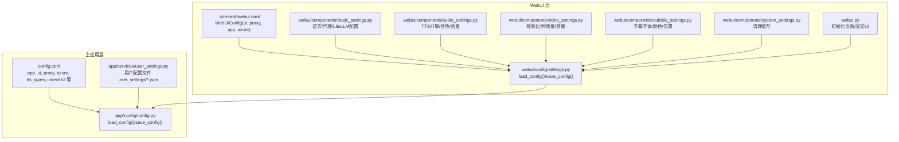
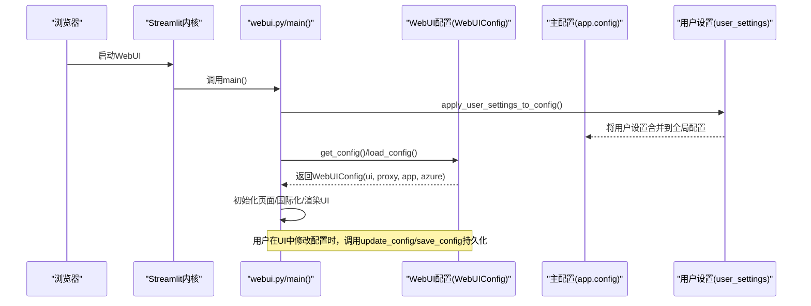
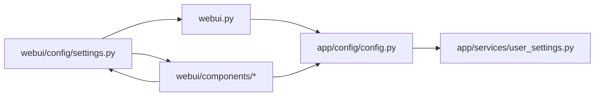

# WebUI界面配置

<cite>
**本文引用的文件**
- [webui.py](file://webui.py)
- [webui/config/settings.py](file://webui/config/settings.py)
- [app/config/config.py](file://app/config/config.py)
- [config.example.toml](file://config.example.toml)
- [webui/components/basic_settings.py](file://webui/components/basic_settings.py)
- [webui/components/audio_settings.py](file://webui/components/audio_settings.py)
- [webui/components/video_settings.py](file://webui/components/video_settings.py)
- [webui/components/subtitle_settings.py](file://webui/components/subtitle_settings.py)
- [webui/components/system_settings.py](file://webui/components/system_settings.py)
- [app/services/user_settings.py](file://app/services/user_settings.py)
- [webui/i18n/en.json](file://webui/i18n/en.json)
</cite>

## 目录
1. [简介](#简介)
2. [项目结构](#项目结构)
3. [核心组件](#核心组件)
4. [架构总览](#架构总览)
5. [详细组件分析](#详细组件分析)
6. [依赖关系分析](#依赖关系分析)
7. [性能考量](#性能考量)
8. [故障排查指南](#故障排查指南)
9. [结论](#结论)
10. [附录](#附录)

## 简介
本文件系统性阐述 NarratoAI WebUI 界面配置体系，包括配置文件结构、参数含义、界面显示控制、主题与语言设置、hide_config 参数作用与使用场景、WebUI 配置与主配置文件的关系与继承机制、动态更新与重启要求，以及面向不同用户群体（开发者模式、普通用户模式）的配置示例与最佳实践。

## 项目结构
WebUI 配置由两层构成：
- WebUI 层：独立的 WebUI 配置文件（.streamlit/webui.toml），用于控制界面行为、代理、应用参数片段（如 LLM/TTS）等。
- 主应用层：主配置文件（config.toml），用于控制服务端行为、日志级别、监听地址端口、各模块配置等。

二者通过各自的加载与保存逻辑独立管理，互不直接覆盖，但可通过共享键（如 ui.language、proxy.*）在运行时进行联动。

图表来源
- [webui/config/settings.py:52-175](file://webui/config/settings.py#L52-L175)
- [webui.py:15-294](file://webui.py#L15-L294)
- [app/config/config.py:24-95](file://app/config/config.py#L24-L95)
- [app/services/user_settings.py:59-131](file://app/services/user_settings.py#L59-L131)

章节来源
- [webui/config/settings.py:52-175](file://webui/config/settings.py#L52-L175)
- [webui.py:15-294](file://webui.py#L15-L294)
- [app/config/config.py:24-95](file://app/config/config.py#L24-L95)
- [app/services/user_settings.py:59-131](file://app/services/user_settings.py#L59-L131)

## 核心组件
- WebUI 配置类与加载保存
  - WebUIConfig 数据结构包含 ui、proxy、app、azure 等字段，并在 post-init 中补全默认值；提供 load_config、save_config、update_config、get_config 等方法。
  - 加载优先级：.streamlit/webui.toml → config.example.toml → 默认空配置。
- 主配置加载与保存
  - 主配置 app.config.config 提供 load_config/save_config，读取/写入 config.toml；同时暴露 ui、proxy、app 等命名空间键。
- 用户配置文件（用户设置）
  - user_settings 支持多配置文件档案（profile），按需加载/保存，覆盖 app/ui/proxy 的部分键，实现“用户偏好”与“全局配置”的分层。

章节来源
- [webui/config/settings.py:22-97](file://webui/config/settings.py#L22-L97)
- [app/config/config.py:24-58](file://app/config/config.py#L24-L58)
- [app/services/user_settings.py:59-131](file://app/services/user_settings.py#L59-L131)

## 架构总览
WebUI 启动流程与配置交互如下：

图表来源
- [webui.py:227-294](file://webui.py#L227-L294)
- [webui/config/settings.py:137-175](file://webui/config/settings.py#L137-L175)
- [app/services/user_settings.py:110-131](file://app/services/user_settings.py#L110-L131)

## 详细组件分析

### WebUI 配置文件结构与参数
- 文件位置与加载
  - 默认路径：.streamlit/webui.toml；若不存在则回退到 config.example.toml；均不存在则返回空配置。
  - 读取后填充 WebUIConfig 的 ui、proxy、app、azure 字段。
- 关键字段说明
  - ui：界面语言、TTS 引擎及音色参数等（见“语言设置”“音频设置”）。
  - proxy：HTTP/HTTPS 代理开关与地址。
  - app：LLM/TTS 等应用参数（如 vision/text 模型名、API Key、Base URL 等）。
  - azure：Azure 相关配置（如 speech_key、speech_region）。
  - project_version/root_dir：版本号与根目录，版本号来自项目文件而非配置文件。
- 保存与更新
  - save_config 将 ui/proxy/app/azure 写回 .streamlit/webui.toml。
  - update_config 支持增量更新并保存。

章节来源
- [webui/config/settings.py:52-175](file://webui/config/settings.py#L52-L175)
- [config.example.toml:140-177](file://config.example.toml#L140-L177)

### 界面显示控制与主题配置
- 页面初始化与样式
  - set_page_config 设置标题、图标、布局、侧边栏初始状态与菜单项；通过自定义 CSS 控制内边距。
- 主题与语言
  - 语言设置通过 basic_settings 渲染语言选择框，写入 config.ui['language'] 并同步到会话状态。
  - 国际化资源位于 webui/i18n/en.json，tr() 函数根据当前语言加载翻译。
- 字体与字幕样式
  - 字体列表来自 resource/fonts 缓存；字幕颜色、描边宽度、字号、位置等在 subtitle_settings 中配置。

章节来源
- [webui.py:16-32](file://webui.py#L16-L32)
- [webui/components/basic_settings.py:162-187](file://webui/components/basic_settings.py#L162-L187)
- [webui/i18n/en.json:1-91](file://webui/i18n/en.json#L1-L91)
- [webui/components/subtitle_settings.py:47-165](file://webui/components/subtitle_settings.py#L47-L165)

### 语言设置与国际化
- 语言选择逻辑
  - 从系统区域设置获取默认语言；列出所有可用语言包；用户选择后写入 config.ui['language'] 与 st.session_state['ui_language']。
- 翻译与回退
  - tr() 函数从 i18n 目录加载对应语言包，缺失键回退为键本身。

章节来源
- [webui/components/basic_settings.py:162-187](file://webui/components/basic_settings.py#L162-L187)
- [webui.py:124-130](file://webui.py#L124-L130)
- [webui/i18n/en.json:1-91](file://webui/i18n/en.json#L1-L91)

### 代理配置
- 开关与环境变量
  - 启用代理时写入 config.proxy['enabled']、http/https，并设置 HTTP_PROXY/HTTPS_PROXY 环境变量；禁用时清空并移除环境变量。
- 用途
  - 使 LLM/TTS 等外部请求通过代理访问。

章节来源
- [webui/components/basic_settings.py:189-218](file://webui/components/basic_settings.py#L189-L218)

### LLM 与 TTS 配置（LiteLLM 统一入口）
- 视觉/文本模型统一入口
  - 固定使用 LiteLLM 提供商，分别配置 vision/text 的模型名、API Key、Base URL。
  - 支持多种提供商（如 openai、gemini、qwen、dashscope、siliconflow、moonshot 等），自动拼接 provider/model 格式。
- 连接测试
  - 提供 LiteLLM 视觉/文本模型连通性测试，自动设置对应环境变量并发送最小化测试请求，返回友好错误信息。
- 保存与缓存
  - 保存成功后触发 LLM 缓存清理，确保新配置生效。

章节来源
- [webui/components/basic_settings.py:559-726](file://webui/components/basic_settings.py#L559-L726)
- [webui/components/basic_settings.py:333-453](file://webui/components/basic_settings.py#L333-L453)

### 音频与字幕设置
- TTS 引擎选择
  - 支持 edge_tts、azure_speech、tencent_tts、qwen3_tts、indextts2 等；根据引擎渲染对应配置界面。
- 字幕控制
  - 对于不支持自动生成字幕的引擎（如 soulvoice、qwen3_tts），自动禁用字幕并提示改用手动方式。
  - 字体、颜色、描边、字号、位置（含自定义百分比）均可配置。

章节来源
- [webui/components/audio_settings.py:22-153](file://webui/components/audio_settings.py#L22-L153)
- [webui/components/subtitle_settings.py:9-45](file://webui/components/subtitle_settings.py#L9-L45)
- [webui/components/subtitle_settings.py:91-94](file://webui/components/subtitle_settings.py#L91-L94)

### 视频设置
- 视频比例（竖屏/横屏）、画质（4K/2K/1080p/720p/480p）、原声音量滑条。
- 参数通过 session_state 传递给任务执行阶段。

章节来源
- [webui/components/video_settings.py:13-63](file://webui/components/video_settings.py#L13-L63)

### 系统设置与缓存清理
- 提供清理关键帧、裁剪视频、任务记录等缓存目录的功能，便于调试与释放空间。

章节来源
- [webui/components/system_settings.py:9-46](file://webui/components/system_settings.py#L9-L46)

### hide_config 参数的作用与使用场景
- 作用
  - 在主配置文件 config.toml 的 app 段落中提供 hide_config 开关，用于控制 WebUI 是否显示“配置项”相关界面元素。
- 使用场景
  - 生产环境或面向非技术用户的场景，隐藏底层配置细节，降低误操作风险。
  - 开发者模式下可关闭该开关以便快速调整 LLM/TTS 等参数。

章节来源
- [config.example.toml:69-71](file://config.example.toml#L69-L71)

### WebUI 配置与主配置文件的关系与继承机制
- 独立配置文件
  - WebUI 使用 .streamlit/webui.toml 管理界面相关配置；主应用使用 config.toml 管理服务端配置。
- 键的继承与覆盖
  - 两者各自维护 ui/proxy/app/azure 等键空间；用户设置（user_settings）可按 profile 覆盖 app/ui/proxy 的部分键。
- 运行时联动
  - basic_settings 中的语言与代理设置会写入 WebUIConfig 的 ui/proxy；LLM/TTS 配置写入 app 空间，供主流程使用。
- 保存策略
  - WebUI 保存到 .streamlit/webui.toml；主配置保存到 config.toml；互不干扰。

章节来源
- [webui/config/settings.py:52-175](file://webui/config/settings.py#L52-L175)
- [app/config/config.py:24-58](file://app/config/config.py#L24-L58)
- [app/services/user_settings.py:59-131](file://app/services/user_settings.py#L59-L131)

### 动态更新机制与重启要求
- 动态更新
  - 用户在 UI 中修改配置后，调用 update_config/save_config 将变更写回 .streamlit/webui.toml。
  - LLM 连接测试与配置保存会触发缓存清理，确保新配置生效。
- 重启要求
  - 某些环境变量（如 HTTP_PROXY/HTTPS_PROXY）在代理启用/禁用时即时生效；其他配置（如 LLM/TTS）通常在下一次任务开始前生效。
  - 若涉及主配置（config.toml）的变更，通常需要重启服务端进程以加载新配置。

章节来源
- [webui/config/settings.py:146-175](file://webui/config/settings.py#L146-L175)
- [webui/components/basic_settings.py:649-726](file://webui/components/basic_settings.py#L649-L726)

### 不同用户群体的界面配置示例
- 开发者模式
  - 启用 hide_config=false（或不设置），显示全部配置项；使用 LiteLLM 统一入口配置多个提供商；开启代理以测试跨网络访问。
  - 示例键：app.vision_litellm_model_name、app.text_litellm_model_name、proxy.enabled、proxy.http/https。
- 普通用户模式
  - hide_config=true，隐藏底层配置项；仅保留语言、TTS 引擎选择、字幕开关等易用选项；必要时使用代理。
  - 示例键：ui.language、ui.tts_engine、subtitle_enabled。

章节来源
- [config.example.toml:69-71](file://config.example.toml#L69-L71)
- [webui/components/basic_settings.py:162-187](file://webui/components/basic_settings.py#L162-L187)
- [webui/components/audio_settings.py:95-153](file://webui/components/audio_settings.py#L95-L153)
- [webui/components/subtitle_settings.py:9-45](file://webui/components/subtitle_settings.py#L9-L45)

### 最佳实践与用户体验优化建议
- 语言与国际化
  - 保持 ui.language 与系统区域一致，减少用户切换成本；提供清晰的翻译键回退。
- 代理与网络
  - 仅在确有需要时启用代理；提供一键测试连接功能，及时反馈错误原因。
- LLM/TTS 配置
  - 使用 LiteLLM 统一入口，避免多提供商适配复杂度；为常见提供商提供 Base URL 建议与占位符。
- 字幕与音视频
  - 对不支持自动生成字幕的引擎明确提示；提供字体缓存与常用字幕样式模板。
- 性能与稳定性
  - 配置变更后清理相关缓存；对大模型请求设置合理超时与重试策略；在 UI 中提供可视化进度与状态提示。

## 依赖关系分析
WebUI 配置与主配置之间的耦合度低，通过键空间隔离实现解耦；用户设置作为第三层，按 profile 覆盖 app/ui/proxy。

图表来源
- [webui/config/settings.py:52-175](file://webui/config/settings.py#L52-L175)
- [webui.py:1-294](file://webui.py#L1-L294)
- [app/config/config.py:24-95](file://app/config/config.py#L24-L95)
- [app/services/user_settings.py:59-131](file://app/services/user_settings.py#L59-L131)

章节来源
- [webui/config/settings.py:52-175](file://webui/config/settings.py#L52-L175)
- [app/config/config.py:24-95](file://app/config/config.py#L24-L95)
- [app/services/user_settings.py:59-131](file://app/services/user_settings.py#L59-L131)

## 性能考量
- 配置读取
  - WebUI 配置采用 toml 解析，主配置同样使用 toml；建议保持配置文件简洁，避免过多嵌套。
- LLM 连接测试
  - 测试请求尽量轻量化，避免对上游服务造成压力；对认证失败、速率限制等错误提供明确提示。
- 字体与字幕
  - 字体列表缓存可减少 IO；字幕样式参数范围合理设置，避免极端值导致渲染异常。

## 故障排查指南
- 配置加载失败
  - 检查 .streamlit/webui.toml 或 config.example.toml 是否存在且格式正确；查看日志输出定位具体错误。
- LLM/TTS 连接失败
  - 使用“测试连接”按钮获取详细错误信息；确认 API Key、Base URL、模型名格式正确；检查网络与代理设置。
- 代理无效
  - 确认 proxy.enabled 已勾选且 http/https 填写正确；检查环境变量是否已设置。
- 字幕不生效
  - 检查所选 TTS 引擎是否支持自动生成字幕；必要时改为手动添加字幕。

章节来源
- [webui/config/settings.py:94-97](file://webui/config/settings.py#L94-L97)
- [webui/components/basic_settings.py:333-453](file://webui/components/basic_settings.py#L333-L453)
- [webui/components/basic_settings.py:649-726](file://webui/components/basic_settings.py#L649-L726)
- [webui/components/subtitle_settings.py:9-45](file://webui/components/subtitle_settings.py#L9-L45)

## 结论
WebUI 配置系统通过独立的 .streamlit/webui.toml 与主配置 config.toml 分层管理，结合用户设置文件实现灵活的个性化覆盖。通过 hide_config、语言/代理/LiteLLM/TTS/字幕等配置项，既能满足开发者深度定制需求，也能为普通用户提供简洁易用的操作体验。建议在生产环境中谨慎开放底层配置项，并配合完善的测试与日志机制保障稳定性。

## 附录
- 配置文件位置
  - WebUI：.streamlit/webui.toml（默认）；回退 config.example.toml。
  - 主配置：config.toml。
- 关键键空间
  - WebUI：ui、proxy、app、azure。
  - 主配置：app、ui、proxy、azure、tts_qwen、indextts2 等。
- 用户设置文件
  - user_settings/<profile>.json，按 profile 存取 app/ui/proxy 的子集。