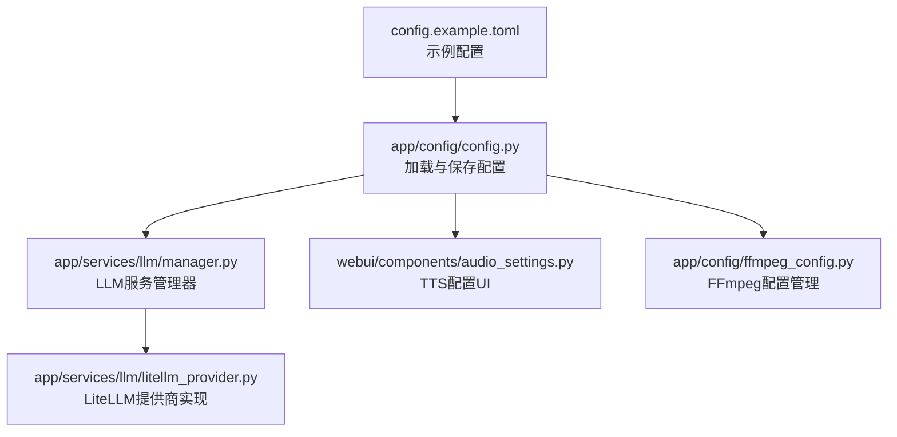
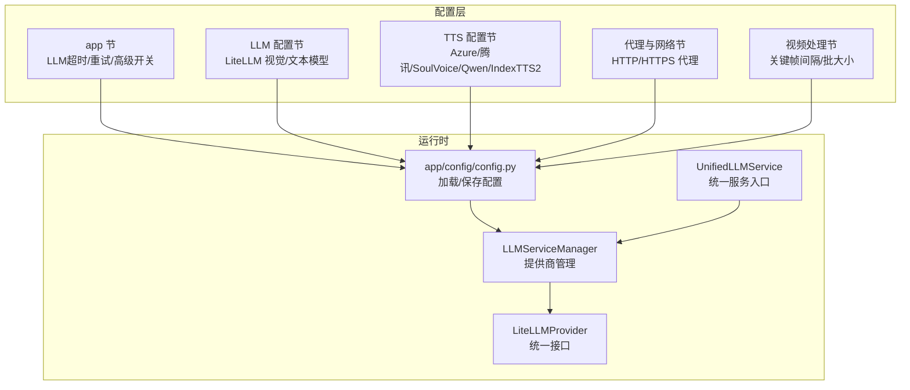
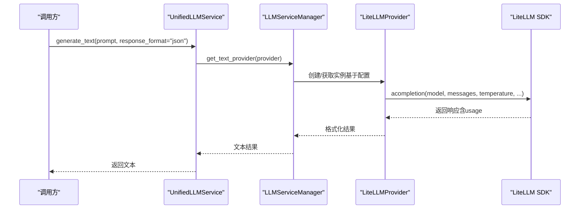
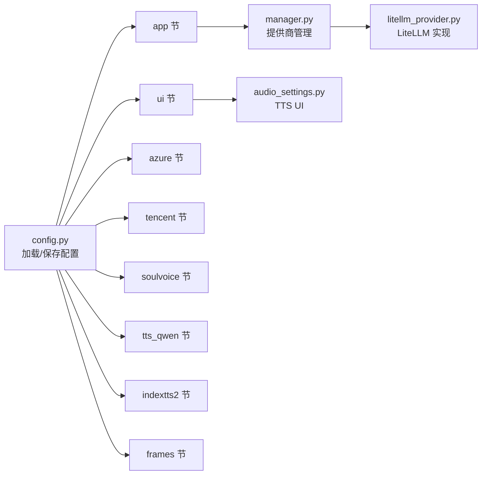
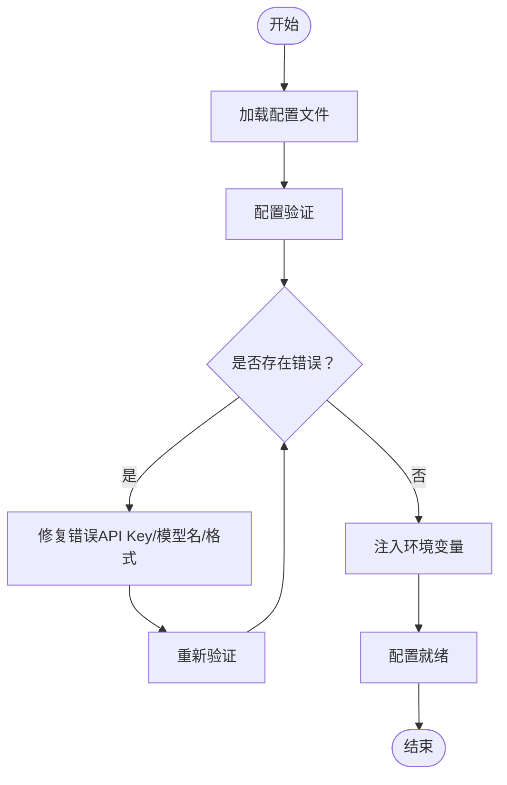

# 主配置文件详解

<cite>
**本文档引用的文件**
- [config.example.toml](file://config.example.toml)
- [config.py](file://app/config/config.py)
- [litellm_provider.py](file://app/services/llm/litellm_provider.py)
- [manager.py](file://app/services/llm/manager.py)
- [unified_service.py](file://app/services/llm/unified_service.py)
- [config_validator.py](file://app/services/llm/config_validator.py)
- [audio_settings.py](file://webui/components/audio_settings.py)
- [user_settings.py](file://app/services/user_settings.py)
- [ffmpeg_config.py](file://app/config/ffmpeg_config.py)
</cite>

## 目录
1. [简介](#简介)
2. [项目结构](#项目结构)
3. [核心组件](#核心组件)
4. [架构总览](#架构总览)
5. [详细组件分析](#详细组件分析)
6. [依赖关系分析](#依赖关系分析)
7. [性能考虑](#性能考虑)
8. [故障排除指南](#故障排除指南)
9. [结论](#结论)
10. [附录](#附录)

## 简介
本文件面向 NarratoAI 的主配置文件 config.example.toml，提供全面、系统且易于理解的配置说明。内容涵盖应用层(app)、LLM 统一接口(LiteLLM)、TTS(文本转语音)、代理与网络(proxy)以及视频处理(frames)等关键节。我们将逐一解释每个配置参数的作用、数据类型、默认值与取值范围；重点阐述 LiteLLM 统一接口的优势与使用方法，包括视觉模型与文本模型的配置方式；提供不同使用场景下的配置示例；说明配置参数的优先级与环境变量覆盖机制；最后给出配置验证规则与常见错误的解决方案。

## 项目结构
NarratoAI 的配置体系围绕 TOML 配置文件展开，配合 Python 加载器与 WebUI 组件实现运行时配置管理。核心流程如下：
- 应用启动时加载 config.example.toml 并复制为 config.toml
- 读取各节配置，注入环境变量（如 IMAGEMAGICK_BINARY、IMAGEIO_FFMPEG_EXE）
- LLM 服务通过统一管理器与 LiteLLM 提供商实现跨提供商调用
- WebUI 组件负责展示与编辑部分配置（如 TTS 引擎与参数）

**图表来源**
- [config.example.toml](file://config.example.toml)
- [config.py](file://app/config/config.py)
- [manager.py](file://app/services/llm/manager.py)
- [litellm_provider.py](file://app/services/llm/litellm_provider.py)
- [audio_settings.py](file://webui/components/audio_settings.py)
- [ffmpeg_config.py](file://app/config/ffmpeg_config.py)

**章节来源**
- [config.py:24-95](file://app/config/config.py#L24-L95)
- [config.example.toml:1-177](file://config.example.toml#L1-L177)

## 核心组件
本节概述主配置文件的主要节及其职责：
- app 节：应用基础配置，包括 LLM 超时与重试、高级开关、传统配置示例等
- LLM 配置节：统一通过 LiteLLM 接口配置视觉与文本模型，支持多家提供商
- TTS 配置节：包含 Azure、腾讯云、SoulVoice、Qwen3 TTS、IndexTTS2 等引擎配置
- 代理与网络节：HTTP/HTTPS 代理与开关
- 视频处理节：关键帧提取间隔与批处理大小

**章节来源**
- [config.example.toml:1-177](file://config.example.toml#L1-L177)

## 架构总览
下图展示了配置在系统中的作用与流向，以及与 LLM 统一接口的关系：

**图表来源**
- [config.py:24-95](file://app/config/config.py#L24-L95)
- [manager.py:15-246](file://app/services/llm/manager.py#L15-L246)
- [litellm_provider.py:38-56](file://app/services/llm/litellm_provider.py#L38-L56)
- [unified_service.py:20-263](file://app/services/llm/unified_service.py#L20-L263)

## 详细组件分析

### app 节配置详解
- project_version：项目版本字符串，用于 UI 展示与诊断
- llm_vision_timeout：视觉模型基础超时（秒），默认 120
- llm_text_timeout：文本模型基础超时（秒），默认 180
- llm_max_retries：API 重试次数，默认 3（由 LiteLLM 统一处理）
- hide_config：WebUI 是否隐藏配置项（布尔），默认 true
- 传统配置示例：注释掉的传统提供商配置示例，不推荐使用

参数类型与取值范围：
- project_version：字符串
- llm_vision_timeout / llm_text_timeout：整数（秒）
- llm_max_retries：整数（≥0）
- hide_config：布尔

优先级与覆盖：
- 该节参数主要影响 LLM 超时与重试策略，以及 UI 行为
- 通过环境变量或外部注入可覆盖部分行为（如 IMAGEMAGICK_BINARY、IMAGEIO_FFMPEG_EXE）

**章节来源**
- [config.example.toml:1-88](file://config.example.toml#L1-L88)
- [config.py:86-95](file://app/config/config.py#L86-L95)

### LLM 配置节（LiteLLM 统一接口）
LiteLLM 优势：
- 统一 API 接口，减少代码量约 80%
- 自动重试与智能错误处理
- 内置成本追踪与 token 统计
- 支持 100+ 提供商（OpenAI、Anthropic、Gemini、Qwen、DeepSeek、Cohere、Together AI、Replicate、Groq、Mistral 等）

视觉模型配置：
- vision_llm_provider：固定为 "litellm"
- vision_litellm_model_name：模型格式为 "provider/model_name"
- vision_litellm_api_key：对应提供商的 API Key
- vision_litellm_base_url：可选，自定义 API 基础 URL

文本模型配置：
- text_llm_provider：固定为 "litellm"
- text_litellm_model_name：模型格式为 "provider/model_name"
- text_litellm_api_key：对应提供商的 API Key
- text_litellm_base_url：可选，自定义 API 基础 URL

环境变量映射：
- LiteLLM 会根据 provider 自动映射到相应环境变量（如 GEMINI_API_KEY、OPENAI_API_KEY、QWEN_API_KEY 等）
- SiliconFlow 特殊处理：将 provider 替换为 openai 并设置 OPENAI_API_KEY 与默认 base_url

统一服务调用：
- UnifiedLLMService 提供统一入口，内部通过 LLMServiceManager 获取提供商实例
- 支持图片分析与文本生成，并可指定 JSON 输出格式

**图表来源**
- [unified_service.py:64-110](file://app/services/llm/unified_service.py#L64-L110)
- [manager.py:137-208](file://app/services/llm/manager.py#L137-L208)
- [litellm_provider.py:349-472](file://app/services/llm/litellm_provider.py#L349-L472)

**章节来源**
- [config.example.toml:9-88](file://config.example.toml#L9-L88)
- [litellm_provider.py:38-56](file://app/services/llm/litellm_provider.py#L38-L56)
- [litellm_provider.py:106-128](file://app/services/llm/litellm_provider.py#L106-L128)
- [litellm_provider.py:324-347](file://app/services/llm/litellm_provider.py#L324-L347)
- [manager.py:90-134](file://app/services/llm/manager.py#L90-L134)
- [unified_service.py:64-110](file://app/services/llm/unified_service.py#L64-L110)

### TTS 配置节
本节包含多种 TTS 引擎的配置与 WebUI 展示逻辑：
- azure：Azure Speech Services 配置（speech_key、speech_region）
- tencent：腾讯云 TTS 配置（secret_id、secret_key、region）
- soulvoice：SoulVoice API 配置（api_key、voice_uri、api_url、model）
- tts_qwen：通义千问 Qwen3 TTS 配置（api_key、model_name）
- indextts2：IndexTTS2 语音克隆配置（api_url、reference_audio、infer_mode、temperature、top_p、top_k、do_sample、num_beams、repetition_penalty）
- ui：TTS 引擎选择（tts_engine）与各引擎参数（edge_*、azure_* 等）

WebUI 展示与校验：
- audio_settings.py 提供 TTS 引擎选项与描述
- 针对 Azure 音色名称进行格式校验
- 支持试听功能，按引擎读取对应参数

**章节来源**
- [config.example.toml:90-155](file://config.example.toml#L90-L155)
- [audio_settings.py:22-800](file://webui/components/audio_settings.py#L22-L800)

### 代理与网络节
- proxy：HTTP/HTTPS 代理配置（http、https、enabled）
- 用途：在受限网络环境下通过代理访问外部服务

**章节来源**
- [config.example.toml:156-166](file://config.example.toml#L156-L166)

### 视频处理节
- frames：关键帧提取间隔（frame_interval_input，秒）、视觉批处理大小（vision_batch_size）
- 用途：控制视频关键帧提取频率与 LLM 视觉模型批处理规模

**章节来源**
- [config.example.toml:168-177](file://config.example.toml#L168-L177)

## 依赖关系分析
- 配置加载依赖：config.py 负责加载 config.toml（若不存在则复制示例），并将其拆分为多个命名空间（app、azure、tencent、soulvoice、ui、tts_qwen、indextts2、frames 等）
- LLM 依赖：manager.py 依据 app 节配置动态创建提供商实例；litellm_provider.py 将提供商名称映射到环境变量并调用 LiteLLM SDK
- WebUI 依赖：audio_settings.py 读取 ui、azure、tencent、soulvoice、tts_qwen、indextts2 等节进行表单渲染与参数保存
- 环境变量注入：config.py 将 IMAGEMAGICK_BINARY、IMAGEIO_FFMPEG_EXE 注入环境变量，影响图像与视频工具链行为

**图表来源**
- [config.py:60-95](file://app/config/config.py#L60-L95)
- [manager.py:68-208](file://app/services/llm/manager.py#L68-L208)
- [litellm_provider.py:106-128](file://app/services/llm/litellm_provider.py#L106-L128)
- [audio_settings.py:105-150](file://webui/components/audio_settings.py#L105-L150)

**章节来源**
- [config.py:60-95](file://app/config/config.py#L60-L95)
- [manager.py:68-208](file://app/services/llm/manager.py#L68-L208)
- [audio_settings.py:105-150](file://webui/components/audio_settings.py#L105-L150)

## 性能考虑
- LLM 超时与重试：合理设置 llm_vision_timeout 与 llm_text_timeout，避免长时间阻塞；llm_max_retries 由 LiteLLM 统一处理，建议结合网络状况调整
- 批处理大小：frames.vision_batch_size 控制视觉模型批处理规模，适当增大可提升吞吐，但需注意内存占用
- FFmpeg 配置：ffmpeg_config.py 提供多套配置文件（高性能、兼容性、Windows NVIDIA、macOS VideoToolbox、通用软件），按硬件与平台自动推荐，必要时手动选择
- TTS 引擎：不同引擎在延迟与音质上差异较大，生产环境建议选择稳定且具备免费额度的引擎

**章节来源**
- [config.example.toml:4-7](file://config.example.toml#L4-L7)
- [config.example.toml:171-177](file://config.example.toml#L171-L177)
- [ffmpeg_config.py:98-141](file://app/config/ffmpeg_config.py#L98-L141)

## 故障排除指南
常见配置错误与解决方案：
- 缺少 API Key：确保 vision_*_api_key 与 text_*_api_key 正确填写；LiteLLM 会根据 provider 自动映射环境变量
- 模型名称格式错误：使用 "provider/model_name" 格式；若不包含斜杠，LiteLLM 会尝试自动推断
- SiliconFlow 特殊处理：需确保 OPENAI_API_KEY 已设置，或提供 base_url
- Azure 音色名称格式：需符合 "[语言]-[地区]-[名称]Neural" 格式
- 配置验证：使用 LLMConfigValidator 进行全量验证，查看错误与警告汇总
- 配置覆盖：通过环境变量或 WebUI 会话状态覆盖部分参数（如 tts_engine、音色等）

**图表来源**
- [config_validator.py:18-85](file://app/services/llm/config_validator.py#L18-L85)
- [litellm_provider.py:106-128](file://app/services/llm/litellm_provider.py#L106-L128)

**章节来源**
- [config_validator.py:18-85](file://app/services/llm/config_validator.py#L18-L85)
- [litellm_provider.py:106-128](file://app/services/llm/litellm_provider.py#L106-L128)
- [audio_settings.py:69-81](file://webui/components/audio_settings.py#L69-L81)

## 结论
config.example.toml 为 NarratoAI 的核心配置文件，采用分节设计便于维护与扩展。通过 LiteLLM 统一接口，项目实现了对多家 LLM 提供商的无缝接入；TTS 配置覆盖主流厂商与开源方案；代理与视频处理节满足不同网络与性能需求。建议在生产环境中：
- 使用 LiteLLM 统一接口并配置合理的超时与重试
- 为每个提供商配置 API Key 与 base_url
- 根据硬件与平台选择合适的 FFmpeg 配置
- 通过 WebUI 或环境变量进行参数覆盖与调试

## 附录

### 配置参数优先级与环境变量覆盖
- 配置文件优先：应用启动时加载 config.toml（不存在则复制示例）
- 环境变量注入：IMAGEMAGICK_BINARY、IMAGEIO_FFMPEG_EXE 由 config.py 注入
- LiteLLM 环境变量：根据 provider 自动映射（如 GEMINI_API_KEY、OPENAI_API_KEY 等）
- WebUI 会话覆盖：部分参数可通过 WebUI 会话状态覆盖（如 tts_engine、音色等）

**章节来源**
- [config.py:24-44](file://app/config/config.py#L24-L44)
- [config.py:86-95](file://app/config/config.py#L86-L95)
- [litellm_provider.py:106-128](file://app/services/llm/litellm_provider.py#L106-L128)
- [user_settings.py:14-39](file://app/services/user_settings.py#L14-L39)

### 不同使用场景下的配置示例
- 本地开发
  - 使用 LiteLLM，选择免费或低门槛提供商（如 Gemini、Qwen）
  - 关闭 hide_config，便于 UI 调试
  - 设置较小的 vision_batch_size 与较长的超时
- 生产部署
  - 配置多个提供商作为备用
  - 为每个提供商配置 base_url 与 API Key
  - 选择稳定且具备免费额度的 TTS 引擎
- 多提供商切换
  - 通过 LLMServiceManager 动态切换提供商
  - 在 WebUI 中修改 tts_engine 与对应参数

**章节来源**
- [config.example.toml:9-88](file://config.example.toml#L9-L88)
- [audio_settings.py:105-150](file://webui/components/audio_settings.py#L105-L150)
- [manager.py:90-134](file://app/services/llm/manager.py#L90-L134)