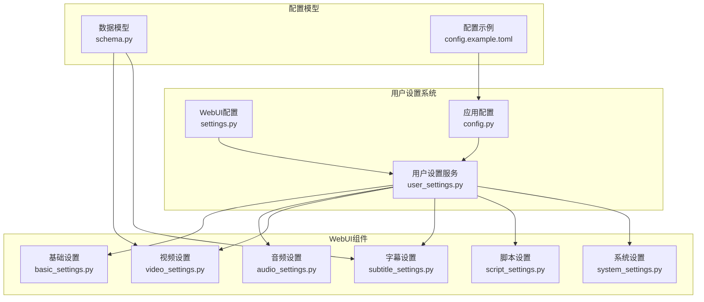
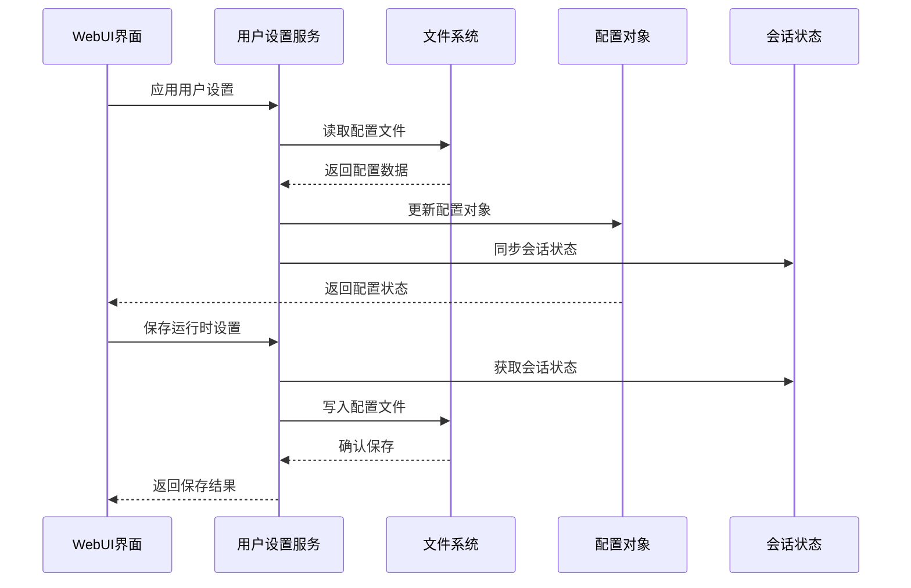
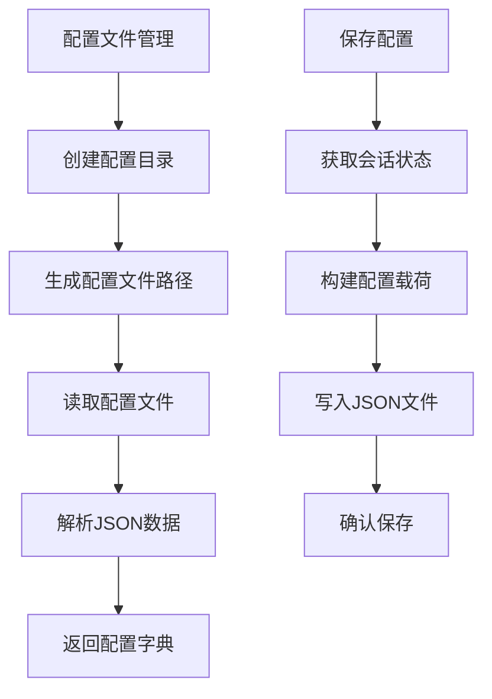
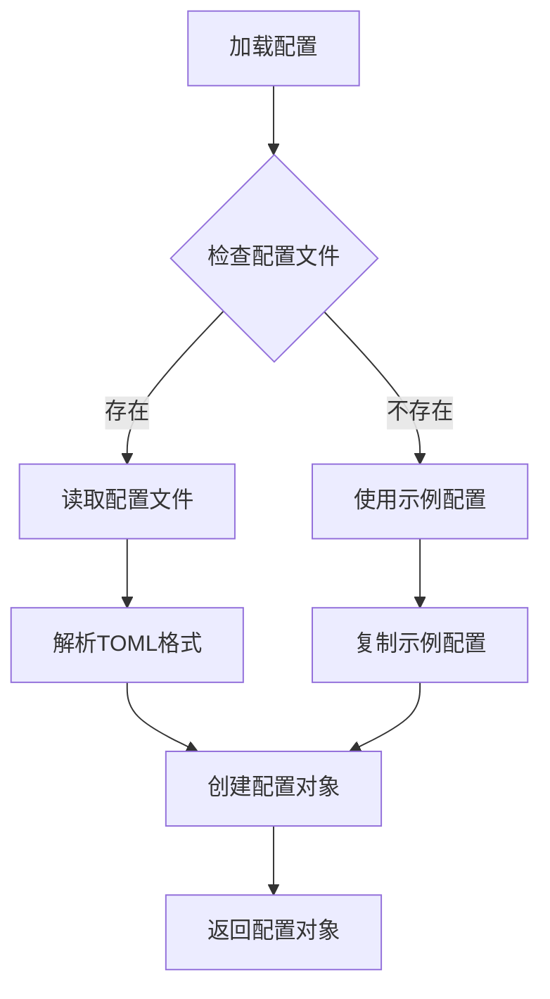
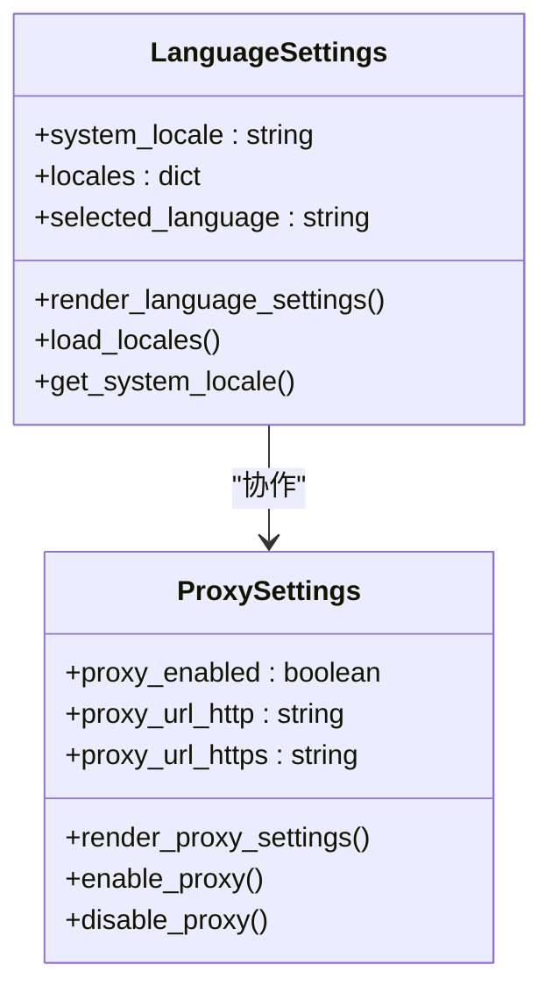
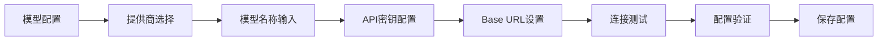
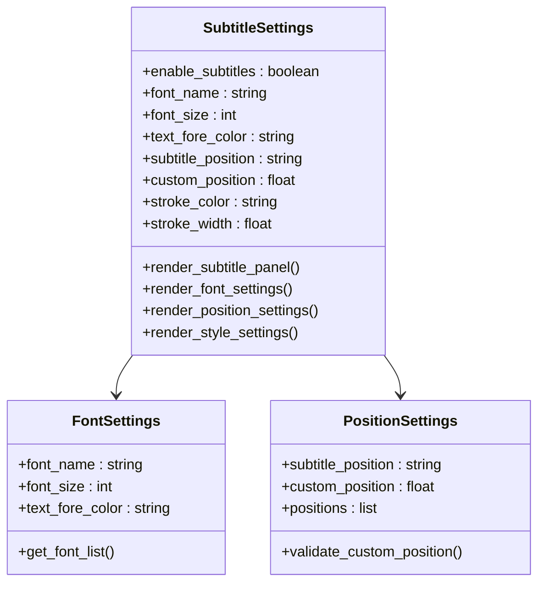
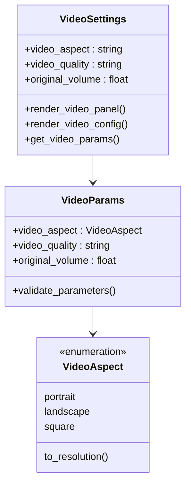
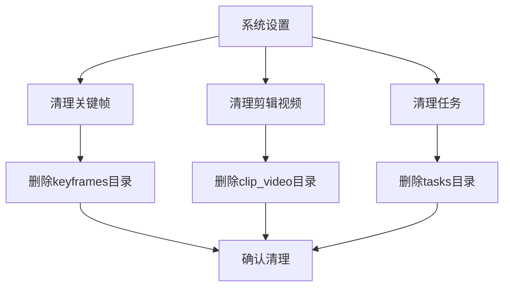
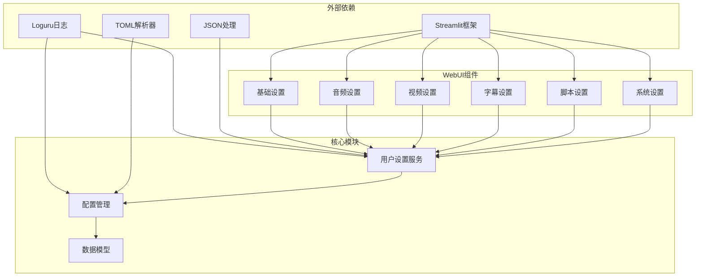

# 用户设置

<cite>
**本文档引用的文件**
- [app/services/user_settings.py](file://app/services/user_settings.py)
- [webui/components/basic_settings.py](file://webui/components/basic_settings.py)
- [webui/components/audio_settings.py](file://webui/components/audio_settings.py)
- [webui/components/video_settings.py](file://webui/components/video_settings.py)
- [webui/components/subtitle_settings.py](file://webui/components/subtitle_settings.py)
- [webui/components/script_settings.py](file://webui/components/script_settings.py)
- [webui/components/system_settings.py](file://webui/components/system_settings.py)
- [webui/config/settings.py](file://webui/config/settings.py)
- [app/config/config.py](file://app/config/config.py)
- [app/models/schema.py](file://app/models/schema.py)
- [webui.py](file://webui.py)
- [config.example.toml](file://config.example.toml)
</cite>

## 目录
1. [简介](#简介)
2. [项目结构](#项目结构)
3. [核心组件](#核心组件)
4. [架构概览](#架构概览)
5. [详细组件分析](#详细组件分析)
6. [依赖关系分析](#依赖关系分析)
7. [性能考虑](#性能考虑)
8. [故障排除指南](#故障排除指南)
9. [结论](#结论)

## 简介

用户设置系统是NarratoAI项目中的核心配置管理模块，负责管理用户在Web界面中进行的各种配置设置。该系统提供了完整的用户配置持久化机制，支持多配置文件管理和会话状态同步，涵盖了LLM模型配置、TTS语音设置、字幕配置、视频参数等多个方面。

系统采用分层架构设计，通过用户设置服务统一管理配置的读取、保存和应用过程，确保配置的一致性和可靠性。

## 项目结构

用户设置相关的文件组织结构如下：

**图表来源**
- [app/services/user_settings.py:1-131](file://app/services/user_settings.py:1-131)
- [webui/config/settings.py:1-175](file://webui/config/settings.py:1-175)
- [webui.py:1-294](file://webui.py:1-294)

**章节来源**
- [app/services/user_settings.py:1-131](file://app/services/user_settings.py:1-131)
- [webui/config/settings.py:1-175](file://webui/config/settings.py:1-175)
- [webui.py:1-294](file://webui.py:1-294)

## 核心组件

用户设置系统由以下几个核心组件构成：

### 用户设置服务 (UserSettingsService)
负责配置的持久化存储和管理，支持多配置文件和会话状态同步。

### WebUI配置管理 (WebUIConfig)
管理Web界面的配置文件，支持TOML格式的配置读取和保存。

### 应用配置管理 (AppConfig)
管理应用程序的核心配置，包括LLM、TTS、代理等设置。

### 配置模型 (Schema)
定义配置的数据结构和验证规则，确保配置的完整性和一致性。

**章节来源**
- [app/services/user_settings.py:13-131](file://app/services/user_settings.py:13-131)
- [webui/config/settings.py:22-175](file://webui/config/settings.py:22-175)
- [app/config/config.py:24-95](file://app/config/config.py:24-95)
- [app/models/schema.py:59-209](file://app/models/schema.py:59-209)

## 架构概览

用户设置系统的整体架构采用分层设计，确保配置管理的灵活性和可维护性：

**图表来源**
- [app/services/user_settings.py:110-131](file://app/services/user_settings.py:110-131)
- [webui.py:112-122](file://webui.py:112-122)

系统架构特点：
- **分层设计**：用户设置服务、WebUI配置、应用配置各司其职
- **持久化存储**：支持JSON格式的配置文件存储
- **会话同步**：实时同步配置到浏览器会话状态
- **配置验证**：内置配置验证和错误处理机制

## 详细组件分析

### 用户设置服务 (UserSettingsService)

用户设置服务是整个配置管理系统的核心，负责处理配置的生命周期管理。

#### 配置文件管理
系统支持多配置文件存储，每个配置文件对应一个用户配置档案：

**图表来源**
- [app/services/user_settings.py:42-107](file://app/services/user_settings.py:42-107)

#### 允许的配置键
系统定义了严格的配置键白名单，确保只有受支持的配置项能够被保存和应用：

| 配置类别 | 允许的键 |
|---------|---------|
| 应用配置 | vision_llm_provider, vision_litellm_model_name, vision_litellm_api_key, vision_litellm_base_url, text_llm_provider, text_litellm_model_name, text_litellm_api_key, text_litellm_base_url, tts_engine, voice_name, voice_rate, voice_pitch |
| UI配置 | language |
| 代理配置 | enabled, http, https |

**章节来源**
- [app/services/user_settings.py:15-39](file://app/services/user_settings.py:15-39)

### WebUI配置管理

WebUI配置管理负责处理Web界面的配置文件，支持TOML格式的配置读取和保存。

#### 配置文件加载流程

**图表来源**
- [webui/config/settings.py:52-96](file://webui/config/settings.py:52-96)

#### 配置更新机制
WebUI配置支持动态更新，修改后的配置会自动保存到文件系统：

**章节来源**
- [webui/config/settings.py:98-173](file://webui/config/settings.py:98-173)

### 基础设置组件

基础设置组件提供语言和代理配置功能，是用户设置系统的重要组成部分。

#### 语言设置功能
语言设置支持多语言切换，系统会根据用户的系统语言偏好自动选择默认语言：

**图表来源**
- [webui/components/basic_settings.py:162-219](file://webui/components/basic_settings.py:162-219)

#### 代理配置功能
代理配置支持HTTP和HTTPS代理的启用和禁用，系统会自动处理环境变量的设置和清理。

**章节来源**
- [webui/components/basic_settings.py:189-219](file://webui/components/basic_settings.py:189-219)

### LLM模型配置

LLM模型配置支持多种AI模型提供商，包括OpenAI、Gemini、Qwen等主流平台。

#### 模型配置界面

**图表来源**
- [webui/components/basic_settings.py:559-726](file://webui/components/basic_settings.py:559-726)

#### 支持的提供商
系统支持100+个AI模型提供商，包括但不限于：
- OpenAI系列模型
- Google Gemini系列
- 阿里云Qwen系列
- DeepSeek系列
- SiliconFlow系列
- Moonshot系列

**章节来源**
- [webui/components/basic_settings.py:584-590](file://webui/components/basic_settings.py:584-590)

### TTS语音配置

TTS语音配置支持多种语音合成引擎，包括Edge TTS、Azure Speech、腾讯云TTS等。

#### 语音引擎选择
系统提供多种TTS引擎选择，每种引擎都有其特点和适用场景：

| 引擎名称 | 特点 | 适用场景 | 注册要求 |
|---------|------|----------|----------|
| Edge TTS | 完全免费，稳定性一般 | 测试和轻量使用 | 无需注册 |
| Azure Speech | 提供免费额度，音质优秀 | 企业级应用 | 需要海外信用卡 |
| 腾讯云TTS | 提供免费额度，音质优秀 | 个人和企业用户 | 需要API密钥 |
| 通义千问TTS | 阿里云通义千问，音质优秀 | 需要高质量中文语音 | 需要DashScope密钥 |
| IndexTTS2 | 零样本语音克隆 | 下载地址：https://pan.quark.cn/s/0767c9bcefd5 | 需要本地部署 |

**章节来源**
- [webui/components/audio_settings.py:22-66](file://webui/components/audio_settings.py:22-66)

### 字幕设置组件

字幕设置组件提供字幕的显示和样式配置功能。

#### 字幕配置选项

**图表来源**
- [webui/components/subtitle_settings.py:9-165](file://webui/components/subtitle_settings.py:9-165)

#### 字幕引擎兼容性
系统对不同TTS引擎的字幕支持进行了差异化处理：

| TTS引擎 | 字幕支持 | 处理方式 |
|---------|----------|----------|
| Edge TTS | ✅ 支持 | 自动生成字幕 |
| Azure Speech | ❌ 不支持 | 禁用字幕功能 |
| SoulVoice | ❌ 不支持 | 禁用字幕功能 |
| 腾讯云TTS | ❌ 不支持 | 禁用字幕功能 |
| 通义千问TTS | ❌ 不支持 | 禁用字幕功能 |

**章节来源**
- [webui/components/subtitle_settings.py:91-94](file://webui/components/subtitle_settings.py:91-94)

### 视频设置组件

视频设置组件提供视频生成的各项参数配置。

#### 视频参数配置

**图表来源**
- [webui/components/video_settings.py:5-63](file://webui/components/video_settings.py:5-63)

#### 支持的视频参数
系统提供灵活的视频参数配置选项：

**章节来源**
- [webui/components/video_settings.py:15-53](file://webui/components/video_settings.py:15-53)

### 脚本设置组件

脚本设置组件管理视频脚本的生成和编辑功能。

#### 脚本模式选择
系统提供多种脚本生成模式：

| 模式 | 功能描述 | 使用场景 |
|------|----------|----------|
| 选择/上传脚本 | 从本地文件选择或上传JSON脚本 | 已有脚本文件 |
| 自动生成 | 基于视频内容自动生成脚本 | 需要AI辅助生成 |
| 短剧生成 | 生成短视频混剪脚本 | 短视频创作 |
| 短剧解说 | 基于字幕生成短剧解说脚本 | 字幕驱动的解说 |

**章节来源**
- [webui/components/script_settings.py:51-462](file://webui/components/script_settings.py:51-462)

### 系统设置组件

系统设置组件提供系统级别的清理和维护功能。

#### 系统清理功能

**图表来源**
- [webui/components/system_settings.py:9-46](file://webui/components/system_settings.py:9-46)

**章节来源**
- [webui/components/system_settings.py:30-46](file://webui/components/system_settings.py:30-46)

## 依赖关系分析

用户设置系统的依赖关系呈现清晰的层次结构：

**图表来源**
- [webui.py:1-294](file://webui.py:1-294)
- [app/services/user_settings.py:1-131](file://app/services/user_settings.py:1-131)

系统依赖特点：
- **松耦合设计**：各组件之间依赖关系清晰，便于维护
- **标准化接口**：统一的配置接口确保各组件的一致性
- **错误隔离**：配置错误不会影响其他组件的正常运行

**章节来源**
- [webui.py:112-122](file://webui.py:112-122)
- [app/services/user_settings.py:74-97](file://app/services/user_settings.py:74-97)

## 性能考虑

用户设置系统在设计时充分考虑了性能优化：

### 配置加载优化
- **延迟加载**：配置文件采用按需加载策略，避免启动时的性能开销
- **缓存机制**：WebUI配置采用单例模式，避免重复加载
- **增量更新**：只更新发生变化的配置项，减少I/O操作

### 内存管理
- **会话状态同步**：配置变更实时同步到浏览器会话，避免重复读取
- **配置验证**：在保存前进行配置验证，减少无效配置的处理开销

### 文件系统优化
- **原子操作**：配置保存采用原子写入，确保配置文件的完整性
- **错误恢复**：配置读取失败时提供降级处理，保证系统稳定性

## 故障排除指南

### 常见问题及解决方案

#### 配置文件读取失败
**症状**：用户设置无法加载或显示默认值
**原因**：配置文件损坏或权限不足
**解决方法**：
1. 检查配置文件是否存在且可读
2. 验证JSON格式的正确性
3. 确认文件权限设置正确

#### 配置保存失败
**症状**：修改的配置无法持久化
**原因**：磁盘空间不足或文件锁定
**解决方法**：
1. 检查磁盘空间是否充足
2. 关闭可能锁定配置文件的进程
3. 重启WebUI服务

#### LLM连接测试失败
**症状**：模型连接测试显示失败
**原因**：API密钥错误或网络问题
**解决方法**：
1. 验证API密钥的有效性
2. 检查网络连接状态
3. 确认Base URL配置正确

#### TTS引擎配置问题
**症状**：语音合成功能异常
**原因**：引擎配置不正确或API密钥失效
**解决方法**：
1. 重新配置TTS引擎参数
2. 更新API密钥
3. 检查引擎服务状态

**章节来源**
- [app/services/user_settings.py:69-71](file://app/services/user_settings.py:69-71)
- [webui/components/basic_settings.py:221-329](file://webui/components/basic_settings.py:221-329)

## 结论

用户设置系统通过精心设计的架构和完善的配置管理机制，为NarratoAI项目提供了强大而灵活的配置支持。系统的主要优势包括：

### 设计优势
- **模块化设计**：清晰的组件分离和职责划分
- **配置持久化**：可靠的配置存储和恢复机制
- **多配置文件支持**：灵活的配置档案管理
- **实时同步**：配置变更的即时生效

### 功能特性
- **全面的配置覆盖**：涵盖LLM、TTS、字幕、视频等各个方面
- **强大的验证机制**：内置配置验证和错误处理
- **用户友好界面**：直观易用的Web界面配置
- **多语言支持**：国际化配置界面

### 技术亮点
- **分层架构**：清晰的抽象层次和依赖关系
- **性能优化**：高效的配置加载和保存机制
- **错误处理**：完善的异常捕获和恢复策略
- **扩展性**：易于添加新的配置项和组件

用户设置系统为NarratoAI项目提供了坚实的基础配置支持，确保用户能够轻松地定制和管理各种功能设置，同时保证系统的稳定性和可靠性。