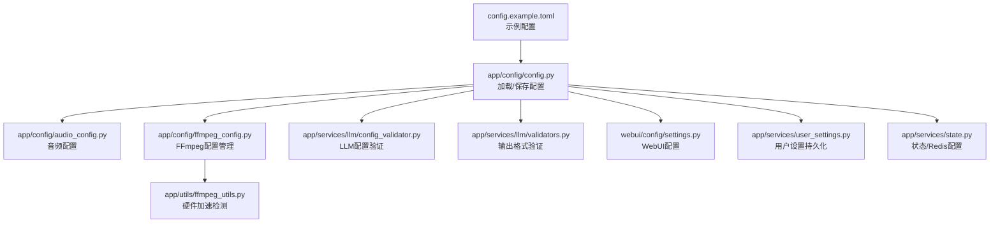
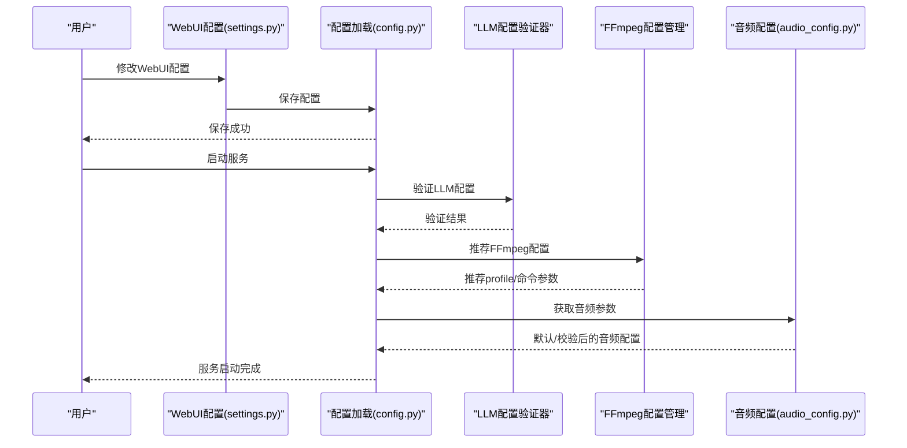
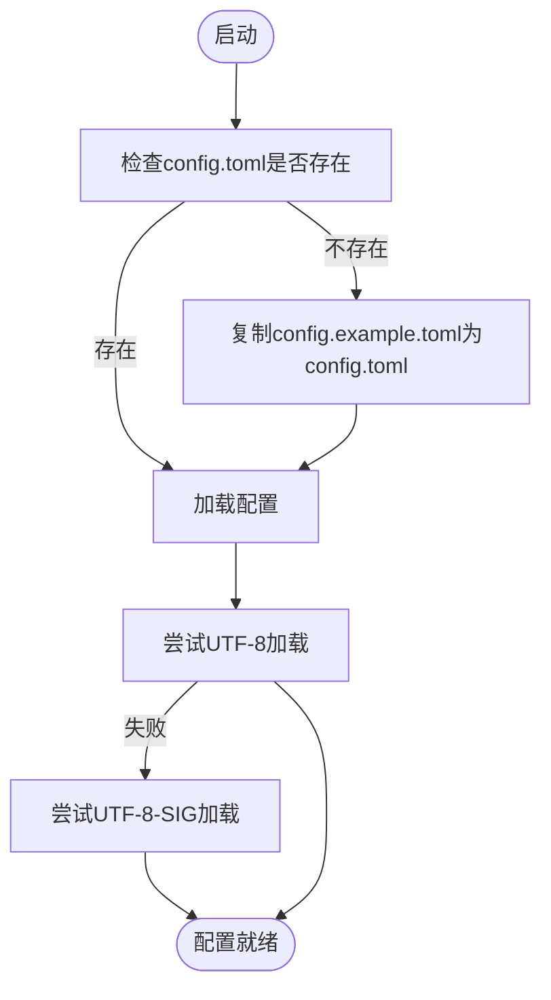
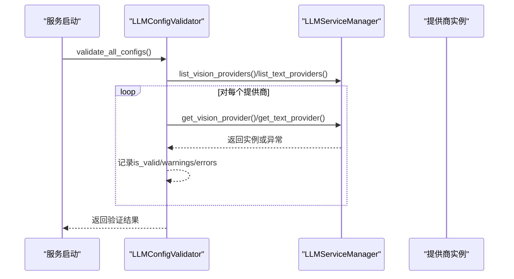
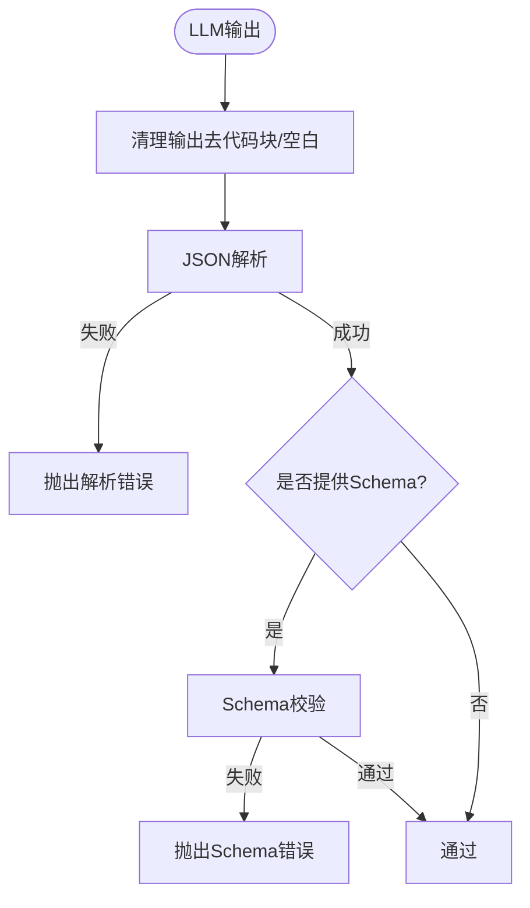
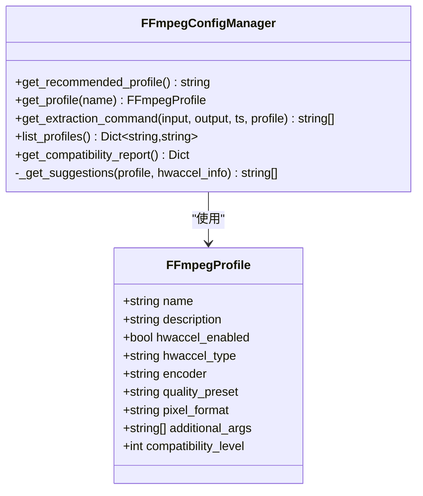
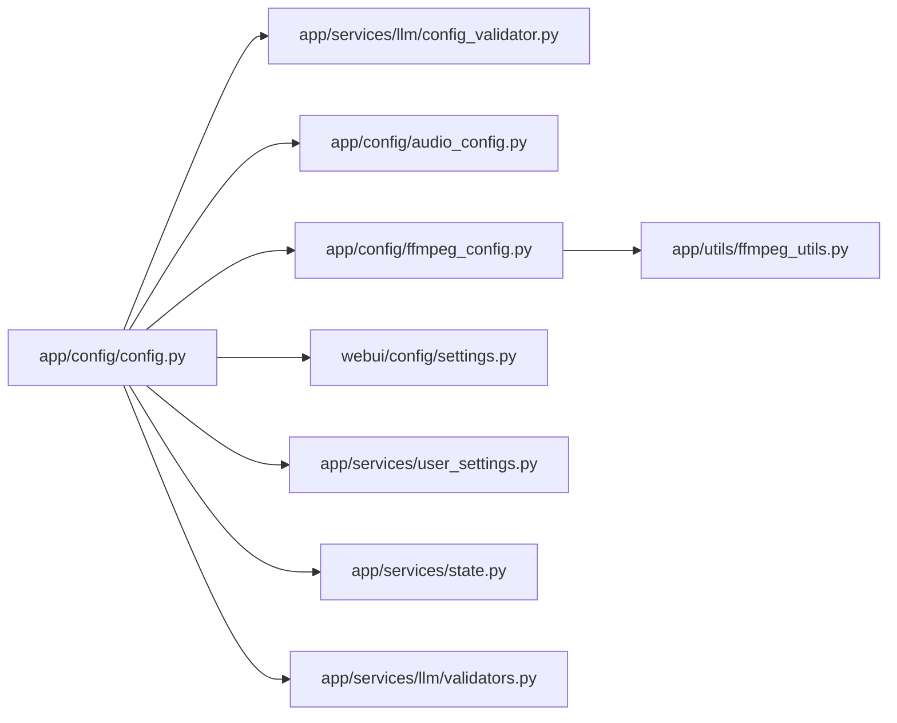

# 配置管理

<cite>
**本文引用的文件**
- [config.example.toml](file://config.example.toml)
- [app/config/config.py](file://app/config/config.py)
- [app/config/audio_config.py](file://app/config/audio_config.py)
- [app/config/ffmpeg_config.py](file://app/config/ffmpeg_config.py)
- [app/utils/ffmpeg_utils.py](file://app/utils/ffmpeg_utils.py)
- [app/services/llm/config_validator.py](file://app/services/llm/config_validator.py)
- [app/services/llm/validators.py](file://app/services/llm/validators.py)
- [webui/config/settings.py](file://webui/config/settings.py)
- [app/services/user_settings.py](file://app/services/user_settings.py)
- [app/services/state.py](file://app/services/state.py)
</cite>

## 目录
1. [简介](#简介)
2. [项目结构](#项目结构)
3. [核心组件](#核心组件)
4. [架构总览](#架构总览)
5. [详细组件分析](#详细组件分析)
6. [依赖关系分析](#依赖关系分析)
7. [性能考量](#性能考量)
8. [故障排查指南](#故障排查指南)
9. [结论](#结论)
10. [附录](#附录)

## 简介
本文件面向NarratoAI的配置管理，围绕config.example.toml配置文件展开，系统性说明各配置组的作用、参数含义、取值范围、使用场景与优先级规则；同时覆盖LLM提供商配置、音频引擎配置、视频处理与FFmpeg配置、WebUI与用户设置、配置验证与错误处理策略，并提供不同使用场景下的配置示例与迁移指南。

## 项目结构
配置系统由“示例配置文件 + 运行时加载 + WebUI配置 + 用户设置 + 验证器”构成：
- 示例配置：config.example.toml，提供完整参数清单与注释
- 运行时加载：app/config/config.py负责加载/保存配置，自动复制示例为正式配置
- WebUI配置：webui/config/settings.py提供WebUI侧配置读写
- 用户设置：app/services/user_settings.py支持按会话/文件档保存用户偏好
- 验证器：LLM配置验证器与输出格式验证器保障配置与输出质量
- FFmpeg：app/config/ffmpeg_config.py与app/utils/ffmpeg_utils.py共同提供硬件加速检测与FFmpeg参数生成

图表来源
- [app/config/config.py:24-71](file://app/config/config.py#L24-L71)
- [app/config/ffmpeg_config.py:27-158](file://app/config/ffmpeg_config.py#L27-L158)
- [app/utils/ffmpeg_utils.py:252-356](file://app/utils/ffmpeg_utils.py#L252-L356)
- [app/services/llm/config_validator.py:18-85](file://app/services/llm/config_validator.py#L18-L85)
- [app/services/llm/validators.py:15-53](file://app/services/llm/validators.py#L15-L53)
- [webui/config/settings.py:52-97](file://webui/config/settings.py#L52-L97)
- [app/services/user_settings.py:59-130](file://app/services/user_settings.py#L59-L130)
- [app/services/state.py:110-122](file://app/services/state.py#L110-L122)

章节来源
- [app/config/config.py:24-71](file://app/config/config.py#L24-L71)
- [webui/config/settings.py:52-97](file://webui/config/settings.py#L52-L97)

## 核心组件
- 配置加载与保存：自动从示例复制到正式配置，支持UTF-8/UTF-8-SIG编码容错
- LLM配置验证：对视觉/文本提供商配置进行完整性与可用性校验
- 输出格式验证：严格校验JSON输出结构与字段，提升鲁棒性
- FFmpeg配置管理：按平台与硬件自动推荐配置文件，生成命令参数
- 音频配置：音量、质量、处理与混合参数的默认值与校验
- WebUI与用户设置：WebUI配置读写、用户偏好持久化与会话映射

章节来源
- [app/config/config.py:24-71](file://app/config/config.py#L24-L71)
- [app/services/llm/config_validator.py:18-85](file://app/services/llm/config_validator.py#L18-L85)
- [app/services/llm/validators.py:15-53](file://app/services/llm/validators.py#L15-L53)
- [app/config/ffmpeg_config.py:27-158](file://app/config/ffmpeg_config.py#L27-L158)
- [app/config/audio_config.py:16-165](file://app/config/audio_config.py#L16-L165)
- [webui/config/settings.py:52-97](file://webui/config/settings.py#L52-L97)
- [app/services/user_settings.py:59-130](file://app/services/user_settings.py#L59-L130)

## 架构总览
配置系统采用“集中式配置 + 分层验证”的设计：
- 配置来源：config.example.toml → config.toml（首次运行自动复制）
- 加载入口：app/config/config.py统一加载并导出各段配置
- 验证入口：LLM配置验证器与输出格式验证器分别在服务层与业务层生效
- WebUI入口：webui/config/settings.py提供WebUI侧配置读写
- 用户设置：app/services/user_settings.py支持按会话/文件档持久化

图表来源
- [webui/config/settings.py:98-136](file://webui/config/settings.py#L98-L136)
- [app/config/config.py:47-58](file://app/config/config.py#L47-L58)
- [app/services/llm/config_validator.py:18-85](file://app/services/llm/config_validator.py#L18-L85)
- [app/config/ffmpeg_config.py:98-158](file://app/config/ffmpeg_config.py#L98-L158)
- [app/config/audio_config.py:88-96](file://app/config/audio_config.py#L88-L96)

## 详细组件分析

### 配置文件结构与参数详解
config.example.toml包含以下主要配置组与参数（节选说明，具体键名以文件为准）：
- [app] 应用基础配置
  - project_version：项目版本（来自project_version文件）
  - llm_vision_timeout / llm_text_timeout：视觉/文本模型请求超时（秒）
  - llm_max_retries：最大重试次数（由底层库处理）
  - hide_config：WebUI界面是否隐藏配置项
  - 其他高级配置（可选）
- [LLM Provider - LiteLLM] 统一LLM接口
  - vision_llm_provider / text_llm_provider：统一提供商标识
  - vision_litellm_model_name / text_litellm_model_name：模型名（provider/model）
  - vision_litellm_api_key / text_litellm_api_key：API密钥
  - vision_litellm_base_url / text_litellm_base_url：可选自定义Base URL
  - 传统Provider示例（不推荐）：gemini/openai/qwenvl/deepseek/siliconflow/moonshot
- [azure] Azure TTS
  - speech_key / speech_region：密钥与区域
- [tencent] 腾讯云TTS
  - secret_id / secret_key / region：密钥与地域
- [soulvoice] SoulVoice TTS
  - api_key / voice_uri / api_url / model：接口参数
- [tts_qwen] 通义千问TTS
  - api_key / model_name：密钥与模型
- [indextts2] IndexTTS2语音克隆
  - api_url：服务地址
  - reference_audio：可选参考音频路径
  - infer_mode：推理模式（普通/快速）
  - temperature / top_p / top_k / do_sample / num_beams / repetition_penalty：高级参数
- [ui] TTS引擎与语音参数
  - tts_engine：引擎选择（edge_tts/azure_speech/soulvoice/tencent_tts/tts_qwen）
  - edge_* / azure_*：对应引擎的语音参数（音量/语速/音高）
- [proxy] 代理与网络
  - http / https：HTTP/HTTPS代理
  - enabled：是否启用
- [frames] 视频处理
  - frame_interval_input：关键帧提取间隔（秒）
  - vision_batch_size：大模型单次处理的关键帧数量

章节来源
- [config.example.toml:1-177](file://config.example.toml#L1-L177)

### 配置加载与保存流程
- 首次运行：若config.toml不存在，自动从config.example.toml复制一份
- 编码容错：若标准UTF-8加载失败，回退至UTF-8-SIG
- 保存：将app/proxy/azure/tencent/soulvoice/ui/tts_qwen/indextts2等段落写回
- 环境变量：IMAGEMAGICK_BINARY与IMAGEIO_FFMPEG_EXE可通过配置路径注入

图表来源
- [app/config/config.py:24-44](file://app/config/config.py#L24-L44)

章节来源
- [app/config/config.py:24-44](file://app/config/config.py#L24-L44)
- [app/config/config.py:47-58](file://app/config/config.py#L47-L58)

### LLM配置验证机制
- 验证范围：遍历所有视觉/文本提供商，逐个验证API Key、模型名、Base URL
- 实例化验证：尝试创建提供商实例以确认可用性
- 报告输出：汇总总数、有效数、错误与警告，并打印报告
- 建议生成：为每个提供商给出必填/可选配置与示例模型

图表来源
- [app/services/llm/config_validator.py:18-85](file://app/services/llm/config_validator.py#L18-L85)
- [app/services/llm/config_validator.py:87-199](file://app/services/llm/config_validator.py#L87-L199)

章节来源
- [app/services/llm/config_validator.py:18-85](file://app/services/llm/config_validator.py#L18-L85)
- [app/services/llm/config_validator.py:280-309](file://app/services/llm/config_validator.py#L280-L309)

### 输出格式验证机制
- JSON清理：去除markdown代码块标记，剥离前后空白
- Schema验证：支持基础类型与必需字段校验
- 专项验证：针对解说文案与字幕分析输出进行结构与内容校验
- 错误分类：区分解析失败、类型不符、字段缺失、格式错误等

图表来源
- [app/services/llm/validators.py:18-53](file://app/services/llm/validators.py#L18-L53)
- [app/services/llm/validators.py:90-144](file://app/services/llm/validators.py#L90-L144)
- [app/services/llm/validators.py:166-201](file://app/services/llm/validators.py#L166-L201)

章节来源
- [app/services/llm/validators.py:18-53](file://app/services/llm/validators.py#L18-L53)
- [app/services/llm/validators.py:90-144](file://app/services/llm/validators.py#L90-L144)
- [app/services/llm/validators.py:166-201](file://app/services/llm/validators.py#L166-L201)

### FFmpeg配置管理与硬件加速
- 配置文件：内置多种profile（高性能/兼容性/Windows NVIDIA/macOS VideoToolbox/通用软件），按平台与GPU厂商自动推荐
- 硬件加速检测：渐进式检测与智能降级，支持CUDA/NVENC/VAAPI/QSV/AMF/VideoToolbox等
- 命令生成：根据profile生成关键帧提取等FFmpeg命令参数
- 兼容性报告：输出系统、推荐profile、兼容级别与建议

图表来源
- [app/config/ffmpeg_config.py:13-25](file://app/config/ffmpeg_config.py#L13-L25)
- [app/config/ffmpeg_config.py:27-158](file://app/config/ffmpeg_config.py#L27-L158)

章节来源
- [app/config/ffmpeg_config.py:27-158](file://app/config/ffmpeg_config.py#L27-L158)
- [app/utils/ffmpeg_utils.py:252-356](file://app/utils/ffmpeg_utils.py#L252-L356)

### 音频配置与处理
- 默认音量：TTS/原声/BGM三者比例与采样率/声道/比特率等质量参数
- 智能音量与标准化：目标响度LUFS、峰值dBFS、分析方法（LUFS/RMS）
- 混合参数：交叉淡化、BGM淡出、动态范围压缩
- 校验与限制：音量上下限校验与警告
- 预设配置文件：平衡/聚焦/安静背景等

章节来源
- [app/config/audio_config.py:16-165](file://app/config/audio_config.py#L16-L165)

### WebUI与用户设置
- WebUI配置：加载/保存WebUI专用配置，支持UTF-8 TOML写入
- 用户设置：按会话/文件档保存用户偏好（允许键集合），支持从运行时快照恢复
- 环境变量：NARRATOAI_PROFILE决定用户设置档名

章节来源
- [webui/config/settings.py:52-97](file://webui/config/settings.py#L52-L97)
- [webui/config/settings.py:98-136](file://webui/config/settings.py#L98-L136)
- [app/services/user_settings.py:14-130](file://app/services/user_settings.py#L14-L130)

## 依赖关系分析
- 配置加载依赖：app/config/config.py依赖toml与loguru，负责统一导出各段配置
- LLM验证依赖：app/services/llm/config_validator.py依赖LLMServiceManager与app.config.config
- FFmpeg依赖：app/config/ffmpeg_config.py依赖app/utils/ffmpeg_utils.py进行硬件加速检测
- 输出验证依赖：app/services/llm/validators.py依赖json与re
- 用户设置依赖：app/services/user_settings.py依赖app.config.config与utils.storage_dir

图表来源
- [app/config/config.py:60-71](file://app/config/config.py#L60-L71)
- [app/services/llm/config_validator.py:10-12](file://app/services/llm/config_validator.py#L10-L12)
- [app/config/ffmpeg_config.py:110-119](file://app/config/ffmpeg_config.py#L110-L119)
- [app/services/llm/validators.py:7-12](file://app/services/llm/validators.py#L7-L12)
- [app/services/user_settings.py:9-10](file://app/services/user_settings.py#L9-L10)
- [app/services/state.py:110-122](file://app/services/state.py#L110-L122)

章节来源
- [app/config/config.py:60-71](file://app/config/config.py#L60-L71)
- [app/services/llm/config_validator.py:10-12](file://app/services/llm/config_validator.py#L10-L12)
- [app/config/ffmpeg_config.py:110-119](file://app/config/ffmpeg_config.py#L110-L119)
- [app/services/llm/validators.py:7-12](file://app/services/llm/validators.py#L7-L12)
- [app/services/user_settings.py:9-10](file://app/services/user_settings.py#L9-L10)
- [app/services/state.py:110-122](file://app/services/state.py#L110-L122)

## 性能考量
- FFmpeg配置：优先使用硬件加速（CUDA/NVENC/VAAPI/QSV/AMF/VideoToolbox），自动降级至软件编码
- 关键帧提取：frame_interval_input与vision_batch_size影响处理吞吐与成本
- 音频处理：开启智能音量与标准化可提升一致性，但增加CPU开销
- LLM重试：llm_max_retries由底层库处理，建议结合超时与降级策略

[本节为通用指导，无需源码引用]

## 故障排查指南
- 配置加载失败
  - 现象：无法读取config.toml
  - 处理：确认文件存在；若为目录则删除；检查编码（UTF-8/UTF-8-SIG）
- LLM配置错误
  - 现象：提供商实例创建失败或缺少API Key/模型名
  - 处理：使用LLM配置验证器生成报告；补齐必填项；确认Base URL
- 输出格式错误
  - 现象：JSON解析失败或字段缺失
  - 处理：启用输出格式验证器；检查提示词与响应格式；必要时清理Markdown标记
- FFmpeg问题
  - 现象：硬件加速不可用或滤镜链错误
  - 处理：查看兼容性报告；切换兼容性配置；Windows NVIDIA优先纯NVENC方案

章节来源
- [app/config/config.py:24-44](file://app/config/config.py#L24-L44)
- [app/services/llm/config_validator.py:87-199](file://app/services/llm/config_validator.py#L87-L199)
- [app/services/llm/validators.py:18-53](file://app/services/llm/validators.py#L18-L53)
- [app/utils/ffmpeg_utils.py:252-356](file://app/utils/ffmpeg_utils.py#L252-L356)

## 结论
NarratoAI的配置管理以config.example.toml为核心，配合运行时加载、WebUI配置、用户设置与多层次验证，形成“可读、可改、可校验、可迁移”的体系。通过硬件加速检测与FFmpeg配置管理，系统在不同平台与硬件条件下具备良好的性能与兼容性；通过LLM与输出格式验证器，保障服务稳定与产出质量。

[本节为总结，无需源码引用]

## 附录

### 环境变量与优先级
- IMAGEMAGICK_BINARY：当配置中提供Magick路径时注入环境变量
- IMAGEIO_FFMPEG_EXE：当配置中提供FFmpeg路径时注入环境变量
- NARRATOAI_PROFILE：用户设置档名，默认“default”
- 优先级：运行时配置 > 环境变量注入 > 默认值

章节来源
- [app/config/config.py:86-92](file://app/config/config.py#L86-L92)
- [app/services/user_settings.py:14](file://app/services/user_settings.py#L14)

### 不同使用场景的配置示例
- 本地开发
  - 使用LiteLLM统一接口，配置vision/text模型名与API Key
  - 开启/关闭代理（proxy.enabled）
  - 调整frames.frame_interval_input与vision_batch_size以平衡速度与成本
- 生产部署
  - 选择稳定Base URL，设置合理超时与重试
  - 启用硬件加速（FFmpeg），使用兼容性配置兜底
  - 配置TTS引擎与语音参数，确保跨平台一致性
- 性能优化
  - 提升vision_batch_size与frame_interval_input
  - 使用高性能profile（Windows NVIDIA优先纯NVENC）
  - 合理设置音频混合参数与目标响度

[本节为通用指导，无需源码引用]

### 配置迁移指南与版本兼容
- 迁移策略
  - 从传统Provider配置迁移到LiteLLM统一接口
  - 使用LLM配置验证器检查迁移后配置有效性
  - 逐步替换旧接口调用为UnifiedLLMService
- 版本兼容
  - 项目版本来自project_version文件，不从配置读取
  - WebUI配置文件路径与保存逻辑独立于主配置

章节来源
- [app/config/config.py:12-22](file://app/config/config.py#L12-L22)
- [webui/config/settings.py:84-90](file://webui/config/settings.py#L84-L90)