# 音频TTS配置

<cite>
**本文档引用的文件**
- [audio_config.py](file://app/config/audio_config.py)
- [config.py](file://app/config/config.py)
- [tts_cache.py](file://app/services/tts_cache.py)
- [audio_settings.py](file://webui/components/audio_settings.py)
- [schema.py](file://app/models/schema.py)
- [voice.py](file://app/services/voice.py)
- [config.example.toml](file://config.example.toml)
- [utils.py](file://app/utils/utils.py)
</cite>

## 目录
1. [简介](#简介)
2. [项目结构](#项目结构)
3. [核心组件](#核心组件)
4. [架构概览](#架构概览)
5. [详细组件分析](#详细组件分析)
6. [依赖关系分析](#依赖关系分析)
7. [性能考虑](#性能考虑)
8. [故障排除指南](#故障排除指南)
9. [结论](#结论)

## 简介

NarratoAI 是一个综合性的视频生成平台，专注于自动化视频内容创作。本项目的核心音频TTS（Text-to-Speech）配置系统提供了多种TTS引擎的支持，包括Azure Speech、腾讯云TTS、SoulVoice、通义千问TTS和IndexTTS2语音克隆。该系统旨在为用户提供灵活、高质量的语音合成解决方案，满足不同场景下的音频需求。

音频TTS配置系统的主要目标是：
- 支持多种TTS引擎的统一配置和管理
- 提供灵活的音频参数调节能力
- 实现智能缓存机制以提升性能
- 提供直观的Web界面配置体验
- 支持语音克隆和个性化定制

## 项目结构

音频TTS配置系统主要分布在以下几个关键模块中：

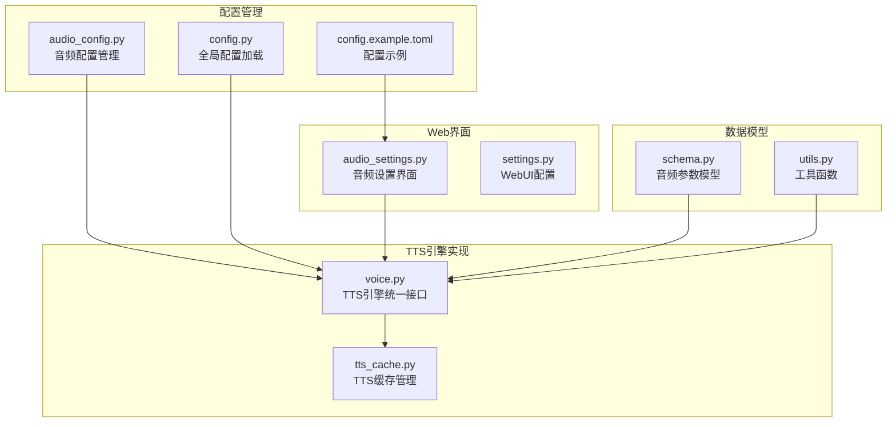

**图表来源**
- [audio_config.py:1-221](file://app/config/audio_config.py#L1-L221)
- [config.py:1-95](file://app/config/config.py#L1-L95)
- [voice.py:1-800](file://app/services/voice.py#L1-L800)

**章节来源**
- [audio_config.py:1-221](file://app/config/audio_config.py#L1-L221)
- [config.py:1-95](file://app/config/config.py#L1-L95)
- [config.example.toml:1-177](file://config.example.toml#L1-L177)

## 核心组件

### 音频配置管理器

AudioConfig类是整个音频配置系统的核心，提供了全面的音频参数管理和优化功能：

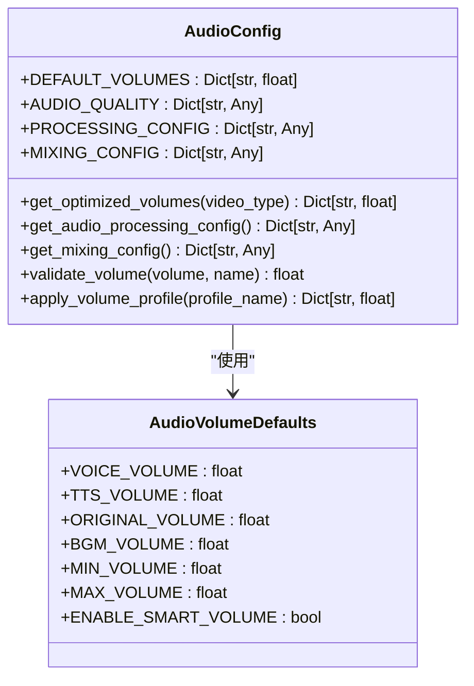

**图表来源**
- [audio_config.py:16-165](file://app/config/audio_config.py#L16-L165)
- [schema.py:16-35](file://app/models/schema.py#L16-L35)

音频配置管理器的核心特性包括：

1. **默认音量配置**：提供针对不同视频类型的优化音量设置
2. **音频质量参数**：采样率、声道数、比特率等基础音频参数
3. **智能音量调整**：基于LUFS响度和峰值电平的自动音量优化
4. **音频混合配置**：交叉淡化、动态范围压缩等功能
5. **预设音量配置文件**：平衡、专注、原声等不同场景的音量配置

**章节来源**
- [audio_config.py:16-165](file://app/config/audio_config.py#L16-L165)
- [schema.py:16-35](file://app/models/schema.py#L16-L35)

### 全局配置系统

全局配置系统负责管理应用程序的所有配置信息，包括TTS引擎的详细配置：

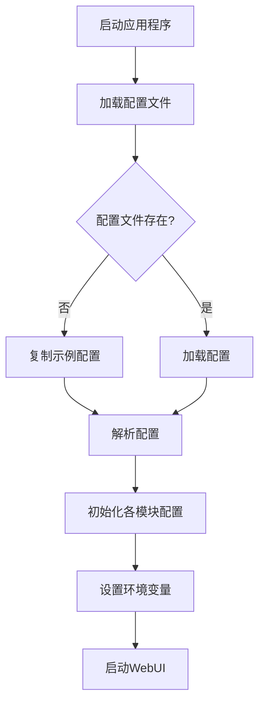

**图表来源**
- [config.py:24-44](file://app/config/config.py#L24-L44)

全局配置系统的关键功能：
- 自动检测和创建配置文件
- 支持UTF-8-SIG编码的配置文件
- 加载和保存配置信息
- 设置FFmpeg和ImageMagick路径

**章节来源**
- [config.py:24-95](file://app/config/config.py#L24-L95)

## 架构概览

音频TTS配置系统采用分层架构设计，实现了高度模块化的组件分离：

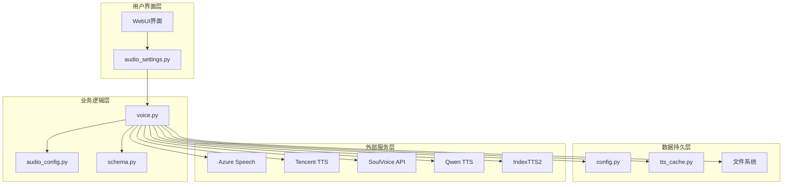

**图表来源**
- [voice.py:1119-1153](file://app/services/voice.py#L1119-L1153)
- [audio_settings.py:22-30](file://webui/components/audio_settings.py#L22-L30)

系统架构的核心特点：
- **统一接口**：所有TTS引擎通过统一的接口进行调用
- **智能路由**：根据语音名称自动选择合适的TTS引擎
- **缓存机制**：实现TTS结果的智能缓存和复用
- **配置驱动**：所有参数都通过配置文件进行管理

**章节来源**
- [voice.py:1119-1153](file://app/services/voice.py#L1119-L1153)
- [audio_settings.py:22-30](file://webui/components/audio_settings.py#L22-L30)

## 详细组件分析

### TTS引擎统一接口

voice.py文件实现了所有TTS引擎的统一接口，提供了智能的引擎选择和路由功能：

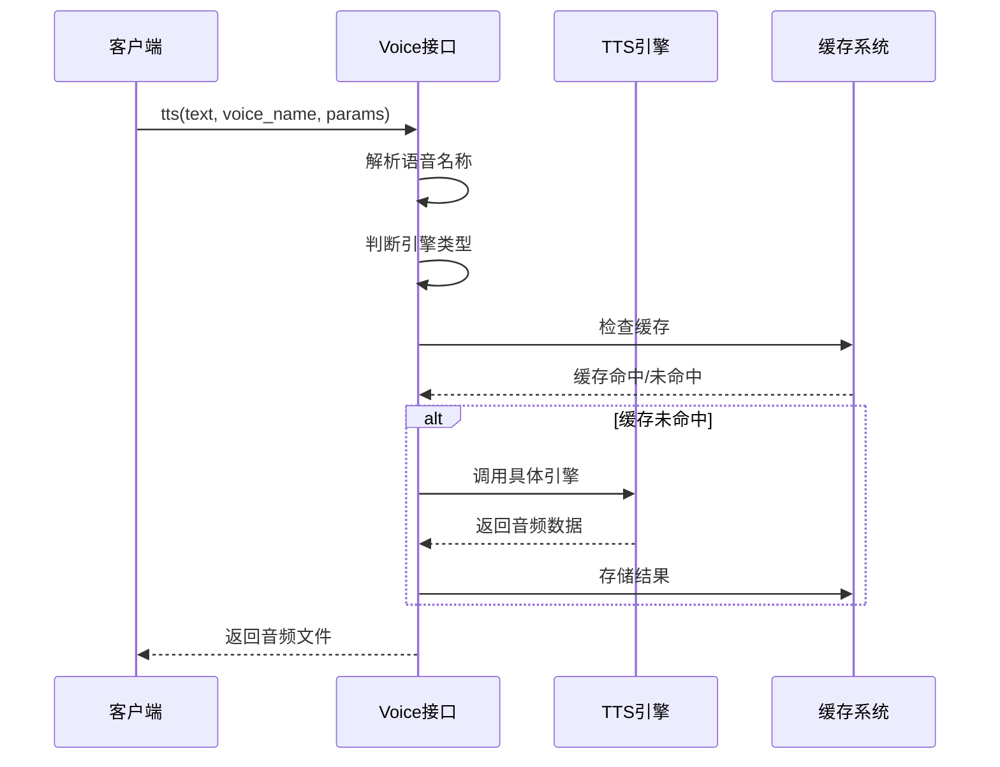

**图表来源**
- [voice.py:1119-1153](file://app/services/voice.py#L1119-L1153)
- [tts_cache.py:45-94](file://app/services/tts_cache.py#L45-L94)

统一接口的核心功能：
- **智能引擎选择**：根据语音名称自动识别TTS引擎类型
- **参数转换**：将统一的参数格式转换为各引擎特定的参数
- **错误处理**：实现统一的错误处理和重试机制
- **结果缓存**：自动缓存TTS结果以提升性能

**章节来源**
- [voice.py:1119-1153](file://app/services/voice.py#L1119-L1153)
- [tts_cache.py:45-94](file://app/services/tts_cache.py#L45-L94)

### Azure Speech Services集成

Azure Speech Services提供了企业级的语音合成服务，支持多种语言和音色：

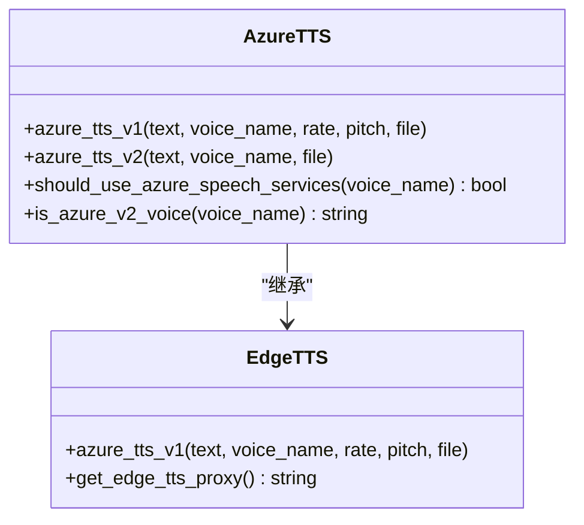

**图表来源**
- [voice.py:1186-1245](file://app/services/voice.py#L1186-L1245)
- [voice.py:1248-1339](file://app/services/voice.py#L1248-L1339)

Azure Speech Services的特点：
- **V1版本**：基于Edge TTS的免费服务，支持基本的语速和音调调节
- **V2版本**：基于Azure SDK的企业级服务，支持更丰富的音色和参数
- **自动识别**：根据语音名称自动选择合适的Azure版本
- **代理支持**：支持通过代理服务器访问Azure服务

**章节来源**
- [voice.py:1186-1339](file://app/services/voice.py#L1186-L1339)

### 腾讯云TTS集成

腾讯云TTS提供了高质量的中文语音合成服务，支持多种音色和方言：

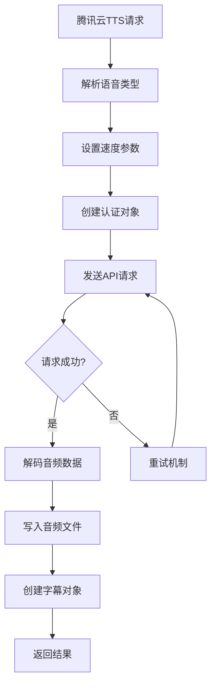

**图表来源**
- [voice.py:1796-1896](file://app/services/voice.py#L1796-L1896)

腾讯云TTS的核心功能：
- **多音色支持**：支持18种不同的中文音色
- **速度调节**：支持-2到2的速度范围调节
- **字幕生成**：自动生成精确的字幕时间戳
- **区域配置**：支持全球多个地区的服务节点

**章节来源**
- [voice.py:1796-1896](file://app/services/voice.py#L1796-L1896)

### 通义千问TTS集成

通义千问TTS基于阿里云DashScope平台，提供了高质量的中文语音合成：

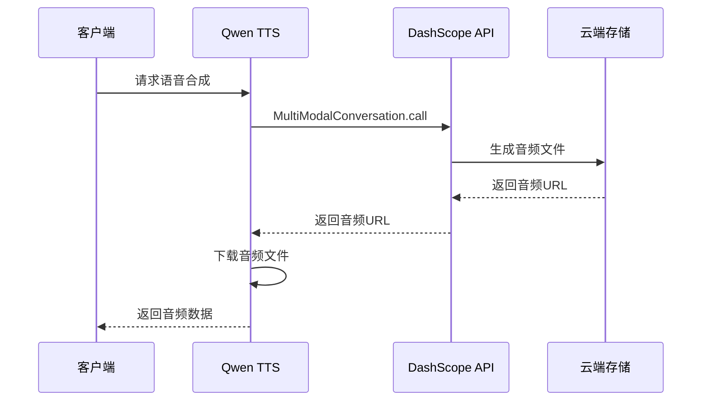

**图表来源**
- [voice.py:1700-1793](file://app/services/voice.py#L1700-L1793)

通义千问TTS的优势：
- **高质量音色**：支持多种音色参数，包括Cherry、Ethan等
- **Flash模型**：提供快速的语音合成能力
- **中文优化**：针对中文语音进行了专门优化
- **API集成**：通过DashScope SDK实现无缝集成

**章节来源**
- [voice.py:1700-1793](file://app/services/voice.py#L1700-L1793)

### SoulVoice集成

SoulVoice提供了独特的语音合成服务，支持自定义音色和风格：

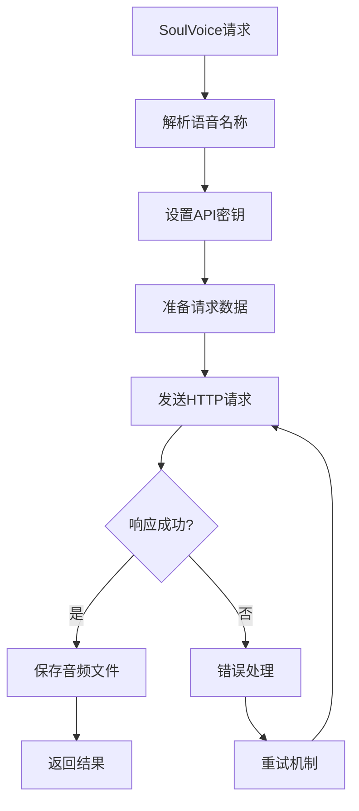

**图表来源**
- [voice.py:1899-1987](file://app/services/voice.py#L1899-L1987)

SoulVoice的特点：
- **自定义音色**：支持通过语音URI自定义音色
- **灵活配置**：支持模型选择和参数调节
- **API集成**：通过REST API实现语音合成
- **代理支持**：支持通过代理服务器访问

**章节来源**
- [voice.py:1899-1987](file://app/services/voice.py#L1899-L1987)

### IndexTTS2语音克隆

IndexTTS2实现了零样本语音克隆技术，能够基于参考音频生成相同音色的语音：

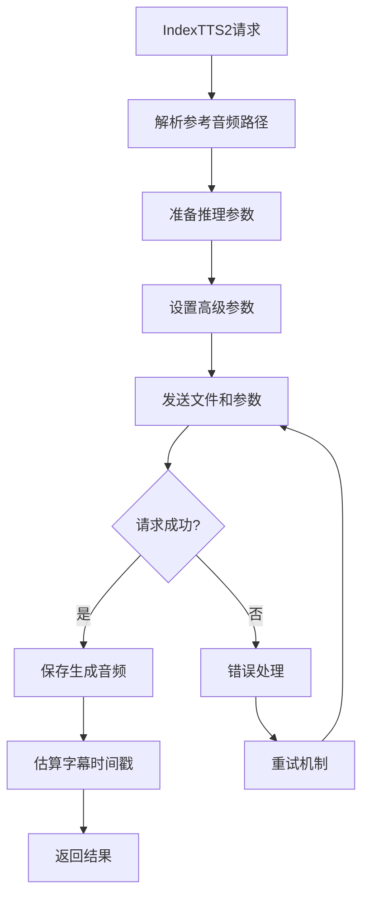

**图表来源**
- [voice.py:2022-2131](file://app/services/voice.py#L2022-L2131)

IndexTTS2的核心功能：
- **语音克隆**：基于参考音频实现零样本语音克隆
- **高级参数**：支持温度、Top-P、Top-K等高级推理参数
- **推理模式**：提供普通推理和快速推理两种模式
- **文件上传**：支持直接上传参考音频文件

**章节来源**
- [voice.py:2022-2131](file://app/services/voice.py#L2022-L2131)

### Web界面配置系统

WebUI提供了直观的图形化界面来配置和管理TTS引擎：

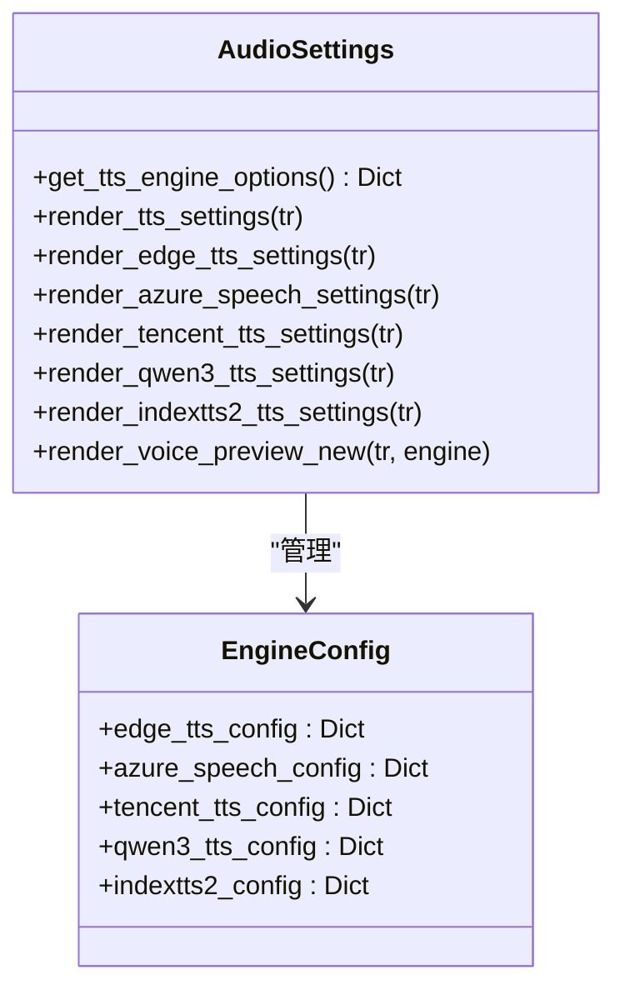

**图表来源**
- [audio_settings.py:22-782](file://webui/components/audio_settings.py#L22-L782)

Web界面的核心功能：
- **引擎选择**：提供多种TTS引擎的可视化选择
- **参数配置**：支持每个引擎的特定参数配置
- **实时预览**：提供语音合成的实时试听功能
- **配置保存**：自动保存用户的配置设置

**章节来源**
- [audio_settings.py:22-782](file://webui/components/audio_settings.py#L22-L782)

## 依赖关系分析

音频TTS配置系统的依赖关系呈现清晰的层次结构：

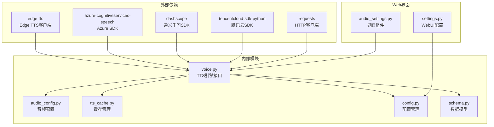

**图表来源**
- [voice.py:1-25](file://app/services/voice.py#L1-L25)
- [audio_settings.py:1-8](file://webui/components/audio_settings.py#L1-L8)

依赖关系的特点：
- **外部依赖隔离**：每个TTS引擎都有独立的SDK依赖
- **内部模块解耦**：通过统一接口实现模块间的松耦合
- **配置驱动**：所有外部依赖都通过配置文件进行管理
- **错误隔离**：单个引擎的故障不会影响其他引擎的使用

**章节来源**
- [voice.py:1-25](file://app/services/voice.py#L1-L25)
- [audio_settings.py:1-8](file://webui/components/audio_settings.py#L1-L8)

## 性能考虑

音频TTS配置系统在性能方面采用了多项优化策略：

### 缓存机制

TTS缓存系统通过智能的键值生成和文件组织来提升性能：

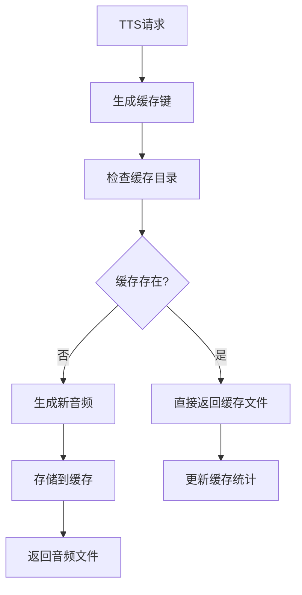

**图表来源**
- [tts_cache.py:24-94](file://app/services/tts_cache.py#L24-L94)

缓存优化策略：
- **智能键值生成**：基于文本内容、音色参数、引擎类型生成唯一键
- **文件组织**：按缓存键创建独立的缓存目录
- **元数据管理**：存储音频时长等元数据信息
- **自动清理**：支持缓存文件的自动清理和管理

### 音频参数优化

音频配置系统提供了多种参数优化策略：

| 参数类别 | 默认值 | 优化策略 | 适用场景 |
|---------|--------|----------|----------|
| 采样率 | 44100 Hz | 固定44.1kHz采样率 | 标准音频质量 |
| 声道数 | 2声道 | 立体声输出 | 通用音频播放 |
| 比特率 | 128k | 可调节比特率 | 网络传输优化 |
| 目标响度 | -20.0 LUFS | 智能响度归一化 | 广播标准 |
| 最大峰值 | -1.0 dBFS | 峰值限制 | 防止削波 |

### 引擎选择策略

系统采用智能的TTS引擎选择策略：

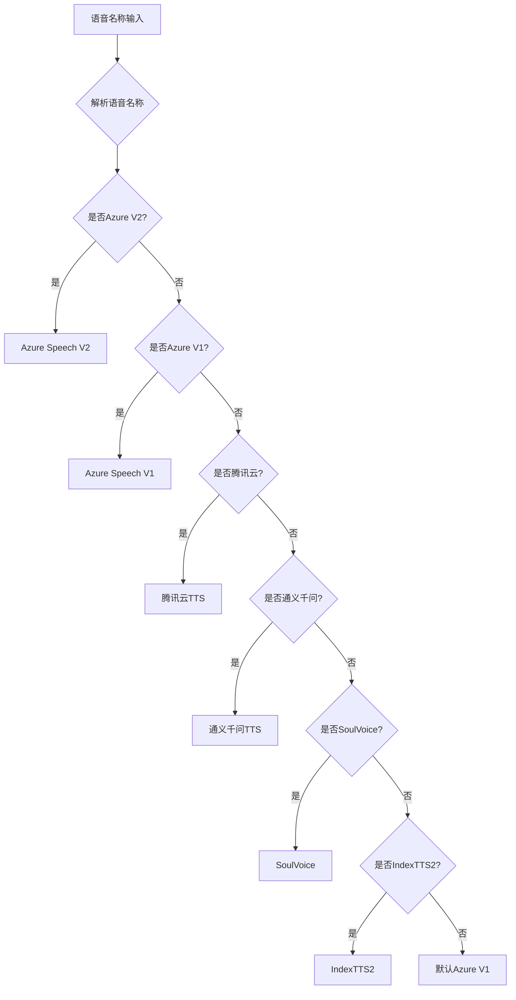

**图表来源**
- [voice.py:1098-1116](file://app/services/voice.py#L1098-L1116)

## 故障排除指南

### 常见配置问题

#### Azure Speech配置问题

**问题症状**：Azure Speech服务无法连接或返回认证错误

**解决步骤**：
1. 验证API密钥和区域设置
2. 检查网络连接和防火墙设置
3. 确认Azure账户的Speech Services服务已启用
4. 验证语音名称格式是否正确

#### 腾讯云TTS配置问题

**问题症状**：腾讯云TTS返回"签名错误"或"权限不足"

**解决步骤**：
1. 检查Secret ID和Secret Key是否正确
2. 验证腾讯云账户的TTS服务权限
3. 确认请求的地域设置是否正确
4. 检查API调用频率限制

#### 通义千问TTS配置问题

**问题症状**：DashScope SDK导入失败或API调用超时

**解决步骤**：
1. 安装DashScope SDK：`pip install dashscope`
2. 验证API密钥的有效性
3. 检查网络连接和代理设置
4. 确认模型名称和音色参数正确

#### IndexTTS2配置问题

**问题症状**：IndexTTS2服务无法连接或推理失败

**解决步骤**：
1. 确认IndexTTS2服务已正确部署
2. 验证API地址和端口设置
3. 检查参考音频文件的格式和质量
4. 确认推理参数设置合理

### 网络连接测试

系统提供了多种网络连接测试方法：

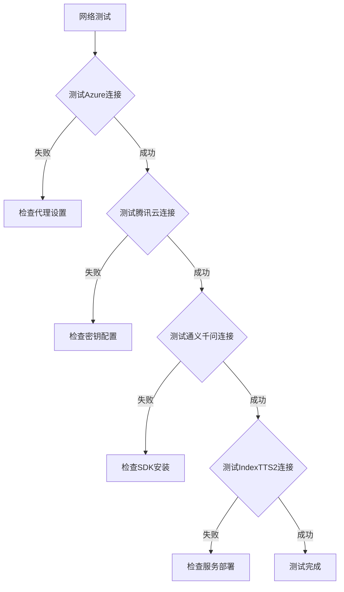

**章节来源**
- [audio_settings.py:69-81](file://webui/components/audio_settings.py#L69-L81)

### 性能优化建议

#### 缓存优化
- 合理设置缓存目录空间
- 定期清理过期的缓存文件
- 监控缓存命中率并调整策略

#### 引擎选择优化
- 根据内容类型选择最适合的TTS引擎
- 考虑网络延迟和成本因素
- 在开发环境中使用免费引擎，在生产环境中使用付费引擎

#### 参数调优
- 根据目标受众调整语速和音调
- 优化音频质量参数以平衡文件大小和音质
- 调整响度归一化参数以适应不同播放环境

## 结论

NarratoAI的音频TTS配置系统提供了一个完整、灵活且高性能的语音合成解决方案。通过统一的接口设计、智能的引擎选择机制和完善的缓存系统，该系统能够满足从个人用户到企业级应用的各种需求。

系统的主要优势包括：
- **多引擎支持**：支持Azure、腾讯云、通义千问、SoulVoice和IndexTTS2等多种TTS引擎
- **智能配置**：通过Web界面提供直观的配置体验
- **性能优化**：实现智能缓存和参数优化
- **错误处理**：完善的错误处理和重试机制
- **扩展性强**：模块化设计便于添加新的TTS引擎

未来的发展方向包括：
- 支持更多TTS引擎和服务提供商
- 增强语音克隆功能的精度和质量
- 优化移动端和边缘设备的性能表现
- 提供更丰富的音频处理和编辑功能

通过持续的优化和改进，音频TTS配置系统将继续为用户提供高质量的语音合成服务，推动AI视频生成技术的发展和应用。