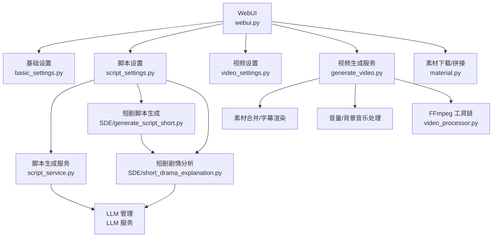
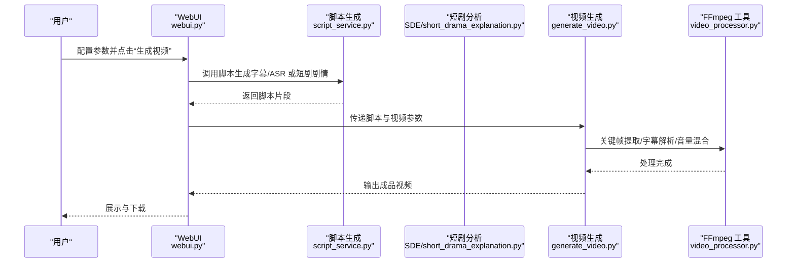
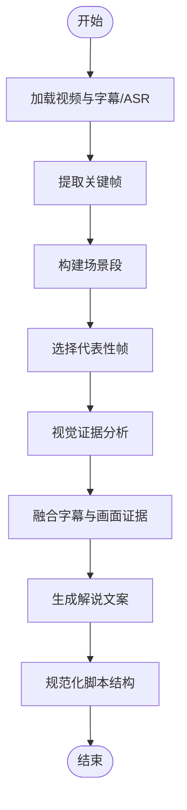
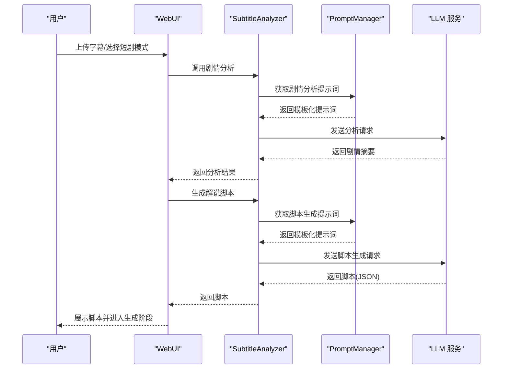
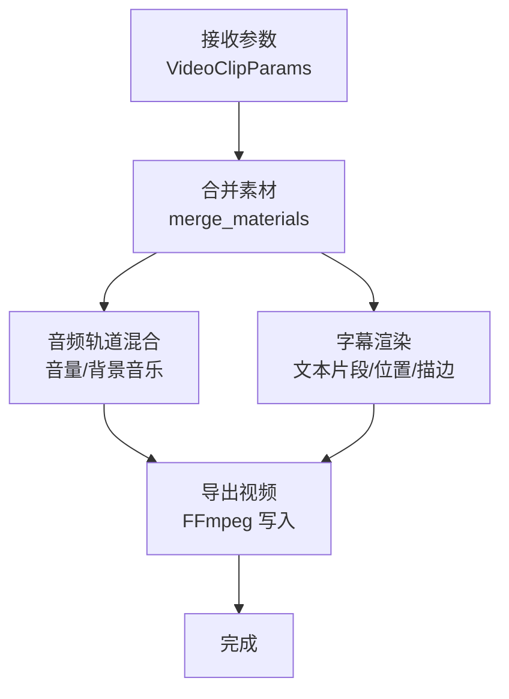
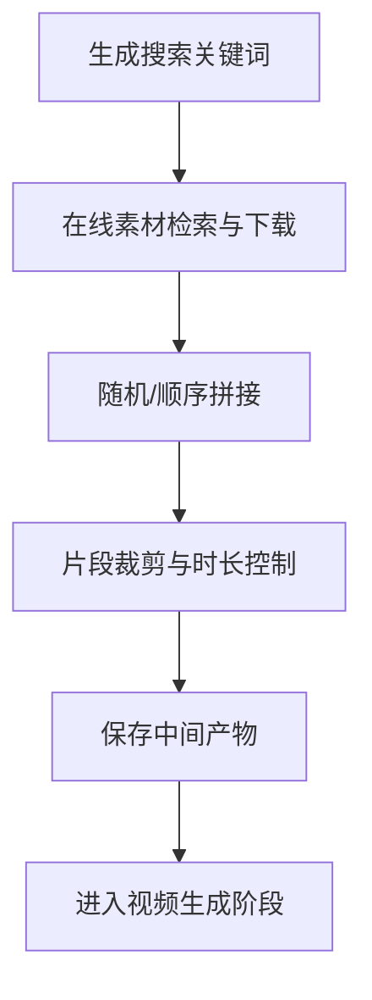
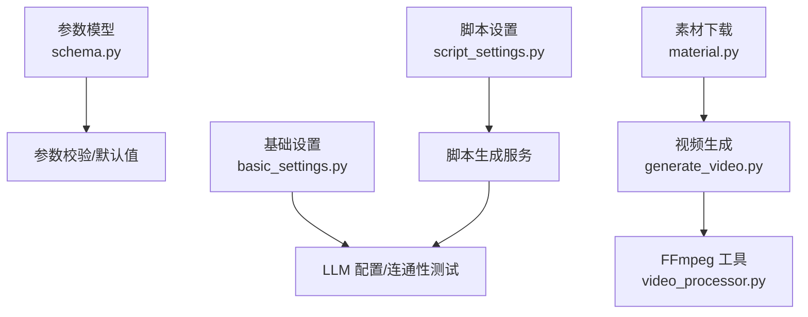

# 应用场景与用户群体

<cite>
**本文档引用的文件**
- [README.md](file://README.md)
- [README-en.md](file://README-en.md)
- [webui.py](file://webui.py)
- [app/services/script_service.py](file://app/services/script_service.py)
- [app/services/SDE/short_drama_explanation.py](file://app/services/SDE/short_drama_explanation.py)
- [app/services/SDE/generate_script_short.py](file://app/services/SDE/generate_script_short.py)
- [app/services/generate_video.py](file://app/services/generate_video.py)
- [app/models/schema.py](file://app/models/schema.py)
- [webui/components/basic_settings.py](file://webui/components/basic_settings.py)
- [webui/components/script_settings.py](file://webui/components/script_settings.py)
- [webui/components/video_settings.py](file://webui/components/video_settings.py)
- [app/utils/video_processor.py](file://app/utils/video_processor.py)
- [app/services/material.py](file://app/services/material.py)
- [app/services/prompts/documentary/narration_generation.py](file://app/services/prompts/documentary/narration_generation.py)
- [app/services/prompts/short_drama_narration/script_generation.py](file://app/services/prompts/short_drama_narration/script_generation.py)
</cite>

## 目录
1. [简介](#简介)
2. [项目结构](#项目结构)
3. [核心组件](#核心组件)
4. [架构总览](#架构总览)
5. [详细组件分析](#详细组件分析)
6. [依赖关系分析](#依赖关系分析)
7. [性能考量](#性能考量)
8. [故障排查指南](#故障排查指南)
9. [结论](#结论)
10. [附录](#附录)

## 简介
NarratoAI 是一个面向短视频与影视解说的自动化内容创作平台，围绕“脚本生成—素材准备—视频剪辑—配音字幕—最终发布”的全流程进行工程化封装，支持多模态 LLM（视觉与文本）协同工作，覆盖从独立创作者到企业营销团队的多样化使用场景。

## 项目结构
- WebUI 层：基于 Streamlit 的图形界面，提供 LLM 配置、脚本生成、视频参数配置与一键生成入口。
- 服务层：包含脚本生成、视频处理、字幕与音频处理、素材下载与拼接、TTS 与语音合成等模块。
- 工具与模型层：关键帧提取、FFmpeg 管理、提示词模板、音量与字幕渲染等。
- 配置与模型参数：统一的数据模型与参数校验，保证跨模块一致性。

图表来源
- [webui.py](file://webui.py)
- [webui/components/basic_settings.py](file://webui/components/basic_settings.py)
- [webui/components/script_settings.py](file://webui/components/script_settings.py)
- [webui/components/video_settings.py](file://webui/components/video_settings.py)
- [app/services/script_service.py](file://app/services/script_service.py)
- [app/services/SDE/generate_script_short.py](file://app/services/SDE/generate_script_short.py)
- [app/services/SDE/short_drama_explanation.py](file://app/services/SDE/short_drama_explanation.py)
- [app/services/generate_video.py](file://app/services/generate_video.py)
- [app/utils/video_processor.py](file://app/utils/video_processor.py)
- [app/services/material.py](file://app/services/material.py)

章节来源
- [webui.py](file://webui.py)
- [README.md](file://README.md)
- [README-en.md](file://README-en.md)

## 核心组件
- LLM 服务与提示词体系：统一管理文本与视觉模型提供商，支持多厂商（如 Gemini、OpenAI、DeepSeek、Qwen 等），并通过提示词模板驱动脚本生成与剧情分析。
- 脚本生成管线：支持两类脚本生成路径——“基于字幕/ASR 的纪录片风格”和“基于短剧剧情分析的短视频风格”，并提供回退与预算控制能力。
- 视频生成与渲染：关键帧提取、字幕解析、音量与背景音乐混合、字幕文本渲染与导出。
- 素材准备与拼接：支持在线素材检索与下载、随机/顺序拼接、片段时长与分辨率控制。
- WebUI 配置与参数：统一的参数模型与校验，支持多语言、代理、模型连通性测试与缓存清理。

章节来源
- [app/services/script_service.py](file://app/services/script_service.py)
- [app/services/SDE/short_drama_explanation.py](file://app/services/SDE/short_drama_explanation.py)
- [app/services/generate_video.py](file://app/services/generate_video.py)
- [app/models/schema.py](file://app/models/schema.py)
- [webui/components/basic_settings.py](file://webui/components/basic_settings.py)
- [webui/components/script_settings.py](file://webui/components/script_settings.py)
- [webui/components/video_settings.py](file://webui/components/video_settings.py)
- [app/utils/video_processor.py](file://app/utils/video_processor.py)
- [app/services/material.py](file://app/services/material.py)

## 架构总览
NarratoAI 的整体架构围绕“LLM 驱动的脚本生成 + 多媒体处理流水线”的思路设计，前端通过 WebUI 提供参数配置与一键生成，后端通过服务层协调各模块完成从素材到成品视频的自动化生产。

图表来源
- [webui.py](file://webui.py)
- [app/services/script_service.py](file://app/services/script_service.py)
- [app/services/SDE/short_drama_explanation.py](file://app/services/SDE/short_drama_explanation.py)
- [app/services/generate_video.py](file://app/services/generate_video.py)
- [app/utils/video_processor.py](file://app/utils/video_processor.py)

## 详细组件分析

### 应用场景与用户群体

- 短视频内容创作
  - 场景需求：快速将现有视频与字幕转化为带配音与字幕的短视频，适合抖音、快手、视频号等平台。
  - 用户痛点：人工脚本撰写耗时、字幕与画面不匹配、配音与原声音量不均衡。
  - NarratoAI 解决：一键脚本生成（字幕/ASR 主导）、智能音量分析与混合、字幕渲染与导出。
  - 适用流程：素材准备 → 脚本生成 → 视频剪辑 → 配音字幕 → 发布。

- 影视解说制作
  - 场景需求：对影视片段进行剧情提炼与口语化表达，形成吸引人的解说脚本。
  - 用户痛点：剧情理解困难、脚本结构混乱、黄金三秒钩子不足。
  - NarratoAI 解决：剧情分析（短剧/剧情片）+ 模板化脚本生成，强化开头钩子与节奏感。
  - 适用流程：素材准备 → 短剧剧情分析 → 解说脚本生成 → 视频剪辑 → 发布。

- 教育视频制作
  - 场景需求：将课程视频或讲座内容转化为易懂的讲解脚本，配合画面与字幕。
  - 用户痛点：内容信息密度低、口语化不足、节奏拖沓。
  - NarratoAI 解决：基于场景证据的叙述生成，强化节奏感与信息密度。
  - 适用流程：素材准备 → 关键帧提取 → 场景证据融合 → 解说文案生成 → 视频剪辑。

- 企业宣传视频
  - 场景需求：批量生成产品介绍、活动回顾、内部培训等标准化视频。
  - 用户痛点：重复劳动多、风格不统一、成本高。
  - NarratoAI 解决：统一提示词模板与参数配置，支持批量素材检索与拼接，标准化输出。
  - 适用流程：素材准备（在线检索/本地上传）→ 脚本生成 → 视频剪辑 → 发布。

- 教育培训工作者
  - 需求：快速将讲义、课件转化为教学视频，强调画面感与口语化表达。
  - NarratoAI：提供纪录片风格脚本生成与模板，强化开头钩子与结构范式。

- 企业营销人员
  - 需求：快速产出品牌宣传、产品演示、活动回顾等视频，强调转化与传播。
  - NarratoAI：提供短剧风格脚本生成与模板，强化黄金三秒与情绪曲线。

- 独立内容创作者/短视频团队
  - 需求：低成本、高效率地完成从素材到成品的全流程，降低技术门槛。
  - NarratoAI：统一参数模型、一键生成、多语言与代理支持，降低上手成本。

章节来源
- [app/services/script_service.py](file://app/services/script_service.py)
- [app/services/SDE/short_drama_explanation.py](file://app/services/SDE/short_drama_explanation.py)
- [app/services/prompts/documentary/narration_generation.py](file://app/services/prompts/documentary/narration_generation.py)
- [app/services/prompts/short_drama_narration/script_generation.py](file://app/services/prompts/short_drama_narration/script_generation.py)

### 脚本生成流程（字幕/ASR 主导）

图表来源
- [app/services/script_service.py](file://app/services/script_service.py)
- [app/utils/video_processor.py](file://app/utils/video_processor.py)
- [webui/tools/generate_script_docu.py](file://webui/tools/generate_script_docu.py)

章节来源
- [app/services/script_service.py](file://app/services/script_service.py)
- [webui/tools/generate_script_docu.py](file://webui/tools/generate_script_docu.py)
- [app/utils/video_processor.py](file://app/utils/video_processor.py)

### 短剧剧情分析与脚本生成

图表来源
- [app/services/SDE/short_drama_explanation.py](file://app/services/SDE/short_drama_explanation.py)
- [app/services/SDE/generate_script_short.py](file://app/services/SDE/generate_script_short.py)

章节来源
- [app/services/SDE/short_drama_explanation.py](file://app/services/SDE/short_drama_explanation.py)
- [app/services/SDE/generate_script_short.py](file://app/services/SDE/generate_script_short.py)

### 视频生成与渲染（素材合并/字幕渲染）

图表来源
- [app/services/generate_video.py](file://app/services/generate_video.py)
- [app/models/schema.py](file://app/models/schema.py)

章节来源
- [app/services/generate_video.py](file://app/services/generate_video.py)
- [app/models/schema.py](file://app/models/schema.py)

### 素材准备与拼接

图表来源
- [app/services/material.py](file://app/services/material.py)

章节来源
- [app/services/material.py](file://app/services/material.py)

## 依赖关系分析

图表来源
- [app/models/schema.py](file://app/models/schema.py)
- [webui/components/basic_settings.py](file://webui/components/basic_settings.py)
- [webui/components/script_settings.py](file://webui/components/script_settings.py)
- [app/services/script_service.py](file://app/services/script_service.py)
- [app/services/generate_video.py](file://app/services/generate_video.py)
- [app/utils/video_processor.py](file://app/utils/video_processor.py)
- [app/services/material.py](file://app/services/material.py)

章节来源
- [app/models/schema.py](file://app/models/schema.py)
- [webui/components/basic_settings.py](file://webui/components/basic_settings.py)
- [webui/components/script_settings.py](file://webui/components/script_settings.py)
- [app/services/script_service.py](file://app/services/script_service.py)
- [app/services/generate_video.py](file://app/services/generate_video.py)
- [app/utils/video_processor.py](file://app/utils/video_processor.py)
- [app/services/material.py](file://app/services/material.py)

## 性能考量
- 关键帧提取与 FFmpeg：采用多策略兼容方案（硬件加速/软件解码/超级兼容），在 Windows 环境下优先使用软件解码以规避滤镜链问题，同时保留硬件加速路径以提升性能。
- LLM 调用：通过统一的 LLM 管理器与提示词模板，减少重复请求与格式差异带来的开销；支持 LiteLLM 统一路由与缓存清理。
- 音频混合与字幕渲染：提供智能音量分析与混合，避免音量不均衡导致的二次处理；字幕渲染支持字体、描边与位置自定义，兼顾可读性与美观。
- 批量与预算控制：脚本生成过程支持帧预算与最大帧数限制，避免 LLM Token 消耗过高。

## 故障排查指南
- LLM 连接失败
  - 现象：提示“LLM 提供商未注册/配置错误”或“API Key/Base URL 校验失败”。
  - 处理：在基础设置中检查提供商、模型名称与 Base URL；使用“测试连接”按钮验证连通性；必要时清理缓存后重试。
- 关键帧提取失败
  - 现象：关键帧数量为 0 或提取失败。
  - 处理：切换“超级兼容性方案”；确认视频格式与路径；检查 FFmpeg 安装与权限。
- 音频混合异常
  - 现象：导出视频无声或音量不均衡。
  - 处理：检查音量参数与背景音乐设置；启用智能音量分析；确认原始音频轨道存在。
- WebUI 参数校验错误
  - 现象：保存配置时报错“API Key/模型名称/Base URL 格式不正确”。
  - 处理：按提示修正格式；确保 Base URL 以 http(s) 开头；模型名称符合提供商规范。

章节来源
- [webui/components/basic_settings.py](file://webui/components/basic_settings.py)
- [app/utils/video_processor.py](file://app/utils/video_processor.py)
- [app/services/generate_video.py](file://app/services/generate_video.py)

## 结论
NarratoAI 通过“LLM 驱动的脚本生成 + 多媒体处理流水线”的架构，为短视频、影视解说、教育视频与企业宣传等多类场景提供高效、可扩展的内容创作解决方案。其统一的参数模型、多提供商 LLM 支持与完善的 WebUI 配置，显著降低了技术门槛与重复劳动，适合个人创作者与团队规模化使用。

## 附录
- 快速启动与部署：支持 Docker 与本地运行两种方式，满足不同环境需求。
- 多语言与社区：提供中英文文档与社区支持，便于协作与反馈。
- 未来规划：持续扩展 TTS 引擎、导出格式与更多提示词模板，提升跨场景适配能力。

章节来源
- [README.md](file://README.md)
- [README-en.md](file://README-en.md)