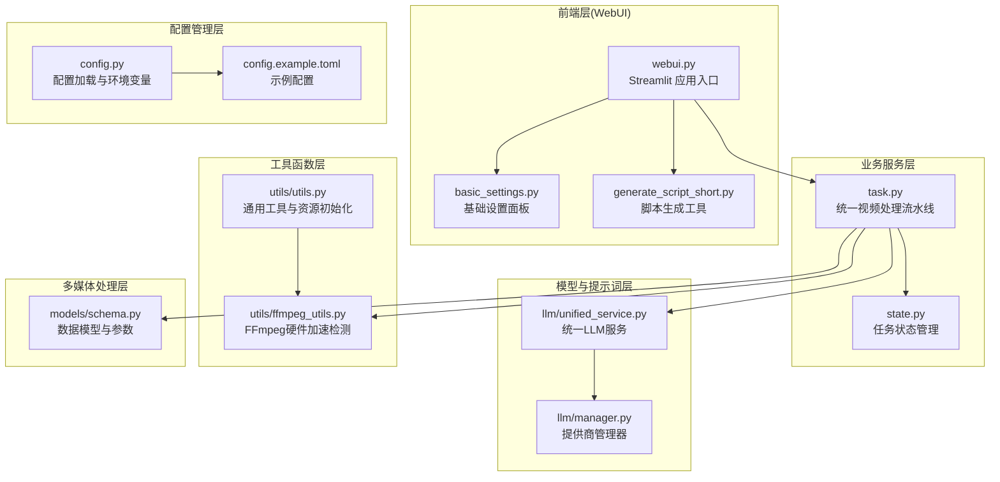
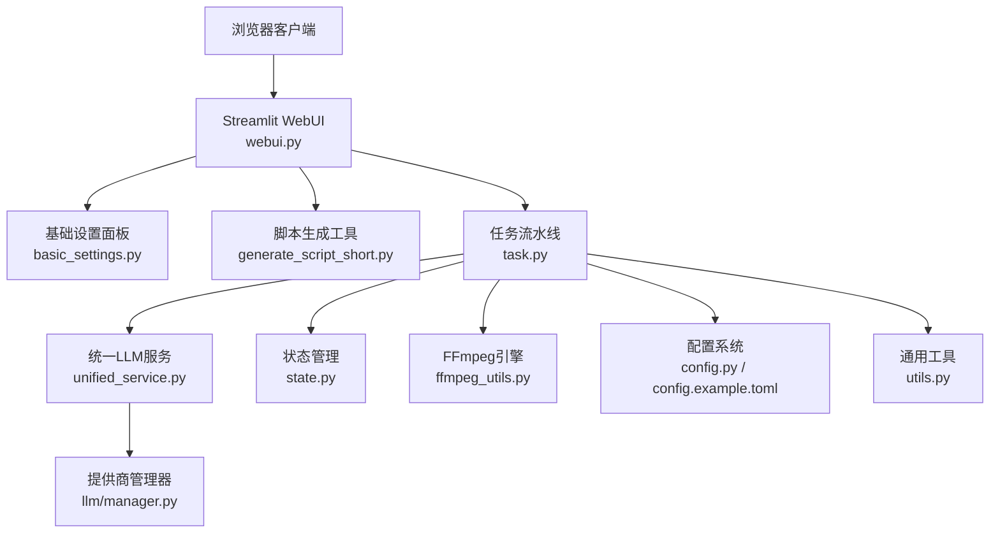
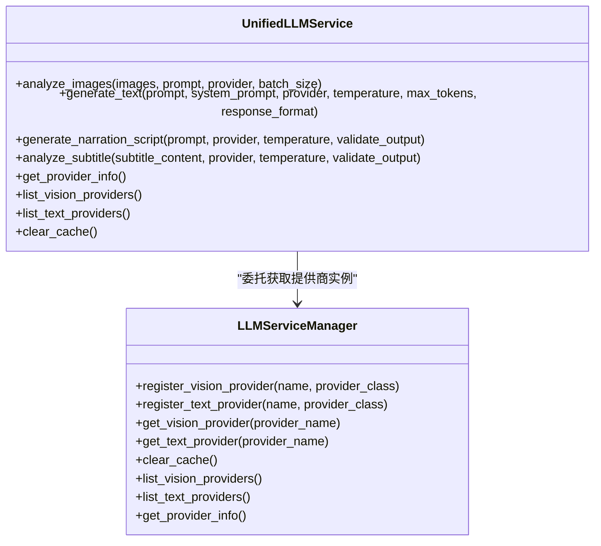
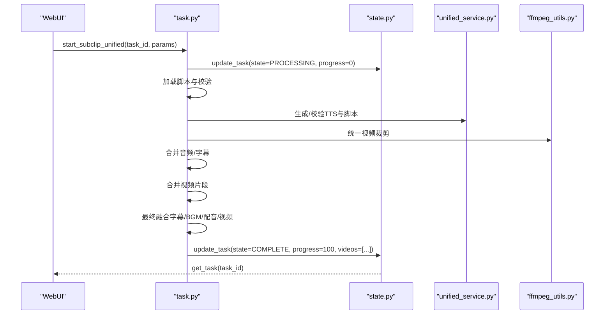
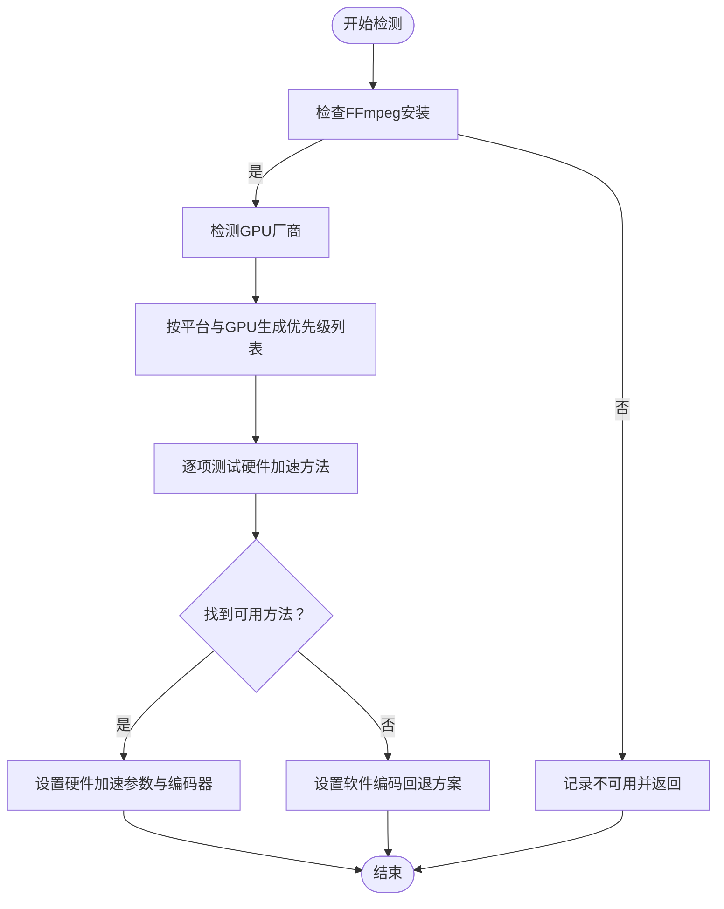
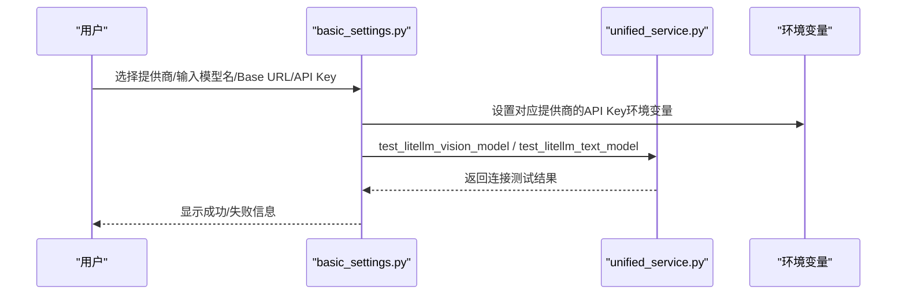
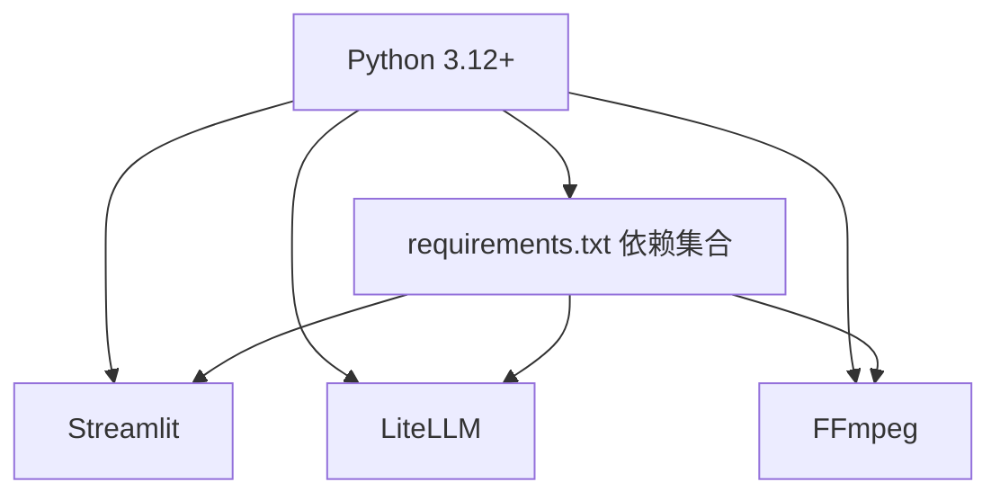

# 技术栈与架构

<cite>
**本文档引用的文件**
- [README.md](file://README.md)
- [requirements.txt](file://requirements.txt)
- [Dockerfile](file://Dockerfile)
- [webui.py](file://webui.py)
- [app/config/config.py](file://app/config/config.py)
- [app/services/llm/unified_service.py](file://app/services/llm/unified_service.py)
- [app/utils/ffmpeg_utils.py](file://app/utils/ffmpeg_utils.py)
- [app/models/schema.py](file://app/models/schema.py)
- [webui/components/basic_settings.py](file://webui/components/basic_settings.py)
- [config.example.toml](file://config.example.toml)
- [app/services/task.py](file://app/services/task.py)
- [app/services/state.py](file://app/services/state.py)
- [app/services/llm/manager.py](file://app/services/llm/manager.py)
- [app/utils/utils.py](file://app/utils/utils.py)
- [webui/tools/generate_script_short.py](file://webui/tools/generate_script_short.py)
</cite>

## 目录
1. [简介](#简介)
2. [项目结构](#项目结构)
3. [核心组件](#核心组件)
4. [架构总览](#架构总览)
5. [详细组件分析](#详细组件分析)
6. [依赖关系分析](#依赖关系分析)
7. [性能考量](#性能考量)
8. [故障排查指南](#故障排查指南)
9. [结论](#结论)
10. [附录](#附录)

## 简介
NarratoAI 是一个面向影视解说与自动化剪辑的 AI 工具，提供从文案生成、视频素材裁剪、配音合成到字幕与背景音乐融合的全流程能力。项目采用 Python 3.12+ 作为核心开发语言，前端使用 Streamlit 构建交互式 Web 界面，统一通过 LiteLLM 管理多模型供应商，多媒体处理由 FFmpeg 引擎驱动，并辅以丰富的 TTS 引擎与字幕处理工具。

## 项目结构
项目采用分层与插件化相结合的组织方式：
- WebUI 层：基于 Streamlit 的前端界面，负责用户交互与参数收集
- 业务服务层：围绕视频生成任务的流水线编排与状态管理
- 配置管理层：集中管理应用配置、模型供应商与外部服务参数
- 工具函数层：封装通用工具（FFmpeg、资源初始化、时间格式转换等）
- 模型与提示词层：统一的 LLM 服务抽象与提示词模板注册
- 多媒体处理层：视频裁剪、音频合并、字幕处理、字幕与视频融合等

**图表来源**
- [webui.py:1-294](file://webui.py#L1-L294)
- [app/services/task.py:1-272](file://app/services/task.py#L1-L272)
- [app/services/state.py:1-123](file://app/services/state.py#L1-L123)
- [app/services/llm/manager.py:1-246](file://app/services/llm/manager.py#L1-L246)
- [app/services/llm/unified_service.py:1-263](file://app/services/llm/unified_service.py#L1-L263)
- [app/utils/ffmpeg_utils.py:1-800](file://app/utils/ffmpeg_utils.py#L1-L800)
- [app/utils/utils.py:1-675](file://app/utils/utils.py#L1-L675)
- [app/models/schema.py:1-209](file://app/models/schema.py#L1-L209)
- [app/config/config.py:1-95](file://app/config/config.py#L1-L95)
- [config.example.toml:1-177](file://config.example.toml#L1-L177)

**章节来源**
- [README.md:105-141](file://README.md#L105-L141)
- [webui.py:227-294](file://webui.py#L227-L294)
- [app/services/task.py:195-247](file://app/services/task.py#L195-L247)

## 核心组件
- Streamlit 前端：提供基础设置、视频/音频/字幕参数配置与生成按钮，支持国际化与日志过滤
- LiteLLM 统一接口：抽象多模型供应商，支持 100+ 提供商，内置重试与成本统计
- FFmpeg 引擎：跨平台多媒体处理，具备硬件加速检测与降级策略
- 任务流水线：统一的视频生成流程，覆盖脚本加载、TTS 生成、视频裁剪、音频/字幕合并、最终融合
- 配置系统：集中管理模型 API Key、Base URL、TTS 引擎、代理与视频处理参数
- 状态管理：支持内存与 Redis 两种状态存储，便于分布式扩展

**章节来源**
- [requirements.txt:1-39](file://requirements.txt#L1-L39)
- [app/services/llm/unified_service.py:20-263](file://app/services/llm/unified_service.py#L20-L263)
- [app/utils/ffmpeg_utils.py:252-355](file://app/utils/ffmpeg_utils.py#L252-L355)
- [app/services/task.py:195-247](file://app/services/task.py#L195-L247)
- [app/config/config.py:24-95](file://app/config/config.py#L24-L95)
- [app/services/state.py:18-122](file://app/services/state.py#L18-L122)

## 架构总览
项目采用“前端 Web 界面 + 业务流水线 + 统一模型接口 + 多媒体引擎”的分层架构，结合插件化设计（LLM 提供商注册、FFmpeg 硬件加速检测）实现高扩展性与易用性。

**图表来源**
- [webui.py:15-294](file://webui.py#L15-L294)
- [webui/components/basic_settings.py:142-727](file://webui/components/basic_settings.py#L142-L727)
- [webui/tools/generate_script_short.py:13-128](file://webui/tools/generate_script_short.py#L13-L128)
- [app/services/task.py:195-247](file://app/services/task.py#L195-L247)
- [app/services/llm/unified_service.py:20-263](file://app/services/llm/unified_service.py#L20-L263)
- [app/services/llm/manager.py:15-246](file://app/services/llm/manager.py#L15-L246)
- [app/services/state.py:18-122](file://app/services/state.py#L18-L122)
- [app/utils/ffmpeg_utils.py:252-355](file://app/utils/ffmpeg_utils.py#L252-L355)
- [app/config/config.py:24-95](file://app/config/config.py#L24-L95)
- [app/utils/utils.py:602-675](file://app/utils/utils.py#L602-L675)

## 详细组件分析

### 组件A：统一LLM服务与提供商管理
- 统一LLM服务提供图片分析、文本生成、解说文案生成、字幕分析等接口，内部委托给提供商管理器获取具体提供商实例
- 提供商管理器支持显式注册与缓存，避免重复实例化，提供错误处理与配置校验
- WebUI 在启动时显式注册提供商，确保 LLM 功能可用

**图表来源**
- [app/services/llm/unified_service.py:20-263](file://app/services/llm/unified_service.py#L20-L263)
- [app/services/llm/manager.py:15-246](file://app/services/llm/manager.py#L15-L246)

**章节来源**
- [app/services/llm/unified_service.py:20-263](file://app/services/llm/unified_service.py#L20-L263)
- [app/services/llm/manager.py:68-208](file://app/services/llm/manager.py#L68-L208)
- [webui.py:232-246](file://webui.py#L232-L246)

### 组件B：任务流水线与状态管理
- 任务流水线负责加载脚本、生成/合并音频与字幕、统一视频裁剪、视频片段合并与最终融合
- 状态管理支持内存与 Redis 两种实现，便于在容器化与分布式环境下扩展

**图表来源**
- [app/services/task.py:195-247](file://app/services/task.py#L195-L247)
- [app/services/state.py:23-41](file://app/services/state.py#L23-L41)
- [app/services/llm/unified_service.py:111-159](file://app/services/llm/unified_service.py#L111-L159)
- [app/utils/ffmpeg_utils.py:252-355](file://app/utils/ffmpeg_utils.py#L252-L355)

**章节来源**
- [app/services/task.py:195-247](file://app/services/task.py#L195-L247)
- [app/services/state.py:18-122](file://app/services/state.py#L18-L122)

### 组件C：FFmpeg硬件加速检测与降级
- 跨平台检测 GPU 厂商与可用硬件加速方法，按平台优先级测试可用性
- 若无硬件加速，自动回退到软件编码，确保兼容性
- 提供硬件加速参数与设备路径查询接口

**图表来源**
- [app/utils/ffmpeg_utils.py:118-136](file://app/utils/ffmpeg_utils.py#L118-L136)
- [app/utils/ffmpeg_utils.py:138-180](file://app/utils/ffmpeg_utils.py#L138-L180)
- [app/utils/ffmpeg_utils.py:252-355](file://app/utils/ffmpeg_utils.py#L252-L355)

**章节来源**
- [app/utils/ffmpeg_utils.py:252-355](file://app/utils/ffmpeg_utils.py#L252-L355)

### 组件D：WebUI 基础设置与模型连接测试
- 提供 LLM 提供商选择、模型名称与 Base URL 输入、API Key 校验与连接测试
- 支持 LiteLLM 格式模型名（provider/model），并针对不同提供商设置相应环境变量
- 集成代理设置与国际化

**图表来源**
- [webui/components/basic_settings.py:559-727](file://webui/components/basic_settings.py#L559-L727)
- [webui/components/basic_settings.py:333-453](file://webui/components/basic_settings.py#L333-L453)
- [app/services/llm/unified_service.py:209-237](file://app/services/llm/unified_service.py#L209-L237)

**章节来源**
- [webui/components/basic_settings.py:559-727](file://webui/components/basic_settings.py#L559-L727)
- [webui/components/basic_settings.py:333-453](file://webui/components/basic_settings.py#L333-L453)

## 依赖关系分析
- Python 3.12+：满足现代标准库与第三方库兼容性需求
- Streamlit：提供快速 Web 界面原型与交互能力
- LiteLLM：统一多模型供应商接口，简化集成与维护
- FFmpeg：多媒体处理核心，配合硬件加速提升性能
- 其他依赖：requests、moviepy、edge-tts、loguru、tomli、pydub、pysrt、Pillow、tqdm、tenacity 等

**图表来源**
- [requirements.txt:1-39](file://requirements.txt#L1-L39)
- [Dockerfile:2-27](file://Dockerfile#L2-L27)

**章节来源**
- [requirements.txt:1-39](file://requirements.txt#L1-L39)
- [Dockerfile:2-27](file://Dockerfile#L2-L27)

## 性能考量
- 硬件加速：通过 FFmpeg 硬件加速检测与回退策略，最大化视频处理吞吐量
- 并发与线程：流水线中多处使用线程池与并发处理，提升整体效率
- 缓存与重试：LLM 与 TTS 结果缓存、重试机制与超时控制，提升稳定性
- 资源初始化：延迟加载依赖 PyTorch 的资源，缩短启动时间

[本节为通用指导，无需引用具体文件]

## 故障排查指南
- LLM 连接失败：检查提供商 API Key、Base URL 与模型名称格式；确认已显式注册提供商
- FFmpeg 未安装或不可用：确保系统已安装 FFmpeg，并检查 PATH；查看硬件加速检测日志
- 任务状态异常：检查状态存储配置（内存/Redis），确认任务 ID 与进度更新
- 音频/字幕合并失败：确认 TTS 结果与脚本时间戳对齐，检查媒体时长探测

**章节来源**
- [webui/components/basic_settings.py:333-453](file://webui/components/basic_settings.py#L333-L453)
- [app/utils/ffmpeg_utils.py:252-355](file://app/utils/ffmpeg_utils.py#L252-L355)
- [app/services/state.py:55-87](file://app/services/state.py#L55-L87)
- [app/services/task.py:120-133](file://app/services/task.py#L120-L133)

## 结论
NarratoAI 通过 Streamlit 快速构建前端、LiteLLM 统一模型接口与 FFmpeg 多媒体引擎，形成高扩展、易维护的分层架构。项目在性能、可扩展性与易用性之间取得良好平衡，适合个人创作者与中小团队高效开展影视解说与自动化剪辑工作。

[本节为总结性内容，无需引用具体文件]

## 附录
- 版本与兼容性：Python 3.12+、Streamlit 1.45+、LiteLLM 1.70+、FFmpeg（随系统安装）
- 部署方式：Docker 多阶段构建，包含 FFmpeg、ImageMagick 与运行时依赖
- 配置示例：config.example.toml 提供 LLM、TTS、代理与视频处理参数参考

**章节来源**
- [README.md:145-148](file://README.md#L145-L148)
- [Dockerfile:1-89](file://Dockerfile#L1-L89)
- [config.example.toml:1-177](file://config.example.toml#L1-L177)