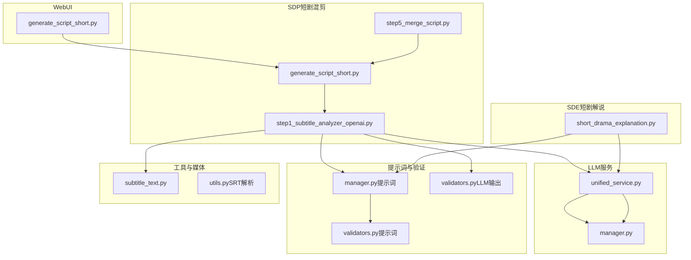
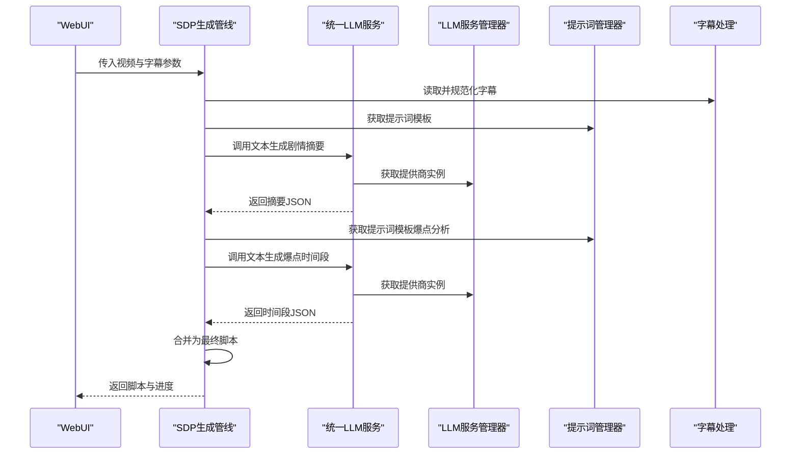
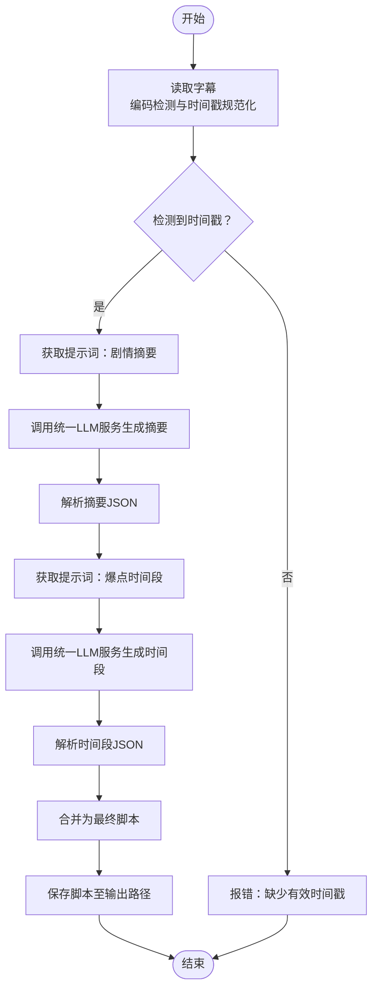
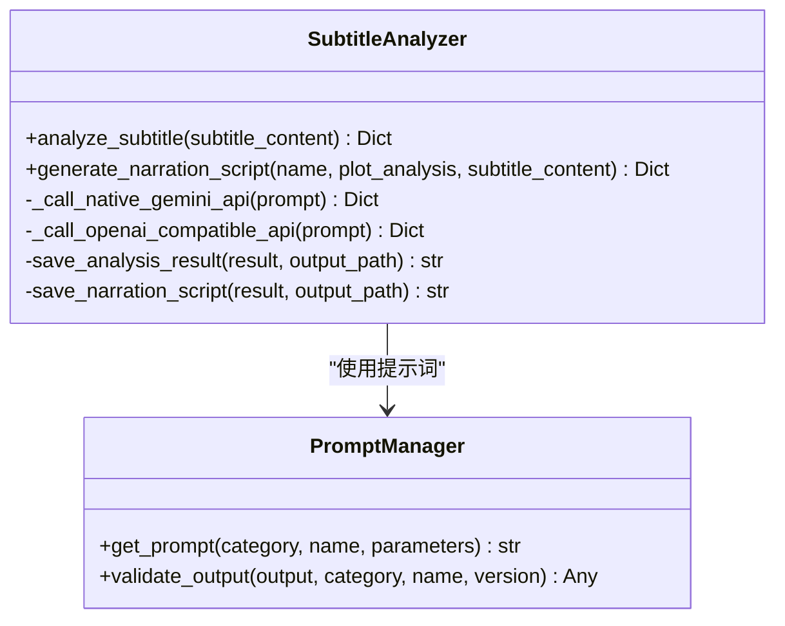
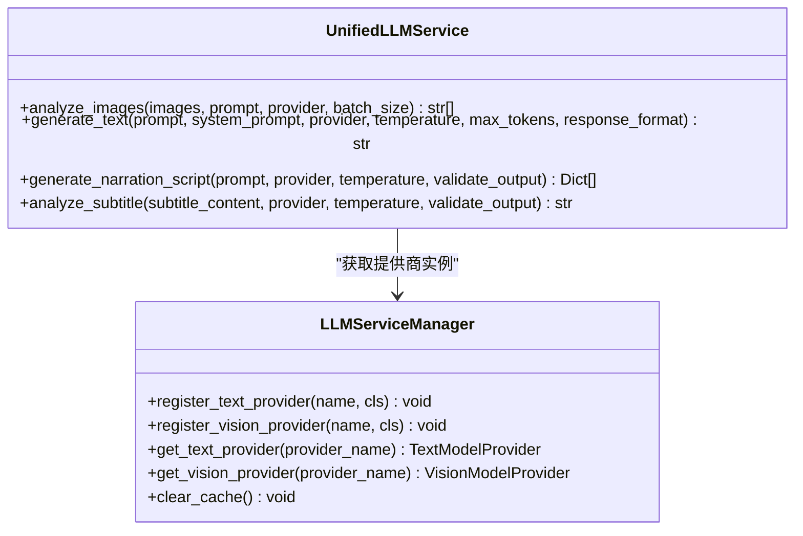
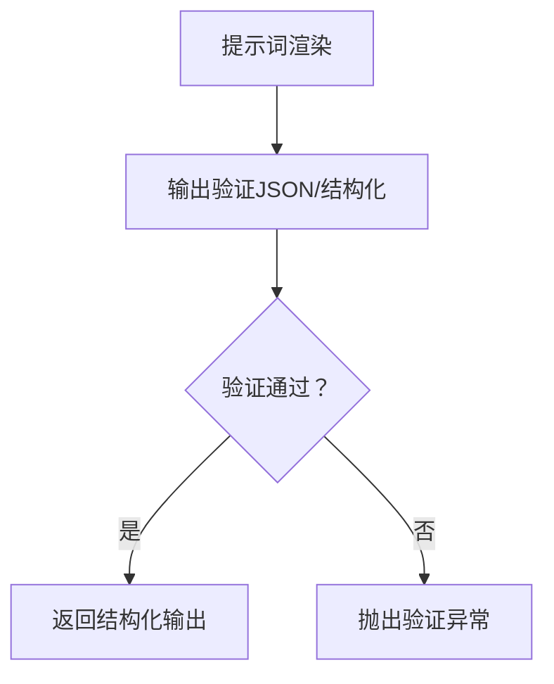
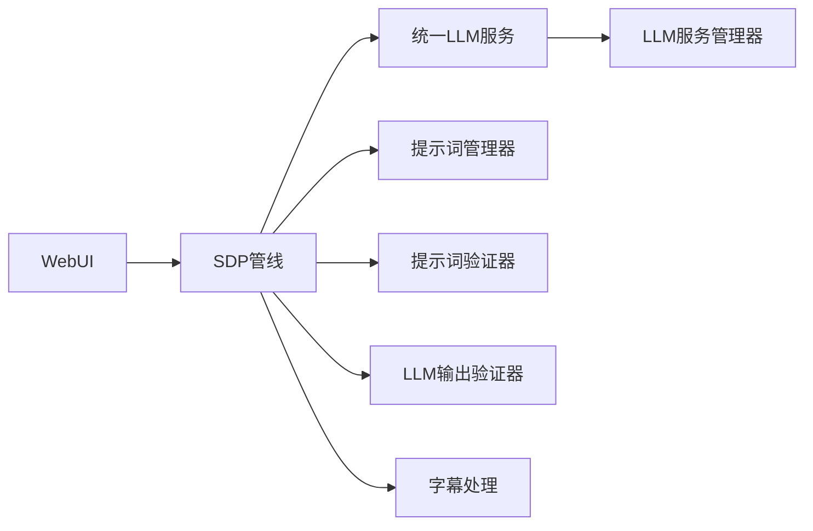

# AI影视解说系统

<cite>
**本文档引用的文件**
- [README.md](file://README.md)
- [generate_script_short.py](file://app/services/SDP/generate_script_short.py)
- [short_drama_explanation.py](file://app/services/SDE/short_drama_explanation.py)
- [unified_service.py](file://app/services/llm/unified_service.py)
- [manager.py](file://app/services/prompts/manager.py)
- [script_generation.py](file://app/services/prompts/short_drama_narration/script_generation.py)
- [plot_analysis.py](file://app/services/prompts/short_drama_narration/plot_analysis.py)
- [step1_subtitle_analyzer_openai.py](file://app/services/SDP/utils/step1_subtitle_analyzer_openai.py)
- [step5_merge_script.py](file://app/services/SDP/utils/step5_merge_script.py)
- [manager.py](file://app/services/llm/manager.py)
- [validators.py](file://app/services/prompts/validators.py)
- [validators.py](file://app/services/llm/validators.py)
- [utils.py](file://app/services/SDP/utils/utils.py)
- [generate_script_short.py](file://webui/tools/generate_script_short.py)
- [subtitle_text.py](file://app/services/subtitle_text.py)
</cite>

## 目录
1. [简介](#简介)
2. [项目结构](#项目结构)
3. [核心组件](#核心组件)
4. [架构总览](#架构总览)
5. [详细组件分析](#详细组件分析)
6. [依赖分析](#依赖分析)
7. [性能考量](#性能考量)
8. [故障排查指南](#故障排查指南)
9. [结论](#结论)
10. [附录](#附录)

## 简介
本系统是一套面向短视频与短剧的“AI影视解说”自动化流水线，围绕“基于视觉分析的场景证据提取 → 事实抽取 → 文案润色”的三阶段工作流展开，最终输出可直接用于剪辑与配音的脚本数据。系统同时提供统一的提示词管理与输出验证体系，兼容多种文本与视觉模型提供商，并通过WebUI提供可视化操作入口。

## 项目结构
系统采用模块化分层组织：
- WebUI层：提供交互界面与参数收集
- 业务服务层：包含SDP（短剧混剪）与SDE（短剧解说）两条主线
- LLM服务层：统一文本/视觉模型提供商管理与调用
- 提示词与验证层：集中管理提示词模板、版本与输出验证
- 工具与媒体处理层：字幕解析、时间戳规范化、脚本合并等

图表来源
- [generate_script_short.py:12-126](file://app/services/SDP/generate_script_short.py#L12-L126)
- [step1_subtitle_analyzer_openai.py:17-173](file://app/services/SDP/utils/step1_subtitle_analyzer_openai.py#L17-L173)
- [step5_merge_script.py:9-49](file://app/services/SDP/utils/step5_merge_script.py#L9-L49)
- [short_drama_explanation.py:23-778](file://app/services/SDE/short_drama_explanation.py#L23-L778)
- [unified_service.py:20-263](file://app/services/llm/unified_service.py#L20-L263)
- [manager.py:15-246](file://app/services/llm/manager.py#L15-L246)
- [manager.py:26-288](file://app/services/prompts/manager.py#L26-L288)
- [validators.py:21-251](file://app/services/prompts/validators.py#L21-L251)
- [validators.py:15-201](file://app/services/llm/validators.py#L15-L201)
- [subtitle_text.py:27-125](file://app/services/subtitle_text.py#L27-L125)
- [utils.py:9-124](file://app/services/SDP/utils/utils.py#L9-L124)
- [generate_script_short.py:13-128](file://webui/tools/generate_script_short.py#L13-L128)

章节来源
- [README.md:1-180](file://README.md#L1-L180)
- [generate_script_short.py:12-126](file://app/services/SDP/generate_script_short.py#L12-L126)
- [step1_subtitle_analyzer_openai.py:17-173](file://app/services/SDP/utils/step1_subtitle_analyzer_openai.py#L17-L173)
- [step5_merge_script.py:9-49](file://app/services/SDP/utils/step5_merge_script.py#L9-L49)
- [short_drama_explanation.py:23-778](file://app/services/SDE/short_drama_explanation.py#L23-L778)
- [unified_service.py:20-263](file://app/services/llm/unified_service.py#L20-L263)
- [manager.py:15-246](file://app/services/llm/manager.py#L15-L246)
- [manager.py:26-288](file://app/services/prompts/manager.py#L26-L288)
- [validators.py:21-251](file://app/services/prompts/validators.py#L21-L251)
- [validators.py:15-201](file://app/services/llm/validators.py#L15-L201)
- [subtitle_text.py:27-125](file://app/services/subtitle_text.py#L27-L125)
- [utils.py:9-124](file://app/services/SDP/utils/utils.py#L9-L124)
- [generate_script_short.py:13-128](file://webui/tools/generate_script_short.py#L13-L128)

## 核心组件
- SDP（短剧混剪）脚本生成管线：从字幕内容出发，经统一LLM服务进行剧情摘要与爆点时间段抽取，再合并为最终脚本。
- SDE（短剧解说）剧情分析与脚本生成：支持原生Gemini与OpenAI兼容两种调用方式，通过提示词管理器注入结构化提示，输出JSON脚本。
- 统一LLM服务：屏蔽不同提供商差异，提供图片分析、文本生成、脚本生成与字幕分析等统一接口。
- 提示词管理与输出验证：集中管理提示词模板、版本与参数，对输出进行严格格式与结构验证。
- 字幕处理工具：跨平台字幕读取、编码检测与时间戳规范化，保证时间戳对齐与一致性。

章节来源
- [generate_script_short.py:12-126](file://app/services/SDP/generate_script_short.py#L12-L126)
- [step1_subtitle_analyzer_openai.py:17-173](file://app/services/SDP/utils/step1_subtitle_analyzer_openai.py#L17-L173)
- [step5_merge_script.py:9-49](file://app/services/SDP/utils/step5_merge_script.py#L9-L49)
- [short_drama_explanation.py:23-778](file://app/services/SDE/short_drama_explanation.py#L23-L778)
- [unified_service.py:20-263](file://app/services/llm/unified_service.py#L20-L263)
- [manager.py:26-288](file://app/services/prompts/manager.py#L26-L288)
- [validators.py:21-251](file://app/services/prompts/validators.py#L21-L251)
- [subtitle_text.py:27-125](file://app/services/subtitle_text.py#L27-L125)

## 架构总览
系统采用“WebUI → 业务服务 → LLM服务 → 提示词/验证 → 工具链”的分层架构，其中：
- WebUI负责参数收集与进度反馈
- 业务服务负责编排与数据流转
- LLM服务负责文本/视觉推理与统一接口
- 提示词与验证保障输出质量与稳定性
- 工具链负责字幕与脚本的解析与合并

图表来源
- [generate_script_short.py:12-126](file://app/services/SDP/generate_script_short.py#L12-L126)
- [step1_subtitle_analyzer_openai.py:17-173](file://app/services/SDP/utils/step1_subtitle_analyzer_openai.py#L17-L173)
- [step5_merge_script.py:9-49](file://app/services/SDP/utils/step5_merge_script.py#L9-L49)
- [unified_service.py:20-263](file://app/services/llm/unified_service.py#L20-L263)
- [manager.py:15-246](file://app/services/llm/manager.py#L15-L246)
- [manager.py:26-288](file://app/services/prompts/manager.py#L26-L288)
- [subtitle_text.py:27-125](file://app/services/subtitle_text.py#L27-L125)

## 详细组件分析

### SDP（短剧混剪）脚本生成管线
- 输入：视频与字幕（支持文件路径或直接内容）
- 步骤：
  1) 字幕读取与规范化（编码检测、时间戳标准化）
  2) 基于提示词的剧情摘要与爆点标题生成
  3) 基于提示词的爆点时间段抽取
  4) 合并为最终脚本（JSON格式）
- 输出：脚本列表（包含时间戳、画面描述、原声/解说标记）

图表来源
- [step1_subtitle_analyzer_openai.py:17-173](file://app/services/SDP/utils/step1_subtitle_analyzer_openai.py#L17-L173)
- [step5_merge_script.py:9-49](file://app/services/SDP/utils/step5_merge_script.py#L9-L49)
- [subtitle_text.py:27-125](file://app/services/subtitle_text.py#L27-L125)

章节来源
- [generate_script_short.py:12-126](file://app/services/SDP/generate_script_short.py#L12-L126)
- [step1_subtitle_analyzer_openai.py:17-173](file://app/services/SDP/utils/step1_subtitle_analyzer_openai.py#L17-L173)
- [step5_merge_script.py:9-49](file://app/services/SDP/utils/step5_merge_script.py#L9-L49)
- [subtitle_text.py:27-125](file://app/services/subtitle_text.py#L27-L125)

### SDE（短剧解说）剧情分析与脚本生成
- 支持原生Gemini与OpenAI兼容两种调用方式
- 通过提示词管理器注入结构化提示，生成JSON脚本
- 输出包含时间戳、画面描述、原声/解说标记等字段

图表来源
- [short_drama_explanation.py:23-778](file://app/services/SDE/short_drama_explanation.py#L23-L778)
- [manager.py:26-288](file://app/services/prompts/manager.py#L26-L288)

章节来源
- [short_drama_explanation.py:23-778](file://app/services/SDE/short_drama_explanation.py#L23-L778)
- [manager.py:26-288](file://app/services/prompts/manager.py#L26-L288)

### 统一LLM服务与提供商管理
- 统一接口：图片分析、文本生成、脚本生成、字幕分析
- 提供商注册与缓存：支持文本与视觉模型提供商注册、实例缓存与配置读取
- 回退与兼容：通过提示词与输出验证保障不同提供商的稳定性

图表来源
- [unified_service.py:20-263](file://app/services/llm/unified_service.py#L20-L263)
- [manager.py:15-246](file://app/services/llm/manager.py#L15-L246)

章节来源
- [unified_service.py:20-263](file://app/services/llm/unified_service.py#L20-L263)
- [manager.py:15-246](file://app/services/llm/manager.py#L15-L246)

### 提示词管理与输出验证
- 提示词管理：分类、版本、参数化模板、渲染与导出
- 输出验证：JSON清理、Schema校验、字段完整性与格式校验
- 针对不同任务（剧情分析、脚本生成）提供专用验证规则

图表来源
- [manager.py:26-288](file://app/services/prompts/manager.py#L26-L288)
- [validators.py:21-251](file://app/services/prompts/validators.py#L21-L251)
- [validators.py:15-201](file://app/services/llm/validators.py#L15-L201)

章节来源
- [manager.py:26-288](file://app/services/prompts/manager.py#L26-L288)
- [validators.py:21-251](file://app/services/prompts/validators.py#L21-L251)
- [validators.py:15-201](file://app/services/llm/validators.py#L15-L201)

### 场景证据到Markdown格式的转换
- 系统默认输出为JSON脚本，包含时间戳、画面描述、原声/解说标记
- 若需转换为Markdown，可在外部流程中基于JSON字段进行二次渲染（例如将items逐条转为Markdown表格或列表）

章节来源
- [step5_merge_script.py:9-49](file://app/services/SDP/utils/step5_merge_script.py#L9-L49)
- [script_generation.py:15-308](file://app/services/prompts/short_drama_narration/script_generation.py#L15-L308)

### fact提示词与polish提示词设计思路
- fact提示词（剧情摘要/爆点分析）：聚焦于从字幕中抽取结构化剧情要点与时间戳定位，确保后续脚本生成具备稳定的事实依据
- polish提示词（脚本生成）：在已有剧情与字幕基础上，生成具备“黄金开场、爽点放大、个性吐槽、悬念预埋”等短视频创作技巧的脚本，严格控制时间戳连续性与格式一致性

章节来源
- [step1_subtitle_analyzer_openai.py:90-151](file://app/services/SDP/utils/step1_subtitle_analyzer_openai.py#L90-L151)
- [script_generation.py:15-308](file://app/services/prompts/short_drama_narration/script_generation.py#L15-L308)
- [plot_analysis.py:15-91](file://app/services/prompts/short_drama_narration/plot_analysis.py#L15-L91)

### 新旧LLM服务架构的兼容性与回退机制
- 统一LLM服务提供向后兼容接口，内部通过提供商管理器选择具体实现
- 输出验证器对不同提供商返回内容进行统一清理与校验，避免格式差异影响下游
- WebUI层通过配置读取与参数传递，兼容不同提供商与模型

章节来源
- [unified_service.py:20-263](file://app/services/llm/unified_service.py#L20-L263)
- [manager.py:15-246](file://app/services/llm/manager.py#L15-L246)
- [validators.py:15-201](file://app/services/llm/validators.py#L15-L201)
- [generate_script_short.py:13-128](file://webui/tools/generate_script_short.py#L13-L128)

### 场景证据的数据结构与处理流程
- 数据结构：包含_id、timestamp、picture、narration、OST等字段
- 处理流程：时间戳对齐（毫秒级）、画面描述与字幕证据整合、原声片段选择策略（情感爆发、关键对白、爽点瞬间、悬念节点、经典台词）
- 合并脚本：将结构化时间段合并为最终脚本并保存

章节来源
- [script_generation.py:15-308](file://app/services/prompts/short_drama_narration/script_generation.py#L15-L308)
- [step5_merge_script.py:9-49](file://app/services/SDP/utils/step5_merge_script.py#L9-L49)

### 使用示例与配置参数
- WebUI操作流程：选择视频与字幕 → 读取字幕 → 调用SDP管线 → 生成脚本 → 保存
- 关键参数：文本提供商、API密钥、模型名称、基础URL、自定义片段数量、字幕来源（文件或内容）
- 输出：脚本JSON（可直接用于剪辑与配音）

章节来源
- [generate_script_short.py:13-128](file://webui/tools/generate_script_short.py#L13-L128)
- [generate_script_short.py:12-126](file://app/services/SDP/generate_script_short.py#L12-L126)
- [step1_subtitle_analyzer_openai.py:17-173](file://app/services/SDP/utils/step1_subtitle_analyzer_openai.py#L17-L173)

## 依赖分析
- WebUI → SDP → LLM服务 → 提示词/验证 → 工具链
- SDP内部：字幕处理依赖字幕工具与时间戳规范化
- LLM服务：提供商注册与缓存，统一接口屏蔽差异
- 提示词与验证：模板渲染与输出校验，保障结构化输出

图表来源
- [generate_script_short.py:13-128](file://webui/tools/generate_script_short.py#L13-L128)
- [generate_script_short.py:12-126](file://app/services/SDP/generate_script_short.py#L12-L126)
- [unified_service.py:20-263](file://app/services/llm/unified_service.py#L20-L263)
- [manager.py:15-246](file://app/services/llm/manager.py#L15-L246)
- [manager.py:26-288](file://app/services/prompts/manager.py#L26-L288)
- [validators.py:21-251](file://app/services/prompts/validators.py#L21-L251)
- [validators.py:15-201](file://app/services/llm/validators.py#L15-L201)
- [subtitle_text.py:27-125](file://app/services/subtitle_text.py#L27-L125)

章节来源
- [generate_script_short.py:13-128](file://webui/tools/generate_script_short.py#L13-L128)
- [generate_script_short.py:12-126](file://app/services/SDP/generate_script_short.py#L12-L126)
- [unified_service.py:20-263](file://app/services/llm/unified_service.py#L20-L263)
- [manager.py:15-246](file://app/services/llm/manager.py#L15-L246)
- [manager.py:26-288](file://app/services/prompts/manager.py#L26-L288)
- [validators.py:21-251](file://app/services/prompts/validators.py#L21-L251)
- [validators.py:15-201](file://app/services/llm/validators.py#L15-L201)
- [subtitle_text.py:27-125](file://app/services/subtitle_text.py#L27-L125)

## 性能考量
- 并发与批处理：统一LLM服务支持批量图片分析与异步执行，减少等待时间
- 温度与令牌：通过较低温度与最大令牌限制，平衡稳定性与成本
- 缓存与注册：提供商实例缓存减少重复初始化开销
- 字幕处理：跨平台编码检测与时间戳规范化，避免重复解析与格式错误

## 故障排查指南
- 字幕读取失败：检查文件编码与时间戳格式，确认包含标准时间轴
- 提示词渲染失败：检查提示词分类、名称与版本是否存在
- 输出验证失败：查看验证器异常信息，确认JSON结构与字段完整性
- LLM调用失败：检查提供商配置、API密钥与基础URL，确认网络连通性

章节来源
- [subtitle_text.py:27-125](file://app/services/subtitle_text.py#L27-L125)
- [manager.py:26-288](file://app/services/prompts/manager.py#L26-L288)
- [validators.py:21-251](file://app/services/prompts/validators.py#L21-L251)
- [validators.py:15-201](file://app/services/llm/validators.py#L15-L201)
- [manager.py:15-246](file://app/services/llm/manager.py#L15-L246)

## 结论
本系统通过统一的提示词与输出验证体系，实现了从字幕到脚本的稳定转化；通过统一LLM服务与提供商管理，兼顾了不同模型与平台的兼容性；通过严格的结构化输出与时间戳对齐，为后续剪辑与配音提供了高质量的素材基础。未来可进一步扩展更多TTS引擎、完善场景证据的多模态融合与自动匹配能力。

## 附录
- 快速启动与部署：参考项目根目录README中的部署说明
- 配置参数：文本/视觉提供商、API密钥、模型名称、基础URL等

章节来源
- [README.md:105-141](file://README.md#L105-L141)