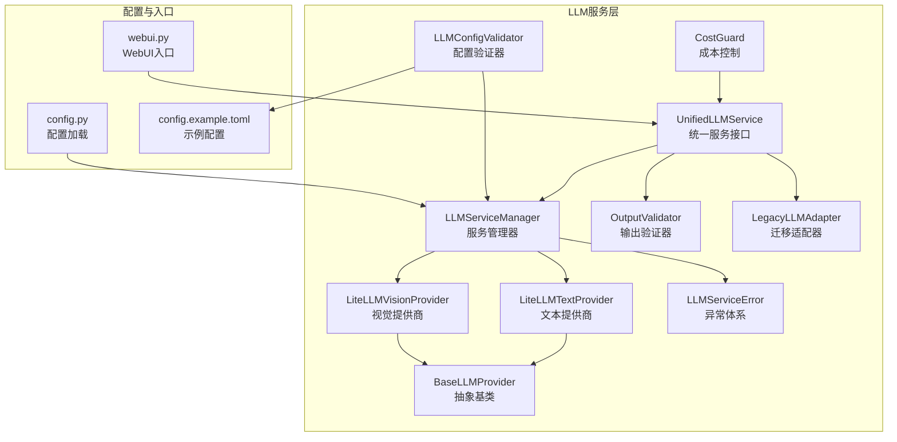
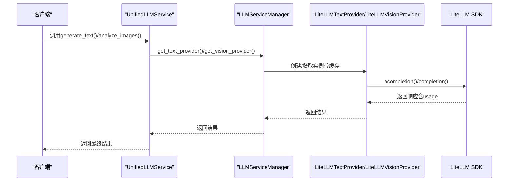
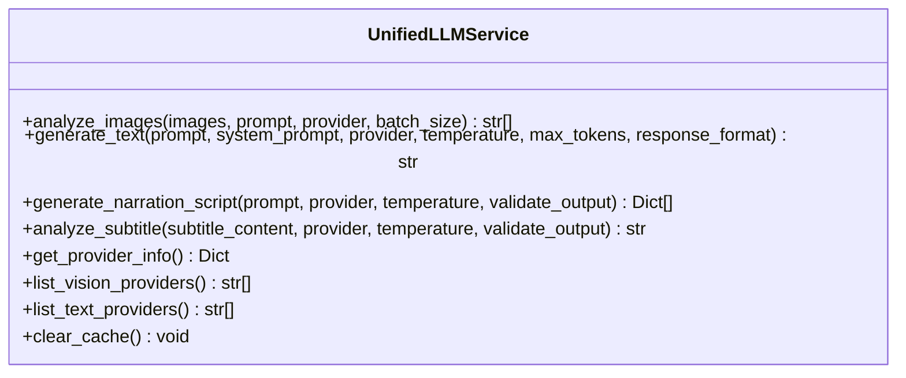
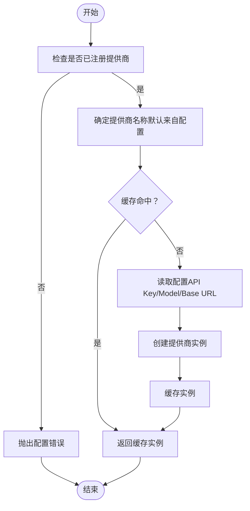
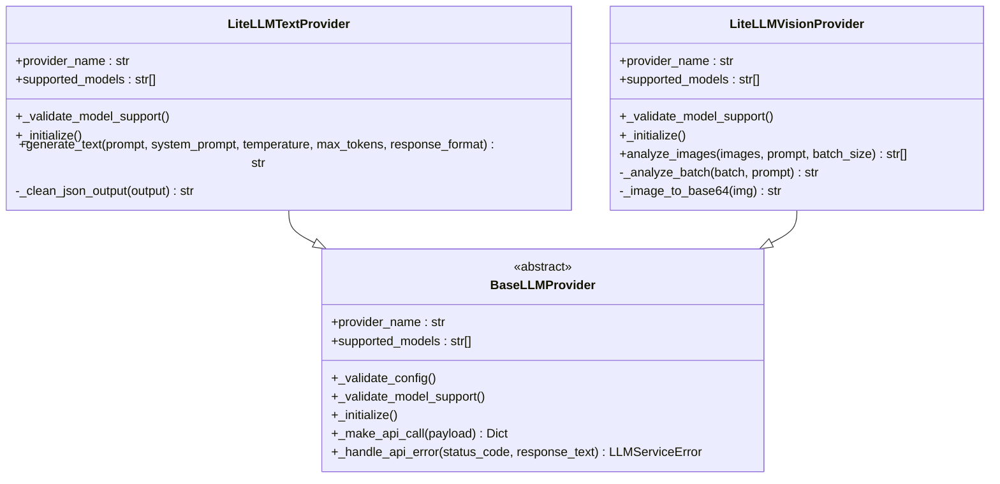
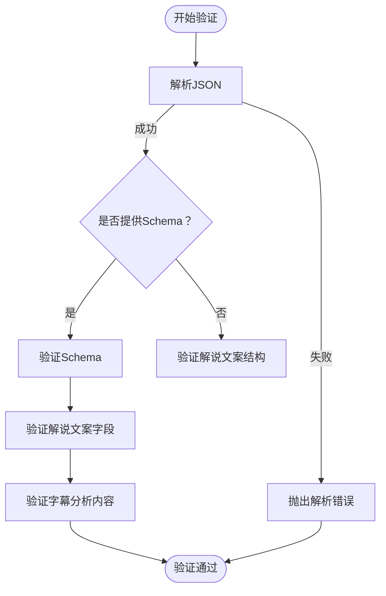
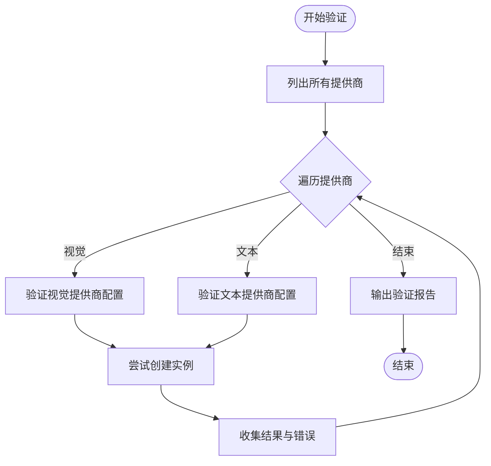
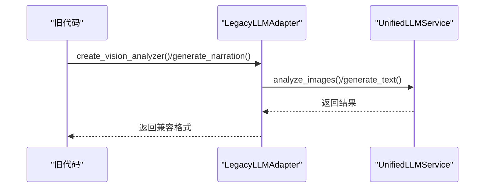
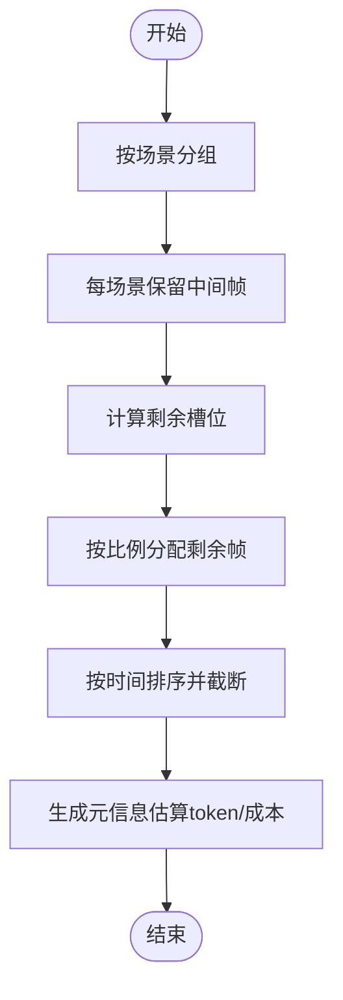
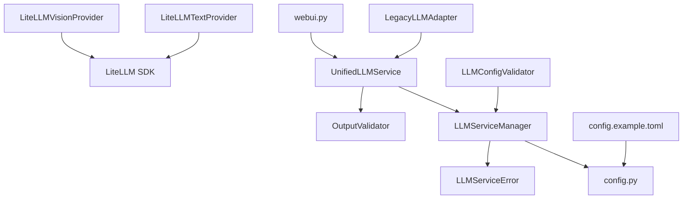

# LLM提供商管理系统

<cite>
**本文档引用的文件**
- [unified_service.py](file://app/services/llm/unified_service.py)
- [manager.py](file://app/services/llm/manager.py)
- [litellm_provider.py](file://app/services/llm/litellm_provider.py)
- [base.py](file://app/services/llm/base.py)
- [migration_adapter.py](file://app/services/llm/migration_adapter.py)
- [validators.py](file://app/services/llm/validators.py)
- [config_validator.py](file://app/services/llm/config_validator.py)
- [exceptions.py](file://app/services/llm/exceptions.py)
- [test_litellm_integration.py](file://app/services/llm/test_litellm_integration.py)
- [test_llm_service.py](file://app/services/llm/test_llm_service.py)
- [cost_guard.py](file://app/services/cost_guard.py)
- [config.py](file://app/config/config.py)
- [config.example.toml](file://config.example.toml)
- [webui.py](file://webui.py)
</cite>

## 目录
1. [简介](#简介)
2. [项目结构](#项目结构)
3. [核心组件](#核心组件)
4. [架构总览](#架构总览)
5. [详细组件分析](#详细组件分析)
6. [依赖关系分析](#依赖关系分析)
7. [性能考虑](#性能考虑)
8. [故障排除指南](#故障排除指南)
9. [结论](#结论)
10. [附录](#附录)

## 简介
本项目为NarratoAI的LLM提供商管理系统，围绕统一的大模型接口设计，采用LiteLLM作为统一适配层，支持OpenAI、Gemini、Qwen、DeepSeek、SiliconFlow等100+提供商。系统提供统一的文本生成、视觉分析、输出验证、配置验证、迁移适配与成本控制能力，帮助用户在多提供商环境下实现稳定、可扩展且易于维护的AI服务能力。

## 项目结构
LLM相关模块集中在`app/services/llm`目录，核心文件包括：
- 统一服务接口：`unified_service.py`
- 服务管理器：`manager.py`
- LiteLLM提供商实现：`litellm_provider.py`
- 抽象基类：`base.py`
- 迁移适配器：`migration_adapter.py`
- 输出验证器：`validators.py`
- 配置验证器：`config_validator.py`
- 异常定义：`exceptions.py`
- 测试脚本：`test_litellm_integration.py`、`test_llm_service.py`
- 成本控制：`cost_guard.py`
- 配置加载：`config.py`
- 示例配置：`config.example.toml`
- WebUI入口：`webui.py`

**图表来源**
- [unified_service.py:20-263](file://app/services/llm/unified_service.py#L20-L263)
- [manager.py:15-246](file://app/services/llm/manager.py#L15-L246)
- [litellm_provider.py:59-491](file://app/services/llm/litellm_provider.py#L59-L491)
- [base.py:16-190](file://app/services/llm/base.py#L16-L190)
- [validators.py:15-201](file://app/services/llm/validators.py#L15-L201)
- [config_validator.py:15-309](file://app/services/llm/config_validator.py#L15-L309)
- [migration_adapter.py:62-342](file://app/services/llm/migration_adapter.py#L62-L342)
- [cost_guard.py:13-98](file://app/services/cost_guard.py#L13-L98)
- [config.py:24-95](file://app/config/config.py#L24-L95)
- [config.example.toml:1-177](file://config.example.toml#L1-L177)
- [webui.py:1-200](file://webui.py#L1-L200)

**章节来源**
- [unified_service.py:1-263](file://app/services/llm/unified_service.py#L1-L263)
- [manager.py:1-246](file://app/services/llm/manager.py#L1-L246)
- [litellm_provider.py:1-491](file://app/services/llm/litellm_provider.py#L1-L491)
- [base.py:1-190](file://app/services/llm/base.py#L1-L190)
- [validators.py:1-201](file://app/services/llm/validators.py#L1-L201)
- [config_validator.py:1-309](file://app/services/llm/config_validator.py#L1-L309)
- [migration_adapter.py:1-342](file://app/services/llm/migration_adapter.py#L1-L342)
- [cost_guard.py:1-98](file://app/services/cost_guard.py#L1-L98)
- [config.py:1-95](file://app/config/config.py#L1-L95)
- [config.example.toml:1-177](file://config.example.toml#L1-L177)
- [webui.py:1-200](file://webui.py#L1-L200)

## 核心组件
- 统一服务接口：对外暴露简化的API，屏蔽底层提供商差异，支持文本生成、视觉分析、输出验证、提供商查询等功能。
- 服务管理器：负责提供商注册、实例缓存、配置读取与校验，提供工厂方法获取具体提供商实例。
- LiteLLM提供商：基于LiteLLM库实现统一的文本与视觉模型调用，自动处理重试、错误映射与部分提供商特殊逻辑。
- 抽象基类：定义统一的提供商接口与通用行为，便于扩展其他提供商实现。
- 输出验证器：严格验证JSON结构与字段，保证下游处理的稳定性。
- 配置验证器：扫描并验证所有提供商配置，输出详细报告与建议。
- 迁移适配器：为历史接口提供向后兼容，平滑过渡到新架构。
- 成本控制：估算视觉分析的token与成本，提供帧采样上限策略，避免过度消费。

**章节来源**
- [unified_service.py:20-263](file://app/services/llm/unified_service.py#L20-L263)
- [manager.py:15-246](file://app/services/llm/manager.py#L15-L246)
- [litellm_provider.py:59-491](file://app/services/llm/litellm_provider.py#L59-L491)
- [base.py:16-190](file://app/services/llm/base.py#L16-L190)
- [validators.py:15-201](file://app/services/llm/validators.py#L15-L201)
- [config_validator.py:15-309](file://app/services/llm/config_validator.py#L15-L309)
- [migration_adapter.py:62-342](file://app/services/llm/migration_adapter.py#L62-L342)
- [cost_guard.py:13-98](file://app/services/cost_guard.py#L13-L98)

## 架构总览
系统采用“统一服务接口 + 服务管理器 + LiteLLM适配层”的三层架构：
- 统一服务接口面向业务调用，隐藏提供商细节。
- 服务管理器集中管理提供商注册与实例缓存，负责配置读取与校验。
- LiteLLM适配层封装第三方API调用，统一错误处理与参数格式。
- 输出验证器与配置验证器分别在“结果质量”和“配置正确性”两个维度保障系统稳定性。
- 迁移适配器确保历史代码平滑过渡。
- 成本控制模块在视觉分析阶段进行token与成本估算，防止超支。

**图表来源**
- [unified_service.py:65-109](file://app/services/llm/unified_service.py#L65-L109)
- [manager.py:137-208](file://app/services/llm/manager.py#L137-L208)
- [litellm_provider.py:349-472](file://app/services/llm/litellm_provider.py#L349-L472)

**章节来源**
- [unified_service.py:20-263](file://app/services/llm/unified_service.py#L20-L263)
- [manager.py:15-246](file://app/services/llm/manager.py#L15-L246)
- [litellm_provider.py:59-491](file://app/services/llm/litellm_provider.py#L59-L491)

## 详细组件分析

### 统一服务接口（UnifiedLLMService）
- 功能：提供文本生成、视觉分析、解说文案生成、字幕分析、提供商查询与缓存清理等能力。
- 设计要点：对异常进行捕获与统一包装；对输出进行可选验证；支持默认提供商与显式提供商选择。
- 适用场景：业务层无需关心具体提供商，直接通过统一接口调用。

**图表来源**
- [unified_service.py:20-263](file://app/services/llm/unified_service.py#L20-L263)

**章节来源**
- [unified_service.py:20-263](file://app/services/llm/unified_service.py#L20-L263)

### 服务管理器（LLMServiceManager）
- 功能：注册提供商、缓存实例、读取配置、创建提供商实例、列出提供商信息。
- 设计要点：显式注册机制替代自动发现；实例缓存避免重复初始化；配置读取遵循约定命名规则；错误分类明确。
- 关键流程：注册 → 获取提供商 → 读取配置 → 创建实例 → 缓存 → 返回。

**图表来源**
- [manager.py:69-208](file://app/services/llm/manager.py#L69-L208)

**章节来源**
- [manager.py:15-246](file://app/services/llm/manager.py#L15-L246)

### LiteLLM提供商实现
- 文本提供商：支持多种provider的模型名称格式，自动设置环境变量，处理JSON模式输出与特殊provider（如SiliconFlow）的兼容逻辑。
- 视觉提供商：批量图片预处理、base64编码、消息构造与调用，支持自定义base_url与动态参数覆盖。
- 错误映射：将LiteLLM异常映射为统一的业务异常类型，便于上层处理。

**图表来源**
- [base.py:16-190](file://app/services/llm/base.py#L16-L190)
- [litellm_provider.py:59-491](file://app/services/llm/litellm_provider.py#L59-L491)

**章节来源**
- [litellm_provider.py:59-491](file://app/services/llm/litellm_provider.py#L59-L491)
- [base.py:16-190](file://app/services/llm/base.py#L16-L190)

### 输出验证器（OutputValidator）
- 功能：验证JSON输出、解说文案结构、字幕分析内容，提供清理与Schema校验。
- 设计要点：支持清理markdown代码块标记；对必需字段与格式进行严格校验；记录详细错误上下文。

**图表来源**
- [validators.py:19-201](file://app/services/llm/validators.py#L19-L201)

**章节来源**
- [validators.py:15-201](file://app/services/llm/validators.py#L15-L201)

### 配置验证器（LLMConfigValidator）
- 功能：验证所有提供商配置，输出统计与建议；支持生成示例模型列表。
- 设计要点：逐个提供商验证API Key、模型名、Base URL；尝试创建实例；汇总错误与警告。

**图表来源**
- [config_validator.py:19-309](file://app/services/llm/config_validator.py#L19-L309)

**章节来源**
- [config_validator.py:15-309](file://app/services/llm/config_validator.py#L15-L309)

### 迁移适配器（LegacyLLMAdapter）
- 功能：为历史接口提供向后兼容，包括视觉分析器、字幕分析器与全局函数。
- 设计要点：内部使用统一服务；在异步环境中安全运行协程；兼容旧版输出格式。

**图表来源**
- [migration_adapter.py:62-342](file://app/services/llm/migration_adapter.py#L62-L342)

**章节来源**
- [migration_adapter.py:62-342](file://app/services/llm/migration_adapter.py#L62-L342)

### 成本控制（CostGuard）
- 功能：估算视觉分析的token与成本，对代表性帧进行上限控制，保留场景连续性与分布均衡。
- 设计要点：按场景保留中间帧，剩余按比例分配；输出元信息包含原始/上限帧数与估算成本。

**图表来源**
- [cost_guard.py:26-98](file://app/services/cost_guard.py#L26-L98)

**章节来源**
- [cost_guard.py:13-98](file://app/services/cost_guard.py#L13-L98)

## 依赖关系分析
- 统一服务接口依赖服务管理器与输出验证器。
- 服务管理器依赖配置加载与异常体系。
- LiteLLM提供商依赖LiteLLM SDK与异常体系。
- 配置验证器依赖服务管理器与配置加载。
- 迁移适配器依赖统一服务接口与提示词管理。
- WebUI入口依赖统一服务接口与配置加载。

**图表来源**
- [unified_service.py:12-14](file://app/services/llm/unified_service.py#L12-L14)
- [manager.py:10-12](file://app/services/llm/manager.py#L10-L12)
- [litellm_provider.py:16-35](file://app/services/llm/litellm_provider.py#L16-L35)
- [config_validator.py:10-12](file://app/services/llm/config_validator.py#L10-L12)
- [migration_adapter.py:14-17](file://app/services/llm/migration_adapter.py#L14-L17)
- [config.py:24-44](file://app/config/config.py#L24-L44)
- [config.example.toml:1-177](file://config.example.toml#L1-L177)
- [webui.py:1-26](file://webui.py#L1-L26)

**章节来源**
- [unified_service.py:1-263](file://app/services/llm/unified_service.py#L1-L263)
- [manager.py:1-246](file://app/services/llm/manager.py#L1-L246)
- [litellm_provider.py:1-491](file://app/services/llm/litellm_provider.py#L1-L491)
- [config_validator.py:1-309](file://app/services/llm/config_validator.py#L1-L309)
- [migration_adapter.py:1-342](file://app/services/llm/migration_adapter.py#L1-L342)
- [config.py:1-95](file://app/config/config.py#L1-L95)
- [config.example.toml:1-177](file://config.example.toml#L1-L177)
- [webui.py:1-200](file://webui.py#L1-L200)

## 性能考虑
- 实例缓存：服务管理器对提供商实例进行缓存，避免重复初始化带来的开销。
- 批量处理：视觉分析支持批处理，减少API调用次数；同时注意批大小与内存占用平衡。
- 超时与重试：配置文件提供超时与重试参数，结合LiteLLM自动重试机制提升稳定性。
- 图片预处理：自动缩放与base64编码，兼顾质量与传输效率。
- 成本控制：通过帧采样上限与估算策略，降低token与费用风险。

[本节为通用指导，无需特定文件引用]

## 故障排除指南
- 认证错误：检查API Key配置是否正确，确认提供商环境变量已设置。
- 速率限制：查看错误类型并等待重试；适当降低并发或增加重试间隔。
- 配置错误：使用配置验证器生成报告，修正缺失的Key或模型名。
- 输出验证失败：检查LLM输出格式，必要时启用宽松模式或修正提示词。
- 迁移适配：若历史接口报错，确认迁移适配器参数传递与异步执行环境。

**章节来源**
- [exceptions.py:11-119](file://app/services/llm/exceptions.py#L11-L119)
- [config_validator.py:15-309](file://app/services/llm/config_validator.py#L15-L309)
- [migration_adapter.py:23-60](file://app/services/llm/migration_adapter.py#L23-L60)

## 结论
该系统通过统一接口与LiteLLM适配层，实现了对多家LLM提供商的无缝集成与统一管理。配合完善的配置验证、输出验证、迁移适配与成本控制机制，既满足了当前业务需求，也为未来扩展与演进奠定了坚实基础。建议优先采用LiteLLM统一接口，并结合配置验证与成本控制策略，确保系统在多变的外部环境中保持稳定与高效。

[本节为总结性内容，无需特定文件引用]

## 附录

### 提供商注册机制与接入流程
- 显式注册：在应用启动时调用服务管理器的注册方法，确保提供商可用。
- 配置规范：遵循约定命名规则（如`vision_{provider}_api_key`），确保读取正确。
- 连接测试：通过配置验证器或测试脚本验证提供商连通性与参数有效性。

**章节来源**
- [manager.py:29-42](file://app/services/llm/manager.py#L29-L42)
- [config_validator.py:18-85](file://app/services/llm/config_validator.py#L18-L85)
- [test_litellm_integration.py:20-43](file://app/services/llm/test_litellm_integration.py#L20-L43)

### 配置验证系统
- 全量验证：扫描所有提供商，输出统计、错误与警告。
- 建议生成：提供必需与可选配置清单及示例模型列表。
- 报告打印：格式化输出验证报告，便于运维与开发排查。

**章节来源**
- [config_validator.py:15-309](file://app/services/llm/config_validator.py#L15-L309)

### 迁移适配器作用与实现
- 作用：为历史接口提供向后兼容，逐步替换旧实现。
- 实现：内部委托统一服务，处理异步执行与输出格式兼容。

**章节来源**
- [migration_adapter.py:62-342](file://app/services/llm/migration_adapter.py#L62-L342)

### 成本控制与用量监控
- 估算策略：基于帧数与默认token单价估算成本。
- 帧采样：按场景保留代表性帧，控制token上限。
- 监控指标：输出原始/上限帧数与估算成本，便于审计与预警。

**章节来源**
- [cost_guard.py:13-98](file://app/services/cost_guard.py#L13-L98)

### 各提供商配置示例与最佳实践
- LiteLLM统一配置：推荐使用`provider/model`格式，自动设置环境变量，支持自定义base_url。
- 示例模型：Gemini、DeepSeek、Qwen、OpenAI、SiliconFlow等均有示例。
- 最佳实践：为每个提供商配置base_url以提高稳定性；定期更新模型名称；使用统一接口减少代码维护成本。

**章节来源**
- [config.example.toml:9-87](file://config.example.toml#L9-L87)
- [litellm_provider.py:107-128](file://app/services/llm/litellm_provider.py#L107-L128)
- [config_validator.py:252-277](file://app/services/llm/config_validator.py#L252-L277)

### LLM服务扩展性设计与未来集成计划
- 扩展点：新增提供商只需继承抽象基类并实现必要方法，通过服务管理器注册即可。
- 未来计划：持续扩展支持的提供商列表，完善成本追踪与费用预警机制，引入更多输出格式与验证策略。

[本节为概念性内容，无需特定文件引用]