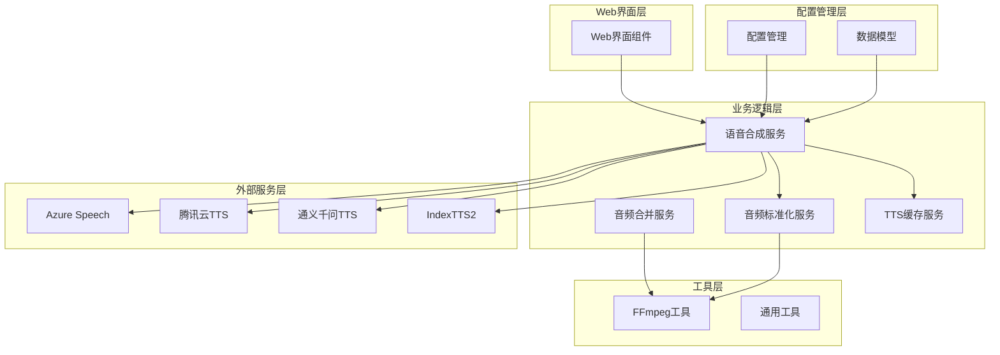
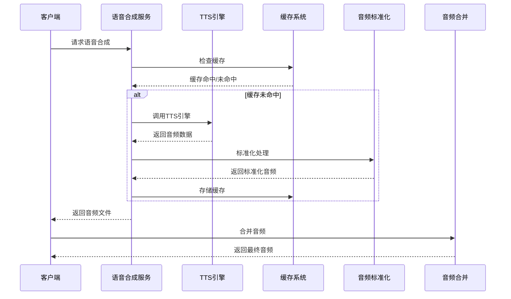
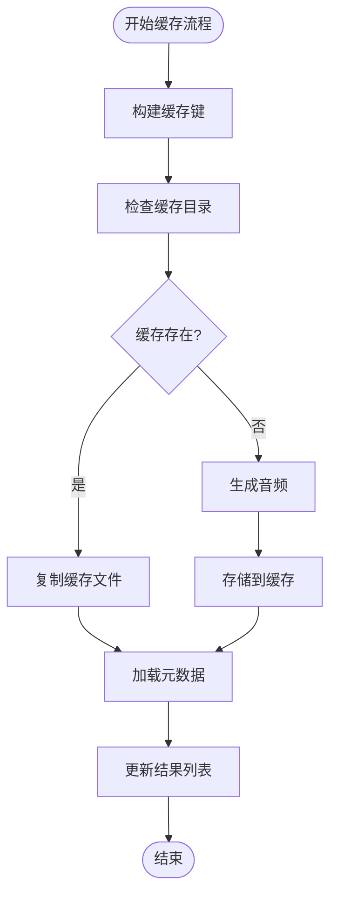
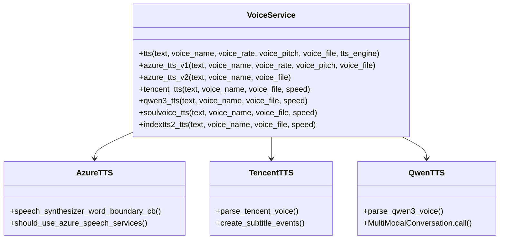
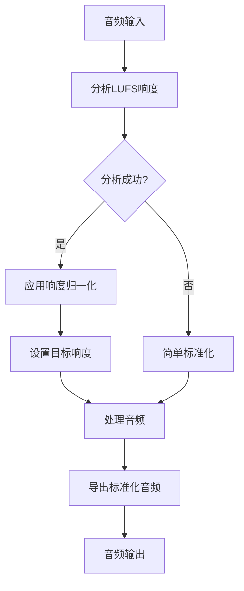
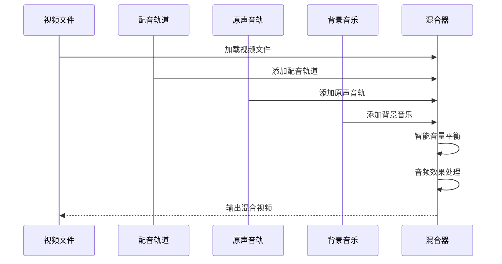
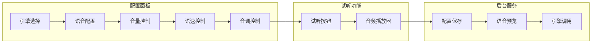
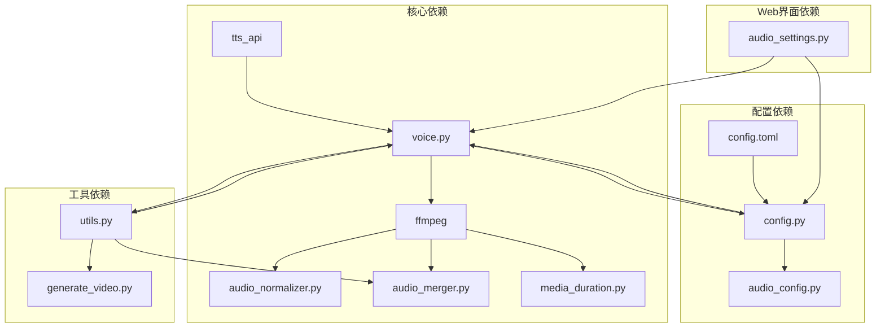

# TTS语音合成系统

<cite>
**本文档引用的文件**
- [tts_cache.py](file://app/services/tts_cache.py)
- [audio_merger.py](file://app/services/audio_merger.py)
- [audio_normalizer.py](file://app/services/audio_normalizer.py)
- [voice.py](file://app/services/voice.py)
- [audio_config.py](file://app/config/audio_config.py)
- [ffmpeg_utils.py](file://app/utils/ffmpeg_utils.py)
- [schema.py](file://app/models/schema.py)
- [generate_video.py](file://app/services/generate_video.py)
- [audio_settings.py](file://webui/components/audio_settings.py)
- [config.py](file://app/config/config.py)
- [utils.py](file://app/utils/utils.py)
- [media_duration.py](file://app/services/media_duration.py)
</cite>

## 目录
1. [简介](#简介)
2. [项目结构](#项目结构)
3. [核心组件](#核心组件)
4. [架构概览](#架构概览)
5. [详细组件分析](#详细组件分析)
6. [依赖关系分析](#依赖关系分析)
7. [性能考虑](#性能考虑)
8. [故障排除指南](#故障排除指南)
9. [结论](#结论)

## 简介

NarratoAI是一个基于Python的TTS（文本转语音）语音合成系统，提供了完整的视频生成解决方案。该系统集成了多种TTS引擎，包括Azure Speech Services、腾讯云TTS、通义千问Qwen3 TTS和IndexTTS2语音克隆，支持多语言、多音色的高质量语音合成。

系统采用模块化设计，包含语音合成引擎、音频处理、缓存管理、字幕生成等多个核心组件，为用户提供从文本到最终视频的完整自动化工作流程。

## 项目结构

项目采用清晰的分层架构，主要分为以下几个层次：

**图表来源**
- [audio_settings.py:1-800](file://webui/components/audio_settings.py#L1-L800)
- [voice.py:1-2132](file://app/services/voice.py#L1-L2132)

**章节来源**
- [audio_settings.py:1-800](file://webui/components/audio_settings.py#L1-L800)
- [voice.py:1-2132](file://app/services/voice.py#L1-L2132)

## 核心组件

### TTS引擎集成

系统支持多种TTS引擎，每种引擎都有其独特的特点和适用场景：

| 引擎类型 | 特点 | 适用场景 | 配置要求 |
|---------|------|----------|----------|
| Azure Speech Services | 企业级服务，音质优秀，支持多语言 | 专业应用场景，需要稳定服务 | Azure账户，API密钥 |
| Edge TTS | 完全免费，易于使用 | 测试和轻量级应用 | 无需配置 |
| 腾讯云TTS | 国内访问速度快，音质优秀 | 中国用户，中文语音需求 | 腾讯云账户 |
| 通义千问Qwen3 TTS | 阿里云服务，高质量中文语音 | 需要高质量中文合成 | DashScope API密钥 |
| IndexTTS2 | 语音克隆功能 | 个性化语音需求 | 本地部署 |

### 音频处理管道

系统提供完整的音频处理流水线，包括：

1. **语音合成** - 多引擎支持的文本转语音
2. **音频标准化** - 响度归一化和质量增强
3. **音频混合** - 多音轨合成和音量平衡
4. **字幕生成** - 时间同步的字幕文件创建

**章节来源**
- [voice.py:1120-1159](file://app/services/voice.py#L1120-L1159)
- [audio_normalizer.py:22-315](file://app/services/audio_normalizer.py#L22-L315)
- [audio_merger.py:21-77](file://app/services/audio_merger.py#L21-L77)

## 架构概览

系统采用事件驱动的异步架构，支持并发处理和错误恢复：

**图表来源**
- [voice.py:1570-1635](file://app/services/voice.py#L1570-L1635)
- [tts_cache.py:45-94](file://app/services/tts_cache.py#L45-L94)
- [audio_normalizer.py:122-205](file://app/services/audio_normalizer.py#L122-L205)

## 详细组件分析

### TTS缓存系统

TTS缓存系统实现了智能的音频文件缓存机制，显著提升了系统性能：

**图表来源**
- [tts_cache.py:24-94](file://app/services/tts_cache.py#L24-L94)

缓存系统的核心特性：

1. **智能缓存键生成** - 基于文本内容、语音参数和引擎信息生成MD5哈希
2. **文件组织结构** - 每个缓存条目独立存储，包含音频文件和元数据
3. **自动失效机制** - 支持缓存文件的自动清理和重建
4. **错误恢复** - 缓存读取失败时自动回退到重新生成

**章节来源**
- [tts_cache.py:1-125](file://app/services/tts_cache.py#L1-L125)

### 多引擎语音合成

语音合成服务提供了统一的接口来调用不同的TTS引擎：

**图表来源**
- [voice.py:1120-1339](file://app/services/voice.py#L1120-L1339)
- [voice.py:1700-1793](file://app/services/voice.py#L1700-L1793)

**章节来源**
- [voice.py:1120-2089](file://app/services/voice.py#L1120-L2089)

### 音频标准化处理

音频标准化服务提供了专业的响度控制和音频质量增强功能：

**图表来源**
- [audio_normalizer.py:122-205](file://app/services/audio_normalizer.py#L122-L205)

音频标准化的核心功能：

1. **LUFS响度分析** - 使用FFmpeg loudnorm滤镜进行专业响度测量
2. **智能音量调整** - 基于响度差异自动计算音量调整系数
3. **多格式支持** - 支持MP3、WAV等多种音频格式
4. **质量保持** - 在标准化过程中保持音频质量

**章节来源**
- [audio_normalizer.py:22-315](file://app/services/audio_normalizer.py#L22-L315)

### 音频混合技术

音频混合服务实现了复杂的多音轨合成和音量平衡：

**图表来源**
- [generate_video.py:193-271](file://app/services/generate_video.py#L193-L271)

音频混合的关键特性：

1. **智能音量平衡** - 自动分析TTS和原声音轨的响度差异
2. **多轨道支持** - 同时处理配音、原声和背景音乐三个轨道
3. **效果处理** - 支持淡入淡出、交叉淡化等音频效果
4. **质量优化** - 统一采样率和声道配置

**章节来源**
- [generate_video.py:66-404](file://app/services/generate_video.py#L66-L404)

### Web界面集成

Web界面提供了直观的TTS引擎配置和试听功能：

**图表来源**
- [audio_settings.py:95-153](file://webui/components/audio_settings.py#L95-L153)

**章节来源**
- [audio_settings.py:1-800](file://webui/components/audio_settings.py#L1-L800)

## 依赖关系分析

系统采用松耦合的设计，各组件之间的依赖关系清晰明确：

**图表来源**
- [config.py:24-70](file://app/config/config.py#L24-L70)
- [utils.py:76-109](file://app/utils/utils.py#L76-L109)

**章节来源**
- [config.py:1-95](file://app/config/config.py#L1-L95)
- [utils.py:1-675](file://app/utils/utils.py#L1-L675)

## 性能考虑

### 缓存优化策略

系统通过智能缓存机制显著提升性能：

1. **缓存键设计** - 基于文本内容、语音参数和引擎信息的MD5哈希
2. **并行处理** - 支持多任务并发处理，充分利用系统资源
3. **内存管理** - 合理的内存使用策略，避免内存泄漏
4. **磁盘空间管理** - 自动清理过期缓存，控制磁盘使用

### 音频处理优化

音频处理管道经过专门优化：

1. **硬件加速** - 自动检测和使用FFmpeg硬件加速功能
2. **批量处理** - 支持批量音频文件处理，减少I/O开销
3. **格式优化** - 统一音频格式和参数，减少转换开销
4. **质量控制** - 在性能和质量之间找到最佳平衡点

### 网络优化

多引擎支持的网络优化策略：

1. **连接池管理** - 复用网络连接，减少建立连接的开销
2. **超时控制** - 合理的超时设置，避免长时间阻塞
3. **重试机制** - 智能的重试策略，提高成功率
4. **代理支持** - 支持HTTP和HTTPS代理，适应不同网络环境

## 故障排除指南

### 常见问题及解决方案

| 问题类型 | 症状 | 可能原因 | 解决方案 |
|---------|------|----------|----------|
| TTS引擎连接失败 | 语音合成失败 | 网络连接问题 | 检查网络连接，配置代理 |
| 音频文件损坏 | 播放器无法打开音频 | 编码错误 | 检查FFmpeg安装，重新生成音频 |
| 缓存失效 | 需要重新生成所有音频 | 缓存文件损坏 | 清理缓存目录，重新生成 |
| 音量不平衡 | 配音过大或过小 | 音量配置不当 | 调整音量配置，使用智能音量平衡 |
| 字幕不同步 | 字幕与音频不匹配 | 时间戳计算错误 | 检查字幕生成逻辑，重新生成字幕 |

### 调试工具和方法

1. **日志分析** - 使用Loguru记录详细的操作日志
2. **性能监控** - 监控CPU、内存和磁盘使用情况
3. **网络诊断** - 检查网络连接和API响应时间
4. **音频分析** - 使用FFmpeg分析音频质量和参数

**章节来源**
- [voice.py:1241-1245](file://app/services/voice.py#L1241-L1245)
- [audio_normalizer.py:200-205](file://app/services/audio_normalizer.py#L200-L205)

## 结论

NarratoAI TTS语音合成系统是一个功能完整、性能优秀的多引擎语音合成解决方案。系统通过模块化设计、智能缓存机制和专业的音频处理技术，为用户提供了高质量的语音合成体验。

主要优势包括：

1. **多引擎支持** - 集成多种TTS引擎，满足不同需求
2. **智能缓存** - 显著提升处理效率
3. **专业音频处理** - 提供响度归一化和质量增强
4. **用户友好** - 直观的Web界面和丰富的配置选项
5. **高性能** - 优化的算法和硬件加速支持

未来发展方向：

1. **更多引擎支持** - 扩展支持更多的TTS服务提供商
2. **AI增强功能** - 集成更多人工智能技术
3. **云端部署** - 提供更好的云端部署和扩展能力
4. **实时处理** - 支持实时语音合成和处理

该系统为视频内容创作者提供了强大的技术支持，能够帮助他们快速生成高质量的语音内容，提升创作效率和作品质量。