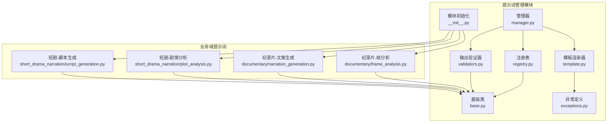
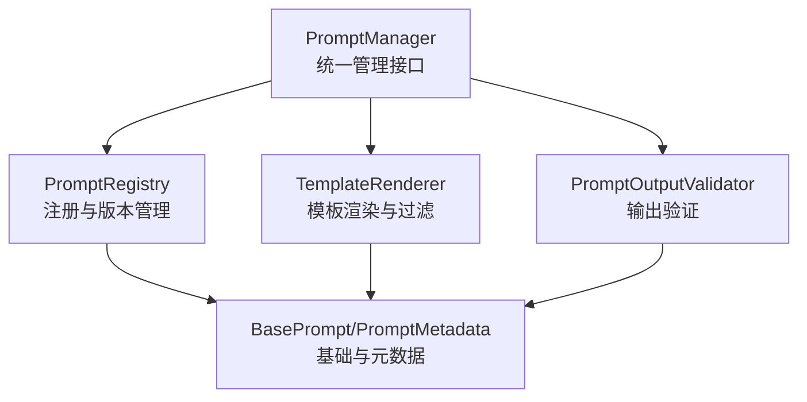
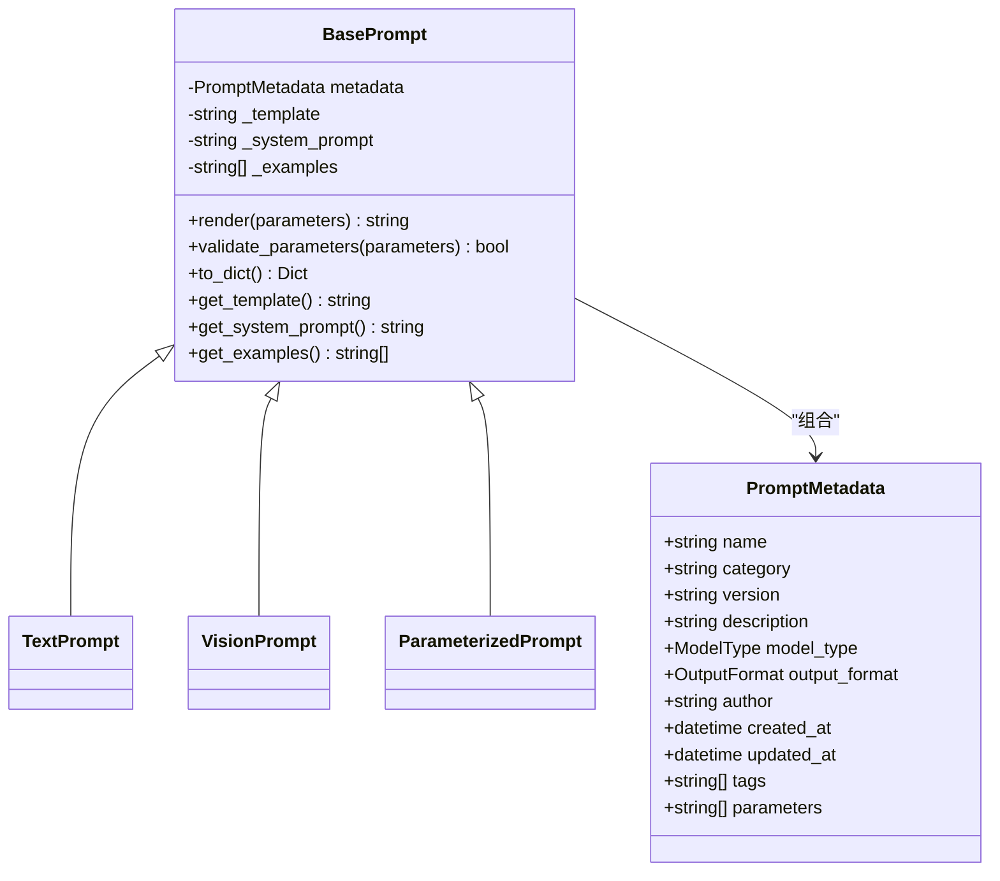
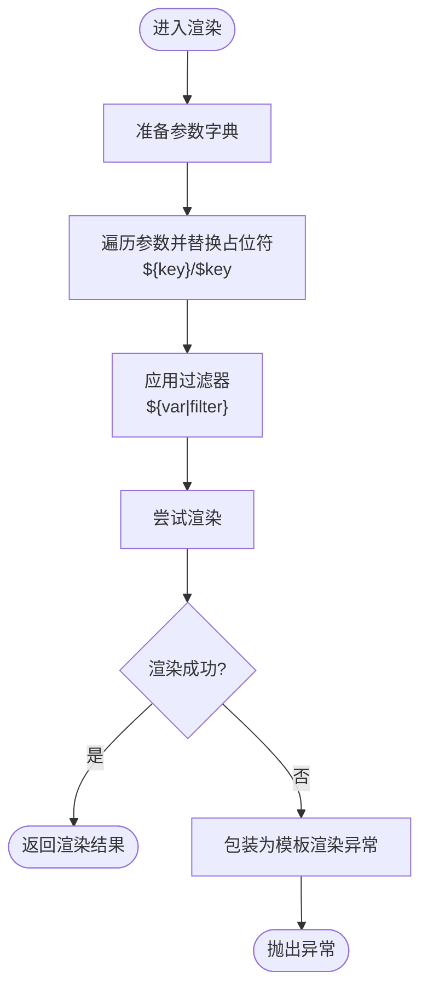
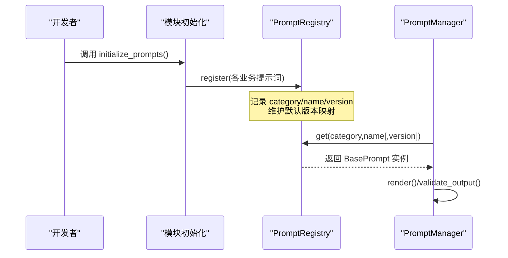
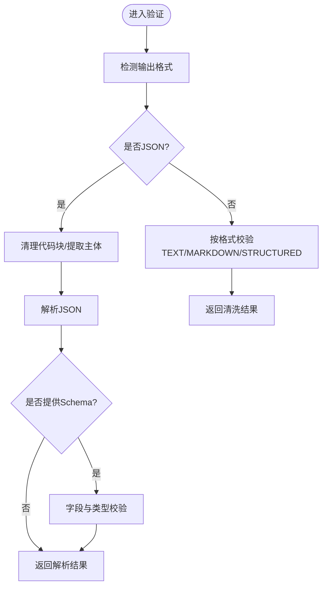
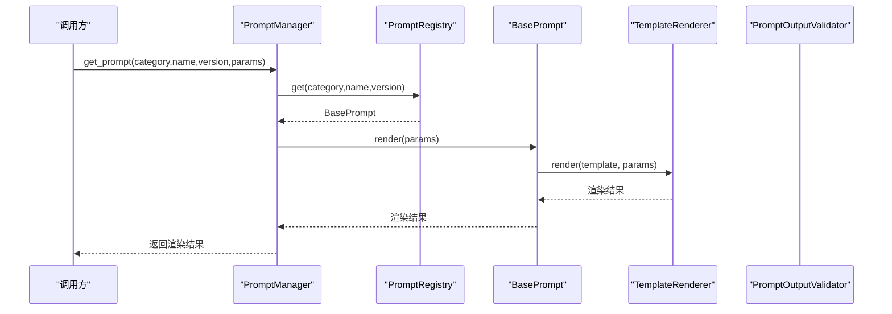
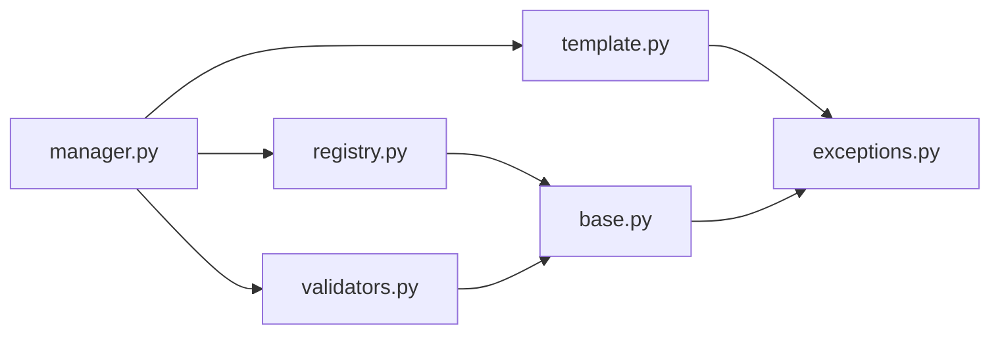

# 提示词管理系统

<cite>
**本文档引用的文件**
- [app/services/prompts/base.py](file://app/services/prompts/base.py)
- [app/services/prompts/template.py](file://app/services/prompts/template.py)
- [app/services/prompts/manager.py](file://app/services/prompts/manager.py)
- [app/services/prompts/registry.py](file://app/services/prompts/registry.py)
- [app/services/prompts/validators.py](file://app/services/prompts/validators.py)
- [app/services/prompts/exceptions.py](file://app/services/prompts/exceptions.py)
- [app/services/prompts/__init__.py](file://app/services/prompts/__init__.py)
- [app/services/prompts/documentary/frame_analysis.py](file://app/services/prompts/documentary/frame_analysis.py)
- [app/services/prompts/documentary/narration_generation.py](file://app/services/prompts/documentary/narration_generation.py)
- [app/services/prompts/short_drama_narration/plot_analysis.py](file://app/services/prompts/short_drama_narration/plot_analysis.py)
- [app/services/prompts/short_drama_narration/script_generation.py](file://app/services/prompts/short_drama_narration/script_generation.py)
</cite>

## 目录
1. [简介](#简介)
2. [项目结构](#项目结构)
3. [核心组件](#核心组件)
4. [架构总览](#架构总览)
5. [详细组件分析](#详细组件分析)
6. [依赖关系分析](#依赖关系分析)
7. [性能考量](#性能考量)
8. [故障排查指南](#故障排查指南)
9. [结论](#结论)
10. [附录](#附录)

## 简介
本文件面向提示词管理系统，系统性阐述提示词模板的设计架构（模板继承、参数化、版本控制）、注册与检索机制（动态加载、缓存与生命周期）、模板验证器（语法检查、参数验证、运行时校验）、异常处理（错误分类、恢复策略、调试支持）、存储与检索（内存缓存、持久化导出、性能优化），并提供开发最佳实践与扩展指南，帮助开发者高效构建、维护与演进提示词体系。

## 项目结构
提示词管理模块位于 app/services/prompts 下，采用“功能域+层次化”组织方式：
- 基础层：定义提示词元数据、基础类与模型/输出格式枚举
- 渲染层：模板渲染引擎与过滤器
- 管理层：统一管理器封装注册、检索、导出、统计、输出验证
- 注册层：全局注册表，负责提示词的注册、版本管理、搜索与统计
- 验证层：输出验证器，针对不同输出格式与业务结构进行校验
- 异常层：集中定义提示词相关异常
- 初始化：自动扫描并注册各业务域提示词

图表来源
- [app/services/prompts/__init__.py:55-69](file://app/services/prompts/__init__.py#L55-L69)
- [app/services/prompts/base.py:50-183](file://app/services/prompts/base.py#L50-L183)
- [app/services/prompts/template.py:20-181](file://app/services/prompts/template.py#L20-L181)
- [app/services/prompts/registry.py:24-224](file://app/services/prompts/registry.py#L24-L224)
- [app/services/prompts/manager.py:26-288](file://app/services/prompts/manager.py#L26-L288)
- [app/services/prompts/validators.py:21-251](file://app/services/prompts/validators.py#L21-L251)
- [app/services/prompts/documentary/frame_analysis.py:15-68](file://app/services/prompts/documentary/frame_analysis.py#L15-L68)
- [app/services/prompts/documentary/narration_generation.py:15-114](file://app/services/prompts/documentary/narration_generation.py#L15-L114)
- [app/services/prompts/short_drama_narration/plot_analysis.py:15-91](file://app/services/prompts/short_drama_narration/plot_analysis.py#L15-L91)
- [app/services/prompts/short_drama_narration/script_generation.py:15-308](file://app/services/prompts/short_drama_narration/script_generation.py#L15-L308)

章节来源
- [app/services/prompts/__init__.py:55-69](file://app/services/prompts/__init__.py#L55-L69)

## 核心组件
- 基础类与元数据
  - 定义模型类型与输出格式枚举，统一提示词元数据结构，提供渲染入口与参数校验基线
- 模板渲染器
  - 实现参数替换、过滤器链路、变量提取与模板验证
- 注册表
  - 维护分类-名称-版本三层索引、默认版本映射、搜索与统计
- 管理器
  - 统一封装提示词获取、注册、导出、统计、输出验证与信息查询
- 输出验证器
  - 针对JSON、文本、Markdown、结构化数据进行格式与业务规则校验
- 异常体系
  - 明确未找到、验证失败、渲染失败、注册冲突、版本错误等分类

章节来源
- [app/services/prompts/base.py:34-183](file://app/services/prompts/base.py#L34-L183)
- [app/services/prompts/template.py:20-181](file://app/services/prompts/template.py#L20-L181)
- [app/services/prompts/registry.py:24-224](file://app/services/prompts/registry.py#L24-L224)
- [app/services/prompts/manager.py:26-288](file://app/services/prompts/manager.py#L26-L288)
- [app/services/prompts/validators.py:21-251](file://app/services/prompts/validators.py#L21-L251)
- [app/services/prompts/exceptions.py:13-80](file://app/services/prompts/exceptions.py#L13-L80)

## 架构总览
系统采用“管理器-注册表-渲染器-验证器”的分层架构，业务域提示词通过模块初始化自动注册，形成可搜索、可版本化、可导出的提示词资产库。

图表来源
- [app/services/prompts/manager.py:26-162](file://app/services/prompts/manager.py#L26-L162)
- [app/services/prompts/registry.py:24-123](file://app/services/prompts/registry.py#L24-L123)
- [app/services/prompts/template.py:20-98](file://app/services/prompts/template.py#L20-L98)
- [app/services/prompts/validators.py:21-240](file://app/services/prompts/validators.py#L21-L240)
- [app/services/prompts/base.py:50-183](file://app/services/prompts/base.py#L50-L183)

## 详细组件分析

### 基础类与元数据（模板继承与参数化）
- PromptMetadata：承载提示词名称、分类、版本、描述、模型类型、输出格式、作者、时间戳、标签、参数清单等
- BasePrompt：定义渲染入口、系统提示、示例、参数校验与字典序列化；派生出 TextPrompt、VisionPrompt、ParameterizedPrompt
- ParameterizedPrompt：在构造时合并外部传入的必需参数，自动去重，确保渲染前的参数完备性

图表来源
- [app/services/prompts/base.py:34-183](file://app/services/prompts/base.py#L34-L183)

章节来源
- [app/services/prompts/base.py:34-183](file://app/services/prompts/base.py#L34-L183)

### 模板渲染引擎（语法检查、参数替换、过滤器）
- 参数替换：支持 ${key} 与 $key 两种占位符，遍历参数字典进行替换
- 过滤器：通过 ${var|filter} 语法应用注册的过滤器，内置 upper/lower/title/strip/truncate/json 等
- 语法检查：提取模板变量，校验必需参数是否覆盖，尝试以测试参数渲染以发现潜在问题
- 错误包装：统一捕获渲染异常并包装为模板渲染异常，携带模板名与缺失参数

图表来源
- [app/services/prompts/template.py:31-98](file://app/services/prompts/template.py#L31-L98)

章节来源
- [app/services/prompts/template.py:20-181](file://app/services/prompts/template.py#L20-L181)

### 注册表与版本控制（动态加载、缓存与生命周期）
- 存储结构：三级嵌套字典 category → name → version → BasePrompt
- 默认版本：记录每个 name 的默认版本，未指定版本时自动回退
- 动态注册：注册时校验版本唯一性，支持设置/变更默认版本
- 生命周期：支持查询、搜索、统计、删除（单版本/全版本），删除默认版本时自动选择新默认版本
- 搜索：支持关键词、模型类型、输出格式过滤，返回(category, name, version)三元组

图表来源
- [app/services/prompts/__init__.py:55-69](file://app/services/prompts/__init__.py#L55-L69)
- [app/services/prompts/registry.py:35-123](file://app/services/prompts/registry.py#L35-L123)
- [app/services/prompts/manager.py:34-116](file://app/services/prompts/manager.py#L34-L116)

章节来源
- [app/services/prompts/registry.py:24-224](file://app/services/prompts/registry.py#L24-L224)

### 输出验证器（运行时校验与业务规则）
- JSON：清理代码块标记、提取JSON主体、解析并可选Schema校验
- 业务结构：
  - 解说脚本：校验 items 数组、字段完整性、时间戳格式、OST取值范围
  - 剧情分析：校验 summary 与 plot_points 字段、数组类型与格式
- 其他格式：TEXT/MARKDOWN/STRUCTURED 直接返回清洗后的字符串
- 异常：统一包装为提示词验证异常，便于上层捕获与日志记录

图表来源
- [app/services/prompts/validators.py:24-240](file://app/services/prompts/validators.py#L24-L240)

章节来源
- [app/services/prompts/validators.py:21-251](file://app/services/prompts/validators.py#L21-L251)

### 管理器（统一接口与导出）
- 获取渲染结果：按分类、名称、版本获取提示词对象并渲染
- 查询与统计：列出分类/提示词/版本、搜索、统计
- 输出验证：根据提示词元数据的输出格式调用相应验证逻辑
- 导出：支持按分类导出提示词配置，包含元数据、模板、系统提示与示例
- 便捷函数：提供 get_prompt 与 validate_prompt_output 的静态入口

图表来源
- [app/services/prompts/manager.py:34-61](file://app/services/prompts/manager.py#L34-L61)
- [app/services/prompts/registry.py:65-93](file://app/services/prompts/registry.py#L65-L93)
- [app/services/prompts/base.py:112-133](file://app/services/prompts/base.py#L112-L133)
- [app/services/prompts/template.py:31-63](file://app/services/prompts/template.py#L31-L63)

章节来源
- [app/services/prompts/manager.py:26-288](file://app/services/prompts/manager.py#L26-L288)

### 业务域提示词示例（模板继承与参数化）
- 纪录片-帧分析：视觉模型，JSON输出，参数 video_theme、custom_instructions
- 纪录片-文案生成：文本模型，JSON输出，参数 video_frame_description
- 短剧-剧情分析：文本模型，文本输出，参数 subtitle_content
- 短剧-脚本生成：参数化提示词，必需 drama_name、plot_analysis，参数 subtitle_content，JSON输出

章节来源
- [app/services/prompts/documentary/frame_analysis.py:15-68](file://app/services/prompts/documentary/frame_analysis.py#L15-L68)
- [app/services/prompts/documentary/narration_generation.py:15-114](file://app/services/prompts/documentary/narration_generation.py#L15-L114)
- [app/services/prompts/short_drama_narration/plot_analysis.py:15-91](file://app/services/prompts/short_drama_narration/plot_analysis.py#L15-L91)
- [app/services/prompts/short_drama_narration/script_generation.py:15-308](file://app/services/prompts/short_drama_narration/script_generation.py#L15-L308)

## 依赖关系分析
- 模块内聚：各组件职责清晰，基础类与元数据被渲染、注册、验证广泛复用
- 外部依赖：日志框架用于调试与错误记录；Python标准库完成模板变量提取与JSON解析
- 循环依赖：未见循环导入；管理器聚合注册表与渲染器，注册表不依赖管理器，形成单向依赖

图表来源
- [app/services/prompts/manager.py:15-23](file://app/services/prompts/manager.py#L15-L23)
- [app/services/prompts/registry.py:16-21](file://app/services/prompts/registry.py#L16-L21)
- [app/services/prompts/template.py:17](file://app/services/prompts/template.py#L17)
- [app/services/prompts/validators.py:17-18](file://app/services/prompts/validators.py#L17-L18)
- [app/services/prompts/base.py:12-16](file://app/services/prompts/base.py#L12-L16)
- [app/services/prompts/exceptions.py:13-15](file://app/services/prompts/exceptions.py#L13-L15)

章节来源
- [app/services/prompts/manager.py:15-23](file://app/services/prompts/manager.py#L15-L23)
- [app/services/prompts/registry.py:16-21](file://app/services/prompts/registry.py#L16-L21)
- [app/services/prompts/template.py:17](file://app/services/prompts/template.py#L17)
- [app/services/prompts/validators.py:17-18](file://app/services/prompts/validators.py#L17-L18)
- [app/services/prompts/base.py:12-16](file://app/services/prompts/base.py#L12-L16)
- [app/services/prompts/exceptions.py:13-15](file://app/services/prompts/exceptions.py#L13-L15)

## 性能考量
- 渲染性能
  - 模板变量替换为线性扫描，复杂度 O(N×M)，其中 N 为参数数量，M 为模板中占位符数量；建议控制模板变量规模与层级
  - 过滤器链路在文本上执行，建议避免重型过滤器或在上游缓存中间态
- 注册与检索
  - 注册表采用三层字典，查找近似 O(1)，适合频繁读取场景
  - 搜索遍历所有项，复杂度 O(C×N×V)，建议在高频搜索场景下增加索引字段或缓存热门查询结果
- 导出与统计
  - 导出遍历所有分类/提示词/版本，复杂度 O(T)，T 为提示词总数；建议按需导出或分页
- 缓存策略
  - 当前为内存缓存（全局渲染器与注册表），建议在高并发场景下引入进程内缓存（如 LRU）与版本感知失效
- I/O 与持久化
  - 当前未见持久化存储实现；如需持久化，建议引入配置文件/数据库存储与版本化备份

[本节为通用性能讨论，无需列出章节来源]

## 故障排查指南
- 未找到提示词
  - 症状：按分类/名称/版本无法获取提示词
  - 排查：确认是否已注册、版本是否存在、默认版本是否正确设置
- 模板渲染失败
  - 症状：渲染时报错，可能包含缺失参数列表
  - 排查：核对模板变量与传入参数，使用模板验证工具检查必需参数
- 输出验证失败
  - 症状：JSON/结构化输出不符合预期
  - 排查：对照业务结构字段与时间戳格式，检查清洗逻辑与Schema约束
- 注册冲突
  - 症状：注册同名同版本提示词失败
  - 排查：修改版本号或删除旧版本后再注册
- 版本错误
  - 症状：设置默认版本或删除版本时报错
  - 排查：确认版本确实存在于注册表中

章节来源
- [app/services/prompts/exceptions.py:18-80](file://app/services/prompts/exceptions.py#L18-L80)
- [app/services/prompts/manager.py:164-202](file://app/services/prompts/manager.py#L164-L202)
- [app/services/prompts/registry.py:114-122](file://app/services/prompts/registry.py#L114-L122)

## 结论
提示词管理系统以清晰的分层架构实现了模板继承、参数化与版本控制，结合动态注册与统一管理接口，提供了可扩展、可观测、可验证的提示词资产管理体系。通过内置模板验证与输出验证，系统在开发阶段即能捕获常见问题，保障生成内容的质量与一致性。建议在生产环境中进一步完善持久化与缓存策略，并持续沉淀业务域提示词模板，提升团队复用效率与交付质量。

[本节为总结性内容，无需列出章节来源]

## 附录

### 最佳实践与设计模式
- 模板复用
  - 将通用指令与结构抽取为系统提示与模板骨架，通过参数注入差异化内容
  - 使用过滤器链路进行轻量预处理，避免在模板中编写复杂逻辑
- 参数传递
  - 在元数据中显式声明必需参数，结合参数校验与模板变量提取，确保渲染前参数完备
  - 对输入参数进行边界与类型约束，必要时在上游进行清洗与归一化
- 结果验证
  - 针对不同输出格式制定严格的Schema与业务规则，优先在生成端进行结构化输出
  - 对时间戳、字段完整性与取值范围进行自动化校验，减少下游处理成本
- 扩展开发
  - 新增业务域提示词时，遵循现有命名与版本策略，确保可搜索与可追踪
  - 通过注册表的搜索与统计接口，定期盘点与优化提示词资产

[本节为通用指导，无需列出章节来源]