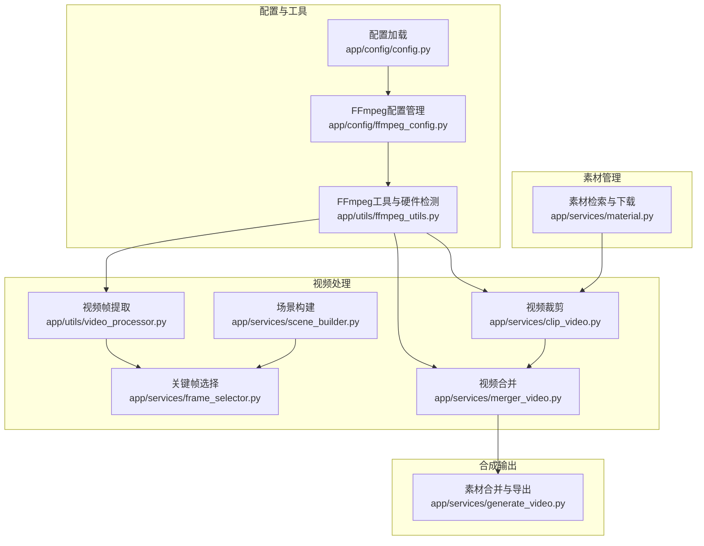
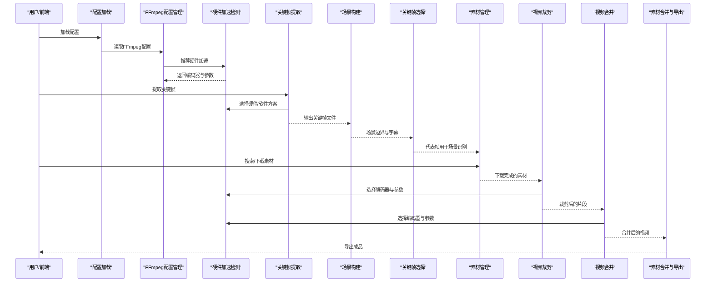
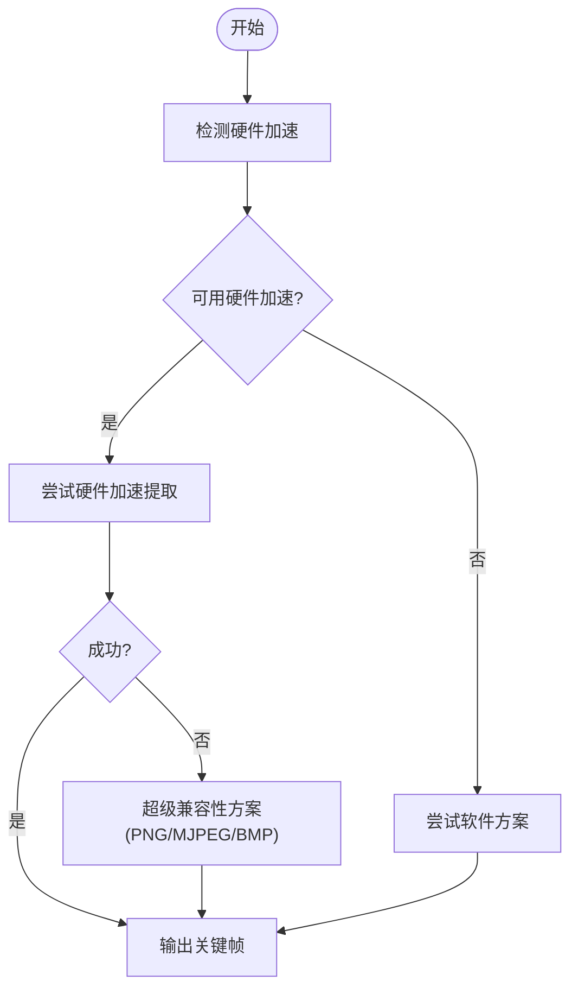
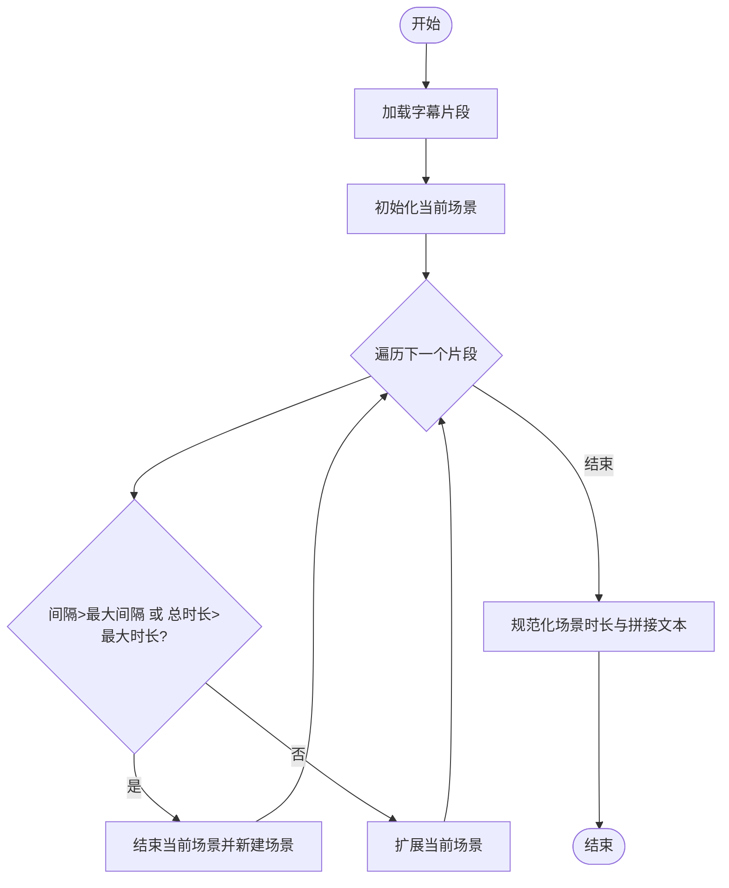
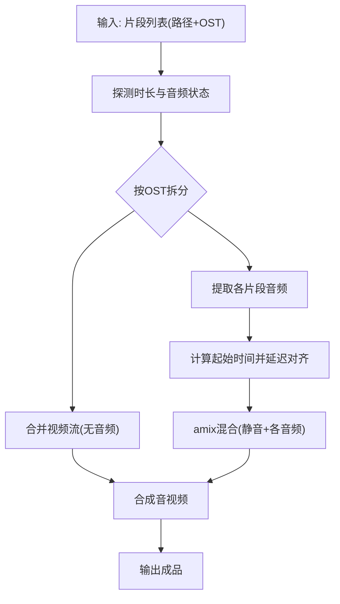
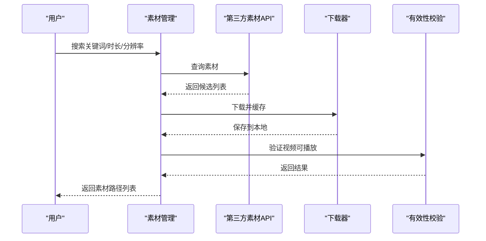
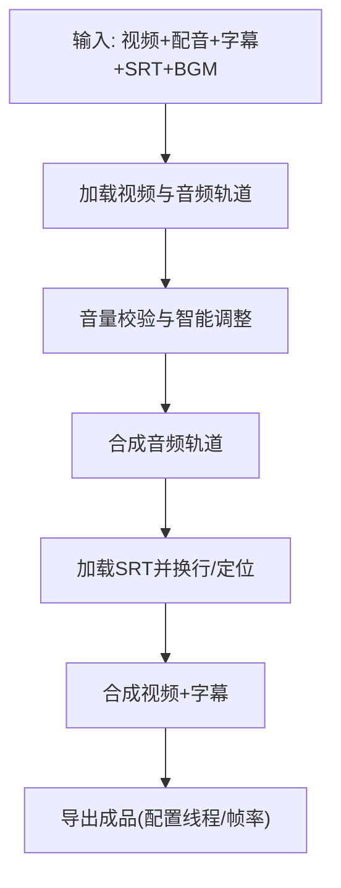
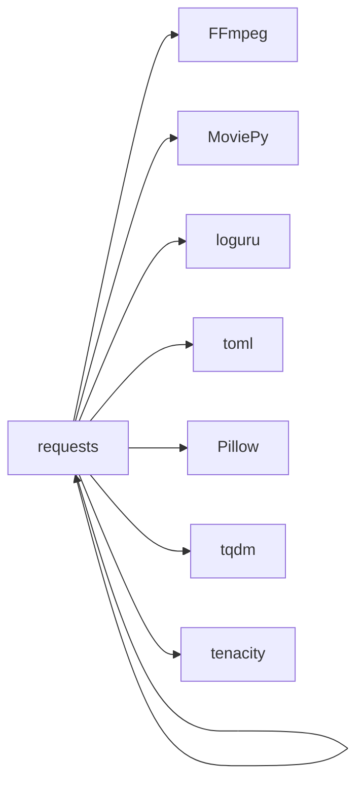

# 智能视频剪辑服务

<cite>
**本文引用的文件**
- [README.md](file://README.md)
- [requirements.txt](file://requirements.txt)
- [app/config/config.py](file://app/config/config.py)
- [app/config/ffmpeg_config.py](file://app/config/ffmpeg_config.py)
- [app/utils/ffmpeg_utils.py](file://app/utils/ffmpeg_utils.py)
- [app/utils/video_processor.py](file://app/utils/video_processor.py)
- [app/services/frame_selector.py](file://app/services/frame_selector.py)
- [app/services/scene_builder.py](file://app/services/scene_builder.py)
- [app/services/clip_video.py](file://app/services/clip_video.py)
- [app/services/material.py](file://app/services/material.py)
- [app/services/merger_video.py](file://app/services/merger_video.py)
- [app/services/generate_video.py](file://app/services/generate_video.py)
- [app/models/schema.py](file://app/models/schema.py)
</cite>

## 目录
1. [简介](#简介)
2. [项目结构](#项目结构)
3. [核心组件](#核心组件)
4. [架构总览](#架构总览)
5. [详细组件分析](#详细组件分析)
6. [依赖关系分析](#依赖关系分析)
7. [性能考虑](#性能考虑)
8. [故障排除指南](#故障排除指南)
9. [结论](#结论)
10. [附录](#附录)

## 简介
本项目是一套面向短视频与短剧的“智能视频剪辑服务”，围绕“文案生成-视频素材管理-自动剪辑-配音与字幕-最终合成”全流程展开，提供从原始素材到成品输出的完整能力。系统采用 FFmpeg 为核心引擎，结合多平台硬件加速检测与降级策略，确保在不同硬件环境下稳定运行；同时通过关键帧提取、场景构建与镜头分割策略，实现高质量的自动剪辑。

## 项目结构
项目采用“按功能域分层”的组织方式，核心模块包括：
- 配置与工具：配置加载、FFmpeg 配置管理、硬件加速检测与诊断
- 视频处理：关键帧提取、场景构建、视频裁剪、视频合并
- 素材管理：在线素材检索、下载与本地缓存
- 合成输出：音视频混合、字幕叠加、最终导出

图表来源
- [app/config/config.py:24-44](file://app/config/config.py#L24-L44)
- [app/config/ffmpeg_config.py:27-157](file://app/config/ffmpeg_config.py#L27-L157)
- [app/utils/ffmpeg_utils.py:252-355](file://app/utils/ffmpeg_utils.py#L252-L355)
- [app/utils/video_processor.py:26-49](file://app/utils/video_processor.py#L26-L49)
- [app/services/frame_selector.py:25-50](file://app/services/frame_selector.py#L25-L50)
- [app/services/scene_builder.py:7-52](file://app/services/scene_builder.py#L7-L52)
- [app/services/clip_video.py:143-227](file://app/services/clip_video.py#L143-L227)
- [app/services/merger_video.py:130-261](file://app/services/merger_video.py#L130-L261)
- [app/services/material.py:190-254](file://app/services/material.py#L190-L254)
- [app/services/generate_video.py:66-102](file://app/services/generate_video.py#L66-L102)

章节来源
- [README.md:105-141](file://README.md#L105-L141)
- [requirements.txt:1-39](file://requirements.txt#L1-L39)

## 核心组件
- FFmpeg 配置与硬件加速
  - 通过集中式检测与降级策略，自动选择最优编码器与参数，覆盖 Windows NVIDIA、macOS VideoToolbox、Linux VAAPI/QSV 等场景。
- 关键帧提取与代表帧选择
  - 基于时间戳解析与均匀采样策略，从视频中提取关键帧并按场景稀疏选择代表帧，支撑场景识别与内容分析。
- 场景构建与镜头分割
  - 基于字幕时间轴与最大时长/间隙阈值，将连续片段聚合成场景；在无字幕时提供基于关键帧的回退场景划分。
- 视频裁剪与合并
  - 支持多种 OST 模式（仅原声、仅配音、混合），自动处理滤镜链兼容性与硬件加速降级；合并阶段分离音视频流，按时间对齐混合音频。
- 素材管理与下载
  - 提供 Pexels/Pixabay 素材检索与下载，支持按分辨率与方向筛选，保障素材质量与时长。
- 合成输出
  - 将视频、配音、原声与背景音乐混合，支持字幕叠加与字体换行，导出最终成品。

章节来源
- [app/config/ffmpeg_config.py:27-157](file://app/config/ffmpeg_config.py#L27-L157)
- [app/utils/ffmpeg_utils.py:252-355](file://app/utils/ffmpeg_utils.py#L252-L355)
- [app/utils/video_processor.py:26-49](file://app/utils/video_processor.py#L26-L49)
- [app/services/frame_selector.py:25-50](file://app/services/frame_selector.py#L25-L50)
- [app/services/scene_builder.py:7-52](file://app/services/scene_builder.py#L7-L52)
- [app/services/clip_video.py:143-227](file://app/services/clip_video.py#L143-L227)
- [app/services/merger_video.py:130-261](file://app/services/merger_video.py#L130-L261)
- [app/services/material.py:190-254](file://app/services/material.py#L190-L254)
- [app/services/generate_video.py:66-102](file://app/services/generate_video.py#L66-L102)

## 架构总览
系统以“数据驱动 + FFmpeg 引擎”的方式组织，核心流程如下：

图表来源
- [app/config/config.py:24-44](file://app/config/config.py#L24-L44)
- [app/config/ffmpeg_config.py:98-141](file://app/config/ffmpeg_config.py#L98-L141)
- [app/utils/ffmpeg_utils.py:252-355](file://app/utils/ffmpeg_utils.py#L252-L355)
- [app/utils/video_processor.py:464-494](file://app/utils/video_processor.py#L464-L494)
- [app/services/scene_builder.py:7-52](file://app/services/scene_builder.py#L7-L52)
- [app/services/frame_selector.py:25-50](file://app/services/frame_selector.py#L25-L50)
- [app/services/material.py:190-254](file://app/services/material.py#L190-L254)
- [app/services/clip_video.py:780-799](file://app/services/clip_video.py#L780-L799)
- [app/services/merger_video.py:328-462](file://app/services/merger_video.py#L328-L462)
- [app/services/generate_video.py:66-102](file://app/services/generate_video.py#L66-L102)

## 详细组件分析

### 关键帧提取与代表帧选择
- 关键帧提取
  - 支持按固定时间间隔提取，自动选择硬件加速（CUDA/NVENC/VAAPI/AMF/QSV/VideoToolbox）或软件方案，失败时逐步降级至兼容性方案。
  - 针对 Windows NVIDIA 显卡，提供“纯 NVENC 编码器”方案，避免滤镜链格式转换错误。
- 代表帧选择
  - 基于场景边界与关键帧时间戳，按场景均匀挑选代表性帧，用于场景识别与内容分析。

图表来源
- [app/utils/video_processor.py:188-220](file://app/utils/video_processor.py#L188-L220)
- [app/utils/video_processor.py:221-220](file://app/utils/video_processor.py#L221-L220)
- [app/utils/video_processor.py:311-407](file://app/utils/video_processor.py#L311-L407)
- [app/utils/video_processor.py:495-584](file://app/utils/video_processor.py#L495-L584)

章节来源
- [app/utils/video_processor.py:26-49](file://app/utils/video_processor.py#L26-L49)
- [app/utils/video_processor.py:188-220](file://app/utils/video_processor.py#L188-L220)
- [app/utils/video_processor.py:221-220](file://app/utils/video_processor.py#L221-L220)
- [app/utils/video_processor.py:311-407](file://app/utils/video_processor.py#L311-L407)
- [app/utils/video_processor.py:495-584](file://app/utils/video_processor.py#L495-L584)

### 场景构建与镜头分割
- 基于字幕时间轴，按最大场景时长与最大间隔进行分割，确保场景内语义连贯。
- 当无字幕时，按固定间隔生成回退场景，使用关键帧作为场景标记。

图表来源
- [app/services/scene_builder.py:7-52](file://app/services/scene_builder.py#L7-L52)
- [app/services/scene_builder.py:55-70](file://app/services/scene_builder.py#L55-L70)

章节来源
- [app/services/scene_builder.py:7-52](file://app/services/scene_builder.py#L7-L52)
- [app/services/scene_builder.py:55-70](file://app/services/scene_builder.py#L55-L70)

### 视频裁剪（统一策略）
- 统一处理三种 OST 模式：
  - OST=0：仅配音，按 TTS 时长动态裁剪并移除原声
  - OST=1：仅原声，严格按脚本时间戳裁剪
  - OST=2：混合，按 TTS 时长裁剪并保留原声
- 针对滤镜链兼容性问题，优先使用“纯 NVENC 编码器（无硬件解码）”方案，避免格式转换错误。

```mermaid
sequenceDiagram
participant S as "脚本片段"
participant CV as "统一裁剪"
participant ENC as "编码器配置"
participant FFM as "FFmpeg执行"
S->>CV : 输入(起止时间, OST, TTS时长)
CV->>ENC : 选择编码器与参数
alt OST=0
CV->>FFM : 裁剪+移除音频
else OST=1
CV->>FFM : 裁剪+保留原声
else OST=2
CV->>FFM : 裁剪+保留原声
end
FFM-->>CV : 输出片段
CV-->>S : 返回片段路径
```

图表来源
- [app/services/clip_video.py:780-799](file://app/services/clip_video.py#L780-L799)
- [app/services/clip_video.py:548-598](file://app/services/clip_video.py#L548-L598)
- [app/services/clip_video.py:600-641](file://app/services/clip_video.py#L600-L641)
- [app/services/clip_video.py:643-693](file://app/services/clip_video.py#L643-L693)
- [app/services/clip_video.py:143-227](file://app/services/clip_video.py#L143-L227)

章节来源
- [app/services/clip_video.py:780-799](file://app/services/clip_video.py#L780-L799)
- [app/services/clip_video.py:548-598](file://app/services/clip_video.py#L548-L598)
- [app/services/clip_video.py:600-641](file://app/services/clip_video.py#L600-L641)
- [app/services/clip_video.py:643-693](file://app/services/clip_video.py#L643-L693)
- [app/services/clip_video.py:143-227](file://app/services/clip_video.py#L143-L227)

### 视频合并（时间轴对齐与音轨混合）
- 分步合并：先合并视频流（无音频），再提取各片段音频并按时间对齐混合，最后合成音视频。
- 音频混合：为每个片段计算起始时间，使用静音轨道与音量补偿，避免 amix 均分导致的音量衰减。

图表来源
- [app/services/merger_video.py:328-462](file://app/services/merger_video.py#L328-L462)
- [app/services/merger_video.py:468-621](file://app/services/merger_video.py#L468-L621)

章节来源
- [app/services/merger_video.py:328-462](file://app/services/merger_video.py#L328-L462)
- [app/services/merger_video.py:468-621](file://app/services/merger_video.py#L468-L621)

### 素材管理（检索、下载与缓存）
- 支持 Pexels 与 Pixabay，按分辨率与方向筛选，自动去重与时长统计。
- 下载完成后使用 MoviePy 验证视频有效性，确保后续处理稳定。

图表来源
- [app/services/material.py:190-254](file://app/services/material.py#L190-L254)
- [app/services/material.py:149-188](file://app/services/material.py#L149-L188)

章节来源
- [app/services/material.py:190-254](file://app/services/material.py#L190-L254)
- [app/services/material.py:149-188](file://app/services/material.py#L149-L188)

### 合成输出（音视频混合与字幕）
- 音频轨道：配音、原声、背景音乐分别加载并按配置音量合成，支持智能音量调整。
- 字幕处理：加载 SRT 字幕，按视频尺寸换行与定位，支持多种位置与描边样式。
- 导出：使用 MoviePy 写出最终视频，配置线程与帧率。

图表来源
- [app/services/generate_video.py:66-102](file://app/services/generate_video.py#L66-L102)
- [app/services/generate_video.py:194-271](file://app/services/generate_video.py#L194-L271)
- [app/services/generate_video.py:356-385](file://app/services/generate_video.py#L356-L385)
- [app/services/generate_video.py:387-404](file://app/services/generate_video.py#L387-L404)

章节来源
- [app/services/generate_video.py:66-102](file://app/services/generate_video.py#L66-L102)
- [app/services/generate_video.py:194-271](file://app/services/generate_video.py#L194-L271)
- [app/services/generate_video.py:356-385](file://app/services/generate_video.py#L356-L385)
- [app/services/generate_video.py:387-404](file://app/services/generate_video.py#L387-L404)

## 依赖关系分析
- 核心依赖
  - FFmpeg：视频编解码、滤镜链、硬件加速
  - MoviePy：音视频合成、字幕处理
  - requests：素材 API 调用
  - loguru：日志
  - toml：配置文件解析
- 可选依赖
  - Pillow：图像处理（关键帧 PNG->JPG 转换）
  - tqdm：进度条
  - tenacity：重试机制

图表来源
- [requirements.txt:1-39](file://requirements.txt#L1-L39)

章节来源
- [requirements.txt:1-39](file://requirements.txt#L1-L39)

## 性能考虑
- 硬件加速优先
  - Windows NVIDIA：优先“纯 NVENC 编码器（无硬件解码）”方案，兼顾性能与兼容性。
  - macOS：VideoToolbox；Linux：VAAPI/QSV；其他：NVENC/AMF/QSV。
- 编码器参数
  - 软件编码：libx264 medium + CRF 23；硬件编码：对应平台预设与质量参数。
- 关键帧提取
  - 优先硬件加速，失败时自动切换软件或超级兼容性方案（PNG/MJPEG/BMP）。
- 合成阶段
  - MoviePy 默认线程较少，可通过配置提升；字幕换行与定位尽量在内存中完成，减少二次处理。

[本节为通用指导，无需列出具体文件来源]

## 故障排除指南
- FFmpeg 未安装或不可用
  - 现象：报错提示未找到 ffmpeg
  - 处理：安装 FFmpeg 并确保在 PATH 中；必要时通过环境变量指定路径
  - 参考
    - [app/config/config.py:90-92](file://app/config/config.py#L90-L92)
    - [app/utils/ffmpeg_utils.py:118-136](file://app/utils/ffmpeg_utils.py#L118-L136)
- 硬件加速不可用或失败
  - 现象：CUDA/AMF/QSV/VAAPI 等报错
  - 处理：系统会自动降级到软件编码；Windows NVIDIA 建议使用“纯 NVENC 编码器”方案
  - 参考
    - [app/utils/ffmpeg_utils.py:252-355](file://app/utils/ffmpeg_utils.py#L252-L355)
    - [app/config/ffmpeg_config.py:58-69](file://app/config/ffmpeg_config.py#L58-L69)
- 滤镜链格式转换错误
  - 现象：裁剪时报“无法在格式间转换”
  - 处理：避免在裁剪场景使用 CUDA 硬件解码，改用“纯 NVENC 编码器（无硬件解码）”
  - 参考
    - [app/services/clip_video.py:170-176](file://app/services/clip_video.py#L170-L176)
    - [app/services/clip_video.py:345-384](file://app/services/clip_video.py#L345-L384)
- 关键帧提取失败
  - 现象：未生成任何帧或生成失败
  - 处理：禁用硬件加速，使用超级兼容性方案（PNG->JPG 转换）
  - 参考
    - [app/utils/video_processor.py:311-407](file://app/utils/video_processor.py#L311-L407)
    - [app/utils/video_processor.py:495-584](file://app/utils/video_processor.py#L495-L584)
- 字幕文件无效
  - 现象：字幕不显示或报错
  - 处理：确认 SRT 格式正确、编码为 UTF-8；关闭字幕或更换字体
  - 参考
    - [app/services/generate_video.py:32-64](file://app/services/generate_video.py#L32-L64)
    - [app/services/generate_video.py:356-385](file://app/services/generate_video.py#L356-L385)

章节来源
- [app/config/config.py:90-92](file://app/config/config.py#L90-L92)
- [app/utils/ffmpeg_utils.py:118-136](file://app/utils/ffmpeg_utils.py#L118-L136)
- [app/utils/ffmpeg_utils.py:252-355](file://app/utils/ffmpeg_utils.py#L252-L355)
- [app/config/ffmpeg_config.py:58-69](file://app/config/ffmpeg_config.py#L58-L69)
- [app/services/clip_video.py:170-176](file://app/services/clip_video.py#L170-L176)
- [app/services/clip_video.py:345-384](file://app/services/clip_video.py#L345-L384)
- [app/utils/video_processor.py:311-407](file://app/utils/video_processor.py#L311-L407)
- [app/utils/video_processor.py:495-584](file://app/utils/video_processor.py#L495-L584)
- [app/services/generate_video.py:32-64](file://app/services/generate_video.py#L32-L64)
- [app/services/generate_video.py:356-385](file://app/services/generate_video.py#L356-L385)

## 结论
本系统以 FFmpeg 为核心，结合多平台硬件加速检测与降级策略，实现了从关键帧提取、场景构建、视频裁剪、素材合并到最终导出的完整流水线。通过统一的 OST 裁剪策略与分步音视频合并，兼顾了性能与稳定性；通过代表帧选择与场景构建，提升了自动剪辑的语义连贯性与内容表达力。配合素材检索与下载模块，可快速完成从原始素材到成品输出的全流程自动化。

[本节为总结性内容，无需列出具体文件来源]

## 附录
- 配置项概览
  - FFmpeg 路径与 IMAGEMAGICK 路径可通过环境变量注入
  - 日志级别、监听地址与端口、项目版本等由配置文件控制
- 数据模型
  - 视频比例、音量默认值、字幕位置等统一在 Schema 中定义，确保全局一致性

章节来源
- [app/config/config.py:60-95](file://app/config/config.py#L60-L95)
- [app/models/schema.py:16-35](file://app/models/schema.py#L16-L35)
- [app/models/schema.py:42-57](file://app/models/schema.py#L42-L57)
- [app/models/schema.py:108-200](file://app/models/schema.py#L108-L200)