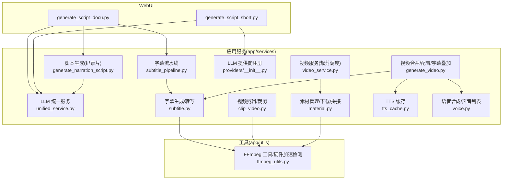
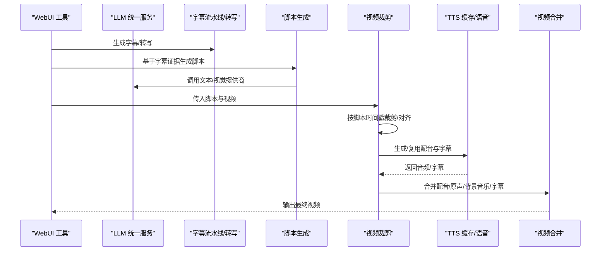
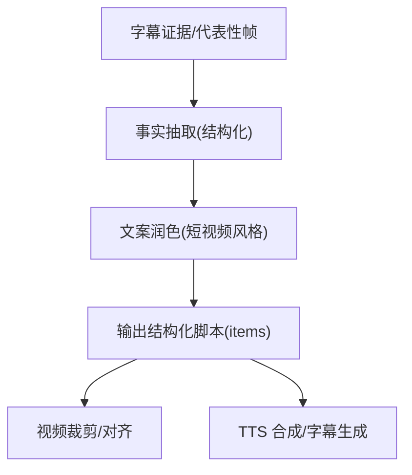
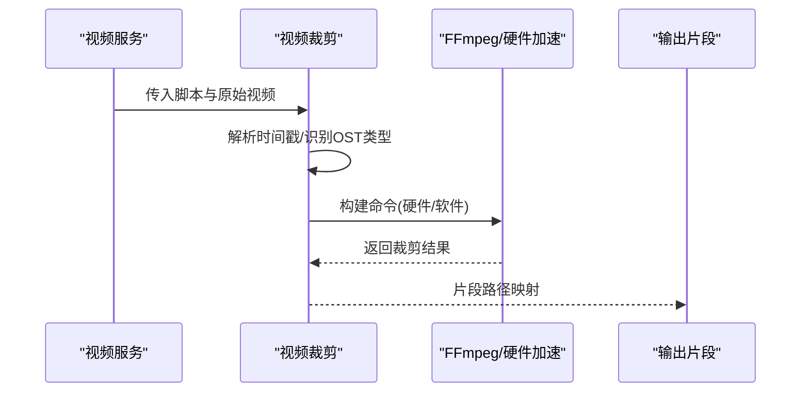
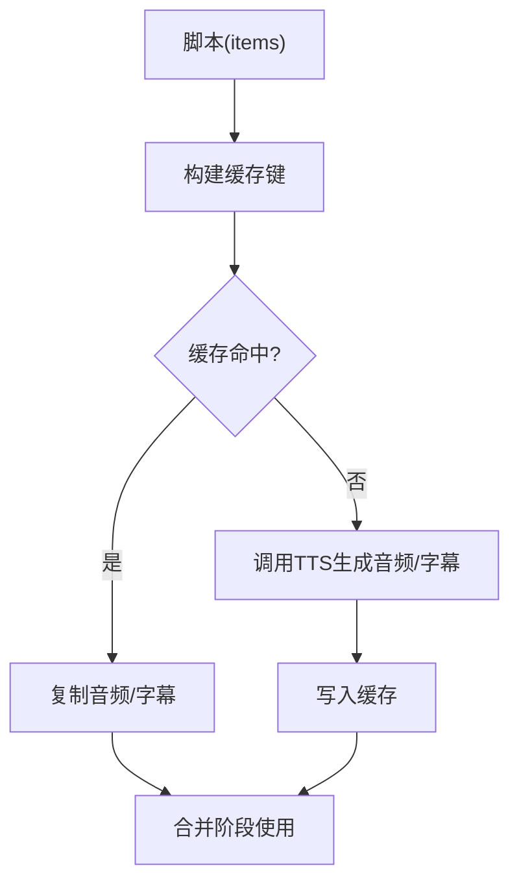
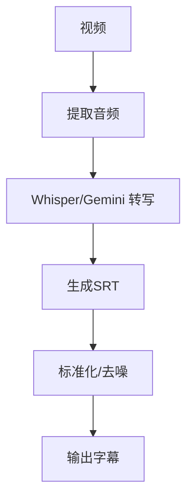
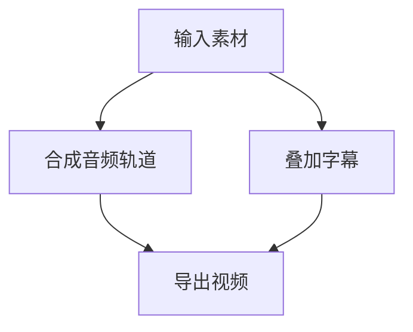
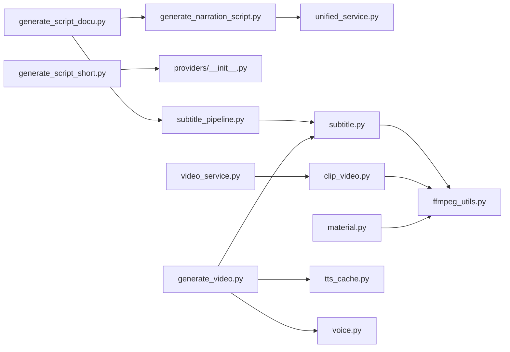

# 核心功能特性

<cite>
**本文引用的文件**
- [README.md](file://README.md)
- [generate_video.py](file://app/services/generate_video.py)
- [unified_service.py](file://app/services/llm/unified_service.py)
- [subtitle_pipeline.py](file://app/services/subtitle_pipeline.py)
- [video_service.py](file://app/services/video_service.py)
- [material.py](file://app/services/material.py)
- [tts_cache.py](file://app/services/tts_cache.py)
- [subtitle.py](file://app/services/subtitle.py)
- [voice.py](file://app/services/voice.py)
- [clip_video.py](file://app/services/clip_video.py)
- [generate_narration_script.py](file://app/services/generate_narration_script.py)
- [providers/__init__.py](file://app/services/llm/providers/__init__.py)
- [generate_script_docu.py](file://webui/tools/generate_script_docu.py)
- [generate_script_short.py](file://webui/tools/generate_script_short.py)
- [ffmpeg_utils.py](file://app/utils/ffmpeg_utils.py)
</cite>

## 目录
1. [简介](#简介)
2. [项目结构](#项目结构)
3. [核心组件](#核心组件)
4. [架构总览](#架构总览)
5. [详细组件分析](#详细组件分析)
6. [依赖关系分析](#依赖关系分析)
7. [性能考量](#性能考量)
8. [故障排查指南](#故障排查指南)
9. [结论](#结论)
10. [附录](#附录)

## 简介
NarratoAI 是一个面向影视解说与自动化剪辑的一站式 AI 工具，围绕“AI 文案生成 + 智能视频剪辑 + TTS 语音合成 + 自动字幕”四大核心能力构建，覆盖从素材上传到成品输出的完整工作流。项目强调模块化设计与多供应商 LLM 管理，支持多平台硬件加速与智能降级，具备良好的扩展性与定制化能力。

## 项目结构
- 应用层（app/services）：封装业务能力，包括 LLM 统一服务、字幕流水线、视频剪辑、TTS 缓存、语音合成、素材管理、视频合并等。
- 工具层（app/utils）：提供 FFmpeg 工具、硬件加速检测、视频处理等底层能力。
- WebUI 层（webui）：提供脚本生成工具（纪录片与短视频）、基础组件与设置项。
- 资源与配置：字体、公开资源、视频/音频/字幕模板与公共资源。

图表来源
- [generate_script_docu.py:23-110](file://webui/tools/generate_script_docu.py#L23-L110)
- [generate_script_short.py:13-128](file://webui/tools/generate_script_short.py#L13-L128)
- [unified_service.py:20-263](file://app/services/llm/unified_service.py#L20-L263)
- [subtitle_pipeline.py:33-64](file://app/services/subtitle_pipeline.py#L33-L64)
- [subtitle.py:26-467](file://app/services/subtitle.py#L26-L467)
- [clip_video.py:143-228](file://app/services/clip_video.py#L143-L228)
- [video_service.py:9-56](file://app/services/video_service.py#L9-L56)
- [material.py:190-254](file://app/services/material.py#L190-L254)
- [tts_cache.py:45-125](file://app/services/tts_cache.py#L45-L125)
- [voice.py:1-800](file://app/services/voice.py#L1-L800)
- [generate_video.py:66-405](file://app/services/generate_video.py#L66-L405)
- [generate_narration_script.py:113-155](file://app/services/generate_narration_script.py#L113-L155)
- [providers/__init__.py:12-44](file://app/services/llm/providers/__init__.py#L12-L44)
- [ffmpeg_utils.py:252-356](file://app/utils/ffmpeg_utils.py#L252-L356)

章节来源
- [README.md:13-180](file://README.md#L13-L180)

## 核心组件
- AI 影视解说系统：基于 LLM 的“事实抽取 + 文案润色”两阶段流程，支持多供应商统一接口与输出校验。
- 智能视频剪辑服务：按脚本时间戳自动裁剪、按 TTS 时长动态对齐、支持纯原声/纯配音/混合三种模式。
- TTS 语音合成：统一 TTS 引擎抽象，支持缓存复用、音量智能匹配与字幕同步。
- 自动字幕生成：Whisper/更快 Whisper 本地模型转写，支持 Gemini 等云端模型，提供字幕纠正与标准化。
- 素材与合并：视频下载/拼接、FFmpeg 硬件加速、字幕/音频/背景音乐合并输出。

章节来源
- [generate_narration_script.py:113-155](file://app/services/generate_narration_script.py#L113-L155)
- [unified_service.py:20-263](file://app/services/llm/unified_service.py#L20-L263)
- [clip_video.py:780-800](file://app/services/clip_video.py#L780-L800)
- [generate_video.py:66-405](file://app/services/generate_video.py#L66-L405)
- [subtitle.py:26-467](file://app/services/subtitle.py#L26-L467)
- [tts_cache.py:45-125](file://app/services/tts_cache.py#L45-L125)
- [material.py:190-254](file://app/services/material.py#L190-L254)

## 架构总览
整体工作流从 WebUI 触发，经 LLM 生成脚本，结合字幕证据与代表性帧分析，形成“时间戳+文案”的脚本；随后按脚本进行视频裁剪与 TTS 合成，最后将配音、原声、背景音乐与字幕合并输出。

图表来源
- [generate_script_docu.py:23-110](file://webui/tools/generate_script_docu.py#L23-L110)
- [generate_script_short.py:13-128](file://webui/tools/generate_script_short.py#L13-L128)
- [unified_service.py:20-263](file://app/services/llm/unified_service.py#L20-L263)
- [subtitle_pipeline.py:33-64](file://app/services/subtitle_pipeline.py#L33-L64)
- [generate_narration_script.py:113-155](file://app/services/generate_narration_script.py#L113-L155)
- [clip_video.py:780-800](file://app/services/clip_video.py#L780-L800)
- [tts_cache.py:45-125](file://app/services/tts_cache.py#L45-L125)
- [generate_video.py:66-405](file://app/services/generate_video.py#L66-L405)

## 详细组件分析

### AI 影视解说系统（LLM 驱动）
- 工作原理
  - 事实抽取：从字幕证据与代表性帧观察中抽取客观事实，输出结构化 items。
  - 文案润色：在保留事实的前提下，生成简洁有吸引力的短视频解说文案。
  - 多供应商统一：通过 LiteLLM 抽象，统一管理文本/视觉提供商，支持多家模型供应商。
- 关键实现
  - LLM 统一服务：提供文本生成、图片分析、输出校验等统一入口。
  - 脚本生成工具：纪录片模式优先使用字幕证据，短视频模式支持外部字幕直传。
  - 提供商注册：集中注册 LiteLLM 统一接口，屏蔽具体实现差异。
- 数据流
  - 字幕证据 + 代表性帧 → 事实抽取 → 润色 → 结构化脚本 → 裁剪/合成。

图表来源
- [generate_narration_script.py:66-111](file://app/services/generate_narration_script.py#L66-L111)
- [generate_narration_script.py:123-155](file://app/services/generate_narration_script.py#L123-L155)
- [unified_service.py:112-160](file://app/services/llm/unified_service.py#L112-L160)
- [providers/__init__.py:12-44](file://app/services/llm/providers/__init__.py#L12-L44)

章节来源
- [generate_narration_script.py:113-155](file://app/services/generate_narration_script.py#L113-L155)
- [unified_service.py:20-263](file://app/services/llm/unified_service.py#L20-L263)
- [providers/__init__.py:12-44](file://app/services/llm/providers/__init__.py#L12-L44)

### 智能视频剪辑服务（自动片段选择与拼接）
- 工作原理
  - 基于脚本的 OST 类型（纯原声/纯配音/混合）分别处理。
  - 对于配音片段，按 TTS 音频时长动态裁剪，确保视频与音频对齐。
  - 支持硬件加速与智能降级，兼容不同平台与 GPU。
- 关键实现
  - 视频裁剪：解析时间戳、构建 FFmpeg 命令、执行并验证输出。
  - 硬件加速：自动检测 NVENC/QSV/AMF/VideoToolbox 等，必要时回退软件编码。
  - 视频服务：对外暴露裁剪接口，负责脚本与片段路径映射。
- 数据流
  - 脚本(items) → 识别 OST 类型 → 动态裁剪 → 生成片段 → 合并输出。

图表来源
- [video_service.py:9-56](file://app/services/video_service.py#L9-L56)
- [clip_video.py:143-228](file://app/services/clip_video.py#L143-L228)
- [clip_video.py:780-800](file://app/services/clip_video.py#L780-L800)
- [ffmpeg_utils.py:252-356](file://app/utils/ffmpeg_utils.py#L252-L356)

章节来源
- [video_service.py:9-56](file://app/services/video_service.py#L9-L56)
- [clip_video.py:780-800](file://app/services/clip_video.py#L780-L800)
- [ffmpeg_utils.py:252-356](file://app/utils/ffmpeg_utils.py#L252-L356)

### TTS 语音合成（多引擎与缓存）
- 工作原理
  - 统一 TTS 引擎抽象，支持缓存命中与缺失项增量生成。
  - 与脚本 items 关联，按时间戳生成音频与字幕，支持音量智能匹配。
- 关键实现
  - TTS 缓存：以文本+语音参数为键，持久化音频与字幕，加速重复生成。
  - 语音合成：提供声音列表与字幕事件生成，配合视频合并。
- 数据流
  - 脚本(items) → 生成缓存键 → 命中/生成音频 → 同步字幕 → 合并输出。

图表来源
- [tts_cache.py:45-125](file://app/services/tts_cache.py#L45-L125)
- [voice.py:1-800](file://app/services/voice.py#L1-L800)

章节来源
- [tts_cache.py:45-125](file://app/services/tts_cache.py#L45-L125)
- [voice.py:1-800](file://app/services/voice.py#L1-L800)

### 自动字幕生成（转写与同步）
- 工作原理
  - 优先使用 Whisper/更快 Whisper 本地模型进行转写，支持 VAD 与词级时间戳。
  - 支持 Gemini 等云端模型转写，提供字幕纠正与标准化。
  - 字幕流水线：支持外挂 SRT 与自动生成两种来源，统一归一化输出。
- 关键实现
  - 字幕生成：提取音频 → 转写 → 生成 SRT。
  - 字幕纠正：与脚本进行相似度匹配与合并，提升对齐精度。
  - 字幕流水线：解析显式字幕路径，若无则自动生成并归一化。
- 数据流
  - 视频 → 提取音频 → 转写 → 标准化/纠正 → 字幕文件。

图表来源
- [subtitle.py:26-467](file://app/services/subtitle.py#L26-L467)
- [subtitle_pipeline.py:33-64](file://app/services/subtitle_pipeline.py#L33-L64)

章节来源
- [subtitle.py:26-467](file://app/services/subtitle.py#L26-L467)
- [subtitle_pipeline.py:33-64](file://app/services/subtitle_pipeline.py#L33-L64)

### 视频合并（配音/原声/背景音乐/字幕）
- 工作原理
  - 合并视频、音频、背景音乐与字幕，支持音量控制、字幕样式与位置。
  - 智能音量匹配：根据 TTS 与原声统计结果，自动调整相对音量比例。
  - 字幕换行与位置：根据视频尺寸与字体进行换行与定位。
- 关键实现
  - 合并函数：加载素材 → 合成音频轨道 → 叠加字幕 → 导出视频。
  - 字体与样式：支持系统字体与描边/背景色等样式参数。
- 数据流
  - 视频/音频/字幕/背景音乐 → 音量/样式处理 → 导出成品。

图表来源
- [generate_video.py:66-405](file://app/services/generate_video.py#L66-L405)

章节来源
- [generate_video.py:66-405](file://app/services/generate_video.py#L66-L405)

### 素材管理与下载（视频拼接）
- 工作原理
  - 支持 Pexels/Pixabay 等来源搜索与下载，按目标时长与分辨率筛选。
  - 下载完成后进行基础校验（时长/帧率），并按随机/顺序模式拼接。
- 关键实现
  - 搜索与下载：统一接口封装，支持代理与超时控制。
  - 拼接：FFmpeg concat 模式，可选择是否保留原声。
- 数据流
  - 搜索条件 → 拉取视频 → 校验 → 拼接 → 输出素材集。

章节来源
- [material.py:190-254](file://app/services/material.py#L190-L254)

## 依赖关系分析

图表来源
- [generate_script_docu.py:23-110](file://webui/tools/generate_script_docu.py#L23-L110)
- [generate_script_short.py:13-128](file://webui/tools/generate_script_short.py#L13-L128)
- [generate_narration_script.py:113-155](file://app/services/generate_narration_script.py#L113-L155)
- [providers/__init__.py:12-44](file://app/services/llm/providers/__init__.py#L12-L44)
- [unified_service.py:20-263](file://app/services/llm/unified_service.py#L20-L263)
- [subtitle_pipeline.py:33-64](file://app/services/subtitle_pipeline.py#L33-L64)
- [subtitle.py:26-467](file://app/services/subtitle.py#L26-L467)
- [ffmpeg_utils.py:252-356](file://app/utils/ffmpeg_utils.py#L252-L356)
- [clip_video.py:143-228](file://app/services/clip_video.py#L143-L228)
- [video_service.py:9-56](file://app/services/video_service.py#L9-L56)
- [material.py:190-254](file://app/services/material.py#L190-L254)
- [generate_video.py:66-405](file://app/services/generate_video.py#L66-L405)
- [tts_cache.py:45-125](file://app/services/tts_cache.py#L45-L125)
- [voice.py:1-800](file://app/services/voice.py#L1-L800)

章节来源
- [generate_script_docu.py:23-110](file://webui/tools/generate_script_docu.py#L23-L110)
- [generate_script_short.py:13-128](file://webui/tools/generate_script_short.py#L13-L128)
- [providers/__init__.py:12-44](file://app/services/llm/providers/__init__.py#L12-L44)
- [unified_service.py:20-263](file://app/services/llm/unified_service.py#L20-L263)
- [subtitle_pipeline.py:33-64](file://app/services/subtitle_pipeline.py#L33-L64)
- [subtitle.py:26-467](file://app/services/subtitle.py#L26-L467)
- [ffmpeg_utils.py:252-356](file://app/utils/ffmpeg_utils.py#L252-L356)
- [clip_video.py:143-228](file://app/services/clip_video.py#L143-L228)
- [video_service.py:9-56](file://app/services/video_service.py#L9-L56)
- [material.py:190-254](file://app/services/material.py#L190-L254)
- [generate_video.py:66-405](file://app/services/generate_video.py#L66-L405)
- [tts_cache.py:45-125](file://app/services/tts_cache.py#L45-L125)
- [voice.py:1-800](file://app/services/voice.py#L1-L800)

## 性能考量
- 硬件加速与降级
  - 自动检测平台与 GPU，优先 NVENC/QSV/AMF/VideoToolbox，失败时回退软件编码，保证稳定性。
  - 视频裁剪场景避免 CUDA 硬件解码导致的滤镜链错误，采用纯 NVENC 编码器方案。
- 编码器与参数
  - 根据硬件类型选择最优编码器与参数组合，兼顾速度与兼容性。
- I/O 与缓存
  - TTS 缓存减少重复生成开销；字幕/关键帧缓存提升分析效率。
- 音量与时长对齐
  - 智能音量匹配与按 TTS 时长动态裁剪，减少人工干预与二次处理。

章节来源
- [ffmpeg_utils.py:252-356](file://app/utils/ffmpeg_utils.py#L252-L356)
- [clip_video.py:143-228](file://app/services/clip_video.py#L143-L228)
- [tts_cache.py:45-125](file://app/services/tts_cache.py#L45-L125)
- [generate_video.py:196-230](file://app/services/generate_video.py#L196-L230)

## 故障排查指南
- FFmpeg 未安装或不可用
  - 现象：无法执行硬件加速检测或视频处理失败。
  - 处理：安装 FFmpeg 并确保在系统 PATH 中。
- 硬件加速不可用或报错
  - 现象：CUDA/AMF/QSV 等报滤镜链或设备错误。
  - 处理：自动回退软件编码；检查驱动与权限；裁剪场景避免硬件解码。
- 字幕生成失败
  - 现象：视频无音频轨道或转写输出为空。
  - 处理：确认视频包含音频；更换 Whisper 模型或云端转写；检查临时文件清理。
- TTS 缓存读取失败
  - 现象：缓存文件损坏或缺失。
  - 处理：清理缓存目录后重试；检查磁盘空间与权限。
- 合并阶段无声或音量异常
  - 现象：导出视频无声音或音量比例不对。
  - 处理：检查音量参数与保留原声设置；启用智能音量匹配。

章节来源
- [ffmpeg_utils.py:118-136](file://app/utils/ffmpeg_utils.py#L118-L136)
- [clip_video.py:230-302](file://app/services/clip_video.py#L230-L302)
- [subtitle.py:383-431](file://app/services/subtitle.py#L383-L431)
- [tts_cache.py:45-95](file://app/services/tts_cache.py#L45-L95)
- [generate_video.py:196-230](file://app/services/generate_video.py#L196-L230)

## 结论
NarratoAI 通过模块化设计与多供应商 LLM 抽象，实现了从“字幕证据 + 代表性帧”到“结构化脚本 + 自动剪辑 + TTS 合成 + 成品输出”的闭环。其在硬件加速、智能降级、缓存复用与音量对齐等方面具备良好工程实践，适合内容创作者高效产出高质量短视频。

## 附录
- WebUI 工具
  - 纪录片脚本生成：优先字幕证据，支持视觉分析与成本控制。
  - 短视频脚本生成：强制上传字幕，直接对接脚本生成流程。
- 未来规划
  - 导出剪映草稿、主角人脸匹配、更多 TTS 引擎支持等。

章节来源
- [generate_script_docu.py:23-110](file://webui/tools/generate_script_docu.py#L23-L110)
- [generate_script_short.py:13-128](file://webui/tools/generate_script_short.py#L13-L128)
- [README.md:89-104](file://README.md#L89-L104)