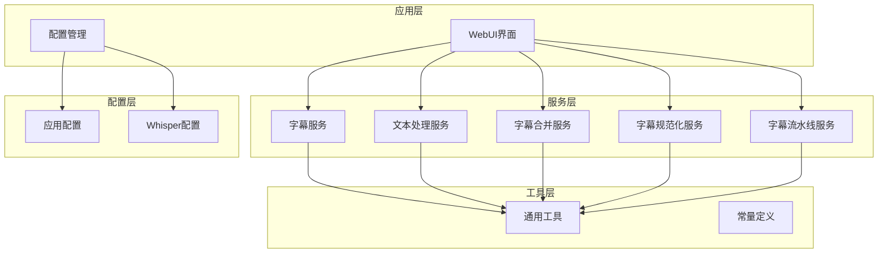
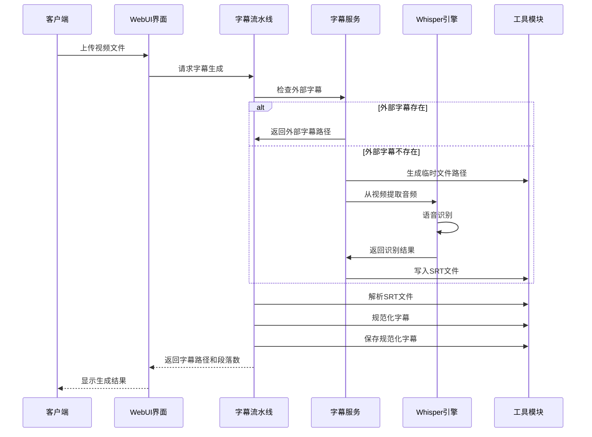
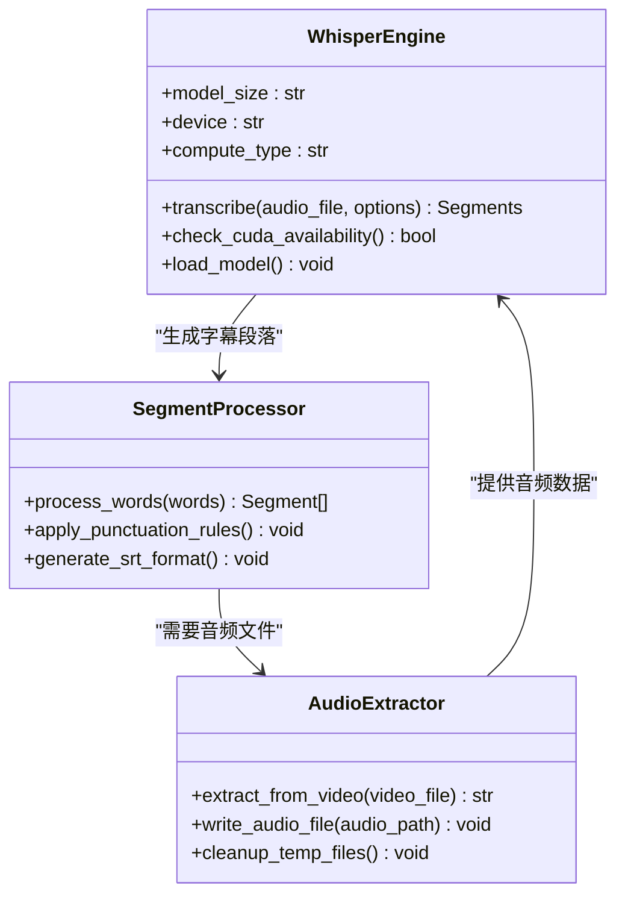
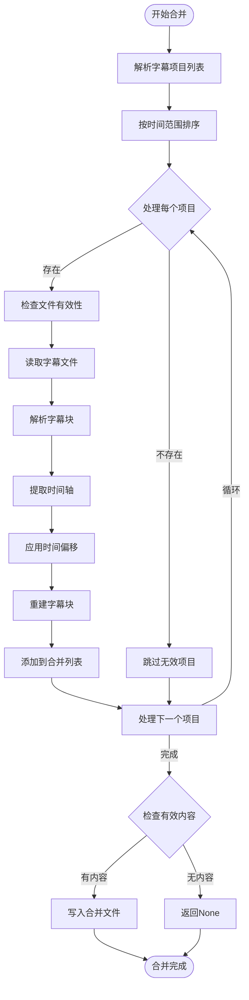
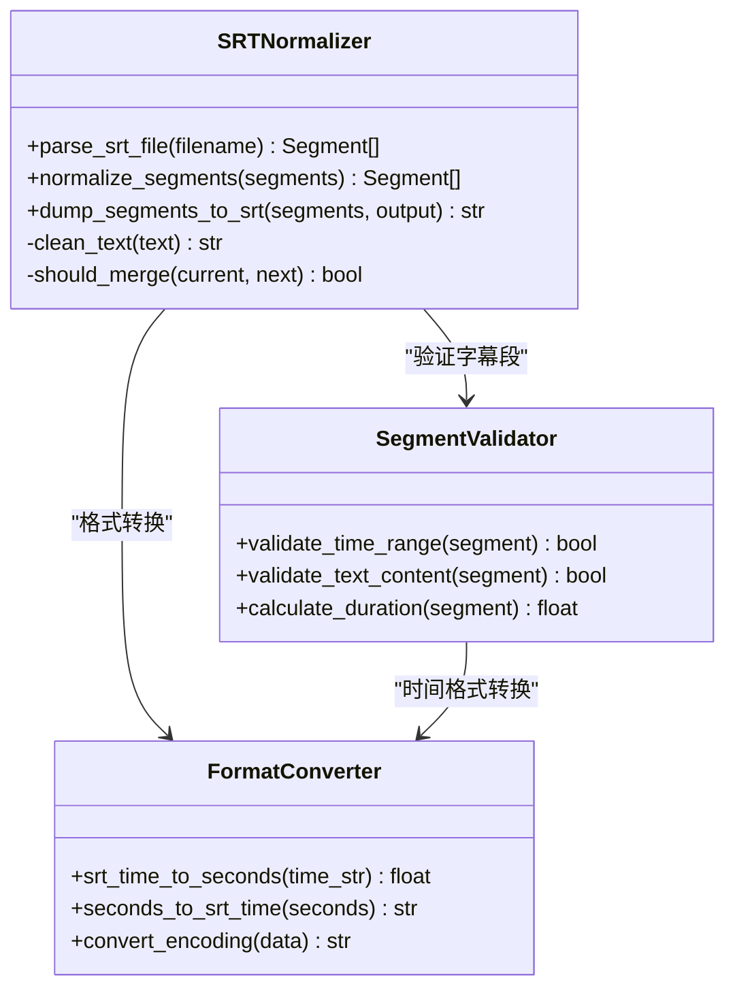
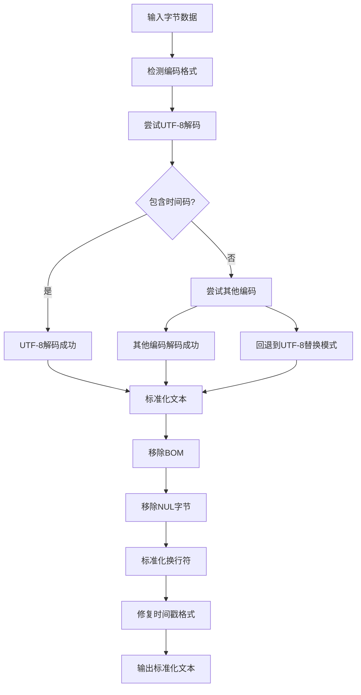
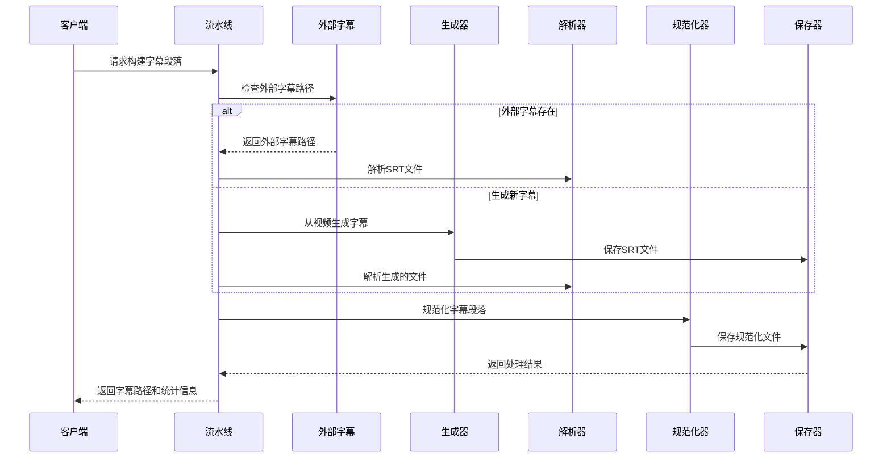
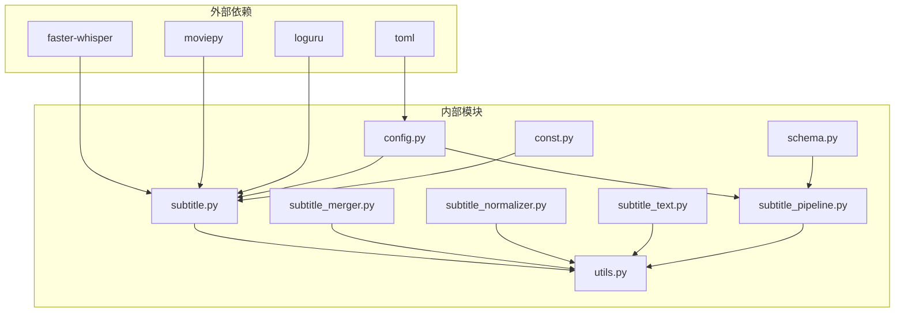

# 自动字幕生成系统

<cite>
**本文档引用的文件**
- [app/services/subtitle.py](file://app/services/subtitle.py)
- [app/services/subtitle_merger.py](file://app/services/subtitle_merger.py)
- [app/services/subtitle_normalizer.py](file://app/services/subtitle_normalizer.py)
- [app/services/subtitle_pipeline.py](file://app/services/subtitle_pipeline.py)
- [app/services/subtitle_text.py](file://app/services/subtitle_text.py)
- [app/utils/utils.py](file://app/utils/utils.py)
- [app/config/config.py](file://app/config/config.py)
- [app/models/schema.py](file://app/models/schema.py)
- [app/models/const.py](file://app/models/const.py)
- [config.example.toml](file://config.example.toml)
- [webui.py](file://webui.py)
- [README.md](file://README.md)
</cite>

## 目录
1. [简介](#简介)
2. [项目结构](#项目结构)
3. [核心组件](#核心组件)
4. [架构概览](#架构概览)
5. [详细组件分析](#详细组件分析)
6. [依赖关系分析](#依赖关系分析)
7. [性能考虑](#性能考虑)
8. [故障排除指南](#故障排除指南)
9. [结论](#结论)
10. [附录](#附录)

## 简介
本系统是一套完整的自动字幕生成解决方案，集成了语音识别、时间戳对齐、字幕格式转换与合并、规范化处理以及质量控制机制。系统支持从视频中提取音频并生成SRT格式字幕，同时提供字幕合并、时间轴校准、字符编码转换与格式统一等功能。系统采用模块化设计，便于扩展和定制。

## 项目结构
系统采用分层架构，主要由以下模块组成：

**图表来源**
- [webui.py:1-294](file://webui.py#L1-L294)
- [app/services/subtitle.py:1-467](file://app/services/subtitle.py#L1-L467)
- [app/services/subtitle_pipeline.py:1-64](file://app/services/subtitle_pipeline.py#L1-L64)

**章节来源**
- [README.md:1-180](file://README.md#L1-L180)
- [webui.py:1-294](file://webui.py#L1-L294)

## 核心组件
系统的核心组件包括：

### 语音识别引擎
- **Whisper集成**: 支持faster-whisper模型，自动检测CUDA可用性
- **多语言支持**: 内置中文语言检测和识别
- **实时字幕**: 支持单词级时间戳生成

### 字幕处理管道
- **字幕生成**: 从音频文件生成SRT字幕
- **字幕合并**: 支持多段字幕文件合并
- **字幕规范化**: 时间轴校准和格式统一
- **字幕文本处理**: 编码转换和跨平台兼容

### 配置管理系统
- **环境配置**: 支持多种API提供商配置
- **模型配置**: Whisper模型参数管理
- **UI配置**: Web界面参数设置

**章节来源**
- [app/services/subtitle.py:26-198](file://app/services/subtitle.py#L26-L198)
- [app/services/subtitle_merger.py:62-185](file://app/services/subtitle_merger.py#L62-L185)
- [app/services/subtitle_normalizer.py:82-154](file://app/services/subtitle_normalizer.py#L82-L154)

## 架构概览
系统采用分层架构设计，各层职责清晰分离：

**图表来源**
- [app/services/subtitle_pipeline.py:33-63](file://app/services/subtitle_pipeline.py#L33-L63)
- [app/services/subtitle.py:383-431](file://app/services/subtitle.py#L383-L431)

## 详细组件分析

### 语音识别组件
语音识别组件负责将音频转换为带时间戳的字幕文本：

**图表来源**
- [app/services/subtitle.py:26-198](file://app/services/subtitle.py#L26-L198)

#### 核心功能特性
- **自动模型加载**: 智能检测CUDA可用性，自动降级到CPU模式
- **多语言支持**: 内置中文语言检测和识别
- **VAD过滤**: 语音活动检测，去除静音段
- **单词级时间戳**: 提供精确的时间对齐

**章节来源**
- [app/services/subtitle.py:38-102](file://app/services/subtitle.py#L38-L102)
- [app/services/subtitle.py:108-176](file://app/services/subtitle.py#L108-L176)

### 字幕合并组件
字幕合并组件支持多段字幕文件的合并和时间轴对齐：

**图表来源**
- [app/services/subtitle_merger.py:62-185](file://app/services/subtitle_merger.py#L62-L185)

#### 核心功能特性
- **时间轴对齐**: 支持基于编辑时间范围的时间偏移
- **多格式支持**: 专注于SRT格式的解析和生成
- **错误处理**: 完善的异常捕获和错误恢复机制
- **批量处理**: 支持多个字幕文件的批量合并

**章节来源**
- [app/services/subtitle_merger.py:16-185](file://app/services/subtitle_merger.py#L16-L185)

### 字幕规范化组件
字幕规范化组件负责时间轴校准和格式统一：

**图表来源**
- [app/services/subtitle_normalizer.py:34-154](file://app/services/subtitle_normalizer.py#L34-L154)

#### 核准规则
- **时间轴校准**: 最小持续时间0.35秒，最大8秒
- **文本长度限制**: 每行最多42个字符
- **合并策略**: 基于时间间隙和标点符号的智能合并
- **格式统一**: 标准化的SRT格式输出

**章节来源**
- [app/services/subtitle_normalizer.py:82-141](file://app/services/subtitle_normalizer.py#L82-L141)

### 字幕文本处理组件
跨平台字幕文本处理确保兼容性：

**图表来源**
- [app/services/subtitle_text.py:69-125](file://app/services/subtitle_text.py#L69-L125)

**章节来源**
- [app/services/subtitle_text.py:40-125](file://app/services/subtitle_text.py#L40-L125)

### 字幕流水线组件
字幕流水线提供完整的处理流程：

**图表来源**
- [app/services/subtitle_pipeline.py:33-63](file://app/services/subtitle_pipeline.py#L33-L63)

**章节来源**
- [app/services/subtitle_pipeline.py:19-63](file://app/services/subtitle_pipeline.py#L19-L63)

## 依赖关系分析
系统依赖关系清晰，模块间耦合度适中：

**图表来源**
- [app/services/subtitle.py:1-15](file://app/services/subtitle.py#L1-L15)
- [app/config/config.py:1-10](file://app/config/config.py#L1-L10)

**章节来源**
- [app/services/subtitle.py:1-15](file://app/services/subtitle.py#L1-L15)
- [app/config/config.py:24-44](file://app/config/config.py#L24-L44)

## 性能考虑
系统在性能方面采用了多项优化策略：

### 模型加载优化
- **延迟加载**: Whisper模型按需加载，避免启动时的资源占用
- **自动降级**: 智能检测CUDA可用性，自动选择最优计算设备
- **缓存机制**: 模型实例全局缓存，避免重复加载

### 处理流程优化
- **异步处理**: 字幕生成支持后台线程处理
- **内存管理**: 及时清理临时文件和音频缓存
- **批量处理**: 支持多字幕文件的批量合并

### 性能监控
- **执行时间记录**: 详细的处理时间统计
- **日志级别控制**: 可配置的日志级别以平衡性能和调试需求

## 故障排除指南
常见问题及解决方案：

### Whisper模型相关问题
- **问题**: 模型文件缺失
  - **解决**: 下载faster-whisper-large-v3模型到app/models目录
  - **预防**: 启动时检查模型文件完整性

- **问题**: CUDA设备不可用
  - **解决**: 系统自动降级到CPU模式
  - **预防**: 确保GPU驱动和CUDA环境正确配置

### 字幕处理问题
- **问题**: 字幕文件编码错误
  - **解决**: 使用字幕文本处理组件自动检测和转换编码
  - **预防**: 统一使用UTF-8编码存储字幕文件

- **问题**: 时间轴不准确
  - **解决**: 使用规范化组件校准时间轴
  - **预防**: 确保音频质量和采样率符合要求

### 系统配置问题
- **问题**: 配置文件加载失败
  - **解决**: 系统自动创建配置文件示例
  - **预防**: 定期备份配置文件

**章节来源**
- [app/services/subtitle.py:42-50](file://app/services/subtitle.py#L42-L50)
- [app/services/subtitle_text.py:110-111](file://app/services/subtitle_text.py#L110-L111)

## 结论
自动字幕生成系统提供了完整、可靠的字幕处理解决方案。系统具有以下优势：

- **技术先进**: 集成最新的语音识别技术和多语言支持
- **功能完整**: 从生成到合并的全流程字幕处理能力
- **兼容性强**: 支持多种字幕格式和跨平台操作
- **易于扩展**: 模块化设计便于功能扩展和定制
- **性能优化**: 多层次的性能优化策略确保高效运行

系统适用于各种视频内容创作场景，能够显著提升字幕生成的效率和质量。

## 附录

### 配置选项说明
系统支持丰富的配置选项：

#### Whisper配置
- `model_size`: 模型大小 (default: "faster-whisper-large-v2")
- `device`: 计算设备 (default: "cpu")
- `compute_type`: 计算精度 (default: "int8")

#### 应用配置
- `llm_vision_timeout`: 视觉模型超时时间 (default: 120秒)
- `llm_text_timeout`: 文本模型超时时间 (default: 180秒)
- `llm_max_retries`: API重试次数 (default: 3次)

### API接口说明
系统提供以下主要API接口：

#### 字幕生成接口
- `create(audio_file, subtitle_file)`: 从音频文件生成字幕
- `extract_audio_and_create_subtitle(video_file, subtitle_file)`: 从视频提取音频并生成字幕
- `create_with_gemini(audio_file, subtitle_file, api_key)`: 使用Gemini生成字幕

#### 字幕处理接口
- `merge_subtitle_files(subtitle_items, output_file)`: 合并多个字幕文件
- `parse_srt_file(filename)`: 解析SRT文件为段落列表
- `normalize_segments(segments)`: 规范化字幕段落

**章节来源**
- [config.example.toml:1-177](file://config.example.toml#L1-L177)
- [app/services/subtitle.py:26-467](file://app/services/subtitle.py#L26-L467)
- [app/services/subtitle_merger.py:62-239](file://app/services/subtitle_merger.py#L62-L239)