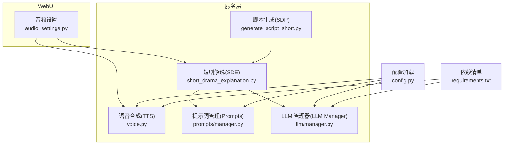
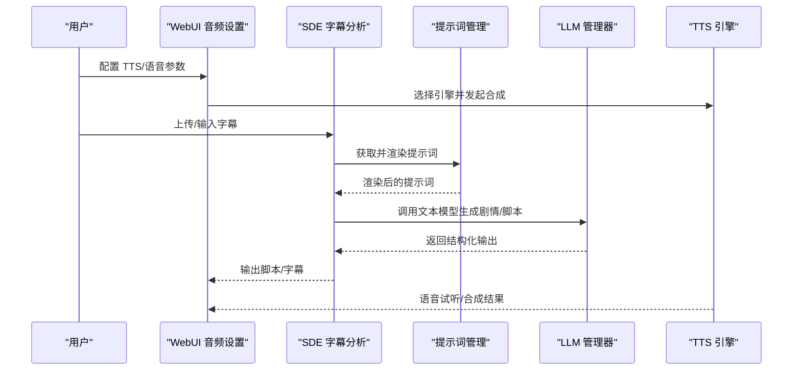
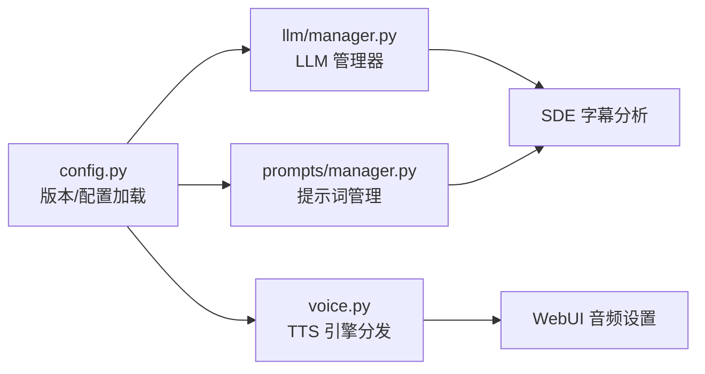

# 版本发展历史

<cite>
**本文引用的文件**
- [README.md](file://README.md)
- [README-en.md](file://README-en.md)
- [requirements.txt](file://requirements.txt)
- [.github/release-drafter.yml](file://.github/release-drafter.yml)
- [app/services/SDE/short_drama_explanation.py](file://app/services/SDE/short_drama_explanation.py)
- [app/services/SDP/generate_script_short.py](file://app/services/SDP/generate_script_short.py)
- [app/services/voice.py](file://app/services/voice.py)
- [webui/components/audio_settings.py](file://webui/components/audio_settings.py)
- [app/config/config.py](file://app/config/config.py)
- [app/services/llm/manager.py](file://app/services/llm/manager.py)
- [app/services/prompts/manager.py](file://app/services/prompts/manager.py)
- [config.example.toml](file://config.example.toml)
</cite>

## 目录
1. [简介](#简介)
2. [项目结构](#项目结构)
3. [核心组件](#核心组件)
4. [架构总览](#架构总览)
5. [详细版本分析](#详细版本分析)
6. [依赖关系分析](#依赖关系分析)
7. [性能与体验优化](#性能与体验优化)
8. [升级与迁移指南](#升级与迁移指南)
9. [故障排查](#故障排查)
10. [结论](#结论)
11. [附录](#附录)

## 简介
本文件系统梳理 NarratoAI 从 v0.3.5 到当前版本 0.7.5 的完整发展轨迹，聚焦于短剧解说、语音克隆、TTS 引擎集成、多模态 LLM 管理与提示词体系等关键里程碑，并结合代码实现与配置文件说明版本演进的技术背景、架构调整与用户升级路径。

## 项目结构
- 顶层入口与配置：通过配置加载模块读取版本号与运行参数，支持多种 TTS 引擎与 LLM 提供商。
- 核心服务层：包含短剧解说（SDE）、视频脚本生成（SDP）、语音合成（TTS）、提示词管理（Prompts）、LLM 服务管理（LLM Manager）等。
- WebUI 层：提供音频设置、语音试听、参数配置等用户交互界面。
- 依赖与生态：通过 requirements 管理第三方库，支持 LiteLLM 统一模型供应商接入。

图表来源
- [app/services/SDE/short_drama_explanation.py:1-778](file://app/services/SDE/short_drama_explanation.py#L1-L778)
- [app/services/SDP/generate_script_short.py:1-126](file://app/services/SDP/generate_script_short.py#L1-L126)
- [app/services/voice.py:1127-2074](file://app/services/voice.py#L1127-L2074)
- [app/services/prompts/manager.py:1-288](file://app/services/prompts/manager.py#L1-L288)
- [app/services/llm/manager.py:1-246](file://app/services/llm/manager.py#L1-L246)
- [app/config/config.py:1-95](file://app/config/config.py#L1-L95)
- [requirements.txt:1-39](file://requirements.txt#L1-L39)

章节来源
- [README.md:35-46](file://README.md#L35-L46)
- [README-en.md:35-42](file://README-en.md#L35-L42)
- [requirements.txt:1-39](file://requirements.txt#L1-L39)

## 核心组件
- 短剧解说（SDE）：提供字幕剧情分析与解说脚本生成，支持原生 Gemini 与 OpenAI 兼容接口，集成提示词管理器与输出校验。
- 视频脚本生成（SDP）：串联字幕解析、剧情分析与脚本合并，提供安全版本返回与向后兼容接口。
- 语音合成（TTS）：统一调度多种 TTS 引擎，包括 Azure/Edge TTS、SoulVoice、Qwen3、IndexTTS2（零样本语音克隆）等。
- 提示词管理（Prompts）：集中化提示词注册、渲染、版本与输出格式校验，支撑 SDE/SDP 等模块的提示词复用。
- LLM 管理器（LLM Manager）：统一注册与获取文本/视觉模型提供商，支持缓存与配置前缀解析。
- 配置加载（config.py）：从文件读取版本号、加载 TOML 配置、注入环境变量（如 ImageMagick/FFmpeg 路径）。

章节来源
- [app/services/SDE/short_drama_explanation.py:23-40](file://app/services/SDE/short_drama_explanation.py#L23-L40)
- [app/services/SDP/generate_script_short.py:12-72](file://app/services/SDP/generate_script_short.py#L12-L72)
- [app/services/voice.py:1127-1154](file://app/services/voice.py#L1127-L1154)
- [app/services/prompts/manager.py:26-80](file://app/services/prompts/manager.py#L26-L80)
- [app/services/llm/manager.py:15-66](file://app/services/llm/manager.py#L15-L66)
- [app/config/config.py:24-95](file://app/config/config.py#L24-L95)

## 架构总览
NarratoAI 的版本演进以“多模态 LLM + 多引擎 TTS + 提示词体系”为核心，围绕短剧场景形成从“字幕分析 → 剧情提炼 → 脚本生成 → 语音合成 → 字幕对齐”的闭环。

图表来源
- [webui/components/audio_settings.py:574-704](file://webui/components/audio_settings.py#L574-L704)
- [app/services/SDE/short_drama_explanation.py:366-404](file://app/services/SDE/short_drama_explanation.py#L366-L404)
- [app/services/prompts/manager.py:34-61](file://app/services/prompts/manager.py#L34-L61)
- [app/services/llm/manager.py:137-208](file://app/services/llm/manager.py#L137-L208)
- [app/services/voice.py:1127-1154](file://app/services/voice.py#L1127-L1154)

## 详细版本分析

### v0.3.5（2024-11-10）
- 里程碑：发布 v0.3.5，优化视频剪辑流程。
- 技术背景：引入 LiteLLM 作为统一 LLM 接口的基础能力，为后续多提供商支持奠定基础。
- 用户影响：剪辑流程更稳定，适合入门用户快速上手。

章节来源
- [README.md](file://README.md#L46)
- [README-en.md](file://README-en.md#L42)

### v0.3.9（2024-12-16）
- 里程碑：支持阿里 Qwen2-VL 模型进行视频理解；支持短剧混剪。
- 技术背景：扩展视觉模型能力，结合 SDP 管线实现“剧情点抽取 + 脚本合并”。
- 用户影响：短剧素材处理能力增强，提升混剪脚本生成质量。

章节来源
- [README.md](file://README.md#L42)
- [README-en.md](file://README-en.md#L38)

### v0.5.2（2025-03-06）
- 里程碑：支持 DeepSeek R1/V3 模型进行短剧混剪。
- 技术背景：LLM 管理器注册机制完善，支持更多提供商与模型组合。
- 用户影响：性价比更高的推理能力，适合中小团队与个人创作者。

章节来源
- [README.md](file://README.md#L41)
- [README-en.md](file://README-en.md#L37)

### v0.6.0（2025-05-11）
- 里程碑：支持短剧解说（SDE），优化剪辑流程。
- 技术背景：SDE 模块引入原生 Gemini/OpenAI 兼容接口，结合提示词管理器与输出校验，确保 JSON 结构化输出。
- 用户影响：新增“剧情分析 → 解说脚本生成”的工作流，显著提升短剧内容生产效率。

章节来源
- [README.md](file://README.md#L40)
- [README-en.md](file://README-en.md#L36)
- [app/services/SDE/short_drama_explanation.py:117-291](file://app/services/SDE/short_drama_explanation.py#L117-L291)

### v0.7.1（2025-08-18）
- 里程碑：支持语音克隆与最新大模型。
- 技术背景：IndexTTS2 零样本语音克隆能力接入，WebUI 提供参考音频上传与参数配置。
- 用户影响：无需训练即可实现高质量语音克隆，满足个性化配音需求。

章节来源
- [README.md](file://README.md#L39)
- [webui/components/audio_settings.py:574-704](file://webui/components/audio_settings.py#L574-L704)
- [app/services/voice.py:2022-2074](file://app/services/voice.py#L2022-L2074)

### v0.7.2（2025-09-10）
- 里程碑：新增腾讯云 TTS。
- 技术背景：TTS 引擎分发逻辑扩展，支持更多厂商服务。
- 用户影响：多厂商覆盖，降低单一服务依赖风险。

章节来源
- [README.md](file://README.md#L38)
- [webui/components/audio_settings.py:706-755](file://webui/components/audio_settings.py#L706-L755)
- [app/services/voice.py:1127-1154](file://app/services/voice.py#L1127-L1154)

### v0.7.3（2025-10-15）
- 里程碑：使用 LiteLLM 管理模型供应商。
- 技术背景：LLM 管理器统一注册与实例化，支持缓存与配置前缀解析，提升可维护性。
- 用户影响：配置更灵活，支持多提供商无缝切换。

章节来源
- [README.md](file://README.md#L37)
- [app/services/llm/manager.py:15-66](file://app/services/llm/manager.py#L15-L66)
- [config.example.toml:37-58](file://config.example.toml#L37-L58)

### v0.7.5（2025-11-20）
- 里程碑：新增 IndexTTS2 语音克隆支持。
- 技术背景：IndexTTS2 API 调用封装，支持参考音频路径解析与重试机制。
- 用户影响：进一步完善语音克隆链路，提升音色一致性与合成稳定性。

章节来源
- [README.md](file://README.md#L36)
- [app/services/voice.py:2022-2074](file://app/services/voice.py#L2022-L2074)
- [app/config/config.py:12-21](file://app/config/config.py#L12-L21)

## 依赖关系分析
- LLM 与提示词：SDE 通过提示词管理器获取渲染后的提示词，再调用 LLM 管理器获取提供商实例，最终返回结构化输出。
- TTS 引擎：WebUI 选择引擎后，voice.py 内部根据引擎类型分发至具体实现（Azure/Edge、SoulVoice、Qwen3、IndexTTS2）。
- 配置与环境：config.py 从文件读取版本号并加载 TOML 配置，同时注入 ImageMagick/FFmpeg 路径，requirements.txt 明确依赖范围。

图表来源
- [app/config/config.py:24-95](file://app/config/config.py#L24-L95)
- [app/services/llm/manager.py:68-208](file://app/services/llm/manager.py#L68-L208)
- [app/services/prompts/manager.py:26-80](file://app/services/prompts/manager.py#L26-L80)
- [app/services/SDE/short_drama_explanation.py:366-404](file://app/services/SDE/short_drama_explanation.py#L366-L404)
- [app/services/voice.py:1127-1154](file://app/services/voice.py#L1127-L1154)
- [webui/components/audio_settings.py:574-704](file://webui/components/audio_settings.py#L574-L704)

章节来源
- [requirements.txt:1-39](file://requirements.txt#L1-L39)
- [config.example.toml:31-58](file://config.example.toml#L31-L58)

## 性能与体验优化
- LLM 调用优化：SDE 在原生 Gemini 与 OpenAI 兼容接口间自动适配，减少跨平台差异带来的不稳定因素。
- TTS 合成优化：IndexTTS2 支持参考音频路径解析与重试机制，提升合成成功率与稳定性。
- 提示词与输出校验：提示词管理器支持 JSON 输出校验，避免下游处理异常。
- 配置与环境：通过 config.py 注入 ImageMagick/FFmpeg 路径，减少外部依赖查找开销。

章节来源
- [app/services/SDE/short_drama_explanation.py:117-291](file://app/services/SDE/short_drama_explanation.py#L117-L291)
- [app/services/voice.py:2022-2074](file://app/services/voice.py#L2022-L2074)
- [app/services/prompts/manager.py:164-202](file://app/services/prompts/manager.py#L164-L202)
- [app/config/config.py:86-94](file://app/config/config.py#L86-L94)

## 升级与迁移指南
- 通用步骤
  - 备份配置：复制现有 config.toml，防止升级覆盖。
  - 拉取代码：使用 git pull 获取最新版本。
  - 安装依赖：执行 pip install -r requirements.txt。
  - 启动应用：根据部署方式启动服务。
- 版本差异与注意事项
  - v0.3.5 → v0.3.9：新增 Qwen2-VL 视频理解与短剧混剪能力，建议更新模型配置与提示词。
  - v0.5.2 → v0.6.0：新增短剧解说（SDE），需配置文本 LLM 与提示词模板。
  - v0.6.0 → v0.7.1：新增语音克隆（IndexTTS2），需配置 API 地址与参考音频。
  - v0.7.1 → v0.7.2：新增腾讯云 TTS，注意厂商 API Key 与速率/音调参数差异。
  - v0.7.2 → v0.7.3：启用 LiteLLM 管理模型供应商，建议统一配置前缀与模型名称。
  - v0.7.3 → v0.7.5：完善 IndexTTS2 支持，建议检查参考音频路径与网络连通性。
- 配置迁移要点
  - 文本/视觉模型配置：参考 config.example.toml 中 text_llm_provider 与 vision_litellm_* 字段。
  - TTS 引擎配置：在 UI 中选择引擎并保存，或在 config.toml 中设置对应字段。
  - 版本号：通过 project_version 文件读取，确保与 README 发布日志一致。

章节来源
- [README-en.md:58-61](file://README-en.md#L58-L61)
- [config.example.toml:31-58](file://config.example.toml#L31-L58)
- [app/config/config.py:12-21](file://app/config/config.py#L12-L21)

## 故障排查
- LLM 调用失败
  - 检查提供商 API Key 与模型名称是否正确。
  - 确认 base_url 与网络连通性。
  - 查看 LLM 管理器缓存与注册状态。
- 提示词渲染失败
  - 检查提示词分类/名称/版本是否存在。
  - 确认模板参数与输出格式配置。
- TTS 合成失败
  - 核对引擎选择与参数（速度/音调）。
  - 对于 IndexTTS2，确认参考音频路径与服务可达性。
- 配置加载异常
  - 检查 config.toml 编码与格式，必要时重新复制 config.example.toml。

章节来源
- [app/services/llm/manager.py:83-134](file://app/services/llm/manager.py#L83-L134)
- [app/services/prompts/manager.py:164-202](file://app/services/prompts/manager.py#L164-L202)
- [app/services/voice.py:2022-2074](file://app/services/voice.py#L2022-L2074)
- [app/config/config.py:24-44](file://app/config/config.py#L24-L44)

## 结论
NarratoAI 的版本演进以“短剧场景为核心”，逐步完善了从“字幕分析 → 剧情提炼 → 脚本生成 → 语音合成 → 字幕对齐”的全链路能力。v0.7.5 在语音克隆与 TTS 引擎扩展方面取得重要进展，配合 LiteLLM 的统一管理与提示词体系，显著提升了系统的可扩展性与用户体验。建议用户在升级时优先完成配置备份与依赖安装，并按版本差异逐步迁移。

## 附录
- 未来规划（摘自 README）：支持导出剪映草稿、主角人脸匹配、根据口播/文案/素材自动匹配、支持更多 TTS 引擎等。
- 社区与文档：可通过官方文档与 Discord 社区获取最新动态与技术支持。

章节来源
- [README.md:89-103](file://README.md#L89-L103)
- [README-en.md:69-83](file://README-en.md#L69-L83)