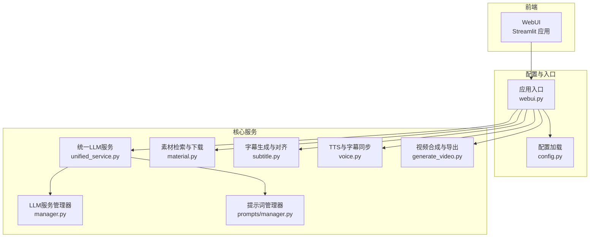
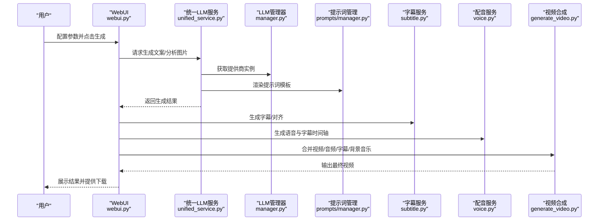
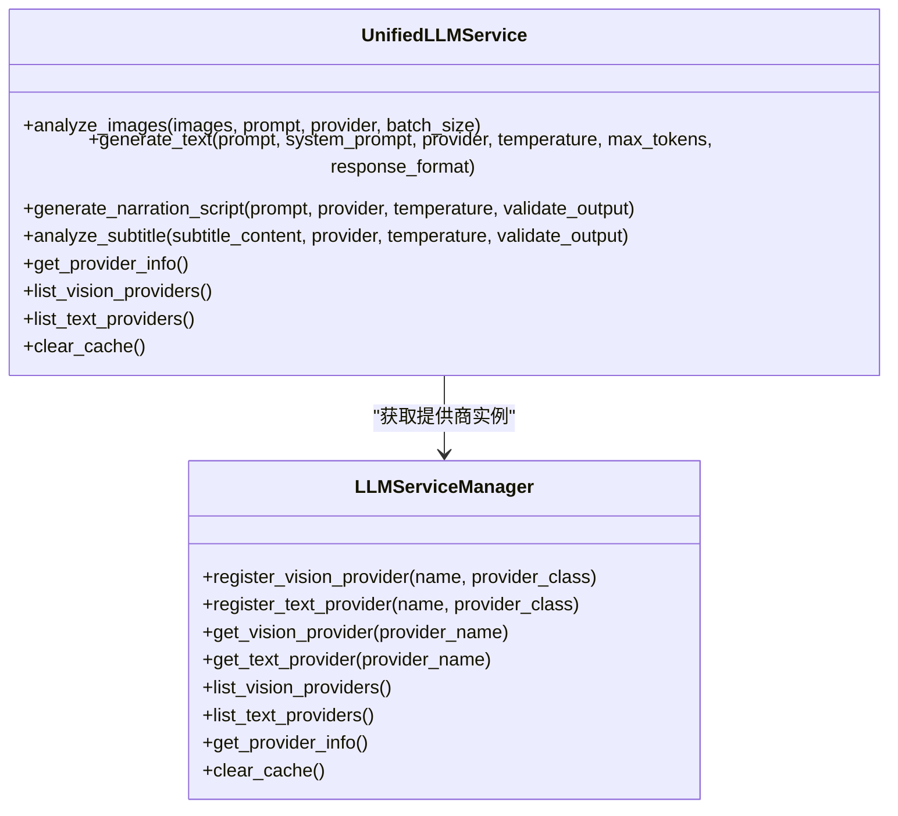
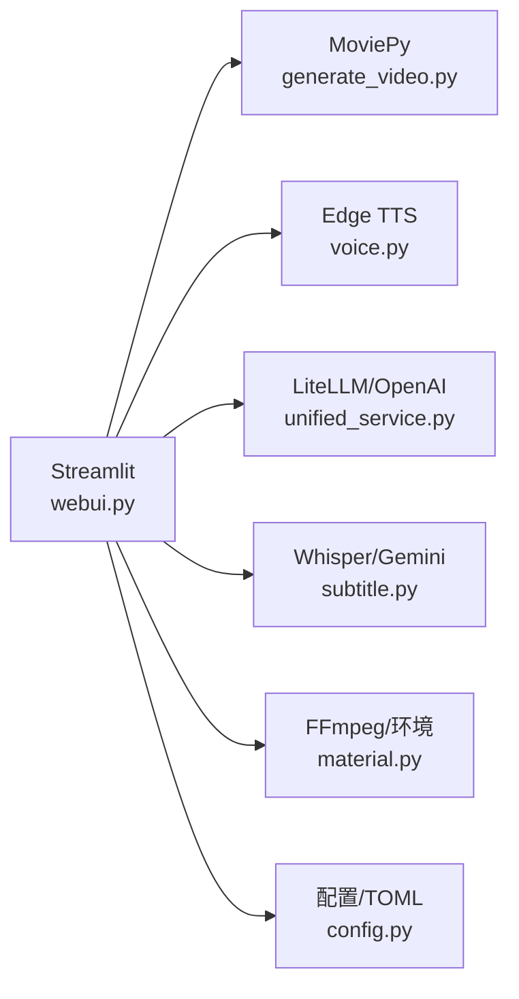

# 项目介绍

<cite>
**本文引用的文件**
- [README.md](file://README.md)
- [README-en.md](file://README-en.md)
- [LICENSE](file://LICENSE)
- [requirements.txt](file://requirements.txt)
- [webui.py](file://webui.py)
- [app/config/config.py](file://app/config/config.py)
- [app/services/llm/unified_service.py](file://app/services/llm/unified_service.py)
- [app/services/llm/manager.py](file://app/services/llm/manager.py)
- [app/services/prompts/manager.py](file://app/services/prompts/manager.py)
- [app/models/schema.py](file://app/models/schema.py)
- [app/services/material.py](file://app/services/material.py)
- [app/services/subtitle.py](file://app/services/subtitle.py)
- [app/services/voice.py](file://app/services/voice.py)
- [app/services/generate_video.py](file://app/services/generate_video.py)
</cite>

## 目录
1. [引言](#引言)
2. [项目结构](#项目结构)
3. [核心组件](#核心组件)
4. [架构总览](#架构总览)
5. [详细组件分析](#详细组件分析)
6. [依赖分析](#依赖分析)
7. [性能考虑](#性能考虑)
8. [故障排查指南](#故障排查指南)
9. [结论](#结论)
10. [附录](#附录)

## 引言
NarratoAI 是一款一站式 AI 影视解说与自动化剪辑工具，围绕“从文案到视频”的完整创作链路，提供基于大模型（LLM）的文案撰写、智能视频剪辑、配音与字幕生成能力，帮助创作者高效产出高质量短视频内容。项目在 MoneyPrinter 重构基础上，新增影视解说能力，持续迭代多模态处理、统一 LLM 接口与智能剪辑算法，形成可扩展、可维护的工程化方案。

- 项目定位：面向内容创作者与中小团队的自动化视频生产平台
- 核心价值：降低门槛、提升效率、统一接口、多模态协同
- 开源与社区：MIT 非商业许可，鼓励社区协作与贡献

章节来源
- [README.md:13](file://README.md#L13)
- [README-en.md:12](file://README-en.md#L12)
- [LICENSE:1-46](file://LICENSE#L1-L46)

## 项目结构
项目采用模块化分层设计，前端通过 Streamlit 提供可视化界面，后端以服务模块为核心，围绕 LLM、提示词管理、素材检索与下载、字幕与配音、视频剪辑与合成等子系统构建。

图表来源
- [webui.py:227-294](file://webui.py#L227-L294)
- [app/config/config.py:24-95](file://app/config/config.py#L24-L95)
- [app/services/llm/unified_service.py:20-263](file://app/services/llm/unified_service.py#L20-L263)
- [app/services/llm/manager.py:15-246](file://app/services/llm/manager.py#L15-L246)
- [app/services/prompts/manager.py:26-288](file://app/services/prompts/manager.py#L26-L288)
- [app/services/material.py:39-580](file://app/services/material.py#L39-L580)
- [app/services/subtitle.py:26-467](file://app/services/subtitle.py#L26-L467)
- [app/services/voice.py:1-800](file://app/services/voice.py#L1-L800)
- [app/services/generate_video.py:66-510](file://app/services/generate_video.py#L66-L510)

章节来源
- [webui.py:1-294](file://webui.py#L1-L294)
- [app/config/config.py:1-95](file://app/config/config.py#L1-L95)

## 核心组件
- 统一大模型服务与提供商管理
  - 统一 LLM 服务接口，屏蔽不同提供商差异，支持文本生成、图片分析、输出校验与提供商信息查询
  - LLM 服务管理器负责提供商注册、实例缓存与配置解析，确保可插拔与可扩展
- 提示词管理
  - 提供提示词注册、搜索、版本管理与输出格式校验，支撑多场景模板化生成
- 素材检索与下载
  - 支持 Pexels/Pixabay 等素材源，按分辨率与时长筛选，自动缓存与去重
- 字幕生成与对齐
  - 支持 Whisper 本地语音识别与 Gemini 在线转写，提供字幕对齐与修正
- 配音与字幕同步
  - 基于 Edge TTS 与多引擎扩展，生成语音与字幕时间轴，保证口播与字幕同步
- 视频合成与导出
  - 统一音量策略、字幕渲染、背景音乐与原声混合，支持多轨道合成与硬件加速

章节来源
- [app/services/llm/unified_service.py:20-263](file://app/services/llm/unified_service.py#L20-L263)
- [app/services/llm/manager.py:15-246](file://app/services/llm/manager.py#L15-L246)
- [app/services/prompts/manager.py:26-288](file://app/services/prompts/manager.py#L26-L288)
- [app/services/material.py:39-580](file://app/services/material.py#L39-L580)
- [app/services/subtitle.py:26-467](file://app/services/subtitle.py#L26-L467)
- [app/services/voice.py:1-800](file://app/services/voice.py#L1-L800)
- [app/services/generate_video.py:66-510](file://app/services/generate_video.py#L66-L510)

## 架构总览
NarratoAI 的整体流程从“脚本生成”到“视频合成”，贯穿 LLM 提示词、素材检索、字幕生成、配音与最终视频导出。前端通过 Streamlit 提供参数配置与任务调度，后端服务模块按职责解耦，通过统一配置与日志体系保障稳定性。

图表来源
- [webui.py:132-224](file://webui.py#L132-L224)
- [app/services/llm/unified_service.py:20-263](file://app/services/llm/unified_service.py#L20-L263)
- [app/services/llm/manager.py:68-209](file://app/services/llm/manager.py#L68-L209)
- [app/services/prompts/manager.py:34-116](file://app/services/prompts/manager.py#L34-L116)
- [app/services/subtitle.py:351-424](file://app/services/subtitle.py#L351-L424)
- [app/services/voice.py:1-800](file://app/services/voice.py#L1-L800)
- [app/services/generate_video.py:66-404](file://app/services/generate_video.py#L66-L404)

## 详细组件分析

### 统一大模型服务与提供商管理
- 统一接口
  - 图片分析、文本生成、解说文案生成、字幕分析等统一入口，内置输出格式校验与错误封装
- 提供商管理
  - 显式注册机制，支持缓存与配置解析，提供提供商列表与信息查询
- 设计要点
  - 解耦不同 LLM 提供商，统一错误处理与日志记录，便于扩展与迁移

图表来源
- [app/services/llm/unified_service.py:20-263](file://app/services/llm/unified_service.py#L20-L263)
- [app/services/llm/manager.py:15-246](file://app/services/llm/manager.py#L15-L246)

章节来源
- [app/services/llm/unified_service.py:20-263](file://app/services/llm/unified_service.py#L20-L263)
- [app/services/llm/manager.py:15-246](file://app/services/llm/manager.py#L15-L246)

### 提示词管理
- 能力
  - 提示词注册、版本管理、模板渲染、输出格式校验与搜索
- 价值
  - 通过模板化与校验机制，确保 LLM 输出稳定、可复用、可审计

章节来源
- [app/services/prompts/manager.py:26-288](file://app/services/prompts/manager.py#L26-L288)

### 素材检索与下载
- 能力
  - Pexels/Pixabay 多源检索，按分辨率与时长筛选，自动缓存与去重
- 价值
  - 降低素材准备成本，提升素材可用性与一致性

章节来源
- [app/services/material.py:39-580](file://app/services/material.py#L39-L580)

### 字幕生成与对齐
- 能力
  - Whisper 本地识别与 Gemini 在线转写，支持字幕对齐、修正与 SRT 输出
- 价值
  - 提升字幕生成质量与与脚本/口播的匹配度

章节来源
- [app/services/subtitle.py:26-467](file://app/services/subtitle.py#L26-L467)

### 配音与字幕同步
- 能力
  - Edge TTS 语音合成，支持多语言/方言与字幕边界生成
- 价值
  - 实现口播与字幕的精准同步，提升观看体验

章节来源
- [app/services/voice.py:1-800](file://app/services/voice.py#L1-L800)

### 视频合成与导出
- 能力
  - 多轨道音频混合（配音、原声、背景音乐）、字幕渲染、智能音量调节、硬件加速编码
- 价值
  - 一键生成高质量视频，兼顾易用性与性能

章节来源
- [app/services/generate_video.py:66-510](file://app/services/generate_video.py#L66-L510)
- [app/models/schema.py:16-209](file://app/models/schema.py#L16-L209)

## 依赖分析
项目依赖以 Python 生态为主，核心包括：
- Web 与界面：Streamlit
- 视频处理：MoviePy、FFmpeg（通过环境变量与工具封装）
- 语音与字幕：Edge TTS、faster-whisper（可选）、Google Generative AI
- LLM 与提示词：LiteLLM、OpenAI、Azure Speech、DashScope、Tencent Cloud
- 工具库：Requests、Loguru、TOML、TQDM、Tenacity 等

图表来源
- [requirements.txt:1-39](file://requirements.txt#L1-L39)
- [webui.py:1-294](file://webui.py#L1-L294)
- [app/services/generate_video.py:16-25](file://app/services/generate_video.py#L16-L25)
- [app/services/voice.py:1-26](file://app/services/voice.py#L1-L26)
- [app/services/llm/unified_service.py:7-14](file://app/services/llm/unified_service.py#L7-L14)
- [app/services/subtitle.py:7-14](file://app/services/subtitle.py#L7-L14)
- [app/services/material.py:12-17](file://app/services/material.py#L12-L17)
- [app/config/config.py:37-44](file://app/config/config.py#L37-L44)

章节来源
- [requirements.txt:1-39](file://requirements.txt#L1-L39)

## 性能考虑
- 硬件加速与编码器选择
  - 通过 FFmpeg 硬件加速检测与最优编码器选择，减少 CPU 压力，提升导出效率
- 智能音量与多轨道混合
  - 基于音频分析的智能音量调整，避免人声与背景音乐冲突，提升听感
- 多线程与进度反馈
  - 任务线程化与进度条展示，改善用户体验
- 本地模型与可选依赖
  - Whisper 本地模型可显著降低网络依赖，按需启用可选依赖（如 OpenCV、PyTorch）

章节来源
- [app/services/generate_video.py:196-230](file://app/services/generate_video.py#L196-L230)
- [app/services/material.py:311-321](file://app/services/material.py#L311-L321)
- [webui.py:177-224](file://webui.py#L177-L224)

## 故障排查指南
- LLM 提供商未注册
  - 现象：初始化失败或功能不可用
  - 处理：确认在应用启动时调用提供商注册流程
- 配置缺失
  - 现象：API Key/模型名/基础地址缺失导致实例创建失败
  - 处理：检查配置文件与环境变量，补齐必要字段
- FFmpeg/硬件加速问题
  - 现象：导出失败或编码器不可用
  - 处理：检测硬件加速状态，回退至软件编码或安装对应编解码器
- 字幕/语音同步异常
  - 现象：字幕与口播不同步
  - 处理：检查 TTS 时长计算与 SubMaker 边界生成，确保时间戳一致
- 日志与调试
  - 使用 Streamlit 页面日志与后端日志，定位具体阶段与错误原因

章节来源
- [app/services/llm/manager.py:83-134](file://app/services/llm/manager.py#L83-L134)
- [webui.py:232-246](file://webui.py#L232-L246)
- [app/services/generate_video.py:386-398](file://app/services/generate_video.py#L386-L398)
- [app/services/voice.py:28-78](file://app/services/voice.py#L28-L78)

## 结论
NarratoAI 以“LLM 驱动 + 多模态协同 + 工程化集成”为核心，覆盖从文案到视频的全链路创作流程。通过统一 LLM 接口、提示词模板化、智能剪辑与硬件加速，项目在易用性、可扩展性与性能之间取得良好平衡。开源与非商业许可鼓励社区参与，适合内容创作者与中小团队快速落地自动化视频生产。

章节来源
- [README.md:13](file://README.md#L13)
- [README-en.md:12](file://README-en.md#L12)
- [LICENSE:1-46](file://LICENSE#L1-L46)

## 附录

### 许可证与使用限制
- 许可证：Modified MIT License - Non-Commercial Use Only
- 使用限制：仅供个人、教育或研究用途；商业使用需事先获得书面授权
- 免责声明：软件按“现状”提供，作者不承担任何责任

章节来源
- [LICENSE:1-46](file://LICENSE#L1-L46)

### 项目发展历程与参考
- 发展历程：从 MoneyPrinter 重构，逐步增加影视解说、短剧混剪、多 TTS 引擎与硬件加速支持
- 参考项目：MoneyPrinter、MoneyPrinterTurbo

章节来源
- [README.md:157-161](file://README.md#L157-L161)
- [README-en.md:99-103](file://README-en.md#L99-L103)