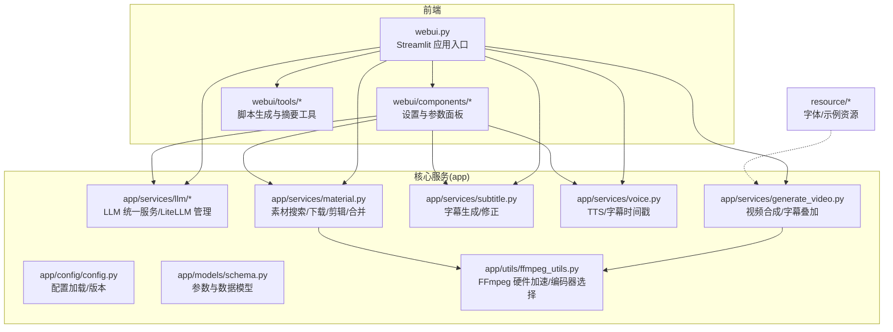
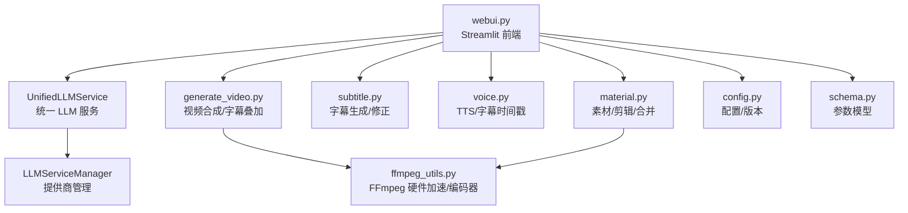
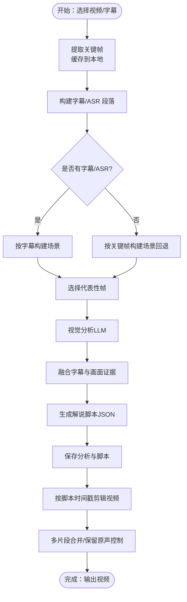
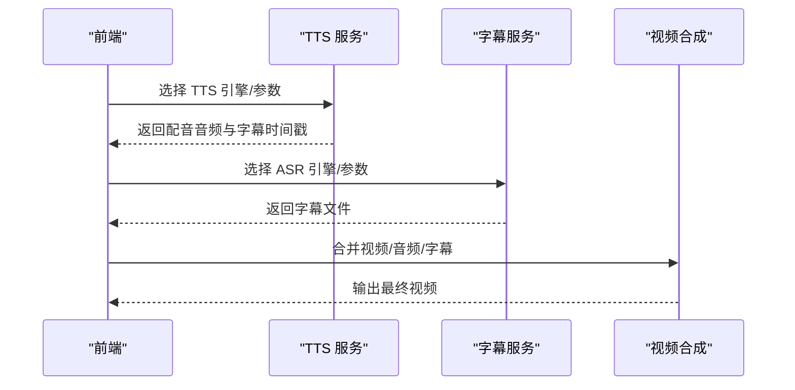
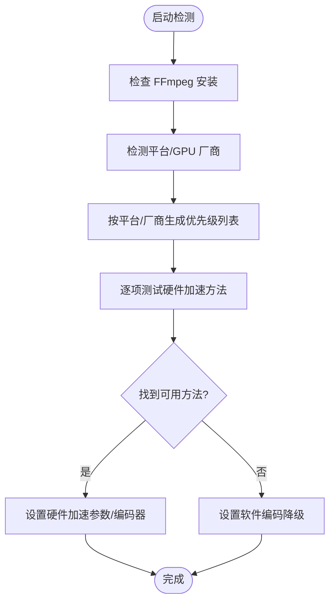
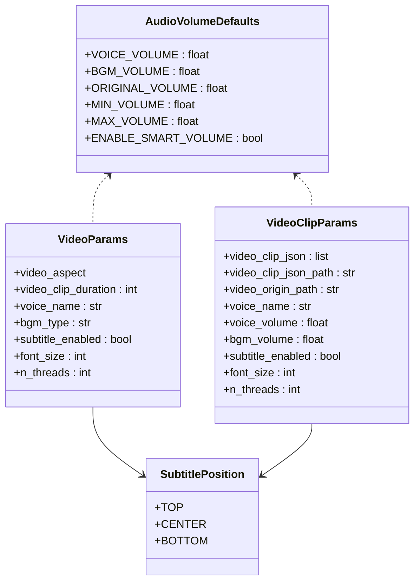
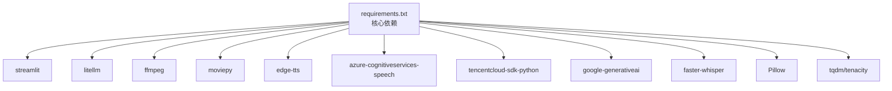

# 项目概述

<cite>
**本文档引用的文件**
- [README.md](file://README.md)
- [webui.py](file://webui.py)
- [requirements.txt](file://requirements.txt)
- [Dockerfile](file://Dockerfile)
- [app/services/llm/unified_service.py](file://app/services/llm/unified_service.py)
- [app/utils/ffmpeg_utils.py](file://app/utils/ffmpeg_utils.py)
- [app/services/generate_video.py](file://app/services/generate_video.py)
- [app/models/schema.py](file://app/models/schema.py)
- [app/config/config.py](file://app/config/config.py)
- [webui/tools/generate_script_docu.py](file://webui/tools/generate_script_docu.py)
- [app/services/material.py](file://app/services/material.py)
- [webui/components/basic_settings.py](file://webui/components/basic_settings.py)
- [app/services/voice.py](file://app/services/voice.py)
- [app/services/subtitle.py](file://app/services/subtitle.py)
</cite>

## 目录
1. [简介](#简介)
2. [项目结构](#项目结构)
3. [核心组件](#核心组件)
4. [架构总览](#架构总览)
5. [详细组件分析](#详细组件分析)
6. [依赖关系分析](#依赖关系分析)
7. [性能考量](#性能考量)
8. [故障排查指南](#故障排查指南)
9. [结论](#结论)
10. [附录](#附录)

## 简介
NarratoAI 是一个面向内容创作者的“一站式 AI 影视解说 + 自动化剪辑”工具，基于大语言模型（LLM）实现文案撰写、自动化视频剪辑、配音与字幕生成的完整工作流。项目提供直观的 Streamlit 前端界面，结合 LiteLLM 统一多供应商 LLM 接口、FFmpeg 多媒体处理能力，以及丰富的 TTS/ASR/字幕工具链，帮助用户高效产出高质量短视频内容。

- 核心价值主张
  - 一体化流程：从视频脚本生成到最终成片，覆盖文案、剪辑、配音、字幕全流程。
  - 多 LLM 供应商：通过 LiteLLM 统一抽象，支持 OpenAI、Gemini、Qwen、SiliconFlow 等多家供应商。
  - 多媒体处理：内置 FFmpeg 硬件加速检测与智能编码器选择，兼顾性能与兼容性。
  - 多引擎 TTS/ASR：支持 Azure、腾讯云、阿里 Qwen、Edge TTS 等多种 TTS 引擎；支持 Whisper 与 Gemini 语音转写。
  - 可视化配置：Streamlit 界面提供语言、代理、LLM、TTS、字幕等参数配置与连通性测试。

- 应用场景与目标用户
  - 内容创作者：快速生成影视解说、短剧剪辑、知识类短视频。
  - 短视频制作团队：标准化脚本生成与剪辑流程，提升生产效率。
  - 影视解说爱好者：低成本、易上手地完成高质量视频制作。

- 发展历程与技术选型
  - 2025.10 起引入 LiteLLM 管理模型供应商，统一多平台 LLM 接口。
  - 2025.08 新增语音克隆与最新大模型支持。
  - 2025.05 新增短剧解说与优化剪辑流程。
  - 2024.12 支持阿里 Qwen2-VL 理解视频，扩展视觉分析能力。
  - 技术选型：Streamlit 前端、LiteLLM 统一 LLM、FFmpeg 多媒体、MoviePy 合成、Edge TTS/Tencent/Azure 等 TTS 引擎、Whisper/Gemini ASR。

**章节来源**
- [README.md:13-46](file://README.md#L13-L46)
- [README.md:105-141](file://README.md#L105-L141)

## 项目结构
项目采用“前端界面 + 核心服务 + 工具模块”的分层组织方式，核心目录与职责如下：
- app：核心业务逻辑与服务层
  - app/config：配置加载与版本管理
  - app/models：数据模型与参数校验
  - app/services：脚本生成、剪辑、TTS、字幕、素材管理等服务
  - app/utils：FFmpeg 工具、图像分析、视频处理等通用工具
- webui：Streamlit 前端组件与工具
  - webui/components：基础设置、脚本/音频/视频/字幕/系统设置面板
  - webui/tools：脚本生成、短剧摘要等工具
  - webui/utils：缓存、文件工具、视觉分析封装
- resource：公共资源（字体、模板、示例视频等）
- Dockerfile/docker-compose：容器化部署与一键运行

**图示来源**
- [webui.py:1-294](file://webui.py#L1-L294)
- [app/config/config.py:1-95](file://app/config/config.py#L1-L95)
- [app/models/schema.py:1-209](file://app/models/schema.py#L1-L209)
- [app/services/llm/unified_service.py:1-263](file://app/services/llm/unified_service.py#L1-L263)
- [app/services/material.py:1-580](file://app/services/material.py#L1-L580)
- [app/services/subtitle.py:1-467](file://app/services/subtitle.py#L1-L467)
- [app/services/voice.py:1-800](file://app/services/voice.py#L1-L800)
- [app/services/generate_video.py:1-510](file://app/services/generate_video.py#L1-L510)
- [app/utils/ffmpeg_utils.py:1-1121](file://app/utils/ffmpeg_utils.py#L1-L1121)

**章节来源**
- [webui.py:227-294](file://webui.py#L227-L294)
- [app/config/config.py:24-95](file://app/config/config.py#L24-L95)

## 核心组件
- Streamlit 前端入口与界面
  - 初始化页面配置、日志、国际化与全局状态，渲染基础/脚本/音频/视频/字幕/系统设置面板，提供“生成视频”按钮与进度反馈。
  - 关键流程：参数收集 → 任务启动 → 状态轮询 → 结果展示。
- LLM 统一服务与 LiteLLM 管理
  - 提供统一的文本/视觉模型调用接口，支持多供应商（OpenAI、Gemini、Qwen、SiliconFlow 等）与模型别名规范化。
  - 管理器负责提供商注册、实例缓存、配置校验与错误处理。
- FFmpeg 工具与硬件加速
  - 自动检测平台与 GPU 厂商，按优先级测试硬件加速方法（CUDA/NVENC、VideoToolbox、QSV、VAAPI、AMF 等），并选择最优编码器，支持软件编码降级。
- 视频脚本生成与剪辑
  - 依据字幕/ASR 主链与关键帧视觉证据，生成解说脚本；支持关键帧提取、场景构建、帧选择、证据融合与脚本形状校验。
  - 提供素材下载、视频剪辑、多片段合并、字幕时间戳对齐与智能音量调整。
- TTS 与字幕
  - 支持多种 TTS 引擎（Azure、腾讯云、Qwen、Edge TTS 等），生成配音与字幕时间戳；字幕模块支持 Whisper/Gemini 语音转写与脚本对齐修正。
- 配置与模型
  - 配置文件加载与版本读取；参数模型统一约束（音量、字幕、分辨率、语音等）。

**章节来源**
- [webui.py:132-224](file://webui.py#L132-L224)
- [app/services/llm/unified_service.py:20-263](file://app/services/llm/unified_service.py#L20-L263)
- [app/services/material.py:39-254](file://app/services/material.py#L39-L254)
- [app/services/subtitle.py:26-198](file://app/services/subtitle.py#L26-L198)
- [app/services/voice.py:28-800](file://app/services/voice.py#L28-L800)
- [app/utils/ffmpeg_utils.py:252-355](file://app/utils/ffmpeg_utils.py#L252-L355)
- [app/models/schema.py:16-209](file://app/models/schema.py#L16-L209)

## 架构总览
整体架构围绕“前端交互 → 统一 LLM → 多媒体处理 → 成片输出”的主线展开，前端负责参数收集与任务调度，服务层负责业务编排，工具层负责底层能力支撑。

**图示来源**
- [webui.py:1-294](file://webui.py#L1-L294)
- [app/services/llm/unified_service.py:1-263](file://app/services/llm/unified_service.py#L1-L263)
- [app/services/material.py:1-580](file://app/services/material.py#L1-L580)
- [app/services/subtitle.py:1-467](file://app/services/subtitle.py#L1-L467)
- [app/services/voice.py:1-800](file://app/services/voice.py#L1-L800)
- [app/services/generate_video.py:1-510](file://app/services/generate_video.py#L1-L510)
- [app/utils/ffmpeg_utils.py:1-1121](file://app/utils/ffmpeg_utils.py#L1-L1121)
- [app/config/config.py:1-95](file://app/config/config.py#L1-L95)
- [app/models/schema.py:1-209](file://app/models/schema.py#L1-L209)

## 详细组件分析

### 组件A：视频脚本生成与剪辑流程
- 功能要点
  - 关键帧提取与缓存、字幕/ASR 主链优先、场景构建、代表性帧选择、视觉证据融合、脚本生成与形状校验。
  - 剪辑：按时间戳裁剪、合并、保留/去除原声、FFmpeg 硬件加速与智能编码器选择。
- 关键流程图

**图示来源**
- [webui/tools/generate_script_docu.py:23-110](file://webui/tools/generate_script_docu.py#L23-L110)
- [app/services/material.py:323-522](file://app/services/material.py#L323-L522)

**章节来源**
- [webui/tools/generate_script_docu.py:23-110](file://webui/tools/generate_script_docu.py#L23-L110)
- [app/services/material.py:323-522](file://app/services/material.py#L323-L522)

### 组件B：TTS 与字幕生成序列
- 功能要点
  - TTS：支持 Azure、腾讯云、Qwen、Edge TTS 等；生成配音与 SRT 字幕时间戳。
  - 字幕：Whisper/Gemini 语音转写；脚本与字幕对齐修正。
- 序列图

**图示来源**
- [app/services/voice.py:1-800](file://app/services/voice.py#L1-L800)
- [app/services/subtitle.py:1-467](file://app/services/subtitle.py#L1-L467)
- [app/services/generate_video.py:1-510](file://app/services/generate_video.py#L1-L510)

**章节来源**
- [app/services/voice.py:1-800](file://app/services/voice.py#L1-L800)
- [app/services/subtitle.py:1-467](file://app/services/subtitle.py#L1-L467)
- [app/services/generate_video.py:1-510](file://app/services/generate_video.py#L1-L510)

### 组件C：FFmpeg 硬件加速检测与编码器选择
- 功能要点
  - 检测平台与 GPU 厂商，按优先级测试硬件加速方法（CUDA/NVENC、VideoToolbox、QSV、VAAPI、AMF 等）。
  - 自动选择最优编码器（NVENC、VideoToolbox、QSV、VAAPI、AMF、libx264），并支持软件编码降级。
- 流程图

**图示来源**
- [app/utils/ffmpeg_utils.py:252-355](file://app/utils/ffmpeg_utils.py#L252-L355)

**章节来源**
- [app/utils/ffmpeg_utils.py:252-355](file://app/utils/ffmpeg_utils.py#L252-L355)

### 组件D：参数模型与全局配置
- 功能要点
  - 统一音量、字幕、分辨率、语音等参数模型，保障全局一致性。
  - 配置文件加载与版本读取，支持环境变量注入（如 ImageMagick/FFmpeg 路径）。
- 类图

**图示来源**
- [app/models/schema.py:16-209](file://app/models/schema.py#L16-L209)

**章节来源**
- [app/models/schema.py:16-209](file://app/models/schema.py#L16-L209)
- [app/config/config.py:24-95](file://app/config/config.py#L24-L95)

## 依赖关系分析
- 核心依赖
  - Streamlit：前端界面与交互。
  - LiteLLM：统一 LLM 接口，支持 100+ 供应商。
  - FFmpeg：视频/音频处理与硬件加速。
  - MoviePy：视频/音频合成与字幕叠加。
  - Edge TTS、Azure Speech、Tencent Cloud SDK：TTS 引擎。
  - faster-whisper/Gemini：ASR 与语音转写。
- 可选依赖
  - Torch/OpenCV：本地语音识别与图像处理（可选）。
- Docker 集成
  - 多阶段构建，安装 ImageMagick/FFmpeg/Wget/Curl/Git-LFS，设置非 root 用户与健康检查，暴露 8501 端口。

**图示来源**
- [requirements.txt:1-39](file://requirements.txt#L1-L39)

**章节来源**
- [requirements.txt:1-39](file://requirements.txt#L1-L39)
- [Dockerfile:1-89](file://Dockerfile#L1-L89)

## 性能考量
- 硬件加速优先：优先使用 NVENC/VideoToolbox/QSV/VAAPI/AMF 等硬件编码器，显著降低 CPU 占用与处理时间。
- 智能编码器选择：根据平台与 GPU 自动选择最优编码器，并在不可用时自动降级为 libx264。
- 多线程与智能音量：视频合成支持多线程，智能音量调整避免 TTS 与原声冲突。
- 关键帧缓存与剪辑优化：关键帧提取结果缓存，避免重复计算；FFmpeg 命令参数按编码器类型优化。
- LLM 与 ASR：LiteLLM 统一接口减少切换成本；Whisper/Gemini ASR 支持本地模型与云端模型切换。

[本节为通用指导，无需具体文件分析]

## 故障排查指南
- LLM 连接失败
  - 检查 API Key、Base URL 与模型名称格式；使用“测试连接”按钮验证；确认提供商是否在 LiteLLM 支持列表中。
  - 清理 LLM 实例缓存后重试。
- FFmpeg 未安装或不可用
  - 确认系统已安装 FFmpeg；查看硬件加速检测日志；若不可用，系统将自动降级为软件编码。
- TTS/字幕生成异常
  - 检查 TTS 引擎配置与网络连通性；确认字幕时间戳与脚本对齐；必要时使用脚本修正功能。
- 视频合成失败
  - 检查输入视频路径与时长；确认 FFmpeg 命令返回码；查看临时文件清理情况。

**章节来源**
- [webui/components/basic_settings.py:221-726](file://webui/components/basic_settings.py#L221-L726)
- [app/utils/ffmpeg_utils.py:118-136](file://app/utils/ffmpeg_utils.py#L118-L136)
- [app/services/subtitle.py:26-198](file://app/services/subtitle.py#L26-L198)
- [app/services/generate_video.py:387-404](file://app/services/generate_video.py#L387-L404)

## 结论
NarratoAI 通过 Streamlit 前端与 LiteLLM 统一 LLM 接口，结合 FFmpeg 多媒体处理能力，构建了从脚本生成到视频合成的完整自动化工作流。其模块化设计与可插拔的供应商体系，使其能够灵活适配不同内容创作需求，同时提供良好的性能与可维护性。随着语音克隆、多引擎 TTS 与短剧剪辑等功能的持续演进，项目将持续提升内容生产的智能化与效率。

[本节为总结，无需具体文件分析]

## 附录
- 快速启动
  - Docker 部署：docker compose up -d；访问 http://localhost:8501。
  - 本地运行：pip 安装依赖、复制配置文件、编辑 API Key、streamlit 运行。
- 配置要求
  - 建议 CPU 4 核+、内存 8G+、显卡非必需；Windows 10/11 或 macOS 11+；Python 3.12+。
- 许可证与社区
  - 仅供学习与研究使用，不得商用；提供 Discord 社区与文档链接；Star 历史可视化。

**章节来源**
- [README.md:105-141](file://README.md#L105-L141)
- [README.md:143-178](file://README.md#L143-L178)